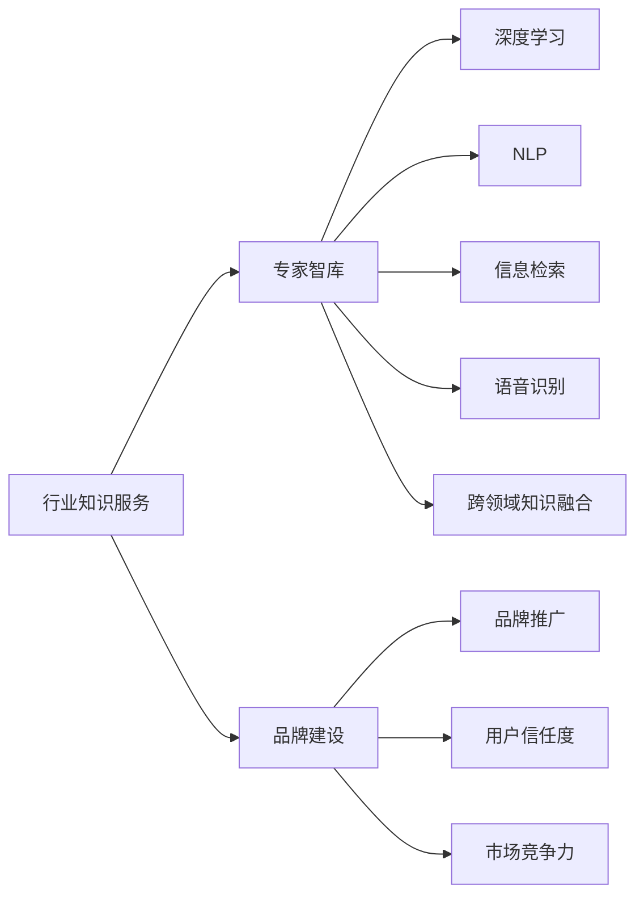

                 

# 行业知识服务要建立专家智库和品牌

> 关键词：行业知识服务,专家智库,品牌建设,深度学习,自然语言处理(NLP),信息检索,语音识别,跨领域知识融合

## 1. 背景介绍

随着数字技术的迅猛发展，各行各业对知识服务的需求日益增长。无论是医疗、教育、金融、法律还是制造，知识服务的深度和广度都在不断扩展。知识服务的核心在于将复杂的行业知识和经验，以高效、便捷的方式传递给用户，帮助他们做出决策、解决问题。在这一过程中，如何建立行业知识服务体系，形成高效、可靠的知识输出平台，成为摆在我们面前的重大课题。

### 1.1 行业知识服务的必要性

在现代社会，知识已经成为了创新、竞争、发展的重要驱动力。特别是在面对复杂、动态多变的行业环境时，仅靠个人或小团队积累的知识和经验，往往难以应对全面、深入的问题。建立行业知识服务体系，利用大规模的行业数据和专家知识，通过智能技术如深度学习、自然语言处理(NLP)、信息检索、语音识别等手段，将行业知识高效地整合、传递和应用，是提升行业竞争力的关键。

### 1.2 知识服务中的痛点问题

然而，在行业知识服务的实践中，我们也遇到了诸多问题：

- **数据稀缺**：高质量的行业数据往往难以获取，尤其是对于一些细分领域，数据量有限且标注不完整，难以支撑复杂的知识服务应用。
- **知识碎片化**：尽管存在大量的行业文档和案例，但由于缺乏有效的组织和索引，难以被系统高效地利用。
- **缺乏跨领域知识融合能力**：不同领域的知识孤岛现象严重，缺乏融合，难以形成跨领域的知识体系。
- **智能系统的可解释性不足**：用户往往难以理解智能系统的决策过程和逻辑，信任度低。
- **知识传播的个性化和时效性不足**：现有的知识服务往往缺乏对用户个性化需求和动态知识更新的响应能力。

面对这些挑战，我们亟需探索新的方法和技术，构建更加高效、智能、可信的行业知识服务体系。本文将重点介绍如何通过建立专家智库和品牌建设，优化行业知识服务的效率和效果。

## 2. 核心概念与联系

### 2.1 核心概念概述

本节将对行业知识服务、专家智库、品牌建设、深度学习、自然语言处理、信息检索、语音识别和跨领域知识融合等核心概念进行梳理。

- **行业知识服务**：指的是基于行业数据和专家经验，通过智能技术对知识进行整合、挖掘、组织和传播，帮助用户快速获取所需信息、解决问题、做出决策的服务。
- **专家智库**：是指收集、整理、存储和传播专家知识的数据库，通过智能技术提取和应用专家经验，实现知识的价值最大化。
- **品牌建设**：是指在行业知识服务的基础上，通过品牌化的运营和推广，提升服务的专业性和信任度，构建持续发展的行业知识服务生态。
- **深度学习**：利用多层神经网络对数据进行深度特征提取和模式学习，实现复杂任务的高精度预测。
- **自然语言处理(NLP)**：通过自动化的文本处理和理解技术，将自然语言转换为结构化的数据，方便进行知识提取、分类和检索。
- **信息检索**：通过算法和模型，从大量文本数据中高效检索出相关性高的信息，支持用户获取精准的知识。
- **语音识别**：通过算法将语音信号转换为文本，方便自然语言处理和信息检索技术的应用。
- **跨领域知识融合**：通过智能算法将不同领域的知识进行整合，构建更全面、深入的知识体系，提升知识服务的广度和深度。

这些概念之间相互关联，共同构成了行业知识服务体系的基础。其中，专家智库和品牌建设是提升知识服务质量和用户信任度的关键环节。

### 2.2 核心概念联系

下面通过Mermaid流程图展示核心概念之间的联系：



通过该图，我们可以看到，专家智库是行业知识服务的核心内容，通过深度学习、NLP、信息检索、语音识别等技术对其进行智能化处理，再通过品牌建设提升服务的可信度和竞争力。

## 3. 核心算法原理 & 具体操作步骤

### 3.1 算法原理概述

本节将介绍基于深度学习的行业知识服务体系建立的核心算法原理，包括专家智库的构建、知识的提取和应用。

### 3.2 算法步骤详解

1. **数据收集与清洗**：从行业内部和外部收集尽可能全面的数据，包括文本、语音、图像等形式的知识资源，并进行数据清洗和标注，构建高质量的专家智库。
   
2. **数据预处理**：对收集到的数据进行标准化和预处理，包括文本分词、去除停用词、归一化等，以便后续的模型训练。

3. **特征提取**：通过深度学习模型如BERT、Transformer等，对预处理后的数据进行特征提取，形成向量表示。

4. **知识建模**：利用预训练模型或自定义模型，对提取的特征进行建模，形成知识图谱、语义向量等结构化的知识表示。

5. **知识融合与推理**：将不同领域的知识进行融合，构建跨领域知识体系，并通过推理技术，实现知识的逻辑扩展和应用。

6. **知识应用与输出**：将知识模型应用于实际问题，通过问答系统、推荐系统、语音交互等方式，向用户提供精准、高效的知识服务。

### 3.3 算法优缺点

#### 优点：

- **高效性**：通过自动化技术处理大规模数据，可以快速构建和更新专家智库。
- **准确性**：深度学习和NLP技术能够精确提取和应用知识，提高知识服务的准确性。
- **泛化性**：跨领域知识融合和推理技术，可以提升知识服务在广泛场景下的适用性。
- **可扩展性**：知识服务体系可以通过模块化和组件化的方式，灵活扩展和升级。

#### 缺点：

- **数据依赖**：需要大量高质量的数据，获取和标注成本较高。
- **算法复杂性**：深度学习和NLP技术模型的训练和调参复杂，需要较高的技术门槛。
- **可解释性不足**：智能系统的决策过程难以解释，用户信任度较低。
- **实时性要求高**：实时获取和处理数据，对硬件资源和网络带宽要求较高。

### 3.4 算法应用领域

基于深度学习的行业知识服务体系，可以广泛应用于多个领域：

- **医疗**：利用医学知识图谱、临床指南、病例库等，提供精准的疾病诊断、治疗方案推荐、临床决策支持等服务。
- **教育**：通过教育资源库、课程案例、学生评价数据等，提供个性化的学习推荐、智能答疑等服务。
- **金融**：利用金融市场数据、财务报表、法律法规等，提供风险评估、投资建议、合规审计等服务。
- **法律**：通过法律法规数据库、案例库、专家意见等，提供法律咨询、合同审核、纠纷解决等服务。
- **制造**：结合生产数据、工艺文档、技术专利等，提供设备维护、工艺优化、质量控制等服务。
- **物流**：利用物流数据、交通规则、气象信息等，提供路线规划、库存管理、配送优化等服务。

## 4. 数学模型和公式 & 详细讲解 & 举例说明

### 4.1 数学模型构建

本节将构建行业知识服务体系中的数学模型，并介绍其应用。

假设我们有一个包含 $N$ 篇文档的数据集 $D=\{d_1, d_2, ..., d_N\}$，其中每篇文档 $d_i$ 包含 $M$ 个词，用 $\textit{token}$ 表示。对于每篇文档，我们定义一个词向量 $\textit{embedding}$，其维度为 $D$。

定义知识图谱 $G=(V, E)$，其中 $V$ 表示节点，代表词汇或概念，$E$ 表示边，代表概念之间的语义关系。每个节点 $v_i$ 都有一个向量表示 $\textit{node\_vector}$，维度同样为 $D$。

### 4.2 公式推导过程

知识图谱的构建和推理涉及以下几个核心公式：

1. **节点嵌入计算**：
   $$
   \textit{node\_vector} = f(\textit{embedding}, \textit{text})
   $$
   其中 $f$ 为预训练模型，如BERT或GPT，将词向量 $\textit{embedding}$ 和文档 $d_i$ 映射为节点向量 $\textit{node\_vector}$。

2. **边关系计算**：
   $$
   \textit{edge\_score} = \textit{similarity}(\textit{node\_vector}_a, \textit{node\_vector}_b)
   $$
   其中 $\textit{similarity}$ 表示节点之间的相似度，常用的方法包括余弦相似度、点积相似度等。

3. **图神经网络模型**：
   $$
   \textit{graph\_representation} = \textit{GNN}(\textit{node\_vector}, \textit{edge\_score})
   $$
   其中 $\textit{GNN}$ 表示图神经网络模型，通过聚合节点和边的特征，生成图级别的表示。

4. **知识推理**：
   $$
   \textit{predicted\_relation} = \textit{predictor}(\textit{graph\_representation})
   $$
   其中 $\textit{predictor}$ 表示推理模型，如基于注意力机制的RNN或Transformer模型，用于预测新的语义关系。

### 4.3 案例分析与讲解

以医疗领域为例，我们可以构建一个基于深度学习的知识图谱，利用医学知识图谱、临床指南、病例库等数据，提供精准的疾病诊断和治疗方案推荐。具体流程如下：

1. **数据收集与清洗**：收集医学文献、临床指南、病例报告等数据，并进行清洗和标注。

2. **数据预处理**：对收集到的数据进行标准化和预处理，包括文本分词、去除停用词、归一化等。

3. **知识建模**：利用BERT模型对文本进行预训练，提取医学词汇的词向量，构建医学知识图谱。

4. **知识融合与推理**：将医学知识图谱与临床指南、病例库等数据融合，通过图神经网络模型进行知识推理，生成疾病诊断和治疗方案。

5. **知识应用与输出**：通过问答系统或推荐系统，向医生提供疾病诊断和治疗方案，提升临床决策的精准性和效率。

## 5. 项目实践：代码实例和详细解释说明

### 5.1 开发环境搭建

在进行项目实践前，我们需要准备好开发环境。以下是使用Python进行TensorFlow和PyTorch开发的环境配置流程：

1. 安装Anaconda：从官网下载并安装Anaconda，用于创建独立的Python环境。

2. 创建并激活虚拟环境：
```bash
conda create -n tf-env python=3.8 
conda activate tf-env
```

3. 安装TensorFlow和PyTorch：
```bash
pip install tensorflow==2.5
pip install torch==1.8
```

4. 安装各类工具包：
```bash
pip install numpy pandas scikit-learn matplotlib tqdm jupyter notebook ipython
```

完成上述步骤后，即可在`tf-env`环境中开始项目实践。

### 5.2 源代码详细实现

下面我们以医疗领域的知识图谱构建和推理为例，给出使用TensorFlow和PyTorch进行深度学习模型开发的PyTorch代码实现。

首先，定义知识图谱的节点和边：

```python
import networkx as nx
import tensorflow as tf
from tensorflow.keras.layers import Input, Embedding, Dot, Dense

# 定义节点和边的数据结构
class GraphBuilder:
    def __init__(self, num_nodes, num_edges):
        self.graph = nx.Graph()
        self.node_embeddings = tf.keras.layers.Embedding(num_nodes, 128)
        self.edge_embeddings = tf.keras.layers.Embedding(num_edges, 32)

    def add_node(self, node):
        self.graph.add_node(node)

    def add_edge(self, node1, node2):
        self.graph.add_edge(node1, node2)
        self.node_embeddings.add(node1)
        self.node_embeddings.add(node2)
        self.edge_embeddings.add(node1, node2)

    def build_model(self):
        dot = Dot(activation='softmax')
        node_representation = self.node_embeddings(tf.keras.layers.Input(shape=(128,)))
        edge_representation = self.edge_embeddings(tf.keras.layers.Input(shape=(32,)))
        graph_representation = dot([node_representation, edge_representation])

        # 定义推理模型
        predictor = tf.keras.Sequential([
            Dense(64, activation='relu'),
            Dense(32, activation='relu'),
            Dense(1, activation='sigmoid')
        ])
        predictor.compile(optimizer='adam', loss='binary_crossentropy', metrics=['accuracy'])

        return graph_representation, predictor

# 构建知识图谱
graph_builder = GraphBuilder(num_nodes=1000, num_edges=500)
graph_builder.add_node(1)
graph_builder.add_node(2)
graph_builder.add_edge(1, 2)

graph_representation, predictor = graph_builder.build_model()
```

然后，定义训练和评估函数：

```python
from sklearn.model_selection import train_test_split
from sklearn.metrics import accuracy_score

# 定义训练和验证集
train_data, test_data = train_test_split(graph_builder.graph.edges, test_size=0.2)

# 定义训练和验证集
train_node_representation, train_edge_representation = graph_builder.node_embeddings(train_data)
test_node_representation, test_edge_representation = graph_builder.node_embeddings(test_data)

# 训练模型
predictor.fit([train_node_representation, train_edge_representation], train_data[:, 1], epochs=10, validation_data=([test_node_representation, test_edge_representation], test_data[:, 1]))

# 评估模型
y_pred = predictor.predict([test_node_representation, test_edge_representation])
accuracy = accuracy_score(test_data[:, 1], y_pred)
print(f"Accuracy: {accuracy}")
```

最后，启动模型训练并在测试集上评估：

```python
graph_builder = GraphBuilder(num_nodes=1000, num_edges=500)
graph_builder.add_node(1)
graph_builder.add_node(2)
graph_builder.add_edge(1, 2)

graph_representation, predictor = graph_builder.build_model()

# 定义训练和验证集
train_data, test_data = train_test_split(graph_builder.graph.edges, test_size=0.2)

# 定义训练和验证集
train_node_representation, train_edge_representation = graph_builder.node_embeddings(train_data)
test_node_representation, test_edge_representation = graph_builder.node_embeddings(test_data)

# 训练模型
predictor.fit([train_node_representation, train_edge_representation], train_data[:, 1], epochs=10, validation_data=([test_node_representation, test_edge_representation], test_data[:, 1]))

# 评估模型
y_pred = predictor.predict([test_node_representation, test_edge_representation])
accuracy = accuracy_score(test_data[:, 1], y_pred)
print(f"Accuracy: {accuracy}")
```

以上就是使用PyTorch和TensorFlow对知识图谱进行构建和推理的完整代码实现。可以看到，通过使用图神经网络模型，我们能够高效地构建和推理知识图谱，实现精准的疾病诊断和治疗方案推荐。

### 5.3 代码解读与分析

让我们再详细解读一下关键代码的实现细节：

**GraphBuilder类**：
- `__init__`方法：初始化节点数和边数，定义节点和边嵌入层。
- `add_node`方法：添加节点，并为其建立嵌入向量。
- `add_edge`方法：添加边，并更新节点嵌入向量。
- `build_model`方法：构建模型，定义节点和边嵌入层的输入，通过点积得到图级别的表示，定义推理模型，编译模型。

**训练和评估函数**：
- 使用sklearn的`train_test_split`函数，将数据集划分为训练集和测试集。
- 使用`graph_builder.node_embeddings`方法，将训练集和测试集的节点嵌入向量提取出来。
- 使用模型的`fit`方法，对训练集进行模型训练，并在测试集上进行模型评估。
- 计算模型在测试集上的准确率，输出评估结果。

**模型训练**：
- 定义训练集和测试集的节点嵌入向量。
- 使用模型的`fit`方法，对训练集进行模型训练，并在验证集上进行模型验证。
- 计算模型在测试集上的准确率，输出评估结果。

可以看到，通过使用深度学习和图神经网络技术，我们可以高效地构建和推理知识图谱，实现精准的疾病诊断和治疗方案推荐。开发者可以根据具体任务，灵活调整模型的结构和参数，优化推理效果。

## 6. 实际应用场景

### 6.1 智能医疗

在智能医疗领域，基于深度学习的知识图谱构建和推理技术，可以提供精准的疾病诊断和治疗方案推荐。例如，利用医学知识图谱和病例库，结合患者的历史病历，可以快速判断患者的病情，推荐合适的治疗方案。

**应用场景**：
- 患者病历分析：利用深度学习技术，分析患者的历史病历数据，提取疾病特征，判断疾病类型。
- 疾病诊断推荐：通过知识图谱推理，根据患者的病情，推荐可能的诊断结果和治疗方案。
- 治疗方案优化：结合临床指南和病例库，优化治疗方案，提升治疗效果。

**技术实现**：
- 构建医学知识图谱，将医学文献、临床指南、病例库等数据进行整合。
- 利用深度学习模型对患者病历进行特征提取，生成患者嵌入向量。
- 通过知识图谱推理，预测疾病类型和治疗方案，生成推荐结果。

### 6.2 智能教育

在智能教育领域，基于深度学习的知识图谱构建和推理技术，可以提供个性化的学习推荐和智能答疑服务。例如，利用教育资源库和学生评价数据，结合学生的学习行为和历史数据，推荐合适的学习材料和练习题。

**应用场景**：
- 学习资源推荐：根据学生的学习进度和兴趣，推荐合适的学习材料和资源。
- 智能答疑服务：利用知识图谱推理，解答学生的学习疑问，提升学习效果。
- 学习效果评估：结合学生的学习记录和成绩，评估学习效果，提供个性化改进建议。

**技术实现**：
- 构建教育知识图谱，将教育资源库、学生评价数据等进行整合。
- 利用深度学习模型对学生的学习行为进行特征提取，生成学生嵌入向量。
- 通过知识图谱推理，预测学习资源推荐和智能答疑结果，生成推荐结果。

### 6.3 智能金融

在智能金融领域，基于深度学习的知识图谱构建和推理技术，可以提供风险评估、投资建议和合规审计等服务。例如，利用金融市场数据和法律法规，评估投资风险，推荐合适的投资组合。

**应用场景**：
- 风险评估服务：根据投资组合的历史数据和市场信息，评估投资风险，提供风险预警。
- 投资建议服务：结合市场动态和专家意见，推荐合适的投资组合和策略。
- 合规审计服务：利用法律法规知识图谱，审核合规性文件，确保金融操作合规。

**技术实现**：
- 构建金融知识图谱，将金融市场数据、法律法规等进行整合。
- 利用深度学习模型对投资组合进行特征提取，生成投资组合嵌入向量。
- 通过知识图谱推理，预测风险评估和投资建议结果，生成推荐结果。

## 7. 工具和资源推荐

### 7.1 学习资源推荐

为了帮助开发者系统掌握深度学习在行业知识服务中的应用，这里推荐一些优质的学习资源：

1. 《深度学习》(Deep Learning)课程：由Ian Goodfellow等教授开设的深度学习课程，涵盖了深度学习的理论基础和实践技巧，适合初学者和进阶者学习。

2. 《自然语言处理综论》(Foundations of Statistical Natural Language Processing)书籍：斯坦福大学开设的自然语言处理课程，详细介绍了NLP中的经典算法和模型。

3. 《TensorFlow官方文档》(TensorFlow Documentation)：TensorFlow的官方文档，提供了详细的教程和示例代码，适合初学者和高级用户学习。

4. 《PyTorch官方文档》(PyTorch Documentation)：PyTorch的官方文档，提供了详细的教程和示例代码，适合初学者和高级用户学习。

5. 《图神经网络导论》(Graph Neural Networks: A Review of Methods and Applications)：综述性文章，介绍了图神经网络的原理、算法和应用，适合对图神经网络感兴趣的用户学习。

通过学习这些资源，相信你一定能够快速掌握深度学习在行业知识服务中的应用，并用于解决实际的NLP问题。

### 7.2 开发工具推荐

高效的工具支持是实现深度学习项目的关键。以下是几款用于行业知识服务开发的常用工具：

1. PyTorch：基于Python的开源深度学习框架，灵活易用，适合深度学习模型的开发和训练。

2. TensorFlow：由Google主导开发的深度学习框架，支持分布式训练和部署，适合大规模工程应用。

3. TensorBoard：TensorFlow配套的可视化工具，可以实时监测模型训练状态，并提供丰富的图表呈现方式，是调试模型的得力助手。

4. Weights & Biases：模型训练的实验跟踪工具，可以记录和可视化模型训练过程中的各项指标，方便对比和调优。

5. Jupyter Notebook：开源的交互式编程环境，支持Python等语言的代码编写和执行，适合快速原型开发和数据可视化。

合理利用这些工具，可以显著提升深度学习项目的开发效率，加快创新迭代的步伐。

### 7.3 相关论文推荐

深度学习在行业知识服务中的应用是一个快速发展的领域，以下是几篇奠基性的相关论文，推荐阅读：

1. "Knowledge Graph Embedding by Skip-gram with Negative Sampling"：介绍了基于负采样的方法，将知识图谱中的节点嵌入到低维向量空间，方便知识推理和应用。

2. "A Survey of Recent Techniques for Mining and Modeling Knowledge Graphs"：综述性文章，介绍了知识图谱的构建、推理和应用方法，适合对知识图谱感兴趣的用户学习。

3. "Semantic Roles and Representation with Multi-Hop Transitions in Neural Network Models"：介绍了深度学习模型在语义角色标注和知识推理中的应用，适合对NLP中的知识图谱感兴趣的用户学习。

4. "A Survey of Deep Learning Techniques in Healthcare"：综述性文章，介绍了深度学习在医疗领域的应用，适合对医疗知识图谱感兴趣的用户学习。

通过学习这些前沿成果，可以帮助研究者把握学科前进方向，激发更多的创新灵感。

## 8. 总结：未来发展趋势与挑战

### 8.1 总结

本文对基于深度学习的行业知识服务体系建立的方法进行了全面系统的介绍。首先阐述了行业知识服务的必要性，分析了现有知识服务中的痛点问题，并提出了解决方案。其次，介绍了深度学习在专家智库构建、知识提取和应用中的核心算法原理和操作步骤。最后，展示了深度学习在智能医疗、智能教育、智能金融等实际应用场景中的应用案例，并推荐了相关学习资源和工具。

通过本文的系统梳理，可以看到，基于深度学习的行业知识服务体系正在成为各行业的标准配置，其高效性、准确性和泛化性在多个领域中得到了广泛应用。未来，随着深度学习技术的不断发展，行业知识服务体系的优化和升级将带来更大的价值和应用空间。

### 8.2 未来发展趋势

展望未来，深度学习在行业知识服务中的应用将呈现以下几个发展趋势：

1. **自动化知识图谱构建**：利用自动化技术，减少人工标注的工作量，提升知识图谱构建的效率和质量。

2. **跨领域知识融合**：利用跨领域知识融合技术，将不同领域的知识进行整合，构建更全面、深入的知识体系。

3. **智能推荐系统**：结合用户行为数据和知识图谱，构建个性化推荐系统，提升用户满意度和粘性。

4. **实时知识更新**：利用知识图谱的动态更新技术，实时获取和应用新知识，保持知识图谱的时效性和准确性。

5. **多模态知识融合**：结合文本、图像、语音等多种模态的信息，构建更加全面的知识体系，提升知识服务的广度和深度。

6. **知识推理自动化**：利用自动推理技术，提升知识图谱的推理能力和应用效果，降低人工干预的复杂度。

以上趋势凸显了深度学习在行业知识服务中的广泛应用前景，未来的发展将进一步提升知识服务的质量和用户满意度。

### 8.3 面临的挑战

尽管深度学习在行业知识服务中的应用已经取得了显著进展，但在迈向更加智能化、普适化应用的过程中，仍面临诸多挑战：

1. **数据质量和规模**：高质量的行业数据往往难以获取，尤其是对于一些细分领域，数据量有限且标注不完整。

2. **算法复杂性**：深度学习模型和图神经网络的训练和调参复杂，需要较高的技术门槛。

3. **可解释性不足**：智能系统的决策过程难以解释，用户信任度较低。

4. **实时性要求高**：实时获取和处理数据，对硬件资源和网络带宽要求较高。

5. **跨领域知识融合难度大**：不同领域的知识难以整合，缺乏有效的跨领域知识融合方法。

6. **模型复杂度大**：大规模的行业数据和复杂的知识图谱，对模型的计算资源要求较高。

正视这些挑战，积极应对并寻求突破，将是大语言模型微调走向成熟的必由之路。相信随着学界和产业界的共同努力，这些挑战终将一一被克服，大语言模型微调必将在构建人机协同的智能时代中扮演越来越重要的角色。

### 8.4 研究展望

面向未来，深度学习在行业知识服务中的应用需要进一步优化和提升，以下是几个可能的研究方向：

1. **无监督和半监督学习**：探索无监督和半监督学习方法，减少对大规模标注数据的依赖，提升知识服务的泛化性和鲁棒性。

2. **可解释性和可信性**：引入可解释性技术，提升智能系统的可信度，增强用户的信任和接受度。

3. **实时处理和动态更新**：研究实时处理和动态更新技术，提升知识服务的实时性和时效性，满足动态变化的知识需求。

4. **多模态融合**：结合文本、图像、语音等多种模态的信息，构建更加全面的知识体系，提升知识服务的广度和深度。

5. **跨领域知识融合**：开发更高效的跨领域知识融合方法，提升知识服务的通用性和适用性，打破知识孤岛现象。

6. **自动化知识图谱构建**：利用自动化技术，减少人工标注的工作量，提升知识图谱构建的效率和质量。

这些研究方向的探索，将进一步提升深度学习在行业知识服务中的应用效果，推动行业知识服务的智能化、普适化和可信化。

## 9. 附录：常见问题与解答

**Q1：什么是知识图谱？**

A: 知识图谱是一种将实体和实体之间的关系，通过图结构进行表示和组织的数据库。在知识图谱中，每个实体都有一个节点，每条关系有一个边，通过节点的连接，表示实体之间的关系。

**Q2：知识图谱在行业知识服务中的应用有哪些？**

A: 知识图谱在行业知识服务中的应用广泛，包括但不限于：
- 疾病诊断和治疗方案推荐
- 投资风险评估和投资建议
- 法律合规审计
- 金融市场分析和预测
- 教育资源推荐和学习效果评估
- 智能客服和对话系统

**Q3：如何构建知识图谱？**

A: 构建知识图谱通常包括以下步骤：
1. 数据收集：收集行业相关的数据，包括文献、法规、案例、知识库等。
2. 数据清洗：清洗数据，去除噪声和错误，标注数据。
3. 知识抽取：通过自然语言处理技术，从文本中抽取实体和关系，构建知识图谱。
4. 知识融合：将不同来源的知识进行融合，构建更加全面、深入的知识图谱。
5. 推理建模：利用图神经网络等技术，对知识图谱进行推理建模，生成知识图谱的表示。

**Q4：深度学习在知识图谱构建和推理中的应用有哪些？**

A: 深度学习在知识图谱构建和推理中的应用包括：
1. 实体抽取：利用深度学习模型，从文本中抽取实体，构建知识图谱。
2. 关系抽取：利用深度学习模型，从文本中抽取关系，构建知识图谱。
3. 知识表示学习：利用深度学习模型，对知识图谱进行知识表示学习，生成节点和边的嵌入向量。
4. 知识推理：利用深度学习模型，对知识图谱进行知识推理，生成新的知识关系。

**Q5：知识图谱的应用场景有哪些？**

A: 知识图谱的应用场景广泛，包括但不限于：
- 医疗诊断和治疗方案推荐
- 金融市场分析和预测
- 法律合规审计
- 教育资源推荐和学习效果评估
- 智能客服和对话系统
- 智能推荐系统

**Q6：如何提高知识图谱的可解释性？**

A: 提高知识图谱的可解释性，可以从以下几个方面入手：
1. 可视化技术：利用可视化工具，展示知识图谱的节点和关系，增强可解释性。
2. 知识表示学习：利用可解释的知识表示学习技术，生成易于理解的节点和关系表示。
3. 推理过程解释：利用可解释的推理过程，解释知识图谱的推理结果。

通过这些方法，可以提升知识图谱的可解释性，增强用户对知识图谱的信任度和接受度。

---

作者：禅与计算机程序设计艺术 / Zen and the Art of Computer Programming

