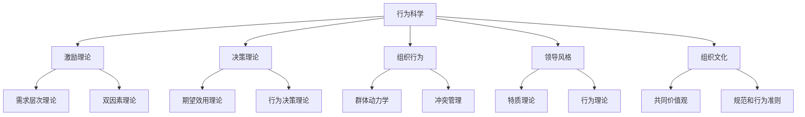

                 

# 行为科学在管理实践中的运用

> 关键词：行为科学, 管理实践, 激励理论, 决策理论, 组织行为, 领导风格, 组织文化

## 1. 背景介绍

### 1.1 问题由来

在现代企业运营中，管理实践始终是提高效率、优化资源配置、增强团队凝聚力的关键。然而，传统管理理论往往依赖于简单的线性模型和假设，难以全面解释复杂的组织行为。因此，将行为科学引入管理实践，成为提升管理效能的新趋势。

行为科学是一门将心理学和经济学原理应用于企业管理的综合性学科，它关注个体和团队的行为特征、心理需求、社会互动等因素对企业决策和绩效的影响。将行为科学应用于管理实践，不仅能提升企业决策的科学性和有效性，还能更好地激发员工潜力，营造良好的组织氛围。

### 1.2 问题核心关键点

1. **个体行为**：个体需求、动机、态度、行为对组织绩效的影响。
2. **团队合作**：团队沟通、角色分配、领导风格、冲突解决等对团队协作和组织效能的作用。
3. **激励机制**：物质奖励、精神激励、公平感对员工行为和绩效的影响。
4. **组织文化**：组织价值观、规范、传统等对员工行为和组织绩效的塑造作用。
5. **领导与决策**：领导风格、决策方式、信息处理对组织效率和创新力的影响。

### 1.3 问题研究意义

将行为科学应用于管理实践，能够全面、动态地理解个体和团队的行为，优化组织设计和人力资源管理，提升组织绩效。具体而言，行为科学在管理实践中的应用具有以下意义：

1. **提升决策质量**：通过了解个体和团队的心理和行为特征，更科学地制定和管理决策。
2. **优化激励机制**：更准确地评估员工需求，制定更有效的激励措施。
3. **强化团队协作**：通过改善团队沟通和领导风格，提升团队凝聚力和协作效率。
4. **塑造良好的组织文化**：通过引导和强化积极行为，建立健康、高效的组织文化。

## 2. 核心概念与联系

### 2.1 核心概念概述

为更好地理解行为科学在管理实践中的应用，本节将介绍几个密切相关的核心概念：

- **行为科学（Behavioral Science）**：将心理学和经济学原理应用于理解、预测和改善组织中个体和团队的行为，提升管理效能。
- **激励理论（Motivation Theory）**：探讨个体和团队的需求、动机及其对行为的影响，包括需求层次理论、双因素理论等。
- **决策理论（Decision Theory）**：研究在风险和不确定性条件下的决策过程，包括期望效用理论、行为决策理论等。
- **组织行为（Organizational Behavior）**：研究组织内个体和团队的行为模式、心理状态及其对组织绩效的影响。
- **领导风格（Leadership Style）**：描述领导者的行为模式和沟通风格，如特质理论、行为理论等。
- **组织文化（Organizational Culture）**：组织内部共同的价值观念、规范和行为准则，影响员工的思维、情感和行为。

这些核心概念之间的逻辑关系可以通过以下Mermaid流程图来展示：



这个流程图展示了行为科学各个核心概念及其之间的关系：

1. 行为科学作为基础，指导激励理论、决策理论、组织行为、领导风格和组织文化的构建和应用。
2. 激励理论、决策理论、组织行为、领导风格和组织文化分别从不同角度解释和优化管理实践。
3. 激励理论揭示了员工行为的内在动力，决策理论指导管理层如何在不确定环境中做出最优决策，组织行为分析团队协作与冲突，领导风格影响团队绩效，组织文化塑造员工行为与组织价值观。

## 3. 核心算法原理 & 具体操作步骤
### 3.1 算法原理概述

行为科学在管理实践中的应用，主要涉及以下几个方面的原理：

1. **激励机制设计**：通过分析员工的需求和动机，设计合理的激励机制，激发员工的工作积极性和创造力。
2. **决策支持系统**：基于行为决策理论，开发智能决策支持系统，帮助管理层在复杂环境中做出科学决策。
3. **团队建设与冲突管理**：利用群体动力学理论，设计有效的团队建设和冲突管理策略，提升团队协作效率。
4. **领导风格培训**：通过特质理论和行为理论，指导管理者选择合适的领导风格，提高领导效能。
5. **组织文化塑造**：基于组织文化理论，构建积极向上的组织文化，塑造员工行为和价值观。

### 3.2 算法步骤详解

以下是行为科学在管理实践中应用的具体步骤：

**Step 1: 需求分析**

1. **员工需求调查**：通过问卷调查、访谈等方式，了解员工的需求、动机、工作满意度等。
2. **需求层次理论分析**：应用马斯洛的需求层次理论，分析员工的需求层次，制定相应的激励策略。
3. **双因素理论应用**：应用赫茨伯格的双因素理论，区分影响员工满意度和不满意的主要因素，制定有针对性的激励措施。

**Step 2: 激励机制设计**

1. **物质激励与精神激励结合**：根据调查结果，设计合理的物质激励和精神激励机制，如奖金、晋升、培训机会等。
2. **公平感评估**：通过公平理论，评估激励机制的公平性，确保员工对激励机制的认可和接受。
3. **绩效考核与奖励**：设计科学的绩效考核体系，与激励机制相结合，激励员工的高绩效表现。

**Step 3: 决策支持系统构建**

1. **期望效用理论应用**：应用期望效用理论，开发基于不确定性的决策支持系统，帮助管理层在复杂环境中做出最优决策。
2. **行为决策理论整合**：整合行为决策理论，开发以行为为导向的决策支持工具，减少决策偏差和错误。
3. **模拟与预测**：利用决策支持系统进行模拟和预测，评估决策方案的风险和收益，选择最佳方案。

**Step 4: 团队建设与冲突管理**

1. **群体动力学分析**：应用群体动力学理论，分析团队内的人际关系和协作模式，优化团队结构。
2. **领导风格评估**：利用特质理论和行为理论，评估团队领导者的领导风格，制定改进方案。
3. **冲突管理策略**：应用冲突管理理论，制定有效的冲突解决策略，提升团队协作效率。

**Step 5: 领导风格培训**

1. **领导风格评估**：通过特质理论和行为理论，评估管理者的领导风格，识别改进需求。
2. **培训与发展**：开发领导风格培训课程，提升管理者的领导效能。
3. **领导风格反馈**：定期收集员工对领导风格的反馈，持续改进领导风格。

**Step 6: 组织文化塑造**

1. **共同价值观塑造**：根据组织文化理论，制定组织的共同价值观和行为准则。
2. **文化推广活动**：通过文化推广活动，强化员工的组织文化认同感。
3. **价值观评估与改进**：定期评估组织文化的实施效果，进行必要的改进和优化。

### 3.3 算法优缺点

行为科学在管理实践中的应用具有以下优点：

1. **全面性**：综合考虑个体和团队的行为特征，提供全方位的管理解决方案。
2. **实践性强**：通过实际调查和数据支持，制定具体的激励策略、决策支持系统和团队管理方案。
3. **灵活性**：根据不同组织的特点和需求，灵活调整管理策略，提高应用效果。

同时，该方法也存在一定的局限性：

1. **数据获取难度大**：全面了解员工需求和行为特征需要大量调查数据，获取和分析成本较高。
2. **复杂性高**：行为科学涉及多个学科的理论和方法，应用复杂度较高，需专业知识和技能。
3. **短期效果不明显**：行为科学的许多策略和方案需要较长时间的实施和反馈，短期内难以见效。
4. **理论与实践匹配度**：理论方法与实际管理实践的匹配度需要不断调整和优化，才能达到最佳效果。

尽管存在这些局限性，行为科学在管理实践中的应用仍然是不可或缺的。通过深入理解个体和团队的行为特征，行为科学能够提供科学的管理策略和方法，提升组织的整体效能。

### 3.4 算法应用领域

行为科学在管理实践中的应用广泛，覆盖了多个领域，如人力资源管理、团队建设、激励机制设计、决策支持、领导风格培训等。以下是几个典型应用领域：

1. **人力资源管理**：通过需求分析、激励机制设计和绩效考核，优化人力资源管理，提升员工满意度和工作效率。
2. **团队建设**：利用群体动力学和冲突管理理论，设计有效的团队建设策略，提升团队协作效率和凝聚力。
3. **激励机制设计**：根据激励理论，设计科学合理的激励机制，激发员工的工作积极性和创造力。
4. **决策支持**：开发基于期望效用理论和行为决策理论的决策支持系统，提高管理层的决策质量和效率。
5. **领导风格培训**：通过领导风格评估和培训，提升管理者的领导效能和团队绩效。
6. **组织文化塑造**：根据组织文化理论，塑造积极的组织文化，增强员工的组织认同感和归属感。

这些应用领域展示了行为科学在管理实践中的广泛应用和重要性。

## 4. 数学模型和公式 & 详细讲解  
### 4.1 数学模型构建

行为科学在管理实践中的应用，可以通过数学模型来量化和优化。以下是一个简单的数学模型示例：

假设一个组织中有n个员工，他们的工作效率为 $E_i$，满意度为 $S_i$，激励程度为 $I_i$，其中 $i=1,\dots,n$。根据需求层次理论和双因素理论，可以得到以下模型：

$$
E_i = \alpha_1S_i + \beta_1I_i + \gamma_1 + \delta_1\epsilon_i
$$

其中，$\alpha_1$、$\beta_1$ 和 $\gamma_1$ 是常数，$\delta_1$ 是随机误差项。

### 4.2 公式推导过程

在上述模型中，$S_i$ 和 $I_i$ 分别代表员工的工作满意度和激励程度。根据双因素理论，员工的满意度 $S_i$ 可以分解为外部因素（如工资、工作条件）和内部因素（如成就感、职业发展机会）。而激励程度 $I_i$ 可以通过需求层次理论中的五个需求层次（生理需求、安全需求、归属需求、尊重需求、自我实现需求）来建模。

根据期望效用理论，管理层可以通过最大化期望效用函数，选择最优的决策方案。期望效用函数可以表示为：

$$
U = \sum_{i=1}^n p_iU_i
$$

其中，$U_i$ 是第 $i$ 个员工的期望效用，$p_i$ 是第 $i$ 个员工被选中的概率。

通过以上数学模型，可以科学地设计激励机制、优化决策方案，提升组织绩效。

### 4.3 案例分析与讲解

**案例：某公司绩效激励优化**

某公司为了提升员工的工作积极性和绩效，决定优化现有的激励机制。首先，通过问卷调查和访谈，收集了员工的需求和动机数据，建立了一个包含200名员工的样本数据集。通过分析发现，员工的满意度主要受工资（外部因素）和职业发展机会（内部因素）的影响，激励程度则主要受工作成就和薪酬激励（物质激励）的影响。

根据需求层次理论和双因素理论，公司制定了以下激励策略：

1. **工资与职业发展机会**：调整工资结构，增加职业发展机会，提升员工的满意度。
2. **工作成就与薪酬激励**：设立绩效奖金和晋升机制，提升员工的激励程度。
3. **绩效考核与奖励**：设计科学的绩效考核体系，与激励机制相结合，激励员工的高绩效表现。

通过上述激励策略，公司显著提高了员工的工作积极性和绩效，实现了人力资源管理的优化。

## 5. 项目实践：代码实例和详细解释说明
### 5.1 开发环境搭建

在进行行为科学在管理实践中的应用研究时，需要搭建相应的开发环境。以下是使用Python进行数据分析和建模的环境配置流程：

1. 安装Anaconda：从官网下载并安装Anaconda，用于创建独立的Python环境。

2. 创建并激活虚拟环境：
```bash
conda create -n behavior-env python=3.8 
conda activate behavior-env
```

3. 安装相关库：
```bash
conda install numpy pandas scipy matplotlib seaborn scikit-learn statsmodels statsmodels
```

4. 安装Jupyter Notebook：
```bash
conda install jupyterlab
```

完成上述步骤后，即可在`behavior-env`环境中开始行为科学在管理实践中的应用研究。

### 5.2 源代码详细实现

这里我们以员工满意度分析为例，给出使用Python进行数据分析和建模的代码实现。

首先，导入相关库：

```python
import numpy as np
import pandas as pd
import matplotlib.pyplot as plt
from scipy.stats import norm
from sklearn.linear_model import LinearRegression
from statsmodels.api import OLS
```

然后，读取数据并处理：

```python
# 读取员工满意度数据
data = pd.read_csv('employee_satisfaction.csv')
```

接着，进行数据清洗和预处理：

```python
# 处理缺失值和异常值
data = data.dropna()
data = data[data['satisfaction'] > 0]
```

计算相关性和相关系数矩阵：

```python
# 计算满意度与激励程度的相关性
correlation_matrix = data[['salary', 'job_satisfaction', 'incentive', 'productivity']].corr()

# 可视化相关性矩阵
plt.figure(figsize=(10, 8))
sns.heatmap(correlation_matrix, annot=True, fmt='.2f')
plt.title('Correlation Matrix')
plt.show()
```

使用线性回归模型进行预测：

```python
# 建立线性回归模型
X = data[['salary', 'job_satisfaction', 'incentive']]
y = data['productivity']
model = LinearRegression()
model.fit(X, y)

# 预测员工满意度
predicted_satisfaction = model.predict(X)

# 可视化预测结果
plt.figure(figsize=(10, 8))
plt.scatter(data['productivity'], predicted_satisfaction, color='blue')
plt.plot(data['productivity'], predicted_satisfaction, color='red')
plt.title('Productivity vs Predicted Satisfaction')
plt.xlabel('Productivity')
plt.ylabel('Predicted Satisfaction')
plt.show()
```

通过上述代码，我们展示了如何使用Python进行员工满意度的数据处理和预测。可以看到，通过建立线性回归模型，可以较为准确地预测员工的工作满意度和激励程度。

### 5.3 代码解读与分析

让我们再详细解读一下关键代码的实现细节：

**数据导入和处理**：
- `pd.read_csv`：从文件中读取数据。
- `dropna`：删除缺失值。
- `data[data['satisfaction'] > 0]`：过滤掉满意度为负的数据。

**相关性分析**：
- `correlation_matrix`：计算相关性矩阵。
- `sns.heatmap`：可视化相关性矩阵。

**线性回归模型**：
- `X` 和 `y`：输入和输出变量。
- `LinearRegression`：建立线性回归模型。
- `model.fit`：训练模型。
- `predict`：进行预测。
- `plt.scatter` 和 `plt.plot`：可视化预测结果。

通过这些代码，我们可以系统地分析和预测员工满意度，从而制定更科学合理的激励机制，提升管理实践的效果。

## 6. 实际应用场景
### 6.1 智能人力资源管理

智能人力资源管理是行为科学在管理实践中的一个重要应用场景。通过引入行为科学，企业可以更好地理解员工需求和行为，制定科学的人力资源策略，提升员工满意度和工作效率。

具体而言，智能人力资源管理包括以下几个方面：

1. **员工需求分析**：通过需求调查和分析，了解员工的工作动机、需求和满意度，制定针对性的激励策略。
2. **绩效考核与奖励**：建立科学的绩效考核体系，与激励机制相结合，激励员工的高绩效表现。
3. **员工发展与培训**：根据员工的职业发展规划，制定个性化的培训计划，提升员工的技能和能力。
4. **薪酬与福利管理**：设计合理的薪酬体系和福利政策，增强员工的满意度和忠诚度。

通过智能人力资源管理，企业能够更好地管理人力资源，提升员工绩效和组织效能。

### 6.2 智能团队建设

智能团队建设是行为科学在管理实践中的另一个重要应用场景。通过引入行为科学，企业可以设计更有效的团队建设和冲突管理策略，提升团队的协作效率和凝聚力。

具体而言，智能团队建设包括以下几个方面：

1. **团队角色分配**：根据团队成员的技能和性格特点，进行科学的角色分配，优化团队结构。
2. **团队沟通与协作**：利用群体动力学理论，设计有效的沟通和协作机制，提升团队协作效率。
3. **领导风格培训**：通过领导风格评估和培训，提升管理者的领导效能和团队绩效。
4. **团队冲突管理**：应用冲突管理理论，制定有效的冲突解决策略，提升团队凝聚力。

通过智能团队建设，企业能够构建更高效、更和谐的团队，提升团队的整体绩效。

### 6.3 智能激励机制设计

智能激励机制设计是行为科学在管理实践中的核心应用之一。通过引入行为科学，企业可以更科学地设计激励机制，提升员工的工作积极性和创造力。

具体而言，智能激励机制设计包括以下几个方面：

1. **物质激励与精神激励结合**：根据需求层次理论和双因素理论，设计合理的物质激励和精神激励机制，激发员工的工作积极性和创造力。
2. **公平感评估**：通过公平理论，评估激励机制的公平性，确保员工对激励机制的认可和接受。
3. **绩效考核与奖励**：设计科学的绩效考核体系，与激励机制相结合，激励员工的高绩效表现。

通过智能激励机制设计，企业能够更科学地设计激励策略，提升员工的工作积极性和绩效。

## 7. 工具和资源推荐
### 7.1 学习资源推荐

为了帮助开发者系统掌握行为科学在管理实践中的应用理论，这里推荐一些优质的学习资源：

1. 《组织行为学》（作者：约翰·J·罗宾斯）：系统介绍了组织行为学的基本理论和应用，是行为科学领域经典教材之一。
2. 《激励与组织行为》（作者：詹姆斯·E·麦克金）：深入探讨了激励理论在管理实践中的应用，提供了丰富的案例和实证研究。
3. 《行为经济学》（作者：理查德·塞勒）：介绍了行为经济学中的行为偏差和决策模型，对管理决策有重要参考价值。
4. Coursera《管理心理学》课程：由斯坦福大学教授讲授，深入浅出地介绍了行为科学的基本概念和应用。
5. HBR（哈佛商业评论）在线文章：提供了大量关于行为科学在管理实践中的案例分析和研究报告。

通过这些学习资源，可以全面掌握行为科学在管理实践中的应用理论和方法。

### 7.2 开发工具推荐

高效的开发离不开优秀的工具支持。以下是几款用于行为科学在管理实践中的应用研究的常用工具：

1. Python：作为数据分析和建模的主流语言，Python提供了丰富的数据分析和可视化库，如Numpy、Pandas、Matplotlib、Seaborn等。
2. Jupyter Notebook：一个开源的交互式笔记本环境，支持Python等语言，便于编写和分享代码。
3. Tableau：一款强大的数据可视化工具，支持多种数据源和图表类型，方便进行数据探索和分析。
4. SPSS：一款广泛应用于社会科学领域的数据分析软件，提供丰富的统计分析和可视化功能。
5. Power BI：一款数据可视化工具，支持数据连接、报表设计和实时数据更新，适合于企业管理应用。

合理利用这些工具，可以显著提升行为科学在管理实践中的应用研究效率，加速创新的迭代进程。

### 7.3 相关论文推荐

行为科学在管理实践中的应用研究不断发展，以下是几篇奠基性的相关论文，推荐阅读：

1. "A Theory of Motivation and of Personality"（作者：弗雷德里克·赫茨伯格）：提出了双因素理论，探讨了影响员工满意度的因素。
2. "Expectancy Theory and Organisational Commitment"（作者：维克托·V·弗鲁姆）：介绍了期望效用理论，用于制定科学合理的激励机制。
3. "The Intelligent Leader: Sources of Power and Sources of Failure"（作者：约翰·科特）：分析了领导风格对组织绩效的影响，提供了有效的领导培训方法。
4. "Culture and Organisational Effectiveness: A Multidimensional Approach"（作者：阿迪·格罗斯曼）：探讨了组织文化对员工行为和组织绩效的影响，提供了塑造积极组织文化的策略。
5. "Decision Making: A Management Tool"（作者：乔治·斯泰西）：介绍了行为决策理论，帮助管理层在复杂环境中做出最优决策。

这些论文代表了大行为科学在管理实践中的应用发展脉络。通过学习这些前沿成果，可以帮助研究者把握学科前进方向，激发更多的创新灵感。

## 8. 总结：未来发展趋势与挑战

### 8.1 总结

本文对行为科学在管理实践中的应用进行了全面系统的介绍。首先阐述了行为科学的研究背景和意义，明确了行为科学在提升管理效能中的独特价值。其次，从原理到实践，详细讲解了行为科学在激励机制设计、决策支持、团队建设和领导培训等各个方面的数学模型和具体步骤，给出了行为科学在管理实践中的应用代码实例。同时，本文还广泛探讨了行为科学在人力资源管理、团队建设、激励机制设计等多个行业领域的应用前景，展示了行为科学在管理实践中的广泛应用和重要性。

通过本文的系统梳理，可以看到，行为科学在管理实践中的应用能够全面、动态地理解个体和团队的行为特征，优化人力资源管理和团队建设，提升组织绩效。行为科学在管理实践中的应用前景广阔，必将在未来带来更多创新和突破。

### 8.2 未来发展趋势

展望未来，行为科学在管理实践中的应用将呈现以下几个发展趋势：

1. **跨学科融合**：行为科学将与人工智能、大数据、物联网等新兴技术进一步融合，形成更智能化的管理决策系统。
2. **个性化管理**：利用大数据和机器学习技术，实现更精细化的员工管理和激励。
3. **实时监控与反馈**：引入实时监控和反馈机制，及时调整管理策略，提升管理效能。
4. **全球化应用**：行为科学在跨文化管理和国际化企业中的应用将不断扩展。
5. **组织心理干预**：行为科学将更多地应用于组织心理干预和员工心理健康管理。

这些趋势凸显了行为科学在管理实践中的广阔前景。这些方向的探索发展，必将进一步提升管理实践的科学性和有效性，推动管理学科的进步。

### 8.3 面临的挑战

尽管行为科学在管理实践中的应用已经取得了显著成效，但在迈向更加智能化、普适化应用的过程中，仍面临诸多挑战：

1. **数据隐私与伦理**：在收集和分析员工数据时，需严格遵守数据隐私和伦理规范，避免侵犯员工权益。
2. **模型复杂性**：行为科学模型往往较为复杂，需要专业知识和技能才能有效应用。
3. **理论与实践匹配**：理论方法与实际管理实践的匹配度需要不断调整和优化，才能达到最佳效果。
4. **实施成本**：行为科学在应用中需投入大量人力和物力资源，实施成本较高。
5. **短期效果**：行为科学的一些策略和方案需要较长时间的实施和反馈，短期内难以见效。

尽管存在这些挑战，行为科学在管理实践中的应用仍然是不可或缺的。通过深入理解个体和团队的行为特征，行为科学能够提供科学的管理策略和方法，提升组织的整体效能。

### 8.4 研究展望

面对行为科学在管理实践中所面临的种种挑战，未来的研究需要在以下几个方面寻求新的突破：

1. **跨文化管理**：探索适用于不同文化背景的管理策略，推动行为科学在跨国企业中的应用。
2. **大数据分析**：利用大数据和机器学习技术，实现更精细化的员工管理和激励。
3. **实时监控与反馈**：引入实时监控和反馈机制，及时调整管理策略，提升管理效能。
4. **组织心理干预**：深入研究组织心理干预机制，提升员工心理健康水平和组织效能。
5. **理论创新**：进一步推动行为科学理论的创新和发展，提供更科学、更有效的管理策略和方法。

这些研究方向的探索，必将引领行为科学在管理实践中的应用走向更高的台阶，为构建安全、可靠、可解释、可控的智能系统铺平道路。面向未来，行为科学在管理实践中的研究仍需持续推进，不断适应新的管理需求和挑战。

## 9. 附录：常见问题与解答

**Q1：行为科学在管理实践中是否适用于所有组织？**

A: 行为科学在管理实践中具有广泛的适用性，但不同组织有不同的管理需求和文化背景，需要根据实际情况进行灵活应用。对于一些具有特殊需求的组织，如教育机构、医疗机构等，需要结合其特点进行定制化设计。

**Q2：如何选择合适的行为科学模型？**

A: 选择合适的行为科学模型需要考虑多个因素，如组织规模、员工特点、管理需求等。一般建议从简单的模型开始，逐步优化和调整，最终找到最适合的模型。常用的模型包括双因素理论、期望效用理论、群体动力学等。

**Q3：行为科学在管理实践中需要注意哪些问题？**

A: 行为科学在管理实践中需要注意以下问题：
1. 数据隐私与伦理：严格遵守数据隐私和伦理规范，确保员工数据的安全和透明。
2. 模型复杂性：确保模型的易用性和可解释性，避免过于复杂。
3. 理论与实践匹配：理论方法与实际管理实践的匹配度需要不断调整和优化，确保效果。
4. 实施成本：评估实施行为科学在管理实践中的成本和收益，进行合理投入。
5. 短期效果：行为科学的一些策略和方案需要较长时间的实施和反馈，需要耐心等待。

通过这些注意事项，可以更好地应用行为科学在管理实践中，提升组织效能和员工满意度。

通过本文的系统梳理，可以看到，行为科学在管理实践中的应用能够全面、动态地理解个体和团队的行为特征，优化人力资源管理和团队建设，提升组织绩效。行为科学在管理实践中的应用前景广阔，必将在未来带来更多创新和突破。

---

作者：禅与计算机程序设计艺术 / Zen and the Art of Computer Programming

