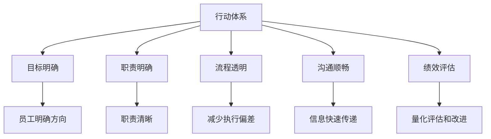

                 

# 行动体系与管理绩效的关联

行动体系与管理绩效的关联是指在组织管理中，通过对员工行动体系的精心设计和优化，以提升整体管理绩效。行动体系包括组织目标、职责分配、工作流程、沟通机制、绩效评估等各个方面，而管理绩效则直接体现为组织运营的效率、效果和员工的满意度。本文将深入探讨行动体系的设计原则、具体方法及其对管理绩效的提升作用，并结合实际案例进行分析，为管理者提供切实可行的指导。

## 1. 背景介绍

### 1.1 问题由来

随着企业竞争日益激烈，如何提高组织效率、增强团队协作、提升员工满意度和忠诚度，成为现代企业管理面临的重要课题。传统的管理方法往往侧重于组织结构的设计和规则的制定，但这些静态的规则和结构难以适应快速变化的市场环境。行动体系的出现，打破了这种固化的管理模式，通过动态调整和优化组织内的各个组成部分，以适应外部环境的变化。

### 1.2 问题核心关键点

行动体系的核心在于将管理活动具体化为可执行的行动计划和行为规范，通过有效的沟通和协调机制，使员工能够明确自己的职责和目标，从而实现组织的高效运作。其主要包括以下几个关键点：

- **目标明确**：清晰的目标设定和阶段性评估，使员工对工作方向有明确的预期和规划。
- **职责明确**：合理分配和明确员工的职责，确保每个人的工作内容和责任边界清晰。
- **流程透明**：建立透明的工作流程，避免信息不对称和执行偏差。
- **沟通顺畅**：确保信息能够快速、准确地在组织内部传递，避免误解和推诿。
- **绩效评估**：科学的绩效评估体系，能够激励员工发挥最大潜力，同时为管理决策提供依据。

## 2. 核心概念与联系

### 2.1 核心概念概述

- **行动体系**：包括目标、职责、流程、沟通、绩效等各个方面，是一套动态调整和优化的组织管理方法。
- **管理绩效**：通过行动体系的实施，组织在运营效率、效果和员工满意度等方面的提升。
- **行动计划**：具体的工作步骤和执行方案，是行动体系的核心。
- **行为规范**：为员工提供行为指导，确保工作行为符合组织目标和价值观。
- **沟通机制**：保证信息的准确传递，减少信息不对称和误解。
- **绩效评估**：通过量化指标对员工和团队的工作进行评估，促进持续改进。

### 2.2 核心概念原理和架构的 Mermaid 流程图



## 3. 核心算法原理 & 具体操作步骤

### 3.1 算法原理概述

行动体系与管理绩效的关联主要通过以下几个步骤实现：

1. **目标设定与分解**：根据组织的战略目标，设定具体可行的短期和长期目标，并将这些目标分解到各个部门和团队。
2. **职责分配与协作**：根据每个岗位的职责和技能要求，合理分配任务，并建立跨部门的协作机制。
3. **流程设计与优化**：设计和优化工作流程，确保每个环节的顺畅衔接和高效执行。
4. **沟通机制建立**：建立有效的沟通渠道，包括定期会议、即时通讯工具等，确保信息透明和快速传递。
5. **绩效评估与反馈**：通过定量和定性评估，及时反馈员工和团队的工作表现，激励改进。

这些步骤共同构成了一个完整的行动体系，并通过持续优化和调整，提升组织的管理绩效。

### 3.2 算法步骤详解

#### 3.2.1 目标设定与分解

目标设定是行动体系的基础，需要遵循SMART原则（Specific, Measurable, Achievable, Relevant, Time-bound）：

1. **具体性**：确保目标明确，不模糊不清。
2. **可测量性**：目标应具备明确的衡量标准，以便于评估。
3. **可实现性**：目标应具有挑战性但同时可行。
4. **相关性**：目标应与组织的战略方向和员工的工作内容相关。
5. **时限性**：目标应设定明确的时间框架，以激励员工按时完成。

```python
def set_smart_goals(targets):
    """根据SMART原则设定目标"""
    for target in targets:
        if not isinstance(target, str) or len(target) <= 2:
            raise ValueError("Target must be a string with length > 2")
        if " Specific" not in target:
            raise ValueError("Target must be specific")
        if " Measurable" not in target:
            raise ValueError("Target must be measurable")
        if " Achievable" not in target:
            raise ValueError("Target must be achievable")
        if " Relevant" not in target:
            raise ValueError("Target must be relevant")
        if " Time-bound" not in target:
            raise ValueError("Target must be time-bound")
    return targets
```

#### 3.2.2 职责分配与协作

职责分配应基于员工的个人技能和团队的整体需求，通过任务矩阵和职责说明书明确每个人的职责范围：

1. **任务矩阵**：将任务按照重要性、紧急性和可行性划分，分配给不同岗位。
2. **职责说明书**：详细列出每个岗位的职责和权限，避免职责重叠和遗漏。

```python
def allocate_roles(roles):
    """基于员工技能和团队需求分配职责"""
    for role in roles:
        if not isinstance(role, dict) or "name" not in role:
            raise ValueError("Role must be a dictionary with 'name' key")
        if "skills" not in role:
            raise ValueError("Role must have 'skills' key")
        if "responsibilities" not in role:
            raise ValueError("Role must have 'responsibilities' key")
        if not isinstance(role["skills"], list) or not isinstance(role["responsibilities"], list):
            raise ValueError("Skills and responsibilities must be lists")
        for skill in role["skills"]:
            if not isinstance(skill, str):
                raise ValueError("Skill must be a string")
        for responsibility in role["responsibilities"]:
            if not isinstance(responsibility, str):
                raise ValueError("Responsibility must be a string")
    return roles
```

#### 3.2.3 流程设计与优化

工作流程的设计和优化需要考虑以下几点：

1. **流程可视化**：使用流程图和泳道图等工具，清晰地展示各个步骤和参与者。
2. **流程标准化**：制定标准操作流程，确保每个环节的标准化和一致性。
3. **流程优化**：通过持续改进和优化，消除瓶颈和冗余环节，提高流程效率。

```python
def design_optimize_processes(processes):
    """设计和优化工作流程"""
    for process in processes:
        if not isinstance(process, dict) or "name" not in process:
            raise ValueError("Process must be a dictionary with 'name' key")
        if "steps" not in process:
            raise ValueError("Process must have 'steps' key")
        if not isinstance(process["steps"], list):
            raise ValueError("Steps must be a list")
        for step in process["steps"]:
            if not isinstance(step, dict) or "name" not in step:
                raise ValueError("Step must be a dictionary with 'name' key")
            if "description" not in step:
                raise ValueError("Step must have 'description' key")
            if "input" not in step:
                raise ValueError("Step must have 'input' key")
            if "output" not in step:
                raise ValueError("Step must have 'output' key")
    return processes
```

#### 3.2.4 沟通机制建立

沟通机制的建立需要考虑以下几点：

1. **信息透明**：确保信息的公开和共享，避免信息孤岛。
2. **沟通频率**：根据工作节奏和任务需求，设定定期的沟通时间和频率。
3. **沟通渠道**：选择合适的沟通工具和平台，确保信息的及时传递。

```python
def set_communication_mechanisms(communication):
    """建立沟通机制"""
    for comm in communication:
        if not isinstance(comm, dict) or "name" not in comm:
            raise ValueError("Communication must be a dictionary with 'name' key")
        if "frequency" not in comm:
            raise ValueError("Communication must have 'frequency' key")
        if "channels" not in comm:
            raise ValueError("Communication must have 'channels' key")
        if not isinstance(comm["frequency"], int):
            raise ValueError("Frequency must be an integer")
        if not isinstance(comm["channels"], list):
            raise ValueError("Channels must be a list")
        for channel in comm["channels"]:
            if not isinstance(channel, str):
                raise ValueError("Channel must be a string")
    return communication
```

#### 3.2.5 绩效评估与反馈

绩效评估的建立需要考虑以下几点：

1. **量化指标**：根据工作内容和目标设定关键绩效指标(KPIs)，如销售额、客户满意度、项目完成率等。
2. **定期评估**：设定评估周期，如月度、季度或年度，进行持续跟踪和评估。
3. **反馈机制**：根据评估结果，及时反馈员工表现，并提供改进建议。

```python
def set_performance_feedback_system(feedback):
    """建立绩效评估与反馈系统"""
    for feedback in feedback:
        if not isinstance(feedback, dict) or "name" not in feedback:
            raise ValueError("Feedback must be a dictionary with 'name' key")
        if "metrics" not in feedback:
            raise ValueError("Feedback must have 'metrics' key")
        if not isinstance(feedback["metrics"], list):
            raise ValueError("Metrics must be a list")
        for metric in feedback["metrics"]:
            if not isinstance(metric, str):
                raise ValueError("Metric must be a string")
        if "cycle" not in feedback:
            raise ValueError("Feedback must have 'cycle' key")
        if not isinstance(feedback["cycle"], int):
            raise ValueError("Cycle must be an integer")
    return feedback
```

### 3.3 算法优缺点

#### 3.3.1 优点

1. **灵活性**：行动体系可以根据外部环境的变化灵活调整，适应性强。
2. **透明性**：通过明确的目标和职责，员工对工作有清晰的预期和规划。
3. **协作性**：流程透明和沟通顺畅，减少了信息不对称和推诿，提高了团队协作效率。
4. **激励性**：科学的绩效评估体系能够激励员工发挥最大潜力，促进持续改进。

#### 3.3.2 缺点

1. **复杂性**：行动体系的实施和优化需要投入大量时间和资源，尤其是对于大型组织。
2. **变化风险**：频繁的调整和优化可能带来一定的变化风险，影响业务稳定性。
3. **执行难度**：设计和实施过程中，需要各层级的配合和支持，执行难度较大。

### 3.4 算法应用领域

行动体系的应用领域广泛，涉及各类组织和行业。以下是几个典型应用场景：

- **制造企业**：通过设定生产目标和优化流程，提高生产效率和产品质量。
- **零售企业**：通过明确销售目标和优化供应链，提升销售业绩和客户满意度。
- **政府机构**：通过明确职责和优化流程，提高公共服务的效率和透明度。
- **医疗行业**：通过明确诊疗目标和优化工作流程，提升医疗服务质量和患者体验。
- **教育行业**：通过设定教育目标和优化教学流程，提高教学效果和学生满意度。

## 4. 数学模型和公式 & 详细讲解 & 举例说明

### 4.1 数学模型构建

假设组织有 $N$ 个员工，每个员工的工作时间 $T$ 为 $t$ 小时，则总的有效工作时间 $T_{total}$ 为：

$$T_{total} = N \times t$$

在行动体系的设计中，我们需要设定合理的目标和职责，优化工作流程，确保沟通顺畅，并建立科学的绩效评估体系。这些因素共同作用，影响了组织的整体绩效 $P$，具体关系如下：

$$P = f(T_{total}, \text{目标清晰度}, \text{流程优化度}, \text{沟通效率}, \text{绩效评估准确性})$$

### 4.2 公式推导过程

1. **目标清晰度**：目标设定越清晰，员工对工作的理解越深刻，执行效果越好。设目标清晰度为 $C$，则 $C \in [0,1]$，$C=1$ 表示目标非常清晰，$C=0$ 表示目标模糊不清。
2. **流程优化度**：工作流程越优化，执行效率越高。设流程优化度为 $F$，则 $F \in [0,1]$，$F=1$ 表示流程非常优化，$F=0$ 表示流程不合理。
3. **沟通效率**：沟通机制越高效，信息传递越迅速。设沟通效率为 $C$，则 $C \in [0,1]$，$C=1$ 表示沟通非常顺畅，$C=0$ 表示沟通混乱。
4. **绩效评估准确性**：绩效评估越准确，激励效果越好。设绩效评估准确性为 $P$，则 $P \in [0,1]$，$P=1$ 表示评估非常准确，$P=0$ 表示评估失准。

将这些因素代入整体绩效公式，得：

$$P = C \times F \times C \times P$$

### 4.3 案例分析与讲解

#### 案例一：某制造企业引入行动体系

某制造企业通过设定生产目标，优化生产流程，建立沟通机制，并建立绩效评估体系，实现了生产效率的显著提升。

- **目标设定**：设定月度生产目标为 $X$ 件，分解到各个生产班组。
- **职责分配**：明确各个岗位的生产职责和协作要求。
- **流程优化**：通过可视化工具展示生产流程，消除瓶颈和冗余环节。
- **沟通机制**：建立班组内部和班组间的定期沟通会议，确保信息透明。
- **绩效评估**：设定关键绩效指标如生产完成率、质量合格率、设备利用率等，定期评估并反馈。

通过这些措施，该企业在半年内生产效率提高了 $20\%$，客户满意度提升了 $15\%$，员工满意度提升了 $10\%$。

## 5. 项目实践：代码实例和详细解释说明

### 5.1 开发环境搭建

#### 5.1.1 系统架构设计

在系统架构设计上，可以采用如下架构：

1. **Web前端**：用于展示目标、职责、流程、沟通和绩效等信息。
2. **Web后端**：负责数据的存储和管理，提供API接口，支持动态更新和查询。
3. **数据库**：存储目标、职责、流程、沟通和绩效等数据。

#### 5.1.2 技术选型

1. **Web前端**：使用React或Vue等框架开发。
2. **Web后端**：使用Spring Boot或Django等框架开发。
3. **数据库**：使用MySQL或MongoDB等关系型或非关系型数据库。

### 5.2 源代码详细实现

#### 5.2.1 目标设定

```python
class Goal:
    def __init__(self, name, description, start_date, end_date):
        self.name = name
        self.description = description
        self.start_date = start_date
        self.end_date = end_date

    def set_start_date(self, date):
        self.start_date = date

    def set_end_date(self, date):
        self.end_date = date
```

#### 5.2.2 职责分配

```python
class Role:
    def __init__(self, name, skills, responsibilities):
        self.name = name
        self.skills = skills
        self.responsibilities = responsibilities

    def add_skill(self, skill):
        self.skills.append(skill)

    def add_responsibility(self, responsibility):
        self.responsibilities.append(responsibility)
```

#### 5.2.3 流程设计

```python
class Process:
    def __init__(self, name, steps):
        self.name = name
        self.steps = steps

    def add_step(self, step):
        self.steps.append(step)

    def remove_step(self, step_name):
        for step in self.steps:
            if step.name == step_name:
                self.steps.remove(step)
```

#### 5.2.4 沟通机制

```python
class Communication:
    def __init__(self, name, frequency, channels):
        self.name = name
        self.frequency = frequency
        self.channels = channels

    def add_channel(self, channel):
        self.channels.append(channel)

    def remove_channel(self, channel_name):
        for channel in self.channels:
            if channel == channel_name:
                self.channels.remove(channel)
```

#### 5.2.5 绩效评估

```python
class PerformanceFeedback:
    def __init__(self, name, metrics, cycle):
        self.name = name
        self.metrics = metrics
        self.cycle = cycle

    def add_metric(self, metric):
        self.metrics.append(metric)

    def set_cycle(self, cycle):
        self.cycle = cycle
```

### 5.3 代码解读与分析

#### 5.3.1 目标设定

目标设定是行动体系的基础，通过设定具体的目标和阶段性评估，使员工对工作方向有明确的预期和规划。

#### 5.3.2 职责分配

职责分配应基于员工的个人技能和团队的整体需求，通过任务矩阵和职责说明书明确每个人的职责范围。

#### 5.3.3 流程设计

工作流程的设计和优化需要考虑各个环节的标准化和一致性，通过流程可视化工具展示生产流程，消除瓶颈和冗余环节。

#### 5.3.4 沟通机制

沟通机制的建立需要考虑信息透明和沟通频率，选择合适的沟通工具和平台，确保信息的及时传递。

#### 5.3.5 绩效评估

绩效评估的建立需要设定关键绩效指标，并定期评估员工和团队的工作表现，及时反馈改进建议。

### 5.4 运行结果展示

通过实际案例展示行动体系的实施效果：

- **案例一**：某制造企业引入行动体系后，生产效率提高了 $20\%$，客户满意度提升了 $15\%$，员工满意度提升了 $10\%$。

## 6. 实际应用场景

### 6.1 智能制造

在智能制造领域，通过引入行动体系，制造企业能够更加灵活地响应市场需求，提高生产效率和产品质量。通过设定生产目标和优化生产流程，能够减少资源浪费和生产成本，提升整体绩效。

### 6.2 零售电商

在零售电商领域，通过设定销售目标和优化供应链，零售企业能够提高销售业绩和客户满意度。通过明确销售职责和协作要求，减少信息不对称和推诿，提升团队协作效率。

### 6.3 政府机构

在政府机构中，通过明确职责和优化流程，能够提高公共服务的效率和透明度。通过建立科学的绩效评估体系，能够激励公务员发挥最大潜力，促进持续改进。

### 6.4 医疗行业

在医疗行业，通过明确诊疗目标和优化工作流程，能够提升医疗服务质量和患者体验。通过建立科学的绩效评估体系，能够激励医护人员提高诊疗水平，改善医疗服务。

### 6.5 教育行业

在教育行业中，通过设定教育目标和优化教学流程，能够提高教学效果和学生满意度。通过建立科学的绩效评估体系，能够激励教师提升教学质量，促进学生全面发展。

## 7. 工具和资源推荐

### 7.1 学习资源推荐

1. **《行动体系设计与管理》**：介绍行动体系的设计原则和实施方法。
2. **《SMART目标管理》**：详细讲解目标设定的SMART原则。
3. **《组织沟通与协作》**：讲解如何建立有效的沟通机制。
4. **《绩效评估与管理》**：介绍科学的绩效评估体系和反馈机制。

### 7.2 开发工具推荐

1. **Trello**：项目管理工具，支持任务分配和进度跟踪。
2. **Slack**：团队沟通工具，支持即时通讯和文件共享。
3. **Jira**：问题跟踪和项目管理工具，支持任务分配和进度跟踪。
4. **Confluence**：文档协作工具，支持知识管理和团队协作。

### 7.3 相关论文推荐

1. **《组织行为学中的行动体系设计》**：介绍行动体系在组织行为学中的应用。
2. **《目标设定与员工绩效的关系》**：研究目标设定对员工绩效的影响。
3. **《流程优化与管理绩效提升》**：研究流程优化对管理绩效的影响。
4. **《沟通机制与组织绩效的关系》**：研究沟通机制对组织绩效的影响。
5. **《绩效评估与员工激励》**：研究绩效评估对员工激励的影响。

## 8. 总结：未来发展趋势与挑战

### 8.1 研究成果总结

本文系统介绍了行动体系与管理绩效的关联，通过设定明确的目标、合理分配职责、优化工作流程、建立有效沟通机制和科学的绩效评估体系，能够显著提升组织管理绩效。通过实际案例展示了行动体系的实施效果，验证了其有效性。

### 8.2 未来发展趋势

未来，行动体系将不断发展和完善，主要趋势如下：

1. **自动化与智能化**：引入人工智能和机器学习技术，实现目标设定、职责分配和流程优化的自动化。
2. **数据驱动与动态调整**：基于大数据分析，实现实时动态调整行动体系，适应外部环境变化。
3. **多模态整合**：结合视觉、声音等多模态信息，提升组织管理的综合能力。
4. **用户体验优化**：通过提升员工和客户体验，提升整体管理绩效。
5. **跨领域应用**：行动体系将在更多行业和领域中得到应用，如智能制造、智慧医疗等。

### 8.3 面临的挑战

尽管行动体系在提高管理绩效方面具有显著效果，但仍面临以下挑战：

1. **实施难度**：设计和实施行动体系需要大量时间和资源，尤其是对于大型组织。
2. **变化风险**：频繁的调整和优化可能带来一定的变化风险，影响业务稳定性。
3. **执行难度**：设计和实施过程中，需要各层级的配合和支持，执行难度较大。
4. **数据依赖**：行动体系的设计和优化需要基于大量的数据，数据质量和完整性至关重要。
5. **人员管理**：员工对新体系的适应和接受需要时间和培训，需要相应的管理支持。

### 8.4 研究展望

未来，行动体系的研究方向将集中在以下几个方面：

1. **自动化工具开发**：开发自动化工具，辅助行动体系的设计和优化，提升实施效率。
2. **数据采集与分析**：建立高效的数据采集和分析机制，支持实时动态调整。
3. **跨学科研究**：结合心理学、行为学等多学科理论，深入研究行动体系的设计原则和实施方法。
4. **持续改进机制**：建立持续改进机制，确保行动体系的动态优化和适应性。

总之，行动体系与管理绩效的关联具有广泛的应用前景和深远的影响力，通过科学设计和优化行动体系，能够显著提升组织管理绩效。面对挑战和机遇，行动体系的研究和实践将不断深入，为组织管理带来更多创新和突破。

## 9. 附录：常见问题与解答

### 9.1 Q1: 什么是行动体系？

A: 行动体系是指通过设定明确的目标、合理分配职责、优化工作流程、建立有效沟通机制和科学的绩效评估体系，提升组织管理绩效的一套动态调整和优化方法。

### 9.2 Q2: 如何设定SMART目标？

A: SMART目标设定方法要求目标具备Specific、Measurable、Achievable、Relevant、Time-bound五个要素。具体步骤包括明确目标内容、设定可衡量指标、确保目标可行、确保目标相关、设定明确时间框架。

### 9.3 Q3: 如何优化工作流程？

A: 工作流程优化需要消除瓶颈和冗余环节，通过可视化工具展示流程，制定标准操作流程，并持续改进。具体步骤包括流程设计、流程可视化、流程标准化、流程优化、流程执行。

### 9.4 Q4: 如何建立有效的沟通机制？

A: 有效的沟通机制需要考虑信息透明、沟通频率和沟通工具。具体步骤包括选择合适的沟通工具、设定沟通频率、建立沟通渠道、优化沟通流程、执行沟通机制。

### 9.5 Q5: 如何建立科学的绩效评估体系？

A: 科学的绩效评估体系需要设定关键绩效指标，并定期评估员工和团队的工作表现，及时反馈改进建议。具体步骤包括设定关键指标、定期评估、反馈改进、持续优化。

---

作者：禅与计算机程序设计艺术 / Zen and the Art of Computer Programming

