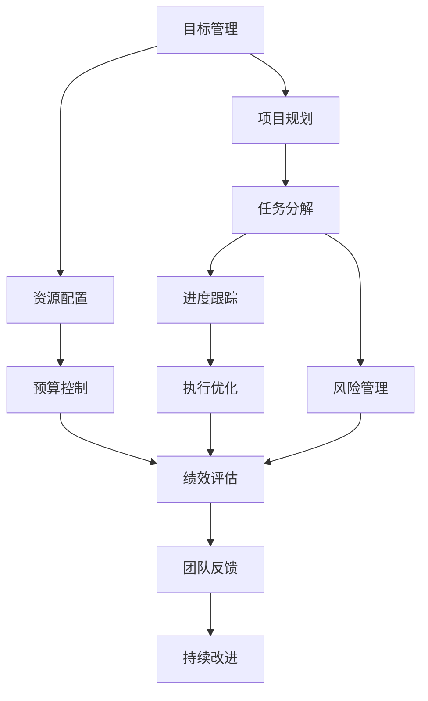

                 

# 行动体系打造:执行力的关键

> 关键词：执行体系, 执行力提升, 项目管理, 系统化管理, 目标管理, 团队协作

## 1. 背景介绍

在当今这个快节奏、高竞争的时代，执行力已经成为企业和个人成功的关键因素之一。无论是企业战略的实施、项目管理的推进，还是个人目标的达成，执行力的强弱都直接决定了结果的好坏。然而，执行力的提升并非易事，它需要系统化的方法和策略来支持。本文将深入探讨如何通过构建行动体系，有效提升团队和个人的执行力，帮助企业和个人实现更高效、更有成效的运营和目标达成。

## 2. 核心概念与联系

### 2.1 核心概念概述

为了更好地理解行动体系构建的理论基础，本节将介绍几个关键的概念：

- **执行体系**：一种系统化的管理框架，旨在通过明确目标、制定计划、执行跟踪等环节，全面提升执行力和工作效率。
- **执行力**：指个人或团队在实现目标的过程中，将计划付诸行动的能力和效率。
- **项目管理**：通过规划、组织、指挥、协调、控制等手段，高效完成项目目标的过程。
- **系统化管理**：将复杂问题分解为可操作的小步骤，通过严格的标准化流程和监控机制，提升整体运营效率。
- **目标管理**：以目标为导向，通过设定SMART（具体、可衡量、可达成、相关性、时限性）目标，确保团队和个人行动的聚焦和高效。
- **团队协作**：通过合理分工、沟通协调、资源共享等手段，充分发挥团队成员的协同作用，提升整体执行效率。

这些核心概念之间存在着密切的联系，共同构成了执行体系的基础。通过理解这些概念，我们可以更好地把握行动体系的构建方法，从而在实际应用中提升执行力和工作效率。

### 2.2 核心概念原理和架构的 Mermaid 流程图



## 3. 核心算法原理 & 具体操作步骤

### 3.1 算法原理概述

构建行动体系的核心在于将目标具体化、分解化和可执行化，通过系统化的流程和监控机制，确保每个环节都有明确的执行路径和责任人。这一过程涉及多个算法和技术手段，主要包括：

- **目标设定算法**：通过SMART原则，设定具体、可衡量的目标，确保目标的可达性和可执行性。
- **任务分解算法**：将复杂目标分解为可操作的小任务，设定明确的截止日期和责任人。
- **进度跟踪算法**：通过时间线和里程碑管理，实时监控任务进展，确保项目按计划推进。
- **风险管理算法**：识别潜在风险，制定应对策略，降低风险对项目进展的影响。
- **绩效评估算法**：定期评估项目和任务完成情况，及时发现问题并进行调整。
- **团队协作算法**：通过沟通和协作工具，确保团队成员的同步和信息共享。

这些算法和技术手段，通过合理的组合和应用，可以构建一个高效、可控的执行体系，显著提升执行力和工作效率。

### 3.2 算法步骤详解

构建行动体系的具体步骤如下：

**Step 1: 设定目标**

- 根据战略规划和业务需求，设定具体的、可衡量的、可达成的、相关性强的、时限性的目标。目标设定应遵循SMART原则，确保目标的清晰度和可执行性。

**Step 2: 任务分解**

- 将总体目标分解为多个可操作的任务。每个任务应明确描述、责任人、截止日期和优先级，确保任务的可执行性和可控性。

**Step 3: 资源配置**

- 根据任务需求，合理配置人力、物力和财力资源。确保资源能够按时到位，支持任务的顺利推进。

**Step 4: 进度跟踪**

- 通过时间线和里程碑管理，实时监控任务进展。使用项目管理工具，如甘特图、看板等，可视化项目进度，及时发现偏差并调整。

**Step 5: 风险管理**

- 识别项目中的潜在风险，制定应对策略，并定期评估风险影响。采用风险矩阵、SWOT分析等方法，全面识别和评估风险。

**Step 6: 执行优化**

- 通过持续改进和优化，提升执行效率。采用精益管理、敏捷开发等方法，持续优化执行流程，确保任务的高效完成。

**Step 7: 绩效评估**

- 定期评估项目和任务的完成情况，使用关键绩效指标（KPI）等工具，量化评估执行效果。根据评估结果，及时调整执行策略。

**Step 8: 团队协作**

- 建立有效的沟通和协作机制，确保团队成员的同步和信息共享。使用团队协作工具，如Slack、Trello等，提升团队协作效率。

### 3.3 算法优缺点

构建行动体系的方法具有以下优点：

- **系统性**：通过系统化的管理流程和监控机制，确保每个环节都有明确执行路径和责任人。
- **透明性**：通过实时监控和报告，确保项目进展的透明度，便于及时发现和解决问题。
- **可控性**：通过设定标准化的流程和规范，确保执行过程的可控性，减少执行偏差。
- **灵活性**：通过持续改进和优化，提升执行效率和质量，适应不断变化的环境和需求。

同时，该方法也存在一定的局限性：

- **复杂性**：构建和维护行动体系需要较高的管理成本和技术支持。
- **过度依赖工具**：过度依赖项目管理工具可能影响团队成员的自主性和创造力。
- **资源消耗**：系统化管理需要较多的时间和人力投入，可能影响短期业务产出。
- **文化适应性**：文化差异可能影响执行体系的有效性，需要灵活调整和管理。

### 3.4 算法应用领域

构建行动体系的方法，在多个领域得到了广泛应用，包括但不限于：

- **企业管理**：通过设定和执行企业战略目标，提升企业运营效率和市场竞争力。
- **项目管理**：通过规划和跟踪项目进展，确保项目按时交付和质量达标。
- **团队建设**：通过明确分工和协作，提升团队协作效率和凝聚力。
- **个人管理**：通过设定个人目标和任务，提升个人时间管理和效率。
- **知识管理**：通过系统化整理和共享知识，提升组织知识水平和创新能力。

## 4. 数学模型和公式 & 详细讲解 & 举例说明

### 4.1 数学模型构建

构建行动体系涉及多个数学模型，主要包括目标管理模型、任务分解模型、进度跟踪模型和风险管理模型。以下是这些模型的数学表达式和详细讲解：

**目标管理模型**

目标管理模型基于SMART原则，其数学表达式为：

$$
\begin{aligned}
G &= \text{Specific (具体)} \\
G &= \text{Measurable (可衡量)} \\
G &= \text{Achievable (可达成)} \\
G &= \text{Relevant (相关性)} \\
G &= \text{Time-bound (时限性)}
\end{aligned}
$$

目标管理模型要求目标满足上述五个原则，确保目标的清晰、可达和可控。

**任务分解模型**

任务分解模型基于工作分解结构（WBS），将复杂目标分解为多个子任务。其数学表达式为：

$$
\begin{aligned}
T_i &= \text{Task } i \\
T_i &= \text{Subtask } i_1 \\
T_i &= \text{Subtask } i_2 \\
\ldots \\
T_i &= \text{Subtask } i_n
\end{aligned}
$$

其中 $T_i$ 表示第 $i$ 个任务，$i_1, i_2, \ldots, i_n$ 表示第 $i$ 个任务下的所有子任务。

**进度跟踪模型**

进度跟踪模型通过甘特图、看板等工具，实时监控任务进展。其数学表达式为：

$$
P(t) = \sum_{i=1}^n p_i(t)
$$

其中 $P(t)$ 表示在时间 $t$ 时项目总进度，$p_i(t)$ 表示第 $i$ 个任务在时间 $t$ 时的进度。

**风险管理模型**

风险管理模型通过风险矩阵、SWOT分析等方法，全面识别和评估风险。其数学表达式为：

$$
R = \sum_{i=1}^n r_i
$$

其中 $R$ 表示总风险，$r_i$ 表示第 $i$ 个潜在风险的评分。

### 4.2 公式推导过程

以下是几个关键模型的公式推导过程：

**目标管理模型推导**

目标管理模型的推导基于SMART原则，具体推导如下：

1. **具体（Specific）**：确保目标描述清晰、具体，如“在下个季度提升销售额20%”。
2. **可衡量（Measurable）**：确保目标可量化，如“完成1000个新客户开发”。
3. **可达成（Achievable）**：确保目标具有挑战性但可达成，如“在三个月内提升客户满意度15%”。
4. **相关性（Relevant）**：确保目标与战略目标和业务需求相关，如“改善客户体验以提升品牌忠诚度”。
5. **时限性（Time-bound）**：确保目标具有明确的时间限制，如“在下个季度结束前实现目标”。

**任务分解模型推导**

任务分解模型的推导基于工作分解结构（WBS），具体推导如下：

1. **总体目标**：将总体目标分解为多个子任务，如“产品开发”分解为“需求分析”、“设计”、“开发”和“测试”四个子任务。
2. **子任务分解**：每个子任务进一步分解为更细粒度的任务，如“设计”进一步分解为“UI设计”和“功能设计”。
3. **任务关联**：每个子任务之间建立关联，确保任务的逻辑顺序和依赖关系，如“需求分析”依赖于“市场调研”。

**进度跟踪模型推导**

进度跟踪模型的推导基于甘特图、看板等工具，具体推导如下：

1. **甘特图**：将任务按时间轴排列，标记每个任务的起始和结束时间，如横坐标为时间，纵坐标为任务。
2. **看板**：将任务按不同状态（如待办、进行中、已完成）分类，实时更新任务进展，如看板上的卡片可随时移动，表示任务状态的变化。

**风险管理模型推导**

风险管理模型的推导基于风险矩阵、SWOT分析等方法，具体推导如下：

1. **风险矩阵**：将风险按影响程度和发生概率分为四个象限，如高影响高概率为高风险，低影响低概率为低风险。
2. **SWOT分析**：识别目标的优势（Strengths）、劣势（Weaknesses）、机会（Opportunities）和威胁（Threats），综合评估风险。

### 4.3 案例分析与讲解

**案例分析**：某公司希望提升产品质量，设定了一个“在下个季度提升产品质量20%”的目标。以下是目标管理模型的具体应用：

1. **目标设定**：明确目标为“在下个季度提升产品质量20%”，满足SMART原则。
2. **任务分解**：将目标分解为“市场调研”、“质量分析”、“改进措施”和“效果评估”四个子任务。
3. **进度跟踪**：使用甘特图和看板，实时监控每个子任务的进展，确保按时完成。
4. **风险管理**：通过风险矩阵和SWOT分析，识别并应对潜在风险，如供应链中断、技术难题等。

通过目标管理模型的应用，该公司成功提升了产品质量，实现了目标。

## 5. 项目实践：代码实例和详细解释说明

### 5.1 开发环境搭建

在进行行动体系构建的项目实践前，我们需要准备好开发环境。以下是使用Python进行行动体系构建的项目开发环境配置流程：

1. 安装Python：从官网下载并安装Python，选择适合自己操作系统和版本。
2. 安装项目管理工具：安装如Jira、Trello、Slack等项目管理工具，用于任务分解、进度跟踪和团队协作。
3. 安装数据分析工具：安装如Pandas、NumPy等数据分析工具，用于数据处理和统计分析。
4. 安装可视化工具：安装如Matplotlib、Seaborn等可视化工具，用于数据可视化。
5. 安装版本控制系统：安装如Git、SVN等版本控制系统，用于版本控制和协作管理。

完成上述步骤后，即可在Python环境中开始行动体系构建的项目实践。

### 5.2 源代码详细实现

下面我们以项目管理工具Trello为例，给出使用Python进行行动体系构建的代码实现。

首先，定义Trello的API接口和基本的项目配置：

```python
import requests
from requests_oauthlib import OAuth1Session

# 配置Trello API密钥
api_key = 'your_api_key'
api_secret = 'your_api_secret'

# 创建Trello API会话
trello = OAuth1Session(api_key, api_secret)
```

然后，定义创建项目、任务和看板的基本函数：

```python
def create_board(board_name):
    """创建看板"""
    url = 'https://api.trello.com/1/boards'
    headers = {'Authorization': 'Bearer YOUR_ACCESS_TOKEN'}
    params = {'name': board_name}
    response = trello.post(url, headers=headers, json=params)
    return response.json()

def create_list(board_id, list_name):
    """创建列表"""
    url = f'https://api.trello.com/1/boards/{board_id}/lists'
    headers = {'Authorization': 'Bearer YOUR_ACCESS_TOKEN'}
    params = {'name': list_name}
    response = trello.post(url, headers=headers, json=params)
    return response.json()

def create_card(board_id, list_id, card_name):
    """创建卡片"""
    url = f'https://api.trello.com/1/boards/{board_id}/lists/{list_id}/cards'
    headers = {'Authorization': 'Bearer YOUR_ACCESS_TOKEN'}
    params = {'desc': card_name}
    response = trello.post(url, headers=headers, json=params)
    return response.json()
```

接着，定义更新卡片状态、注释和附件的基本函数：

```python
def update_card(card_id, state):
    """更新卡片状态"""
    url = f'https://api.trello.com/1/cards/{card_id}'
    headers = {'Authorization': 'Bearer YOUR_ACCESS_TOKEN'}
    params = {'state': state}
    response = trello.put(url, headers=headers, json=params)
    return response.json()

def add_comment(card_id, comment_text):
    """添加注释"""
    url = f'https://api.trello.com/1/cards/{card_id}/comments'
    headers = {'Authorization': 'Bearer YOUR_ACCESS_TOKEN'}
    params = {'text': comment_text}
    response = trello.post(url, headers=headers, json=params)
    return response.json()

def add_attachment(card_id, attachment_url):
    """添加附件"""
    url = f'https://api.trello.com/1/cards/{card_id}/attachments'
    headers = {'Authorization': 'Bearer YOUR_ACCESS_TOKEN'}
    params = {'url': attachment_url}
    response = trello.post(url, headers=headers, json=params)
    return response.json()
```

最后，启动项目并更新卡片状态：

```python
board_name = '产品质量提升项目'
board_id = create_board(board_name)['id']

list_name = '任务清单'
list_id = create_list(board_id, list_name)['id']

card_name = '市场调研'
card_id = create_card(board_id, list_id, card_name)['id']

update_card(card_id, '进行中')
add_comment(card_id, '市场调研完成80%')
add_attachment(card_id, '调研报告链接')
```

以上就是使用Python和Trello进行行动体系构建的完整代码实现。可以看到，通过简单的API调用，就可以方便地实现任务分解、进度跟踪和团队协作。

### 5.3 代码解读与分析

让我们再详细解读一下关键代码的实现细节：

**Trello API接口**：
- `OAuth1Session`：用于创建Trello API会话，需要提供API密钥和API密钥的密钥。
- `requests.post` 和 `requests.put`：用于发送HTTP请求，发送API接口的请求，并获取响应。

**创建函数**：
- `create_board`：创建看板，需要提供看板名称，返回创建成功的看板信息。
- `create_list`：创建列表，需要提供看板ID和列表名称，返回创建成功的列表信息。
- `create_card`：创建卡片，需要提供看板ID、列表ID和卡片名称，返回创建成功的卡片信息。

**更新函数**：
- `update_card`：更新卡片状态，需要提供卡片ID和新的状态，返回更新后的卡片信息。
- `add_comment`：添加注释，需要提供卡片ID和注释文本，返回添加的注释信息。
- `add_attachment`：添加附件，需要提供卡片ID和附件URL，返回添加的附件信息。

**启动项目**：
- `board_name`：创建看板名称，需要根据实际需求设置。
- `board_id`：创建看板后的返回值，需要保存并用于后续操作。
- `list_name`：创建列表名称，需要根据实际需求设置。
- `list_id`：创建列表后的返回值，需要保存并用于后续操作。
- `card_name`：创建卡片名称，需要根据实际需求设置。
- `card_id`：创建卡片后的返回值，需要保存并用于后续操作。

通过以上代码，可以看出使用Python和Trello进行行动体系构建是可行的，并且可以简单高效地实现。这为实际应用中的项目管理提供了便利，同时也展示了行动体系构建的实际操作过程。

## 6. 实际应用场景

### 6.1 企业管理

在企业管理中，行动体系的应用可以显著提升组织运营效率和市场竞争力。通过设定明确的战略目标和年度计划，分解为季度和月度任务，并实时监控进展，确保每个部门和团队都在正确的方向上工作。例如，某大型制造企业通过构建行动体系，成功提升了供应链管理效率，缩短了生产周期，提高了产品质量，增强了市场竞争力。

### 6.2 项目管理

在项目管理中，行动体系的应用可以确保项目按时交付和质量达标。通过设定项目里程碑和关键任务，实时监控进度和风险，及时调整计划，确保项目顺利推进。例如，某软件公司通过构建行动体系，成功开发了一款新的应用程序，实现了目标功能的按时交付和高质量交付。

### 6.3 团队建设

在团队建设中，行动体系的应用可以提升团队协作效率和凝聚力。通过明确任务分工和沟通机制，确保团队成员的同步和信息共享，提升整体执行力和团队绩效。例如，某跨部门项目团队通过构建行动体系，成功实现了项目的跨部门协作，提升了项目交付质量和效率。

### 6.4 个人管理

在个人管理中，行动体系的应用可以提升个人时间管理和效率。通过设定个人目标和任务，制定详细的计划和时间表，并实时监控进展，确保个人目标的实现。例如，某企业高管通过构建行动体系，成功实现了个人目标，提升了个人绩效和职业发展。

## 7. 工具和资源推荐

### 7.1 学习资源推荐

为了帮助开发者系统掌握行动体系构建的理论基础和实践技巧，这里推荐一些优质的学习资源：

1. **《敏捷项目管理》系列书籍**：详细介绍了敏捷项目管理的方法和工具，涵盖Scrum、Kanban等方法，适合项目管理者阅读。
2. **《精益创业》系列书籍**：介绍了精益创业的思想和实践，适合创业者和管理者阅读。
3. **《项目管理：战略规划与执行》课程**：由PMP（Project Management Professional）认证机构提供，详细介绍了项目管理的方法和工具。
4. **《系统化管理》课程**：介绍了系统化管理的理念和方法，适合组织管理者阅读。
5. **《目标管理》系列文章**：介绍了目标管理的方法和实践，适合个人管理者阅读。

通过对这些资源的学习实践，相信你一定能够快速掌握行动体系的精髓，并用于解决实际的执行问题。

### 7.2 开发工具推荐

高效的开发离不开优秀的工具支持。以下是几款用于行动体系构建开发的常用工具：

1. **Jira**：广泛使用的项目管理工具，支持任务分解、进度跟踪和团队协作。
2. **Trello**：简单易用的看板管理工具，适合小型团队和个人使用。
3. **Asana**：功能强大的项目管理工具，支持任务分配、进度跟踪和报告生成。
4. **Slack**：流行的即时通讯工具，支持团队协作和信息同步。
5. **Git**：广泛使用的版本控制系统，支持代码协作和版本管理。

合理利用这些工具，可以显著提升行动体系构建的开发效率，加快创新迭代的步伐。

### 7.3 相关论文推荐

行动体系构建的研究源于学界的持续研究。以下是几篇奠基性的相关论文，推荐阅读：

1. **《敏捷项目管理：从理念到实践》**：详细介绍了敏捷项目管理的方法和工具，适合项目管理者阅读。
2. **《精益创业：创业公司的正确方法》**：介绍了精益创业的思想和实践，适合创业者和管理者阅读。
3. **《系统化管理：将复杂问题分解为可操作的小步骤》**：介绍了系统化管理的理念和方法，适合组织管理者阅读。
4. **《目标管理：设定SMART目标，提升执行效率》**：介绍了目标管理的方法和实践，适合个人管理者阅读。

这些论文代表了大语言模型微调技术的发展脉络。通过学习这些前沿成果，可以帮助研究者把握学科前进方向，激发更多的创新灵感。

## 8. 总结：未来发展趋势与挑战

### 8.1 研究成果总结

本文对行动体系构建的方法进行了全面系统的介绍。首先阐述了行动体系构建的背景和意义，明确了其提升团队和个人执行力的独特价值。其次，从原理到实践，详细讲解了行动体系构建的数学模型和操作步骤，给出了行动体系构建的完整代码实例。同时，本文还广泛探讨了行动体系在企业管理、项目管理、团队建设、个人管理等各个领域的应用前景，展示了行动体系构建的广泛适用性。

通过本文的系统梳理，可以看到，行动体系构建方法已经成为提升执行力的重要手段，极大地拓展了项目管理的应用边界，催生了更多的落地场景。得益于系统化的方法和工具，行动体系构建在实际应用中能够提供有效的管理支持，帮助企业和个人实现更高效、更有成效的运营和目标达成。

### 8.2 未来发展趋势

展望未来，行动体系构建技术将呈现以下几个发展趋势：

1. **智能化管理**：通过引入人工智能和机器学习技术，提升行动体系的自动化和智能化水平，减少人工干预，提升管理效率。
2. **跨领域应用**：行动体系构建方法将逐步从项目管理扩展到更多领域，如医疗、教育、金融等，为各行各业带来管理提升。
3. **云服务化**：行动体系构建将逐步向云端迁移，提供更灵活、可扩展的管理服务，降低企业IT投入。
4. **用户定制化**：行动体系构建将更加注重用户定制化需求，提供灵活的配置和定制服务，满足不同企业的管理需求。
5. **数据驱动**：行动体系构建将更加注重数据分析和数据驱动，通过数据可视化和分析报告，提供更深入的管理洞察。

这些趋势凸显了行动体系构建技术的广阔前景，未来将进一步提升企业和个人的管理效率，推动各行各业的发展进程。

### 8.3 面临的挑战

尽管行动体系构建技术已经取得了瞩目成就，但在迈向更加智能化、普适化应用的过程中，它仍面临着诸多挑战：

1. **技术复杂性**：行动体系构建涉及多个技术和工具，需要较高的技术和管理成本。
2. **数据安全**：行动体系构建过程中涉及大量的敏感数据，需要严格的数据保护措施。
3. **文化适应性**：不同企业的文化和管理方式差异较大，行动体系构建需要灵活调整和管理。
4. **持续改进**：行动体系构建需要持续改进和优化，以适应不断变化的环境和需求。
5. **用户接受度**：用户对新技术和工具的接受度和使用习惯差异较大，需要有效的培训和推广。

面对这些挑战，未来的行动体系构建需要不断创新和优化，以适应不断变化的环境和需求，推动企业和个人的管理进步。

### 8.4 研究展望

面对行动体系构建面临的挑战，未来的研究需要在以下几个方面寻求新的突破：

1. **引入AI和ML技术**：通过引入人工智能和机器学习技术，提升行动体系的自动化和智能化水平，减少人工干预，提升管理效率。
2. **跨领域应用研究**：逐步将行动体系构建方法扩展到更多领域，如医疗、教育、金融等，为各行各业带来管理提升。
3. **云服务化研究**：研究行动体系构建的云服务化实现，提供更灵活、可扩展的管理服务，降低企业IT投入。
4. **用户定制化研究**：研究行动体系构建的用户定制化需求，提供灵活的配置和定制服务，满足不同企业的管理需求。
5. **数据驱动研究**：研究行动体系构建的数据驱动方法，通过数据可视化和分析报告，提供更深入的管理洞察。

这些研究方向将推动行动体系构建技术的进一步发展，为管理和运营带来新的突破和创新。

## 9. 附录：常见问题与解答

**Q1：如何选择合适的行动体系构建工具？**

A: 选择合适的行动体系构建工具需要考虑企业的规模、团队结构和管理需求。通常情况下，中小型企业可以选择简单易用的看板工具，如Trello、Asana等；大型企业可以选择功能强大的项目管理工具，如Jira、Confluence等。可以根据实际需求和预算，选择合适的工具。

**Q2：如何提升行动体系的适应性？**

A: 行动体系的适应性可以通过灵活的配置和定制化实现。具体来说，可以通过以下方式提升行动体系的适应性：
1. 灵活的模板：提供多种模板，供用户根据实际需求进行选择和配置。
2. 用户定制：允许用户根据实际需求进行自定义配置，适应不同的管理场景。
3. 跨平台支持：提供多平台支持，方便用户在不同设备上使用和管理。

**Q3：如何提升行动体系的效率？**

A: 提升行动体系的效率需要从多个方面入手：
1. 自动化工具：引入自动化工具，如流程自动化、数据自动化等，减少人工干预。
2. 数据分析：通过数据分析和可视化，提供更深入的管理洞察，指导行动体系的优化和改进。
3. 持续改进：建立持续改进机制，定期评估和优化行动体系，确保其高效性和适应性。

这些措施可以帮助提升行动体系的效率，提升整体管理水平。

通过本文的系统梳理，可以看到，行动体系构建方法已经成为提升执行力的重要手段，极大地拓展了项目管理的应用边界，催生了更多的落地场景。得益于系统化的方法和工具，行动体系构建在实际应用中能够提供有效的管理支持，帮助企业和个人实现更高效、更有成效的运营和目标达成。未来，伴随行动体系构建方法的持续演进，相信在各个领域都能发挥更大的作用，推动企业和个人的管理进步。

---

作者：禅与计算机程序设计艺术 / Zen and the Art of Computer Programming

