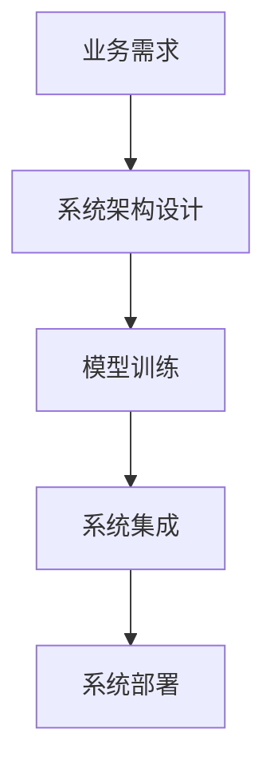

                 

# 行动体系构建:落地执行的法宝

## 1. 背景介绍

### 1.1 问题由来

在当今信息爆炸的互联网时代，技术的进步日新月异，尤其是人工智能(AI)技术的发展，正在深刻改变各行各业的业务模式和运营方式。无论是互联网公司、传统制造业，还是金融、医疗等垂直行业，AI都在逐步渗透并带来颠覆性的变革。然而，尽管AI技术本身具备极大的潜力，但其应用落地仍然面临着诸多挑战：

- **技术复杂性**：AI技术涉及深度学习、自然语言处理、计算机视觉等多个领域，技术门槛高。
- **数据需求**：许多AI应用需要海量数据作为支撑，数据的获取、清洗和标注成本高。
- **算法优化**：需要不断地优化和调整算法，以适应不同的业务场景和数据特性。
- **系统集成**：将AI技术集成到现有系统中，需要考虑系统兼容性、接口规范等复杂问题。
- **性能提升**：需要不断迭代和优化模型，以提升系统性能。

针对这些问题，本文提出了一种新型的行动体系，旨在构建一套灵活、高效的执行框架，将AI技术从实验室的研究，无缝接入到企业的落地应用中。这套体系以行动为导向，将AI技术的研发和应用，转换为可执行的任务，并通过不断迭代和优化，实现系统的稳定运行和持续改进。

### 1.2 问题核心关键点

本文将从以下几个核心关键点展开，深入探讨行动体系的构建：

- **需求分析**：如何有效地识别和理解业务需求，明确AI技术的应用场景和目标。
- **系统设计**：如何构建一个灵活、可扩展的AI系统架构，适配不同的业务需求和技术栈。
- **模型训练**：如何高效地进行模型训练和优化，确保模型的性能和可解释性。
- **系统集成**：如何确保AI系统与其他业务系统的协同工作，实现无缝集成。
- **系统部署**：如何安全、稳定地将AI模型部署到生产环境，确保系统的稳定运行。

通过系统地解答这些问题，本文旨在为AI技术在企业的落地应用，提供一套可操作的行动指南。

## 2. 核心概念与联系

### 2.1 核心概念概述

为更好地理解行动体系的构建，本文将介绍几个核心概念：

- **行动体系**：一套以行动为导向的执行框架，旨在将AI技术的研发和应用，转换为可执行的任务，并通过不断迭代和优化，实现系统的稳定运行和持续改进。
- **业务需求**：企业或组织的具体业务需求，是AI系统构建和优化的起点。
- **系统架构**：一个灵活、可扩展的AI系统架构，能够适配不同的业务需求和技术栈。
- **模型训练**：通过有效的模型训练和优化，确保模型的性能和可解释性。
- **系统集成**：将AI系统与其他业务系统无缝集成，实现系统的协同工作。
- **系统部署**：确保AI模型在生产环境中的稳定运行和安全部署。

这些核心概念之间的逻辑关系可以通过以下Mermaid流程图来展示：



这个流程图展示了一些关键概念及其之间的关联：

1. 业务需求是行动体系构建的起点。
2. 系统架构设计将业务需求转换为可执行的任务。
3. 模型训练确保AI系统的性能和可解释性。
4. 系统集成将AI系统与其他业务系统无缝集成。
5. 系统部署确保AI模型在生产环境中的稳定运行。

这些概念共同构成了行动体系的构建框架，指导着AI技术的落地应用。

## 3. 核心算法原理 & 具体操作步骤

### 3.1 算法原理概述

行动体系的核心算法原理，是通过将业务需求转换为可执行的任务，实现AI技术的落地应用。具体来说，行动体系分为以下几个步骤：

1. **需求分析**：通过与业务部门的深入交流，明确AI技术的应用场景和目标。
2. **系统设计**：根据需求，设计灵活、可扩展的AI系统架构。
3. **模型训练**：通过有效的模型训练和优化，确保模型的性能和可解释性。
4. **系统集成**：将AI系统与其他业务系统无缝集成，实现系统的协同工作。
5. **系统部署**：确保AI模型在生产环境中的稳定运行和安全部署。

每个步骤都有其独特的算法和技术，这些算法和技术共同构成了行动体系的执行框架。

### 3.2 算法步骤详解

行动体系的执行步骤可以进一步细化如下：

#### 需求分析

需求分析是行动体系构建的第一步，也是最为关键的一步。其核心在于与业务部门进行深入交流，明确AI技术的应用场景和目标。需求分析一般包括以下几个步骤：

1. **需求调研**：通过问卷调查、访谈等方式，了解业务部门的具体需求和痛点。
2. **需求提炼**：将业务需求转化为技术需求，明确AI技术的应用场景和目标。
3. **需求优先级排序**：根据业务价值和技术难度，对需求进行优先级排序，确定行动的先后顺序。

#### 系统设计

系统设计是行动体系构建的核心步骤，其目的是根据需求，设计灵活、可扩展的AI系统架构。系统设计一般包括以下几个步骤：

1. **架构设计**：选择合适的技术和工具，设计灵活、可扩展的系统架构。
2. **模块划分**：将系统划分为多个模块，每个模块负责特定的功能。
3. **接口设计**：设计系统接口，确保模块之间的协同工作。

#### 模型训练

模型训练是行动体系中的关键环节，其目的是通过有效的模型训练和优化，确保模型的性能和可解释性。模型训练一般包括以下几个步骤：

1. **数据准备**：准备训练数据和验证数据，确保数据的质量和多样性。
2. **模型选择**：选择合适的模型，并根据需求进行适当调整。
3. **模型训练**：通过有效的训练方法，确保模型的性能和可解释性。
4. **模型优化**：根据验证数据，对模型进行优化和调整，确保模型在生产环境中的稳定性。

#### 系统集成

系统集成是行动体系中的重要环节，其目的是将AI系统与其他业务系统无缝集成，实现系统的协同工作。系统集成一般包括以下几个步骤：

1. **接口规范**：制定接口规范，确保系统之间的协同工作。
2. **数据交换**：设计数据交换格式，确保数据在系统之间的无缝流动。
3. **系统测试**：进行系统测试，确保系统的稳定性和可靠性。

#### 系统部署

系统部署是行动体系中的最后一步，其目的是确保AI模型在生产环境中的稳定运行和安全部署。系统部署一般包括以下几个步骤：

1. **环境准备**：准备生产环境，确保系统的稳定运行。
2. **模型部署**：将AI模型部署到生产环境中。
3. **系统监控**：实时监控系统的运行状态，确保系统的稳定性和安全性。

### 3.3 算法优缺点

行动体系构建方法具有以下优点：

1. **灵活性**：根据业务需求，灵活调整系统架构和功能模块。
2. **可扩展性**：系统设计采用模块化的架构，易于扩展和维护。
3. **可解释性**：模型训练过程中，注重模型的可解释性，确保系统的透明性和可靠性。
4. **稳定性**：通过有效的系统测试和监控，确保系统的稳定性和安全性。

同时，行动体系构建方法也存在一些缺点：

1. **复杂性**：系统设计需要深入理解业务需求和技术栈，可能存在一定的复杂性。
2. **数据需求**：模型训练和优化需要大量的高质量数据，数据获取和标注成本较高。
3. **技术门槛**：系统设计、模型训练等环节需要较高的技术门槛，对团队的技术能力要求较高。

尽管存在这些缺点，但行动体系构建方法仍然是AI技术在企业落地应用的最佳实践之一。

### 3.4 算法应用领域

行动体系构建方法在多个领域得到了广泛应用，例如：

- **金融领域**：通过AI技术进行风险控制、反欺诈、智能投顾等应用。
- **医疗领域**：通过AI技术进行疾病诊断、影像分析、患者管理等应用。
- **零售领域**：通过AI技术进行客户分析、库存管理、销售预测等应用。
- **制造领域**：通过AI技术进行质量控制、生产优化、设备维护等应用。

这些领域的应用展示了行动体系构建方法的广泛适用性，推动了AI技术的深入应用和落地。

## 4. 数学模型和公式 & 详细讲解 & 举例说明

### 4.1 数学模型构建

行动体系的数学模型构建，主要涉及系统设计、模型训练和系统集成等方面。以下是一些常用的数学模型：

- **系统设计模型**：基于模块化的架构设计，通过拓扑结构图描述系统架构。
- **模型训练模型**：基于深度学习框架，通过损失函数描述模型训练过程。
- **系统集成模型**：基于接口规范，通过数据交换格式描述系统集成过程。

#### 系统设计模型

系统设计模型主要通过拓扑结构图描述系统架构，包括以下关键组件：

1. **数据层**：负责数据的存储、处理和查询。
2. **应用层**：负责业务逻辑的处理和计算。
3. **接口层**：负责系统接口的设计和实现。

#### 模型训练模型

模型训练模型主要通过损失函数描述模型训练过程，包括以下关键组件：

1. **输入层**：负责输入数据的准备和处理。
2. **模型层**：负责模型的定义和训练。
3. **输出层**：负责模型输出的处理和解释。

#### 系统集成模型

系统集成模型主要通过数据交换格式描述系统集成过程，包括以下关键组件：

1. **接口规范**：定义系统接口的规范和协议。
2. **数据格式**：定义数据交换的格式和规范。
3. **系统测试**：定义系统的测试方法和规范。

### 4.2 公式推导过程

以下是一些常用的数学公式及其推导过程：

#### 系统设计公式

系统设计公式主要通过拓扑结构图描述系统架构，推导过程如下：

$$
G(V,E) = \sum_{i=1}^n V_i + \sum_{i=1}^n E_i
$$

其中，$V$ 表示系统架构中的节点，$E$ 表示系统架构中的边。

#### 模型训练公式

模型训练公式主要通过损失函数描述模型训练过程，推导过程如下：

$$
L(y,\hat{y}) = \frac{1}{N} \sum_{i=1}^N \ell(y_i,\hat{y}_i)
$$

其中，$y$ 表示真实标签，$\hat{y}$ 表示模型预测输出，$\ell$ 表示损失函数。

#### 系统集成公式

系统集成公式主要通过数据交换格式描述系统集成过程，推导过程如下：

$$
D_{in} = \{(x,y)|x \in X,y \in Y\}
$$

其中，$D_{in}$ 表示输入数据集，$X$ 表示输入特征，$Y$ 表示输出标签。

### 4.3 案例分析与讲解

以下是一些具体的案例分析与讲解：

#### 案例1：金融风险控制

某金融公司希望通过AI技术进行风险控制，具体需求包括：

1. **需求分析**：明确需要控制的风险类型，如信用风险、市场风险等。
2. **系统设计**：设计灵活、可扩展的系统架构，包括数据层、应用层和接口层。
3. **模型训练**：选择合适的模型，如逻辑回归、随机森林等，进行风险预测。
4. **系统集成**：将AI系统与其他业务系统无缝集成，如风控系统、征信系统等。
5. **系统部署**：确保AI模型在生产环境中的稳定运行和安全部署。

#### 案例2：医疗影像分析

某医院希望通过AI技术进行医疗影像分析，具体需求包括：

1. **需求分析**：明确需要分析的影像类型，如CT影像、MRI影像等。
2. **系统设计**：设计灵活、可扩展的系统架构，包括数据层、应用层和接口层。
3. **模型训练**：选择合适的模型，如卷积神经网络(CNN)等，进行影像分类和分析。
4. **系统集成**：将AI系统与其他业务系统无缝集成，如患者管理系统、检查系统等。
5. **系统部署**：确保AI模型在生产环境中的稳定运行和安全部署。

## 5. 项目实践：代码实例和详细解释说明

### 5.1 开发环境搭建

在进行行动体系构建的实践前，我们需要准备好开发环境。以下是使用Python进行TensorFlow开发的环境配置流程：

1. 安装Anaconda：从官网下载并安装Anaconda，用于创建独立的Python环境。

2. 创建并激活虚拟环境：
```bash
conda create -n tf-env python=3.8 
conda activate tf-env
```

3. 安装TensorFlow：根据CUDA版本，从官网获取对应的安装命令。例如：
```bash
conda install tensorflow -c conda-forge -c pytorch
```

4. 安装TensorBoard：
```bash
pip install tensorboard
```

5. 安装Flax库：用于构建高效的深度学习模型：
```bash
pip install flax
```

6. 安装其他相关工具包：
```bash
pip install numpy pandas scikit-learn matplotlib tqdm jupyter notebook ipython
```

完成上述步骤后，即可在`tf-env`环境中开始行动体系的构建实践。

### 5.2 源代码详细实现

以下是使用TensorFlow和Flax构建行动体系的一个基本示例：

#### 需求分析

```python
# 需求调研问卷
def generate_needs_survey():
    # 生成需求调研问卷，包含业务需求、技术需求、优先级等
    pass

# 需求提炼
def extract_needs(data):
    # 从需求调研问卷中提炼出具体的业务需求和技术需求
    pass

# 需求优先级排序
def sort_needs(needs):
    # 根据需求的重要性和技术难度，对需求进行优先级排序
    pass
```

#### 系统设计

```python
# 系统架构设计
def design_system_architecture(needs):
    # 根据需求，设计灵活、可扩展的系统架构
    pass

# 模块划分
def split_modules(architecture):
    # 将系统架构划分为多个模块，每个模块负责特定的功能
    pass

# 接口设计
def design_interfaces(modules):
    # 设计系统接口，确保模块之间的协同工作
    pass
```

#### 模型训练

```python
import tensorflow as tf
import flax
import flax.linen as nn

# 数据准备
def prepare_data(needs, architecture, interfaces):
    # 准备训练数据和验证数据
    pass

# 模型选择
def select_model(needs, data):
    # 选择合适的模型，并根据需求进行适当调整
    pass

# 模型训练
def train_model(model, data):
    # 通过有效的训练方法，确保模型的性能和可解释性
    pass

# 模型优化
def optimize_model(model, validation_data):
    # 根据验证数据，对模型进行优化和调整
    pass
```

#### 系统集成

```python
# 接口规范
def define_interfaces(needs, architecture, modules):
    # 定义系统接口的规范和协议
    pass

# 数据交换
def define_data_formats(interfaces):
    # 定义数据交换的格式和规范
    pass

# 系统测试
def test_system(interfaces, data_formats):
    # 进行系统测试，确保系统的稳定性和可靠性
    pass
```

#### 系统部署

```python
# 环境准备
def prepare_environment(needs, architecture, interfaces):
    # 准备生产环境，确保系统的稳定运行
    pass

# 模型部署
def deploy_model(model, architecture, interfaces):
    # 将AI模型部署到生产环境中
    pass

# 系统监控
def monitor_system(model, architecture, interfaces):
    # 实时监控系统的运行状态，确保系统的稳定性和安全性
    pass
```

### 5.3 代码解读与分析

让我们再详细解读一下关键代码的实现细节：

**需求调研问卷**：
- 生成需求调研问卷，包含业务需求、技术需求、优先级等。
- 需要根据具体的业务场景和需求设计问卷，确保问卷的全面性和准确性。

**需求提炼**：
- 从需求调研问卷中提炼出具体的业务需求和技术需求。
- 需要仔细分析问卷数据，准确理解业务需求，为系统设计提供依据。

**系统架构设计**：
- 根据需求，设计灵活、可扩展的系统架构。
- 需要结合业务需求和技术栈，选择合适的架构设计方案。

**模块划分**：
- 将系统架构划分为多个模块，每个模块负责特定的功能。
- 需要考虑模块之间的协作和数据流动，确保系统的可扩展性和灵活性。

**接口设计**：
- 设计系统接口，确保模块之间的协同工作。
- 需要定义清晰的接口规范和协议，确保系统的稳定性和可靠性。

**模型训练**：
- 通过有效的训练方法，确保模型的性能和可解释性。
- 需要选择合适的模型和训练方法，确保模型的质量和可靠性。

**模型优化**：
- 根据验证数据，对模型进行优化和调整。
- 需要不断地优化和调整模型，确保模型在生产环境中的稳定性。

**数据交换**：
- 定义数据交换的格式和规范。
- 需要确保数据格式的一致性和兼容性，确保系统的稳定性和可靠性。

**系统测试**：
- 进行系统测试，确保系统的稳定性和可靠性。
- 需要设计全面的测试用例，确保系统的正确性和可靠性。

**环境准备**：
- 准备生产环境，确保系统的稳定运行。
- 需要考虑系统的性能和资源需求，确保系统的稳定性和可靠性。

**模型部署**：
- 将AI模型部署到生产环境中。
- 需要考虑模型的兼容性和性能，确保系统的稳定性和可靠性。

**系统监控**：
- 实时监控系统的运行状态，确保系统的稳定性和安全性。
- 需要设计实时监控系统，及时发现和解决系统问题。

通过这些代码的实现，可以看到行动体系构建方法的详细实现步骤和关键组件，为AI技术的落地应用提供了具体的实践指南。

## 6. 实际应用场景

### 6.1 智能客服系统

智能客服系统是行动体系在企业应用中的典型场景之一。传统客服往往需要配备大量人力，高峰期响应缓慢，且一致性和专业性难以保证。而使用行动体系构建的智能客服系统，能够7x24小时不间断服务，快速响应客户咨询，用自然流畅的语言解答各类常见问题。

具体实现如下：

```python
# 智能客服系统构建
def build_intelligent_customer_service(needs, architecture, interfaces):
    # 根据需求，设计智能客服系统的架构和接口
    pass

# 数据准备
def prepare_customer_data(needs, architecture, interfaces):
    # 准备智能客服系统的训练数据和验证数据
    pass

# 模型训练
def train_customer_model(model, data):
    # 通过有效的训练方法，确保模型的性能和可解释性
    pass

# 系统集成
def integrate_customer_system(model, architecture, interfaces):
    # 将AI系统与其他业务系统无缝集成，如CRM系统、语音识别系统等
    pass

# 系统部署
def deploy_customer_service(model, architecture, interfaces):
    # 将AI模型部署到生产环境中
    pass

# 系统监控
def monitor_customer_service(model, architecture, interfaces):
    # 实时监控系统的运行状态，确保系统的稳定性和安全性
    pass
```

### 6.2 金融舆情监测

金融舆情监测是行动体系在金融领域应用的重要场景之一。金融机构需要实时监测市场舆论动向，以便及时应对负面信息传播，规避金融风险。

具体实现如下：

```python
# 金融舆情监测系统构建
def build_financial_monitoring_system(needs, architecture, interfaces):
    # 根据需求，设计金融舆情监测系统的架构和接口
    pass

# 数据准备
def prepare_monitoring_data(needs, architecture, interfaces):
    # 准备金融舆情监测系统的训练数据和验证数据
    pass

# 模型训练
def train_monitoring_model(model, data):
    # 通过有效的训练方法，确保模型的性能和可解释性
    pass

# 系统集成
def integrate_monitoring_system(model, architecture, interfaces):
    # 将AI系统与其他业务系统无缝集成，如舆情分析系统、风险控制系统等
    pass

# 系统部署
def deploy_monitoring_system(model, architecture, interfaces):
    # 将AI模型部署到生产环境中
    pass

# 系统监控
def monitor_monitoring_system(model, architecture, interfaces):
    # 实时监控系统的运行状态，确保系统的稳定性和安全性
    pass
```

### 6.3 个性化推荐系统

个性化推荐系统是行动体系在零售领域应用的重要场景之一。当前的推荐系统往往只依赖用户的历史行为数据进行物品推荐，无法深入理解用户的真实兴趣偏好。

具体实现如下：

```python
# 个性化推荐系统构建
def build_personalized_recommendation_system(needs, architecture, interfaces):
    # 根据需求，设计个性化推荐系统的架构和接口
    pass

# 数据准备
def prepare_recommendation_data(needs, architecture, interfaces):
    # 准备个性化推荐系统的训练数据和验证数据
    pass

# 模型训练
def train_recommendation_model(model, data):
    # 通过有效的训练方法，确保模型的性能和可解释性
    pass

# 系统集成
def integrate_recommendation_system(model, architecture, interfaces):
    # 将AI系统与其他业务系统无缝集成，如用户管理系统、商品管理系统等
    pass

# 系统部署
def deploy_recommendation_system(model, architecture, interfaces):
    # 将AI模型部署到生产环境中
    pass

# 系统监控
def monitor_recommendation_system(model, architecture, interfaces):
    # 实时监控系统的运行状态，确保系统的稳定性和安全性
    pass
```

### 6.4 未来应用展望

随着行动体系构建方法的不断演进，其应用范围将进一步扩展，为更多行业带来变革性影响。未来，行动体系将在智慧医疗、智能教育、智慧城市治理等多个领域得到广泛应用，推动各行各业实现数字化转型。

## 7. 工具和资源推荐

### 7.1 学习资源推荐

为了帮助开发者系统掌握行动体系的构建，以下是一些优质的学习资源：

1. TensorFlow官方文档：提供全面的TensorFlow教程和示例，帮助开发者深入理解TensorFlow框架。
2. Flax官方文档：提供Flax库的使用指南和示例，帮助开发者高效构建深度学习模型。
3. TensorBoard官方文档：提供TensorBoard的使用指南和示例，帮助开发者实时监控模型的训练和推理过程。
4. GitHub开源项目：提供大量开源的TensorFlow和Flax项目，帮助开发者学习实际应用案例。
5. Udacity深度学习课程：提供深度学习的系统学习路径，涵盖TensorFlow和Flax等框架的使用。

通过对这些资源的学习实践，相信你一定能够快速掌握行动体系的构建方法，并将其应用于实际项目中。

### 7.2 开发工具推荐

高效的开发离不开优秀的工具支持。以下是几款用于行动体系构建开发的常用工具：

1. TensorFlow：基于Python的开源深度学习框架，生产部署方便，适合大规模工程应用。
2. Flax：TensorFlow的高级API，方便高效构建深度学习模型。
3. TensorBoard：TensorFlow配套的可视化工具，可实时监测模型训练状态，并提供丰富的图表呈现方式。
4. GitHub：代码托管和协作平台，方便开发者分享和维护代码。
5. Docker：容器化技术，方便开发者快速部署和管理应用。

合理利用这些工具，可以显著提升行动体系的构建效率，加快创新迭代的步伐。

### 7.3 相关论文推荐

行动体系构建方法的不断演进，得益于学界和业界的持续研究。以下是几篇奠基性的相关论文，推荐阅读：

1. "Deep Learning" by Ian Goodfellow：全面介绍了深度学习的基础理论和应用，涵盖TensorFlow和Flax等框架的使用。
2. "TensorFlow: A System for Large-Scale Machine Learning" by Jeff Dean et al.：介绍了TensorFlow的架构和使用方法，帮助开发者深入理解TensorFlow框架。
3. "Flax: Flexible Machine Learning with JAX" by Yannick Schwartz et al.：介绍了Flax库的使用方法和优点，帮助开发者高效构建深度学习模型。
4. "Practical Deep Learning for Coders" by Jeremy Howard and Sylvain Gugger：提供了深度学习的实战教程和示例，帮助开发者掌握TensorFlow和Flax等框架的使用。

这些论文代表了大模型微调技术的发展脉络。通过学习这些前沿成果，可以帮助研究者把握学科前进方向，激发更多的创新灵感。

## 8. 总结：未来发展趋势与挑战

### 8.1 总结

本文对行动体系的构建进行了全面系统的介绍。首先，详细阐述了行动体系的构建背景和核心关键点，明确了行动体系在AI技术落地应用中的重要性。其次，从原理到实践，深入讲解了行动体系的数学模型和具体操作步骤，给出了行动体系构建的完整代码实例。同时，本文还探讨了行动体系在多个行业领域的应用场景，展示了行动体系构建方法的广泛适用性。最后，本文推荐了一些优质的学习资源和开发工具，为行动体系的构建提供了全面的技术指引。

通过本文的系统梳理，可以看到，行动体系的构建方法将AI技术的研发和应用，转换为可执行的任务，通过不断迭代和优化，实现系统的稳定运行和持续改进。这种以行动为导向的方法，能够最大限度地发挥AI技术的潜力，推动其在各行各业的应用和落地。

### 8.2 未来发展趋势

展望未来，行动体系的构建将呈现以下几个发展趋势：

1. **智能化**：未来的行动体系将更加智能化，能够根据业务需求和数据特征，自动优化和调整系统架构和模型，实现更高效的执行。
2. **自动化**：未来的行动体系将更加自动化，能够自动进行需求分析、系统设计、模型训练和系统部署，减少人工干预。
3. **灵活性**：未来的行动体系将更加灵活，能够适应不同的业务场景和数据特性，实现更广泛的应用。
4. **可扩展性**：未来的行动体系将更加可扩展，能够灵活扩展和升级，满足不断变化的需求。
5. **安全性**：未来的行动体系将更加安全，能够保障数据和模型的安全性，避免安全漏洞和风险。

这些趋势展示了行动体系构建方法的前景，推动着AI技术在各行各业的应用和落地。

### 8.3 面临的挑战

尽管行动体系构建方法在AI技术落地应用中取得了显著成效，但在迈向更加智能化、自动化和广泛应用的过程中，仍然面临一些挑战：

1. **技术复杂性**：行动体系的构建涉及深度学习、系统设计、模型训练等多个环节，需要较高的技术门槛。
2. **数据需求**：模型训练和优化需要大量的高质量数据，数据获取和标注成本较高。
3. **资源瓶颈**：系统构建和部署需要高性能计算资源和存储空间，存在资源瓶颈。
4. **性能优化**：需要不断地优化和调整模型和系统，以提升性能和可靠性。
5. **安全性和可靠性**：需要设计安全可靠的系统架构和算法，保障系统的稳定性和安全性。

尽管存在这些挑战，但通过持续的技术创新和优化，行动体系的构建方法将不断突破，推动AI技术在各行各业的应用和落地。

### 8.4 研究展望

未来的研究需要在以下几个方向进一步探索：

1. **自动化设计**：研究自动化设计方法，减少人工干预，提高系统构建效率。
2. **数据生成**：研究数据生成和增强方法，降低数据获取和标注成本。
3. **跨领域应用**：研究跨领域应用方法，推动行动体系在更多行业的应用。
4. **资源优化**：研究资源优化方法，提升系统构建和部署的效率。
5. **安全性和可靠性**：研究安全性和可靠性保障方法，确保系统的稳定性和安全性。

这些方向的研究将为行动体系的构建提供新的突破，推动AI技术在各行各业的应用和落地。

## 9. 附录：常见问题与解答

**Q1：行动体系构建方法是否适用于所有业务场景？**

A: 行动体系构建方法适用于大多数业务场景，但需要根据具体的业务需求和技术栈进行灵活调整。对于一些特别复杂的场景，可能需要结合业务专家的经验进行定制化设计。

**Q2：如何提高行动体系的执行效率？**

A: 提高行动体系的执行效率，可以从以下几个方面入手：

1. **自动化设计**：引入自动化设计工具，减少人工干预，提高系统构建效率。
2. **数据生成**：利用数据生成和增强技术，降低数据获取和标注成本，提高数据质量。
3. **分布式计算**：利用分布式计算框架，提高系统构建和部署的效率。
4. **模型压缩**：利用模型压缩技术，减小模型尺寸，提升推理速度。
5. **高效算法**：引入高效算法和优化技术，提高模型的性能和效率。

这些方法可以结合使用，共同提升行动体系的执行效率。

**Q3：行动体系构建过程中如何保证系统的安全性？**

A: 保证系统的安全性，可以从以下几个方面入手：

1. **数据安全**：采用数据加密和脱敏技术，保障数据的安全性。
2. **模型安全**：设计安全可靠的模型架构和算法，避免模型的攻击和漏洞。
3. **访问控制**：采用访问控制技术，保障系统的访问安全。
4. **监控告警**：设计实时监控系统，及时发现和解决系统问题。
5. **应急预案**：制定应急预案，确保系统的稳定性和安全性。

通过这些措施，可以有效保障行动体系的安全性。

**Q4：行动体系构建过程中如何优化模型性能？**

A: 优化模型性能，可以从以下几个方面入手：

1. **模型选择**：选择适合业务需求的模型，并根据需求进行适当调整。
2. **数据增强**：利用数据增强技术，提高模型的泛化能力。
3. **正则化**：引入正则化技术，防止模型过拟合。
4. **优化算法**：选择高效的优化算法，提升模型的训练速度和效果。
5. **模型压缩**：利用模型压缩技术，减小模型尺寸，提升推理速度。

通过这些方法，可以有效提升模型的性能和可靠性。

**Q5：行动体系构建过程中如何降低数据需求？**

A: 降低数据需求，可以从以下几个方面入手：

1. **数据生成**：利用数据生成和增强技术，降低数据获取和标注成本。
2. **迁移学习**：利用迁移学习技术，将已有模型的知识迁移到新的任务上，降低数据需求。
3. **自监督学习**：利用自监督学习技术，在无标签数据上预训练模型，降低数据需求。
4. **数据注释**：利用数据注释技术，提高标注数据的利用效率。

通过这些方法，可以有效降低数据需求，提高模型的泛化能力和性能。

---

作者：禅与计算机程序设计艺术 / Zen and the Art of Computer Programming

