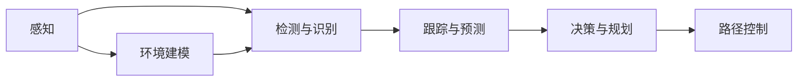

                 

## 1. 背景介绍

自动驾驶技术是人工智能领域的重大前沿技术之一，融合了计算机视觉、深度学习、环境感知、路径规划等多学科知识。其中，计算机视觉作为感知环境的基础技术，起着至关重要的作用。本文将详细介绍计算机视觉在自动驾驶中的应用，包括核心概念、核心算法原理、具体实现、应用场景和未来发展趋势，同时对相关学习资源、开发工具和论文进行推荐。

## 2. 核心概念与联系

### 2.1 核心概念概述

自动驾驶技术是通过先进的传感器、摄像头、雷达和GPS等设备感知环境，然后利用计算机视觉和深度学习技术对传感器数据进行分析和处理，最终生成行驶路径，实现自主导航。

在自动驾驶中，计算机视觉主要涉及以下几个关键概念：

- **感知**：通过摄像头、激光雷达和超声波传感器等设备，获取车辆周围环境的实时图像和点云数据。
- **检测与识别**：对感知数据进行分析和处理，实现对道路标志、行人和其他车辆的检测和识别。
- **跟踪与预测**：对目标轨迹进行预测，实现对动态目标的连续跟踪。
- **决策与规划**：利用感知、检测、跟踪和预测结果，制定最优的行驶策略和路径规划。

### 2.2 核心概念原理和架构的 Mermaid 流程图



## 3. 核心算法原理 & 具体操作步骤

### 3.1 算法原理概述

计算机视觉在自动驾驶中的核心算法包括目标检测、目标跟踪、路径规划和决策制定等。这些算法通常使用深度学习模型，如卷积神经网络（CNN）、循环神经网络（RNN）和Transformer等，结合传感器数据进行处理和分析。

### 3.2 算法步骤详解

#### 3.2.1 目标检测

目标检测通常采用基于区域提议的目标检测算法，如R-CNN、Fast R-CNN、Faster R-CNN、YOLO、SSD等。以YOLO（You Only Look Once）为例，其核心思想是将整个图像分成若干个网格，在每个网格上进行物体检测。通过卷积层提取特征，然后使用全连接层进行物体分类和边界框回归。

#### 3.2.2 目标跟踪

目标跟踪通常采用基于跟踪器的方法，如相关滤波器、深度学习跟踪器（如Siam R-CNN、Mask R-CNN等）。深度学习跟踪器通常通过在图像序列上学习目标的动态特征，实现对目标的连续跟踪。

#### 3.2.3 路径规划

路径规划通常采用基于图搜索的方法，如A*算法、D*算法等。这些算法通过构建环境地图，搜索从起点到终点的最优路径。在自动驾驶中，路径规划通常需要考虑交通规则、道路条件和动态目标等因素。

#### 3.2.4 决策制定

决策制定通常采用强化学习、策略优化等方法。决策制定器通过感知、检测、跟踪和路径规划的结果，制定最优的行驶策略，以实现安全、高效的自动驾驶。

### 3.3 算法优缺点

#### 3.3.1 优点

- **高精度**：深度学习模型可以处理大量的图像数据，实现高精度的目标检测和跟踪。
- **实时性**：深度学习模型可以利用GPU等高性能设备，实现实时处理。
- **灵活性**：深度学习模型可以根据任务需求进行灵活设计，适应不同的应用场景。

#### 3.3.2 缺点

- **计算资源需求高**：深度学习模型需要大量的计算资源进行训练和推理。
- **数据需求大**：深度学习模型需要大量的标注数据进行训练，且数据质量对模型性能影响较大。
- **模型复杂度高**：深度学习模型的结构复杂，难以理解和调试。

### 3.4 算法应用领域

计算机视觉在自动驾驶中的应用领域非常广泛，主要包括以下几个方面：

- **环境感知**：通过摄像头、激光雷达等传感器获取道路环境和交通状况。
- **目标检测**：检测和识别道路标志、行人和其他车辆等动态目标。
- **目标跟踪**：连续跟踪动态目标的轨迹，预测其行为和运动。
- **路径规划**：规划最优行驶路径，避免碰撞和阻塞。
- **决策制定**：基于感知、检测、跟踪和路径规划结果，制定最优行驶策略。

## 4. 数学模型和公式 & 详细讲解 & 举例说明

### 4.1 数学模型构建

在自动驾驶中，计算机视觉的数学模型主要包括以下几个方面：

- **目标检测模型**：如YOLO、Faster R-CNN等，采用卷积神经网络进行特征提取和目标分类。
- **目标跟踪模型**：如Siam R-CNN、Mask R-CNN等，采用卷积神经网络进行特征提取和目标跟踪。
- **路径规划模型**：如A*算法、D*算法等，采用图搜索算法进行路径规划。
- **决策制定模型**：如强化学习、策略优化等，采用深度学习模型进行策略优化。

### 4.2 公式推导过程

#### 4.2.1 目标检测

以YOLO为例，其目标检测公式如下：

$$
y = \sigma(W_{2}(A \cdot [x + b_{2}]) + c_{2})
$$

其中，$x$ 是卷积层输出的特征图，$W_{2}$ 是分类层权重，$b_{2}$ 是分类层偏置，$A$ 是卷积核参数，$c_{2}$ 是分类层常数。

#### 4.2.2 目标跟踪

以Siam R-CNN为例，其目标跟踪公式如下：

$$
\min_{\Delta x} ||I(x + \Delta x) - \mathcal{S}(x + \Delta x)||_{2}
$$

其中，$I(x)$ 是当前帧图像，$\mathcal{S}(x)$ 是目标的模板特征，$\Delta x$ 是目标的位移向量。

#### 4.2.3 路径规划

以A*算法为例，其路径规划公式如下：

$$
f(n) = g(n) + h(n)
$$

其中，$f(n)$ 是节点$n$的启发函数值，$g(n)$ 是节点$n$到起点的实际代价，$h(n)$ 是节点$n$到终点的估计代价。

#### 4.2.4 决策制定

以强化学习为例，其决策制定公式如下：

$$
Q(s, a) = \sum_{s'} \pi(a|s) r(s, a, s') + \gamma \max_{a'} Q(s', a')
$$

其中，$Q(s, a)$ 是策略$a$在状态$s$下的价值函数，$\pi(a|s)$ 是策略分布，$r(s, a, s')$ 是状态转移的即时奖励，$\gamma$ 是折扣因子。

### 4.3 案例分析与讲解

以特斯拉Autopilot系统为例，其计算机视觉系统采用了多个深度学习模型进行目标检测和跟踪，结合高精度地图和GPS数据进行路径规划和决策制定，实现了L4级别的自动驾驶功能。

## 5. 项目实践：代码实例和详细解释说明

### 5.1 开发环境搭建

开发环境搭建主要包括以下几个步骤：

- 安装Python和相关依赖库，如TensorFlow、PyTorch等。
- 安装OpenCV等计算机视觉库，用于图像处理和传感器数据融合。
- 安装ROS（Robot Operating System）等自动驾驶框架，用于自动驾驶系统的集成和调试。

### 5.2 源代码详细实现

以下是一个基于TensorFlow的目标检测示例代码：

```python
import tensorflow as tf
import numpy as np

# 定义YOLO模型
class YOLO(tf.keras.Model):
    def __init__(self):
        super(YOLO, self).__init__()
        self.conv1 = tf.keras.layers.Conv2D(32, 3, activation='relu')
        self.conv2 = tf.keras.layers.Conv2D(64, 3, activation='relu')
        self.conv3 = tf.keras.layers.Conv2D(128, 3, activation='relu')
        self.fc1 = tf.keras.layers.Dense(64)
        self.fc2 = tf.keras.layers.Dense(10)

    def call(self, inputs):
        x = self.conv1(inputs)
        x = self.conv2(x)
        x = self.conv3(x)
        x = tf.keras.layers.MaxPooling2D(pool_size=(2, 2))(x)
        x = self.fc1(x)
        x = self.fc2(x)
        return x

# 加载图像和标签数据
def load_data():
    # 加载图像数据
    images = np.load('images.npy')
    # 加载标签数据
    labels = np.load('labels.npy')
    return images, labels

# 定义损失函数
def loss_function(y_true, y_pred):
    mse_loss = tf.keras.losses.MeanSquaredError()
    return mse_loss(y_true, y_pred)

# 训练模型
def train_model(model, images, labels, epochs=10):
    optimizer = tf.keras.optimizers.Adam(learning_rate=0.001)
    for epoch in range(epochs):
        with tf.GradientTape() as tape:
            y_pred = model(images)
            loss = loss_function(labels, y_pred)
        gradients = tape.gradient(loss, model.trainable_variables)
        optimizer.apply_gradients(zip(gradients, model.trainable_variables))

# 训练模型
train_model(YOLO(), load_data())
```

### 5.3 代码解读与分析

以上代码实现了基于TensorFlow的目标检测模型，包括模型定义、数据加载、损失函数和训练过程。其中，YOLO模型采用多个卷积层和全连接层，通过反向传播算法更新模型参数，实现目标检测。

## 6. 实际应用场景

### 6.1 环境感知

自动驾驶中的环境感知主要依赖于摄像头和激光雷达等传感器，实现对道路环境的实时检测和识别。摄像头通常用于检测道路标志、交通信号和行人，激光雷达则用于检测道路障碍和障碍物。

### 6.2 目标检测

目标检测在自动驾驶中用于检测道路上的车辆、行人和其他动态目标，实现对道路环境的全面感知。目标检测通常需要处理高分辨率的图像数据，以实现高精度的目标识别和分类。

### 6.3 目标跟踪

目标跟踪在自动驾驶中用于连续跟踪动态目标的轨迹，预测其行为和运动。目标跟踪通常需要处理视频序列，以实现对目标的连续跟踪和预测。

### 6.4 路径规划

路径规划在自动驾驶中用于规划最优行驶路径，避免碰撞和阻塞。路径规划通常需要考虑交通规则、道路条件和动态目标等因素，实现高精度和安全的路径规划。

### 6.5 决策制定

决策制定在自动驾驶中用于制定最优行驶策略，实现自动驾驶的安全性和可靠性。决策制定通常需要考虑感知、检测、跟踪和路径规划的结果，实现智能化的决策和控制。

## 7. 工具和资源推荐

### 7.1 学习资源推荐

- **《深度学习计算机视觉》**：吴恩达教授的深度学习课程，介绍了深度学习在计算机视觉中的应用，适合初学者和进阶者学习。
- **《计算机视觉：算法与应用》**：斯坦福大学的计算机视觉课程，涵盖了计算机视觉的基础知识和最新进展。
- **OpenCV官方文档**：OpenCV的官方文档，提供了丰富的计算机视觉算法和工具，适合开发者学习和实践。

### 7.2 开发工具推荐

- **TensorFlow**：Google开发的深度学习框架，支持自动驾驶系统的开发和训练。
- **PyTorch**：Facebook开发的深度学习框架，支持深度学习模型的开发和部署。
- **ROS**：Robot Operating System，支持自动驾驶系统的集成和调试。

### 7.3 相关论文推荐

- **"End-to-End Deep Learning for Autonomous Driving"**：提出了基于端到端深度学习的自动驾驶系统，使用卷积神经网络进行环境感知和决策制定。
- **"Deep Learning for Decision-Making in Autonomous Vehicles"**：介绍了深度学习在自动驾驶决策制定中的应用，包括强化学习和策略优化。
- **"Real-Time Object Detection with YOLOv4"**：介绍了YOLOv4目标检测算法在自动驾驶中的应用，实现了实时高精度的目标检测。

## 8. 总结：未来发展趋势与挑战

### 8.1 研究成果总结

计算机视觉在自动驾驶中的应用已经取得了显著的进展，但仍然面临一些挑战。主要包括以下几个方面：

- **高精度感知**：计算机视觉需要实现高精度的环境感知，以支持自动驾驶的安全性和可靠性。
- **实时性处理**：计算机视觉需要实现实时处理，以支持自动驾驶的实时性和稳定性。
- **多模态融合**：计算机视觉需要与其他传感器进行多模态融合，以实现更全面的环境感知。

### 8.2 未来发展趋势

未来，计算机视觉在自动驾驶中的应用将呈现以下几个发展趋势：

- **高精度感知**：通过改进传感器和算法，实现更高精度的环境感知。
- **实时性处理**：通过优化算法和硬件设备，实现更高效的实时处理。
- **多模态融合**：通过融合不同传感器的数据，实现更全面的环境感知和决策制定。

### 8.3 面临的挑战

未来，计算机视觉在自动驾驶中的应用仍面临一些挑战：

- **计算资源需求高**：深度学习模型需要大量的计算资源进行训练和推理。
- **数据需求大**：深度学习模型需要大量的标注数据进行训练，且数据质量对模型性能影响较大。
- **模型复杂度高**：深度学习模型的结构复杂，难以理解和调试。

### 8.4 研究展望

未来，计算机视觉在自动驾驶中的应用需要继续探索和创新：

- **高精度感知**：通过改进传感器和算法，实现更高精度的环境感知。
- **实时性处理**：通过优化算法和硬件设备，实现更高效的实时处理。
- **多模态融合**：通过融合不同传感器的数据，实现更全面的环境感知和决策制定。

## 9. 附录：常见问题与解答

**Q1: 自动驾驶中目标检测的难点是什么？**

A: 自动驾驶中目标检测的难点主要包括以下几个方面：
- **高分辨率图像处理**：自动驾驶需要处理高分辨率的图像数据，以实现高精度的目标识别和分类。
- **实时性要求高**：自动驾驶需要实现实时处理，以保证驾驶决策的及时性和准确性。
- **复杂环境适应**：自动驾驶需要适应各种复杂的道路环境，如交通拥堵、天气变化等。

**Q2: 目标跟踪在自动驾驶中的作用是什么？**

A: 目标跟踪在自动驾驶中的作用主要包括以下几个方面：
- **连续跟踪动态目标**：自动驾驶需要连续跟踪动态目标的轨迹，实现对目标的全面感知。
- **预测目标行为**：自动驾驶需要预测目标的行为和运动，以制定最优的行驶策略。
- **避免碰撞和阻塞**：自动驾驶需要避免碰撞和阻塞，保证行驶安全和稳定性。

**Q3: 自动驾驶中的路径规划需要考虑哪些因素？**

A: 自动驾驶中的路径规划需要考虑以下因素：
- **交通规则**：自动驾驶需要遵循交通规则，如红绿灯、交通标志等。
- **道路条件**：自动驾驶需要考虑道路条件，如道路宽度、转弯半径等。
- **动态目标**：自动驾驶需要考虑动态目标，如其他车辆、行人等。

**Q4: 自动驾驶中的决策制定如何实现？**

A: 自动驾驶中的决策制定通常采用以下方法：
- **强化学习**：自动驾驶可以使用强化学习方法，通过奖励机制和策略优化，制定最优的行驶策略。
- **策略优化**：自动驾驶可以使用策略优化方法，如蒙特卡罗树搜索（MCTS）、A*算法等，制定最优的行驶策略。
- **人工干预**：自动驾驶可以结合人工干预，如驾驶员监控系统，确保行驶安全和可靠性。

