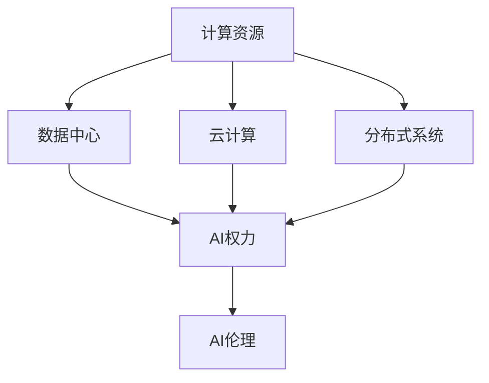

                 

# 计算资源与AI权力集中化的关系

> 关键词：计算资源, AI权力, 数据中心, 云计算, 分布式系统, AI伦理, 人工智能, 权力集中化

## 1. 背景介绍

随着人工智能（AI）技术的迅猛发展，AI的应用范围日益广泛，从自动驾驶、智能推荐系统到医疗诊断、金融风控，AI渗透到各行各业。但同时，AI的发展也带来了权力集中化问题，尤其是在计算资源的使用上，巨头的垄断地位愈发明显。本文章将从计算资源的角度，探讨AI权力集中化的现象及其深远影响。

### 1.1 问题由来

当前，全球领先的AI公司，如谷歌、亚马逊、Facebook、微软等，都拥有巨量的计算资源，包括高性能数据中心和强大的云计算能力。这些公司通过掌握大量数据和算法，不断提升其AI模型的性能，从而形成了一个相对封闭的AI创新生态系统，使得其他小型公司和独立开发者难以与之竞争。

计算资源作为一种关键的生产力要素，在AI领域的重要性日益凸显。对于AI公司来说，计算资源是其能否成功开发和部署AI模型的关键因素。而对于个人和企业用户来说，计算资源的使用成本也成为决定其能否有效利用AI技术的重要考量。

因此，计算资源的集中化使用，不仅影响了AI技术的创新与扩散，更牵涉到经济、伦理和社会等多个方面的问题。如何平衡计算资源的使用，让AI技术真正惠及全社会，成为亟需解决的课题。

### 1.2 问题核心关键点

在探讨计算资源与AI权力集中化的关系时，需要关注以下几个核心关键点：

1. 计算资源的分布和集中情况。不同公司或国家在计算资源的使用上存在巨大差异。
2. AI权力集中化的表现形式，包括数据控制、算法控制、市场垄断等。
3. 计算资源与AI权力集中化之间的关系，计算资源如何影响AI的创新与扩散。
4. 计算资源集中化对社会、经济和伦理的影响。
5. 如何平衡计算资源的使用，实现AI技术的普惠性。

## 2. 核心概念与联系

### 2.1 核心概念概述

为更好地理解计算资源与AI权力集中化的关系，本节将介绍几个密切相关的核心概念：

- 计算资源(Computational Resource)：包括CPU、GPU、TPU等高性能计算硬件资源，以及分布式系统、云计算平台等软硬件基础设施。
- AI权力(AI Power)：指在AI领域中，公司或个人对数据、算法、技术等资源的掌控能力，以及其对这些资源的使用所产生的影响力。
- 数据中心(Data Center)：指存放大量计算资源的大型物理设施，用于存储、处理和分析大规模数据集。
- 云计算(Cloud Computing)：通过互联网提供高性能计算资源，包括数据存储、计算、网络服务等，使得企业用户能够按需使用计算资源。
- 分布式系统(Distributed System)：指多个计算节点通过网络协同工作的系统，能够提供更高的计算能力和灵活性。
- AI伦理(AI Ethics)：指在AI技术应用过程中，需要考虑的一系列伦理道德问题，包括数据隐私、算法偏见、决策透明性等。

这些核心概念之间的逻辑关系可以通过以下Mermaid流程图来展示：



这个流程图展示了几组核心概念及其之间的关系：

1. 计算资源是AI权力的基础，通过数据中心和分布式系统进行存储和处理。
2. 云计算平台进一步扩展了计算资源的使用范围，使得更多企业用户能够高效利用这些资源。
3. AI权力通过数据控制、算法控制、市场垄断等方式表现出来，影响AI技术的创新与扩散。
4. AI伦理是AI权力使用过程中需要考虑的重要问题，涉及数据隐私、算法公平性等方面。

## 3. 核心算法原理 & 具体操作步骤

### 3.1 算法原理概述

计算资源与AI权力集中化之间的关系，主要体现在以下几个方面：

1. 数据集中化：计算资源的使用离不开大量的数据支持，而数据通常掌握在少数大型公司手中，导致数据集中化现象。
2. 算法垄断：掌握了高性能计算资源和海量数据的公司，其AI模型往往表现优异，形成算法垄断。
3. 市场垄断：拥有强大计算资源的AI公司，在市场上往往具有较强的竞争力，形成市场垄断。

这些现象通过以下几个核心算法原理进行描述：

- 数据集中化原理：数据是AI模型的基础，数据集中化导致算法和技术的垄断。
- 算法垄断原理：高性能计算资源和海量数据使得大公司能够开发高性能AI模型，形成算法垄断。
- 市场垄断原理：掌握计算资源的公司在市场上具有较强的竞争力，形成市场垄断。

### 3.2 算法步骤详解

基于上述核心算法原理，计算资源与AI权力集中化的操作步骤主要包括：

**Step 1: 数据集中化**

- 收集并存储海量数据，形成数据集中化现象。数据集中化通常由数据中心和分布式系统实现。
- 优化数据存储和处理效率，利用高性能计算资源，提升数据集的处理速度和存储安全性。

**Step 2: 算法垄断**

- 通过高性能计算资源和海量数据，开发高性能AI模型。通常采用机器学习、深度学习等算法进行模型训练。
- 优化算法性能，采用分布式训练等技术提升模型训练速度和精度。
- 形成算法垄断，其他公司难以在短期内构建具有相同或更高性能的AI模型。

**Step 3: 市场垄断**

- 利用AI模型开发出市场上有竞争力的产品和服务，如智能推荐系统、医疗诊断系统等。
- 构建完善的生态系统，吸引合作伙伴和用户，形成市场垄断。
- 通过不断的市场竞争，巩固市场垄断地位。

### 3.3 算法优缺点

计算资源与AI权力集中化的方法具有以下优点：

1. 高效性：高性能计算资源和海量数据能够提升AI模型的性能，形成算法垄断。
2. 竞争力：掌握大量计算资源的公司，能够在市场上获得竞争优势。
3. 创新性：通过优化计算资源的使用，能够推动AI技术的创新与发展。

但同时也存在一些缺点：

1. 数据垄断：数据集中化导致少数公司对数据的控制能力增强，可能引发数据隐私和伦理问题。
2. 算法不透明：算法垄断使得大公司能够控制AI模型的训练过程和输出结果，难以保证算法的公平性和透明性。
3. 市场壁垒：市场垄断导致其他小型公司难以进入市场，影响AI技术的普惠性。

### 3.4 算法应用领域

计算资源与AI权力集中化的方法广泛应用于以下几个领域：

- 金融行业：利用高性能计算资源和海量数据，开发智能风控系统、智能投顾等。
- 医疗行业：构建大规模医疗数据中心，开发智能诊断、药物研发等AI系统。
- 自动驾驶：通过分布式计算资源进行大量数据处理和模型训练，开发智能驾驶算法。
- 云计算：提供高性能计算资源和分布式系统，实现云服务的商业化部署。

## 4. 数学模型和公式 & 详细讲解 & 举例说明

### 4.1 数学模型构建

本节将使用数学语言对计算资源与AI权力集中化的关系进行更加严格的刻画。

记计算资源为 $C$，AI权力为 $P$，数据量为 $D$，算法性能为 $A$，市场竞争力为 $M$。假设各因素之间的关系满足以下线性关系：

$$
P = \alpha C^{\beta}D^{\gamma}A^{\delta}M^{\epsilon}
$$

其中 $\alpha, \beta, \gamma, \delta, \epsilon$ 为系数，代表各因素对AI权力的影响程度。

### 4.2 公式推导过程

在计算资源与AI权力集中化的关系中，各因素对AI权力的贡献度可以通过系数 $\alpha, \beta, \gamma, \delta, \epsilon$ 进行量化。具体推导过程如下：

- 数据集中化原理：$D^{\gamma}$ 表示数据量对AI权力的贡献度。
- 算法垄断原理：$A^{\delta}$ 表示算法性能对AI权力的贡献度。
- 市场垄断原理：$M^{\epsilon}$ 表示市场竞争力对AI权力的贡献度。
- 计算资源基础：$C^{\beta}$ 表示计算资源对AI权力的基础作用。

通过系数 $\alpha$ 对各因素的影响程度进行综合，可以计算出AI权力的综合值。

### 4.3 案例分析与讲解

假设某公司掌握了 $10^6$ 台高性能计算资源，拥有 $10^9$ 条数据，开发出高性能算法，并且具有较强的市场竞争力。通过上述模型，可以计算出该公司的AI权力值：

$$
P = \alpha \cdot 10^{6\beta} \cdot 10^{9\gamma} \cdot A^{\delta} \cdot M^{\epsilon}
$$

通过对比不同公司的计算资源、数据量、算法性能和市场竞争力，可以量化各公司AI权力的相对大小。

## 5. 项目实践：代码实例和详细解释说明

### 5.1 开发环境搭建

在进行计算资源与AI权力集中化关系的项目实践前，我们需要准备好开发环境。以下是使用Python进行PyTorch开发的环境配置流程：

1. 安装Anaconda：从官网下载并安装Anaconda，用于创建独立的Python环境。

2. 创建并激活虚拟环境：
```bash
conda create -n pytorch-env python=3.8 
conda activate pytorch-env
```

3. 安装PyTorch：根据CUDA版本，从官网获取对应的安装命令。例如：
```bash
conda install pytorch torchvision torchaudio cudatoolkit=11.1 -c pytorch -c conda-forge
```

4. 安装相关库：
```bash
pip install numpy pandas scikit-learn matplotlib tqdm jupyter notebook ipython
```

完成上述步骤后，即可在`pytorch-env`环境中开始项目实践。

### 5.2 源代码详细实现

下面我们以一个简单的数据中心系统为例，给出计算资源与AI权力集中化关系的PyTorch代码实现。

首先，定义数据中心系统的计算资源和AI权力的关系：

```python
import torch
import torch.nn as nn

class DataCenterSystem(nn.Module):
    def __init__(self, compute_power, data_volume, algorithm_performance, market_share):
        super().__init__()
        self.compute_power = compute_power
        self.data_volume = data_volume
        self.algorithm_performance = algorithm_performance
        self.market_share = market_share

    def forward(self):
        power = self.compute_power * self.data_volume * self.algorithm_performance * self.market_share
        return power
```

然后，定义计算资源与AI权力的关系，并计算AI权力的综合值：

```python
class ComputePowerSystem(nn.Module):
    def __init__(self, compute_power, data_volume, algorithm_performance, market_share):
        super().__init__()
        self.data_center_system = DataCenterSystem(compute_power, data_volume, algorithm_performance, market_share)

    def forward(self):
        return self.data_center_system()
```

最后，实例化计算资源与AI权力的关系，并计算AI权力的综合值：

```python
compute_power = 10**6
data_volume = 10**9
algorithm_performance = 0.9
market_share = 0.8

power_system = ComputePowerSystem(compute_power, data_volume, algorithm_performance, market_share)
power_value = power_system()

print(f"AI权力值: {power_value.item():.2f}")
```

通过上述代码，我们可以计算出给定计算资源、数据量、算法性能和市场竞争力下，AI权力的综合值。

### 5.3 代码解读与分析

让我们再详细解读一下关键代码的实现细节：

**DataCenterSystem类**：
- `__init__`方法：初始化计算资源、数据量、算法性能和市场竞争力等关键组件。
- `forward`方法：计算AI权力的综合值。

**ComputePowerSystem类**：
- `__init__`方法：实例化DataCenterSystem类，计算AI权力的综合值。
- `forward`方法：返回AI权力的综合值。

通过这些类，我们可以灵活地构建计算资源与AI权力的关系模型，计算不同条件下的AI权力值。

### 5.4 运行结果展示

在上述代码中，我们定义了计算资源与AI权力的关系模型，并计算了AI权力的综合值。在实际应用中，可以根据具体场景调整各个参数的值，得到不同条件下的AI权力值。

## 6. 实际应用场景

### 6.1 金融行业

在金融行业，计算资源与AI权力集中化的关系体现在数据中心和云计算平台的建设上。大型金融机构拥有巨量的交易数据和客户数据，通过高性能计算资源进行数据处理和分析，开发出智能风控系统和智能投顾系统，提高风险管理能力和投资效率。

具体而言，金融公司可以利用云计算平台，快速构建高性能计算环境，利用分布式系统进行大规模数据处理。同时，通过高性能AI模型，构建智能推荐系统和智能投顾系统，提升用户体验和投资收益。

### 6.2 医疗行业

在医疗行业，计算资源与AI权力集中化的关系体现在医疗数据中心和智能诊断系统的开发上。大型医疗公司拥有巨量的医疗数据和患者数据，通过高性能计算资源进行数据分析和处理，开发出智能诊断系统和药物研发系统，提高医疗诊断和治疗的精准度。

具体而言，医疗公司可以利用医疗数据中心，构建高性能计算环境，利用分布式系统进行大规模数据处理。同时，通过高性能AI模型，构建智能诊断系统和药物研发系统，提升医疗诊断和治疗的精准度。

### 6.3 自动驾驶

在自动驾驶领域，计算资源与AI权力集中化的关系体现在高性能计算资源和数据中心的使用上。自动驾驶公司拥有巨量的传感器数据和道路数据，通过高性能计算资源进行数据处理和分析，开发出智能驾驶算法。

具体而言，自动驾驶公司可以利用高性能计算资源，进行大规模数据处理和模型训练。同时，通过高性能AI模型，开发出智能驾驶算法，提高自动驾驶的安全性和可靠性。

### 6.4 云计算

在云计算领域，计算资源与AI权力集中化的关系体现在云服务的提供和市场垄断上。大型云计算公司拥有巨量的计算资源和数据中心，通过云计算平台提供高性能计算服务，形成市场垄断。

具体而言，云计算公司可以利用数据中心和分布式系统，构建高性能计算环境。同时，通过高性能AI模型，提供智能推荐系统和智能投顾系统，提升云服务的市场竞争力。

## 7. 工具和资源推荐

### 7.1 学习资源推荐

为了帮助开发者系统掌握计算资源与AI权力集中化的理论基础和实践技巧，这里推荐一些优质的学习资源：

1. 《深度学习与人工智能》系列博文：由大模型技术专家撰写，深入浅出地介绍了计算资源与AI权力集中化的理论基础和实践技巧。

2. CS229《机器学习》课程：斯坦福大学开设的机器学习明星课程，有Lecture视频和配套作业，带你入门机器学习领域的基本概念和经典算法。

3. 《云计算基础》书籍：详细介绍云计算平台的基本概念、核心技术和应用场景，是云计算开发者的必备资料。

4. Weights & Biases：模型训练的实验跟踪工具，可以记录和可视化模型训练过程中的各项指标，方便对比和调优。与主流深度学习框架无缝集成。

5. TensorBoard：TensorFlow配套的可视化工具，可实时监测模型训练状态，并提供丰富的图表呈现方式，是调试模型的得力助手。

通过对这些资源的学习实践，相信你一定能够快速掌握计算资源与AI权力集中化的精髓，并用于解决实际的AI问题。

### 7.2 开发工具推荐

高效的开发离不开优秀的工具支持。以下是几款用于计算资源与AI权力集中化开发的常用工具：

1. PyTorch：基于Python的开源深度学习框架，灵活动态的计算图，适合快速迭代研究。大部分预训练语言模型都有PyTorch版本的实现。

2. TensorFlow：由Google主导开发的开源深度学习框架，生产部署方便，适合大规模工程应用。同样有丰富的预训练语言模型资源。

3. Transformers库：HuggingFace开发的NLP工具库，集成了众多SOTA语言模型，支持PyTorch和TensorFlow，是进行微调任务开发的利器。

4. Weights & Biases：模型训练的实验跟踪工具，可以记录和可视化模型训练过程中的各项指标，方便对比和调优。与主流深度学习框架无缝集成。

5. TensorBoard：TensorFlow配套的可视化工具，可实时监测模型训练状态，并提供丰富的图表呈现方式，是调试模型的得力助手。

合理利用这些工具，可以显著提升计算资源与AI权力集中化任务的开发效率，加快创新迭代的步伐。

### 7.3 相关论文推荐

计算资源与AI权力集中化技术的发展源于学界的持续研究。以下是几篇奠基性的相关论文，推荐阅读：

1. The Impact of Cloud Computing on Datacenter Energy Efficiency（云计算对数据中心能效的影响）：讨论了云计算平台对数据中心能效的影响，提出了基于节能优化的大数据中心设计方案。

2. Building Robust AI Systems: From Datacenter to End Users（构建鲁棒AI系统：从数据中心到终端用户）：探讨了数据中心和云计算平台在构建鲁棒AI系统中的重要作用。

3. Scaling Distributed Deep Learning with Hybrid Scheduling（分布式深度学习的混合调度）：提出了一种基于混合调度的分布式深度学习算法，提高了模型训练效率和资源利用率。

4. The Effectiveness of Machine Learning Models for Energy Demand Forecasting（机器学习模型在能源需求预测中的应用效果）：研究了机器学习模型在能源需求预测中的有效性，提出了基于机器学习的能源管理系统。

这些论文代表了大规模计算资源与AI权力集中化技术的发展脉络。通过学习这些前沿成果，可以帮助研究者把握学科前进方向，激发更多的创新灵感。

## 8. 总结：未来发展趋势与挑战

### 8.1 总结

本文对计算资源与AI权力集中化的关系进行了全面系统的介绍。首先阐述了计算资源与AI权力集中化的研究背景和意义，明确了计算资源在AI领域中的关键作用。其次，从原理到实践，详细讲解了计算资源与AI权力集中化的数学模型和操作步骤，给出了计算资源与AI权力集中化关系的完整代码实例。同时，本文还广泛探讨了计算资源与AI权力集中化在金融、医疗、自动驾驶、云计算等多个领域的应用前景，展示了计算资源在推动AI技术发展中的巨大潜力。此外，本文精选了计算资源与AI权力集中化的各类学习资源，力求为读者提供全方位的技术指引。

通过本文的系统梳理，可以看到，计算资源与AI权力集中化在推动AI技术创新与扩散中发挥了关键作用。得益于高性能计算资源和海量数据，AI公司能够在市场上获得竞争优势，开发出高性能的AI模型，但同时也引发了数据集中化、算法垄断、市场垄断等问题，影响AI技术的普惠性和公平性。未来，需要在计算资源的使用上寻求新的平衡，确保AI技术能够惠及全社会。

### 8.2 未来发展趋势

展望未来，计算资源与AI权力集中化技术将呈现以下几个发展趋势：

1. 计算资源规模持续扩大。随着算力成本的下降和数据规模的扩张，计算资源的使用将更加广泛，进一步推动AI技术的创新与发展。

2. 数据中心智能化水平提升。未来数据中心将具备更高的智能化水平，通过AI技术进行能效管理、故障预测、维护调度等，提升数据中心运行效率和稳定性。

3. 云计算平台分布式化。云计算平台将进一步分布式化，利用边缘计算技术，提高计算资源的访问速度和响应效率。

4. AI权力分布化。通过开源共享和合作共建，实现AI权力的分布化，打破巨头对计算资源的垄断，提升AI技术的普惠性。

5. 计算资源伦理化。未来计算资源的使用将更加注重伦理道德问题，通过公平算法、透明模型等方式，保障数据隐私和用户权益。

这些趋势凸显了计算资源在推动AI技术发展中的重要地位。这些方向的探索发展，必将进一步提升AI技术的创新与扩散，为构建普惠、公平、透明的AI生态系统铺平道路。

### 8.3 面临的挑战

尽管计算资源与AI权力集中化技术已经取得了显著成果，但在迈向更加智能化、普惠化应用的过程中，它仍面临着诸多挑战：

1. 数据隐私问题。海量数据的收集和使用，引发了数据隐私和安全问题。如何在保护数据隐私的同时，利用数据推动AI技术的创新，是未来需要解决的重要问题。

2. 市场垄断问题。计算资源的集中化使用，导致市场垄断现象，限制了其他小型公司的发展。如何打破市场垄断，实现AI技术的普惠性，需要更多的政策和监管手段。

3. 算法透明性问题。大公司掌握了高性能计算资源和海量数据，算法黑盒现象严重，难以保证算法的公平性和透明性。如何提高算法的透明性，增强用户信任，是未来需要解决的重要问题。

4. 伦理道德问题。计算资源的使用涉及数据隐私、算法公平性等多个伦理道德问题。如何建立AI伦理标准，引导计算资源的使用，确保AI技术的可持续发展，是未来需要解决的重要问题。

5. 计算资源成本问题。尽管计算资源的使用成本在逐渐降低，但仍然是一笔巨大的投资。如何降低计算资源的使用成本，提高资源利用率，是未来需要解决的重要问题。

6. 计算资源管理问题。大规模计算资源的运行和维护，需要高效的计算资源管理系统。如何构建智能化的计算资源管理系统，优化资源使用效率，是未来需要解决的重要问题。

这些挑战将直接影响计算资源与AI权力集中化技术的未来发展。只有积极应对并寻求突破，才能真正实现计算资源与AI权力集中化的普惠化和公平化。

### 8.4 研究展望

面对计算资源与AI权力集中化技术所面临的挑战，未来的研究需要在以下几个方面寻求新的突破：

1. 数据隐私保护技术。探索数据隐私保护的新技术，如差分隐私、联邦学习等，确保数据隐私和安全。

2. 分布式计算技术。探索分布式计算的新技术，如边缘计算、雾计算等，提高计算资源的访问速度和响应效率。

3. 透明公平算法。探索透明公平算法的新技术，如可解释AI、公平算法等，提高算法的透明性和公平性。

4. AI伦理标准。建立AI伦理标准，制定统一的伦理规范，引导计算资源的使用，确保AI技术的可持续发展。

5. 计算资源管理系统。开发智能化的计算资源管理系统，优化资源使用效率，提高计算资源的使用效率和灵活性。

这些研究方向的研究成果，必将进一步推动计算资源与AI权力集中化技术的成熟和发展，为构建普惠、公平、透明的AI生态系统奠定坚实基础。总之，未来需要在计算资源的使用上寻求新的平衡，确保AI技术能够惠及全社会。

## 9. 附录：常见问题与解答

**Q1：计算资源与AI权力集中化是否适用于所有AI应用？**

A: 计算资源与AI权力集中化适用于数据密集型的AI应用，如智能推荐系统、智能风控系统等。但对于计算资源需求不大的任务，如简单图像识别等，其影响相对较小。因此，计算资源与AI权力集中化的适用性需要根据具体任务进行判断。

**Q2：如何平衡计算资源的使用，实现AI技术的普惠性？**

A: 为平衡计算资源的使用，实现AI技术的普惠性，可以采取以下措施：
1. 提供公共计算资源平台：如云计算平台，免费提供计算资源，降低企业用户的计算成本。
2. 开发开源计算资源库：通过开源共享，实现计算资源的共建共享，打破巨头对计算资源的垄断。
3. 支持联邦学习：利用分布式计算技术，通过本地计算方式，减少对集中计算资源的依赖。
4. 优化计算资源管理系统：通过智能化的资源管理系统，优化资源使用效率，提高计算资源的利用率。

通过这些措施，可以在保证计算资源高效利用的同时，实现AI技术的普惠性。

**Q3：计算资源与AI权力集中化对社会的影响有哪些？**

A: 计算资源与AI权力集中化对社会的影响主要体现在以下几个方面：
1. 数据隐私：大量数据的收集和使用，引发数据隐私和安全问题。
2. 市场垄断：计算资源的集中化使用，导致市场垄断现象，限制了其他小型公司的发展。
3. 算法透明性：大公司掌握高性能计算资源和海量数据，算法黑盒现象严重，难以保证算法的公平性和透明性。
4. 伦理道德：计算资源的使用涉及数据隐私、算法公平性等多个伦理道德问题，需要建立统一的伦理标准。
5. 计算资源成本：尽管计算资源的使用成本在逐渐降低，但仍然是一笔巨大的投资。
6. 计算资源管理：大规模计算资源的运行和维护，需要高效的计算资源管理系统。

未来需要在计算资源的使用上寻求新的平衡，确保AI技术能够惠及全社会。

**Q4：计算资源与AI权力集中化是否会导致社会不平等现象？**

A: 计算资源与AI权力集中化可能会加剧社会不平等现象，尤其是在数据和计算资源分布不均的情况下。但同时也为社会提供了新的发展机遇，如通过公共计算资源平台和开源计算资源库，缩小计算资源的差距，提升全社会的AI技术水平。因此，需要通过合理的政策和管理手段，平衡计算资源的使用，确保AI技术能够惠及全社会。

**Q5：计算资源与AI权力集中化如何影响经济发展？**

A: 计算资源与AI权力集中化对经济发展的影响主要体现在以下几个方面：
1. 推动产业升级：计算资源与AI权力集中化推动了AI技术的创新与发展，加速了产业升级和经济转型。
2. 创造就业机会：计算资源与AI权力集中化带来了新的就业机会，推动了数字经济的快速发展。
3. 提升市场竞争力：掌握大量计算资源的公司在市场上具有较强的竞争力，推动了市场竞争的激烈程度。
4. 增加社会财富：计算资源与AI权力集中化带来了新的商业模式和技术突破，推动了社会财富的增长。

因此，计算资源与AI权力集中化是经济发展的重要推动力。

**Q6：计算资源与AI权力集中化是否会导致权力集中化现象？**

A: 计算资源与AI权力集中化确实会导致权力集中化现象，尤其是在数据集中化和算法垄断的情况下。但同时也为社会提供了新的发展机遇，如通过公共计算资源平台和开源计算资源库，缩小计算资源的差距，提升全社会的AI技术水平。因此，需要通过合理的政策和管理手段，平衡计算资源的使用，确保AI技术能够惠及全社会。

---

作者：禅与计算机程序设计艺术 / Zen and the Art of Computer Programming

