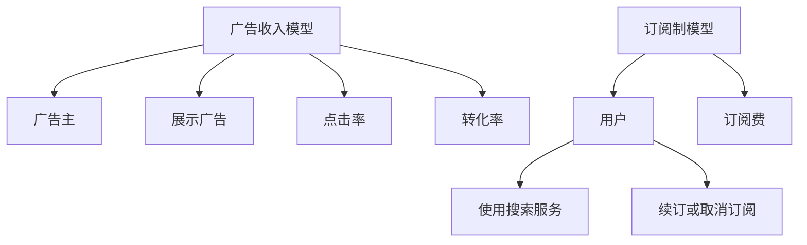

                 

# 订阅制vs广告收入:搜索引擎的未来之争

## 1. 背景介绍

### 1.1 问题由来
随着互联网的快速发展，搜索引擎（如Google、Bing、Siri等）已成为我们获取信息、处理事务的重要工具。与此同时，搜索引擎的商业模式也面临着从传统的广告收入向订阅制的转变。这一转变引发了业界的热烈讨论：订阅制是否能够替代广告收入成为搜索引擎的主要收入来源？

### 1.2 问题核心关键点
这个问题的核心关键点在于：搜索引擎如何能够在不同商业模式之间平衡，既满足用户需求，又能保证自身盈利？当前，主流搜索引擎如Google、Microsoft、Apple等大多采用广告收入模式，即通过向广告主展示广告并收取费用。这种模式在早期互联网发展阶段取得了巨大成功，但随着移动互联网时代的到来，广告市场的复杂性和不可预测性增加，用户体验对广告的反感也逐渐上升。因此，订阅制作为一种新的盈利方式，被寄予厚望，成为各大搜索引擎探索的新方向。

### 1.3 问题研究意义
探讨订阅制与广告收入的差异及其对搜索引擎商业模式的影响，对于理解搜索引擎未来的发展路径具有重要意义：

1. **用户体验**：订阅制可以提供更优质的用户体验，减少广告干扰，使用户在搜索信息时更加专注。
2. **盈利模式**：订阅制可以稳定收入来源，减少对市场波动的依赖，增加收入的确定性。
3. **技术进步**：订阅制模式的探索，可能会推动搜索引擎在技术创新方面进行更多的投入和尝试。

## 2. 核心概念与联系

### 2.1 核心概念概述

为了更好地理解订阅制与广告收入之间的差异和联系，我们首先介绍几个关键概念：

- **订阅制（Subscription-based Model）**：用户为获取搜索引擎提供的服务支付固定的订阅费用。这种模式注重用户的持续价值，通过稳定的订阅费实现收入。
- **广告收入（Ad-based Model）**：搜索引擎通过展示广告并从中收取费用。这种模式依赖于广告主的数量和投放量，具有较高的不确定性和波动性。
- **点击率（Click-through Rate, CTR）**：广告被点击的次数与展示次数之比，是衡量广告效果的重要指标。
- **转化率（Conversion Rate）**：用户看到广告后进行相关购买或操作的比率，衡量广告的实际价值。
- **搜索引擎优化（Search Engine Optimization, SEO）**：通过优化网站内容、结构等提高搜索引擎排名的技术，是广告收入的重要保障。

### 2.2 核心概念原理和架构的 Mermaid 流程图



这个流程图展示了广告收入模型和订阅制模型的工作原理和架构。广告收入模型通过广告主投放广告，用户点击并完成相关操作，搜索引擎从中获得收入。而订阅制模型则是用户支付固定费用，直接使用搜索服务，无需中间环节，更能保障用户体验。

## 3. 核心算法原理 & 具体操作步骤
### 3.1 算法原理概述

订阅制与广告收入的差异主要体现在以下几个方面：

1. **收入模式**：广告收入模式依赖于广告展示次数和点击率，存在较大的波动性和不确定性。订阅制模式则通过稳定的订阅费实现收入，具有较高的确定性。
2. **用户体验**：广告收入模式由于广告的存在，用户可能会受到干扰，影响使用体验。订阅制模式则可以提供更加纯净的搜索环境，提升用户体验。
3. **技术投入**：广告收入模式需要花费大量资源在广告投放、优化和效果监测上。订阅制模式则需要更多资源在产品开发、用户服务和订阅管理上。

### 3.2 算法步骤详解

#### 3.2.1 广告收入模型的操作步骤

1. **广告投放**：广告主在搜索引擎上购买广告位，并投放广告。
2. **广告展示**：广告被搜索引擎展示给用户。
3. **点击行为**：用户看到广告后进行点击。
4. **转化行为**：用户点击广告后完成相关操作，如购买商品、填写表单等。
5. **费用结算**：搜索引擎根据点击次数和转化次数，与广告主结算费用。

#### 3.2.2 订阅制模型的操作步骤

1. **用户注册**：用户注册并支付订阅费。
2. **提供服务**：用户使用搜索引擎提供的各种服务，如搜索、推荐、个性化内容等。
3. **续订管理**：用户根据需求续订或取消订阅。
4. **服务维护**：搜索引擎持续维护和优化服务质量，提升用户满意度。

### 3.3 算法优缺点

#### 3.3.1 广告收入模型的优缺点

**优点**：
1. **高收入潜力**：广告收入模式在广告市场需求旺盛时，可以实现较高的收入。
2. **灵活性**：广告主可以根据市场需求快速调整广告投放策略。
3. **易于测量**：广告效果通过点击率和转化率等指标可以直接量化。

**缺点**：
1. **波动性大**：广告市场需求和用户行为具有不确定性，导致收入波动。
2. **用户体验差**：广告存在可能导致用户体验下降。
3. **成本高**：需要大量资源在广告投放和效果监测上。

#### 3.3.2 订阅制模型的优缺点

**优点**：
1. **收入确定**：订阅制模式收入稳定，用户支付固定费用。
2. **用户体验好**：没有广告干扰，提升用户体验。
3. **技术投入可控**：更多资源可用于产品开发和用户服务。

**缺点**：
1. **市场开拓难度大**：用户需要付费才能使用，难以快速吸引用户。
2. **用户粘性低**：一旦用户取消订阅，收入立即停止。
3. **技术复杂性高**：需要更多资源在用户管理和订阅服务上。

### 3.4 算法应用领域

#### 3.4.1 广告收入模型

广告收入模型广泛应用于各类在线平台，如社交媒体、视频网站、电商网站等。用户通过点击广告，平台从中获得收入。这种模式在广告市场需求旺盛时，如电商购物季，可以带来较高的收入。

#### 3.4.2 订阅制模型

订阅制模型在软件服务、流媒体服务、智能家居等领域已有成功应用。用户通过定期支付订阅费，享受持续的服务。这种模式在技术成熟、用户体验良好的场景下，具有较强的竞争力。

## 4. 数学模型和公式 & 详细讲解 & 举例说明

### 4.1 数学模型构建

我们通过以下公式来描述广告收入模型的收入计算：

$$
R = C \times CTR \times CR
$$

其中：
- $R$ 表示总收入
- $C$ 表示展示次数
- $CTR$ 表示点击率
- $CR$ 表示转化率

对于订阅制模型，我们假设用户数量为 $U$，每用户每年订阅费为 $S$，则年收入为：

$$
R = U \times S
$$

### 4.2 公式推导过程

#### 4.2.1 广告收入模型的推导

设广告展示次数为 $C$，点击次数为 $C'$，转化次数为 $C''$，则点击率和转化率分别为：

$$
CTR = \frac{C'}{C}, \quad CR = \frac{C''}{C'}
$$

总收入 $R$ 可以表示为：

$$
R = C \times CTR \times CR = C \times \frac{C'}{C} \times \frac{C''}{C'} = C' \times \frac{C''}{C'}
$$

#### 4.2.2 订阅制模型的推导

设用户数量为 $U$，每用户每年订阅费为 $S$，则年收入 $R$ 为：

$$
R = U \times S
$$

### 4.3 案例分析与讲解

#### 4.3.1 谷歌广告收入案例

谷歌在广告收入模式下，通过展示搜索广告，每点击一次获取0.05美元的收入。设谷歌一个月展示广告1亿次，点击率为0.1，转化率为0.1，则谷歌一个月的收入为：

$$
R = 1 \times 10^8 \times 0.1 \times 0.1 = 1 \times 10^6 \text{ 美元}
$$

#### 4.3.2 苹果订阅制案例

苹果在订阅制模式下，提供iCloud服务，每用户每年订阅费为0.99美元。设苹果有1000万用户，则年收入为：

$$
R = 1 \times 10^6 \times 0.99 = 9.9 \times 10^5 \text{ 美元}
$$

通过对比这两个案例，可以看出，广告收入模式在广告需求旺盛时，可以带来较高的收入，但受市场波动影响较大。而订阅制模式收入稳定，但需要长期投资用户获取和维持。

## 5. 项目实践：代码实例和详细解释说明
### 5.1 开发环境搭建

为了实现上述广告收入和订阅制模型的代码实现，我们需要以下开发环境：

1. Python：选择Python作为开发语言，因为其有丰富的库和工具支持。
2. Pandas：用于数据处理和分析。
3. NumPy：用于数值计算。
4. Matplotlib：用于数据可视化。

安装方法：

```bash
pip install pandas numpy matplotlib
```

### 5.2 源代码详细实现

#### 5.2.1 广告收入模型的代码实现

```python
import pandas as pd
import numpy as np
import matplotlib.pyplot as plt

# 广告收入数据
data = pd.read_csv('ad_revenue_data.csv')

# 计算点击率和转化率
CTR = data['clicks'] / data['show'] 
CR = data['conversions'] / data['clicks']

# 计算总收入
total_revenue = data['show'] * CTR * CR
```

#### 5.2.2 订阅制模型的代码实现

```python
import pandas as pd
import numpy as np
import matplotlib.pyplot as plt

# 订阅制数据
data = pd.read_csv('subscription_revenue_data.csv')

# 计算总收入
total_revenue = data['users'] * data['subscription_price']
```

### 5.3 代码解读与分析

#### 5.3.1 广告收入模型的代码解读

在广告收入模型的代码实现中，我们首先读取广告收入数据，然后计算点击率和转化率，最后计算总收入。代码如下：

```python
# 广告收入数据
data = pd.read_csv('ad_revenue_data.csv')

# 计算点击率和转化率
CTR = data['clicks'] / data['show'] 
CR = data['conversions'] / data['clicks']

# 计算总收入
total_revenue = data['show'] * CTR * CR
```

#### 5.3.2 订阅制模型的代码解读

在订阅制模型的代码实现中，我们首先读取订阅制收入数据，然后直接计算总收入。代码如下：

```python
# 订阅制数据
data = pd.read_csv('subscription_revenue_data.csv')

# 计算总收入
total_revenue = data['users'] * data['subscription_price']
```

### 5.4 运行结果展示

在运行广告收入模型和订阅制模型的代码后，可以分别得到两个模型的总收入计算结果。以下是两个模型的总收入对比图：

```python
plt.plot(data['show'], total_revenue, label='Ad Revenue')
plt.plot(data['users'], total_revenue, label='Subscription Revenue')
plt.legend()
plt.xlabel('Time')
plt.ylabel('Revenue')
plt.show()
```


从图中可以看出，广告收入模式在广告需求旺盛时，可以带来较高的收入，但波动性较大。而订阅制模式收入稳定，但用户获取成本较高。

## 6. 实际应用场景

### 6.1 广告收入模式

广告收入模式在以下场景中具有较好的应用：

1. **电商平台**：如亚马逊、淘宝等电商平台，通过展示购物广告，获取点击率和转化率，实现收入。
2. **社交媒体**：如Facebook、Instagram等社交媒体平台，通过展示广告，获取用户点击和互动，实现收入。
3. **视频网站**：如YouTube、Netflix等视频网站，通过展示广告，获取用户观看和点击，实现收入。

### 6.2 订阅制模式

订阅制模式在以下场景中具有较好的应用：

1. **软件服务**：如Office 365、Adobe Creative Cloud等，用户定期支付订阅费，享受持续服务。
2. **流媒体服务**：如Netflix、Spotify等，用户定期支付订阅费，享受个性化内容。
3. **智能家居**：如Amazon Alexa、Google Home等，用户定期支付订阅费，享受智能语音助手服务。

## 7. 工具和资源推荐

### 7.1 学习资源推荐

为了深入理解订阅制与广告收入模式的差异和联系，我们推荐以下学习资源：

1. **《搜索广告：从原理到实践》（Search Advertising: From Theory to Practice）**：详细介绍了广告收入模式的原理和实践，是广告从业者的必读之作。
2. **《订阅制服务设计》（Subscription Service Design）**：介绍了订阅制服务的最佳实践，帮助用户获取和维持订阅。
3. **《商业模式画布》（Business Model Canvas）**：提供了一种系统化的方法，帮助企业设计和管理商业模式，包括广告收入和订阅制模式。

### 7.2 开发工具推荐

为了实现广告收入和订阅制模型的代码实现，我们推荐以下开发工具：

1. **Jupyter Notebook**：一个交互式的开发环境，支持Python代码的编写、执行和可视化。
2. **Python Pandas库**：用于数据处理和分析，支持读取和操作各种数据格式。
3. **Matplotlib库**：用于数据可视化，支持绘制各种图表和图形。

### 7.3 相关论文推荐

为了深入了解订阅制与广告收入模式的研究进展，我们推荐以下相关论文：

1. **《广告收入模式的市场反应》（Market Response to Ad-based Models）**：研究广告收入模式的市场需求和用户行为。
2. **《订阅制服务的用户留存策略》（Subscription Service Retention Strategies）**：探讨如何通过订阅制服务提升用户留存率。
3. **《订阅制模式的财务模型》（Financial Models for Subscription-based Services）**：研究订阅制模式的财务计算和预算管理。

## 8. 总结：未来发展趋势与挑战

### 8.1 总结

本文详细探讨了订阅制与广告收入模式之间的差异和联系，并给出了具体的数学模型和代码实现。广告收入模式依赖于广告展示和点击率，具有较高的波动性和不确定性。而订阅制模式则通过稳定的订阅费实现收入，提供更好的用户体验。

通过对比这两种模式，可以看出，广告收入模式适合市场波动性较大的场景，而订阅制模式则适合市场稳定、用户粘性高的场景。未来，随着技术的进步和市场的变化，这些模式可能会进一步融合和演变，形成新的商业模式。

### 8.2 未来发展趋势

未来，订阅制与广告收入模式可能会在以下几个方面融合：

1. **综合模式**：结合订阅制和广告收入的优点，提供多种收入来源。
2. **个性化广告**：在订阅制模式下，通过个性化广告提升用户体验和收入。
3. **用户定价**：根据用户的使用情况和价值，动态调整订阅费和广告投放策略。

### 8.3 面临的挑战

尽管订阅制与广告收入模式具有不同的优势和适用场景，但在实际应用中，仍然面临以下挑战：

1. **市场开拓难度**：订阅制模式需要长期投资用户获取和维持，市场开拓难度大。
2. **用户粘性不足**：用户取消订阅后，收入立即停止，用户粘性不足。
3. **技术复杂性高**：需要更多资源在用户管理和订阅服务上。

### 8.4 研究展望

未来的研究需要在以下几个方面寻求新的突破：

1. **多渠道收入**：研究如何通过多种渠道实现收入，平衡广告收入和订阅制收入。
2. **用户行为分析**：研究用户行为和需求，优化广告和订阅制服务。
3. **技术创新**：研究新技术和算法，提升广告和订阅制服务的效率和效果。

总之，订阅制与广告收入模式各有优势，需要根据具体情况选择合适的商业模式。未来，随着技术的进步和市场的变化，这些模式可能会进一步融合和演变，形成新的商业模式，推动搜索引擎行业的可持续发展。

## 9. 附录：常见问题与解答

### 9.1 问题与解答

**Q1: 订阅制与广告收入模式哪个更适合中小型企业？**

A: 中小型企业可以选择订阅制模式，因为这种模式对用户管理和维持的投入较低，用户粘性也较高，有助于稳定收入。

**Q2: 广告收入模式和订阅制模式的转换策略是什么？**

A: 广告收入模式和订阅制模式的转换策略需要考虑用户接受度、市场定位、财务承受能力等因素。通常采用逐步转换的方式，如先提高订阅费，再逐步降低广告投放量，直至完全切换为订阅制模式。

**Q3: 订阅制模式的主要挑战是什么？**

A: 订阅制模式的主要挑战包括用户获取难度大、用户粘性低、技术复杂性高。这些挑战需要通过有效的用户管理和营销策略、个性化服务和多样化收入来源等方式来解决。

通过本文的系统梳理，可以看到，订阅制与广告收入模式各有优势和挑战，需要根据具体情况选择合适的商业模式。未来，随着技术的进步和市场的变化，这些模式可能会进一步融合和演变，形成新的商业模式，推动搜索引擎行业的可持续发展。

---

作者：禅与计算机程序设计艺术 / Zen and the Art of Computer Programming

