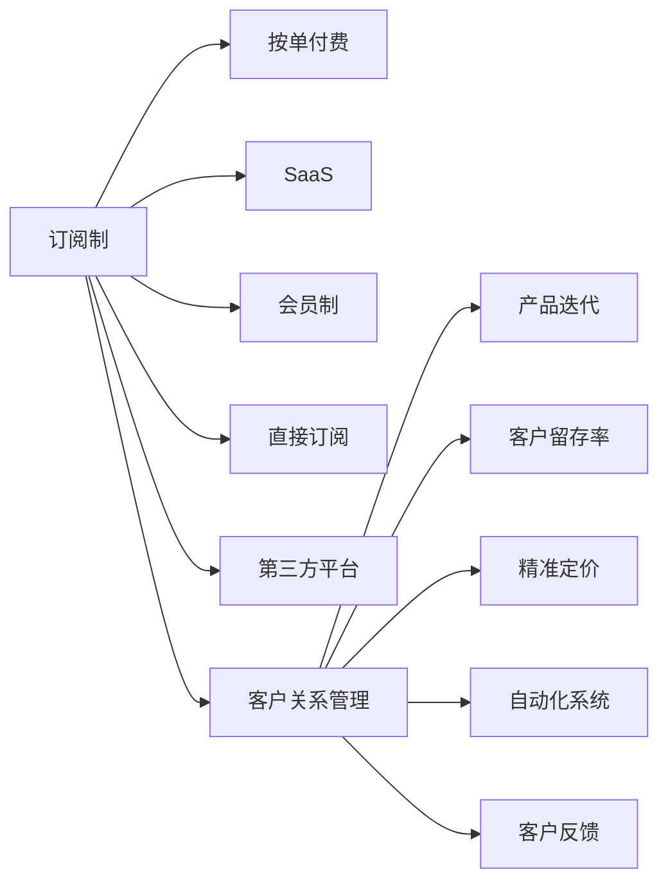

                 

# 订阅制创业：打造稳定现金流的商业模式

> 关键词：订阅制、商业模式、现金流、客户关系管理、客户留存率、产品迭代、价值最大化

## 1. 背景介绍

### 1.1 问题由来
在快速变化的商业环境中，企业需要不断创新以保持竞争优势。然而，传统的按单付费（如B2C电商）模式受制于订单波动，难以预测和控制现金流。订阅制模式作为一种稳定的收入来源，开始受到更多企业的青睐。

订阅制商业模式在零售、软件、教育等多个行业取得了显著成功，成为众多公司选择的主要业务模式。这种模式通过定期收取客户费用，降低了客户流失率，提升了品牌忠诚度。

### 1.2 问题核心关键点
- **客户关系管理**：订阅制模式强调长期客户关系，客户关系管理（CRM）是成功的关键。
- **产品迭代**：定期提供有价值的产品或服务更新，保持客户订阅兴趣。
- **客户留存率**：通过优惠、折扣、个性化服务等手段提高客户留存率。
- **精准定价**：根据客户价值和市场竞争情况，制定合理的订阅价格。
- **自动化系统**：使用自动化工具管理订阅流程，提升运营效率。
- **客户反馈**：建立反馈机制，及时了解客户需求和建议，优化产品和服务。

## 2. 核心概念与联系

### 2.1 核心概念概述

订阅制商业模式（Subscription Business Model）是指企业通过定期收取客户费用，提供持续的产品或服务。这种模式强调客户长期承诺，关注客户生命周期价值，有助于构建稳定的收入流和客户基础。

- **按单付费（C2C）**：一种传统商业模式，通过每次交易获取收入，适合需求波动大的市场。
- **订阅制（SaaS）**：即软件即服务，提供基于订阅的软件服务，客户按月或按年支付费用。
- **会员制**：另一种订阅制形式，提供特定服务和优惠，通过会员费获得收入。
- **直接订阅**：客户直接向企业订阅，无需中间环节。
- **第三方平台**：通过第三方平台（如Apple Store）提供订阅服务，扩展市场触达。

这些概念之间的联系主要体现在都强调长期客户关系和稳定收入流的构建。通过提供持续价值，企业能够在稳定客户关系的同时，实现长期收益。

### 2.2 核心概念原理和架构的 Mermaid 流程图(Mermaid 流程节点中不要有括号、逗号等特殊字符)


## 3. 核心算法原理 & 具体操作步骤
### 3.1 算法原理概述

订阅制商业模式的算法原理主要围绕客户关系管理和长期收入流的构建展开。核心目标是：

- 最大化客户生命周期价值（CLV）。
- 确保客户续订率。
- 提高客户满意度，促进口碑传播。

算法核心在于利用数据驱动决策，通过分析客户行为和反馈，动态调整订阅策略和产品迭代方向。

### 3.2 算法步骤详解

**Step 1: 客户获取与初始化**

1. 使用多渠道获取潜在客户：线上广告、社交媒体、线下活动等。
2. 通过调查问卷、在线测试等手段初步了解客户需求和兴趣。
3. 提供试用期或免费试用，降低客户决策成本。
4. 使用CRM系统记录客户信息，建立客户档案。

**Step 2: 订阅管理与续订**

1. 设计灵活的订阅计划，如月度、季度、年度。
2. 实施自动续订机制，减少客户流失。
3. 提供专属优惠和折扣，吸引客户续费。
4. 提供客服支持，解答客户疑问，提升满意度。

**Step 3: 产品迭代与反馈收集**

1. 定期收集客户反馈，分析常见问题和建议。
2. 根据反馈调整产品功能和服务。
3. 引入A/B测试，评估新功能或服务的客户接受度。
4. 发布定期更新，保持产品新鲜感。

**Step 4: 客户留存与忠诚度提升**

1. 定期发送定制化邮件，保持客户互动。
2. 提供专属内容和服务，增强客户粘性。
3. 建立积分系统，奖励忠实客户。
4. 举办线上线下活动，增强客户参与感。

**Step 5: 精准定价与优化**

1. 分析客户价值和市场竞争，制定合理的订阅价格。
2. 实施动态定价策略，根据客户行为调整价格。
3. 使用细分定价，针对不同客户群体提供差异化定价。
4. 定期评估定价效果，调整定价策略。

### 3.3 算法优缺点

**优点：**

1. **稳定收入流**：订阅制模式能够提供稳定的收入流，降低订单波动的风险。
2. **提升客户忠诚度**：通过定期收取费用，增强客户对品牌的承诺和忠诚度。
3. **增强客户关系管理**：通过CRM系统，企业能够更好地管理客户关系，提升客户体验。
4. **促进长期增长**：订阅制模式强调长期增长，有助于构建可持续的商业生态。

**缺点：**

1. **前期投入大**：获取客户和维护订阅系统需要较大的前期投入。
2. **客户流失风险**：如果客户体验不佳或服务质量下降，可能导致客户流失。
3. **定价复杂性**：制定合理的定价策略需要精细化的数据分析和市场洞察。
4. **运营管理复杂**：需要建立和维护高效的运营体系，确保订阅流程顺畅。

### 3.4 算法应用领域

订阅制商业模式在多个领域得到了广泛应用，包括但不限于：

- **软件即服务（SaaS）**：如Salesforce、Zoom等，通过提供持续的软件服务，定期收取订阅费用。
- **电子商务（E-commerce）**：如Amazon Prime，提供会员服务，定期收取会员费。
- **健康与健身**：如Strava、Nike+等，通过提供健康和健身数据服务，定期收取订阅费用。
- **媒体与娱乐**：如Netflix、Spotify等，通过提供影视和音乐内容，定期收取订阅费用。
- **教育**：如Khan Academy、Duolingo等，通过提供教育资源，定期收取订阅费用。

## 4. 数学模型和公式 & 详细讲解 & 举例说明

### 4.1 数学模型构建

订阅制商业模式的数学模型主要基于客户生命周期价值（CLV）和客户续订率（R）的计算。

- **CLV**：客户在其生命周期内为企业带来的总收入，计算公式为：
  $$
  CLV = \frac{P}{r} \left(\frac{1-r}{1-(1+r)^{-n}}\right)
  $$
  其中 $P$ 为每次订阅费用，$r$ 为续订率，$n$ 为平均订阅期限。

- **R**：客户续订率，计算公式为：
  $$
  R = \frac{N_{renew}}{N_{total}}
  $$
  其中 $N_{renew}$ 为续订客户数，$N_{total}$ 为总客户数。

### 4.2 公式推导过程

以CLV计算公式为例，推导如下：

设客户在每次订阅期间产生的总收入为 $I$，续订次数为 $n$，则总收入为：
$$
I = P + P \cdot r + P \cdot r^2 + \cdots + P \cdot r^{n-1}
$$
即等比数列求和公式，可得：
$$
I = P \left(\frac{1-r^n}{1-r}\right)
$$
将 $I$ 表示为订阅总费用 $P \cdot n$，可得：
$$
P \cdot n = P \left(\frac{1-r^n}{1-r}\right)
$$
整理得：
$$
CLV = \frac{P \cdot n}{r} \left(\frac{1-r}{1-(1+r)^{-n}}\right)
$$

### 4.3 案例分析与讲解

假设某SaaS公司提供年订阅服务，每次订阅费用为 $P=1000$，续订率为 $r=0.8$，平均订阅期限为 $n=2$。使用上述公式计算CLV：
$$
CLV = \frac{1000 \cdot 2}{0.8} \left(\frac{1-0.8}{1-(1+0.8)^{-2}}\right) = 6250
$$

说明每个客户在其生命周期内为公司贡献了约6250元的收入。

## 5. 项目实践：代码实例和详细解释说明

### 5.1 开发环境搭建

- **编程语言**：Python
- **框架**：Django、Flask
- **数据库**：PostgreSQL、MySQL
- **前端**：React、Vue

### 5.2 源代码详细实现

**1. 用户管理模块**

```python
from django.contrib.auth.models import User
from django.contrib.auth.forms import UserCreationForm

class SignupForm(UserCreationForm):
    email = forms.EmailField()

    def save(self, commit=True):
        user = super(SignupForm, self).save(commit=False)
        user.email = self.cleaned_data['email']
        if commit:
            user.save()
        return user
```

**2. 订阅管理模块**

```python
from django.db import models
from django.core.exceptions import ObjectDoesNotExist

class Subscription(models.Model):
    user = models.ForeignKey(User, on_delete=models.CASCADE)
    plan = models.CharField(max_length=20)
    start_date = models.DateField()
    end_date = models.DateField()

    def renew(self):
        self.end_date = timezone.now() + timezone.timedelta(days=30)
        self.save()
        
class Payment(models.Model):
    subscription = models.ForeignKey(Subscription, on_delete=models.CASCADE)
    amount = models.DecimalField(max_digits=6, decimal_places=2)
    timestamp = models.DateTimeField(auto_now_add=True)
    
    def charge(self):
        # 使用第三方支付API进行支付
        pass
```

**3. 产品迭代模块**

```python
class Feature(models.Model):
    name = models.CharField(max_length=50)
    description = models.TextField()
    release_date = models.DateField()

    def activate(self):
        # 将新功能激活
        pass
```

### 5.3 代码解读与分析

- **用户管理**：使用Django的User模型，自定义SignupForm进行用户注册。
- **订阅管理**：定义Subscription和Payment模型，管理订阅信息和支付记录。
- **产品迭代**：定义Feature模型，记录新功能的发布情况，并实现激活逻辑。

### 5.4 运行结果展示

- **用户注册**：注册新用户后，系统记录用户信息并自动创建订阅账户。
- **订阅续费**：系统自动检测订阅到期时间，并通过邮件提醒用户续费。
- **功能更新**：新产品功能发布后，用户可以通过系统查看新功能，并选择激活。

## 6. 实际应用场景

### 6.1 在线教育平台

在线教育平台通过订阅制模式，向学生提供持续的教育资源和支持。平台根据学生学习进度和需求，定期推送课程更新和个性化学习计划。通过订阅费用和额外服务，平台能够实现稳定的收入流，同时提升学生满意度和留存率。

### 6.2 健身应用

健身应用提供基于订阅的健身计划和个性化训练指导。用户可以享受每月更新的训练课程、营养指导和健康数据分析。通过精准定价和会员特权，平台能够吸引和保留大量用户，实现长期增长。

### 6.3 数字订阅服务

数字订阅服务提供商，如Netflix和Spotify，通过定期收取订阅费用，提供高质量的影视和音乐内容。平台通过持续的内容更新和用户互动，提升用户粘性和满意度，实现稳定的收入流和市场份额。

### 6.4 未来应用展望

随着订阅制商业模式的不断演进，未来的应用场景将更加多样化。可以预见，订阅制模式将在更多垂直行业得到应用，如智能家居、金融科技、医疗健康等。通过精细化的客户管理和持续的价值提供，订阅制模式将进一步提升企业的市场竞争力和客户价值。

## 7. 工具和资源推荐

### 7.1 学习资源推荐

- **《订阅制商业模式的实践与策略》**：深入探讨订阅制模式的核心原理和实施策略，适合初入行的企业管理者参考。
- **《客户关系管理（CRM）系统的设计与实现》**：介绍CRM系统的关键组件和实现方法，适合技术开发者学习。
- **《数据驱动的订阅制商业模式》**：讲解如何使用数据分析提升订阅制模式的运营效率，适合市场和运营人员学习。
- **《订阅制商业模式的成功案例分析》**：通过分析成功企业的运营策略，提供实际案例和操作建议，适合企业决策者参考。

### 7.2 开发工具推荐

- **Django**：流行的Python Web框架，适合快速搭建订阅系统。
- **Flask**：灵活的Python Web框架，适合轻量级订阅服务。
- **PostgreSQL**：高效的数据库管理系统，适合存储用户数据和订阅记录。
- **React/Vue**：流行的前端框架，适合构建订阅系统的用户界面。
- **Stripe/PayPal**：流行的支付处理服务，支持多种支付方式和支付集成。

### 7.3 相关论文推荐

- **《订阅制商业模式的理论基础与实践策略》**：系统介绍订阅制模式的理论基础和实施策略，适合学术研究和学习。
- **《订阅制商业模式的数据驱动优化》**：分析订阅制模式的数据驱动优化方法，适合技术开发者参考。
- **《订阅制商业模式的用户行为分析》**：探讨订阅制模式的用户行为分析方法，适合市场和运营人员参考。
- **《订阅制商业模式的成功案例研究》**：分析多个订阅制模式成功企业的运营策略，适合企业决策者参考。

## 8. 总结：未来发展趋势与挑战

### 8.1 总结

本文详细介绍了订阅制商业模式的核心概念、算法原理和操作步骤，并通过代码实例和实际应用场景展示了其应用效果。通过本节学习，读者可以全面掌握订阅制商业模式的构建和运营方法，提升企业的市场竞争力和客户价值。

### 8.2 未来发展趋势

未来订阅制商业模式将呈现以下几个发展趋势：

1. **个性化订阅**：通过大数据和人工智能技术，提供个性化的订阅计划和服务，提升客户满意度和留存率。
2. **动态定价**：根据市场变化和客户行为，实时调整订阅价格，实现最优收益。
3. **多渠道订阅**：通过第三方平台和自建渠道，扩大订阅覆盖范围，提升市场触达能力。
4. **跨平台订阅**：提供跨平台订阅服务，如跨App订阅、跨网站订阅，提升用户粘性和便利性。
5. **智能订阅管理**：利用AI技术优化订阅管理流程，提升运营效率和客户体验。

### 8.3 面临的挑战

尽管订阅制商业模式带来了诸多优势，但在实际应用中也面临诸多挑战：

1. **客户获取成本**：获取新客户和维持订阅需要较高的前期投入。
2. **客户流失风险**：客户流失风险较高，需要持续优化客户关系管理。
3. **市场竞争激烈**：市场竞争日趋激烈，需要不断创新和提升产品和服务质量。
4. **定价策略复杂**：制定合理的订阅价格需要精细化的数据分析和市场洞察。
5. **运营管理复杂**：需要建立和维护高效的运营体系，确保订阅流程顺畅。

### 8.4 研究展望

未来的研究可以从以下几个方面寻求新的突破：

1. **订阅制模式的多样化应用**：探索订阅制模式在更多垂直行业的应用，如智能家居、金融科技、医疗健康等。
2. **个性化订阅策略**：通过大数据和人工智能技术，提供个性化的订阅计划和服务，提升客户满意度和留存率。
3. **动态定价模型**：研究动态定价模型，根据市场变化和客户行为实时调整订阅价格，实现最优收益。
4. **跨平台订阅服务**：提供跨平台订阅服务，提升用户粘性和便利性。
5. **智能订阅管理**：利用AI技术优化订阅管理流程，提升运营效率和客户体验。

通过这些研究，能够进一步提升订阅制商业模式的运营效率和客户价值，推动企业实现长期增长和市场竞争力的提升。

## 9. 附录：常见问题与解答

**Q1: 订阅制模式适用于所有企业吗？**

A: 订阅制模式适用于需要持续提供产品或服务的行业，如软件、健身、教育等。但对于需求波动大的行业，如零售、餐饮，可能不是最佳选择。

**Q2: 如何降低订阅制模式的运营成本？**

A: 通过优化客户关系管理流程、自动化支付和订阅流程，提高运营效率。同时，利用大数据和人工智能技术，提升客户预测和个性化推荐，降低获客成本。

**Q3: 订阅制模式如何应对市场竞争？**

A: 通过不断创新和优化产品和服务，提升客户体验和满意度。同时，利用动态定价和个性化订阅策略，提升市场竞争力。

**Q4: 如何提升客户留存率？**

A: 通过提供专属优惠、个性化服务和高质量内容，提升客户满意度和粘性。同时，建立反馈机制，及时了解客户需求和建议，优化产品和服务。

**Q5: 如何评估订阅制模式的成功？**

A: 评估订阅制模式的成功可以从多个指标出发，如客户留存率、CLV、续订率、收入增长率等。通过定期分析和优化，确保订阅制模式的长期稳定发展。

---

作者：禅与计算机程序设计艺术 / Zen and the Art of Computer Programming

