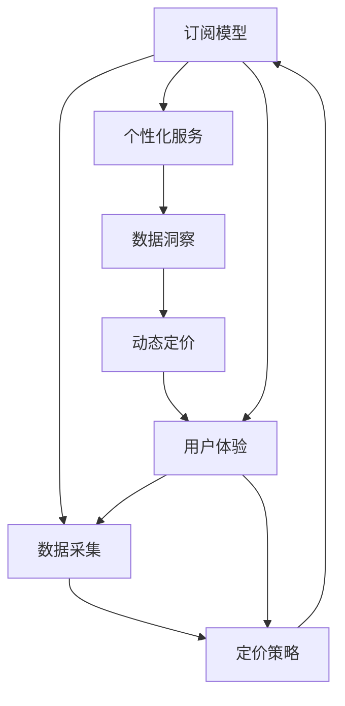

                 

# 订阅制经济的未来趋势:从所有权到使用权的转变

## 1. 背景介绍

在过去几十年里，随着全球经济的发展，传统的拥有所有权的经济模式逐渐向使用权模式转变。这一变化深刻地影响着各行各业，尤其是科技和互联网领域。随着技术的进步，尤其是云计算和大数据技术的发展，订阅制经济（Subscription Economy）正在成为新的主流。

### 1.1 问题由来

订阅制经济是指消费者按月或按年支付费用以获取持续访问或使用某产品或服务。这种模式相较于传统的一次性购买模式，更加灵活、可持续，并且能够更好地满足用户的多样化需求。然而，随着订阅制的普及，新的问题和挑战也随之而来，比如用户流失、定价策略、数据隐私等。

### 1.2 问题核心关键点

订阅制经济的核心关键点包括：

- **灵活性**：用户可以根据自身需求选择订阅时间、频次和内容。
- **成本效益**：按使用付费，避免了一次性高成本的购买。
- **持续性**：强调产品或服务的长期使用，而非一次性消费。
- **数据洞察**：通过订阅数据，企业可以获得用户行为和偏好，更好地个性化服务。
- **竞争激烈**：用户可以轻松切换订阅，导致竞争更加激烈。

这些关键点共同构成了订阅制经济的独特模式，并推动了技术的快速发展。

## 2. 核心概念与联系

### 2.1 核心概念概述

订阅制经济涉及多个核心概念，包括：

- **订阅模型**：消费者按一定周期支付费用，持续访问产品或服务。
- **个性化服务**：根据用户偏好和行为，提供定制化服务。
- **数据洞察**：通过分析订阅数据，优化服务策略。
- **动态定价**：根据市场需求和用户行为，动态调整价格。
- **用户体验**：提升订阅体验，降低用户流失率。

这些概念之间相互关联，共同构成了订阅制经济的完整框架。

### 2.2 核心概念原理和架构的 Mermaid 流程图



这个流程图展示了订阅制经济的主要环节和流程，每个环节相互依赖，共同支持订阅制模式的持续发展。

## 3. 核心算法原理 & 具体操作步骤

### 3.1 算法原理概述

订阅制经济的算法原理主要围绕用户行为预测、个性化推荐、动态定价、数据挖掘等方面展开。通过数据分析和机器学习算法，订阅制经济能够实现更精准的用户行为预测，提供个性化的内容和服务，优化定价策略，从而提升用户体验和满意度。

### 3.2 算法步骤详解

订阅制经济的算法步骤通常包括：

1. **数据收集**：收集用户的订阅数据、使用数据、反馈数据等。
2. **数据预处理**：清洗、整理和格式化数据，确保数据质量。
3. **特征工程**：提取、选择和构建特征，以提高模型的预测准确性。
4. **模型训练**：使用机器学习算法（如回归、分类、聚类等）训练模型，进行用户行为预测、个性化推荐等。
5. **模型评估**：使用评估指标（如准确率、召回率、F1-score等）对模型进行评估和优化。
6. **模型应用**：将训练好的模型应用到实际业务中，实现个性化服务、动态定价等。

### 3.3 算法优缺点

订阅制经济的算法具有以下优点：

- **高效性**：通过自动化算法，实现对用户行为的高效预测和个性化推荐。
- **灵活性**：能够动态调整服务内容和定价策略，以适应市场需求。
- **数据驱动**：以数据为依据，进行决策和优化，提升服务质量。

然而，也存在一些缺点：

- **复杂性**：算法模型需要不断更新和优化，以适应快速变化的市场环境。
- **隐私问题**：数据收集和处理过程中，如何保护用户隐私，是一个重要挑战。
- **公平性**：算法模型可能存在偏见，导致服务不公。

### 3.4 算法应用领域

订阅制经济的算法广泛应用于多个领域，包括但不限于：

- **内容订阅**：如视频流媒体、电子书、音乐服务等。
- **软件订阅**：如办公软件、设计工具、安全服务等。
- **硬件订阅**：如智能家居设备、云存储服务等。
- **服务订阅**：如在线教育、健康管理、金融服务等。

这些领域中，订阅制经济通过算法驱动，实现了更高效率、更高质量的个性化服务。

## 4. 数学模型和公式 & 详细讲解 & 举例说明

### 4.1 数学模型构建

订阅制经济的核心数学模型包括用户行为预测模型、个性化推荐模型、动态定价模型等。这些模型通常基于用户的历史行为数据和订阅数据进行构建。

### 4.2 公式推导过程

以用户行为预测模型为例，假设用户行为可以用时间序列表示，模型可以表示为：

$$
\hat{y}_{t+1} = \alpha \hat{y}_t + \beta x_t + \epsilon_t
$$

其中，$y_t$ 表示用户在第 $t$ 时刻的行为，$x_t$ 表示影响用户行为的特征向量，$\alpha$ 和 $\beta$ 是模型参数，$\epsilon_t$ 是误差项。

### 4.3 案例分析与讲解

考虑一个视频流媒体服务的订阅预测模型。该模型可以通过用户观看历史、订阅时长、观看时长、设备类型等特征，预测用户未来的订阅行为。模型可以使用时间序列预测算法（如ARIMA、LSTM等）进行训练和预测。

## 5. 项目实践：代码实例和详细解释说明

### 5.1 开发环境搭建

在实践中，使用Python进行数据分析和机器学习建模是常见的做法。以下是使用Python进行数据分析的开发环境搭建流程：

1. 安装Python：从官网下载并安装最新版本的Python。
2. 安装Pandas、NumPy、Matplotlib等数据处理和可视化工具。
3. 安装Scikit-learn、TensorFlow、PyTorch等机器学习框架。
4. 安装Jupyter Notebook或Google Colab等交互式编程环境。

### 5.2 源代码详细实现

以下是一个使用Python进行用户行为预测的简单示例：

```python
import pandas as pd
from sklearn.model_selection import train_test_split
from sklearn.linear_model import LinearRegression

# 读取数据
data = pd.read_csv('user_behavior.csv')

# 数据预处理
X = data.drop('is_subscribed', axis=1)
y = data['is_subscribed']

# 特征工程
X_train, X_test, y_train, y_test = train_test_split(X, y, test_size=0.2, random_state=42)

# 模型训练
model = LinearRegression()
model.fit(X_train, y_train)

# 模型评估
score = model.score(X_test, y_test)
print(f'模型评估得分: {score:.2f}')
```

### 5.3 代码解读与分析

该示例代码展示了使用线性回归模型进行用户订阅行为预测的基本流程：

1. 使用Pandas读取CSV格式的数据文件。
2. 进行数据预处理，包括选择特征和标签。
3. 使用Scikit-learn的train_test_split函数进行数据划分。
4. 使用线性回归模型进行模型训练。
5. 使用模型评估得分（R-squared）评估模型性能。

### 5.4 运行结果展示

运行上述代码，输出模型评估得分。如果得分接近1，表示模型性能较好；如果得分较低，表示模型存在问题，需要进一步优化。

## 6. 实际应用场景

### 6.1 视频流媒体订阅

视频流媒体服务如Netflix、Amazon Prime Video等，通过订阅制经济模式，为用户提供丰富的视频内容和个性化的观看体验。Netflix通过用户行为数据和评分，推荐用户可能感兴趣的电影和电视剧，并根据用户观看时长和频率调整推荐内容。

### 6.2 在线教育订阅

在线教育平台如Coursera、Udemy等，通过订阅制经济模式，提供高质量的在线课程和个性化学习体验。平台通过分析学生的学习行为和成绩，推荐适合的课程和学习计划，优化课程内容和师资配置。

### 6.3 健身订阅

健身服务如Strava、MyFitnessPal等，通过订阅制经济模式，提供个性化的健身计划和健康管理服务。平台通过分析用户运动数据和健康数据，提供个性化的训练计划、饮食建议和健康报告，帮助用户实现健康目标。

### 6.4 未来应用展望

随着技术的进一步发展，订阅制经济将在更多领域得到应用，为各行各业带来新的变革：

- **医疗健康**：智能健康监测设备，通过订阅制提供个性化的健康管理服务。
- **金融理财**：智能理财顾问，通过订阅制提供个性化的投资建议和资产管理。
- **旅游出行**：在线旅游平台，通过订阅制提供个性化的旅游建议和行程规划。
- **智能家居**：智能家居设备，通过订阅制提供个性化的家庭管理和生活辅助。

## 7. 工具和资源推荐

### 7.1 学习资源推荐

为了帮助开发者系统掌握订阅制经济的核心技术和实践方法，这里推荐一些优质的学习资源：

1. **《订阅制经济的崛起》（The Rise of Subscription Economy）**：由全球领先的订阅制经济咨询公司绘制的趋势报告，详细分析了订阅制经济的现状和未来发展。
2. **《数据分析与机器学习实战》（Data Analysis with Python）**：介绍Python在数据分析和机器学习中的实际应用，涵盖多种算法和模型。
3. **《个性化推荐系统》（Personalized Recommendation Systems）**：介绍推荐系统的工作原理和实际应用，涵盖协同过滤、基于内容的推荐等算法。
4. **《动态定价策略》（Dynamic Pricing Strategies）**：介绍动态定价的理论基础和实际应用，涵盖市场需求分析、价格优化等方法。
5. **《用户体验设计》（User Experience Design）**：介绍用户体验设计的基本原则和方法，涵盖用户调研、界面设计等。

### 7.2 开发工具推荐

订阅制经济的开发需要多种工具支持，以下是几款常用的开发工具：

1. **Python**：Python是数据科学和机器学习的首选语言，具有丰富的数据处理和机器学习库。
2. **Pandas**：Pandas是Python中用于数据处理和分析的核心库，支持多种数据格式和操作。
3. **Scikit-learn**：Scikit-learn是Python中用于机器学习模型的核心库，支持多种分类、回归、聚类等算法。
4. **TensorFlow**：TensorFlow是Google开发的深度学习框架，支持多种神经网络模型和训练方法。
5. **PyTorch**：PyTorch是Facebook开发的深度学习框架，具有灵活的计算图和高效的模型训练。
6. **Jupyter Notebook**：Jupyter Notebook是Python交互式编程环境，支持代码编写、数据可视化和模型训练。

### 7.3 相关论文推荐

订阅制经济的理论和技术发展离不开学界的持续研究。以下是几篇奠基性的相关论文，推荐阅读：

1. **《订阅制经济的市场结构与福利效应》（The Market Structure and Welfare Effects of Subscription Economies）**：研究订阅制经济的市场结构、竞争效应和消费者福利。
2. **《基于用户行为预测的个性化推荐》（Personalized Recommendation Based on User Behavior Prediction）**：研究如何通过用户行为预测实现个性化推荐，提高用户满意度。
3. **《动态定价模型》（Dynamic Pricing Models）**：研究动态定价的理论基础和实际应用，涵盖市场需求分析、价格优化等方法。
4. **《订阅制经济的用户行为研究》（User Behavior Research in Subscription Economy）**：研究订阅制经济中用户的行为模式和需求特点，提出优化策略。

## 8. 总结：未来发展趋势与挑战

### 8.1 研究成果总结

订阅制经济作为新型的商业模式，正在深刻改变传统经济模式和用户行为。通过数据分析和机器学习算法，企业可以实现个性化服务、动态定价和用户行为预测，提升用户体验和满意度。然而，订阅制经济也面临数据隐私、算法公平性和用户流失等问题，需要进一步研究和解决。

### 8.2 未来发展趋势

订阅制经济的未来发展趋势包括：

1. **个性化服务**：随着数据的积累和算法的进步，个性化服务将更加精准和多样化。
2. **动态定价**：基于市场需求和用户行为的动态定价策略将更加精细化。
3. **跨领域应用**：订阅制经济将扩展到更多领域，如医疗、金融、旅游等。
4. **技术创新**：新技术如区块链、物联网等将为订阅制经济带来新的发展机遇。
5. **数据驱动决策**：数据驱动的决策模式将进一步普及，优化企业运营和用户体验。

### 8.3 面临的挑战

订阅制经济的发展也面临以下挑战：

1. **数据隐私和安全**：用户数据的收集和处理过程中，如何保护用户隐私和数据安全。
2. **算法偏见**：算法模型可能存在偏见，导致服务不公和用户体验下降。
3. **用户流失**：如何减少用户流失，提升用户粘性。
4. **竞争激烈**：订阅制经济市场竞争激烈，需要不断创新和优化。
5. **市场接受度**：如何提高市场对订阅制经济模式的接受度和认可度。

### 8.4 研究展望

未来，订阅制经济的研究需要在以下几个方面进行深入探索：

1. **算法优化**：优化算法模型，提升预测准确性和个性化推荐效果。
2. **数据隐私保护**：研究和应用数据隐私保护技术，保护用户数据。
3. **公平性研究**：研究算法公平性问题，减少偏见和歧视。
4. **用户体验优化**：优化用户体验，提升用户满意度和忠诚度。
5. **跨领域应用**：探索订阅制经济在更多领域的应用，实现技术创新和市场突破。

总之，订阅制经济作为一种新兴的商业模式，具有广阔的发展前景和巨大的应用潜力。通过持续的技术创新和优化，订阅制经济将为各行各业带来新的变革和机遇。

## 9. 附录：常见问题与解答

**Q1：订阅制经济与传统购买模式有何不同？**

A: 订阅制经济的核心是按使用付费，强调持续使用而非一次性购买。用户可以按需选择服务内容和频次，享受更加灵活和个性化的服务。

**Q2：订阅制经济的优势和劣势是什么？**

A: 订阅制经济的优势包括：灵活性、按需付费、持续收入等。劣势包括：用户流失风险、定价复杂性、数据隐私等。

**Q3：如何选择合适的订阅制模式？**

A: 选择合适的订阅制模式需要考虑市场需求、用户需求、竞争对手等因素。常见的订阅制模式包括按月、按季度、按年等，需要根据业务特点和用户行为进行调整。

**Q4：如何提高订阅制经济的用户粘性？**

A: 提高用户粘性需要从多个方面入手，包括提升服务质量、优化用户体验、增加用户参与度等。例如，通过个性化的推荐系统、灵活的订阅选项、定期的用户互动等，提升用户满意度。

**Q5：订阅制经济如何应对市场竞争？**

A: 应对市场竞争需要不断创新和优化，提升服务质量和用户体验。同时，通过数据分析和市场研究，制定有效的竞争策略，如动态定价、精准推荐等。

总之，订阅制经济作为一种新兴的商业模式，具有广阔的发展前景和巨大的应用潜力。通过持续的技术创新和优化，订阅制经济将为各行各业带来新的变革和机遇。

