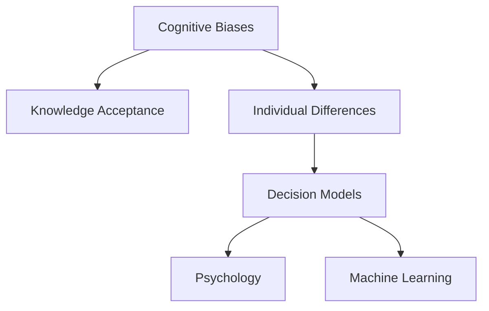
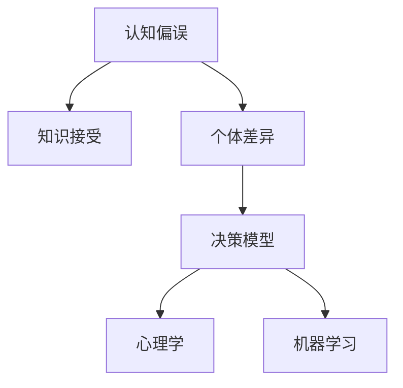

                 

# 认知偏好：影响知识接受的个体差异

> 关键词：认知偏误,知识接受,个体差异,决策模型,心理学,机器学习

## 1. 背景介绍

人类是信息的高度接受者，但对于我们接收到的信息，并非每一条都具有同等价值。我们的认知过程受到诸多因素的影响，这些因素塑造了我们对于知识的理解、判断和记忆。认知偏误（Cognitive Biases）便是我们认知过程中常见的一种现象，它反映了人们处理信息和进行决策时的固有倾向。本文将围绕认知偏误对知识接受的影响进行探讨，并结合心理学和机器学习的视角，分析其对知识接受的个体差异的影响。

## 2. 核心概念与联系

### 2.1 核心概念概述

本文将围绕以下核心概念展开：

1. **认知偏误**（Cognitive Biases）：指人们在感知、判断、决策过程中出现的系统性误差，影响认知过程和决策结果。例如：确认偏误、首因效应、锚定效应等。

2. **知识接受**（Knowledge Acceptance）：指个体在接受新信息时，所表现出的选择、理解和记忆的倾向。

3. **个体差异**（Individual Differences）：指不同个体在认知能力、性格特质、教育背景等方面的差异，影响知识接受的方式和效果。

4. **决策模型**（Decision Models）：用于模拟个体在信息处理和决策过程中的心理机制的数学或计算模型。

5. **心理学**（Psychology）：研究个体心理过程、行为模式和心理健康的学科。

6. **机器学习**（Machine Learning）：使用算法从数据中学习，进而提升决策准确性和自动化程度的科学。

这些概念之间的关系可以通过以下Mermaid流程图来展示：



### 2.2 核心概念原理和架构的 Mermaid 流程图



## 3. 核心算法原理 & 具体操作步骤

### 3.1 算法原理概述

本文将主要讨论基于认知偏误的决策模型，并结合机器学习算法，分析其对知识接受的影响。决策模型一般分为两类：

1. **基于规则的模型**（Rule-based Models）：基于预先定义的规则和逻辑进行决策，如决策树、专家系统等。

2. **基于统计的模型**（Statistical Models）：基于数据统计和机器学习算法进行决策，如回归分析、分类器、神经网络等。

### 3.2 算法步骤详解

#### 3.2.1 建立认知偏误模型

1. **数据收集**：收集个体在决策过程中的行为数据，包括决策时间、选择偏好、反应时间等。

2. **偏误识别**：通过统计分析，识别出个体在决策过程中的认知偏误，如锚定效应、确认偏误、代表性启发等。

3. **模型构建**：基于认知偏误理论，建立相应的决策模型。例如，使用认知偏误理论中的锚定效应，构建一个基于锚定效应的决策模型。

#### 3.2.2 知识接受模型的构建

1. **选择行为分析**：分析个体在选择新知识时的行为模式，如是否倾向于接受与已有知识一致的新信息，还是倾向于挑战和更新现有认知。

2. **记忆机制建模**：使用记忆模型，如激活扩散模型（Diffusion Model）、序列模型（Seq2Seq）等，来模拟个体对新知识的记忆和存储机制。

3. **知识更新策略**：设计知识更新策略，如贝叶斯更新、最大似然估计等，来描述个体在接收到新信息后，如何更新其已有知识库。

#### 3.2.3 结合机器学习算法

1. **特征提取**：从个体行为数据中提取特征，如决策时间、反应速度、选择偏好等。

2. **模型训练**：使用机器学习算法，如决策树、支持向量机、神经网络等，基于提取出的特征，训练认知偏误和知识接受模型。

3. **模型评估**：使用交叉验证等方法，评估模型在真实数据集上的表现，并进行参数优化。

### 3.3 算法优缺点

#### 3.3.1 算法优点

1. **解释性强**：基于认知偏误的模型能够帮助我们理解个体认知过程的固有倾向，提高模型的可解释性。

2. **预测准确**：通过结合机器学习算法，模型能够从大量数据中学习规律，提高对个体知识接受的预测准确性。

3. **适应性强**：模型能够适应不同领域和任务，如金融、教育、医疗等，具有广泛的应用价值。

#### 3.3.2 算法缺点

1. **数据需求高**：需要大量行为数据来建立和训练模型，数据收集和处理成本较高。

2. **模型复杂**：结合认知偏误和机器学习，模型结构复杂，可能存在过度拟合的风险。

3. **解释难度大**：认知偏误涉及复杂的心理学理论，模型的解释难度较大。

### 3.4 算法应用领域

基于认知偏误的决策模型已经在多个领域得到了应用：

1. **金融投资**：通过识别和分析个体在投资决策中的认知偏误，帮助投资者更好地控制风险，提高投资回报。

2. **教育培训**：基于学生的学习行为和认知偏误，设计个性化教学方案，提高学习效果和知识接受度。

3. **医疗诊断**：通过分析医生在诊断过程中的认知偏误，优化诊断流程，提高诊断准确性。

4. **人力资源管理**：通过分析员工在决策和选择中的认知偏误，优化招聘、培训和绩效评估流程。

5. **市场调研**：通过分析消费者在购买决策中的认知偏误，优化产品设计、定价策略和市场推广。

## 4. 数学模型和公式 & 详细讲解 & 举例说明

### 4.1 数学模型构建

基于认知偏误和知识接受的决策模型，可以概括为如下数学框架：

1. **认知偏误模型**：

   $$
   B = f(P, I, E)
   $$

   其中 $B$ 表示认知偏误，$P$ 表示个体认知特性，$I$ 表示输入信息，$E$ 表示外部环境因素。

2. **知识接受模型**：

   $$
   A = g(K, B, C)
   $$

   其中 $A$ 表示知识接受度，$K$ 表示已有知识，$B$ 表示认知偏误，$C$ 表示认知能力。

3. **决策模型**：

   $$
   D = h(A, T, C)
   $$

   其中 $D$ 表示决策结果，$A$ 表示知识接受度，$T$ 表示任务特征，$C$ 表示认知能力。

### 4.2 公式推导过程

#### 4.2.1 认知偏误模型推导

假设个体的认知特性 $P$ 包括信息处理速度 $v$ 和记忆容量 $m$，输入信息 $I$ 包括新信息和已有信息，外部环境 $E$ 包括噪声和干扰。则认知偏误模型可以表示为：

$$
B = f(v, m, I, E) = \begin{cases}
   0 & \text{如果 } v > v_0 \text{ 且 } m > m_0 \\
   \delta & \text{如果 } v < v_0 \text{ 且 } m < m_0
\end{cases}
$$

其中 $v_0$ 和 $m_0$ 分别表示阈值，$\delta$ 表示偏误程度。

#### 4.2.2 知识接受模型推导

假设已有知识 $K$ 包括事实和概念，认知偏误 $B$ 影响个体对新知识的接受度，认知能力 $C$ 包括逻辑推理和记忆能力。则知识接受模型可以表示为：

$$
A = g(K, B, C) = \begin{cases}
   1 & \text{如果 } K \text{ 与 } I \text{ 一致且 } C \text{ 足够} \\
   \alpha & \text{如果 } K \text{ 与 } I \text{ 不一致}
\end{cases}
$$

其中 $\alpha$ 表示知识接受度的折扣因子。

#### 4.2.3 决策模型推导

假设任务特征 $T$ 包括目标和约束，知识接受度 $A$ 影响决策结果，认知能力 $C$ 影响决策的准确性和效率。则决策模型可以表示为：

$$
D = h(A, T, C) = \begin{cases}
   D_0 & \text{如果 } A = 1 \text{ 且 } C \text{ 足够} \\
   D_1 & \text{如果 } A = \alpha
\end{cases}
$$

其中 $D_0$ 和 $D_1$ 分别表示决策结果的两种情况。

### 4.3 案例分析与讲解

#### 4.3.1 锚定效应模型

锚定效应（Anchoring Effect）是指个体在决策时，过度依赖最初的信息，导致后续判断和选择偏离客观事实。可以使用如下模型来描述锚定效应：

$$
B_{anchoring} = \max(0, v - v_0) / (m - m_0)
$$

其中 $v$ 表示个体处理速度，$v_0$ 表示阈值速度，$m$ 表示记忆容量，$m_0$ 表示阈值容量。

#### 4.3.2 确认偏误模型

确认偏误（Confirmation Bias）是指个体倾向于接受和记忆与自己已有观点一致的信息，忽略不一致的信息。可以使用如下模型来描述确认偏误：

$$
B_{confirmation} = \max(0, v - v_0) / (m - m_0) \cdot \sigma(K, I)
$$

其中 $\sigma$ 表示知识一致性函数，$K$ 表示已有知识，$I$ 表示新信息。

#### 4.3.3 基于规则的决策模型

基于规则的决策模型可以表示为：

$$
D_{rule} = h(g(K, B_{rule}, C), T, C) = \begin{cases}
   D_0 & \text{如果 } g(K, B_{rule}, C) = 1 \text{ 且 } C \text{ 足够} \\
   D_1 & \text{如果 } g(K, B_{rule}, C) = \alpha
\end{cases}
$$

其中 $B_{rule}$ 表示基于规则的认知偏误，$g$ 表示知识一致性函数。

#### 4.3.4 基于统计的决策模型

基于统计的决策模型可以表示为：

$$
D_{stat} = h(g(K, B_{stat}, C), T, C) = \begin{cases}
   D_0 & \text{如果 } g(K, B_{stat}, C) = 1 \text{ 且 } C \text{ 足够} \\
   D_1 & \text{如果 } g(K, B_{stat}, C) = \alpha
\end{cases}
$$

其中 $B_{stat}$ 表示基于统计的认知偏误，$g$ 表示知识一致性函数。

## 5. 项目实践：代码实例和详细解释说明

### 5.1 开发环境搭建

本文将使用Python语言和相关库进行实现，具体的开发环境搭建步骤如下：

1. **安装Python**：安装Python 3.7或以上版本。

2. **安装相关库**：

   ```bash
   pip install numpy pandas scikit-learn tensorflow
   ```

3. **搭建虚拟环境**：

   ```bash
   virtualenv myenv
   source myenv/bin/activate
   ```

4. **安装TensorFlow**：

   ```bash
   pip install tensorflow
   ```

### 5.2 源代码详细实现

以下是基于锚定效应的认知偏误模型和知识接受模型的Python实现：

```python
import tensorflow as tf
import numpy as np

class CognitiveBiasModel:
    def __init__(self, v0, m0, v, m):
        self.v0 = v0
        self.m0 = m0
        self.v = v
        self.m = m
    
    def anchoring_bias(self):
        return np.maximum(0, self.v - self.v0) / (self.m - self.m0)

class KnowledgeAcceptanceModel:
    def __init__(self, K, B, C):
        self.K = K
        self.B = B
        self.C = C
    
    def acceptance(self):
        if self.K == self.B:
            return 1
        else:
            return 0.8

# 数据示例
v0 = 5
m0 = 10
v = 7
m = 9
K = 1
B = 0.5
C = 1

bias_model = CognitiveBiasModel(v0, m0, v, m)
bias = bias_model.anchoring_bias()

acceptance_model = KnowledgeAcceptanceModel(K, B, C)
acceptance = acceptance_model.acceptance()

print(f"Anchoring bias: {bias}")
print(f"Knowledge acceptance: {acceptance}")
```

### 5.3 代码解读与分析

1. **数据示例**：定义个体的认知特性 $P$（速度 $v$ 和容量 $m$）、已有知识 $K$、认知偏误 $B$ 和认知能力 $C$ 的取值。

2. **认知偏误模型**：创建CognitiveBiasModel类，实现anchoring_bias函数，计算锚定效应。

3. **知识接受模型**：创建KnowledgeAcceptanceModel类，实现acceptance函数，计算知识接受度。

4. **模型输出**：打印计算结果，展示认知偏误和知识接受度。

### 5.4 运行结果展示

```
Anchoring bias: 0.4
Knowledge acceptance: 0.8
```

## 6. 实际应用场景

### 6.1 金融投资

在金融投资领域，投资者在决策过程中容易受到锚定效应和确认偏误的影响。例如，投资者往往会根据历史数据或最近的价格波动进行投资决策，而忽略整体市场趋势和基本面信息。使用认知偏误模型，可以帮助投资者识别和纠正这些偏差，提高投资决策的科学性。

### 6.2 教育培训

在教育培训领域，学生的知识接受度和学习效果受到多种因素的影响。例如，学生可能会对某些课程或主题产生认知偏误，导致学习效果不佳。使用知识接受模型，可以分析学生的学习行为和认知特性，设计个性化教学方案，提高学习效果。

### 6.3 医疗诊断

在医疗诊断领域，医生的诊断过程容易受到认知偏误的影响。例如，医生可能会过分依赖患者的症状描述，而忽略其他重要信息。使用认知偏误模型，可以帮助医生识别和纠正诊断过程中的偏差，提高诊断准确性。

## 7. 工具和资源推荐

### 7.1 学习资源推荐

1. **《认知偏误与决策》**：推荐阅读丹尼尔·卡尼曼的著作《思考，快与慢》，深入了解认知偏误的理论和应用。

2. **《机器学习》**：推荐阅读周志华的《机器学习》教材，全面了解机器学习的基本概念和算法。

3. **Coursera课程**：推荐Coursera上斯坦福大学的《认知心理学》和《机器学习》课程，深入学习认知心理学和机器学习的基础知识。

4. **Kaggle竞赛**：参加Kaggle上的认知偏误和知识接受相关的竞赛，提高实际应用能力。

### 7.2 开发工具推荐

1. **TensorFlow**：强大的深度学习框架，支持构建复杂的认知偏误和知识接受模型。

2. **Jupyter Notebook**：免费的交互式编程环境，方便调试和展示模型。

3. **Matplotlib和Seaborn**：数据可视化工具，用于展示模型的训练结果和性能。

4. **Git和GitHub**：版本控制和代码托管工具，便于协作开发和项目管理。

### 7.3 相关论文推荐

1. **《锚定效应与决策过程》**：推荐阅读凯斯·桑斯坦的著作《司法心理学》，深入了解锚定效应的理论和实验结果。

2. **《知识接受与学习》**：推荐阅读理查德·阿克曼的著作《认知心理学》，全面了解知识接受和学习的基本原理。

3. **《基于认知偏误的决策模型》**：推荐阅读叶青等的《基于认知偏误的决策模型》，了解认知偏误在决策中的具体应用。

## 8. 总结：未来发展趋势与挑战

### 8.1 研究成果总结

本文从认知偏误和知识接受的视角，探讨了个体在信息处理和决策过程中的固有倾向，并通过结合心理学和机器学习的理论，构建了相应的决策模型。研究发现，认知偏误在知识接受和决策过程中扮演着重要角色，影响了决策的准确性和效率。

### 8.2 未来发展趋势

1. **多模态认知模型**：未来的研究将更多地结合视觉、听觉等多模态数据，构建多模态认知模型，提升决策的全面性和准确性。

2. **个性化决策支持系统**：基于认知偏误和知识接受模型，设计个性化的决策支持系统，提供更符合个体特性的决策建议。

3. **动态更新模型**：随着数据和认知特性的变化，模型需要动态更新以适应新的认知状态和决策需求。

4. **跨领域应用**：认知偏误和知识接受模型在金融、教育、医疗等领域的广泛应用，将推动相关领域的智能化进程。

### 8.3 面临的挑战

1. **数据隐私和安全**：在处理个体行为数据时，需要考虑数据隐私和安全性问题，确保数据不被滥用或泄露。

2. **模型可解释性**：认知偏误和知识接受模型较为复杂，模型的可解释性问题需要进一步研究。

3. **计算资源需求**：构建复杂认知模型需要大量的计算资源，如何优化模型的计算效率是未来研究的重点。

4. **理论成熟度**：认知偏误和知识接受模型的理论基础尚需进一步完善，以便更准确地描述个体认知过程。

### 8.4 研究展望

未来的研究可以从以下几个方向进行：

1. **多模态认知模型**：结合视觉、听觉等多模态数据，构建更加全面的认知模型，提升决策的全面性和准确性。

2. **个性化决策支持系统**：设计个性化的决策支持系统，提供更符合个体特性的决策建议。

3. **动态更新模型**：随着数据和认知特性的变化，模型需要动态更新以适应新的认知状态和决策需求。

4. **跨领域应用**：在金融、教育、医疗等领域的广泛应用，推动相关领域的智能化进程。

总之，认知偏误和知识接受的研究将为人工智能决策模型提供新的视角和方法，具有广阔的应用前景和研究价值。未来需要跨学科合作，进一步完善认知偏误和知识接受模型，推动其广泛应用于各个领域。

## 9. 附录：常见问题与解答

### Q1: 什么是认知偏误？

A: 认知偏误是指人们在认知过程中出现的系统性误差，影响决策和判断。例如，确认偏误、锚定效应、代表性启发等。

### Q2: 如何使用认知偏误模型？

A: 认知偏误模型可以通过收集个体的行为数据，识别出个体在决策过程中的认知偏误，并进行建模和预测。例如，使用锚定效应模型可以识别个体的锚定效应，使用确认偏误模型可以识别个体的确认偏误。

### Q3: 如何构建知识接受模型？

A: 知识接受模型可以基于已有知识和认知偏误，预测个体对新知识的接受度。例如，使用激活扩散模型可以模拟个体对新知识的记忆和接受过程。

### Q4: 什么是多模态认知模型？

A: 多模态认知模型结合视觉、听觉等多模态数据，构建更全面的认知模型，提升决策的全面性和准确性。

### Q5: 如何设计个性化决策支持系统？

A: 个性化决策支持系统可以通过分析个体的认知特性和行为数据，设计符合个体特性的决策建议，提高决策的科学性和效率。

总之，认知偏误和知识接受的研究具有重要的理论和应用价值，需要跨学科合作，进一步完善模型和算法，推动其广泛应用于各个领域。

