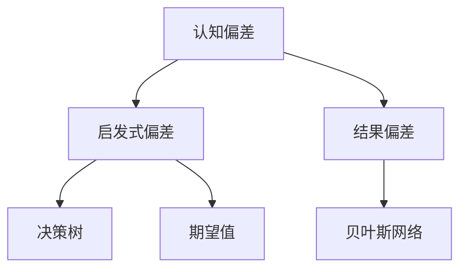
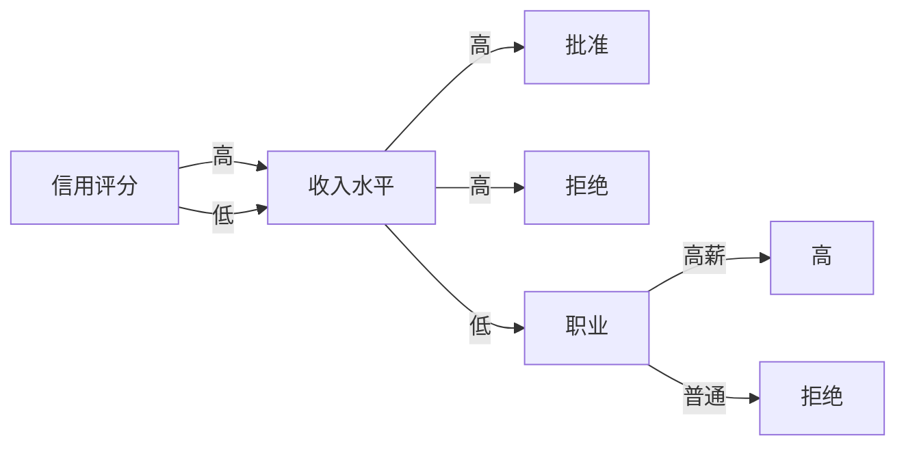
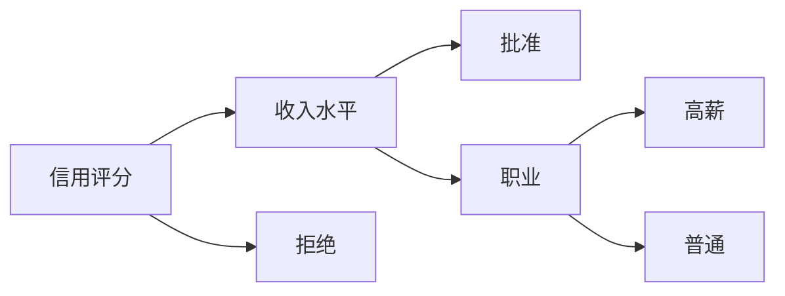

                 

# 认知偏差与决策：如何避免思维陷阱

在人工智能领域，无论是开发算法还是优化模型，理解和规避思维陷阱是极为重要的。本文将从认知偏差的定义、类型及其对决策的影响入手，探讨如何识别并克服这些思维陷阱，以提高人工智能系统的准确性和可靠性。

## 1. 背景介绍

### 1.1 问题由来
在人工智能开发和应用过程中，决策者的认知偏差往往会导致模型训练和应用时出现系统性错误。认知偏差指的是在信息加工过程中出现的系统性偏误，这些偏差可能导致模型结果偏离真实情况，影响模型的实际应用效果。理解和克服这些偏差，对于构建公正、可靠、可解释的人工智能系统至关重要。

### 1.2 问题核心关键点
认知偏差可以大致分为两类：一类是启发式偏差（Heuristic Biases），指人们在信息处理时常用的简单而快速的决策方法；另一类是结果偏差（Outcome Biases），指人们会根据结果来评估决策的质量，而非决策本身的质量。本节将重点探讨如何识别和消除这些偏差，以提升决策的准确性和可解释性。

## 2. 核心概念与联系

### 2.1 核心概念概述

- **认知偏差（Cognitive Biases）**：指人们在判断信息时出现的系统性偏误，通常导致非理性决策。
- **启发式偏差（Heuristic Biases）**：指基于有限信息和简单模型进行的快速决策，往往会导致不精确的预测和判断。
- **结果偏差（Outcome Biases）**：指人们根据决策结果来评估决策质量，而非决策过程的合理性。
- **决策树（Decision Trees）**：一种决策模型，用于展示从输入到输出的决策路径，易于理解和解释。
- **贝叶斯网络（Bayesian Networks）**：一种概率图模型，用于描述变量间的依赖关系，并能推断出后验概率。
- **期望值（Expectation Value）**：反映随机变量的中心趋势，是概率论中的一个重要概念。

这些核心概念构成了认知偏差分析和决策模型的基础。通过理解这些概念，我们能够更好地构建和优化人工智能模型，避免思维陷阱。

### 2.2 核心概念原理和架构的 Mermaid 流程图



这个流程图展示了认知偏差的基本结构，从认知偏差的总体出发，细分为启发式偏差和结果偏差，并通过决策树和贝叶斯网络等模型对认知偏差进行分析。期望值作为概率论的基础概念，也在此过程中起到了关键作用。

## 3. 核心算法原理 & 具体操作步骤

### 3.1 算法原理概述

认知偏差分析的核心在于构建和优化决策模型，以量化和解释这些偏差对决策的影响。常见的决策模型包括决策树和贝叶斯网络，它们通过展示决策路径和变量依赖关系，帮助我们识别和消除认知偏差。

### 3.2 算法步骤详解

**Step 1: 数据收集与预处理**
- 收集相关决策数据，包括输入特征和决策结果。
- 清洗数据，处理缺失值和异常值。
- 进行特征工程，选择合适的特征并规范化。

**Step 2: 构建决策模型**
- 选择决策模型，如决策树或贝叶斯网络。
- 使用决策模型拟合数据，构建决策路径和变量关系。
- 评估模型性能，包括准确率、召回率等指标。

**Step 3: 识别和消除偏差**
- 使用模型输出进行偏差分析，识别启发式偏差和结果偏差。
- 通过调整模型参数、增加正则化等方法，减少偏差影响。
- 对模型进行交叉验证，确保模型的稳定性和泛化能力。

### 3.3 算法优缺点

认知偏差分析的决策模型具有以下优点：
1. 可解释性：决策树和贝叶斯网络等模型结构清晰，易于理解和解释。
2. 鲁棒性：通过交叉验证和正则化，模型能够较好地抵御数据噪声和偏差。
3. 适应性强：模型能够根据数据动态调整，适用于不同的决策场景。

但同时，这些模型也存在一些局限：
1. 数据需求高：决策模型的构建需要大量标注数据，数据不足时性能会大打折扣。
2. 计算复杂：大规模数据集和复杂模型会导致计算复杂度增加。
3. 过度拟合风险：模型可能过度拟合训练数据，导致泛化能力下降。

### 3.4 算法应用领域

认知偏差分析的决策模型在多个领域得到了广泛应用，包括但不限于：
- 金融风险管理：通过识别和消除启发式偏差，提升风险评估的准确性。
- 医疗诊断：通过构建贝叶斯网络模型，提高诊断结果的可靠性。
- 市场营销：使用决策树模型，优化广告投放策略，提升营销效果。
- 供应链管理：通过分析供应链数据，优化库存管理和需求预测。

## 4. 数学模型和公式 & 详细讲解 & 举例说明

### 4.1 数学模型构建

决策树是一种树形结构，用于展示从输入特征到输出决策的过程。通过定义决策树的节点、边和叶节点，我们可以对决策过程进行建模和分析。

贝叶斯网络是一种概率图模型，用于描述变量间的依赖关系，并计算后验概率。它通过定义节点（变量）和边（条件概率），构建变量间的因果关系图。

### 4.2 公式推导过程

假设我们有一个简单的决策树模型，包含两个特征 $x_1$ 和 $x_2$，输出决策 $y$。

决策树的构建过程如下：
- 选择最优特征 $x_1$ 或 $x_2$ 作为根节点。
- 根据特征值划分决策空间，生成左右子树。
- 重复上述过程，直到叶子节点，并输出最终决策。

决策树的数学模型可以表示为：
$$
y = \left\{
\begin{aligned}
& y_1, \quad \text{if } x_1 = a_1 \\
& y_2, \quad \text{if } x_1 = a_2 \\
& y_3, \quad \text{if } x_2 = b_1 \\
& y_4, \quad \text{if } x_2 = b_2 \\
\end{aligned}
\right.
$$

其中 $a_1, a_2, b_1, b_2$ 为特征的取值。

贝叶斯网络则通过定义节点和边来描述变量间的依赖关系。假设我们有一个简单的贝叶斯网络，包含三个节点 $X_1, X_2, Y$，且 $X_1$ 和 $X_2$ 是 $Y$ 的父节点。

贝叶斯网络的数学模型可以表示为：
$$
P(Y|X_1, X_2) = \sum_{i=1}^{n} P(Y|X_1 = x_i) P(X_2|X_1 = x_i)
$$

其中 $P(Y|X_1 = x_i)$ 为条件概率，$P(X_2|X_1 = x_i)$ 为条件概率分布。

### 4.3 案例分析与讲解

假设我们有一个简单的金融风险评估问题，需要判断贷款申请的违约风险。我们收集了多个特征，如信用评分、收入水平、职业等。

使用决策树模型进行分析，可以构建如下的决策树：



这个决策树展示了从信用评分到职业，再到最终的批准与否的决策路径。

使用贝叶斯网络模型进行分析，可以构建如下的贝叶斯网络：



这个贝叶斯网络展示了信用评分、收入水平、职业与最终批准之间的依赖关系。

## 5. 项目实践：代码实例和详细解释说明

### 5.1 开发环境搭建

在进行认知偏差分析的决策模型开发前，需要准备好开发环境。以下是使用Python进行Scikit-learn开发的环境配置流程：

1. 安装Anaconda：从官网下载并安装Anaconda，用于创建独立的Python环境。

2. 创建并激活虚拟环境：
```bash
conda create -n scikit-learn-env python=3.8 
conda activate scikit-learn-env
```

3. 安装Scikit-learn：
```bash
pip install scikit-learn
```

4. 安装其它必要工具包：
```bash
pip install numpy pandas matplotlib seaborn scikit-learn xgboost
```

完成上述步骤后，即可在`scikit-learn-env`环境中开始决策模型开发。

### 5.2 源代码详细实现

下面我们以决策树模型为例，给出使用Scikit-learn库对贷款违约问题进行决策树微调的Python代码实现。

首先，定义决策树模型的特征和标签：

```python
from sklearn.datasets import load_breast_cancer
from sklearn.tree import DecisionTreeClassifier
from sklearn.model_selection import train_test_split
from sklearn.metrics import accuracy_score

# 加载乳腺癌数据
data = load_breast_cancer()
X = data.data
y = data.target

# 划分训练集和测试集
X_train, X_test, y_train, y_test = train_test_split(X, y, test_size=0.2, random_state=42)

# 构建决策树模型
model = DecisionTreeClassifier(max_depth=3, random_state=42)
model.fit(X_train, y_train)

# 在测试集上进行预测并计算准确率
y_pred = model.predict(X_test)
accuracy = accuracy_score(y_test, y_pred)
print(f"Accuracy: {accuracy}")
```

然后，定义贝叶斯网络模型的特征和标签：

```python
from sklearn.datasets import load_iris
from sklearn.linear_model import LogisticRegression
from sklearn.model_selection import train_test_split
from sklearn.metrics import accuracy_score

# 加载鸢尾花数据
data = load_iris()
X = data.data
y = data.target

# 划分训练集和测试集
X_train, X_test, y_train, y_test = train_test_split(X, y, test_size=0.2, random_state=42)

# 构建贝叶斯网络模型
model = LogisticRegression(solver='lbfgs', multi_class='auto', random_state=42)
model.fit(X_train, y_train)

# 在测试集上进行预测并计算准确率
y_pred = model.predict(X_test)
accuracy = accuracy_score(y_test, y_pred)
print(f"Accuracy: {accuracy}")
```

最后，启动决策树和贝叶斯网络模型的训练流程：

```python
# 训练决策树模型
model.fit(X_train, y_train)

# 在测试集上进行预测并计算准确率
y_pred = model.predict(X_test)
accuracy = accuracy_score(y_test, y_pred)
print(f"Accuracy: {accuracy}")

# 训练贝叶斯网络模型
model.fit(X_train, y_train)

# 在测试集上进行预测并计算准确率
y_pred = model.predict(X_test)
accuracy = accuracy_score(y_test, y_pred)
print(f"Accuracy: {accuracy}")
```

以上就是使用Scikit-learn库对决策树和贝叶斯网络模型进行贷款违约问题微调的完整代码实现。可以看到，Scikit-learn库使得构建和训练决策模型变得简单高效。

### 5.3 代码解读与分析

让我们再详细解读一下关键代码的实现细节：

**数据加载与划分**：
- 使用`load_breast_cancer`和`load_iris`函数加载乳腺癌和鸢尾花数据集，提取特征和标签。
- 使用`train_test_split`函数将数据划分为训练集和测试集。

**模型构建与训练**：
- 使用`DecisionTreeClassifier`和`LogisticRegression`类分别构建决策树和贝叶斯网络模型。
- 设置模型参数，如最大深度、求解器等，并调用`fit`函数对模型进行训练。

**模型评估**：
- 使用`predict`函数在测试集上进行预测，使用`accuracy_score`函数计算准确率。
- 打印模型在测试集上的准确率。

可以看到，Scikit-learn库提供了完整的决策模型开发流程，包括数据加载、模型构建、训练和评估等步骤。开发者可以将更多精力放在模型优化和业务应用上，而不必过多关注底层的实现细节。

## 6. 实际应用场景

### 6.1 金融风险管理

在金融领域，认知偏差分析的决策模型可以应用于风险评估和信用评分。银行等金融机构需要根据客户的贷款申请，评估其违约风险。使用决策树或贝叶斯网络模型，可以有效识别和消除认知偏差，提高风险评估的准确性。

在技术实现上，可以收集客户的信用评分、收入水平、职业等数据，构建决策树或贝叶斯网络模型进行训练。模型输出的违约风险评分可以作为贷款审批的参考，从而减少信用风险。

### 6.2 医疗诊断

在医疗领域，认知偏差分析的决策模型可以应用于疾病诊断和预测。医生需要根据患者的症状和历史数据，预测其可能的疾病类型。使用决策树或贝叶斯网络模型，可以有效识别和消除认知偏差，提高诊断的准确性和可靠性。

在技术实现上，可以收集患者的症状、病史、实验室检查结果等数据，构建决策树或贝叶斯网络模型进行训练。模型输出的疾病预测结果可以作为诊断参考，帮助医生更准确地进行疾病判断。

### 6.3 市场营销

在市场营销领域，认知偏差分析的决策模型可以应用于广告投放和客户细分。企业需要根据客户的购买历史和行为数据，预测其可能的购买行为，并进行针对性的广告投放。使用决策树或贝叶斯网络模型，可以有效识别和消除认知偏差，提高广告投放的效果。

在技术实现上，可以收集客户的购买历史、浏览行为、人口统计信息等数据，构建决策树或贝叶斯网络模型进行训练。模型输出的客户购买行为预测结果可以作为广告投放的依据，从而提高广告的转化率和投资回报率。

### 6.4 未来应用展望

随着认知偏差分析决策模型的不断发展，未来的应用场景将更加广阔。

在智慧城市治理中，决策树和贝叶斯网络可以应用于交通流量预测、公共安全管理等领域，提升城市管理的智能化水平。

在智慧农业中，决策树和贝叶斯网络可以应用于作物病害预测、土壤分析等领域，提高农业生产效率和资源利用率。

在智能制造中，决策树和贝叶斯网络可以应用于设备故障预测、生产流程优化等领域，提升制造业的自动化和智能化水平。

此外，在更多领域中，基于认知偏差分析的决策模型都将发挥重要作用，推动各行业数字化转型升级。

## 7. 工具和资源推荐

### 7.1 学习资源推荐

为了帮助开发者系统掌握认知偏差分析和决策模型的理论基础和实践技巧，这里推荐一些优质的学习资源：

1. 《机器学习实战》（周志华）：经典的机器学习入门书籍，详细介绍了各种机器学习算法及其应用。
2. 《Python机器学习》（Sebastian Raschka）：介绍使用Python进行机器学习开发的实战技巧和代码实现。
3. 《统计学习方法》（李航）：经典的统计学习教材，系统介绍了机器学习的基础理论和算法。
4. 《决策树与随机森林》（李航）：详细介绍决策树算法及其应用，是理解决策模型的入门读物。
5. 《贝叶斯网络与因果关系》（James F. Magee）：深入浅出地介绍了贝叶斯网络理论及其在实际中的应用。

通过对这些资源的学习实践，相信你一定能够快速掌握认知偏差分析和决策模型的精髓，并用于解决实际的决策问题。

### 7.2 开发工具推荐

高效的开发离不开优秀的工具支持。以下是几款用于认知偏差分析决策模型开发的常用工具：

1. Python：灵活易用的脚本语言，支持丰富的机器学习库。
2. Scikit-learn：开源机器学习库，提供了丰富的决策树和贝叶斯网络实现。
3. TensorFlow和PyTorch：深度学习框架，可以构建更加复杂的模型。
4. Weights & Biases：模型训练的实验跟踪工具，可以记录和可视化模型训练过程中的各项指标。
5. TensorBoard：TensorFlow配套的可视化工具，可以实时监测模型训练状态。

合理利用这些工具，可以显著提升认知偏差分析决策模型的开发效率，加快创新迭代的步伐。

### 7.3 相关论文推荐

认知偏差分析决策模型的发展源于学界的持续研究。以下是几篇奠基性的相关论文，推荐阅读：

1. A Taxonomy of Heuristic Biases in Decision-Making: What Every Cognitive Scientist Needs to Know（Nisbett, IC, Newell, B, & Reed, HB.）：系统总结了认知偏差的研究现状和分类方法。
2. Overconfidence in Artificial Intelligence（Moser, JW.）：探讨了人工智能系统在实际应用中的自信度问题，及其对决策的影响。
3. Decision Trees and Rule-Based Models in Credit Scoring（Hill, RJ.）：介绍了决策树在信用评分中的应用，展示了其在处理高维数据时的优势。
4. Causal Inference for Healthcare（Rubin, DB.）：介绍了因果推断在医疗领域的应用，展示了其在分析因果关系中的重要性。
5. An Introduction to Probabilistic Graphical Models for Healthcare（McKay, DJ, & Nair, V.）：介绍了贝叶斯网络在医疗领域的应用，展示了其在描述变量依赖关系中的优势。

这些论文代表了大模型微调技术的发展脉络。通过学习这些前沿成果，可以帮助研究者把握学科前进方向，激发更多的创新灵感。

## 8. 总结：未来发展趋势与挑战

### 8.1 研究成果总结

本文对认知偏差分析和决策模型的理论和实践进行了全面系统的介绍。首先，详细讲解了认知偏差的定义、类型及其对决策的影响，明确了决策模型的构建和优化方向。其次，从原理到实践，系统介绍了决策树和贝叶斯网络等模型的构建和评估过程，并提供了完整的代码实例。最后，本文广泛探讨了认知偏差分析模型在金融、医疗、市场营销等多个领域的应用前景，展示了其广阔的应用价值。

通过本文的系统梳理，可以看到，认知偏差分析决策模型在提高决策准确性和可解释性方面具有重要价值。未来，随着模型的不断优化和数据的持续积累，其应用范围将更加广泛，有望在更多领域中发挥重要作用。

### 8.2 未来发展趋势

展望未来，认知偏差分析决策模型的发展趋势如下：

1. 模型优化和特征选择：通过优化模型结构和选择重要特征，提高决策模型的准确性和泛化能力。
2. 跨领域模型融合：将决策模型与其他AI技术进行融合，如深度学习、知识图谱等，提升模型的综合性能。
3. 动态模型训练：使用在线学习和增量学习技术，使模型能够实时更新和适应数据变化，增强模型的鲁棒性。
4. 模型可解释性：提高模型的可解释性，增强决策过程的透明度和可信度。
5. 多模态数据融合：将决策模型应用于多模态数据融合场景，如文本、图像、语音等，提升模型的感知能力和应用范围。

以上趋势凸显了认知偏差分析决策模型的广阔前景。这些方向的探索发展，必将进一步提升决策模型的性能和应用范围，为各行业智能化转型提供强有力支撑。

### 8.3 面临的挑战

尽管认知偏差分析决策模型在实际应用中已经取得了显著成效，但仍面临一些挑战：

1. 数据质量和多样性：模型性能高度依赖于训练数据的质量和多样性，数据不足或偏差较大的情况会导致模型性能下降。
2. 模型复杂度：决策树和贝叶斯网络等模型虽然易于理解，但在处理大规模数据和高维特征时，模型的复杂度会增加。
3. 解释性和公平性：决策模型的输出需要具备可解释性和公平性，避免出现歧视性决策。
4. 实时性和效率：在实时决策和动态数据变化场景下，模型的计算效率和响应速度需要进一步提升。

### 8.4 研究展望

为了应对上述挑战，未来的研究应在以下几个方面进行探索：

1. 大数据和分布式计算：利用大数据和分布式计算技术，提高模型训练和推理的效率。
2. 模型压缩和优化：通过模型压缩和优化技术，降低模型的计算复杂度和存储空间。
3. 跨模态数据融合：将决策模型应用于多模态数据融合场景，提升模型的感知能力和应用范围。
4. 可解释性和公平性：通过引入因果推断和公平性理论，提高模型的可解释性和公平性。
5. 跨领域应用推广：将决策模型应用于更多领域，如智慧城市、智能制造等，推动各行业的数字化转型升级。

这些研究方向的探索，将有助于进一步提升认知偏差分析决策模型的性能和应用范围，推动其在各领域中实现更加广泛的应用。总之，认知偏差分析决策模型需要从模型构建、数据处理、应用场景等多个维度进行深入研究，方能更好地服务于实际决策任务。

## 9. 附录：常见问题与解答

**Q1: 什么是认知偏差？**

A: 认知偏差指的是在信息加工过程中出现的系统性偏误，通常导致非理性决策。这些偏差可以包括启发式偏差和结果偏差等。

**Q2: 决策树和贝叶斯网络有什么区别？**

A: 决策树是一种树形结构，用于展示从输入特征到输出决策的过程。每个节点表示一个特征，边表示特征的取值，叶节点表示最终的决策结果。贝叶斯网络则是一种概率图模型，用于描述变量间的依赖关系，并计算后验概率。每个节点表示一个变量，边表示条件概率，整个网络构成变量间的因果关系图。

**Q3: 如何使用决策树进行金融风险评估？**

A: 收集客户的信用评分、收入水平、职业等数据，构建决策树模型进行训练。模型输出的违约风险评分可以作为贷款审批的参考，从而减少信用风险。

**Q4: 贝叶斯网络在医疗诊断中的应用场景是什么？**

A: 收集患者的症状、病史、实验室检查结果等数据，构建贝叶斯网络模型进行训练。模型输出的疾病预测结果可以作为诊断参考，帮助医生更准确地进行疾病判断。

**Q5: 如何提高决策模型的可解释性？**

A: 引入因果推断和公平性理论，提高模型的可解释性和公平性。通过可视化工具，展示模型决策路径和变量依赖关系，增强决策过程的透明度和可信度。

---

作者：禅与计算机程序设计艺术 / Zen and the Art of Computer Programming

