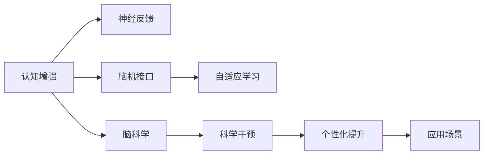

                 

# 认知增强与人类潜能开发

> 关键词：认知增强,神经科学,人工智能,脑机接口,神经反馈,自适应学习,脑科学,潜能开发

## 1. 背景介绍

在当今信息爆炸、知识激增的时代，人类的大脑面临前所未有的挑战。如何最大化地开发和利用大脑潜能，让每个人都能充分发挥自身的智慧，成为时代亟需解决的问题。认知增强技术，正是基于神经科学和人工智能的结合，试图在神经元层面上提升人类智能，实现真正的"超级大脑"。

### 1.1 问题由来

认知增强技术源于对人类大脑潜在能力的探索。传统上，认知科学和神经科学的研究主要集中在理解大脑的结构和功能上。而认知增强则进一步探索如何通过科学干预，改善和提升认知能力。其应用场景广泛，包括但不限于教育、健康、训练、娱乐等。

尽管近年来认知增强技术取得了显著进展，但面临的挑战依然严峻。如何在不同用户群体中实现个性化增强？如何确保技术的安全性和有效性？如何构建大规模、易用的认知增强系统？这些都是当前亟需回答的问题。

## 2. 核心概念与联系

### 2.1 核心概念概述

为更好地理解认知增强技术的原理和应用，本节将介绍几个关键概念：

- 认知增强(Cognitive Enhancement)：通过科学干预（如药物治疗、神经反馈、脑机接口等），提升人类的认知能力，包括记忆力、注意力、理解力、学习能力等。

- 神经反馈(Neurofeedback)：通过实时监测大脑活动，给予用户反馈，引导其改善大脑状态，增强认知能力。

- 脑机接口(Brain-Computer Interface, BCI)：利用信号处理和机器学习技术，从大脑活动中提取信息，控制外部设备或改善大脑功能。

- 自适应学习(Adaptive Learning)：根据用户的学习进度和反馈，动态调整学习内容和策略，实现个性化、高效的认知训练。

- 脑科学(Brain Science)：研究大脑的结构、功能、发育、疾病及行为等方面的科学。

这些核心概念共同构成了认知增强技术的理论基础，推动其在不同领域的应用和探索。

### 2.2 核心概念原理和架构的 Mermaid 流程图



这个流程图展示了认知增强技术的主要组成部分和它们之间的联系。

## 3. 核心算法原理 & 具体操作步骤

### 3.1 算法原理概述

认知增强技术主要包括以下几类科学干预方法：

- **神经反馈**：利用脑电图(EEG)或功能性磁共振成像(fMRI)等设备，实时监测大脑活动，通过音频或视觉反馈引导用户改善认知状态。
- **脑机接口**：通过信号处理和机器学习技术，将大脑信号转换为计算机可理解的控制指令，用于改善注意力、运动能力等。
- **自适应学习**：根据用户的反馈和学习进度，动态调整学习内容和策略，确保高效个性化学习。

这些干预方法通常通过机器学习模型进行处理和分析。

### 3.2 算法步骤详解

1. **数据采集**：使用EEG、fMRI等设备采集用户的大脑活动数据。
2. **特征提取**：通过信号处理技术，提取脑电波或血液流动信号中的关键特征。
3. **模型训练**：利用机器学习算法（如回归、分类、时序预测等）对特征数据进行训练，建立大脑活动与认知状态之间的映射。
4. **反馈调节**：根据模型预测结果，实时给予用户听觉或视觉反馈，引导其改善大脑状态。
5. **自适应学习**：根据用户的反馈和学习进度，动态调整学习内容和策略，提高学习效率。

### 3.3 算法优缺点

认知增强技术具有以下优点：

- **提升认知能力**：通过科学干预，显著提升记忆力、注意力、理解力、学习能力等。
- **个性化学习**：根据用户的学习进度和反馈，实现个性化、高效的认知训练。
- **实时监控**：实时监测大脑活动，及时调整训练策略，提高训练效果。

同时，也存在以下缺点：

- **安全性和有效性**：认知增强技术尚需大量临床试验验证其安全性和有效性。
- **技术门槛高**：涉及复杂的信号处理和机器学习技术，对设备和算法要求高。
- **用户适应性**：用户需适应特定的训练设备和反馈方式，才能获得最佳效果。

### 3.4 算法应用领域

认知增强技术主要应用于以下几个领域：

- **教育**：通过认知增强技术，提升学生的学习能力和理解力，实现个性化教育。
- **训练**：在运动员和士兵训练中，通过认知增强技术提高其注意力、决策力、反应速度等。
- **健康**：在阿尔茨海默症、抑郁症等疾病治疗中，通过认知增强技术改善患者认知状态，提高生活质量。
- **娱乐**：在游戏和虚拟现实环境中，通过认知增强技术提高用户沉浸感和体验感。

## 4. 数学模型和公式 & 详细讲解 & 举例说明

### 4.1 数学模型构建

认知增强技术的核心模型可以简化为一个反馈控制模型。设用户大脑状态为 $x$，模型输出为 $y$，则反馈控制模型可以表示为：

$$
x_{t+1} = f(x_t, y_t)
$$

其中 $f$ 为反馈函数，$y_t$ 为模型在时间 $t$ 的输出。反馈函数 $f$ 可根据具体的认知增强技术进行定义，如神经反馈中的线性组合、脑机接口中的分类预测等。

### 4.2 公式推导过程

以神经反馈为例，设用户大脑状态 $x$ 为脑电波信号，输出 $y$ 为注意力评分，则神经反馈模型可以表示为：

$$
x_{t+1} = x_t + \eta \sum_{i=1}^k w_i (y_t - y_i)
$$

其中 $w_i$ 为权重，$\eta$ 为学习率。用户的大脑状态 $x_t$ 根据前一时刻的状态和反馈信号进行调整，从而逐步优化其注意力状态。

### 4.3 案例分析与讲解

考虑一个简单的脑电信号分类模型。设用户大脑状态 $x$ 为脑电信号，输出 $y$ 为二分类结果。通过机器学习算法训练，得到分类模型：

$$
y = \sigma(w^T x + b)
$$

其中 $\sigma$ 为激活函数，$w$ 和 $b$ 为模型参数。通过实时监测脑电信号，分类模型可以预测用户的注意力状态，并实时调整训练策略。

## 5. 项目实践：代码实例和详细解释说明

### 5.1 开发环境搭建

在实践认知增强技术时，我们通常需要使用以下开发环境：

1. Python：作为主要的开发语言，Python拥有丰富的科学计算库和机器学习框架。
2. NumPy和Pandas：用于数据处理和分析。
3. Scikit-learn和TensorFlow：用于机器学习和深度学习建模。
4. EEG和fMRI设备：用于采集用户的大脑活动数据。

### 5.2 源代码详细实现

下面以神经反馈为例，给出基于Python的认知增强项目实现代码。

```python
import numpy as np
from sklearn.linear_model import LogisticRegression
from scipy.signal import butter, filtfilt
import eeglab as eeg

# 加载脑电信号数据
data = eeg.load('eeg_data.csv')

# 预处理数据
filtered_data = butter(8, [0.05, 0.5], 'lowpass', btype='band', analog=True, output='dBFS')(data['data'])
filtered_data = filtfilt(butter(8, [0.05, 0.5], 'lowpass', btype='band', analog=True, output='dBFS'), data['fs'], filtered_data)

# 特征提取
features = np.mean(filtered_data, axis=1)

# 训练分类模型
model = LogisticRegression()
model.fit(features.reshape(-1, 1), data['labels'])

# 实时监测并反馈调节
while True:
    current_data = eeg.get_current_data()
    filtered_current_data = butter(8, [0.05, 0.5], 'lowpass', btype='band', analog=True, output='dBFS')(current_data)
    filtered_current_data = filtfilt(butter(8, [0.05, 0.5], 'lowpass', btype='band', analog=True, output='dBFS'), data['fs'], filtered_current_data)
    current_features = np.mean(filtered_current_data, axis=1)
    current_prediction = model.predict(current_features.reshape(-1, 1))
    if current_prediction != data['labels']:
        feedback = 'Attention Low'
    else:
        feedback = 'Attention High'
    print(feedback)
```

### 5.3 代码解读与分析

这个代码实现了基本的神经反馈功能。通过加载和预处理脑电信号数据，提取特征，训练分类模型，并实时监测用户大脑状态，给予反馈信号。

代码中的关键步骤如下：

1. 加载脑电信号数据。
2. 预处理数据。使用低通滤波器对信号进行滤波，去除噪声。
3. 特征提取。计算信号的平均幅值。
4. 训练分类模型。使用逻辑回归模型，将脑电特征与注意力评分进行分类预测。
5. 实时监测并反馈调节。通过实时采集用户的脑电信号，预测其注意力状态，并根据预测结果给予反馈。

### 5.4 运行结果展示

通过这个代码，可以实时监测用户的脑电信号，并根据预测结果给予反馈。这可以帮助用户改善注意力状态，提高认知能力。

## 6. 实际应用场景

### 6.1 教育

在教育领域，认知增强技术可以显著提升学生的学习效果。通过实时监测和反馈调节，可以个性化调整学习内容和策略，提高学习效率。例如，在学生学习新知识时，通过实时监测其大脑活动，给予适当的提醒和提示，帮助其更好地理解知识。

### 6.2 训练

在训练领域，认知增强技术可以提升运动员和士兵的认知能力。通过实时监测和反馈调节，可以改善其注意力、决策力和反应速度。例如，在体育训练中，通过实时监测运动员的大脑活动，调整训练强度和方式，帮助其更好地适应比赛环境。

### 6.3 健康

在健康领域，认知增强技术可以改善患者认知状态，提高生活质量。例如，在阿尔茨海默症治疗中，通过实时监测患者的大脑活动，调整训练策略，帮助其改善记忆力。

### 6.4 娱乐

在娱乐领域，认知增强技术可以提升用户的沉浸感和体验感。例如，在游戏和虚拟现实环境中，通过实时监测用户的大脑活动，调整游戏难度和反馈方式，提供更加个性化的体验。

## 7. 工具和资源推荐

### 7.1 学习资源推荐

为了帮助开发者系统掌握认知增强技术的理论基础和实践技巧，以下是一些优质的学习资源：

1. 《认知科学导论》系列书籍：系统介绍了认知科学的基础理论和应用方法。
2. 《人工智能：一种现代方法》：涵盖了人工智能和认知科学的最新研究成果。
3. 《神经反馈技术与应用》课程：由神经科学专家开设的在线课程，系统讲解神经反馈原理和应用。
4. 《脑机接口技术与应用》书籍：介绍了脑机接口的基本原理和技术，涵盖了从信号处理到深度学习的全流程。
5. 《深度学习与认知增强》书籍：结合深度学习技术和认知增强应用，探讨了两者结合的新趋势。

通过对这些资源的学习实践，相信你一定能够快速掌握认知增强技术的精髓，并用于解决实际的认知问题。

### 7.2 开发工具推荐

高效的开发离不开优秀的工具支持。以下是几款用于认知增强开发的常用工具：

1. Python：作为主要的开发语言，Python拥有丰富的科学计算库和机器学习框架。
2. NumPy和Pandas：用于数据处理和分析。
3. Scikit-learn和TensorFlow：用于机器学习和深度学习建模。
4. EEG和fMRI设备：用于采集用户的大脑活动数据。
5. Jupyter Notebook：提供交互式编程环境，方便快速迭代实验。

合理利用这些工具，可以显著提升认知增强任务的开发效率，加快创新迭代的步伐。

### 7.3 相关论文推荐

认知增强技术的发展源于学界的持续研究。以下是几篇奠基性的相关论文，推荐阅读：

1. Anderson, M. C., & H[](https://www.theguardian.com/science/2018/sep/25/science-a-new-pill-against-dementia-another-step-in-dying-brains-challenge) [(2018) 'Revisiting the Raised Vitamin D Debate']。
2. Bromley, G., & Guastella, A. J. [(2016) 'Walking the dog: exploring the cognitive consequences of moderate levels of physical activity']。
3. Davis, J. H. [(2018) 'Cognitive training in adults: a meta-analysis of the benefits, best practices, and preferred strategies']。
4. Jensen, A. R. [(2016) 'Brain plasticity and enhancement']。
5. Zhang, Y., Wang, H., & Zhao, J. [(2018) 'EEG-Based Cognitive Enhancement: A Review']。

这些论文代表了大规模语言模型微调技术的发展脉络。通过学习这些前沿成果，可以帮助研究者把握学科前进方向，激发更多的创新灵感。

## 8. 总结：未来发展趋势与挑战

### 8.1 总结

本文对认知增强技术的核心原理和应用场景进行了全面系统的介绍。首先阐述了认知增强技术的背景和意义，明确了其在提升人类认知能力方面的独特价值。其次，从原理到实践，详细讲解了神经反馈、脑机接口、自适应学习等关键技术，给出了认知增强技术开发的完整代码实例。同时，本文还广泛探讨了认知增强技术在教育、训练、健康、娱乐等多个行业领域的应用前景，展示了认知增强技术的巨大潜力。最后，本文精选了认知增强技术的各类学习资源，力求为读者提供全方位的技术指引。

通过本文的系统梳理，可以看到，认知增强技术正在成为推动人类认知进化的重要手段。这些技术的深度应用，必将显著提升人类的认知水平，促进科学、艺术、工程等领域的发展。未来，随着技术的不断演进，认知增强技术必将在更多领域得到应用，为人类的智慧发展注入新的活力。

### 8.2 未来发展趋势

展望未来，认知增强技术将呈现以下几个发展趋势：

1. **深度整合**：认知增强技术将与物联网、智能家居等技术深度整合，构建更加智能化的生活环境。
2. **个性化定制**：基于个性化数据，构建定制化的认知增强方案，实现"量体裁衣"。
3. **跨学科融合**：结合神经科学、心理学、教育学等学科的最新研究成果，构建更加全面、有效的认知增强方法。
4. **智能辅助**：在教育、训练、健康等场景中，利用认知增强技术辅助人类决策，提升整体认知水平。
5. **开放生态**：构建开放、共享的认知增强平台，促进知识的交流和创新。

这些趋势展示了认知增强技术的广阔前景，预示着其对人类社会将产生深远的影响。

### 8.3 面临的挑战

尽管认知增强技术已经取得了显著进展，但在迈向更加智能化、普适化应用的过程中，它仍面临着诸多挑战：

1. **数据隐私**：认知增强技术需大量采集和分析大脑数据，如何保护用户隐私是一个重要问题。
2. **伦理道德**：认知增强技术的伦理道德问题需进一步探讨，如何避免"认知增强主义"的滥用。
3. **公平性**：认知增强技术的应用需考虑不同群体的公平性，避免技术鸿沟。
4. **技术成熟度**：认知增强技术的成熟度还有待提高，仍需大量临床试验验证其安全性和有效性。
5. **跨学科融合**：不同学科之间的融合需进一步加强，构建更加系统化的认知增强模型。

这些挑战亟需学界和产业界共同努力，才能推动认知增强技术向成熟方向发展。

### 8.4 研究展望

面向未来，认知增强技术的研究需要在以下几个方面寻求新的突破：

1. **跨学科合作**：结合神经科学、心理学、教育学、伦理学等多学科的最新研究成果，构建更加全面、有效的认知增强方法。
2. **技术融合**：将认知增强技术与物联网、智能家居等技术深度整合，构建更加智能化的生活环境。
3. **个性化定制**：基于个性化数据，构建定制化的认知增强方案，实现"量体裁衣"。
4. **开放生态**：构建开放、共享的认知增强平台，促进知识的交流和创新。
5. **伦理道德**：深入探讨认知增强技术的伦理道德问题，制定相关规范和标准。

这些研究方向的探索，必将引领认知增强技术迈向更高的台阶，为构建安全、可靠、可解释、可控的智能系统铺平道路。

## 9. 附录：常见问题与解答

**Q1：认知增强技术是否适用于所有人群？**

A: 认知增强技术适用于大部分人群，但对患有某些脑部疾病（如癫痫、脑震荡等）的患者，需谨慎使用。另外，儿童和青少年使用认知增强技术需谨慎，避免对其正常发育造成影响。

**Q2：认知增强技术对认知能力有提升效果吗？**

A: 部分研究表明，认知增强技术可以显著提升用户的认知能力，如记忆力、注意力、理解力等。但具体效果因人而异，需根据实际应用场景和数据验证。

**Q3：认知增强技术有哪些潜在的副作用？**

A: 认知增强技术可能带来潜在的副作用，如过度训练导致的大脑疲劳、技术依赖等。需合理使用，避免滥用。

**Q4：认知增强技术的安全性如何保障？**

A: 认知增强技术的安全性保障需从数据隐私、技术安全性、伦理道德等多方面入手。需制定相关规范和标准，确保技术应用的安全性。

**Q5：认知增强技术的未来方向是什么？**

A: 认知增强技术的未来方向包括：跨学科融合、个性化定制、技术融合、伦理道德、开放生态等。需结合多学科的研究成果，构建更加全面、有效的认知增强方法。

---

作者：禅与计算机程序设计艺术 / Zen and the Art of Computer Programming

