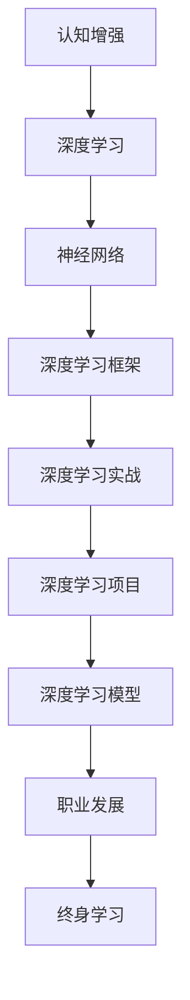

                 

# 认知增强与职业发展：终身学习的新趋势

> 关键词：认知增强,职业发展,终身学习,人工智能,深度学习,深度学习框架,神经网络,深度学习实战,深度学习项目,深度学习模型,认知计算

## 1. 背景介绍

### 1.1 问题由来
随着科技的迅猛发展，人工智能(AI)和深度学习(Deep Learning, DL)技术已经成为推动各行各业变革的重要引擎。从语音识别、图像处理到自然语言处理(NLP)、推荐系统等，深度学习技术在众多领域取得了显著突破，正在深刻改变人类的生产生活方式。

然而，随着技术的快速发展，深度学习也面临着诸多挑战。技术的快速迭代和高度专业化要求从业者不断学习新知识，更新技能，才能跟上技术发展的步伐。同时，深度学习的入门门槛也逐渐提高，新入行的从业者需要付出更多努力和时间才能掌握基本技能。

在这样的背景下，终身学习成为从业者不断提升自己的关键途径。通过终身学习，不仅能够持续掌握新技术，还能应对职业发展中的各种挑战。本文将探讨认知增强与职业发展中终身学习的最新趋势，为从业者提供一些实用的建议和方法。

## 2. 核心概念与联系

### 2.1 核心概念概述

为更好地理解终身学习的最新趋势，本节将介绍几个密切相关的核心概念：

- **认知增强(Cognitive Enhancement)**：指通过技术手段，提升人的认知能力，包括感知、记忆、思维等方面。深度学习在认知增强中的应用主要体现在提升人类的认知能力，使其在处理复杂问题时更具效率和准确性。

- **职业发展(Career Development)**：指从业者在职业生涯中不断提升技能、知识和经验，实现职业上的晋升和发展。终身学习是实现职业发展的重要途径，通过不断学习新知识，拓展技能范围，提升竞争力。

- **终身学习(Lifelong Learning)**：指个人在其整个生命周期中不断学习新知识和技能，以适应快速变化的工作环境和市场需求。深度学习技术的发展使得终身学习更加容易实现，提供了更多途径和方法。

- **人工智能(Artificial Intelligence)**：指模拟人类智能的技术，包括机器学习、深度学习等。AI技术正在改变各行各业的运作方式，为从业者提供了广阔的职业机会和发展空间。

- **深度学习框架(Deep Learning Frameworks)**：如TensorFlow、PyTorch等，是深度学习开发和训练的基础工具。通过使用这些框架，开发者能够更方便地构建和管理复杂的深度学习模型。

- **神经网络(Neural Networks)**：深度学习的核心组成部分，通过多层神经元之间的信息传递和处理，实现对复杂数据的建模和预测。

- **深度学习实战(Deep Learning Practice)**：指深度学习技术在实际应用中的具体操作和案例分析，包括数据预处理、模型构建、训练和调优等环节。

- **深度学习项目(Deep Learning Project)**：通过实际操作，将深度学习技术应用于实际问题中，解决具体任务，积累实践经验。

- **深度学习模型(Deep Learning Model)**：指基于深度学习理论设计的各种模型，如卷积神经网络(CNN)、循环神经网络(RNN)、变分自编码器(VAE)等。

这些核心概念之间的逻辑关系可以通过以下Mermaid流程图来展示：



这个流程图展示了大语言模型的核心概念及其之间的关系：

1. 认知增强通过深度学习技术提升人类认知能力。
2. 深度学习技术通过神经网络实现复杂数据的建模和预测。
3. 深度学习框架提供构建和管理深度学习模型的工具。
4. 深度学习实战和项目将深度学习技术应用于具体问题，积累实践经验。
5. 深度学习模型是深度学习技术的具体实现形式。
6. 职业发展通过终身学习不断提升技能和知识，拓展职业机会。
7. 终身学习是实现职业发展的关键途径。

这些概念共同构成了认知增强和职业发展的认知框架，使得深度学习技术在职业发展中的应用更加广泛和深入。

## 3. 核心算法原理 & 具体操作步骤
### 3.1 算法原理概述

终身学习主要依赖深度学习技术，通过构建和训练深度学习模型，实现对新知识和技能的掌握。其核心算法原理主要包括：

- **神经网络架构设计**：选择合适的神经网络结构，设计输入层、隐藏层和输出层等组件，确定各层神经元的数量和连接方式。
- **数据预处理**：清洗、归一化、分割数据集等操作，为模型提供高质量的数据输入。
- **模型训练**：使用反向传播算法更新模型参数，最小化损失函数，使得模型输出逼近真实标签。
- **模型评估**：使用测试集评估模型性能，判断模型的泛化能力。
- **模型优化**：通过正则化、Dropout、早停等技术避免过拟合，提高模型鲁棒性。

### 3.2 算法步骤详解

基于深度学习的终身学习主要包括以下几个关键步骤：

**Step 1: 数据准备和预处理**
- 收集训练数据集，进行清洗、归一化等预处理操作。
- 将数据集分为训练集、验证集和测试集，设置合理的划分比例。

**Step 2: 构建神经网络**
- 选择合适的神经网络架构，确定输入、隐藏、输出层等组件。
- 定义损失函数，如交叉熵损失、均方误差损失等。
- 使用深度学习框架进行模型构建，如TensorFlow、PyTorch等。

**Step 3: 模型训练**
- 使用优化器如Adam、SGD等，设置合适的学习率和批大小，进行模型训练。
- 周期性在验证集上评估模型性能，根据性能指标决定是否触发早停。
- 重复上述步骤直到满足预设的迭代轮数或早停条件。

**Step 4: 模型评估和优化**
- 在测试集上评估模型性能，使用准确率、召回率等指标评估模型效果。
- 针对模型性能不足，调整模型结构、参数设置等，进行模型优化。

**Step 5: 应用和部署**
- 将优化后的模型应用于实际问题中，进行推理和预测。
- 将模型封装为服务接口，部署到生产环境中。
- 持续监控模型性能，定期进行模型更新和调优。

### 3.3 算法优缺点

基于深度学习的终身学习具有以下优点：
1. 强大的数据建模能力：深度学习模型能够处理高维、复杂的数据，提高模型泛化能力。
2. 高效的自动化学习：通过数据驱动的学习方式，快速掌握新知识和技能。
3. 高度可扩展性：深度学习模型可进行大规模扩展，适应复杂问题。
4. 灵活的框架支持：深度学习框架提供了丰富的工具和库，方便开发者进行模型构建和优化。

同时，该方法也存在一定的局限性：
1. 高昂的计算成本：深度学习模型通常需要大量计算资源进行训练和推理，对硬件资源要求较高。
2. 数据依赖性强：深度学习模型需要大量标注数据进行训练，数据获取成本较高。
3. 模型复杂度高：深度学习模型结构复杂，难以理解和解释。
4. 数据隐私问题：深度学习模型训练过程中涉及大量敏感数据，可能带来隐私和安全问题。

尽管存在这些局限性，但就目前而言，基于深度学习的终身学习仍是学习和职业发展的有效途径。未来相关研究的重点在于如何进一步降低深度学习的计算成本，提高数据使用的效率，同时增强模型的可解释性和隐私保护。

### 3.4 算法应用领域

深度学习的终身学习在多个领域得到了广泛应用，例如：

- **医学**：通过深度学习技术，实现对医疗影像的自动化分析，辅助诊断和治疗决策。
- **金融**：使用深度学习进行股票预测、风险评估等金融分析任务，提升金融决策的准确性。
- **自然语言处理(NLP)**：通过深度学习进行文本分类、情感分析、机器翻译等NLP任务，提升语言理解和生成能力。
- **图像处理**：使用深度学习进行图像识别、物体检测等任务，提升计算机视觉能力。
- **推荐系统**：通过深度学习进行用户行为分析，实现个性化推荐，提升用户体验。
- **自动驾驶**：使用深度学习进行目标检测、路径规划等任务，提升自动驾驶系统的性能。

除了上述这些经典领域外，深度学习的终身学习还在更多场景中得到应用，如可控生成、常识推理、数据增强等，为深度学习技术带来了新的突破。

## 4. 数学模型和公式 & 详细讲解 & 举例说明
### 4.1 数学模型构建

本节将使用数学语言对深度学习模型的构建和训练过程进行更加严格的刻画。

记深度学习模型为 $M_{\theta}$，其中 $\theta$ 为模型参数。假设训练数据集为 $D=\{(x_i,y_i)\}_{i=1}^N, x_i \in \mathbb{R}^d, y_i \in \mathbb{R}$。

定义模型 $M_{\theta}$ 在输入 $x$ 上的损失函数为 $\ell(M_{\theta}(x),y)$，则在数据集 $D$ 上的经验风险为：

$$
\mathcal{L}(\theta) = \frac{1}{N}\sum_{i=1}^N \ell(M_{\theta}(x_i),y_i)
$$

在实践中，我们通常使用基于梯度的优化算法（如Adam、SGD等）来近似求解上述最优化问题。设 $\eta$ 为学习率，$\lambda$ 为正则化系数，则参数的更新公式为：

$$
\theta \leftarrow \theta - \eta \nabla_{\theta}\mathcal{L}(\theta) - \eta\lambda\theta
$$

其中 $\nabla_{\theta}\mathcal{L}(\theta)$ 为损失函数对参数 $\theta$ 的梯度，可通过反向传播算法高效计算。

### 4.2 公式推导过程

以下我们以二分类任务为例，推导交叉熵损失函数及其梯度的计算公式。

假设模型 $M_{\theta}$ 在输入 $x$ 上的输出为 $\hat{y}=M_{\theta}(x) \in [0,1]$，表示样本属于正类的概率。真实标签 $y \in \{0,1\}$。则二分类交叉熵损失函数定义为：

$$
\ell(M_{\theta}(x),y) = -[y\log \hat{y} + (1-y)\log (1-\hat{y})]
$$

将其代入经验风险公式，得：

$$
\mathcal{L}(\theta) = -\frac{1}{N}\sum_{i=1}^N [y_i\log M_{\theta}(x_i)+(1-y_i)\log(1-M_{\theta}(x_i))]
$$

根据链式法则，损失函数对参数 $\theta_k$ 的梯度为：

$$
\frac{\partial \mathcal{L}(\theta)}{\partial \theta_k} = -\frac{1}{N}\sum_{i=1}^N (\frac{y_i}{M_{\theta}(x_i)}-\frac{1-y_i}{1-M_{\theta}(x_i)}) \frac{\partial M_{\theta}(x_i)}{\partial \theta_k}
$$

其中 $\frac{\partial M_{\theta}(x_i)}{\partial \theta_k}$ 可进一步递归展开，利用自动微分技术完成计算。

在得到损失函数的梯度后，即可带入参数更新公式，完成模型的迭代优化。重复上述过程直至收敛，最终得到适应特定任务的最优模型参数 $\theta^*$。

## 5. 项目实践：代码实例和详细解释说明
### 5.1 开发环境搭建

在进行深度学习项目实践前，我们需要准备好开发环境。以下是使用Python进行TensorFlow和PyTorch开发的环境配置流程：

1. 安装Anaconda：从官网下载并安装Anaconda，用于创建独立的Python环境。

2. 创建并激活虚拟环境：
```bash
conda create -n pytorch-env python=3.8 
conda activate pytorch-env
```

3. 安装TensorFlow和PyTorch：根据CUDA版本，从官网获取对应的安装命令。例如：
```bash
conda install pytorch torchvision torchaudio cudatoolkit=11.1 -c pytorch -c conda-forge
```

4. 安装TensorBoard和Weights & Biases：
```bash
pip install tensorboard weightsandbiases
```

5. 安装各类工具包：
```bash
pip install numpy pandas scikit-learn matplotlib tqdm jupyter notebook ipython
```

完成上述步骤后，即可在`pytorch-env`环境中开始深度学习项目的开发。

### 5.2 源代码详细实现

这里我们以图像分类任务为例，给出使用TensorFlow和PyTorch进行深度学习模型构建和训练的代码实现。

首先，定义图像分类任务的数据处理函数：

```python
from tensorflow.keras.preprocessing.image import ImageDataGenerator
from tensorflow.keras.utils import to_categorical

def preprocess_data(data_dir, batch_size=32, image_size=(224, 224)):
    datagen = ImageDataGenerator(rescale=1./255)
    train_generator = datagen.flow_from_directory(
        data_dir,
        target_size=image_size,
        batch_size=batch_size,
        class_mode='categorical')
    test_generator = datagen.flow_from_directory(
        data_dir,
        target_size=image_size,
        batch_size=batch_size,
        class_mode='categorical')
    return train_generator, test_generator

# 加载数据集
train_dir = 'train'
test_dir = 'test'

train_generator, test_generator = preprocess_data(train_dir, test_dir)
```

然后，定义模型和优化器：

```python
from tensorflow.keras.models import Sequential
from tensorflow.keras.layers import Conv2D, MaxPooling2D, Flatten, Dense
from tensorflow.keras.optimizers import Adam

model = Sequential([
    Conv2D(32, (3, 3), activation='relu', input_shape=(224, 224, 3)),
    MaxPooling2D((2, 2)),
    Conv2D(64, (3, 3), activation='relu'),
    MaxPooling2D((2, 2)),
    Flatten(),
    Dense(64, activation='relu'),
    Dense(num_classes, activation='softmax')
])

optimizer = Adam(lr=0.001)
```

接着，定义训练和评估函数：

```python
import tensorflow as tf

@tf.function
def train_step(model, train_dataset):
    for batch in train_dataset:
        x, y = batch
        with tf.GradientTape() as tape:
            logits = model(x, training=True)
            loss = tf.reduce_mean(tf.keras.losses.categorical_crossentropy(y, logits))
        gradients = tape.gradient(loss, model.trainable_variables)
        optimizer.apply_gradients(zip(gradients, model.trainable_variables))
    
@tf.function
def evaluate_step(model, test_dataset):
    total_loss = 0
    total_acc = 0
    for batch in test_dataset:
        x, y = batch
        logits = model(x, training=False)
        loss = tf.reduce_mean(tf.keras.losses.categorical_crossentropy(y, logits))
        acc = tf.reduce_mean(tf.cast(tf.equal(tf.argmax(logits, axis=1), tf.argmax(y, axis=1)), tf.float32))
        total_loss += loss.numpy()
        total_acc += acc.numpy()
    return total_loss / len(test_dataset), total_acc / len(test_dataset)
```

最后，启动训练流程并在测试集上评估：

```python
epochs = 10
steps_per_epoch = train_generator.samples // train_generator.batch_size

for epoch in range(epochs):
    for step in range(steps_per_epoch):
        train_step(model, train_generator)
    
    test_loss, test_acc = evaluate_step(model, test_generator)
    print(f'Epoch {epoch+1}, Test Loss: {test_loss:.4f}, Test Accuracy: {test_acc:.4f}')
    
print('Finished training.')
```

以上就是使用TensorFlow和PyTorch进行图像分类任务深度学习模型构建和训练的完整代码实现。可以看到，得益于深度学习框架的强大封装，我们可以用相对简洁的代码完成模型的构建和训练。

### 5.3 代码解读与分析

让我们再详细解读一下关键代码的实现细节：

**preprocess_data函数**：
- 定义数据预处理步骤：使用ImageDataGenerator对图像进行归一化、扩充等预处理操作。
- 构建训练和测试数据生成器，按批次读取数据。

**Sequential模型定义**：
- 定义卷积、池化、全连接等神经网络组件。
- 使用softmax激活函数输出分类结果。

**Adam优化器定义**：
- 设置Adam优化器，并进行模型参数的更新。

**train_step和evaluate_step函数**：
- 定义训练和评估步骤。
- 使用TensorFlow的GradientTape记录梯度，利用Adam优化器更新模型参数。
- 在测试集上进行评估，计算损失和准确率。

**训练流程**：
- 设置总的epoch数和每个epoch的训练批次数。
- 在每个epoch中，先训练，再评估模型在测试集上的性能。
- 输出每个epoch的测试损失和准确率。
- 完成所有epoch训练后输出最终结果。

可以看到，TensorFlow和PyTorch框架提供了丰富的工具和库，使得深度学习模型的构建和训练变得更加高效和便捷。开发者可以将更多精力放在模型改进、数据处理等高层逻辑上，而不必过多关注底层的实现细节。

当然，工业级的系统实现还需考虑更多因素，如模型的保存和部署、超参数的自动搜索、更灵活的任务适配层等。但核心的深度学习模型构建和训练范式基本与此类似。

## 6. 实际应用场景
### 6.1 智能医疗诊断

深度学习的终身学习在智能医疗诊断中具有广泛应用。通过深度学习技术，可以对医学影像、病历等数据进行自动化分析和诊断，辅助医生进行疾病预测和治疗决策。

例如，使用卷积神经网络(CNN)进行医学影像分类，如CT、MRI等。通过训练模型，可以自动识别出病灶区域和异常结构，为医生提供参考信息。同时，使用循环神经网络(RNN)进行文本病历分析，可以提取病历中的关键信息和症状描述，辅助医生进行疾病诊断。

### 6.2 金融风险评估

深度学习的终身学习在金融风险评估中也有广泛应用。通过深度学习技术，可以对市场数据进行分析和预测，识别出潜在的风险因素，进行风险评估和预警。

例如，使用深度学习进行股票预测，通过历史股价、财务指标等数据，训练模型预测未来股价走势。同时，使用深度学习进行信用评分，通过用户历史行为数据，训练模型评估用户的信用风险。

### 6.3 推荐系统

深度学习的终身学习在推荐系统中也有广泛应用。通过深度学习技术，可以对用户行为进行分析和建模，实现个性化推荐，提升用户体验。

例如，使用深度学习进行用户行为预测，通过历史行为数据，训练模型预测用户可能感兴趣的商品或内容。同时，使用深度学习进行商品相似度计算，通过相似度计算结果，推荐相似的商品或内容。

### 6.4 自然语言处理(NLP)

深度学习的终身学习在自然语言处理(NLP)中也有广泛应用。通过深度学习技术，可以进行文本分类、情感分析、机器翻译等NLP任务，提升语言理解和生成能力。

例如，使用卷积神经网络(CNN)进行文本分类，通过文本特征提取和分类，对文本进行情感分析和主题分类。同时，使用循环神经网络(RNN)进行机器翻译，通过序列建模，将源语言翻译为目标语言。

## 7. 工具和资源推荐
### 7.1 学习资源推荐

为了帮助开发者系统掌握深度学习技术的终身学习理论和实践技能，这里推荐一些优质的学习资源：

1. 《深度学习》书籍：Ian Goodfellow等作者所著，详细介绍了深度学习的基本概念、算法原理和实际应用。
2. DeepLearning.ai在线课程：由Andrew Ng等教授讲授，涵盖深度学习的基本原理和实践技能，适合入门学习。
3. PyTorch官方文档：PyTorch官方提供的文档，涵盖PyTorch框架的使用方法、最佳实践和示例代码。
4. TensorFlow官方文档：TensorFlow官方提供的文档，涵盖TensorFlow框架的使用方法、最佳实践和示例代码。
5. GitHub深度学习项目：GitHub上众多优秀的深度学习项目，涵盖各种深度学习模型和应用，适合参考和学习。

通过对这些资源的学习实践，相信你一定能够快速掌握深度学习技术的终身学习理论和方法，并用于解决实际的深度学习问题。

### 7.2 开发工具推荐

高效的开发离不开优秀的工具支持。以下是几款用于深度学习开发和训练的常用工具：

1. PyTorch：基于Python的开源深度学习框架，灵活性高，适合研究性学习和原型开发。
2. TensorFlow：由Google主导开发的开源深度学习框架，生产部署方便，适合大规模工程应用。
3. Keras：高层API，提供简单易用的接口，方便快速构建深度学习模型。
4. Jupyter Notebook：交互式开发环境，支持代码执行和数据可视化，方便研究和开发。
5. TensorBoard：TensorFlow配套的可视化工具，可以实时监测模型训练状态，并提供丰富的图表呈现方式。

合理利用这些工具，可以显著提升深度学习项目的开发效率，加快创新迭代的步伐。

### 7.3 相关论文推荐

深度学习技术的不断发展，离不开学界的持续研究。以下是几篇奠基性的相关论文，推荐阅读：

1. AlexNet: ImageNet Classification with Deep Convolutional Neural Networks：AlexNet论文，展示了深度卷积神经网络在图像分类任务中的强大表现。
2. RNN: A Tutorial on Long Short-Term Memory Networks：LSTM论文，详细介绍了长短期记忆网络在序列建模中的应用。
3. Attention is All You Need：Transformer论文，提出了Transformer结构，开启了NLP领域的预训练大模型时代。
4. Deep Learning for Healthcare：深度学习在医疗领域的应用综述，介绍了深度学习在医学影像、文本分析等方面的应用。
5. Deep Learning Applications for Recommendation Systems：深度学习在推荐系统中的应用综述，介绍了深度学习在用户行为分析和推荐算法中的应用。

这些论文代表了大语言模型微调技术的发展脉络。通过学习这些前沿成果，可以帮助研究者把握学科前进方向，激发更多的创新灵感。

## 8. 总结：未来发展趋势与挑战
### 8.1 总结

本文对深度学习技术的终身学习理论和方法进行了全面系统的介绍。首先阐述了深度学习技术在认知增强和职业发展中的重要作用，明确了终身学习在提升技能和职业发展方面的关键地位。其次，从原理到实践，详细讲解了深度学习模型的构建和训练过程，给出了深度学习项目开发的完整代码实例。同时，本文还广泛探讨了深度学习技术在智能医疗、金融风险评估、推荐系统等多个行业领域的应用前景，展示了深度学习技术的巨大潜力。

通过本文的系统梳理，可以看到，深度学习技术的终身学习理论和方法正在成为学习者和职业发展的关键途径。这些理论和实践知识，不仅可以帮助从业者掌握新技术，还能提升职业技能，拓展职业机会，为未来的职业发展打下坚实的基础。

### 8.2 未来发展趋势

展望未来，深度学习技术的终身学习将呈现以下几个发展趋势：

1. 模型的可解释性增强：通过引入可解释性技术，如因果推断、对抗生成网络(GAN)等，提高深度学习模型的可解释性和透明度，减少“黑盒”问题。
2. 多模态深度学习发展：深度学习技术在多模态数据融合中的应用将更加广泛，如图像、语音、文本等数据的联合建模，提升模型的综合能力和泛化能力。
3. 自监督和半监督学习方法的应用：通过自监督和半监督学习，利用未标注数据进行模型训练，减少对标注数据的依赖，提高模型泛化能力。
4. 联邦学习和大规模协作：通过联邦学习技术，将不同机构或设备上的数据进行联合训练，实现大规模协作学习，提升模型的泛化能力和隐私保护。
5. 深度学习与认知计算结合：通过将深度学习技术与认知计算结合，提升人类认知能力，实现更加智能化的决策和分析。
6. 深度学习与伦理道德结合：通过引入伦理导向的评估指标，过滤和惩罚有偏见、有害的输出倾向，确保深度学习技术的社会责任和伦理道德。

以上趋势凸显了深度学习技术的终身学习在各个领域的应用前景和潜力。这些方向的探索发展，必将进一步提升深度学习技术的性能和应用范围，为认知增强和职业发展带来新的突破。

### 8.3 面临的挑战

尽管深度学习技术的终身学习在多个领域得到了广泛应用，但在迈向更加智能化、普适化应用的过程中，它仍面临着诸多挑战：

1. 数据隐私问题：深度学习模型训练过程中涉及大量敏感数据，可能带来隐私和安全问题。如何在保护隐私的同时，进行深度学习模型的训练和应用，是一个重要难题。
2. 计算资源消耗：深度学习模型通常需要大量计算资源进行训练和推理，对硬件资源要求较高。如何在降低计算成本的同时，提升深度学习模型的性能，是一个重要挑战。
3. 模型复杂性高：深度学习模型结构复杂，难以理解和解释。如何在提升模型性能的同时，增强模型的可解释性和可理解性，是一个重要课题。
4. 技术壁垒高：深度学习技术的入门门槛较高，需要掌握多种技术工具和算法。如何在降低技术门槛的同时，提升深度学习技术的普及度，是一个重要任务。
5. 伦理道德问题：深度学习模型可能学习到有害的偏见和歧视，带来负面影响。如何在提升模型性能的同时，确保深度学习技术的伦理道德，是一个重要课题。

尽管存在这些挑战，但通过学界和产业界的共同努力，深度学习技术的终身学习必将在未来的应用中不断优化和完善。相信随着技术的不断进步，这些挑战终将一一被克服，深度学习技术将在认知增强和职业发展中发挥更大的作用。

### 8.4 研究展望

面对深度学习技术的终身学习所面临的种种挑战，未来的研究需要在以下几个方面寻求新的突破：

1. 探索无监督和半监督深度学习方法：摆脱对大规模标注数据的依赖，利用自监督学习、主动学习等无监督和半监督范式，最大限度利用非结构化数据，实现更加灵活高效的深度学习。
2. 研究参数高效和计算高效的深度学习范式：开发更加参数高效的深度学习模型，在固定大部分深度学习参数的情况下，只更新极少量的任务相关参数。同时优化深度学习模型的计算图，减少前向传播和反向传播的资源消耗，实现更加轻量级、实时性的部署。
3. 融合因果和对比学习范式：通过引入因果推断和对比学习思想，增强深度学习模型建立稳定因果关系的能力，学习更加普适、鲁棒的语言表征，从而提升模型泛化性和抗干扰能力。
4. 引入更多先验知识：将符号化的先验知识，如知识图谱、逻辑规则等，与神经网络模型进行巧妙融合，引导深度学习过程学习更准确、合理的语言模型。同时加强不同模态数据的整合，实现视觉、语音等多模态信息与文本信息的协同建模。
5. 结合因果分析和博弈论工具：将因果分析方法引入深度学习模型，识别出模型决策的关键特征，增强输出解释的因果性和逻辑性。借助博弈论工具刻画人机交互过程，主动探索并规避模型的脆弱点，提高系统稳定性。
6. 纳入伦理道德约束：在深度学习模型的训练目标中引入伦理导向的评估指标，过滤和惩罚有偏见、有害的输出倾向。同时加强人工干预和审核，建立深度学习模型的监管机制，确保输出符合人类价值观和伦理道德。

这些研究方向的探索，必将引领深度学习技术的终身学习走向更高的台阶，为认知增强和职业发展带来新的突破。面向未来，深度学习技术需要在各个领域继续深化应用，探索新的研究方向，实现技术的全面优化和提升。

## 9. 附录：常见问题与解答
**Q1：深度学习技术入门门槛高吗？**

A: 是的，深度学习技术的入门门槛相对较高，需要掌握多种技术工具和算法。初学者可以通过在线课程、书籍、文档等资源进行学习，掌握基本概念和实践技能。同时，也可以参加相关的培训班和社区，获得实战经验和指导。

**Q2：深度学习技术需要大量计算资源吗？**

A: 是的，深度学习模型通常需要大量计算资源进行训练和推理，对硬件资源要求较高。初学者可以选择GPU或TPU等高性能设备进行学习，利用云平台资源进行模型训练。同时，也可以探索优化深度学习模型的计算图，减少计算资源消耗。

**Q3：深度学习技术在实际应用中存在哪些风险？**

A: 深度学习技术在实际应用中存在一些风险，如数据隐私、模型复杂性、技术壁垒等。为应对这些风险，需要在数据处理、模型设计、技术架构等方面进行全面优化，确保深度学习技术的安全性和可靠性。

**Q4：如何提升深度学习模型的可解释性？**

A: 提升深度学习模型的可解释性可以通过引入可解释性技术，如因果推断、对抗生成网络(GAN)等，提高模型的透明度和可理解性。同时，也可以通过可视化技术，展示模型训练过程中的关键特征和决策路径，帮助理解和解释深度学习模型的行为。

**Q5：深度学习技术在哪些领域有广泛应用？**

A: 深度学习技术在医疗、金融、推荐系统、自然语言处理(NLP)、图像处理等多个领域都有广泛应用。通过深度学习技术，可以实现自动化分析、诊断、推荐、翻译等任务，提升工作效率和精度。

总之，深度学习技术的终身学习是未来认知增强和职业发展的关键途径。通过掌握深度学习技术的基本概念和实践技能，结合实际应用场景，不断优化和完善模型，相信你一定能够在认知增强和职业发展中取得卓越成就。

---

作者：禅与计算机程序设计艺术 / Zen and the Art of Computer Programming

