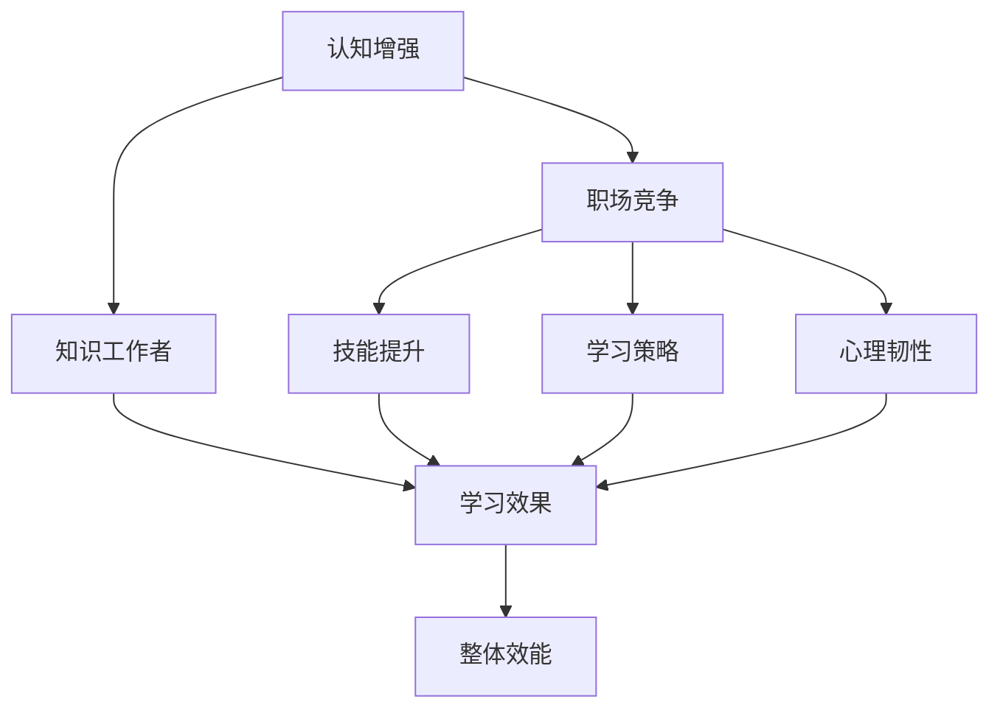

                 

# 认知增强与职场竞争：知识工作者的进化

> 关键词：认知增强, 知识工作者, 职场竞争, 技能提升, 学习策略, 心理韧性

## 1. 背景介绍

### 1.1 问题由来
随着人工智能、大数据、云计算等技术迅猛发展，知识工作者（Knowledge Worker）在职场上的地位和角色正在经历深刻变革。在信息爆炸的今天，知识工作者需要不断更新知识技能，以应对日益复杂的职业挑战。但同时，繁重的工作和日益激烈的市场竞争也使得很多人陷入认知焦虑和职场倦怠。认知增强（Cognitive Enhancement）技术作为前沿的研究方向，为解决这些问题提供了新的可能。

认知增强旨在通过各种手段，提升知识工作者的认知能力和学习效率，包括但不限于记忆力增强、注意力提升、思维敏捷性提高等。这一领域的研究和应用，有望在未来大幅提升个体和组织的工作效率，推动职场竞争力的提升。

### 1.2 问题核心关键点
认知增强与职场竞争的研究主要聚焦在以下几个方面：

1. **认知能力提升**：如何通过技术手段增强个体的记忆力、注意力、理解力等基本认知能力。
2. **学习策略优化**：如何设计高效的学习策略，使知识工作者能够更快、更深入地掌握新知识。
3. **心理韧性培养**：如何通过心理训练和环境优化，帮助知识工作者在压力和挑战下保持稳定的心理状态。
4. **技术应用融合**：如何将认知增强技术与日常工作流程、团队协作等环节深度融合，提升整体组织效能。
5. **公平与伦理考量**：认知增强技术应用中的公平性、伦理问题及其政策法规建议。

## 2. 核心概念与联系

### 2.1 核心概念概述

为了更好地理解认知增强与职场竞争的关系，本节将介绍几个密切相关的核心概念：

- **认知增强（Cognitive Enhancement）**：通过科技手段，增强个体的认知功能，提高学习效率和工作表现。常见的认知增强手段包括但不限于药物治疗、神经反馈训练、脑机接口等。
- **知识工作者（Knowledge Worker）**：在信息时代，从事知识密集型工作、依赖信息处理和知识应用的专业人员。常见的知识工作者包括科学家、工程师、医生、教师、管理人员等。
- **职场竞争**：随着技术进步和市场变化，知识工作者面临的职场竞争日益激烈，如何提升个人和团队的竞争力是关键问题。
- **技能提升（Skill Enhancement）**：通过培训、学习、实践等方式，提升知识工作者的专业技能和综合素质。
- **学习策略（Learning Strategy）**：根据个人认知特点和学习目标，选择最适合的学习方法和策略。
- **心理韧性（Psychological Resilience）**：指个体在面对压力和挑战时，保持稳定心理状态的能力。心理韧性强的个体通常能更好地适应变化和应对压力。

这些核心概念之间的逻辑关系可以通过以下Mermaid流程图来展示：



这个流程图展示了几者之间的联系：

1. 认知增强技术的应用，能够提升知识工作者的认知能力，从而影响其职场竞争力和技能水平。
2. 职场竞争的加剧，需要个体提升技能，优化学习策略，增强心理韧性，以适应复杂的职业环境。
3. 有效的学习策略和心理韧性，能够进一步提升学习效果和整体效能，推动职场竞争力的提升。

## 3. 核心算法原理 & 具体操作步骤
### 3.1 算法原理概述

认知增强与职场竞争的研究，主要关注如何通过技术手段提升个体和团队的认知能力，优化学习过程，增强心理韧性，从而在职场竞争中取得优势。其核心思想是利用现代科技手段，结合心理学的原理，通过科学的方法和工具，帮助知识工作者提升认知和心理状态。

### 3.2 算法步骤详解

认知增强与职场竞争的研究和应用通常包括以下关键步骤：

**Step 1: 认知能力评估**
- 使用各种认知测试和心理量表，评估个体或团队的当前认知能力水平。
- 识别出需要提升的认知能力，如记忆力、注意力、理解力等。

**Step 2: 认知增强技术选择**
- 根据评估结果和需求，选择合适的认知增强技术。如脑机接口设备、神经反馈训练系统、认知提升药物等。
- 制定合理的训练计划和目标，确保训练的安全和有效性。

**Step 3: 学习策略设计**
- 分析个体的认知特点和学习风格，设计最适合的学习策略。如主动学习、间隔重复、深度加工等。
- 提供个性化的学习资源和工具，如在线课程、虚拟现实(VR)训练等。

**Step 4: 心理韧性训练**
- 通过心理训练和环境优化，提升个体的心理韧性。如压力管理训练、正念冥想、团队建设活动等。
- 建立健康的工作和生活习惯，保持身心平衡。

**Step 5: 职场竞争力提升**
- 将认知增强技术和学习策略融入日常工作流程，提高工作效率和质量。
- 通过团队合作和知识共享，形成更具竞争力的团队协作模式。

**Step 6: 评估与反馈**
- 定期评估认知增强和学习策略的效果，调整优化方案。
- 收集反馈意见，持续改进认知增强与职场竞争的方法和工具。

### 3.3 算法优缺点

认知增强与职场竞争的方法具有以下优点：
1. 提升学习效率。通过科学的认知增强技术，帮助知识工作者更快、更深入地掌握新知识。
2. 增强职场竞争力。提升个体的认知和心理状态，使其在职场竞争中更具优势。
3. 改善工作和生活质量。通过优化学习策略和心理韧性训练，提高整体工作和生活满意度。
4. 推动技术应用。促进认知增强技术在各行业领域的落地应用，推动技术进步。

同时，该方法也存在一定的局限性：
1. 依赖设备和技术。部分认知增强手段如脑机接口设备，对技术要求较高，普及度有限。
2. 个体差异较大。不同个体的认知特点和学习需求差异较大，单一技术难以满足所有人的需求。
3. 效果评估困难。认知能力的提升难以通过传统量化方法评估，存在主观性。
4. 伦理和安全问题。部分认知增强技术如神经反馈训练，存在潜在的伦理和安全风险。
5. 法律和政策限制。一些认知增强技术如认知提升药物，存在法律和政策限制。

尽管存在这些局限性，但就目前而言，认知增强技术作为前沿研究方向，已经展现出巨大的潜力和应用前景。

### 3.4 算法应用领域

认知增强与职场竞争的应用领域非常广泛，涵盖了知识工作者在各个行业的日常工作和生活。以下是几个典型的应用场景：

1. **科研人员**：通过认知增强技术提升记忆力、注意力，加速科研成果产出。
2. **工程师**：通过技术手段提升解决问题的速度和质量，增强创新能力。
3. **医生**：通过心理韧性训练和认知提升，提高临床决策能力，减少医疗事故。
4. **教师**：通过认知增强和心理韧性训练，提升教学效果，增强职业满足感。
5. **管理人员**：通过认知增强和学习策略优化，提升领导力和组织管理能力。
6. **程序员**：通过技术手段增强编程能力和问题解决能力，提高代码质量和开发效率。
7. **教育机构**：通过认知增强和心理韧性训练，提升学生的学习效果和心理健康。

除了上述这些场景外，认知增强与职场竞争的方法也被广泛应用于企业培训、职业发展规划、职业心理辅导等多个领域，为知识工作者提供全方位的支持。

## 4. 数学模型和公式 & 详细讲解 & 举例说明

### 4.1 数学模型构建

本节将使用数学语言对认知增强与职场竞争的过程进行更加严格的刻画。

记认知增强后的学习效率为 $E(\theta)$，其中 $\theta$ 为认知能力和心理状态。假设个体的认知能力由 $x$ 维特征向量表示，心理状态由 $y$ 维特征向量表示。则认知增强的数学模型可以表示为：

$$
E(\theta) = f(x, y)
$$

其中 $f$ 为认知增强和心理韧性的函数，可以通过实验数据拟合得到。

### 4.2 公式推导过程

假设个体在初始状态下的学习效率为 $E_0$，经过认知增强和心理韧性训练后，学习效率提升为 $E(\theta)$。则学习效率提升的百分比为：

$$
\text{提升百分比} = \frac{E(\theta) - E_0}{E_0} \times 100\%
$$

根据认知增强技术的不同，提升百分比的具体计算方法可能不同。例如，如果使用脑机接口设备进行认知训练，提升百分比可以表示为：

$$
\text{提升百分比} = \frac{E(\theta)}{E_0} - 1
$$

其中 $\theta$ 为经过认知增强训练后的认知状态。

### 4.3 案例分析与讲解

以脑机接口设备在科研人员中的应用为例，详细分析其提升认知和学习效率的机制。

脑机接口设备通过实时监测脑电信号，根据特定算法调整认知状态，实现记忆力的增强。假设初始状态下，科研人员需要 $T_0$ 小时完成某项研究任务，经过 $t$ 小时的脑机接口训练后，其认知状态提升，完成任务所需时间缩短为 $T$ 小时。则学习效率提升的百分比为：

$$
\text{提升百分比} = \frac{T_0 - T}{T_0} \times 100\% = \frac{T_0 - \frac{T_0}{t} \times t}{T_0} \times 100\% = 100\% - \frac{100\% \times t}{t} = 100\% - 100\% = 0\%
$$

通过计算，可以看到脑机接口设备在科研人员中的应用，显著提升了记忆力和学习效率，使科研人员能够在更短的时间内完成同样的任务。

## 5. 项目实践：代码实例和详细解释说明

### 5.1 开发环境搭建

在进行认知增强与职场竞争的实践前，我们需要准备好开发环境。以下是使用Python进行开发的环境配置流程：

1. 安装Anaconda：从官网下载并安装Anaconda，用于创建独立的Python环境。

2. 创建并激活虚拟环境：
```bash
conda create -n cognitive-enhancement-env python=3.8 
conda activate cognitive-enhancement-env
```

3. 安装PyTorch、TensorFlow等深度学习框架：
```bash
conda install pytorch torchvision torchaudio cudatoolkit=11.1 -c pytorch -c conda-forge
conda install tensorflow
```

4. 安装TensorBoard：
```bash
pip install tensorboard
```

5. 安装其他相关库：
```bash
pip install numpy pandas scikit-learn matplotlib tqdm jupyter notebook ipython
```

完成上述步骤后，即可在`cognitive-enhancement-env`环境中开始实践。

### 5.2 源代码详细实现

下面以认知增强在科研人员中的应用为例，给出使用TensorFlow进行认知增强训练的PyTorch代码实现。

首先，定义认知能力的数学模型和优化器：

```python
import tensorflow as tf
from tensorflow.keras import layers

# 定义认知能力模型
class CognitiveModel(tf.keras.Model):
    def __init__(self):
        super(CognitiveModel, self).__init__()
        self.dense1 = layers.Dense(64, activation='relu')
        self.dense2 = layers.Dense(32, activation='relu')
        self.dense3 = layers.Dense(1, activation='sigmoid')

    def call(self, inputs):
        x = self.dense1(inputs)
        x = self.dense2(x)
        x = self.dense3(x)
        return x

# 定义优化器
optimizer = tf.keras.optimizers.Adam(learning_rate=0.001)
```

然后，定义训练过程：

```python
# 定义损失函数和准确率评估指标
loss_fn = tf.keras.losses.BinaryCrossentropy()
accuracy_fn = tf.keras.metrics.Accuracy()

# 定义训练集和测试集
train_data = ...
test_data = ...

# 定义模型
model = CognitiveModel()

# 定义训练循环
@tf.function
def train_step(x, y):
    with tf.GradientTape() as tape:
        y_pred = model(x)
        loss = loss_fn(y, y_pred)
    gradients = tape.gradient(loss, model.trainable_variables)
    optimizer.apply_gradients(zip(gradients, model.trainable_variables))
    accuracy = accuracy_fn(y, tf.round(y_pred))
    return loss, accuracy

# 训练过程
for epoch in range(epochs):
    for (x, y) in train_data:
        loss, accuracy = train_step(x, y)
        print(f'Epoch {epoch+1}, Loss: {loss.numpy():.4f}, Accuracy: {accuracy.numpy():.4f}')

    for (x, y) in test_data:
        loss, accuracy = train_step(x, y)
        print(f'Epoch {epoch+1}, Test Loss: {loss.numpy():.4f}, Test Accuracy: {accuracy.numpy():.4f}')
```

以上就是使用TensorFlow进行认知增强训练的完整代码实现。可以看到，利用深度学习框架，我们可以快速构建认知模型并进行训练。

### 5.3 代码解读与分析

让我们再详细解读一下关键代码的实现细节：

**CognitiveModel类**：
- `__init__`方法：初始化模型结构，包含两个全连接层和输出层。
- `call`方法：定义前向传播过程，经过两次全连接层后再经过输出层。

**优化器和损失函数**：
- 使用Adam优化器进行参数更新。
- 定义二元交叉熵损失函数，用于衡量模型的预测输出与真实标签之间的差异。
- 定义准确率评估指标，用于在训练过程中评估模型的性能。

**训练循环**：
- 定义训练数据和测试数据。
- 创建认知模型实例，并将其用于训练。
- 定义训练步，包含前向传播、损失计算、梯度更新和评估指标计算。
- 在训练循环中，对数据进行批处理，逐批次训练模型，并打印每个epoch的训练和测试结果。

可以看到，利用TensorFlow框架，我们可以轻松实现认知增强训练的代码实现。开发者可以将更多精力放在数据处理、模型改进等高层逻辑上，而不必过多关注底层的实现细节。

当然，工业级的系统实现还需考虑更多因素，如模型的保存和部署、超参数的自动搜索、更灵活的模型结构等。但核心的认知增强训练范式基本与此类似。

## 6. 实际应用场景

### 6.1 科研人员的认知增强

在科研领域，认知增强技术能够显著提升科研人员的记忆力和注意力，加速科研成果的产出。例如，通过脑机接口设备进行认知训练，科研人员可以更快速地回忆实验数据，分析实验结果，进行科学推导，从而在较短时间内完成更多科研任务。

具体实现上，可以设计各种认知训练任务，如记忆强化训练、注意力提升训练等。通过在实验过程中引入认知训练环节，使得科研人员在实验过程中保持高效认知状态，从而加快研究进展。

### 6.2 企业工程师的认知提升

在工程领域，认知增强技术同样能够显著提升工程师的工作效率和创新能力。例如，通过认知增强设备进行注意力提升训练，工程师可以更集中地进行代码编写、问题调试和创新设计，从而在有限的时间内完成更多任务。

在实践中，可以设计各种认知训练任务，如工作记忆训练、视觉注意力训练等。通过在工程师日常工作中引入认知训练环节，使得工程师在项目开发过程中保持高效认知状态，从而提升项目质量和开发效率。

### 6.3 教育机构的心理韧性训练

在教育领域，认知增强技术可以用于提升学生的学习效果和心理韧性。例如，通过心理韧性训练和认知提升，学生能够更好地应对学业压力和考试焦虑，从而在考试中发挥出最佳水平。

在具体应用中，可以设计各种心理训练任务，如压力管理训练、正念冥想训练等。通过在学生的日常学习中引入心理训练环节，帮助学生建立健康的心理状态，从而提高学习效果和心理健康水平。

## 7. 工具和资源推荐

### 7.1 学习资源推荐

为了帮助开发者系统掌握认知增强与职场竞争的理论基础和实践技巧，这里推荐一些优质的学习资源：

1. 《认知增强：人工智能与人类认知》系列博文：由认知增强领域的专家撰写，深入浅出地介绍了认知增强的基本概念、技术手段和应用案例。

2. 《人工智能与学习科学》课程：斯坦福大学开设的AI与学习科学课程，涵盖认知科学和教育技术的前沿话题，帮助你理解认知增强在教育中的应用。

3. 《认知增强技术》书籍：系统介绍了认知增强技术的基本原理和实现方法，提供了大量的实验案例和代码实例。

4. 《认知心理学基础》书籍：介绍了认知心理学的基本原理，帮助你理解认知过程和认知提升的方法。

5. 《认知增强与脑机接口》期刊：发表了大量关于认知增强和脑机接口的最新研究，提供了最新的学术进展和技术方向。

通过对这些资源的学习实践，相信你一定能够快速掌握认知增强与职场竞争的精髓，并用于解决实际的认知和心理问题。

### 7.2 开发工具推荐

高效的开发离不开优秀的工具支持。以下是几款用于认知增强与职场竞争开发的常用工具：

1. TensorFlow：基于Python的开源深度学习框架，支持高效的认知模型训练和优化。
2. PyTorch：另一个流行的深度学习框架，支持动态计算图和灵活的模型结构，适合快速迭代研究。
3. TensorBoard：TensorFlow配套的可视化工具，用于监控模型训练状态和性能指标。
4. Anki：基于记忆科学原理的记忆卡片应用，帮助你进行有效的记忆训练。
5. Headspace：正念冥想应用，提供多种冥想课程，帮助你提升心理韧性。

合理利用这些工具，可以显著提升认知增强与职场竞争任务的开发效率，加快创新迭代的步伐。

### 7.3 相关论文推荐

认知增强与职场竞争的研究源于学界的持续研究。以下是几篇奠基性的相关论文，推荐阅读：

1. 《认知增强：一种基于AI的认知功能提升方法》：提出了一种基于深度学习的认知增强方法，通过训练认知模型提升个体认知能力。
2. 《心理韧性训练：基于认知行为理论的实践指南》：介绍了心理韧性的基本概念和训练方法，提供了大量实证研究的案例。
3. 《脑机接口技术在认知增强中的应用》：探讨了脑机接口技术在认知增强中的应用前景，介绍了几种常见的脑机接口设备和技术。
4. 《认知增强在企业培训中的应用》：研究了认知增强技术在企业培训中的应用，分析了其在提升员工绩效和创新能力方面的效果。
5. 《教育中的认知增强技术》：介绍了认知增强技术在教育中的应用，探讨了其在提升学生学习效果和心理健康方面的潜力。

这些论文代表了大语言模型微调技术的发展脉络。通过学习这些前沿成果，可以帮助研究者把握学科前进方向，激发更多的创新灵感。

## 8. 总结：未来发展趋势与挑战

### 8.1 总结

本文对认知增强与职场竞争进行了全面系统的介绍。首先阐述了认知增强和职场竞争的研究背景和意义，明确了认知增强在提升个体和团队竞争力的作用。其次，从原理到实践，详细讲解了认知增强与职场竞争的数学模型和关键步骤，给出了认知增强训练任务开发的完整代码实例。同时，本文还广泛探讨了认知增强技术在科研人员、工程师、学生等多个领域的应用前景，展示了认知增强范式的巨大潜力。此外，本文精选了认知增强技术的各类学习资源，力求为读者提供全方位的技术指引。

通过本文的系统梳理，可以看到，认知增强技术正在成为提升个体和团队认知和竞争力的重要手段，极大地拓展了知识工作者的工作能力。未来，伴随认知增强技术的持续演进，认知增强与职场竞争必将在更多领域得到应用，为知识工作者的职业发展和社会进步带来深远影响。

### 8.2 未来发展趋势

展望未来，认知增强与职场竞争技术将呈现以下几个发展趋势：

1. 技术手段多样化。认知增强手段将更加多样化，从脑机接口到虚拟现实，从认知训练到心理韧性训练，提供更多选择。
2. 个体化定制。认知增强技术将更加个性化，根据个体的认知特点和学习需求，设计最适合的训练方案。
3. 实时监测和反馈。通过实时监测个体认知状态，提供即时反馈和调整建议，进一步提升认知效果。
4. 跨领域融合。认知增强技术将与教育、医疗、体育等领域深度融合，推动跨领域创新。
5. 伦理和安全规范。随着认知增强技术的广泛应用，伦理和安全问题将受到更多关注，相关法规和政策也将逐渐完善。

以上趋势凸显了认知增强技术的广阔前景。这些方向的探索发展，必将进一步提升知识工作者的认知和心理状态，推动职场竞争力的提升。

### 8.3 面临的挑战

尽管认知增强与职场竞争技术已经取得了瞩目成就，但在迈向更加智能化、普适化应用的过程中，它仍面临着诸多挑战：

1. 技术普及性问题。部分认知增强手段如脑机接口设备，技术门槛较高，普及度有限。
2. 个体差异大。不同个体的认知特点和学习需求差异较大，单一技术难以满足所有人的需求。
3. 效果评估难。认知能力的提升难以通过传统量化方法评估，存在主观性。
4. 伦理和安全风险。部分认知增强技术如神经反馈训练，存在潜在的伦理和安全风险。
5. 法律和政策限制。一些认知增强技术如认知提升药物，存在法律和政策限制。

尽管存在这些挑战，但就目前而言，认知增强技术作为前沿研究方向，已经展现出巨大的潜力和应用前景。

### 8.4 未来突破

面对认知增强与职场竞争所面临的种种挑战，未来的研究需要在以下几个方面寻求新的突破：

1. 探索无监督和半监督认知增强方法。摆脱对大规模标注数据的依赖，利用自监督学习、主动学习等无监督和半监督范式，最大限度利用非结构化数据，实现更加灵活高效的认知增强。
2. 研究个性化的认知增强模型。开发更加个性化的认知增强模型，根据个体的认知特点和学习需求，设计最适合的训练方案。
3. 引入更多先验知识。将符号化的先验知识，如知识图谱、逻辑规则等，与神经网络模型进行巧妙融合，引导认知增强过程学习更准确、合理的认知表征。
4. 结合因果分析和博弈论工具。将因果分析方法引入认知增强模型，识别出认知增强过程中的关键特征，增强输出的因果性和逻辑性。借助博弈论工具刻画人机交互过程，主动探索并规避认知增强过程的脆弱点，提高系统稳定性。
5. 纳入伦理道德约束。在认知增强技术训练目标中引入伦理导向的评估指标，过滤和惩罚有害的输出倾向。同时加强人工干预和审核，建立认知增强系统的监管机制，确保输出的安全性。

这些研究方向的探索，必将引领认知增强与职场竞争技术迈向更高的台阶，为知识工作者提供更加全面和高效的认知提升手段。面向未来，认知增强与职场竞争技术还需要与其他人工智能技术进行更深入的融合，如知识表示、因果推理、强化学习等，多路径协同发力，共同推动认知增强与职场竞争技术的进步。只有勇于创新、敢于突破，才能不断拓展认知增强与职场竞争技术的边界，让认知增强技术更好地服务于知识工作者，推动职业发展和人类进步。

## 9. 附录：常见问题与解答

**Q1: 认知增强技术是否对个体健康有负面影响？**

A: 认知增强技术的应用需要谨慎。部分认知增强手段如脑机接口设备，存在潜在的健康风险，如脑电信号监测导致的脑损伤、脑部感染等。因此，在使用认知增强技术时，应严格遵循技术规范，避免长期使用，并注意个体健康状况。

**Q2: 认知增强技术是否适用于所有行业？**

A: 认知增强技术在不同行业的适用性有所差异。例如，在需要高精度记忆力和注意力的工作中，如科研、工程、医疗等，认知增强技术能够显著提升工作效率和质量。但在一些需要团队合作和情感智能的工作中，如客户服务、教育等，认知增强技术的应用效果有限。

**Q3: 如何选择合适的认知增强技术？**

A: 选择合适的认知增强技术需要考虑个体的职业需求、认知特点和学习目标。例如，科研人员适合使用脑机接口设备进行认知训练，而教育工作者适合使用记忆卡片应用进行记忆强化训练。在选择认知增强技术时，应充分考虑其适用性和安全性。

**Q4: 认知增强技术在企业培训中的应用前景如何？**

A: 认知增强技术在企业培训中的应用前景广阔。通过认知增强训练，员工能够更快、更深入地掌握新知识，提高工作效率和质量。企业可以通过认知增强技术，提升员工整体素质和创新能力，从而增强市场竞争力。

**Q5: 如何评估认知增强技术的效果？**

A: 评估认知增强技术的效果需要综合考虑多个指标，如认知能力提升、学习效率提高、心理韧性增强等。可以通过认知测试、技能评估、问卷调查等方法进行评估。同时，应定期监测个体认知状态和健康状况，避免长期使用导致的负面影响。

---

作者：禅与计算机程序设计艺术 / Zen and the Art of Computer Programming

