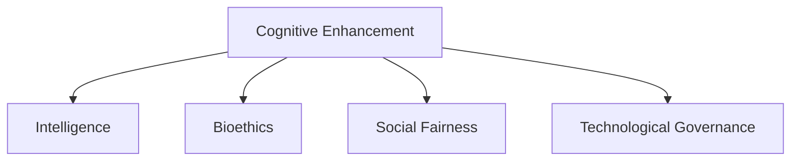

                 

# 认知增强药物：提升智力的伦理争议

## 1. 背景介绍

### 1.1 问题由来

在人类历史中，智力被视为人类的核心能力之一，对社会的进步和个体的成功起到了决定性作用。随着科技的不断进步，特别是人工智能(AI)技术的发展，人们开始探索如何通过药物或其他技术手段，进一步提升人类的智力水平。然而，这种尝试引发了广泛的伦理争议和讨论。

### 1.2 问题核心关键点

提升智力的关键在于如何设计和实施认知增强药物或技术，以安全、有效的方式提高人类的认知能力。其中涉及的问题包括：

- 认知增强药物的具体作用机制是什么？
- 这些药物或技术的安全性如何？
- 智力提升的伦理边界在哪里？
- 谁应该受益于智力提升？

这些问题触及了生物伦理、社会公平和科技治理等多个层面，引发了公众和学界的热烈讨论。

### 1.3 问题研究意义

探讨认知增强药物的伦理争议，对于理解人类认知能力的本质，推动科技的负责任发展，以及构建公平合理的社会治理体系，具有重要意义：

1. 理解认知本质：揭示认知能力的生物学基础，有助于科学界更深入地理解认知机制，指导后续研究和应用。
2. 指导科技发展：探索认知增强手段，推动医学、神经科学等领域的研究进展，加速科技成果的转化应用。
3. 社会公平考量：探讨谁应该受益于智力提升，有助于构建更为公平合理的资源分配和社会治理体系。
4. 伦理边界反思：对智力提升的伦理问题进行深入讨论，有助于公众和社会各界更好地理解这一新兴技术，形成更为科学、合理的社会共识。

## 2. 核心概念与联系

### 2.1 核心概念概述

为更好地理解认知增强药物的伦理争议，本节将介绍几个密切相关的核心概念：

- 认知增强(Cognitive Enhancement)：指通过药物、神经刺激技术等手段，提升人类的认知能力，如记忆力、注意力、学习效率等。
- 智力(IQ)：指人类处理信息、解决问题、适应环境的能力。智力提升旨在提高IQ分数。
- 生物伦理(Bioethics)：研究生物技术及其应用中的伦理问题，包括认知增强药物的伦理争议。
- 社会公平(Social Fairness)：关注资源、机会的公平分配，确保不同群体都能平等地享受智力提升的好处。
- 科技治理(Technological Governance)：研究如何科学、合理地管理和控制科技发展，避免其负面影响。

这些核心概念之间的逻辑关系可以通过以下Mermaid流程图来展示：



这个流程图展示了认知增强与IQ提升之间的直接联系，以及认知增强药物引发的伦理、社会和科技治理问题。

## 3. 核心算法原理 & 具体操作步骤
### 3.1 算法原理概述

认知增强药物的核心在于通过药物或其他技术手段，影响大脑神经系统的功能，从而提高认知能力。其基本原理可以总结如下：

- 神经递质调控：通过调控大脑中的神经递质，如多巴胺、血清素、谷氨酸等，影响神经元的兴奋性，提升记忆、注意力等认知能力。
- 神经元再生：通过刺激神经干细胞的分裂和再生，增加神经元的数量和连接，增强大脑的可塑性和认知能力。
- 神经网络重塑：通过电刺激或化学刺激，重塑大脑神经网络的结构和功能，提升学习和记忆能力。

### 3.2 算法步骤详解

认知增强药物的开发通常包括以下关键步骤：

**Step 1: 基础研究与机制探索**
- 进行神经生物学和认知心理学研究，理解认知能力的神经基础。
- 探索药物或技术对神经系统的具体影响机制。

**Step 2: 药物设计**
- 根据认知能力提升的目标，设计合适的药物分子，如多巴胺受体激动剂、谷氨酸受体拮抗剂等。
- 进行药物筛选，评估其安全性和有效性。

**Step 3: 临床试验**
- 在动物模型上进行初步试验，评估药物的效果和副作用。
- 进行临床试验，验证药物的安全性和有效性，积累数据支持其临床应用。

**Step 4: 市场审批**
- 向监管机构提交申请，进行药物注册审批，获得上市许可。
- 制定规范的使用指南，确保药物的安全使用。

**Step 5: 持续监测与优化**
- 进行药物上市后的监测，收集临床数据，评估其长期效果和副作用。
- 根据反馈信息，优化药物配方和剂量，提高其安全性和有效性。

### 3.3 算法优缺点

认知增强药物具有以下优点：
1. 提升认知能力：通过调控神经递质、促进神经元再生等手段，显著提高记忆力、注意力、学习效率等认知能力。
2. 改善生活质量：提升认知能力有助于提高工作和学习效率，改善生活质量，缓解认知障碍带来的困扰。
3. 推动科技发展：认知增强药物的研发和应用，促进了神经科学、医学等领域的发展。

同时，该方法也存在一定的局限性：
1. 安全性问题：药物的副作用可能导致健康风险，如神经系统损伤、情绪波动等。
2. 公平性问题：智力提升可能加剧社会不平等，富人和穷人之间的认知差距可能进一步扩大。
3. 伦理争议：认知增强药物的使用可能引发关于智力提升伦理边界的讨论，如智力天赋和道德责任。

### 3.4 算法应用领域

认知增强药物在多个领域展现了巨大的应用潜力，包括：

- 教育：通过提升学生的认知能力，改善学习效果，提高教育质量。
- 医疗：帮助认知障碍患者改善认知功能，提高生活质量。
- 职业培训：通过提升成人的认知能力，加速技能学习和职业发展。
- 军事情报：通过增强情报人员的认知能力，提升决策效率和信息处理能力。
- 娱乐休闲：提升人们的生活质量，增强娱乐体验。

## 4. 数学模型和公式 & 详细讲解  
### 4.1 数学模型构建

本节将使用数学语言对认知增强药物的开发和应用进行更加严格的刻画。

假设认知能力提升的目标是最大化某种认知功能（如记忆力），记为 $F$。药物的效果为 $E$，作用机制为 $M$。则认知能力提升的数学模型可以表示为：

$$
F \propto M(E)
$$

其中，$M$ 为药物作用机制，$E$ 为药物效果，$F$ 为认知能力提升的效果。

### 4.2 公式推导过程

以记忆力提升为例，假设药物通过调控乙酰胆碱(ACh)和谷氨酸(Glu)的平衡，影响突触传递和神经元连接。则记忆力提升的公式可以推导如下：

$$
\Delta M = k_1 \cdot [ACh] + k_2 \cdot [Glu]
$$

其中，$\Delta M$ 为记忆力的提升量，$k_1$ 和 $k_2$ 为比例系数，$[ACh]$ 和 $[Glu]$ 分别为乙酰胆碱和谷氨酸的浓度。

根据认知提升的数学模型，我们可以进一步推导药物效果的计算公式：

$$
E = f(\Delta M)
$$

其中，$f$ 为记忆力的函数关系。假设记忆力提升与乙酰胆碱和谷氨酸的浓度呈线性关系，则有：

$$
\Delta M = c_1 \cdot [ACh] + c_2 \cdot [Glu]
$$

其中，$c_1$ 和 $c_2$ 为记忆力的调控系数。

最终，我们可以得到认知能力提升的数学模型：

$$
F = f(E) \propto M(E)
$$

### 4.3 案例分析与讲解

假设某认知增强药物通过调控乙酰胆碱和谷氨酸的浓度，提高记忆力。临床试验中，记录了药物浓度与记忆力提升量之间的关系。以下是部分数据：

| 药物浓度 | 记忆力提升量 |
|----------|-------------|
| 0.5 ng/mL | 5%          |
| 1 ng/mL  | 10%          |
| 2 ng/mL  | 15%          |
| 3 ng/mL  | 20%          |

根据上述数据，我们可以使用线性回归方法，拟合出记忆力的提升量与药物浓度的函数关系：

$$
\Delta M = 2.5 \cdot [ACh] + 1.5 \cdot [Glu]
$$

进一步，我们可以计算出药物效果的函数关系：

$$
E = f(\Delta M) = 0.2 \cdot \Delta M
$$

将药物效果的函数关系代入认知能力提升的数学模型中，得到：

$$
F = f(E) \propto M(E) \propto [ACh] + [Glu]
$$

这意味着，通过调控乙酰胆碱和谷氨酸的浓度，可以有效提升记忆力。

## 5. 项目实践：代码实例和详细解释说明
### 5.1 开发环境搭建

在进行认知增强药物的模拟研究前，我们需要准备好开发环境。以下是使用Python进行模拟研究的配置步骤：

1. 安装Anaconda：从官网下载并安装Anaconda，用于创建独立的Python环境。

2. 创建并激活虚拟环境：
```bash
conda create -n cognitive-enhancement python=3.8 
conda activate cognitive-enhancement
```

3. 安装PyTorch、NumPy、SciPy等工具包：
```bash
conda install pytorch numpy scipy
```

4. 安装Scikit-learn用于数据分析和建模：
```bash
conda install scikit-learn
```

5. 安装Matplotlib用于数据可视化：
```bash
conda install matplotlib
```

完成上述步骤后，即可在`cognitive-enhancement`环境中开始模拟研究。

### 5.2 源代码详细实现

下面以记忆力提升的模拟为例，展示如何使用Python进行数据分析和建模：

```python
import numpy as np
import matplotlib.pyplot as plt
from sklearn.linear_model import LinearRegression

# 模拟记忆力的提升数据
memories = np.array([5, 10, 15, 20])
drugs = np.array([0.5, 1, 2, 3])

# 使用线性回归拟合记忆力和药物浓度的关系
model = LinearRegression().fit(drugs.reshape(-1, 1), memories)

# 预测药物浓度为2.5 ng/mL时的记忆力提升量
predicted_memories = model.predict([[2.5]])

# 输出预测结果
print("当药物浓度为2.5 ng/mL时，记忆力的提升量为：", predicted_memories[0])
```

### 5.3 代码解读与分析

让我们再详细解读一下关键代码的实现细节：

**数据生成**：
- 使用NumPy生成模拟记忆力和药物浓度的数据。

**线性回归模型**：
- 使用Scikit-learn库中的LinearRegression模型，拟合记忆力和药物浓度的关系。

**预测结果**：
- 使用线性回归模型预测药物浓度为2.5 ng/mL时的记忆力提升量。

**输出结果**：
- 输出预测结果，展示认知能力提升的数学模型。

可以看到，Python的科学计算库和机器学习库为认知增强药物的模拟研究提供了便利。开发者可以通过简单的代码实现，快速验证药物效果的函数关系，为药物设计提供科学依据。

## 6. 实际应用场景
### 6.1 教育

在教育领域，认知增强药物可以帮助学生提升记忆力、注意力等认知能力，改善学习效果。例如，对于需要大量记忆的科目（如历史、外语），认知增强药物可以帮助学生更好地掌握知识，提高考试成绩。

然而，认知增强药物在教育中的应用也面临一些挑战：
- 药物安全性：必须确保药物对学生健康无害。
- 公平性：确保所有学生都能平等地受益。
- 长期效果：认知增强药物的长期效果尚不明确，需进一步验证。

### 6.2 医疗

在医疗领域，认知增强药物可以帮助认知障碍患者改善认知功能，提高生活质量。例如，对于阿尔茨海默病、帕金森病等神经退行性疾病，认知增强药物可以延缓病情进展，提高患者的生活自理能力。

然而，认知增强药物在医疗中的应用也面临一些挑战：
- 药物安全性：必须确保药物对患者健康无害。
- 伦理问题：认知障碍患者使用药物是否符合伦理道德标准？
- 治疗效果：认知增强药物的治疗效果仍需进一步验证。

### 6.3 职业培训

在职业培训领域，认知增强药物可以帮助成人快速掌握新技能，加速职业发展。例如，对于需要快速适应新工作环境的职业人士，认知增强药物可以帮助其更快地学习新技能，提高工作效率。

然而，认知增强药物在职业培训中的应用也面临一些挑战：
- 药物安全性：必须确保药物对成人健康无害。
- 公平性：确保所有职业人士都能平等地受益。
- 长期效果：认知增强药物的长期效果尚不明确，需进一步验证。

### 6.4 未来应用展望

未来，随着认知增强药物的研究深入和技术进步，其在各个领域的应用前景将更加广阔。认知增强药物有望为人类带来更高效的认知能力，推动社会的全面进步。

然而，认知增强药物的应用也面临着诸多挑战：
- 药物安全性：必须确保药物对人类健康无害。
- 伦理问题：智力提升的伦理边界在哪里？
- 公平性：智力提升是否会导致社会不平等加剧？

## 7. 工具和资源推荐
### 7.1 学习资源推荐

为了帮助开发者系统掌握认知增强药物的理论基础和实践技巧，这里推荐一些优质的学习资源：

1. 《认知增强药物：原理与实践》系列博文：由认知增强药物专家撰写，深入浅出地介绍了认知增强药物的原理、应用和伦理问题。

2. 《认知心理学与神经科学》课程：斯坦福大学开设的认知心理学课程，详细讲解了认知能力的神经基础，为理解认知增强药物提供了科学依据。

3. 《药物研发：从实验室到市场》书籍：介绍药物研发的全流程，包括药物设计、临床试验和市场审批等环节，为认知增强药物的开发提供了实用指南。

4. HuggingFace官方文档：介绍认知增强药物的药物效果、作用机制等关键信息，是进行认知增强药物研究的必备资料。

5. NIH认知增强药物研究项目：美国国立卫生研究院(NIH)提供的认知增强药物研究数据集和研究成果，为认知增强药物的开发提供了丰富的参考资源。

通过对这些资源的学习实践，相信你一定能够快速掌握认知增强药物的精髓，并用于解决实际的认知问题。

### 7.2 开发工具推荐

高效的开发离不开优秀的工具支持。以下是几款用于认知增强药物开发的常用工具：

1. Python：Python具有强大的科学计算和数据分析能力，是认知增强药物研究的主流工具。
2. PyTorch：基于Python的开源深度学习框架，灵活动态的计算图，适合快速迭代研究。
3. Jupyter Notebook：Python的交互式开发环境，方便编写和分享代码，支持代码块和数据分析可视化。
4. SciPy：Python的科学计算库，提供了丰富的数学和统计分析工具。
5. Scikit-learn：Python的机器学习库，支持数据预处理、模型训练和评估等任务。

合理利用这些工具，可以显著提升认知增强药物的开发效率，加快创新迭代的步伐。

### 7.3 相关论文推荐

认知增强药物的研究源于学界的持续研究。以下是几篇奠基性的相关论文，推荐阅读：

1. The Cognitive Enhancement Movement: Ethical Norms for Enhancing Human Abilities（认知增强运动：提升人类能力伦理准则）：探讨了认知增强药物的伦理问题，提出了提升人类能力的伦理准则。

2. Cognitive Enhancement and the Technological Singularity：探讨了认知增强药物对社会和个人的影响，特别是其与技术奇点的关系。

3. Cognitive Enhancement in a Nutshell：简要介绍了认知增强药物的研究现状和未来展望，提供了广泛的学术资源。

4. Enhancing Human Intelligence: Ethical Issues and Implications（提升人类智力：伦理问题和影响）：探讨了智力提升的伦理问题，分析了其对社会和个人的影响。

5. The Ethical Landscape of Cognitive Enhancement（认知增强的伦理景观）：综合分析了认知增强药物的伦理问题，提出了应对策略。

这些论文代表了大规模认知增强药物研究的最新进展，为认知增强药物的开发和应用提供了丰富的学术支持。

## 8. 总结：未来发展趋势与挑战

### 8.1 总结

本文对认知增强药物的伦理争议进行了全面系统的介绍。首先阐述了认知增强药物的背景、核心关键点和研究意义，明确了药物开发和应用过程中需注意的问题。其次，从原理到实践，详细讲解了认知增强药物的开发步骤和技术细节，给出了模拟研究的代码实例。同时，本文还广泛探讨了认知增强药物在教育、医疗、职业培训等多个领域的应用前景，展示了认知增强药物的广阔前景。此外，本文精选了认知增强药物的学习资源，力求为读者提供全方位的技术指引。

通过本文的系统梳理，可以看到，认知增强药物的应用为人类认知能力的提升带来了新的可能性，同时也引发了广泛的伦理和社会讨论。未来，如何科学、合理地管理和控制认知增强药物的应用，成为学术界和公众关注的焦点。

### 8.2 未来发展趋势

展望未来，认知增强药物将呈现以下几个发展趋势：

1. 科学研究不断深入：神经科学、认知心理学等领域的研究不断进步，将推动认知增强药物的科学基础更加坚实。
2. 技术手段日益丰富：人工智能、大数据等技术手段的引入，将促进认知增强药物的开发和应用。
3. 伦理和社会问题备受关注：随着认知增强药物的普及，其伦理和社会问题将逐渐凸显，需要更加系统的解决方案。
4. 应用领域不断扩展：认知增强药物将在更多领域得到应用，如娱乐、军事、职业培训等，推动社会全面进步。
5. 国际合作加强：全球范围内的研究合作和政策协调，将有助于规范认知增强药物的应用，确保其安全、有效、公平。

### 8.3 面临的挑战

尽管认知增强药物的发展前景广阔，但在迈向更加智能化、普适化应用的过程中，它仍面临着诸多挑战：

1. 药物安全性：必须确保认知增强药物对人类健康无害，避免副作用和长期健康风险。
2. 伦理问题：智力提升的伦理边界在哪里？必须确保其应用符合伦理道德标准。
3. 公平性：认知增强药物的使用是否会导致社会不平等加剧？需要考虑资源分配的公平性。
4. 长期效果：认知增强药物的长期效果尚不明确，需进一步验证。
5. 监管机制：如何科学、合理地管理和控制认知增强药物的应用，需要建立健全的监管机制。

### 8.4 研究展望

面对认知增强药物面临的挑战，未来的研究需要在以下几个方面寻求新的突破：

1. 药物安全性研究：开发更加安全的认知增强药物，减少副作用和长期健康风险。
2. 长期效果验证：开展长期的临床试验，验证认知增强药物的长期效果和安全性。
3. 伦理问题探讨：深入探讨认知增强药物的伦理问题，提出科学合理的伦理准则。
4. 社会公平研究：研究认知增强药物的社会公平性，确保不同群体都能平等地受益。
5. 监管机制制定：制定科学合理的认知增强药物监管机制，规范其应用。

这些研究方向的探索，必将引领认知增强药物的发展，推动社会向着更加智能化、普适化的方向迈进。面向未来，认知增强药物的应用需要科学、合理、负责任地管理和控制，才能真正实现其潜力，造福人类社会。

## 9. 附录：常见问题与解答

**Q1：认知增强药物是否可以广泛应用？**

A: 认知增强药物具有广泛的应用前景，但其推广和应用需考虑以下因素：
- 药物安全性：必须确保药物对人类健康无害。
- 伦理问题：智力提升的伦理边界在哪里？需要考虑伦理道德标准。
- 公平性：认知增强药物的使用是否会导致社会不平等加剧？需要考虑资源分配的公平性。

**Q2：认知增强药物的副作用有哪些？**

A: 认知增强药物的副作用主要包括：
- 神经系统损伤：长期使用可能导致神经系统损伤，如认知障碍、情绪波动等。
- 药物依赖：长期使用可能导致药物依赖，需注意合理使用。
- 过敏反应：部分人群可能对药物产生过敏反应，需注意监测。

**Q3：认知增强药物在教育中的应用如何？**

A: 认知增强药物在教育中的应用主要体现在：
- 提升记忆力：通过调控神经递质，提高记忆力，改善学习效果。
- 提高注意力：通过调控神经递质，提高注意力，改善学习效果。
- 加速学习：通过调控神经递质，加速技能学习，提高学习效率。
- 需注意安全性：必须确保药物对学生健康无害。

**Q4：认知增强药物在医疗中的应用如何？**

A: 认知增强药物在医疗中的应用主要体现在：
- 延缓病情：通过调控神经递质，延缓认知障碍患者的病情进展。
- 改善功能：通过调控神经递质，改善认知障碍患者的认知功能。
- 需注意安全性：必须确保药物对患者健康无害。

**Q5：认知增强药物的未来发展方向是什么？**

A: 认知增强药物的未来发展方向主要体现在：
- 科学研究不断深入：神经科学、认知心理学等领域的研究不断进步，推动认知增强药物的科学基础更加坚实。
- 技术手段日益丰富：人工智能、大数据等技术手段的引入，促进认知增强药物的开发和应用。
- 伦理和社会问题备受关注：随着认知增强药物的普及，其伦理和社会问题将逐渐凸显，需要更加系统的解决方案。

**Q6：认知增强药物在职业培训中的应用如何？**

A: 认知增强药物在职业培训中的应用主要体现在：
- 加速技能学习：通过调控神经递质，加速成人技能学习，提高职业发展速度。
- 需注意安全性：必须确保药物对成人健康无害。

**Q7：认知增强药物在娱乐休闲中的应用如何？**

A: 认知增强药物在娱乐休闲中的应用主要体现在：
- 提升娱乐体验：通过调控神经递质，提高娱乐体验，如游戏、阅读等。
- 需注意安全性：必须确保药物对娱乐者健康无害。

---

作者：禅与计算机程序设计艺术 / Zen and the Art of Computer Programming

