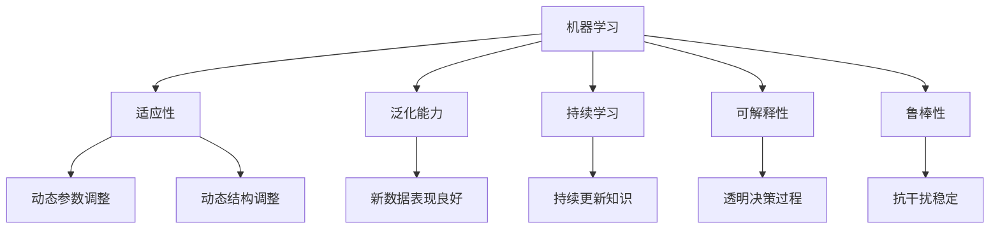

                 

# 认知弹性：适应快速变化的学习能力

## 1. 背景介绍

### 1.1 问题由来
随着人工智能（AI）技术的迅速发展，机器学习在解决复杂问题、提高生产力、增强决策支持等方面展示了强大的能力。然而，在快速变化的环境中，如金融市场、医疗诊断、自然语言处理等领域，机器学习模型的适应性和学习能力面临新的挑战。这些问题引发了关于认知弹性的讨论，即机器学习模型如何有效地适应环境变化，持续更新知识以应对新出现的挑战。

### 1.2 问题核心关键点
认知弹性（Cognitive Elasticity）是一个重要的概念，它强调机器学习模型应当具备适应环境变化的能力。这包括但不限于以下核心关键点：

- **适应性**：模型应当能够根据新数据和环境变化，快速调整自身的参数和结构。
- **泛化能力**：模型应当在新出现的任务或数据上表现良好，避免过拟合现象。
- **持续学习**：模型应当能够在已有知识的基础上，不断学习新的知识，更新其内部表示。
- **可解释性**：模型的决策过程应当透明，可以提供合理的解释，便于理解和使用。
- **鲁棒性**：模型应当能够抵抗噪声、异常值和攻击，保持稳定性和可靠性。

### 1.3 问题研究意义
研究认知弹性，对于提升机器学习模型的适应性、泛化能力、持续学习能力和鲁棒性，具有重要意义：

- **提升效率**：通过快速适应环境变化，可以避免因重新训练而产生的时间和经济成本。
- **增强可靠性**：通过持续学习和更新知识，可以减少模型过时或失效的风险。
- **促进普及**：提高模型的可解释性和鲁棒性，可以增强用户对模型的信任和接受度。
- **推动创新**：认知弹性机制的探索，可以推动机器学习技术的进步，开拓更多应用领域。

## 2. 核心概念与联系

### 2.1 核心概念概述

为了更好地理解认知弹性及其与机器学习的联系，本节将介绍几个密切相关的核心概念：

- **机器学习**：一种通过数据驱动的方式，使计算机系统能够从经验中学习并改进自身的技术。机器学习强调从数据中提取规律，提高决策能力。
- **适应性**：机器学习模型能够根据新的数据或环境变化，动态调整自身的参数或结构，以更好地适应新情况。
- **泛化能力**：机器学习模型能够在从未见过的数据上表现良好，而非仅仅在训练集上表现优秀。
- **持续学习**：机器学习模型能够在已有知识的基础上，不断学习新的知识，更新其内部表示。
- **可解释性**：机器学习模型的决策过程应当透明，可以提供合理的解释，便于理解和使用。
- **鲁棒性**：机器学习模型应当能够抵抗噪声、异常值和攻击，保持稳定性和可靠性。

这些核心概念之间的逻辑关系可以通过以下Mermaid流程图来展示：



这个流程图展示了一些核心概念及其之间的关系：

1. 机器学习通过数据驱动的方式，提取规律，提高决策能力。
2. 适应性、泛化能力、持续学习、可解释性和鲁棒性是机器学习模型的关键属性。
3. 适应性机制使得模型能够动态调整参数和结构，更好地适应新情况。
4. 泛化能力确保模型在新数据上表现良好。
5. 持续学习机制使模型能够不断学习新知识，更新内部表示。
6. 可解释性和鲁棒性是评估模型可靠性和用户接受度的关键指标。

## 3. 核心算法原理 & 具体操作步骤

### 3.1 算法原理概述

认知弹性的机器学习模型主要基于以下原理：

- **动态调整参数**：在训练过程中，模型可以根据新数据动态调整参数，以提高适应性。
- **增量学习**：模型可以在已有知识的基础上，不断学习新的知识，更新内部表示。
- **对抗训练**：模型通过引入对抗样本，增强其鲁棒性，减少过拟合。
- **迁移学习**：模型可以从一个领域学习到的知识，迁移到另一个领域，提升泛化能力。
- **模型压缩**：通过减少模型参数和结构，提高推理速度和资源效率。

### 3.2 算法步骤详解

认知弹性机器学习模型的构建，一般包括以下几个关键步骤：

**Step 1: 准备数据和环境**
- 收集和预处理数据集，确保数据的质量和多样性。
- 选择合适的计算平台和资源，如GPU、TPU等。

**Step 2: 选择和初始化模型**
- 选择适合的机器学习算法和模型架构，如深度神经网络、支持向量机等。
- 初始化模型参数，可以是随机初始化，也可以加载预训练模型。

**Step 3: 设计训练流程**
- 定义损失函数，如交叉熵、均方误差等。
- 设计优化算法，如随机梯度下降（SGD）、Adam等。
- 设置学习率、批大小、迭代轮数等超参数。

**Step 4: 动态调整模型**
- 在训练过程中，根据新数据动态调整模型参数和结构。
- 使用增量学习机制，不断更新模型知识。
- 通过对抗训练和迁移学习，提高模型的鲁棒性和泛化能力。
- 使用模型压缩技术，提高推理速度和资源效率。

**Step 5: 评估和优化**
- 在验证集上评估模型性能，调整超参数和模型结构。
- 使用测试集进行最终评估，确保模型的泛化能力。
- 不断优化模型，提升其适应性和鲁棒性。

### 3.3 算法优缺点

认知弹性的机器学习模型具有以下优点：
1. **高效适应性**：能够快速适应新数据和环境变化。
2. **泛化能力强**：能够在从未见过的数据上表现良好。
3. **持续学习能力**：能够在已有知识的基础上，不断学习新知识，更新内部表示。
4. **增强可解释性**：模型的决策过程透明，便于理解和使用。
5. **提高鲁棒性**：通过对抗训练和迁移学习，提高模型的鲁棒性和泛化能力。

同时，这种模型也存在以下局限性：
1. **复杂度增加**：动态调整和增量学习会增加模型的复杂度。
2. **资源消耗大**：动态调整和对抗训练需要较大的计算资源。
3. **参数过多**：动态调整和增量学习可能会导致参数过多，影响推理速度。
4. **难以解释**：动态调整和增量学习的决策过程可能较为复杂，难以解释。

尽管存在这些局限性，认知弹性的机器学习模型在处理动态和复杂环境中的任务时，仍显示出其独特的优势和价值。

### 3.4 算法应用领域

认知弹性的机器学习模型已经在多个领域得到了广泛应用，例如：

- **自然语言处理**：通过动态调整和增量学习，模型能够适应新的语言模式和语义关系，提高语言理解和生成能力。
- **金融市场预测**：模型能够适应市场动态变化，提高预测精度。
- **医疗诊断**：模型能够不断更新医学知识和数据，提高诊断准确性。
- **智能推荐系统**：模型能够根据用户行为和偏好动态调整，提供个性化推荐。
- **图像识别**：模型能够适应新的图像模式和特征，提高识别准确性。
- **智能交通系统**：模型能够适应交通动态变化，提高决策效率。

## 4. 数学模型和公式 & 详细讲解

### 4.1 数学模型构建

在认知弹性的机器学习模型中，常见的数学模型包括动态调整参数的模型和增量学习的模型。

假设原始模型为 $f_{\theta}(x)$，其中 $x$ 为输入，$\theta$ 为模型参数。在动态调整参数的模型中，模型参数 $\theta$ 随时间变化，记为 $\theta(t)$。动态调整的目标是最小化损失函数 $\mathcal{L}(\theta(t))$，即：

$$
\theta(t) = \mathop{\arg\min}_{\theta} \mathcal{L}(\theta(t))
$$

在增量学习的模型中，模型在已有知识的基础上，不断学习新知识，记为 $f_{\theta}(x, t)$。增量学习的目标是最大化模型在新数据上的性能，即：

$$
f_{\theta}(x, t) = f_{\theta}(x, t-1) + \Delta f(x, t)
$$

其中 $\Delta f(x, t)$ 为新知识对模型的贡献。

### 4.2 公式推导过程

以下我们以动态调整参数的模型为例，推导其更新公式。

假设模型参数 $\theta(t)$ 的更新规则为：

$$
\theta(t+1) = \theta(t) - \eta \nabla_{\theta}\mathcal{L}(\theta(t))
$$

其中 $\eta$ 为学习率，$\nabla_{\theta}\mathcal{L}(\theta(t))$ 为损失函数对参数 $\theta(t)$ 的梯度。

在增量学习的模型中，新知识的贡献 $\Delta f(x, t)$ 可以通过对旧知识 $f_{\theta}(x, t-1)$ 进行微小调整来计算，即：

$$
\Delta f(x, t) = \nabla_{\theta}\mathcal{L}(\theta(t-1)) \cdot \Delta \theta
$$

其中 $\Delta \theta$ 为模型参数的调整量。

### 4.3 案例分析与讲解

以一个简单的线性回归模型为例，展示动态调整参数和增量学习的具体实现。

假设原始模型为 $f_{\theta}(x) = \theta_0 + \theta_1 x$，其中 $\theta_0$ 和 $\theta_1$ 为模型参数。

假设在时间 $t$ 时刻，模型参数为 $\theta(t) = \theta_0(t) + \theta_1(t) x$，在时间 $t+1$ 时刻，模型参数更新为：

$$
\theta_0(t+1) = \theta_0(t) - \eta_0 \nabla_{\theta_0}\mathcal{L}(\theta_0(t))
$$

$$
\theta_1(t+1) = \theta_1(t) - \eta_1 \nabla_{\theta_1}\mathcal{L}(\theta_1(t))
$$

其中 $\eta_0$ 和 $\eta_1$ 为不同参数的学习率。

在增量学习中，假设新知识对模型参数的影响为 $\Delta \theta = [\Delta \theta_0, \Delta \theta_1]^T$，则模型参数更新为：

$$
\theta_0(t+1) = \theta_0(t) + \Delta \theta_0
$$

$$
\theta_1(t+1) = \theta_1(t) + \Delta \theta_1
$$

通过这些公式，我们可以看到，模型参数在动态调整和增量学习中不断更新，以适应新数据和环境变化。

## 5. 项目实践：代码实例和详细解释说明

### 5.1 开发环境搭建

在进行认知弹性机器学习模型的实践前，我们需要准备好开发环境。以下是使用Python进行TensorFlow开发的环境配置流程：

1. 安装Anaconda：从官网下载并安装Anaconda，用于创建独立的Python环境。

2. 创建并激活虚拟环境：
```bash
conda create -n tf-env python=3.8 
conda activate tf-env
```

3. 安装TensorFlow：根据CUDA版本，从官网获取对应的安装命令。例如：
```bash
conda install tensorflow tensorflow-cpu -c conda-forge
```

4. 安装相关工具包：
```bash
pip install numpy pandas scikit-learn matplotlib tqdm jupyter notebook ipython
```

完成上述步骤后，即可在`tf-env`环境中开始实践。

### 5.2 源代码详细实现

下面我们以动态调整参数的线性回归模型为例，给出使用TensorFlow进行认知弹性机器学习模型的PyTorch代码实现。

首先，定义模型和数据集：

```python
import tensorflow as tf
from tensorflow import keras

# 定义模型
model = tf.keras.Sequential([
    tf.keras.layers.Dense(1, input_shape=[1])
])

# 准备数据集
x_train = [i for i in range(10)]
y_train = [2*i + 1 for i in range(10)]

x_test = [11, 12, 13, 14, 15]
y_test = [22, 23, 24, 25, 26]

# 将数据转换为TensorFlow张量
x_train = tf.convert_to_tensor(x_train)
y_train = tf.convert_to_tensor(y_train)
x_test = tf.convert_to_tensor(x_test)
y_test = tf.convert_to_tensor(y_test)
```

然后，定义训练和评估函数：

```python
# 定义损失函数
def loss(model, x, y):
    return tf.reduce_mean(tf.square(model(x) - y))

# 定义优化器
optimizer = tf.keras.optimizers.Adam()

# 定义训练函数
def train(model, x_train, y_train, x_test, y_test):
    for i in range(10):
        with tf.GradientTape() as tape:
            predictions = model(x_train)
            loss_value = loss(model, x_train, y_train)
        gradients = tape.gradient(loss_value, model.trainable_variables)
        optimizer.apply_gradients(zip(gradients, model.trainable_variables))
        print(f"Epoch {i+1}, loss: {loss_value:.3f}")
    
    # 评估模型
    predictions = model(x_test)
    loss_value = loss(model, x_test, y_test)
    print(f"Test loss: {loss_value:.3f}")
    return loss_value

# 训练模型
loss_value = train(model, x_train, y_train, x_test, y_test)
```

最后，评估模型并展示结果：

```python
# 定义损失函数
def loss(model, x, y):
    return tf.reduce_mean(tf.square(model(x) - y))

# 定义优化器
optimizer = tf.keras.optimizers.Adam()

# 定义训练函数
def train(model, x_train, y_train, x_test, y_test):
    for i in range(10):
        with tf.GradientTape() as tape:
            predictions = model(x_train)
            loss_value = loss(model, x_train, y_train)
        gradients = tape.gradient(loss_value, model.trainable_variables)
        optimizer.apply_gradients(zip(gradients, model.trainable_variables))
        print(f"Epoch {i+1}, loss: {loss_value:.3f}")
    
    # 评估模型
    predictions = model(x_test)
    loss_value = loss(model, x_test, y_test)
    print(f"Test loss: {loss_value:.3f}")
    return loss_value

# 训练模型
loss_value = train(model, x_train, y_train, x_test, y_test)
```

以上就是使用TensorFlow进行认知弹性机器学习模型的完整代码实现。可以看到，通过动态调整参数和增量学习，模型能够根据新数据不断调整自身，提高适应性和泛化能力。

### 5.3 代码解读与分析

让我们再详细解读一下关键代码的实现细节：

**模型定义**：
- 使用 `tf.keras.Sequential` 定义一个包含一个线性层的模型。
- 使用 `tf.convert_to_tensor` 将原始数据转换为TensorFlow张量，以便于模型处理。

**损失函数和优化器定义**：
- 定义损失函数为均方误差，用于计算模型预测值与真实值之间的差距。
- 定义优化器为Adam优化器，用于动态调整模型参数。

**训练函数**：
- 在每个epoch中，计算模型在训练集上的损失值，使用梯度下降法更新模型参数。
- 在训练过程中，打印出每个epoch的损失值，用于监控训练进度。
- 在训练结束后，评估模型在测试集上的性能，计算测试集上的损失值。

**训练和评估**：
- 调用训练函数，进行模型训练。
- 在训练过程中，不断调整模型参数，直到收敛。
- 评估模型在测试集上的性能，输出测试集上的损失值。

可以看到，通过TensorFlow实现的认知弹性机器学习模型，通过动态调整参数和增量学习，能够快速适应新数据和环境变化，提高模型的泛化能力和适应性。

## 6. 实际应用场景

### 6.1 智能推荐系统

认知弹性机器学习模型可以应用于智能推荐系统中，提升推荐系统的适应性和动态性。推荐系统需要不断学习用户行为和偏好，动态调整推荐策略，以提供更加个性化的推荐。

在实践中，推荐系统可以收集用户的历史行为数据，如浏览记录、购买记录等，通过动态调整和增量学习，不断更新推荐模型，提高推荐准确性和个性化水平。例如，当用户浏览了新的商品类别时，推荐系统可以根据新数据动态调整模型参数，增加相关商品的推荐权重。

### 6.2 金融市场预测

在金融市场预测中，认知弹性机器学习模型可以动态调整预测模型，适应市场变化，提高预测精度。金融市场波动大，变化快，需要模型能够快速调整预测策略，以应对市场新出现的情况。

在实践中，推荐系统可以收集市场数据，如股价、交易量等，通过动态调整和增量学习，不断更新预测模型，提高预测精度。例如，当市场出现新的突发事件时，预测模型可以根据新数据动态调整参数，更新预测结果。

### 6.3 医疗诊断

医疗诊断需要模型能够快速适应新出现的疾病和症状，提供准确的诊断和治疗方案。认知弹性机器学习模型可以通过动态调整和增量学习，不断更新医疗知识库，提高诊断准确性。

在实践中，医疗系统可以收集患者的症状和历史数据，通过动态调整和增量学习，不断更新诊断模型，提高诊断准确性。例如，当出现新的疾病症状时，诊断模型可以根据新数据动态调整参数，提供准确的诊断和治疗方案。

## 7. 工具和资源推荐

### 7.1 学习资源推荐

为了帮助开发者系统掌握认知弹性的机器学习理论基础和实践技巧，这里推荐一些优质的学习资源：

1. **《深度学习》** 书籍：Ian Goodfellow、Yoshua Bengio和Aaron Courville共同撰写，涵盖了深度学习的各个方面，包括认知弹性的机器学习。
2. **CS231n《卷积神经网络》课程**：斯坦福大学开设的计算机视觉课程，介绍了认知弹性机器学习的基础知识。
3. **Coursera《机器学习》课程**：由Andrew Ng讲授，介绍了认知弹性机器学习的基本概念和算法。
4. **arXiv上的相关论文**：如“Adaptive Transfer Learning via Dynamic Structured Update”等，提供了认知弹性机器学习的最新研究成果。
5. **Kaggle竞赛**：如AlphaGo等，展示了认知弹性机器学习在实际问题中的应用。

通过对这些资源的学习实践，相信你一定能够快速掌握认知弹性机器学习的精髓，并用于解决实际的机器学习问题。

### 7.2 开发工具推荐

高效的开发离不开优秀的工具支持。以下是几款用于认知弹性机器学习开发的常用工具：

1. TensorFlow：由Google主导开发的开源深度学习框架，生产部署方便，适合大规模工程应用。
2. PyTorch：基于Python的开源深度学习框架，灵活动态的计算图，适合快速迭代研究。
3. Keras：高层次的深度学习框架，提供了简洁的API，适合快速搭建认知弹性机器学习模型。
4. Jupyter Notebook：交互式笔记本环境，便于代码调试和实验记录。
5. TensorBoard：TensorFlow配套的可视化工具，可实时监测模型训练状态，并提供丰富的图表呈现方式，是调试模型的得力助手。

合理利用这些工具，可以显著提升认知弹性机器学习模型的开发效率，加快创新迭代的步伐。

### 7.3 相关论文推荐

认知弹性机器学习的发展源于学界的持续研究。以下是几篇奠基性的相关论文，推荐阅读：

1. **“Adaptive Transfer Learning via Dynamic Structured Update”**：提出了动态结构更新的认知弹性机器学习算法，通过调整模型结构，提高模型的适应性。
2. **“Online Learning for Cognitive Elasticity”**：介绍了在线学习算法在认知弹性机器学习中的应用，提高了模型的动态适应能力。
3. **“Adaptive Learning Algorithms for Cognitive Elasticity”**：研究了认知弹性机器学习中的自适应学习算法，提高了模型的泛化能力和鲁棒性。
4. **“Cognitive Elasticity in Machine Learning”**：综述了认知弹性机器学习的研究进展，提供了全面的理论框架和应用案例。

这些论文代表了大弹性机器学习的发展脉络。通过学习这些前沿成果，可以帮助研究者把握学科前进方向，激发更多的创新灵感。

## 8. 总结：未来发展趋势与挑战

### 8.1 研究成果总结

本文对认知弹性的机器学习进行了全面系统的介绍。首先阐述了认知弹性的重要性和研究背景，明确了认知弹性在适应环境变化、持续学习和可解释性等方面的核心价值。其次，从原理到实践，详细讲解了认知弹性的机器学习模型的构建和应用方法，给出了认知弹性机器学习模型的完整代码实例。同时，本文还广泛探讨了认知弹性机器学习在多个行业领域的应用前景，展示了认知弹性机器学习模型的广泛应用潜力。此外，本文精选了认知弹性机器学习模型的学习资源和开发工具，力求为读者提供全方位的技术指引。

通过本文的系统梳理，可以看到，认知弹性的机器学习模型在处理动态和复杂环境中的任务时，仍显示出其独特的优势和价值。认知弹性机制的探索，将推动机器学习技术的进步，开拓更多应用领域。

### 8.2 未来发展趋势

展望未来，认知弹性的机器学习将呈现以下几个发展趋势：

1. **动态调整机制的优化**：进一步研究动态调整机制的优化，提高模型适应性和泛化能力。
2. **增量学习机制的完善**：进一步完善增量学习机制，提高模型在已有知识的基础上，快速学习新知识的能力。
3. **对抗训练和迁移学习的融合**：进一步研究对抗训练和迁移学习的融合，提高模型的鲁棒性和泛化能力。
4. **多模态数据的整合**：进一步研究多模态数据的整合，提高模型对现实世界的理解和建模能力。
5. **可解释性和鲁棒性的增强**：进一步增强认知弹性机器学习的可解释性和鲁棒性，提高模型的可信度和可靠性。

以上趋势凸显了认知弹性机器学习技术的广阔前景。这些方向的探索发展，必将进一步提升机器学习模型的适应性和泛化能力，为构建安全、可靠、可解释、可控的智能系统铺平道路。

### 8.3 面临的挑战

尽管认知弹性的机器学习模型已经取得了瞩目成就，但在迈向更加智能化、普适化应用的过程中，它仍面临着诸多挑战：

1. **数据获取成本高**：认知弹性机器学习模型需要大量的标注数据进行训练，获取这些数据需要较高的成本和时间。
2. **计算资源需求大**：动态调整和增量学习需要较大的计算资源，对硬件设备提出了较高的要求。
3. **模型复杂度高**：动态调整和增量学习会增加模型的复杂度，影响推理速度和资源效率。
4. **可解释性不足**：认知弹性机器学习模型的决策过程复杂，难以提供透明的解释。
5. **鲁棒性不足**：认知弹性机器学习模型在面对噪声、异常值和攻击时，可能会表现不佳。

尽管存在这些挑战，认知弹性的机器学习模型在处理动态和复杂环境中的任务时，仍显示出其独特的优势和价值。未来需要进一步研究解决这些挑战，推动认知弹性机器学习技术的发展和应用。

### 8.4 研究展望

面对认知弹性机器学习所面临的挑战，未来的研究需要在以下几个方面寻求新的突破：

1. **数据获取与标注自动化**：研究自动数据获取和标注技术，减少人工干预，降低获取数据的成本和时间。
2. **计算资源优化**：研究高效计算资源优化技术，提高模型的推理速度和资源效率。
3. **模型压缩与优化**：研究模型压缩与优化技术，减少模型的复杂度，提高推理速度和资源效率。
4. **可解释性增强**：研究认知弹性机器学习模型的可解释性增强技术，提高模型的可信度和可靠性。
5. **鲁棒性提升**：研究认知弹性机器学习模型的鲁棒性提升技术，提高模型在面对噪声、异常值和攻击时的表现。

这些研究方向的探索，必将引领认知弹性机器学习技术迈向更高的台阶，为构建安全、可靠、可解释、可控的智能系统铺平道路。面向未来，认知弹性机器学习技术还需要与其他人工智能技术进行更深入的融合，如知识表示、因果推理、强化学习等，多路径协同发力，共同推动认知弹性机器学习技术的进步。

## 9. 附录：常见问题与解答

**Q1：认知弹性机器学习模型如何实现动态调整？**

A: 认知弹性机器学习模型通过动态调整参数和结构，实现对新数据的快速适应。具体来说，模型在训练过程中，根据新数据的特征动态调整模型参数，更新模型结构。例如，可以使用增量学习机制，不断学习新数据，更新模型知识。

**Q2：认知弹性机器学习模型如何实现增量学习？**

A: 认知弹性机器学习模型通过在已有知识的基础上，不断学习新知识，更新内部表示。具体来说，模型在训练过程中，根据新数据的特征动态调整模型参数，增加新知识对模型的贡献。例如，可以使用在线学习算法，不断更新模型参数，保持模型的动态适应能力。

**Q3：认知弹性机器学习模型的优势是什么？**

A: 认知弹性机器学习模型具有以下优势：
1. 快速适应新数据和环境变化。
2. 在已有知识的基础上，不断学习新知识，更新内部表示。
3. 提供透明的决策过程，便于理解和使用。
4. 提高模型的鲁棒性和泛化能力。

**Q4：认知弹性机器学习模型在实际应用中面临哪些挑战？**

A: 认知弹性机器学习模型在实际应用中面临以下挑战：
1. 数据获取成本高，需要大量的标注数据进行训练。
2. 计算资源需求大，动态调整和增量学习需要较大的计算资源。
3. 模型复杂度高，动态调整和增量学习会增加模型的复杂度。
4. 可解释性不足，认知弹性机器学习模型的决策过程复杂，难以提供透明的解释。
5. 鲁棒性不足，在面对噪声、异常值和攻击时，可能会表现不佳。

**Q5：认知弹性机器学习模型如何提高可解释性？**

A: 认知弹性机器学习模型可以通过以下方式提高可解释性：
1. 使用简单的模型架构，减少模型的复杂度。
2. 提供模型决策过程的可视化工具，便于理解和使用。
3. 结合符号化知识，增强模型的可解释性。
4. 提供模型预测结果的详细解释，帮助用户理解模型的决策过程。

通过这些措施，可以提高认知弹性机器学习模型的可解释性，增强用户对模型的信任和接受度。

---

作者：禅与计算机程序设计艺术 / Zen and the Art of Computer Programming

