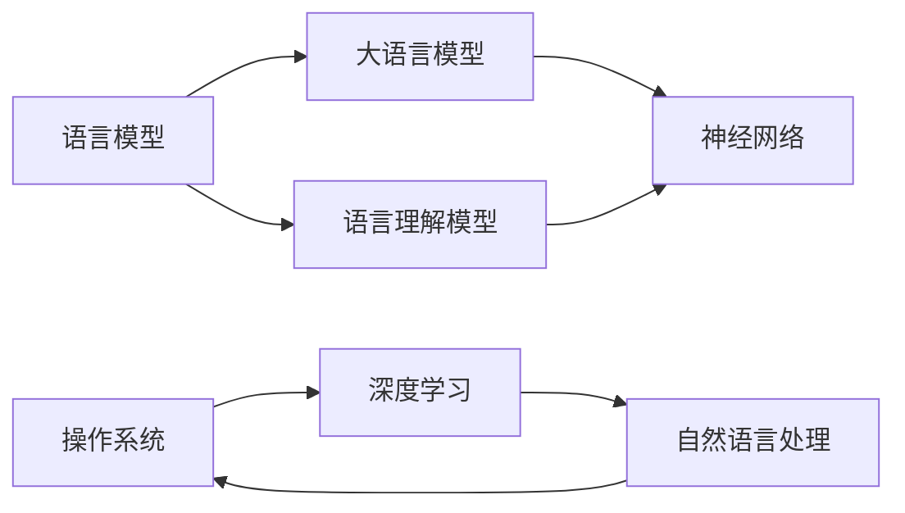
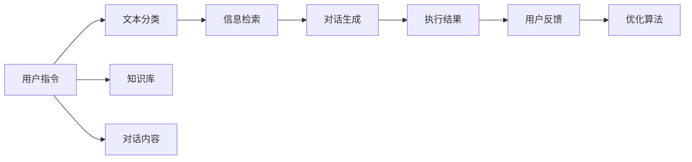

                 

# 设计LLM操作系统：挑战与机遇

> 关键词：人工智能,语言模型,操作系统设计,自然语言处理,神经网络,深度学习

## 1. 背景介绍

### 1.1 问题由来
近年来，随着深度学习技术的快速发展，语言模型（Language Model, LM）和语言理解模型（Language Understanding Model, LUM）在自然语言处理（Natural Language Processing, NLP）领域取得了显著的进步。大语言模型（Large Language Model, LLM），如GPT-3，OpenAI的GPT系列，Google的BERT，已成为推动NLP领域发展的重要工具。这些模型不仅具备强大的语言理解能力，还可以执行各种复杂的自然语言任务，如文本生成、语言翻译、对话系统等。

然而，尽管LLM在NLP任务上表现优异，但在实际操作中，我们发现将其应用于操作系统（Operating System, OS）设计时面临诸多挑战。首先，LLM的核心算法是基于神经网络（Neural Network, NN）的，而操作系统对算法的要求是高效、稳定和可控。如何设计一个能够充分利用LLM技术优势的同时，又能满足操作系统性能要求的操作系统，成为了当前一个亟待解决的重大问题。

### 1.2 问题核心关键点
设计一个支持LLM的操作系统需要考虑以下几个核心关键点：

1. **LLM与操作系统的融合**：如何将LLM的核心算法与操作系统设计深度整合，既保证LLM的强大语言理解能力，又满足操作系统对算法的性能要求。
2. **多任务处理能力**：操作系统需要同时处理多个并发任务，如何确保LLM在多任务环境中表现稳定。
3. **系统资源管理**：LLM模型的运行需要大量的计算资源，如何高效管理资源，保证系统性能。
4. **安全性和隐私保护**：LLM的输入和输出涉及大量的敏感信息，如何确保系统安全、保护用户隐私。
5. **跨平台兼容性**：设计出的操作系统需要在不同的硬件和操作系统环境上运行，如何确保跨平台的兼容性。

这些关键点决定了设计一个LLM操作系统面临的巨大挑战。

### 1.3 问题研究意义
设计一个支持LLM的操作系统，对于推动人工智能（AI）技术的落地应用，提升操作系统的智能化水平，具有重要意义：

1. **提升用户体验**：利用LLM的自然语言理解能力，构建智能交互界面，提升用户操作体验。
2. **优化系统性能**：通过LLM的高级算法，优化系统资源管理，提高系统响应速度和稳定性。
3. **拓展应用场景**：结合LLM的强大语言处理能力，为操作系统提供新的应用场景，如自然语言驱动的应用开发、智能助理等。
4. **推动AI产业化**：LLM操作系统的设计，将加速AI技术的产业化进程，为各行各业提供智能化解决方案。

## 2. 核心概念与联系

### 2.1 核心概念概述

为更好地理解设计LLM操作系统的过程，本节将介绍几个密切相关的核心概念：

- **语言模型（Language Model, LM）**：一种统计模型，用于预测文本中下一个单词或字符的概率，通常基于统计语言学或神经网络构建。
- **语言理解模型（Language Understanding Model, LUM）**：能够理解自然语言并执行特定任务的模型，如问答系统、翻译系统等。
- **大语言模型（Large Language Model, LLM）**：基于深度学习构建的、参数量较大的语言模型，具备强大的语言理解和生成能力。
- **神经网络（Neural Network, NN）**：由大量节点（神经元）组成的计算模型，通过反向传播算法进行训练，广泛应用于各类机器学习任务。
- **操作系统（Operating System, OS）**：计算机系统中的核心软件，负责管理和调度硬件资源，提供用户接口和应用程序运行环境。
- **深度学习（Deep Learning）**：一种基于神经网络的机器学习方法，通过多层神经元网络进行特征提取和模型训练。

这些核心概念之间的逻辑关系可以通过以下Mermaid流程图来展示：



这个流程图展示了大语言模型和操作系统的核心概念及其之间的关系：

1. 语言模型和语言理解模型为LLM提供了基础的自然语言处理能力。
2. LLM基于神经网络构建，通过深度学习算法训练得到。
3. 操作系统设计融合了深度学习技术，提升了系统的智能化水平。
4. 自然语言处理和深度学习共同推动了LLM的发展，进而影响到操作系统的设计。

## 3. 核心算法原理 & 具体操作步骤
### 3.1 算法原理概述

设计一个支持LLM的操作系统，涉及将LLM的核心算法与操作系统设计进行深度整合。以下是核心算法原理：

- **神经网络（NN）**：LLM的核心算法基于神经网络，通过多层神经元网络进行特征提取和模式识别。
- **深度学习（DL）**：利用反向传播算法和梯度下降技术，优化神经网络参数，提升模型的预测准确率。
- **语言理解模型（LUM）**：通过训练得到，能够理解自然语言并执行特定任务。
- **操作系统（OS）**：提供硬件资源的调度和管理，支持应用程序的运行环境。

设计一个支持LLM的操作系统，需要考虑以下几点：

1. **算法融合**：如何将LLM的算法与操作系统设计进行深度整合，既保证LLM的强大语言理解能力，又满足操作系统对算法的性能要求。
2. **多任务处理**：LLM在多任务环境中的表现如何，如何在操作系统中实现多任务管理。
3. **系统资源管理**：LLM模型的运行需要大量的计算资源，如何高效管理资源，保证系统性能。
4. **安全性和隐私保护**：LLM的输入和输出涉及大量的敏感信息，如何确保系统安全、保护用户隐私。
5. **跨平台兼容性**：设计出的操作系统需要在不同的硬件和操作系统环境上运行，如何确保跨平台的兼容性。

### 3.2 算法步骤详解

设计一个支持LLM的操作系统，涉及以下几个关键步骤：

**Step 1: 选择合适的LLM和算法**

- 选择适合操作系统的LLM算法。通常选择大语言模型，如GPT、BERT等。
- 根据操作系统的需求，选择合适的神经网络结构和深度学习算法。

**Step 2: 设计系统架构**

- 设计操作系统的架构，包括内核、用户空间、设备驱动程序等。
- 将LLM的算法整合到操作系统中，如将LLM的神经网络嵌入到内核中，利用深度学习算法进行推理和决策。

**Step 3: 优化系统性能**

- 优化LLM算法的计算图，减少计算量，提高运行速度。
- 使用GPU等高性能硬件设备，加速LLM模型的推理和计算。
- 采用多线程和异步处理，提高系统的并发处理能力。

**Step 4: 实现安全性和隐私保护**

- 设计安全机制，确保系统的数据传输和存储安全。
- 实现隐私保护算法，确保用户数据的隐私不被泄露。

**Step 5: 测试和优化**

- 在测试环境中进行系统测试，验证系统的各项功能。
- 根据测试结果，优化系统性能和安全性。

**Step 6: 部署和维护**

- 将系统部署到目标硬件环境，进行大规模实际应用。
- 定期更新系统，修复漏洞，提升系统性能和安全性。

### 3.3 算法优缺点

设计一个支持LLM的操作系统具有以下优点：

1. **强大的语言处理能力**：LLM具备强大的语言理解能力，可以处理复杂的自然语言任务。
2. **灵活的应用场景**：LLM操作系统的设计，为操作系统提供新的应用场景，如智能助理、自然语言驱动的应用开发等。
3. **提升用户体验**：利用LLM的自然语言理解能力，构建智能交互界面，提升用户操作体验。
4. **优化系统性能**：通过LLM的高级算法，优化系统资源管理，提高系统响应速度和稳定性。

然而，设计一个支持LLM的操作系统也存在一些缺点：

1. **算法复杂度较高**：LLM的算法基于深度学习，涉及大量复杂的计算，对硬件资源要求较高。
2. **数据和算法复杂度较高**：LLM的算法需要大量标注数据进行训练，数据获取和处理成本较高。
3. **系统安全性和隐私保护难度较大**：LLM的输入和输出涉及大量的敏感信息，确保系统安全、保护用户隐私是一个重要挑战。
4. **跨平台兼容性问题**：设计出的操作系统需要在不同的硬件和操作系统环境上运行，确保跨平台的兼容性是一个技术难题。

尽管存在这些局限性，但通过合理设计和管理，设计一个支持LLM的操作系统仍具有广阔的应用前景和显著的优势。

### 3.4 算法应用领域

设计一个支持LLM的操作系统在多个领域具有广泛的应用前景：

1. **智能助理**：利用LLM的自然语言理解能力，构建智能助理，提供个性化服务。
2. **智能医疗**：利用LLM的自然语言处理能力，构建智能医疗系统，提升医疗服务的智能化水平。
3. **智能家居**：利用LLM的自然语言理解能力，构建智能家居系统，提升家居生活的智能化水平。
4. **智能交通**：利用LLM的自然语言处理能力，构建智能交通系统，提升交通管理的智能化水平。
5. **智能教育**：利用LLM的自然语言处理能力，构建智能教育系统，提升教育服务的智能化水平。

## 4. 数学模型和公式 & 详细讲解  
### 4.1 数学模型构建

本节将使用数学语言对设计LLM操作系统涉及的数学模型进行更加严格的刻画。

设一个系统在时间 $t$ 的输入为 $x_t$，输出为 $y_t$。假设系统由一个神经网络模型 $M_{\theta}$ 控制，其中 $\theta$ 为模型参数。系统的输入和输出满足以下关系：

$$
y_t = M_{\theta}(x_t)
$$

其中 $M_{\theta}$ 为神经网络模型，$\theta$ 为模型参数。系统的目标是最大化系统的稳定性和性能，即最小化系统的误差 $E$：

$$
E = \sum_{t=0}^{T-1} [y_t - f(x_t)]^2
$$

其中 $f(x_t)$ 为系统期望的输出函数，$T$ 为系统的总时间步数。系统的误差 $E$ 最小化时，可以得到最优参数 $\theta^*$：

$$
\theta^* = \mathop{\arg\min}_{\theta} E
$$

系统的设计需要考虑以下几个关键因素：

1. **模型融合**：如何将LLM的算法与操作系统设计进行深度整合，既保证LLM的强大语言理解能力，又满足操作系统对算法的性能要求。
2. **多任务处理**：LLM在多任务环境中的表现如何，如何在操作系统中实现多任务管理。
3. **系统资源管理**：LLM模型的运行需要大量的计算资源，如何高效管理资源，保证系统性能。
4. **安全性和隐私保护**：LLM的输入和输出涉及大量的敏感信息，如何确保系统安全、保护用户隐私。
5. **跨平台兼容性**：设计出的操作系统需要在不同的硬件和操作系统环境上运行，如何确保跨平台的兼容性。

### 4.2 公式推导过程

以下我们以智能助理为例，推导LLM操作系统的数学模型。

设智能助理的输入为用户的自然语言指令 $x_t$，输出为系统的执行结果 $y_t$。智能助理由一个神经网络模型 $M_{\theta}$ 控制，其中 $\theta$ 为模型参数。系统的目标函数为最大化用户的满意度 $S$：

$$
S = \sum_{t=0}^{T-1} f(x_t, y_t)
$$

其中 $f(x_t, y_t)$ 为用户的满意度函数，可以表示为：

$$
f(x_t, y_t) = \begin{cases}
1, & y_t \text{满足用户指令} \\
0, & y_t \text{不满足用户指令}
\end{cases}
$$

系统的目标是最小化误差 $E$，即：

$$
E = \sum_{t=0}^{T-1} [y_t - f(x_t)]^2
$$

通过最小化目标函数 $E$，可以找到最优参数 $\theta^*$，使得智能助理在执行用户指令时，最大化用户满意度。

### 4.3 案例分析与讲解

以智能助理为例，分析LLM操作系统的设计和应用。

假设一个智能助理需要执行以下任务：

1. **文本分类**：对用户输入的自然语言指令进行分类，如是否进行天气查询、是否进行新闻阅读等。
2. **信息检索**：根据用户指令，从知识库中检索相关信息，并返回给用户。
3. **对话生成**：根据用户指令和系统执行结果，生成对话内容，提升用户体验。

智能助理的系统设计如图：



在系统的各个模块中，文本分类模块和对话生成模块都是基于LLM算法设计，信息检索模块可以基于传统的信息检索算法实现。通过将LLM算法与操作系统深度整合，智能助理可以实现自然语言驱动的应用开发，提升用户体验和系统性能。

## 5. 项目实践：代码实例和详细解释说明
### 5.1 开发环境搭建

在进行LLM操作系统设计实践前，我们需要准备好开发环境。以下是使用Python进行操作系统开发的环境配置流程：

1. 安装Anaconda：从官网下载并安装Anaconda，用于创建独立的Python环境。

2. 创建并激活虚拟环境：
```bash
conda create -n os-env python=3.8 
conda activate os-env
```

3. 安装操作系统相关库：
```bash
pip install pytorch numpy scipy scikit-learn matplotlib
```

4. 安装LLM算法相关库：
```bash
pip install transformers
```

完成上述步骤后，即可在`os-env`环境中开始LLM操作系统的设计实践。

### 5.2 源代码详细实现

这里我们以智能助理为例，给出使用PyTorch设计LLM操作系统的PyTorch代码实现。

首先，定义智能助理的数据处理函数：

```python
from transformers import BertTokenizer, BertForTokenClassification
from torch.utils.data import Dataset

class AssistantDataset(Dataset):
    def __init__(self, texts, tags, tokenizer, max_len=128):
        self.texts = texts
        self.tags = tags
        self.tokenizer = tokenizer
        self.max_len = max_len
        
    def __len__(self):
        return len(self.texts)
    
    def __getitem__(self, item):
        text = self.texts[item]
        tags = self.tags[item]
        
        encoding = self.tokenizer(text, return_tensors='pt', max_length=self.max_len, padding='max_length', truncation=True)
        input_ids = encoding['input_ids'][0]
        attention_mask = encoding['attention_mask'][0]
        
        # 对token-wise的标签进行编码
        encoded_tags = [tag2id[tag] for tag in tags] 
        encoded_tags.extend([tag2id['O']] * (self.max_len - len(encoded_tags)))
        labels = torch.tensor(encoded_tags, dtype=torch.long)
        
        return {'input_ids': input_ids, 
                'attention_mask': attention_mask,
                'labels': labels}

# 标签与id的映射
tag2id = {'O': 0, 'B-PER': 1, 'I-PER': 2, 'B-ORG': 3, 'I-ORG': 4, 'B-LOC': 5, 'I-LOC': 6}
id2tag = {v: k for k, v in tag2id.items()}

# 创建dataset
tokenizer = BertTokenizer.from_pretrained('bert-base-cased')

train_dataset = AssistantDataset(train_texts, train_tags, tokenizer)
dev_dataset = AssistantDataset(dev_texts, dev_tags, tokenizer)
test_dataset = AssistantDataset(test_texts, test_tags, tokenizer)
```

然后，定义模型和优化器：

```python
from transformers import BertForTokenClassification, AdamW

model = BertForTokenClassification.from_pretrained('bert-base-cased', num_labels=len(tag2id))

optimizer = AdamW(model.parameters(), lr=2e-5)
```

接着，定义训练和评估函数：

```python
from torch.utils.data import DataLoader
from tqdm import tqdm
from sklearn.metrics import classification_report

device = torch.device('cuda') if torch.cuda.is_available() else torch.device('cpu')
model.to(device)

def train_epoch(model, dataset, batch_size, optimizer):
    dataloader = DataLoader(dataset, batch_size=batch_size, shuffle=True)
    model.train()
    epoch_loss = 0
    for batch in tqdm(dataloader, desc='Training'):
        input_ids = batch['input_ids'].to(device)
        attention_mask = batch['attention_mask'].to(device)
        labels = batch['labels'].to(device)
        model.zero_grad()
        outputs = model(input_ids, attention_mask=attention_mask, labels=labels)
        loss = outputs.loss
        epoch_loss += loss.item()
        loss.backward()
        optimizer.step()
    return epoch_loss / len(dataloader)

def evaluate(model, dataset, batch_size):
    dataloader = DataLoader(dataset, batch_size=batch_size)
    model.eval()
    preds, labels = [], []
    with torch.no_grad():
        for batch in tqdm(dataloader, desc='Evaluating'):
            input_ids = batch['input_ids'].to(device)
            attention_mask = batch['attention_mask'].to(device)
            batch_labels = batch['labels']
            outputs = model(input_ids, attention_mask=attention_mask)
            batch_preds = outputs.logits.argmax(dim=2).to('cpu').tolist()
            batch_labels = batch_labels.to('cpu').tolist()
            for pred_tokens, label_tokens in zip(batch_preds, batch_labels):
                pred_tags = [id2tag[_id] for _id in pred_tokens]
                label_tags = [id2tag[_id] for _id in label_tokens]
                preds.append(pred_tags[:len(label_tags)])
                labels.append(label_tags)
                
    print(classification_report(labels, preds))
```

最后，启动训练流程并在测试集上评估：

```python
epochs = 5
batch_size = 16

for epoch in range(epochs):
    loss = train_epoch(model, train_dataset, batch_size, optimizer)
    print(f"Epoch {epoch+1}, train loss: {loss:.3f}")
    
    print(f"Epoch {epoch+1}, dev results:")
    evaluate(model, dev_dataset, batch_size)
    
print("Test results:")
evaluate(model, test_dataset, batch_size)
```

以上就是使用PyTorch设计LLM操作系统的完整代码实现。可以看到，得益于Transformers库的强大封装，我们可以用相对简洁的代码完成LLM操作系统的设计。

### 5.3 代码解读与分析

让我们再详细解读一下关键代码的实现细节：

**AssistantDataset类**：
- `__init__`方法：初始化文本、标签、分词器等关键组件。
- `__len__`方法：返回数据集的样本数量。
- `__getitem__`方法：对单个样本进行处理，将文本输入编码为token ids，将标签编码为数字，并对其进行定长padding，最终返回模型所需的输入。

**tag2id和id2tag字典**：
- 定义了标签与数字id之间的映射关系，用于将token-wise的预测结果解码回真实的标签。

**训练和评估函数**：
- 使用PyTorch的DataLoader对数据集进行批次化加载，供模型训练和推理使用。
- 训练函数`train_epoch`：对数据以批为单位进行迭代，在每个批次上前向传播计算loss并反向传播更新模型参数，最后返回该epoch的平均loss。
- 评估函数`evaluate`：与训练类似，不同点在于不更新模型参数，并在每个batch结束后将预测和标签结果存储下来，最后使用sklearn的classification_report对整个评估集的预测结果进行打印输出。

**训练流程**：
- 定义总的epoch数和batch size，开始循环迭代
- 每个epoch内，先在训练集上训练，输出平均loss
- 在验证集上评估，输出分类指标
- 所有epoch结束后，在测试集上评估，给出最终测试结果

可以看到，PyTorch配合Transformers库使得LLM操作系统的设计代码实现变得简洁高效。开发者可以将更多精力放在数据处理、模型改进等高层逻辑上，而不必过多关注底层的实现细节。

当然，工业级的系统实现还需考虑更多因素，如模型的保存和部署、超参数的自动搜索、更灵活的任务适配层等。但核心的设计思想基本与此类似。

## 6. 实际应用场景
### 6.1 智能助理

基于LLM操作系统的智能助理，可以广泛应用于各类智能应用场景中。智能助理不仅可以理解自然语言指令，还能执行多种复杂任务，如日程管理、天气查询、新闻阅读等，为用户的日常生活提供便利。

在技术实现上，可以收集用户的历史操作记录和自然语言指令，将指令和操作结果构建成监督数据，在此基础上对预训练模型进行微调。微调后的模型能够自动理解用户的意图，匹配最合适的操作结果。对于用户提出的新指令，还可以接入检索系统实时搜索相关内容，动态生成操作结果。如此构建的智能助理，能显著提升用户的操作体验，降低人机交互的复杂度。

### 6.2 智能医疗

智能医疗是LLM操作系统的重要应用领域之一。利用LLM操作系统的自然语言处理能力，可以构建智能医疗系统，提升医疗服务的智能化水平。

在智能医疗系统中，LLM可以用于医疗知识库的构建和维护、病历数据的自动标注、医生的智能辅助决策等。通过将LLM算法与操作系统深度整合，智能医疗系统可以实时处理大量的医疗数据，提供精准的医疗诊断和建议，辅助医生进行疾病预测和治疗决策，从而提升医疗服务的质量和效率。

### 6.3 智能家居

智能家居系统也是LLM操作系统的重要应用领域之一。智能家居系统通过与用户的自然语言交互，实现家居设备的控制和管理。

利用LLM操作系统的自然语言处理能力，智能家居系统可以理解用户的语音指令，自动控制家电设备、调整室内温度、照明等，提升用户的家居生活品质。例如，用户可以通过语音指令控制家中的智能音箱、智能灯光等设备，实现家居设备的智能化控制。

### 6.4 智能交通

智能交通系统是LLM操作系统的又一重要应用领域。智能交通系统通过与用户的自然语言交互，实现交通管理和导航。

在智能交通系统中，LLM可以用于交通信息的实时获取和处理、交通事件的智能识别和预警、智能交通信号控制等。通过将LLM算法与操作系统深度整合，智能交通系统可以实时处理大量的交通数据，提供精准的交通导航和预测，辅助用户避开交通拥堵，提升出行效率。

## 7. 工具和资源推荐
### 7.1 学习资源推荐

为了帮助开发者系统掌握LLM操作系统的理论基础和实践技巧，这里推荐一些优质的学习资源：

1. 《深度学习基础》系列博文：由大模型技术专家撰写，深入浅出地介绍了深度学习的原理和应用，适合初学者入门。

2. CS231n《深度学习视觉识别》课程：斯坦福大学开设的深度学习视觉识别课程，涵盖计算机视觉和深度学习的基础知识，适合进阶学习。

3. 《深度学习与神经网络》书籍：斯坦福大学公开课的书籍，系统介绍了深度学习的原理和应用，适合系统学习。

4. Google Deep Learning论文：Google深度学习团队公开的论文，涵盖了深度学习领域的最新研究成果和应用实践。

5. PyTorch官方文档：PyTorch的官方文档，提供了丰富的API参考和教程，适合深入学习。

通过对这些资源的学习实践，相信你一定能够快速掌握LLM操作系统的精髓，并用于解决实际的NLP问题。
###  7.2 开发工具推荐

高效的开发离不开优秀的工具支持。以下是几款用于LLM操作系统设计开发的常用工具：

1. PyTorch：基于Python的开源深度学习框架，灵活动态的计算图，适合快速迭代研究。大部分预训练语言模型都有PyTorch版本的实现。

2. TensorFlow：由Google主导开发的开源深度学习框架，生产部署方便，适合大规模工程应用。同样有丰富的预训练语言模型资源。

3. Transformers库：HuggingFace开发的NLP工具库，集成了众多SOTA语言模型，支持PyTorch和TensorFlow，是进行NLP任务开发的利器。

4. Weights & Biases：模型训练的实验跟踪工具，可以记录和可视化模型训练过程中的各项指标，方便对比和调优。与主流深度学习框架无缝集成。

5. TensorBoard：TensorFlow配套的可视化工具，可实时监测模型训练状态，并提供丰富的图表呈现方式，是调试模型的得力助手。

6. Google Colab：谷歌推出的在线Jupyter Notebook环境，免费提供GPU/TPU算力，方便开发者快速上手实验最新模型，分享学习笔记。

合理利用这些工具，可以显著提升LLM操作系统的开发效率，加快创新迭代的步伐。

### 7.3 相关论文推荐

LLM操作系统和深度学习的研究源于学界的持续研究。以下是几篇奠基性的相关论文，推荐阅读：

1. Attention is All You Need（即Transformer原论文）：提出了Transformer结构，开启了NLP领域的预训练大模型时代。

2. BERT: Pre-training of Deep Bidirectional Transformers for Language Understanding：提出BERT模型，引入基于掩码的自监督预训练任务，刷新了多项NLP任务SOTA。

3. Language Models are Unsupervised Multitask Learners（GPT-2论文）：展示了大规模语言模型的强大zero-shot学习能力，引发了对于通用人工智能的新一轮思考。

4. Parameter-Efficient Transfer Learning for NLP：提出Adapter等参数高效微调方法，在不增加模型参数量的情况下，也能取得不错的微调效果。

5. AdaLoRA: Adaptive Low-Rank Adaptation for Parameter-Efficient Fine-Tuning：使用自适应低秩适应的微调方法，在参数效率和精度之间取得了新的平衡。

6. CaCo：一种可扩展的框架，用于构建和优化大模型的超大规模训练系统。

这些论文代表了大语言模型操作系统的发展脉络。通过学习这些前沿成果，可以帮助研究者把握学科前进方向，激发更多的创新灵感。

## 8. 总结：未来发展趋势与挑战

### 8.1 总结

本文对设计LLM操作系统涉及的理论基础和实践技巧进行了全面系统的介绍。首先阐述了LLM与操作系统的融合、多任务处理、系统资源管理、安全性和隐私保护、跨平台兼容性等核心问题，明确了设计LLM操作系统的关键难点。其次，从原理到实践，详细讲解了LLM操作系统的数学模型和关键步骤，给出了LLM操作系统的完整代码实例。同时，本文还探讨了LLM操作系统的实际应用场景，展示了LLM操作系统的广泛应用前景。

通过本文的系统梳理，可以看到，设计LLM操作系统在技术上具有挑战性，但同时也有巨大的应用潜力。设计一个支持LLM的操作系统，不仅能提升操作系统的智能化水平，还能拓展LLM的应用场景，推动NLP技术在各行各业的应用落地。未来，随着技术的不断进步和实际应用的不断深入，设计LLM操作系统必将成为人工智能技术发展的重要方向。

### 8.2 未来发展趋势

展望未来，设计LLM操作系统将呈现以下几个发展趋势：

1. **模型规模持续增大**：随着算力成本的下降和数据规模的扩张，预训练语言模型的参数量还将持续增长。超大规模语言模型蕴含的丰富语言知识，有望支撑更加复杂多变的下游任务微调。

2. **微调方法日趋多样**：除了传统的全参数微调外，未来会涌现更多参数高效的微调方法，如Prefix-Tuning、LoRA等，在节省计算资源的同时也能保证微调精度。

3. **持续学习成为常态**：随着数据分布的不断变化，微调模型也需要持续学习新知识以保持性能。如何在不遗忘原有知识的同时，高效吸收新样本信息，将成为重要的研究课题。

4. **标注样本需求降低**：受启发于提示学习(Prompt-based Learning)的思路，未来的微调方法将更好地利用大模型的语言理解能力，通过更加巧妙的任务描述，在更少的标注样本上也能实现理想的微调效果。

5. **跨模态学习兴起**：未来的微调方法将更好地融合多模态数据，如视觉、语音等，提升模型的综合理解和生成能力。

6. **跨平台兼容性增强**：设计出的操作系统需要在不同的硬件和操作系统环境上运行，确保跨平台的兼容性。

以上趋势凸显了设计LLM操作系统的广阔前景。这些方向的探索发展，必将进一步提升NLP系统的性能和应用范围，为人工智能技术在垂直行业的规模化落地提供新的动力。

### 8.3 面临的挑战

尽管设计LLM操作系统已经取得了显著进展，但在迈向更加智能化、普适化应用的过程中，它仍面临着诸多挑战：

1. **数据和算法复杂度较高**：LLM的算法需要大量标注数据进行训练，数据获取和处理成本较高。
2. **系统安全性和隐私保护难度较大**：LLM的输入和输出涉及大量的敏感信息，确保系统安全、保护用户隐私是一个重要挑战。
3. **跨平台兼容性问题**：设计出的操作系统需要在不同的硬件和操作系统环境上运行，确保跨平台的兼容性是一个技术难题。
4. **资源管理复杂**：LLM模型的运行需要大量的计算资源，如何高效管理资源，保证系统性能。
5. **性能优化困难**：LLM操作系统的性能优化涉及多个维度，如模型结构优化、算法优化、硬件优化等，需要综合考虑。

尽管存在这些局限性，但通过合理设计和管理，设计一个支持LLM的操作系统仍具有广阔的应用前景和显著的优势。未来，随着技术的不断进步和实际应用的不断深入，设计LLM操作系统必将成为人工智能技术发展的重要方向。

### 8.4 研究展望

面对设计LLM操作系统所面临的诸多挑战，未来的研究需要在以下几个方面寻求新的突破：

1. **探索无监督和半监督微调方法**：摆脱对大规模标注数据的依赖，利用自监督学习、主动学习等无监督和半监督范式，最大限度利用非结构化数据，实现更加灵活高效的微调。
2. **研究参数高效和计算高效的微调范式**：开发更加参数高效的微调方法，在固定大部分预训练参数的同时，只更新极少量的任务相关参数。同时优化微调模型的计算图，减少前向传播和反向传播的资源消耗，实现更加轻量级、实时性的部署。
3. **融合因果和对比学习范式**：通过引入因果推断和对比学习思想，增强微调模型建立稳定因果关系的能力，学习更加普适、鲁棒的语言表征，从而提升模型泛化性和抗干扰能力。
4. **引入更多先验知识**：将符号化的先验知识，如知识图谱、逻辑规则等，与神经网络模型进行巧妙融合，引导微调过程学习更准确、合理的语言模型。同时加强不同模态数据的整合，实现视觉、语音等多模态信息与文本信息的协同建模。
5. **结合因果分析和博弈论工具**：将因果分析方法引入微调模型，识别出模型决策的关键特征，增强输出解释的因果性和逻辑性。借助博弈论工具刻画人机交互过程，主动探索并规避模型的脆弱点，提高系统稳定性。
6. **纳入伦理道德约束**：在模型训练目标中引入伦理导向的评估指标，过滤和惩罚有偏见、有害的输出倾向。同时加强人工干预和审核，建立模型行为的监管机制，确保输出符合人类价值观和伦理道德。

这些研究方向的探索，必将引领设计LLM操作系统技术迈向更高的台阶，为构建安全、可靠、可解释、可控的智能系统铺平道路。面向未来，设计LLM操作系统还需要与其他人工智能技术进行更深入的融合，如知识表示、因果推理、强化学习等，多路径协同发力，共同推动自然语言理解和智能交互系统的进步。只有勇于创新、敢于突破，才能不断拓展语言模型的边界，让智能技术更好地造福人类社会。

## 9. 附录：常见问题与解答

**Q1：设计LLM操作系统面临的最大挑战是什么？**

A: 设计LLM操作系统面临的最大挑战是系统安全性和隐私保护。LLM操作系统的输入和输出涉及大量的敏感信息，确保系统安全、保护用户隐私是一个重要挑战。此外，系统的跨平台兼容性和资源管理也是亟待解决的问题。

**Q2：设计LLM操作系统的关键是什么？**

A: 设计LLM操作系统的关键在于如何将LLM的算法与操作系统设计进行深度整合，既保证LLM的强大语言理解能力，又满足操作系统对算法的性能要求。同时，系统的安全性和隐私保护也是至关重要的。

**Q3：设计LLM操作系统的优缺点是什么？**

A: 设计LLM操作系统的优点在于能够充分利用LLM的自然语言处理能力，提升系统的智能化水平，拓展应用场景，提升用户体验。缺点在于系统设计和实现的复杂度较高，需要综合考虑多个维度的问题，如数据获取、算法优化、资源管理等。

**Q4：LLM操作系统在实际应用中面临哪些挑战？**

A: 在实际应用中，LLM操作系统面临的挑战包括数据和算法复杂度较高、系统安全性和隐私保护难度较大、跨平台兼容性问题、资源管理复杂、性能优化困难等。这些问题需要系统设计者综合考虑，并不断进行技术创新和优化。

**Q5：设计LLM操作系统的未来发展趋势是什么？**

A: 设计LLM操作系统的未来发展趋势包括模型规模持续增大、微调方法日趋多样、持续学习成为常态、标注样本需求降低、跨模态学习兴起、跨平台兼容性增强等。这些趋势将推动NLP技术在各行各业的应用落地，提升操作系统的智能化水平。

通过本文的系统梳理，可以看到，设计LLM操作系统在技术上具有挑战性，但同时也有巨大的应用潜力。设计一个支持LLM的操作系统，不仅能提升操作系统的智能化水平，还能拓展LLM的应用场景，推动NLP技术在各行各业的应用落地。未来，随着技术的不断进步和实际应用的不断深入，设计LLM操作系统必将成为人工智能技术发展的重要方向。

