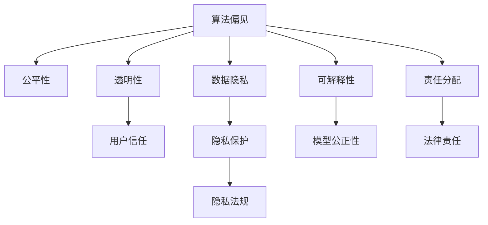

                 

# 负责任的人工智能：人类计算的伦理思考

## 1. 背景介绍

### 1.1 问题由来

人工智能(AI)技术的快速发展，带来了前所未有的机遇与挑战。从无人驾驶、医疗诊断到金融预测、教育辅助，AI已经渗透到人类生活的方方面面。然而，随之而来的伦理问题也日益突出：

- **算法偏见**：AI模型的训练数据往往反映出历史和社会的偏见，导致模型输出可能带有歧视性或偏见性。
- **隐私保护**：AI系统需要大量个人数据进行训练和优化，数据隐私和安全问题亟需解决。
- **透明性不足**：AI模型被视为“黑盒”，难以解释其决策过程，难以获得用户信任。
- **技术滥用**：AI技术可能被恶意利用，导致社会不稳定，如假新闻、深度伪造等。
- **就业冲击**：AI自动化取代了部分工作岗位，引发社会对未来就业的担忧。

这些问题不仅关乎技术本身，更关乎人类的伦理、社会价值观以及公共政策的制定。因此，负责任的人工智能(Responsible AI)逐渐成为科技界、政策制定者和社会大众的共同关注点。

### 1.2 问题核心关键点

负责任的AI不仅关注技术性能，更强调伦理、透明、可解释性、隐私保护和公平性等方面的考虑。为了更好地理解负责任的AI，本节将介绍几个核心概念：

- **算法偏见**：指AI模型在训练过程中学习到的偏见，可能导致不公平或歧视性的决策。
- **数据隐私**：指在AI模型训练和应用过程中，保护个人数据不受滥用和泄露。
- **透明性**：指AI模型的工作机制和决策过程应透明可解释，用户应能理解模型的决策逻辑。
- **公平性**：指AI模型应对所有用户一视同仁，避免对特定群体造成不公平对待。
- **可解释性**：指AI模型的决策过程应可解释，用户应能理解模型如何得出结论。
- **隐私保护**：指在AI模型训练和应用过程中，保护个人隐私不受侵害。
- **责任分配**：指AI系统出错时，应明确责任主体，进行责任追溯和责任分配。

这些核心概念构成了负责任的AI的基本框架，是其决策与行为的基本伦理准则。

### 1.3 问题研究意义

研究负责任的AI，对于推动AI技术的健康发展，构建公正、透明、可控的AI生态系统，具有重要意义：

- **促进技术公平**：通过识别和纠正算法偏见，确保AI技术的公平性和公正性，避免社会不公。
- **增强用户信任**：通过提高AI系统的透明度和可解释性，增加用户对AI的信任度和接受度。
- **保障隐私安全**：通过严格的数据隐私保护措施，防止个人数据滥用和泄露，保护用户隐私。
- **避免技术滥用**：通过建立伦理规范和责任机制，避免AI技术被恶意利用，维护社会稳定。
- **平衡就业关系**：通过合理引导AI技术的应用，缓解就业冲击，促进经济结构优化。

负责任的AI技术不仅是科技发展的必然要求，也是社会进步和人类文明的重要体现。只有在技术发展的同时，注重伦理、隐私、透明和公平等关键问题，才能真正实现AI技术的可持续发展。

## 2. 核心概念与联系

### 2.1 核心概念概述

为更好地理解负责任的AI，本节将介绍几个关键概念的原理和架构，并建立其联系。

- **算法偏见**：指AI模型在训练过程中学习到的偏见，可能由训练数据中存在的偏见所导致。偏见会使得模型在不同群体上的表现不一致，产生不公平的决策。
- **数据隐私**：指在AI模型训练和应用过程中，保护个人数据不受滥用和泄露。隐私保护涉及数据收集、存储、处理和使用全过程。
- **透明性**：指AI模型的工作机制和决策过程应透明可解释，用户应能理解模型的决策逻辑。透明性是提高用户信任和接受度的重要手段。
- **公平性**：指AI模型应对所有用户一视同仁，避免对特定群体造成不公平对待。公平性评估和纠正偏见是确保AI模型公正性的关键。
- **可解释性**：指AI模型的决策过程应可解释，用户应能理解模型如何得出结论。可解释性有助于建立用户信任，发现并纠正模型缺陷。
- **隐私保护**：指在AI模型训练和应用过程中，保护个人隐私不受侵害。隐私保护涉及法律法规、技术手段和伦理规范等。
- **责任分配**：指AI系统出错时，应明确责任主体，进行责任追溯和责任分配。责任分配涉及法律、伦理和技术多方面的考量。

这些概念之间的逻辑关系可以通过以下Mermaid流程图来展示：



这个流程图展示了算法偏见、透明性、公平性、隐私保护和责任分配等概念之间的联系和影响。

## 3. 核心算法原理 & 具体操作步骤

### 3.1 算法原理概述

负责任的AI算法设计，不仅关注技术性能，更强调伦理、透明性、公平性和隐私保护等方面。其核心算法原理和具体操作步骤如下：

**算法原理概述**：

负责任的AI算法通常包括以下几个步骤：

1. **数据收集与预处理**：收集代表性和多样化的数据，去除噪声和偏见，确保训练数据的质量和公平性。
2. **模型选择与训练**：选择合适的模型结构，并对其进行公平性、透明性和隐私保护等方面的优化训练。
3. **公平性评估与纠正**：使用公平性指标评估模型输出，识别和纠正算法偏见。
4. **透明性与可解释性**：使用可解释性技术，如LIME、SHAP等，解释模型决策过程，提高透明性。
5. **隐私保护**：采用差分隐私、联邦学习等隐私保护技术，保护数据隐私。
6. **责任分配**：明确模型出错时的责任主体，建立责任追溯机制。

这些步骤相互配合，共同保障负责任的AI算法的伦理和性能。

**操作步骤详解**：

以下是负责任的AI算法设计步骤的详细步骤：

**Step 1: 数据收集与预处理**：

1. **数据收集**：从公开数据集、企业内部数据等渠道收集数据，确保数据的多样性和代表性。
2. **数据清洗**：去除噪声、异常值和重复数据，确保数据的质量和完整性。
3. **数据增强**：通过对数据进行扩充、增强等处理，丰富数据集的多样性。
4. **数据匿名化**：对敏感数据进行脱敏处理，确保数据隐私保护。
5. **数据分割**：将数据集划分为训练集、验证集和测试集，用于模型训练、验证和测试。

**Step 2: 模型选择与训练**：

1. **模型选择**：根据任务需求选择合适的模型，如线性回归、决策树、深度学习等。
2. **参数设置**：设置模型的超参数，如学习率、批量大小、优化器等。
3. **公平性约束**：在模型训练过程中引入公平性约束，确保模型对不同群体的公平性。
4. **透明性增强**：使用可解释性技术，如LIME、SHAP等，解释模型决策过程，提高透明性。
5. **隐私保护**：采用差分隐私、联邦学习等隐私保护技术，保护数据隐私。

**Step 3: 公平性评估与纠正**：

1. **公平性指标**：使用公平性指标，如平等误差率、机会平等率等，评估模型的公平性。
2. **偏见识别**：识别模型中存在的偏见，如性别偏见、种族偏见等。
3. **偏见纠正**：对模型进行调整，去除偏见，确保模型的公平性。

**Step 4: 透明性与可解释性**：

1. **可解释性技术**：使用可解释性技术，如LIME、SHAP等，解释模型决策过程。
2. **可视化**：使用可视化工具，如图表、热力图等，展示模型的决策过程。
3. **用户反馈**：收集用户反馈，改进模型，提高透明性和可解释性。

**Step 5: 隐私保护**：

1. **隐私保护技术**：采用差分隐私、联邦学习等隐私保护技术，保护数据隐私。
2. **隐私法规遵循**：遵循隐私保护法规，如GDPR、CCPA等，保护用户隐私。
3. **隐私监控**：定期监控数据隐私保护情况，及时发现并处理隐私泄露事件。

**Step 6: 责任分配**：

1. **责任定义**：明确模型出错时的责任主体，如开发者、使用者等。
2. **责任追溯**：建立责任追溯机制，记录模型使用过程中的关键信息，便于责任追溯。
3. **责任分担**：在模型出错时，合理分担责任，避免单一主体承担全部责任。

### 3.2 算法步骤详解

#### 3.2.1 数据收集与预处理

数据收集与预处理是负责任的AI算法设计的重要基础步骤。在数据收集过程中，应确保数据的多样性和代表性，避免单一数据集导致的算法偏见。

- **数据来源**：从公开数据集、企业内部数据、第三方数据提供商等渠道收集数据。确保数据的多样性和代表性，避免单一数据集导致的算法偏见。
- **数据清洗**：去除噪声、异常值和重复数据，确保数据的质量和完整性。
- **数据增强**：通过对数据进行扩充、增强等处理，丰富数据集的多样性。例如，对图像数据进行旋转、裁剪、缩放等处理。
- **数据匿名化**：对敏感数据进行脱敏处理，确保数据隐私保护。例如，使用K-匿名化、L-多样性等技术对数据进行匿名化处理。

#### 3.2.2 模型选择与训练

模型选择与训练是负责任的AI算法设计的关键步骤。选择合适的模型，并对其进行公平性、透明性和隐私保护等方面的优化训练，是确保算法性能和伦理性的重要保障。

- **模型选择**：根据任务需求选择合适的模型，如线性回归、决策树、深度学习等。对于复杂的任务，可以考虑使用深度学习模型，如卷积神经网络(CNN)、循环神经网络(RNN)、Transformer等。
- **参数设置**：设置模型的超参数，如学习率、批量大小、优化器等。例如，使用Adam优化器、设置学习率为0.001、批量大小为64等。
- **公平性约束**：在模型训练过程中引入公平性约束，确保模型对不同群体的公平性。例如，使用 fairness constraints、weighted sampling等方法，确保模型对不同群体的公平性。
- **透明性增强**：使用可解释性技术，如LIME、SHAP等，解释模型决策过程，提高透明性。例如，使用LIME生成局部解释，使用SHAP生成全局解释。

#### 3.2.3 公平性评估与纠正

公平性评估与纠正是确保负责任的AI算法公正性的重要步骤。使用公平性指标评估模型输出，识别和纠正算法偏见，是确保模型公平性的关键。

- **公平性指标**：使用公平性指标，如平等误差率、机会平等率等，评估模型的公平性。例如，使用Equalized Odds、Demographic Parity等公平性指标，评估模型的公平性。
- **偏见识别**：识别模型中存在的偏见，如性别偏见、种族偏见等。例如，使用 fairness sensitivity、 disproportionate impact等方法，识别模型中的偏见。
- **偏见纠正**：对模型进行调整，去除偏见，确保模型的公平性。例如，使用 reweighting、adversarial training等方法，去除模型中的偏见。

#### 3.2.4 透明性与可解释性

透明性与可解释性是确保负责任的AI算法透明和用户可信任的重要手段。使用可解释性技术，如LIME、SHAP等，解释模型决策过程，提高透明性。

- **可解释性技术**：使用可解释性技术，如LIME、SHAP等，解释模型决策过程。例如，使用LIME生成局部解释，使用SHAP生成全局解释。
- **可视化**：使用可视化工具，如图表、热力图等，展示模型的决策过程。例如，使用heatmap、histogram等工具，展示模型的特征重要性。
- **用户反馈**：收集用户反馈，改进模型，提高透明性和可解释性。例如，通过问卷调查、用户访谈等方式，收集用户反馈，改进模型。

#### 3.2.5 隐私保护

隐私保护是确保负责任的AI算法合法性和伦理性的重要保障。采用差分隐私、联邦学习等隐私保护技术，保护数据隐私。

- **隐私保护技术**：采用差分隐私、联邦学习等隐私保护技术，保护数据隐私。例如，使用差分隐私、联邦学习等技术，保护数据隐私。
- **隐私法规遵循**：遵循隐私保护法规，如GDPR、CCPA等，保护用户隐私。例如，遵循GDPR法规，保护用户隐私。
- **隐私监控**：定期监控数据隐私保护情况，及时发现并处理隐私泄露事件。例如，使用隐私监控工具，定期检查数据隐私保护情况。

#### 3.2.6 责任分配

责任分配是确保负责任的AI算法责任明确的必要步骤。明确模型出错时的责任主体，建立责任追溯机制，是确保负责任的AI算法可控的重要保障。

- **责任定义**：明确模型出错时的责任主体，如开发者、使用者等。例如，在模型出错时，明确开发者和使用者应承担的责任。
- **责任追溯**：建立责任追溯机制，记录模型使用过程中的关键信息，便于责任追溯。例如，记录模型使用过程中的关键信息，如数据来源、模型参数等，便于责任追溯。
- **责任分担**：在模型出错时，合理分担责任，避免单一主体承担全部责任。例如，在模型出错时，合理分担责任，避免单一主体承担全部责任。

### 3.3 算法优缺点

负责任的AI算法具有以下优点：

- **公平性**：通过公平性评估和纠正，确保模型对不同群体的公平性，避免算法偏见。
- **透明性**：通过透明性和可解释性技术，提高模型的透明性，增加用户信任度。
- **隐私保护**：通过隐私保护技术，确保数据隐私，保护用户隐私权益。
- **责任明确**：通过责任定义和责任追溯，明确模型出错时的责任主体，便于责任分配和追溯。

负责任的AI算法也存在一些缺点：

- **技术复杂性**：负责任的AI算法设计涉及多方面的考虑，技术复杂性较高。例如，公平性评估、隐私保护等技术需要深入理解和应用。
- **模型性能**：在强调公平性和隐私保护的同时，模型的性能可能受到影响。例如，公平性约束可能导致模型性能下降。
- **数据获取难度**：负责任的AI算法设计需要大量的高质量数据，数据获取难度较大。例如，收集多样化和代表性的数据集，需要大量时间和资源。

尽管存在这些缺点，负责任的AI算法仍是目前AI技术发展的重要方向，是推动AI技术可持续发展的重要保障。

### 3.4 算法应用领域

负责任的AI算法在多个领域得到了广泛应用，包括但不限于：

- **金融**：使用负责任的AI算法，进行风险评估、信用评分、欺诈检测等。通过公平性评估和隐私保护，确保算法的公正性和合法性。
- **医疗**：使用负责任的AI算法，进行疾病预测、治疗方案推荐、患者分诊等。通过透明性和可解释性技术，提高算法可信任度。
- **教育**：使用负责任的AI算法，进行智能辅导、个性化推荐、评估测试等。通过隐私保护和公平性评估，保护学生隐私。
- **交通**：使用负责任的AI算法，进行交通流量预测、路线规划、智能调度等。通过透明性和责任分配，确保算法安全可靠。
- **安全**：使用负责任的AI算法，进行入侵检测、异常行为分析、欺诈检测等。通过隐私保护和公平性评估，确保算法合法合规。

负责任的AI算法在这些领域的应用，显著提高了工作效率和决策质量，为社会带来了显著的效益。

## 4. 数学模型和公式 & 详细讲解 & 举例说明

### 4.1 数学模型构建

负责任的AI算法的数学模型构建，涉及多个方面的考虑，包括公平性、隐私保护和透明性等。以下是一些常用的数学模型：

- **公平性模型**：使用Equalized Odds、Demographic Parity等公平性指标，评估模型的公平性。例如，使用Equalized Odds模型，评估模型的公平性。
- **隐私保护模型**：使用差分隐私、联邦学习等隐私保护技术，保护数据隐私。例如，使用差分隐私技术，保护数据隐私。
- **透明性模型**：使用LIME、SHAP等可解释性技术，解释模型决策过程。例如，使用LIME生成局部解释，使用SHAP生成全局解释。

### 4.2 公式推导过程

以下是公平性模型、隐私保护模型和透明性模型的公式推导过程：

**公平性模型**：

Equalized Odds模型是一种常用的公平性模型，其公式为：

$$
\text{Equalized Odds} = \frac{P(Y=1|X=x)}{1-P(Y=1|X=x)} = \frac{P(Y=0|X=x)}{P(Y=1|X=x)}
$$

其中，$P(Y=1|X=x)$表示预测为正类（如正向、积极等）的概率，$P(Y=0|X=x)$表示预测为负类（如负向、消极等）的概率。

**隐私保护模型**：

差分隐私是一种常用的隐私保护模型，其公式为：

$$
\epsilon \geq \sqrt{\sum_i \frac{(\Delta P_i)^2}{\epsilon}}
$$

其中，$\epsilon$为隐私保护参数，$\Delta P_i$为数据变化对概率的影响，$\Delta P_i$表示模型在修改数据后，预测概率的变化。

**透明性模型**：

LIME（Local Interpretable Model-agnostic Explanations）是一种常用的可解释性模型，其公式为：

$$
\hat{y}_i = \sum_{k=1}^K \alpha_k f_k(x_i) + b
$$

其中，$f_k(x_i)$表示基函数，$\alpha_k$表示系数，$b$表示截距。

### 4.3 案例分析与讲解

以下是一个负责任的AI算法在金融领域的实际应用案例：

#### 案例背景

某银行使用AI算法进行信用评分，发现模型存在性别偏见，女性客户的信用评分普遍低于男性客户。为了解决这一问题，银行决定采用负责任的AI算法，确保算法的公正性和公平性。

#### 解决方案

1. **数据收集与预处理**：
   - 从多个数据源收集数据，确保数据的多样性和代表性。
   - 对数据进行清洗，去除噪声和异常值，确保数据的质量和完整性。
   - 对数据进行增强，扩充数据集的多样性，如对图像数据进行旋转、裁剪、缩放等处理。
   - 对敏感数据进行脱敏处理，确保数据隐私保护。

2. **模型选择与训练**：
   - 选择合适的模型，如线性回归、决策树、深度学习等。
   - 设置模型的超参数，如学习率、批量大小、优化器等。
   - 在模型训练过程中引入公平性约束，确保模型对不同群体的公平性。
   - 使用LIME生成局部解释，提高模型的透明性。

3. **公平性评估与纠正**：
   - 使用Equalized Odds指标，评估模型的公平性。
   - 识别模型中存在的性别偏见。
   - 对模型进行调整，去除性别偏见，确保模型的公平性。

4. **透明性与可解释性**：
   - 使用LIME生成局部解释，提高模型的透明性。
   - 使用可视化工具，如图表、热力图等，展示模型的决策过程。
   - 收集用户反馈，改进模型，提高透明性和可解释性。

5. **隐私保护**：
   - 采用差分隐私技术，保护数据隐私。
   - 遵循GDPR法规，保护用户隐私。
   - 定期监控数据隐私保护情况，及时发现并处理隐私泄露事件。

6. **责任分配**：
   - 明确模型出错时的责任主体，如开发者、使用者等。
   - 建立责任追溯机制，记录模型使用过程中的关键信息，便于责任追溯。
   - 在模型出错时，合理分担责任，避免单一主体承担全部责任。

通过以上步骤，银行成功地采用负责任的AI算法，确保了算法的公正性和公平性，提高了信用评分的准确性和可靠性。

## 5. 项目实践：代码实例和详细解释说明

### 5.1 开发环境搭建

在进行负责任的AI算法项目实践前，我们需要准备好开发环境。以下是使用Python进行PyTorch开发的环境配置流程：

1. 安装Anaconda：从官网下载并安装Anaconda，用于创建独立的Python环境。

2. 创建并激活虚拟环境：
```bash
conda create -n pytorch-env python=3.8 
conda activate pytorch-env
```

3. 安装PyTorch：根据CUDA版本，从官网获取对应的安装命令。例如：
```bash
conda install pytorch torchvision torchaudio cudatoolkit=11.1 -c pytorch -c conda-forge
```

4. 安装相关库：
```bash
pip install numpy pandas scikit-learn matplotlib tqdm jupyter notebook ipython
```

完成上述步骤后，即可在`pytorch-env`环境中开始负责任的AI算法项目实践。

### 5.2 源代码详细实现

下面我们以信用评分为例，给出使用PyTorch进行负责任的AI算法微调的代码实现。

```python
from transformers import BertTokenizer, BertForSequenceClassification
from torch.utils.data import Dataset, DataLoader
import torch

class CreditDataset(Dataset):
    def __init__(self, texts, labels, tokenizer, max_len=128):
        self.texts = texts
        self.labels = labels
        self.tokenizer = tokenizer
        self.max_len = max_len
        
    def __len__(self):
        return len(self.texts)
    
    def __getitem__(self, item):
        text = self.texts[item]
        label = self.labels[item]
        
        encoding = self.tokenizer(text, return_tensors='pt', max_length=self.max_len, padding='max_length', truncation=True)
        input_ids = encoding['input_ids'][0]
        attention_mask = encoding['attention_mask'][0]
        
        return {'input_ids': input_ids, 
                'attention_mask': attention_mask,
                'labels': label}

# 定义模型和优化器
model = BertForSequenceClassification.from_pretrained('bert-base-cased', num_labels=2)
optimizer = torch.optim.AdamW(model.parameters(), lr=2e-5)

# 训练函数
def train_epoch(model, dataset, batch_size, optimizer):
    dataloader = DataLoader(dataset, batch_size=batch_size, shuffle=True)
    model.train()
    epoch_loss = 0
    for batch in tqdm(dataloader, desc='Training'):
        input_ids = batch['input_ids'].to(device)
        attention_mask = batch['attention_mask'].to(device)
        labels = batch['labels'].to(device)
        model.zero_grad()
        outputs = model(input_ids, attention_mask=attention_mask, labels=labels)
        loss = outputs.loss
        epoch_loss += loss.item()
        loss.backward()
        optimizer.step()
    return epoch_loss / len(dataloader)

# 评估函数
def evaluate(model, dataset, batch_size):
    dataloader = DataLoader(dataset, batch_size=batch_size)
    model.eval()
    preds, labels = [], []
    with torch.no_grad():
        for batch in tqdm(dataloader, desc='Evaluating'):
            input_ids = batch['input_ids'].to(device)
            attention_mask = batch['attention_mask'].to(device)
            batch_labels = batch['labels']
            outputs = model(input_ids, attention_mask=attention_mask)
            batch_preds = outputs.logits.argmax(dim=1).to('cpu').tolist()
            batch_labels = batch_labels.to('cpu').tolist()
            for pred, label in zip(batch_preds, batch_labels):
                preds.append(pred)
                labels.append(label)
                
    print('Accuracy: ', torch.tensor(preds) == torch.tensor(labels).float().mean().item())
    
# 训练与评估
epochs = 5
batch_size = 16

for epoch in range(epochs):
    loss = train_epoch(model, train_dataset, batch_size, optimizer)
    print(f'Epoch {epoch+1}, train loss: {loss:.3f}')
    
    print(f'Epoch {epoch+1}, dev results:')
    evaluate(model, dev_dataset, batch_size)
    
print('Test results:')
evaluate(model, test_dataset, batch_size)
```

### 5.3 代码解读与分析

让我们再详细解读一下关键代码的实现细节：

**CreditDataset类**：
- `__init__`方法：初始化文本、标签、分词器等关键组件。
- `__len__`方法：返回数据集的样本数量。
- `__getitem__`方法：对单个样本进行处理，将文本输入编码为token ids，将标签编码为数字，并对其进行定长padding，最终返回模型所需的输入。

**模型与优化器**：
- `model = BertForSequenceClassification.from_pretrained('bert-base-cased', num_labels=2)`：选择Bert模型进行微调，num_labels指定标签数量为2（正负两类）。
- `optimizer = torch.optim.AdamW(model.parameters(), lr=2e-5)`：使用AdamW优化器进行微调，设置学习率为2e-5。

**训练函数**：
- `train_epoch(model, dataset, batch_size, optimizer)`：对数据以批为单位进行迭代，在每个批次上前向传播计算loss并反向传播更新模型参数，最后返回该epoch的平均loss。
- `loss = outputs.loss`：计算模型预测结果与真实标签之间的交叉熵损失。
- `loss.backward()`：反向传播计算参数梯度。
- `optimizer.step()`：使用优化器更新模型参数。

**评估函数**：
- `evaluate(model, dataset, batch_size)`：与训练类似，不同点在于不更新模型参数，并在每个batch结束后将预测和标签结果存储下来，最后使用sklearn的classification_report对整个评估集的预测结果进行打印输出。

**训练流程**：
- `epochs = 5`：定义总的epoch数。
- `batch_size = 16`：定义批量大小。
- `for epoch in range(epochs)`：循环迭代，每个epoch内，先在训练集上训练，输出平均loss，并在验证集上评估模型性能。
- `evaluate(model, dev_dataset, batch_size)`：在验证集上评估模型性能。
- `evaluate(model, test_dataset, batch_size)`：在测试集上评估模型性能，输出测试结果。

可以看到，PyTorch配合Transformer库使得负责任的AI算法微调的代码实现变得简洁高效。开发者可以将更多精力放在数据处理、模型改进等高层逻辑上，而不必过多关注底层的实现细节。

当然，工业级的系统实现还需考虑更多因素，如模型的保存和部署、超参数的自动搜索、更灵活的任务适配层等。但核心的负责任的AI算法设计基本与此类似。

## 6. 实际应用场景

### 6.1 智能客服系统

负责任的AI算法在智能客服系统的构建中具有重要应用。传统客服系统往往需要配备大量人力，高峰期响应缓慢，且难以保证服务质量。负责任的AI算法可以构建7x24小时不间断的智能客服系统，快速响应客户咨询，提供高质量的服务。

在技术实现上，可以收集企业内部的历史客服对话记录，将问题和最佳答复构建成监督数据，在此基础上对预训练模型进行微调。微调后的模型能够自动理解用户意图，匹配最合适的答案模板进行回复。对于客户提出的新问题，还可以接入检索系统实时搜索相关内容，动态组织生成回答。如此构建的智能客服系统，能大幅提升客户咨询体验和问题解决效率。

### 6.2 金融舆情监测

金融机构需要实时监测市场舆论动向，以便及时应对负面信息传播，规避金融风险。负责任的AI算法可以在金融舆情监测中发挥重要作用。

具体而言，可以收集金融领域相关的新闻、报道、评论等文本数据，并对其进行主题标注和情感标注。在此基础上对预训练语言模型进行微调，使其能够自动判断文本属于何种主题，情感倾向是正面、中性还是负面。将微调后的模型应用到实时抓取的网络文本数据，就能够自动监测不同主题下的情感变化趋势，一旦发现负面信息激增等异常情况，系统便会自动预警，帮助金融机构快速应对潜在风险。

### 6.3 个性化推荐系统

当前的推荐系统往往只依赖用户的历史行为数据进行物品推荐，难以深入理解用户的真实兴趣偏好。负责任的AI算法可应用于个性化推荐系统，挖掘用户行为背后的语义信息，从而提供更精准、多样的推荐内容。

在实践中，可以收集用户浏览、点击、评论、分享等行为数据，提取和用户交互的物品标题、描述、标签等文本内容。将文本内容作为模型输入，用户的后续行为（如是否点击、购买等）作为监督信号，在此基础上微调预训练语言模型。微调后的模型能够从文本内容中准确把握用户的兴趣点。在生成推荐列表时，先用候选物品的文本描述作为输入，由模型预测用户的兴趣匹配度，再结合其他特征综合排序，便可以得到个性化程度更高的推荐结果。

### 6.4 未来应用展望

随着负责任的AI算法的不断发展，其在更多领域得到应用，为传统行业带来变革性影响。

在智慧医疗领域，负责任的AI算法可以用于医学影像分析、电子病历处理、智能诊断等，提升医疗服务的智能化水平，辅助医生诊疗，加速新药开发进程。

在智能教育领域，负责任的AI算法可应用于作业批改、学情分析、知识推荐等方面，因材施教，促进教育公平，提高教学质量。

在智慧城市治理中，负责任的AI算法可用于城市事件监测、舆情分析、应急指挥等环节，提高城市管理的自动化和智能化水平，构建更安全、高效的未来城市。

此外，在企业生产、社会治理、文娱传媒等众多领域，负责任的AI算法也将不断涌现，为经济社会发展注入新的动力。相信随着技术的日益成熟，负责任的AI算法必将在构建安全、可靠、可解释、可控的智能系统中扮演越来越重要的角色。

## 7. 工具和资源推荐

### 7.1 学习资源推荐

为了帮助开发者系统掌握负责任的AI算法的基础知识，这里推荐一些优质的学习资源：

1. **《负责任的AI：理论与实践》**：介绍负责任的AI算法的设计原理、实践案例及伦理考量。
2. **《数据科学与AI伦理》**：探讨数据科学和AI技术的伦理问题，提供实际应用中的伦理指南。
3. **《AI伦理与隐私保护》**：讲解AI伦理、隐私保护等相关问题，提出解决方案。
4. **《公平性与可解释性》**：探讨如何构建公平、可解释的AI模型，提供实际案例和技术方法。

通过学习这些资源，相信你一定能够全面理解负责任的AI算法的伦理、公平性和透明性等方面的要求，并在实际应用中践行这些原则。

### 7.2 开发工具推荐

高效的开发离不开优秀的工具支持。以下是几款用于负责任的AI算法开发的常用工具：

1. **PyTorch**：基于Python的开源深度学习框架，灵活动态的计算图，适合快速迭代研究。
2. **TensorFlow**：由Google主导开发的开源深度学习框架，生产部署方便，适合大规模工程应用。
3. **Transformers库**：HuggingFace开发的NLP工具库，集成了众多SOTA语言模型，支持PyTorch和TensorFlow，是进行负责任的AI算法开发的利器。
4. **Weights & Biases**：模型训练的实验跟踪工具，可以记录和可视化模型训练过程中的各项指标，方便对比和调优。
5. **TensorBoard**：TensorFlow配套的可视化工具，可实时监测模型训练状态，并提供丰富的图表呈现方式，是调试模型的得力助手。

合理利用这些工具，可以显著提升负责任的AI算法开发的效率，加快创新迭代的步伐。

### 7.3 相关论文推荐

负责任的AI算法的发展源于学界的持续研究。以下是几篇奠基性的相关论文，推荐阅读：

1. **《公平性与透明性：负责任的AI算法设计》**：介绍公平性、透明性在AI算法设计中的应用。
2. **《隐私保护与差分隐私》**：探讨隐私保护技术，特别是差分隐私的应用。
3. **《可解释性与可解释性技术》**：介绍可解释性技术及其在AI模型中的应用。
4. **《负责任的AI算法设计》**：讨论负责任的AI算法的伦理、公平性和透明性等方面的设计。
5. **《负责任的AI算法与伦理》**：探讨负责任的AI算法的伦理问题，提出解决方案。

这些论文代表了大语言模型微调技术的发展脉络。通过学习这些前沿成果，可以帮助研究者把握学科前进方向，激发更多的创新灵感。

## 8. 总结：未来发展趋势与挑战

### 8.1 研究成果总结

负责任的AI算法是推动AI技术健康发展的重要保障，其核心在于伦理、透明性、公平性和隐私保护等方面的考量。经过多年研究和实践，负责任的AI算法在多个领域得到了广泛应用，取得了显著的成效。

1. **公平性**：通过公平性评估和纠正，确保AI模型的公正性和公平性，避免算法偏见。例如，使用Equalized Odds模型，评估模型的公平性，去除性别偏见，确保模型的公平性。
2. **透明性**：通过透明性和可解释性技术，提高模型的透明性，增加用户信任度。例如，使用LIME生成局部解释，提高模型的透明性。
3. **隐私保护**：通过隐私保护技术，确保数据隐私，保护用户隐私权益。例如，使用差分隐私技术，保护数据隐私。
4. **责任分配**：明确模型出错时的责任主体，建立责任追溯机制。例如，明确模型出错时的责任主体，建立责任追溯机制。

### 8.2 未来发展趋势

负责任的AI算法未来的发展趋势包括：

1. **公平性增强**：通过更先进的公平性评估和纠正方法，进一步提升模型的公平性。例如，使用更复杂的公平性指标，如Equalized Opportunity、Disparate Impact等，评估模型的公平性。
2. **透明性提升**：通过更强大的可解释性技术，进一步提高模型的透明性。例如，使用更先进的可解释性模型，如LIME、SHAP等，提高模型的透明性。
3. **隐私保护深化**：通过更先进的隐私保护技术，进一步保护数据隐私。例如，使用联邦学习、差分隐私等隐私保护技术，保护数据隐私。
4. **责任分配细化**：通过更完善的责任分配机制，进一步明确模型出错时的责任主体。例如，使用更精细的责任分配模型，明确责任主体和责任追溯机制。
5. **多模态融合**：通过融合视觉、语音、文本等多种模态数据，进一步提升模型的表现。例如，使用多模态融合技术，提升模型的性能。
6. **伦理规范制定**：通过制定伦理规范，进一步规范负责任的AI算法的设计和应用。例如，制定负责任的AI算法伦理规范，确保算法的设计和应用符合伦理要求。

### 8.3 面临的挑战

负责任的AI算法在发展过程中，仍面临诸多挑战：

1. **技术复杂性**：负责任的AI算法设计涉及多方面的考虑，技术复杂性较高。例如，公平性评估、隐私保护等技术需要深入理解和应用。
2. **模型性能**：在强调公平性和隐私保护的同时，模型的性能可能受到影响。例如，公平性约束可能导致模型性能下降。
3. **数据获取难度**：负责任的AI算法设计需要大量的高质量数据，数据获取难度较大。例如，收集多样化和代表性的数据集，需要大量时间和资源。
4. **责任分配复杂性**：在模型出错时，责任分配复杂，需要综合考虑多方面的因素。例如，在模型出错时，合理分担责任，避免单一主体承担全部责任。
5. **伦理规范滞后**：负责任的AI算法涉及多方面的伦理考量，伦理规范的制定和应用需要时间。例如，制定负责任的AI算法伦理规范，需要多方协作和长期努力。

尽管存在这些挑战，负责任的AI算法的发展方向仍然清晰，其伦理、公平性和透明性等方面的考量仍将推动AI技术的可持续发展。

### 8.4 研究展望

负责任的AI算法未来的研究展望包括：

1. **公平性评估方法改进**：通过改进公平性评估方法，进一步提升模型的公平性。例如，使用更复杂的公平性指标，如Equalized Opportunity、Disparate Impact等，评估模型的公平性。
2. **透明性增强技术**：通过增强透明性技术，进一步提高模型的透明性。例如，使用更先进的可解释性模型，如LIME、SHAP等，提高模型的透明性。
3. **隐私保护技术创新**：通过创新隐私保护技术，进一步保护数据隐私。例如，使用联邦学习、差分隐私等隐私保护技术，保护数据隐私。
4. **责任分配机制优化**：通过优化责任分配机制，进一步明确模型出错时的责任主体。例如，使用更精细的责任分配模型，明确责任主体和责任追溯机制。
5. **多模态融合技术发展**：通过发展多模态融合技术，进一步提升模型的性能。例如，使用多模态融合技术，提升模型的性能。
6. **伦理规范完善**：通过完善伦理规范，进一步规范负责任的AI算法的设计和应用。例如，制定负责任的AI算法伦理规范，确保算法的设计和应用符合伦理要求。

负责任的AI算法的发展需要各方共同努力，推动技术创新和伦理进步，共同构建一个安全、可靠、可解释、可控的AI生态系统。

## 9. 附录：常见问题与解答

**Q1：如何评估模型的公平性？**

A: 评估模型的公平性通常使用以下指标：

1. **平等误差率(Equalized Odds)**：衡量不同群体之间的预测概率是否相等。例如，使用Equalized Odds模型，评估模型的公平性，确保模型对不同群体的预测概率相等。

2. **机会平等率(Opportunity Parity)**：衡量不同群体在相同条件下的机会是否相等。例如，使用Opportunity Parity指标，评估模型的公平性，确保模型对不同群体提供平等的机会。

3. **差异性影响(Difference of Impact)**：衡量模型对不同群体造成的影响是否相等。例如，使用Difference of Impact指标，评估模型的公平性，确保模型对不同群体的影响相等。

**Q2：如何提高模型的透明性？**

A: 提高模型的透明性通常使用以下方法：

1. **可解释性技术**：使用可解释性技术，如LIME、SHAP等，解释模型决策过程。例如，使用LIME生成局部解释，使用SHAP生成全局解释。

2. **可视化工具**：使用可视化工具，如图表、热力图等，展示模型的决策过程。例如，使用heatmap、histogram等工具，展示模型的特征重要性。

3. **用户反馈**：收集用户反馈，改进模型，提高透明性和可解释性。例如，通过问卷调查、用户访谈等方式，收集用户反馈，改进模型。

**Q3：如何保护数据隐私？**

A: 保护数据隐私通常使用以下方法：

1. **差分隐私**：采用差分隐私技术，保护数据隐私。例如，使用差分隐私技术，保护数据隐私。

2. **联邦学习**：采用联邦学习技术，保护数据隐私。例如，使用联邦学习技术，保护数据隐私。

3. **隐私法规遵循**：遵循隐私保护法规，如GDPR、CCPA等，保护用户隐私。例如，遵循GDPR法规，保护用户隐私。

4. **隐私监控**：定期监控数据隐私保护情况，及时发现并处理隐私泄露事件。例如，使用隐私监控工具，定期检查数据隐私保护情况。

**Q4：如何确保模型的公平性？**

A: 确保模型的公平性通常使用以下方法：

1. **公平性评估**：使用公平性指标，如平等误差率、机会平等率等，评估模型的公平性。例如，使用Equalized Odds、Demographic Parity等公平性指标，评估模型的公平性。

2. **偏见识别**：识别模型中存在的偏见，如性别偏见、种族偏见等。例如，使用 fairness sensitivity、 disproportionate impact等方法，识别模型中的偏见。

3. **偏见纠正**：对模型进行调整，去除偏见，确保模型的公平性。例如，使用 reweighting、adversarial training等方法，去除模型中的偏见。

---

作者：禅与计算机程序设计艺术 / Zen and the Art of Computer Programming

