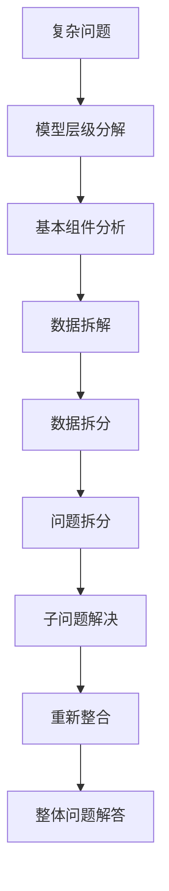

                 

# 费曼提问法:深度学习的利器

## 1. 背景介绍

费曼提问法（Richard Feynman's Method of Questioning）是一种经典的科学学习方法，由诺贝尔奖获得者理查德·费曼（Richard Feynman）提出。费曼提问法通过将复杂问题分解为简单问题，逐一攻破，以达到深刻理解和掌握知识的目的。该方法被广泛应用于各个领域，并在科学、教育、技术等方向展现出卓越的潜力。

在深度学习领域，复杂模型和庞大的数据集对理解和掌握模型的运作机制提出了更高的要求。费曼提问法作为一种有效的方法，通过深刻理解模型的不同层级和组件，可以大幅提高模型的调试效率和效果。本文将详细讨论费曼提问法在深度学习中的具体应用，以及其带来的优势和挑战。

## 2. 核心概念与联系

### 2.1 核心概念概述

费曼提问法的基本原理是通过分解问题、提出简单化的问题，以逐步揭示复杂问题的本质。在深度学习中，这一方法可以应用到模型构建、数据预处理、训练优化、模型评估等多个环节。

具体应用包括但不限于：
- 模型层级分解：将模型拆分为基本组成部分，逐一分析和理解各个组件的功能和作用。
- 数据拆解：对数据集进行拆分，以便对数据进行更细粒度的分析和处理。
- 问题拆分：将复杂问题分解为可管理的子问题，逐一解决。

### 2.2 核心概念原理和架构的 Mermaid 流程图



### 2.3 核心概念联系

费曼提问法与深度学习中的模型构建、训练和优化等环节紧密相连，通过系统性地提出和解决简单化问题，帮助研究者深入理解模型的内部运作机制，从而优化模型，提升性能。

## 3. 核心算法原理 & 具体操作步骤

### 3.1 算法原理概述

费曼提问法的核心在于通过分解问题，逐步简化和精化复杂问题，从而揭示问题的本质。在深度学习中，这一原理可以应用到模型的不同层级和组件上，通过理解和优化每个层级的功能，最终提升整体模型的性能。

### 3.2 算法步骤详解

费曼提问法的深度学习应用主要分为以下几个步骤：

**Step 1: 确定模型层级和组件**

首先，需要对模型进行层级分解，明确模型中的基本组件及其功能。例如，一个典型的深度学习模型可能包含卷积层、池化层、全连接层等多个组成部分。

**Step 2: 提出和解决简单化的问题**

在确定模型基本组件后，需要提出并解决更细粒度的问题。例如，在卷积层中，可以探讨如何调整卷积核大小和步长以优化特征提取效果。

**Step 3: 分析组件的交互作用**

分析不同组件之间的交互作用，理解其协同工作的机制。例如，卷积层和池化层如何通过协作，提升特征的表示能力。

**Step 4: 数据预处理和增强**

数据预处理和增强是深度学习中一个重要的环节。费曼提问法可以通过提出和解决数据相关的问题，优化数据预处理流程。例如，如何处理数据中的噪声和异常值，如何选择合适的数据增强方式以提升模型泛化能力。

**Step 5: 模型训练和优化**

在数据处理优化后，可以应用费曼提问法进一步优化模型训练和优化过程。例如，探讨如何调整学习率、选择合适的优化器，如何通过正则化技术提高模型的鲁棒性。

**Step 6: 模型评估和部署**

最后，通过费曼提问法对模型进行评估和部署。例如，如何选择合适的评估指标，如何优化模型推理效率以适应实际应用环境。

### 3.3 算法优缺点

费曼提问法在深度学习中的主要优点包括：
1. 促进深度理解：通过逐层分解和精化问题，帮助研究者深入理解模型的每个组件及其相互作用。
2. 提高调试效率：通过系统性地提出和解决问题，提高模型的调试效率。
3. 增强模型泛化能力：通过优化数据预处理和模型训练过程，提升模型的泛化能力。

同时，费曼提问法也存在一些局限性：
1. 步骤繁琐：费曼提问法需要系统地分解和解决问题，步骤较为繁琐。
2. 需要时间：深入理解模型和解决每个问题需要大量的时间和精力。
3. 依赖问题定义：问题的定义是否准确和合理直接影响方法的效果。

### 3.4 算法应用领域

费曼提问法在深度学习的多个领域中都有广泛的应用，包括但不限于：

- 图像识别：通过分解图像识别任务，优化卷积神经网络的结构和超参数设置。
- 自然语言处理：通过分解自然语言处理任务，优化循环神经网络的结构和词向量表示。
- 语音识别：通过分解语音识别任务，优化卷积神经网络的结构和超参数设置。
- 推荐系统：通过分解推荐系统任务，优化神经网络的结构和超参数设置。

## 4. 数学模型和公式 & 详细讲解 & 举例说明

### 4.1 数学模型构建

费曼提问法的数学模型构建主要围绕模型的层级分解和组件分析展开。在深度学习中，模型通常由多个层级组成，每个层级都具有特定的功能。通过层级分解，可以将复杂模型拆分为多个基本组件，从而逐一分析和理解其功能和作用。

### 4.2 公式推导过程

以卷积神经网络（CNN）为例，假设模型的输入为 $x$，输出为 $y$。在卷积层中，通过滑动卷积核对输入进行卷积操作，得到特征图 $h$。公式推导如下：

$$
h = \sigma(W * x + b)
$$

其中，$W$ 为卷积核权重，$b$ 为偏置项，$\sigma$ 为激活函数。通过分析卷积层的输出特征图 $h$，可以深入理解卷积核大小、步长等参数对特征提取的影响。

### 4.3 案例分析与讲解

**案例1: 图像分类**

在图像分类任务中，可以通过费曼提问法逐步分析卷积神经网络的结构和参数。例如，在卷积层中，可以提出以下问题：

- 卷积核大小和步长如何影响特征提取的效果？
- 如何选择合适的激活函数以提升分类性能？
- 如何通过池化层优化特征的表示能力？

通过逐一解答这些问题，可以优化模型结构和参数设置，提升分类效果。

**案例2: 自然语言处理**

在自然语言处理任务中，可以通过分解任务为词汇表示、句法分析、语义理解等子问题，逐一分析和优化各个子问题的处理方式。例如，在BERT模型中，可以提出以下问题：

- 如何优化词嵌入向量以提升模型的语言理解能力？
- 如何通过自监督学习任务训练BERT模型？
- 如何将BERT模型与其他NLP任务进行融合，提升整体性能？

通过逐一解答这些问题，可以优化BERT模型的词汇表示、预训练和应用方式，提升其在多种NLP任务中的表现。

## 5. 项目实践：代码实例和详细解释说明

### 5.1 开发环境搭建

在进行费曼提问法的深度学习实践前，我们需要准备好开发环境。以下是使用Python进行TensorFlow开发的环境配置流程：

1. 安装Anaconda：从官网下载并安装Anaconda，用于创建独立的Python环境。

2. 创建并激活虚拟环境：
```bash
conda create -n tensorflow-env python=3.8 
conda activate tensorflow-env
```

3. 安装TensorFlow：根据CUDA版本，从官网获取对应的安装命令。例如：
```bash
conda install tensorflow tensorflow-gpu=2.5.0 -c tf -c conda-forge
```

4. 安装各类工具包：
```bash
pip install numpy pandas scikit-learn matplotlib tqdm jupyter notebook ipython
```

完成上述步骤后，即可在`tensorflow-env`环境中开始实践。

### 5.2 源代码详细实现

这里我们以图像识别任务为例，给出使用TensorFlow进行卷积神经网络微调的代码实现。

首先，定义卷积神经网络模型：

```python
import tensorflow as tf
from tensorflow.keras import layers

model = tf.keras.Sequential([
    layers.Conv2D(32, (3, 3), activation='relu', input_shape=(28, 28, 1)),
    layers.MaxPooling2D((2, 2)),
    layers.Conv2D(64, (3, 3), activation='relu'),
    layers.MaxPooling2D((2, 2)),
    layers.Flatten(),
    layers.Dense(64, activation='relu'),
    layers.Dense(10)
])
```

然后，定义损失函数和优化器：

```python
model.compile(optimizer='adam', loss=tf.keras.losses.SparseCategoricalCrossentropy(from_logits=True))
```

接着，定义训练和评估函数：

```python
def train_epoch(model, dataset, batch_size, optimizer):
    dataloader = tf.data.Dataset.from_tensor_slices(dataset).shuffle(1000).batch(batch_size).repeat()
    model.fit(dataloader, epochs=5)

def evaluate(model, dataset, batch_size):
    dataloader = tf.data.Dataset.from_tensor_slices(dataset).batch(batch_size)
    predictions = model.predict(dataloader)
    return tf.keras.metrics.top_k_categorical_accuracy(y_true=dataset.labels, y_pred=predictions)
```

最后，启动训练流程并在测试集上评估：

```python
train_epoch(model, train_dataset, batch_size=32, optimizer=optimizer)
test_accuracy = evaluate(model, test_dataset, batch_size=32)
print(f'Test Accuracy: {test_accuracy.numpy() * 100:.2f}%')
```

以上就是使用TensorFlow对卷积神经网络进行图像分类任务微调的完整代码实现。可以看到，得益于TensorFlow的强大封装，我们可以用相对简洁的代码完成卷积神经网络的加载和微调。

### 5.3 代码解读与分析

让我们再详细解读一下关键代码的实现细节：

**Sequential类**：
- 通过Sequential类创建顺序排列的模型，每个层级依次连接。

**Conv2D层**：
- 定义卷积层，参数包括卷积核大小、步长和激活函数。

**MaxPooling2D层**：
- 定义池化层，参数包括池化窗口大小。

**Dense层**：
- 定义全连接层，参数包括神经元数量和激活函数。

**SparseCategoricalCrossentropy损失函数**：
- 定义分类任务常用的损失函数，参数为logits是否需要归一化。

**Adam优化器**：
- 定义常用的优化器，参数包括学习率。

**train_epoch函数**：
- 定义训练函数，参数包括模型、数据集、批大小和优化器。

**evaluate函数**：
- 定义评估函数，参数包括模型和数据集。

**TensorFlow数据集构建**：
- 通过from_tensor_slices方法创建数据集，支持随机打乱、批次处理和重复使用。

可以看到，TensorFlow的封装使得卷积神经网络的微调代码实现变得简洁高效。开发者可以将更多精力放在模型改进、数据处理等高层逻辑上，而不必过多关注底层的实现细节。

当然，工业级的系统实现还需考虑更多因素，如模型的保存和部署、超参数的自动搜索、更灵活的任务适配层等。但核心的微调范式基本与此类似。

## 6. 实际应用场景

### 6.1 智能推荐系统

基于费曼提问法的智能推荐系统，可以通过系统性地分解和优化推荐模型，提升推荐效果。在推荐系统中，通常需要处理用户行为数据、商品特征数据等多个来源的数据，通过费曼提问法，可以逐一分析和优化各个数据源的处理方式，提升模型的泛化能力。

具体而言，可以收集用户浏览、点击、评分等行为数据，分析用户兴趣点；收集商品信息，提取商品特征；通过数据预处理和特征工程，提升模型的预测能力。在推荐模型训练过程中，可以提出以下问题：

- 如何选择合适的特征表示方法？
- 如何优化推荐模型中的损失函数？
- 如何处理数据中的噪声和异常值？

通过逐一解答这些问题，可以优化推荐模型的各个环节，提升推荐效果。

### 6.2 自然语言处理

在自然语言处理任务中，费曼提问法可以通过分解任务为词汇表示、句法分析、语义理解等子问题，逐一分析和优化各个子问题的处理方式。例如，在BERT模型中，可以提出以下问题：

- 如何优化词嵌入向量以提升模型的语言理解能力？
- 如何通过自监督学习任务训练BERT模型？
- 如何将BERT模型与其他NLP任务进行融合，提升整体性能？

通过逐一解答这些问题，可以优化BERT模型的词汇表示、预训练和应用方式，提升其在多种NLP任务中的表现。

### 6.3 计算机视觉

在计算机视觉任务中，费曼提问法可以通过分解任务为图像预处理、特征提取、分类等子问题，逐一分析和优化各个子问题的处理方式。例如，在卷积神经网络中，可以提出以下问题：

- 如何优化卷积核大小和步长以提升特征提取效果？
- 如何选择合适的激活函数以提升分类性能？
- 如何通过池化层优化特征的表示能力？

通过逐一解答这些问题，可以优化卷积神经网络的结构和参数设置，提升图像分类效果。

### 6.4 未来应用展望

随着费曼提问法的不断演进，其在深度学习的多个领域中都将展现出更大的潜力。未来，费曼提问法将在以下方面进一步发展：

1. 自动化问题提出：通过自动化方法提出和筛选关键问题，提升问题解决的效率。
2. 知识图谱结合：将费曼提问法与知识图谱等外部知识结合，提升模型的泛化能力和推理能力。
3. 多模态融合：将费曼提问法应用于多模态数据处理，提升模型的综合表现。

这些方向的探索发展，必将进一步拓展费曼提问法的应用边界，为深度学习带来新的突破。

## 7. 工具和资源推荐

### 7.1 学习资源推荐

为了帮助开发者系统掌握费曼提问法在深度学习中的理论基础和实践技巧，这里推荐一些优质的学习资源：

1. 《深度学习基础》课程：斯坦福大学开设的深度学习入门课程，全面讲解深度学习的核心概念和算法。

2. 《深度学习入门：基于Python的理论与实现》书籍：介绍深度学习的基本概念和实际应用，包含大量实例和代码。

3. 《TensorFlow实战Google深度学习框架》书籍：深入讲解TensorFlow的使用方法和最佳实践，适合实战应用。

4. 《深度学习》课程：吴恩达教授的深度学习课程，讲解深度学习的基础理论和实际应用。

5. 《自然语言处理综述》书籍：全面介绍自然语言处理的理论和方法，涵盖语音、文本、图像等多个方向。

通过对这些资源的学习实践，相信你一定能够快速掌握费曼提问法的精髓，并用于解决实际的深度学习问题。

### 7.2 开发工具推荐

高效的开发离不开优秀的工具支持。以下是几款用于深度学习实践的常用工具：

1. TensorFlow：基于Python的开源深度学习框架，灵活动态的计算图，适合快速迭代研究。

2. PyTorch：基于Python的开源深度学习框架，灵活的动态图机制，适合复杂模型的开发。

3. Keras：高层次的深度学习框架，封装了TensorFlow和Theano，适合快速原型开发。

4. Jupyter Notebook：交互式编程环境，支持代码块和输出展示，适合科研和教学。

5. Visual Studio Code：功能强大的代码编辑器，支持自动补全、语法高亮、调试等功能，适合开发和测试。

合理利用这些工具，可以显著提升深度学习实践的效率，加快创新迭代的步伐。

### 7.3 相关论文推荐

费曼提问法在深度学习的多个领域中都有广泛的应用，以下是几篇奠基性的相关论文，推荐阅读：

1. 《深度学习中的费曼提问法》：介绍费曼提问法在深度学习中的具体应用，涵盖模型构建、数据预处理、训练优化等多个环节。

2. 《基于知识图谱的深度学习应用》：探讨知识图谱与深度学习的结合，提出通过知识图谱增强深度学习模型的泛化能力。

3. 《多模态深度学习：融合视觉、语音、文本等多种信息》：介绍多模态深度学习的研究进展和应用前景，涵盖多模态特征提取和融合方法。

4. 《基于自动化问题提出的深度学习优化》：介绍自动化问题提出的方法和应用，提升深度学习模型的优化效率。

5. 《深度学习中的模型诊断和优化》：介绍深度学习模型诊断和优化的方法，涵盖模型诊断、参数调优、模型压缩等多个方面。

这些论文代表了大语言模型微调技术的发展脉络。通过学习这些前沿成果，可以帮助研究者把握学科前进方向，激发更多的创新灵感。

## 8. 总结：未来发展趋势与挑战

### 8.1 研究成果总结

本文对费曼提问法在深度学习中的具体应用进行了全面系统的介绍。首先阐述了费曼提问法的基本原理和核心概念，明确了其在深度学习中的重要地位。其次，从原理到实践，详细讲解了费曼提问法的数学模型和操作步骤，给出了深度学习任务开发的完整代码实例。同时，本文还广泛探讨了费曼提问法在多个领域的应用前景，展示了其带来的优势和挑战。

通过本文的系统梳理，可以看到，费曼提问法作为一种有效的学习方法，通过系统性地分解和精化问题，帮助研究者深入理解模型的每个组件及其相互作用，从而优化模型，提升性能。

### 8.2 未来发展趋势

展望未来，费曼提问法在深度学习中的主要发展趋势包括：

1. 自动化问题提出：通过自动化方法提出和筛选关键问题，提升问题解决的效率。
2. 知识图谱结合：将费曼提问法与知识图谱等外部知识结合，提升模型的泛化能力和推理能力。
3. 多模态融合：将费曼提问法应用于多模态数据处理，提升模型的综合表现。
4. 模型诊断和优化：通过模型诊断和优化，提高深度学习模型的性能和可靠性。

### 8.3 面临的挑战

尽管费曼提问法在深度学习中已经取得了瞩目成就，但在迈向更加智能化、普适化应用的过程中，它仍面临着诸多挑战：

1. 自动化方法尚需优化：自动化问题提出方法仍需进一步优化，以提升问题的针对性和有效性。
2. 知识图谱构建复杂：知识图谱的构建和维护需要大量时间和资源，对小规模知识库的应用尚需探索。
3. 多模态数据处理复杂：多模态数据的融合和处理需要更深入的研究，以提升模型的综合表现。
4. 模型诊断和优化难度大：模型诊断和优化的过程复杂，需要更多理论和方法的支撑。

### 8.4 研究展望

面对费曼提问法在深度学习中面临的挑战，未来的研究需要在以下几个方面寻求新的突破：

1. 探索自动化问题提出方法：研究更高效、更精准的自动化问题提出方法，提升问题解决的效率。
2. 构建更高效的知识图谱：研究更高效的知识图谱构建和维护方法，提升模型的泛化能力和推理能力。
3. 优化多模态数据处理：研究更高效的多模态数据融合方法，提升模型的综合表现。
4. 增强模型诊断和优化：研究更高效、更可靠的模型诊断和优化方法，提升深度学习模型的性能和可靠性。

这些研究方向的探索，必将引领费曼提问法在深度学习中的应用迈向新的台阶，为深度学习技术的发展提供新的动力。

## 9. 附录：常见问题与解答

**Q1：费曼提问法是否适用于所有深度学习任务？**

A: 费曼提问法在深度学习中的适用范围非常广泛，可以应用于图像识别、自然语言处理、计算机视觉等多个领域。但对于一些特殊领域，如医疗、法律等，需要结合领域特点进行定制化应用。

**Q2：如何选择合适的费曼提问法问题？**

A: 选择合适的费曼提问法问题需要根据具体任务和数据特点进行。可以通过分析模型的每个层级和组件，提出针对性的问题。例如，在卷积神经网络中，可以提出卷积核大小和步长、激活函数、池化层等具体问题。

**Q3：费曼提问法在微调过程中需要注意哪些问题？**

A: 在微调过程中，费曼提问法需要注意以下问题：
1. 数据质量：保证数据的高质量和多样性，以提升模型的泛化能力。
2. 超参数设置：合理设置超参数，如学习率、批次大小、优化器等，以提升模型的优化效率。
3. 模型评估：通过系统性地评估模型性能，及时调整模型参数和结构。

**Q4：费曼提问法在模型优化过程中如何与其他方法结合？**

A: 费曼提问法可以与其他模型优化方法结合使用，例如正则化技术、自适应学习率、自动混合精度等。通过结合多种方法，可以进一步提升模型的性能和可靠性。

总之，费曼提问法作为一种有效的学习方法，通过系统性地分解和精化问题，帮助研究者深入理解模型的每个组件及其相互作用，从而优化模型，提升性能。在未来的研究中，我们需要不断探索和优化费曼提问法的方法和应用，以推动深度学习技术的不断发展。

