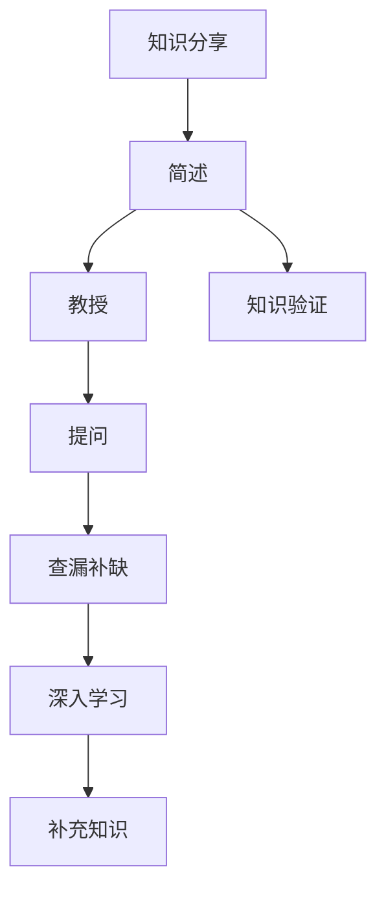

                 

## 1. 背景介绍

### 1.1 问题由来

在软件开发中，团队合作是提高效率、确保质量的关键因素。然而，如何有效促进团队成员之间的知识传递、理解，并持续提升团队成员的学习能力和技术水平，始终是一个挑战。传统的教学方法，如课堂培训、文档阅读等，往往难以满足快速变化的业务需求和实践场景。

费曼学习法（Feynman Technique），以诺贝尔物理学奖得主理查德·费曼命名，是一种高效的学习方法，强调通过自述、讨论和实践来加深理解和记忆。本文将深入探讨费曼学习法在团队学习与成长中的应用，结合具体的IT领域案例，展示如何通过费曼提问法促进团队成员的深度学习与成长。

### 1.2 问题核心关键点

费曼学习法通过以下三个步骤实现知识传递和深度学习：

1. **简述**：用简洁的语言描述所学内容的要点。
2. **教授**：尝试将所学内容教授给他人，包括幼儿或假想的读者。
3. **查漏补缺**：查找自己在教授过程中无法解释的部分，重新学习和理解。

在团队学习与成长中，费曼学习法可以转化为一种互动的提问与讨论机制，通过不断提问和解答，促使团队成员深入理解技术细节，共享知识，并共同解决问题。

## 2. 核心概念与联系

### 2.1 核心概念概述

费曼学习法本质上是一种自我解释和验证的学习策略。通过将知识转化为可解释的形式，不仅加深了个人的理解和记忆，还能帮助他人更直观地掌握相关知识。在团队学习与成长中，费曼学习法通过以下方式实现：

1. **知识分享**：团队成员通过简述和教授的方式分享自己的理解和经验。
2. **知识验证**：通过提问和解答，验证团队成员对知识的掌握情况。
3. **知识补充**：针对提问过程中发现的不足，进行深入学习和补充。

这些步骤可以不断循环，促使团队成员在互动中不断提升学习效果和技术水平。

### 2.2 核心概念原理和架构的 Mermaid 流程图



这个流程图展示了费曼学习法的核心步骤，其中知识分享和教授是基础，知识验证通过提问实现，查漏补缺通过深入学习补充知识，不断循环迭代，提升团队成员的知识掌握程度。

## 3. 核心算法原理 & 具体操作步骤

### 3.1 算法原理概述

费曼学习法通过知识分享、教授、验证和补充四个步骤，实现知识的高效传递和深度学习。在团队学习与成长中，这一方法可以转化为一种互动的提问与讨论机制，通过不断提问和解答，促使团队成员深入理解技术细节，共享知识，并共同解决问题。

### 3.2 算法步骤详解

#### 3.2.1 准备阶段

1. **选择主题**：根据团队的技术栈和发展需求，选择一个具体且具有挑战性的主题，如新的开发框架、云计算技术、数据库优化等。
2. **组建团队**：选择有经验的团队成员，组建一个知识分享小组，可以包括技术负责人、架构师、高级工程师等。
3. **制定计划**：确定知识分享的时间、地点、参与人员和目标，确保每次分享都有明确的主题和目标。

#### 3.2.2 知识分享阶段

1. **简述主题**：分享者用简洁明了的语言描述主题的关键概念、核心技术和实际应用场景。
2. **展示案例**：通过具体案例或实际项目中的应用，展示所学内容的实际效果和问题。
3. **强调难点**：指出学习过程中遇到的难点和常见问题，引导团队成员思考和讨论。

#### 3.2.3 提问与解答阶段

1. **设计问题**：根据分享内容，设计一系列具有挑战性和启发性的问题，涵盖理论、实践和应用各个层面。
2. **讨论解答**：邀请团队成员参与提问和解答，鼓励开放的讨论，逐步深入问题的本质。
3. **记录答案**：记录每次问题的解答过程和结果，形成知识库或文档，供后续参考和复用。

#### 3.2.4 查漏补缺阶段

1. **识别不足**：在提问和解答过程中，识别出自己在理论或实践上存在的不足和盲区。
2. **深入学习**：针对不足部分，进行深入学习和研究，查阅相关文档、技术博客、书籍等。
3. **补充知识**：将学习成果分享给团队，补充相关知识，提升团队的整体水平。

### 3.3 算法优缺点

#### 3.3.1 优点

1. **提升理解**：通过简述和教授，加深个人对知识的理解，并促进知识的系统化。
2. **促进交流**：通过提问和解答，增强团队成员之间的互动和交流，提高团队凝聚力。
3. **知识共享**：通过记录和复用，实现知识的积累和传承，提升团队整体技术水平。

#### 3.3.2 缺点

1. **准备成本高**：知识分享和设计问题的准备工作需要大量的时间和精力，初期投入较大。
2. **依赖参与者**：依赖有经验的团队成员主动分享和提问，对参与者要求较高。
3. **灵活性不足**：每次知识分享的主题和问题设计需提前规划，灵活性相对较低。

### 3.4 算法应用领域

费曼学习法可以应用于各种IT领域的团队学习和成长中，包括但不限于：

1. **软件开发**：学习新的编程语言、开发框架、架构模式等。
2. **云计算**：理解云计算技术、服务架构、DevOps实践等。
3. **大数据**：掌握数据处理、存储、分析、安全等技术。
4. **人工智能**：学习机器学习、深度学习、自然语言处理等技术。
5. **信息安全**：理解网络安全、数据保护、安全架构等知识。
6. **项目管理**：掌握敏捷开发、项目管理、团队协作等方法。

## 4. 数学模型和公式 & 详细讲解 & 举例说明

### 4.1 数学模型构建

费曼学习法的数学模型可以简化为以下几个步骤：

1. **输入**：主题 $T$，分享者 $P$，提问者 $Q$，记录者 $R$。
2. **处理**：简述 $S_P$，提问 $Q$，解答 $A$，记录 $D$。
3. **输出**：知识库 $K$，学习效果 $E$。

其中，$S_P$ 表示分享者对主题的简述，$Q$ 表示提问者提出的问题，$A$ 表示解答者对问题的解答，$D$ 表示记录者对问题和解答的记录，$K$ 表示知识库，$E$ 表示学习效果。

### 4.2 公式推导过程

假设每次知识分享涉及 $N$ 个问题，每个问题 $q_i$ 的解答 $a_i$ 对学习效果 $E$ 的贡献为 $w_i$，则总的学习效果 $E$ 可以表示为：

$$
E = \sum_{i=1}^{N} w_i \cdot a_i
$$

其中 $w_i$ 表示问题 $q_i$ 的权重，可以是问题的难度、参与度等指标。

### 4.3 案例分析与讲解

#### 案例：微服务架构的深入学习

1. **准备阶段**：选择一个具体的主题，如微服务架构，组建由架构师和高级工程师组成的知识分享小组。
2. **知识分享阶段**：分享者简述微服务架构的核心概念、设计原则和实现方法，展示具体项目中的应用案例。
3. **提问与解答阶段**：设计一系列问题，如如何设计微服务之间的通信协议、如何解决服务间的数据一致性问题等。
4. **查漏补缺阶段**：针对提出的问题，分享者深入学习和研究，记录学习成果，并补充到知识库中。

通过这一过程，团队成员不仅对微服务架构有了更深入的理解，还学会了如何设计、实现和优化微服务系统。

## 5. 项目实践：代码实例和详细解释说明

### 5.1 开发环境搭建

为了有效实施费曼学习法，需要一个支持在线协作和知识管理的开发环境。以下是使用 JIRA 和 Confluence 搭建知识共享平台的步骤：

1. **JIRA 搭建**：配置 JIRA 项目，创建知识共享任务板，列出每次知识分享的主题、时间、参与人员等信息。
2. **Confluence 搭建**：创建 Confluence 页面，记录每次知识分享的内容、问题和解答，供团队成员随时查看和更新。
3. **集成工具**：使用 Slack、Zoom 等工具，搭建实时沟通和远程讨论的环境。

### 5.2 源代码详细实现

以下是一个简单的 Python 代码示例，用于记录和统计知识分享过程中的问题和解答：

```python
# 使用 Python 字典记录问题和解答
questions = {}
answers = {}

def add_question(question, answer):
    if question in questions:
        questions[question].append(answer)
    else:
        questions[question] = [answer]

def get_answers(question):
    return questions.get(question, [])

def add_answer(question, answer):
    if question in answers:
        answers[question].append(answer)
    else:
        answers[question] = [answer]

def get_answers(question):
    return answers.get(question, [])
```

### 5.3 代码解读与分析

上述代码定义了三个函数，用于记录、获取和更新问题和解答。每次知识分享结束后，通过调用 `add_question` 和 `add_answer` 函数记录问题和解答，使用 `get_answers` 函数获取某个问题的所有解答。

### 5.4 运行结果展示

在 Confluence 页面中，可以创建知识库，展示每次知识分享的简述、问题和解答，形成文档，供团队成员随时查看和学习。例如：

```markdown
# 微服务架构知识分享

## 简述

微服务架构是一种将应用程序分解为独立服务的架构风格，每个服务运行在自己的进程中，具有自己的独立部署和扩展能力。微服务架构的核心理念是将复杂系统拆分为小而自治的服务，以提高系统的可维护性和扩展性。

## 问题

1. 如何设计微服务之间的通信协议？
2. 如何解决服务间的数据一致性问题？
3. 微服务架构如何支持容错和恢复？

## 解答

1. 可以使用 RESTful API、gRPC 等协议进行微服务之间的通信。
2. 可以使用事务一致性、数据库复制、分布式锁等方法解决服务间的数据一致性问题。
3. 可以通过故障转移、自动重启等机制提高微服务的容错性和恢复能力。
```

## 6. 实际应用场景

### 6.1 软件开发

费曼学习法在软件开发中的应用，可以有效提升团队成员对新技术和新框架的理解和掌握。例如，通过分享和讨论设计模式、编程范式、代码优化技巧等，团队成员可以共同提高编程技能和代码质量。

### 6.2 云计算

云计算技术的快速变化和复杂性，使得团队学习尤为重要。通过费曼学习法，团队成员可以共同理解云服务架构、容器化部署、自动化运维等技术，提高云平台的开发和运维效率。

### 6.3 大数据

大数据技术的复杂性和多样性，使得团队学习成为必要。通过费曼学习法，团队成员可以共同掌握数据处理、存储、分析和安全等技术，提升数据驱动决策的能力。

### 6.4 人工智能

人工智能技术的快速发展，使得团队学习变得尤为重要。通过费曼学习法，团队成员可以共同理解机器学习、深度学习、自然语言处理等技术，推动人工智能技术的落地应用。

### 6.5 信息安全

信息安全领域的复杂性和重要性，使得团队学习变得尤为重要。通过费曼学习法，团队成员可以共同掌握网络安全、数据保护、安全架构等知识，提高信息系统的安全性。

### 6.6 项目管理

项目管理技术的复杂性，使得团队学习变得尤为重要。通过费曼学习法，团队成员可以共同理解敏捷开发、项目管理、团队协作等方法，提高项目的成功率和效率。

## 7. 工具和资源推荐

### 7.1 学习资源推荐

1. **《费曼学习法》**：[Richard Feynman](https://book.douban.com/subject/26815721/) 的著作，详细介绍了费曼学习法的核心思想和实践方法。
2. **《深度学习实战》**：[吴恩达](https://book.douban.com/subject/27245677/) 的课程，涵盖深度学习的基本概念和实践技巧，适合作为学习资源。
3. **《软件设计模式》**：[GoF](https://book.douban.com/subject/24052263/) 的著作，介绍常用的设计模式和设计原则，帮助团队成员提升编程技能。
4. **《云架构师指南》**：[AWS](https://book.douban.com/subject/27053597/) 的文档，涵盖云计算架构、服务、安全等方面的知识，适合云计算团队学习。
5. **《数据科学入门》**：[Coursera](https://book.douban.com/subject/27115680/) 的课程，涵盖数据处理、分析、可视化等技术，适合大数据团队学习。
6. **《机器学习实战》**：[Peter Flach](https://book.douban.com/subject/27072043/) 的著作，介绍机器学习和深度学习的实现和应用，适合人工智能团队学习。
7. **《信息安全基础》**：[Ohigashi](https://book.douban.com/subject/26620585/) 的著作，介绍信息安全的基本概念和实践方法，适合信息安全团队学习。
8. **《敏捷项目管理》**：[Leffingwell](https://book.douban.com/subject/27108790/) 的著作，介绍敏捷开发和项目管理的方法和工具，适合项目管理团队学习。

### 7.2 开发工具推荐

1. **JIRA**：[Atlassian](https://www.atlassian.com/software/jira) 的开源项目管理工具，适合团队协作和知识管理。
2. **Confluence**：[Atlassian](https://www.atlassian.com/software/confluence) 的开源知识管理工具，适合记录和分享知识。
3. **Slack**：[Slack](https://www.slack.com/) 的即时通讯工具，适合团队实时沟通和讨论。
4. **Zoom**：[Zoom](https://www.zoom.us/) 的视频会议工具，适合远程协作和知识分享。
5. **GitLab**：[GitLab](https://www.gitlab.com/) 的代码托管平台，适合版本控制和代码共享。
6. **Google Docs**：[Google](https://docs.google.com/) 的在线文档工具，适合团队协作和知识共享。
7. **Notion**：[Notion](https://www.notion.so/) 的笔记和知识管理工具，适合记录和分享知识。

### 7.3 相关论文推荐

1. **《Feynman's Technique: An Effective Learning Method》**：[Barbara Oakley](https://www.academia.edu/70161780/Feynmans_technique_An_effective_learning_method) 的研究论文，详细介绍了费曼学习法的原理和实践方法。
2. **《Educating Teachers with Feynman Technique: A case Study》**：[Ken Watanabe](https://www.academia.edu/21861095/Educating_teachers_with_Feynman_technique_A_case_study) 的研究论文，探讨费曼学习法在教师教育中的应用。
3. **《A Computational Model of Feynman Technique》**：[Loïc Montplotlib](https://www.researchgate.net/publication/340980277_A_Computational_Model_of_Feynmans_Technique) 的研究论文，提出一种基于计算的费曼学习模型。

## 8. 总结：未来发展趋势与挑战

### 8.1 总结

费曼学习法通过知识分享、教授、验证和补充四个步骤，实现知识的高效传递和深度学习。在团队学习与成长中，这一方法可以转化为一种互动的提问与讨论机制，通过不断提问和解答，促使团队成员深入理解技术细节，共享知识，并共同解决问题。

通过本节的学习，读者可以掌握费曼学习法的核心思想和实践方法，了解其在团队学习与成长中的应用场景和实现策略。

### 8.2 未来发展趋势

1. **智能化**：随着人工智能技术的不断发展，费曼学习法可以结合智能推荐系统，根据团队成员的学习进度和兴趣推荐学习内容。
2. **场景化**：费曼学习法可以根据不同的业务场景和知识领域，设计针对性的提问和解答模板，提升学习效果。
3. **交互化**：结合虚拟现实、增强现实等技术，实现虚拟场景中的知识分享和互动，增强学习体验。
4. **自动化**：通过机器学习和自然语言处理技术，实现自动化知识管理和智能问答，提高知识共享的效率和效果。

### 8.3 面临的挑战

1. **参与度不足**：团队成员的参与度直接影响费曼学习法的实施效果，需要采取激励措施，提高参与者的积极性。
2. **时间成本高**：知识分享和设计问题的准备工作需要大量的时间和精力，需要合理规划时间，避免过度占用资源。
3. **技术壁垒**：费曼学习法的实施需要团队成员具备一定的技术水平和表达能力，对于初学者和低年级成员可能存在一定的难度。

### 8.4 研究展望

未来的研究可以关注以下几个方向：

1. **知识图谱的引入**：将知识图谱技术引入费曼学习法，帮助团队成员构建知识网络，提升学习的系统性和结构性。
2. **跨领域学习**：将费曼学习法应用于不同领域和行业，探索跨领域知识共享和学习的最佳实践。
3. **技术驱动**：结合深度学习、自然语言处理等技术，实现费曼学习法的智能化和自动化，提高知识共享的效率和效果。
4. **文化建设**：在企业内部建立费曼学习文化，鼓励团队成员主动分享和学习，形成持续改进的良性循环。

## 9. 附录：常见问题与解答

### Q1: 如何确保费曼学习法的实施效果？

A: 实施费曼学习法需要以下几个关键措施：
1. 明确目标：制定明确的学习目标和计划，确保每次知识分享都有明确的主题和目标。
2. 选择参与者：选择有经验的团队成员，确保知识分享的质量和深度。
3. 定期评估：定期评估学习效果和团队成员的成长情况，调整学习计划和策略。

### Q2: 费曼学习法是否适用于所有团队成员？

A: 费曼学习法适用于有一定技术基础和表达能力的团队成员，尤其是具有高级别的技术骨干和架构师。对于初级开发人员和新手，可能需要引导和支持，逐步提高其参与度和效果。

### Q3: 如何提高费曼学习法的参与度？

A: 提高参与度的关键在于激励措施和氛围营造：
1. 设立奖励机制：对于积极参与知识分享的成员，设立奖励和表彰机制，鼓励更多人的参与。
2. 营造积极氛围：营造积极的团队氛围，鼓励团队成员主动分享和学习，形成持续改进的良性循环。

### Q4: 如何评估费曼学习法的实施效果？

A: 评估费曼学习法的实施效果可以从以下几个方面进行：
1. 知识掌握度：通过测试和评估，衡量团队成员对知识的掌握程度。
2. 问题解决能力：评估团队成员在实际项目中的应用能力，如代码质量、技术问题解决等。
3. 团队凝聚力：通过反馈和问卷调查，了解团队成员的参与感和满意度，提升整体凝聚力。

### Q5: 费曼学习法是否可以与其他学习方法结合使用？

A: 费曼学习法可以与其他学习方法结合使用，提升学习效果：
1. 代码阅读和实践：结合代码阅读和实践，深入理解技术细节和实现方法。
2. 培训和课程：结合培训和课程，补充基础知识和理论知识，提升系统的全面性和深度。
3. 知识库和文档：结合知识库和文档，记录和复用知识，提升团队整体技术水平。

通过费曼学习法，团队成员可以共同学习和成长，提升技术水平和团队凝聚力，推动企业的持续发展和创新。在未来的技术发展中，费曼学习法将发挥越来越重要的作用，成为团队学习与成长的重要手段。

