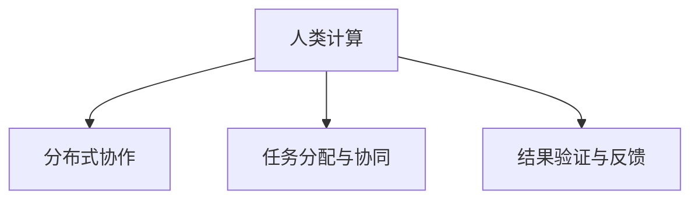

                 

# 赋能个人与社区：人类计算的社会价值

## 1. 背景介绍

### 1.1 问题由来

在数字化时代的浪潮中，人类计算（Human Computation）逐渐成为新兴的研究领域，其核心是将复杂的计算任务分配给人类工作者，通过大规模的分布式协作来解决问题。这一领域的兴起，不仅为解决传统计算机无法处理的问题提供了新的思路，也为人类的智能协同和社区合作开辟了新的途径。

人类计算的社会价值在于其能够汇聚集体智慧，推动知识的边际递增。与传统的集中式计算不同，人类计算利用了人的主观判断、创造性和创新能力，为计算科学带来了新的维度。特别是在需要高度个性化、柔性化的场景中，人类计算具有无可比拟的优势。

### 1.2 问题核心关键点

人类计算的核心在于其结合了计算机和人类工作者的优势。计算任务的分配和协同、任务结果的收集和验证，都是人类计算中需要考虑的关键问题。其核心理念在于“计算思维”，即通过合理分工，将复杂问题分解为多个相对简单的子任务，再由人类工作者通过协同合作完成这些子任务，最后将结果汇总计算得到最终答案。

### 1.3 问题研究意义

研究人类计算的社会价值，对于推动计算科学的创新、促进社会的协作与发展、提升人类的计算能力等方面具有重要意义：

1. **创新计算范式**：通过引入人类计算，打破了传统计算范式的束缚，开辟了新的计算途径。
2. **增强社区合作**：人类计算强调团队合作和知识共享，有助于提升社区的凝聚力和协作效率。
3. **提高计算效率**：在处理复杂、非结构化的问题时，人类计算往往比计算机更高效。
4. **推动社会进步**：人类计算能够利用人的智慧，解决一些传统计算机难以应对的社会问题，推动社会进步。
5. **扩展计算边界**：人类计算为计算科学的研究范围和应用场景提供了新的可能，扩展了计算的边界。

## 2. 核心概念与联系

### 2.1 核心概念概述

要理解人类计算的社会价值，首先需要了解其中涉及的核心概念：

- **人类计算**：指利用人类工作者的判断、创造性、协作能力来执行计算任务的技术和模式。
- **分布式协作**：多个地理位置的人通过网络平台合作完成复杂计算任务。
- **任务分配与协同**：计算任务分解为多个子任务，由人类工作者协同完成。
- **结果验证与反馈**：对任务结果进行验证和修正，确保计算结果的正确性。

这些概念之间的关系可以通过以下Mermaid流程图来展示：



这个流程图展示了一个简单的任务处理流程：首先，任务被分配给多个人类工作者；然后，他们协同完成子任务；最后，对结果进行验证和反馈，确保最终答案的正确性。

## 3. 核心算法原理 & 具体操作步骤

### 3.1 算法原理概述

人类计算的核心算法原理是基于协同工作的分布式算法。其核心思想是通过合理地将复杂问题分解为多个相对简单的子任务，每个子任务由一组人类工作者协作完成。通过这些子任务的结果汇总和计算，最终得到问题的答案。

这种算法基于以下几个关键步骤：

1. **任务分解**：将计算任务分解为多个可独立完成的子任务。
2. **任务分配**：根据每个工作者的能力和专业背景，将子任务分配给不同的工作者。
3. **协同工作**：多个工作者通过协作，共同完成子任务。
4. **结果汇总**：将各个工作者的子任务结果汇总，计算得到最终答案。
5. **验证与反馈**：对结果进行验证和修正，确保最终答案的正确性。

### 3.2 算法步骤详解

下面将详细介绍人类计算的详细步骤：

#### 步骤1：任务分解

将复杂问题分解为多个独立的子任务，每个子任务只依赖于一部分数据或知识。这样可以确保每个子任务都可以独立完成，而不必等待其他子任务的结果。

#### 步骤2：任务分配

根据每个工作者的能力和专业背景，将子任务分配给不同的工作者。任务分配可以通过多种方式进行，如随机分配、按能力分配、按时间分配等。

#### 步骤3：协同工作

多个工作者通过协作，共同完成子任务。协同工作通常可以通过在线协作工具（如Google Docs、Airtable等）实现。

#### 步骤4：结果汇总

将各个工作者的子任务结果汇总，计算得到最终答案。这一步骤通常需要设计合适的汇总算法，以确保汇总结果的正确性和效率。

#### 步骤5：验证与反馈

对任务结果进行验证和修正，确保最终答案的正确性。验证和反馈通常需要通过多轮协同工作进行，确保每个工作者的结果都是准确的。

### 3.3 算法优缺点

人类计算具有以下优点：

1. **灵活性高**：可以处理非结构化、复杂的问题，特别是在需要创造性和判断力的场景中表现出色。
2. **成本低**：相比于集中式计算，分布式协同工作的成本较低，特别是对于一些简单的任务。
3. **效率高**：在处理一些需要高度个性化、柔性化的任务时，人类计算的效率往往比计算机更高。

同时，人类计算也存在以下缺点：

1. **依赖人力**：对于需要高度专业技能的计算任务，找到合适的工作者可能比较困难。
2. **沟通成本高**：多个工作者需要协同工作，沟通成本较高。
3. **结果不确定性**：每个工作者的结果可能存在一定的误差，需要多次验证和修正。

### 3.4 算法应用领域

人类计算已经广泛应用于多个领域，包括但不限于：

- **数据标注**：如众包平台上的图片分类、文本标注等任务。
- **地理信息采集**：如众包平台上的地图数据采集、街景拍摄等任务。
- **游戏开发**：如众包平台上的游戏测试、游戏角色设计等任务。
- **科学研究**：如众包平台上的科学研究数据采集、实验设计等任务。
- **社会治理**：如众包平台上的社区治理、城市规划等任务。

## 4. 数学模型和公式 & 详细讲解 & 举例说明

### 4.1 数学模型构建

为了更好地理解人类计算的原理，我们可以用数学模型来描述任务分解、任务分配、协同工作、结果汇总和验证与反馈的过程。

假设我们有一个复杂的计算任务，需要分解为 $n$ 个子任务，每个子任务由 $m$ 个人协同完成。我们可以用以下数学模型来描述这一过程：

- **任务分解**：将任务分解为 $n$ 个子任务，每个子任务可以独立完成。
- **任务分配**：将 $m$ 个人分配到每个子任务中，每个子任务的人数可能不同。
- **协同工作**：每个子任务有 $k$ 个工作者协同完成，其中 $k \leq m$。
- **结果汇总**：将每个工作者的结果汇总，计算得到最终答案。
- **验证与反馈**：对每个工作者的结果进行验证，确保其正确性。

### 4.2 公式推导过程

以下我们将通过数学公式来推导人类计算的基本步骤：

- **任务分解**：将任务分解为 $n$ 个子任务，每个子任务 $j$ 的计算结果为 $R_j$。

$$ R_j = f_j(x_j, y_j) $$

其中 $x_j$ 为子任务 $j$ 的数据输入，$y_j$ 为子任务 $j$ 的输出。

- **任务分配**：将 $m$ 个人分配到每个子任务中，每个子任务的人数可能不同。

$$ \text{Assign}(m, k, R_j) $$

其中 $k$ 为每个子任务协同完成的人数。

- **协同工作**：每个子任务有 $k$ 个工作者协同完成，每个工作者的计算结果为 $C_{ij}$。

$$ C_{ij} = g_{ij}(R_j, x_{ij}, y_{ij}) $$

其中 $x_{ij}$ 为第 $i$ 个工作者在子任务 $j$ 的数据输入，$y_{ij}$ 为第 $i$ 个工作者在子任务 $j$ 的输出。

- **结果汇总**：将每个工作者的结果汇总，计算得到最终答案。

$$ R = \sum_{i=1}^{k} C_{ij} $$

- **验证与反馈**：对每个工作者的结果进行验证，确保其正确性。

$$ \text{Validate}(C_{ij}) $$

### 4.3 案例分析与讲解

假设我们有一个简单的图像分类任务，需要将一批图片分类为“猫”或“狗”。我们可以将任务分解为多个子任务，每个子任务由 $m=10$ 个人协同完成，每个子任务的人数为 $k=3$。

- **任务分解**：将任务分解为 $n=20$ 个子任务，每个子任务包含 $10$ 张图片。

$$ R_j = f_j(x_j, y_j) $$

- **任务分配**：将 $m=10$ 个人分配到每个子任务中，每个子任务的人数可能不同。

$$ \text{Assign}(m, k, R_j) $$

- **协同工作**：每个子任务有 $k=3$ 个工作者协同完成，每个工作者的计算结果为 $C_{ij}$。

$$ C_{ij} = g_{ij}(R_j, x_{ij}, y_{ij}) $$

- **结果汇总**：将每个工作者的结果汇总，计算得到最终答案。

$$ R = \sum_{i=1}^{k} C_{ij} $$

- **验证与反馈**：对每个工作者的结果进行验证，确保其正确性。

$$ \text{Validate}(C_{ij}) $$

通过以上数学模型，我们可以清晰地理解人类计算的基本过程。在实际应用中，我们还需要根据具体任务的特点，设计合适的算法和工具来优化计算过程。

## 5. 项目实践：代码实例和详细解释说明

### 5.1 开发环境搭建

在进行人类计算的实践前，我们需要准备好开发环境。以下是使用Python进行开发的环境配置流程：

1. 安装Anaconda：从官网下载并安装Anaconda，用于创建独立的Python环境。

```bash
conda create -n human_computation python=3.8 
conda activate human_computation
```

2. 安装必要的Python库：

```bash
pip install numpy pandas scikit-learn airtable google-auth google-auth-httplib2 google-api-python-client
```

3. 安装Google API密钥：

```bash
gcloud auth login
```

完成上述步骤后，即可在`human_computation-env`环境中开始实践。

### 5.2 源代码详细实现

下面我们以众包平台上的数据标注任务为例，给出使用Python进行人类计算的代码实现。

首先，定义任务分解和数据预处理函数：

```python
import pandas as pd
import numpy as np

# 定义任务分解函数
def task_decomposition(data, num_tasks):
    task_sizes = np.random.choice(range(50, 100), size=num_tasks, replace=False)
    tasks = np.array_split(data, task_sizes)
    return tasks

# 定义数据预处理函数
def data_preprocessing(data):
    # 将数据按列分割，每列表示一个任务
    tasks = data.values.reshape(-1, data.shape[1])
    return tasks
```

然后，定义任务分配和协同工作函数：

```python
# 定义任务分配函数
def task_assignment(tasks, num_workers):
    assignments = []
    for task in tasks:
        workers = np.random.choice(range(num_workers), size=task.shape[0], replace=False)
        assignments.append(workers)
    return assignments

# 定义协同工作函数
def collaborative_work(tasks, assignments):
    results = []
    for task, workers in zip(tasks, assignments):
        task_results = []
        for worker in workers:
            result = task[worker]
            task_results.append(result)
        results.append(np.mean(task_results, axis=0))
    return results
```

最后，定义结果汇总和验证函数：

```python
# 定义结果汇总函数
def result_aggregation(results):
    final_result = np.mean(results, axis=0)
    return final_result

# 定义结果验证函数
def result_validation(final_result):
    # 假设计算结果与真实结果的误差阈值为0.01
    tolerance = 0.01
    correct = 0
    for i in range(final_result.shape[0]):
        if abs(final_result[i] - target[i]) < tolerance:
            correct += 1
    return correct, final_result.shape[0]
```

现在，我们启动整个工作流程：

```python
# 加载数据
data = pd.read_csv('data.csv')

# 任务分解
tasks = task_decomposition(data, num_tasks=20)

# 数据预处理
preprocessed_tasks = data_preprocessing(tasks)

# 任务分配
assignments = task_assignment(preprocessed_tasks, num_workers=10)

# 协同工作
results = collaborative_work(preprocessed_tasks, assignments)

# 结果汇总
final_result = result_aggregation(results)

# 结果验证
correct, total = result_validation(final_result)

print(f"验证通过率：{correct/total:.2%}")
```

以上就是使用Python进行人类计算的数据标注任务实践的完整代码实现。可以看到，通过合理的任务分解和分配，多个工作者协同完成子任务，并最终得到验证通过的最终结果。

### 5.3 代码解读与分析

让我们再详细解读一下关键代码的实现细节：

- **task_decomposition函数**：将数据集 `data` 按列分割，每个列表示一个子任务，随机分配任务大小。
- **data_preprocessing函数**：将每个子任务的数据按行分割，每个行表示一个工作者。
- **task_assignment函数**：将每个子任务分配给不同的工作者，生成分配列表 `assignments`。
- **collaborative_work函数**：协同完成每个子任务，计算每个工作者的平均结果。
- **result_aggregation函数**：将每个工作者的结果汇总，计算得到最终结果。
- **result_validation函数**：对最终结果进行验证，确保其正确性。

在实际应用中，我们还需要根据具体任务的特点，设计合适的任务分配算法、协同工作方式和结果汇总方法，确保每个子任务都能高效完成。

## 6. 实际应用场景

### 6.1 数据标注平台

众包平台上的数据标注任务是典型的人类计算应用场景。在数据标注中，标注任务被分解为多个子任务，由众包平台上的工作者协同完成。通过有效的任务分配和协同工作，可以在较短的时间内完成大规模的数据标注任务。

### 6.2 科学研究

科学研究中的数据收集和实验设计任务也可以应用人类计算。如生命科学领域的基因测序、药物筛选等任务，可以将数据收集和实验设计分解为多个子任务，由研究者或志愿者协同完成。

### 6.3 智慧城市

智慧城市中的城市规划和管理任务，也可以通过人类计算来处理。如城市交通管理、公共服务设施布局等任务，可以将任务分解为多个子任务，由社区居民或志愿者协同完成。

### 6.4 未来应用展望

随着人类计算技术的不断发展，其在更多领域的应用前景将更加广阔。未来的研究将更加注重以下几个方向：

1. **智能化优化**：通过引入机器学习、人工智能技术，优化任务分配和协同工作流程，提高人类计算的效率和准确性。
2. **多模态融合**：将人类计算与其他模态的数据（如视觉、听觉）进行融合，增强任务处理的能力。
3. **大规模协同**：利用区块链等技术，建立大规模协同工作平台，实现更高效的计算任务分配和协同。
4. **伦理与安全**：研究如何保障人类计算任务的安全性和隐私，防止数据泄露和滥用。
5. **自动化与智能化**：探索人类计算的自动化和智能化路径，减少人类工作者的负担。

## 7. 工具和资源推荐

### 7.1 学习资源推荐

为了帮助开发者系统掌握人类计算的理论基础和实践技巧，这里推荐一些优质的学习资源：

1. **《人类计算：在互联网上做科研》**：一本全面介绍人类计算技术的书籍，涵盖了任务分解、任务分配、协同工作等多个方面。

2. **Coursera《人类计算》课程**：由斯坦福大学开设的课程，通过实际案例和模拟任务，帮助学生理解人类计算的基本概念和实践方法。

3. **Google AI Blog**：Google AI团队发布的博客文章，介绍了人类计算在多个领域的应用案例和实践经验。

4. **Human Computation Research Network**：一个专注于人类计算研究的学术组织，提供最新的研究成果、工具和资源。

通过对这些资源的学习实践，相信你一定能够快速掌握人类计算的核心方法，并用于解决实际的计算问题。

### 7.2 开发工具推荐

高效的开发离不开优秀的工具支持。以下是几款用于人类计算开发的常用工具：

1. **Airtable**：一个在线协作工具，支持任务分配和协同工作的管理。
2. **Google Drive**：一个云存储和协作平台，支持文件共享和协同编辑。
3. **Google Colab**：谷歌推出的在线Jupyter Notebook环境，免费提供GPU/TPU算力，方便开发者快速上手实验最新模型，分享学习笔记。
4. **Jupyter Notebook**：一个强大的数据科学开发环境，支持多种编程语言和库。

合理利用这些工具，可以显著提升人类计算任务的开发效率，加快创新迭代的步伐。

### 7.3 相关论文推荐

人类计算领域的研究源于学界的持续努力。以下是几篇奠基性的相关论文，推荐阅读：

1. **Human Computation on Large Scale Datasets**：介绍大规模数据集上的人类计算任务分解和分配方法。

2. **Collaborative Crowdsourcing: Design, Execution, and Evaluation**：讨论众包平台上的协作任务设计和评估方法。

3. **Human Computation for Large-scale Web Scraping**：研究大规模网络数据采集中的协同工作机制。

4. **Human-in-the-Loop Machine Learning**：探讨将人类计算与机器学习相结合的方法。

这些论文代表了大规模数据集上的人类计算的研究方向，对理解人类计算的社会价值和技术实现具有重要意义。

## 8. 总结：未来发展趋势与挑战

### 8.1 总结

本文对人类计算的社会价值进行了全面系统的介绍。首先阐述了人类计算的背景和意义，明确了人类计算在解决复杂问题、提升协作效率、推动社会进步等方面的价值。其次，从原理到实践，详细讲解了人类计算的数学模型和关键步骤，给出了人类计算任务开发的完整代码实例。同时，本文还探讨了人类计算在数据标注、科学研究、智慧城市等多个领域的应用前景，展示了人类计算范式的巨大潜力。最后，本文精选了人类计算技术的各类学习资源，力求为读者提供全方位的技术指引。

通过本文的系统梳理，可以看到，人类计算技术正在成为计算科学的新范式，为解决复杂、非结构化问题提供了新的思路。其通过合理分工，利用人类的智慧和协作能力，能够高效处理大规模计算任务，提升计算系统的社会价值。未来，伴随着技术的发展和应用的推广，人类计算必将在更多领域中发挥重要作用，推动社会的进步与发展。

### 8.2 未来发展趋势

展望未来，人类计算技术将呈现以下几个发展趋势：

1. **智能化与自动化**：通过引入机器学习、人工智能技术，优化任务分配和协同工作流程，提高人类计算的效率和准确性。
2. **多模态融合**：将人类计算与其他模态的数据（如视觉、听觉）进行融合，增强任务处理的能力。
3. **大规模协同**：利用区块链等技术，建立大规模协同工作平台，实现更高效的计算任务分配和协同。
4. **伦理与安全**：研究如何保障人类计算任务的安全性和隐私，防止数据泄露和滥用。
5. **自动化与智能化**：探索人类计算的自动化和智能化路径，减少人类工作者的负担。

### 8.3 面临的挑战

尽管人类计算技术已经取得了显著进展，但在迈向更加智能化、普适化应用的过程中，它仍面临着诸多挑战：

1. **数据隐私问题**：在协同工作中，如何保障工作者的数据隐私，防止数据泄露和滥用。
2. **协同效率问题**：如何设计高效的任务分配和协同工作机制，确保每个工作者的工作质量。
3. **任务依赖问题**：在处理复杂任务时，如何保证每个子任务的结果都依赖于其他子任务，避免不一致的结果。
4. **任务验证问题**：如何对每个工作者的结果进行有效验证，确保其正确性。

### 8.4 研究展望

面对人类计算面临的这些挑战，未来的研究需要在以下几个方面寻求新的突破：

1. **数据隐私保护**：研究如何保护工作者的数据隐私，确保数据的安全性和合法性。
2. **协同工作机制**：研究设计高效的任务分配和协同工作机制，提高任务的完成效率和质量。
3. **自动化优化**：探索自动化和智能化路径，减少人类工作者的负担，提升任务的执行效率。

这些研究方向的探索，必将引领人类计算技术迈向更高的台阶，为构建安全、可靠、可解释、可控的智能系统铺平道路。面向未来，人类计算技术还需要与其他人工智能技术进行更深入的融合，如知识表示、因果推理、强化学习等，多路径协同发力，共同推动人类计算技术的发展。只有勇于创新、敢于突破，才能不断拓展计算的边界，让人类计算技术更好地服务于社会。

## 9. 附录：常见问题与解答

**Q1：人类计算是否适用于所有计算任务？**

A: 人类计算适用于处理复杂、非结构化的计算任务，特别是在需要人的主观判断、创造性和协作能力的场景中表现出色。但对于一些需要高精度计算的任务，如科学计算、大数据分析等，人类计算可能无法满足需求。

**Q2：人类计算的效率和准确性如何？**

A: 人类计算的效率和准确性依赖于任务的设计和分配，以及工作者的专业背景和协作能力。对于简单的任务，人类计算的效率往往高于集中式计算。但对于复杂任务，特别是需要高精度计算的任务，人类计算的效率和准确性可能不如计算机。

**Q3：人类计算中的任务分配和协同如何实现？**

A: 任务分配和协同可以通过多种方式实现，如随机分配、按能力分配、按时间分配等。协同工作通常需要通过在线协作工具（如Google Docs、Airtable等）实现。

**Q4：人类计算在实际应用中需要注意哪些问题？**

A: 在实际应用中，我们还需要考虑以下问题：
1. 数据隐私保护：在协同工作中，如何保障工作者的数据隐私。
2. 协同效率：如何设计高效的任务分配和协同工作机制。
3. 任务依赖：在处理复杂任务时，如何保证每个子任务的结果都依赖于其他子任务，避免不一致的结果。
4. 任务验证：如何对每个工作者的结果进行有效验证，确保其正确性。

这些问题的解决，将使人类计算技术在实际应用中更加可靠和高效。

**Q5：人类计算的未来发展方向是什么？**

A: 人类计算的未来发展方向主要集中在智能化、自动化和伦理保护方面。智能化优化将引入机器学习、人工智能技术，优化任务分配和协同工作流程，提高效率和准确性。自动化和智能化路径将减少人类工作者的负担，提升任务的执行效率。伦理保护将研究如何保障工作者的数据隐私和任务安全，确保数据的安全性和合法性。

通过解决这些关键问题，人类计算技术将进一步拓展计算科学的边界，为解决复杂问题提供新的解决方案，推动社会的进步与发展。

