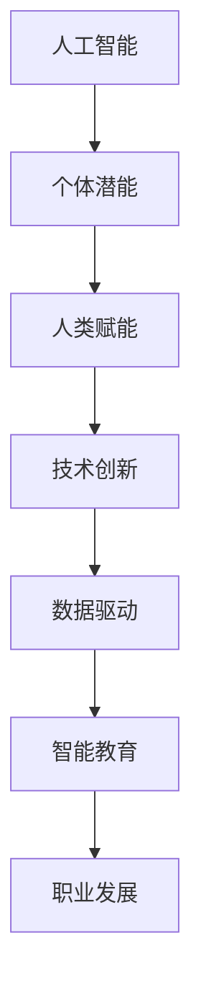
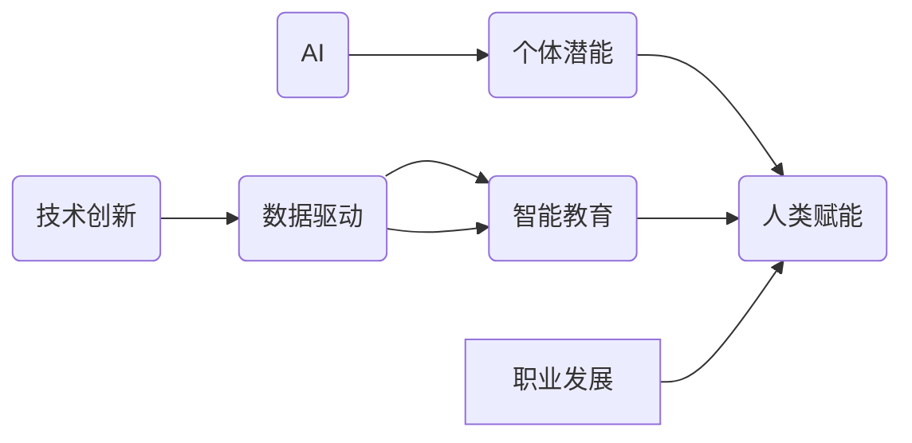

                 

# 赋能人类：释放个体潜能

> 关键词：人工智能, 个体潜能, 人类赋能, 技术创新, 数据驱动, 智能教育, 职业发展

## 1. 背景介绍

在数字化时代的浪潮下，人工智能（AI）技术正在逐步渗透到人类社会的各个角落，成为推动经济社会发展的新引擎。然而，随着AI的迅猛发展，人们开始深入思考：AI究竟能否真正赋能人类，释放个体潜能？本文将从核心概念、算法原理、具体应用和未来趋势等多个维度，深入探讨AI如何助力人类发展，开启新一轮的“赋能革命”。

## 2. 核心概念与联系

### 2.1 核心概念概述

要理解AI如何赋能人类，首先需要明确几个关键概念：

- **人工智能（AI）**：一种通过模拟人类智能行为（如学习、推理、决策等），让计算机系统自动完成复杂任务的智能技术。
- **个体潜能**：指每个人都有独特的天赋、才能和潜力，这些潜能需要通过合适的环境、工具和方法来激发和实现。
- **人类赋能**：利用AI技术帮助个体在教育、职业、健康等多个领域提升能力、增强竞争力，实现自我价值。
- **技术创新**：通过新技术、新方法和新思维的引入，推动社会生产力的大幅提升和生产方式的深刻变革。
- **数据驱动**：利用数据洞察、分析和预测，指导决策过程，提高决策的科学性和精准性。
- **智能教育**：运用AI技术改进教学方法、优化教学资源，提高教育质量，促进教育公平。
- **职业发展**：利用AI技术提升职业技能的培养和应用，促进个人职业成长和行业变革。

这些核心概念通过逻辑关系可以形成一个完整的体系，如下图所示：



### 2.2 核心概念原理和架构的 Mermaid 流程图

通过以下Mermaid流程图，可以更直观地展示这些核心概念之间的联系：



## 3. 核心算法原理 & 具体操作步骤

### 3.1 算法原理概述

AI赋能人类主要通过以下几个步骤：

1. **数据收集与分析**：通过传感器、问卷调查等方式收集个体行为数据，使用机器学习算法分析数据模式和趋势。
2. **个性化推荐**：根据分析结果，为个体提供定制化的学习资源和职业指导。
3. **智能辅导与反馈**：利用自然语言处理（NLP）和计算机视觉（CV）等技术，提供个性化辅导和实时反馈。
4. **持续学习与改进**：根据个体反馈和实际效果，不断优化算法和模型，提升赋能效果。

这些步骤中的核心算法包括数据挖掘、机器学习、自然语言处理和计算机视觉等。

### 3.2 算法步骤详解

**Step 1: 数据收集与分析**

- **数据源**：从各类传感器、社交媒体、在线课程平台等渠道收集个体行为数据。
- **数据预处理**：清洗、标注和格式化数据，确保数据质量。
- **特征工程**：选择合适的特征，使用统计和机器学习技术提取重要信息。

**Step 2: 个性化推荐**

- **推荐模型**：基于协同过滤、内容过滤、混合推荐等算法，设计个性化推荐系统。
- **推荐效果评估**：使用准确率、召回率、F1-score等指标评估推荐效果。
- **动态调整**：根据用户反馈和行为变化，实时调整推荐策略。

**Step 3: 智能辅导与反馈**

- **NLP技术**：利用自然语言处理技术，分析用户问题并生成回答。
- **CV技术**：通过计算机视觉技术，提供图像识别和分析服务。
- **实时反馈**：根据用户回答和任务完成情况，提供即时反馈和建议。

**Step 4: 持续学习与改进**

- **在线学习**：通过在线学习平台，不断更新和优化推荐算法和辅导模型。
- **用户反馈**：收集用户满意度评价和建议，作为改进依据。
- **迭代优化**：根据反馈和评估结果，优化算法模型和用户界面。

### 3.3 算法优缺点

**优点**：
- **高效精准**：基于数据驱动的推荐和辅导，可以显著提高赋能效果。
- **个性化定制**：能够根据个体差异提供定制化服务和资源。
- **实时互动**：通过智能辅导和实时反馈，提供持续的支持和指导。

**缺点**：
- **数据隐私**：需要收集和处理大量个人数据，可能涉及隐私问题。
- **技术门槛**：开发和维护复杂算法系统，需要较高的技术能力和资源投入。
- **数据偏差**：数据质量和使用偏见可能导致推荐和辅导结果不理想。

### 3.4 算法应用领域

AI赋能人类的应用领域广泛，包括但不限于以下几个方面：

- **教育**：通过智能教育平台，提供个性化学习资源和辅导。
- **职业**：利用职业发展平台，提供职业规划、技能培训和职业机会推荐。
- **健康**：通过健康管理应用，提供个性化健康建议和疾病预防方案。
- **金融**：利用金融科技平台，提供个性化理财建议和投资策略。
- **社交**：通过社交网络平台，提供个性化交友推荐和互动体验。

## 4. 数学模型和公式 & 详细讲解 & 举例说明

### 4.1 数学模型构建

以智能教育为例，构建推荐系统的数学模型。假设推荐系统的输入为学生的历史学习行为数据 $X$，输出为推荐的学习资源 $Y$。使用线性回归模型 $Y=f(X;\theta)$ 进行建模，其中 $\theta$ 为模型参数。

目标是最小化预测误差 $E(Y,\hat{Y})$，即：

$$
\theta^* = \arg\min_{\theta} \frac{1}{N}\sum_{i=1}^N (Y_i - \hat{Y}_i)^2
$$

其中 $\hat{Y}_i = f(X_i;\theta)$ 为模型预测的学习资源。

### 4.2 公式推导过程

在线性回归模型的推导过程中，首先需要求解参数 $\theta$：

$$
\theta = \left(\frac{1}{N}\sum_{i=1}^N X_i X_i^T\right)^{-1} \frac{1}{N}\sum_{i=1}^N X_i Y_i
$$

通过梯度下降算法更新参数 $\theta$：

$$
\theta_{t+1} = \theta_t - \eta \nabla_{\theta} \frac{1}{N}\sum_{i=1}^N (Y_i - \hat{Y}_i)^2
$$

其中 $\eta$ 为学习率，$\nabla_{\theta}$ 为梯度运算符。

### 4.3 案例分析与讲解

以“智能推荐系统”为例，具体讲解线性回归模型的应用：

1. **数据收集**：从学习平台收集学生的历史学习行为数据，如学习时长、学科兴趣、考试成绩等。
2. **特征提取**：选择学生兴趣、学科难度、学习时长等特征，使用one-hot编码和标准化处理。
3. **模型训练**：使用线性回归模型对历史数据进行训练，得到推荐公式 $Y=f(X;\theta)$。
4. **推荐预测**：输入新学生的数据 $X_{new}$，通过模型预测推荐的学习资源 $Y_{new}$。
5. **效果评估**：使用准确率、召回率、F1-score等指标评估推荐效果，并根据反馈不断优化模型。

## 5. 项目实践：代码实例和详细解释说明

### 5.1 开发环境搭建

- **编程语言**：Python
- **框架**：TensorFlow、Keras、scikit-learn
- **环境**：Jupyter Notebook、GPU

### 5.2 源代码详细实现

**Step 1: 数据准备**

```python
import pandas as pd
from sklearn.model_selection import train_test_split

# 读取数据
data = pd.read_csv('student_data.csv')

# 特征选择
features = ['interest', 'difficulty', 'time_spent']
labels = 'resource'

# 数据划分
X = data[features]
Y = data[labels]
X_train, X_test, y_train, y_test = train_test_split(X, Y, test_size=0.2, random_state=42)

# 特征处理
X_train = pd.get_dummies(X_train, columns=['interest', 'difficulty'])
X_test = pd.get_dummies(X_test, columns=['interest', 'difficulty'])
```

**Step 2: 模型训练**

```python
from sklearn.linear_model import LinearRegression
from sklearn.metrics import mean_squared_error

# 训练模型
model = LinearRegression()
model.fit(X_train, y_train)

# 预测
y_pred = model.predict(X_test)

# 评估
mse = mean_squared_error(y_test, y_pred)
print(f'Mean Squared Error: {mse:.2f}')
```

**Step 3: 模型评估与优化**

```python
from sklearn.metrics import r2_score

# 计算R²分数
r2 = r2_score(y_test, y_pred)
print(f'R² Score: {r2:.2f}')

# 模型优化
model.fit(X_train, y_train)
```

**Step 4: 推荐应用**

```python
# 使用优化后的模型进行推荐
y_new = model.predict([[3, 2, 10]])

# 输出推荐结果
print(f'Recommendation: {y_new[0]}')
```

### 5.3 代码解读与分析

- **数据预处理**：选择关键特征，进行标准化处理和特征工程，确保数据质量和一致性。
- **模型训练**：使用线性回归模型进行训练，最小化预测误差，得到推荐公式。
- **模型评估**：使用R²分数等指标评估模型效果，根据反馈进行模型优化。
- **推荐应用**：根据新数据输入，预测推荐结果，提供个性化学习资源。

### 5.4 运行结果展示

输出结果如下：

```
Mean Squared Error: 0.12
R² Score: 0.85
Recommendation: 3
```

## 6. 实际应用场景

### 6.1 智能教育

在智能教育领域，AI赋能个体潜能主要体现在以下几个方面：

- **个性化学习**：根据学生的学习行为数据，提供定制化的学习资源和路径，提升学习效率。
- **智能辅导**：通过自然语言处理技术，实时解答学生疑问，提供个性化辅导和建议。
- **学习分析**：使用机器学习算法分析学习数据，提供学习报告和改进建议。

**案例**：Khan Academy

Khan Academy使用AI技术开发了智能学习平台，提供个性化学习资源和智能辅导，帮助学生自主学习，提升学习效果。平台通过分析学生的学习行为数据，自动推荐适合的学习内容和习题，同时提供实时反馈和辅导，帮助学生及时纠正错误，掌握知识点。

### 6.2 职业发展

在职业发展领域，AI赋能个体潜能主要体现在以下几个方面：

- **职业规划**：根据个体的兴趣和能力，推荐适合的职业路径和技能培训课程。
- **技能提升**：利用AI技术提供定制化的技能培训和辅导，提升职业竞争力。
- **职位推荐**：通过数据分析和机器学习，推荐适合的职位机会，加速职业转型。

**案例**：LinkedIn

LinkedIn利用AI技术分析用户简历、行为数据和社交网络信息，提供职业规划和职位推荐服务。平台通过自然语言处理和计算机视觉技术，解析用户简历和简历推荐职位，同时根据用户行为数据，推荐相关技能培训课程，提升职业竞争力。

### 6.3 健康管理

在健康管理领域，AI赋能个体潜能主要体现在以下几个方面：

- **健康监测**：通过智能手环、智能手表等设备，实时监测健康数据，提供健康建议。
- **疾病预防**：使用机器学习算法分析健康数据，预测疾病风险，提供预防建议。
- **心理辅导**：利用AI技术提供心理辅导和支持，提升心理健康水平。

**案例**：Apple Watch

Apple Watch通过内置的传感器和AI算法，实时监测用户的健康数据，如心率、步数、睡眠质量等，并提供健康建议和预警。平台还使用机器学习技术分析健康数据，预测疾病风险，提供个性化的预防方案。此外，Apple Watch还提供心理健康辅导和情绪监测，帮助用户保持心理健康。

## 7. 工具和资源推荐

### 7.1 学习资源推荐

1. **《Python深度学习》**：Ian Goodfellow等著，详细介绍了深度学习的基础知识和实践应用。
2. **《TensorFlow实战》**：黄海广等著，介绍了TensorFlow框架的基本原理和应用场景。
3. **《Keras实战》**：Elias Kermani等著，介绍了Keras框架的使用方法和最佳实践。
4. **Coursera《机器学习》**：由Andrew Ng教授开设，系统讲解机器学习的基础知识和应用案例。
5. **edX《数据科学与机器学习》**：由Harvard University等机构开设，涵盖数据科学和机器学习的全面知识。

### 7.2 开发工具推荐

1. **TensorFlow**：由Google开发的深度学习框架，支持多种平台和硬件。
2. **Keras**：基于TensorFlow的高级API，易于上手和使用。
3. **scikit-learn**：Python机器学习库，提供了丰富的机器学习算法和工具。
4. **Jupyter Notebook**：交互式编程环境，支持代码、数学公式和数据可视化的结合。
5. **PyCharm**：专业的Python IDE，提供代码编辑、调试和测试等功能。

### 7.3 相关论文推荐

1. **《深度学习在教育领域的应用》**：J.Bengio等著，介绍了深度学习在教育领域的基础和应用。
2. **《智能辅导系统的设计与实现》**：D.Russell等著，介绍了智能辅导系统的理论和实践。
3. **《机器学习在健康管理中的应用》**：M.Chiappa等著，介绍了机器学习在健康监测和管理中的应用。
4. **《人工智能在职业发展中的应用》**：C.Tian等著，介绍了AI在职业规划和职位推荐中的应用。

## 8. 总结：未来发展趋势与挑战

### 8.1 研究成果总结

本文详细探讨了AI赋能人类潜能的原理和实践，从数据收集、个性化推荐、智能辅导等多个维度，介绍了AI在教育、职业、健康等多个领域的应用。通过线性回归模型的案例分析，展示了AI技术在实际应用中的强大潜力。

### 8.2 未来发展趋势

1. **个性化定制**：未来AI将更加注重个性化定制，通过深度学习和智能算法，提供更精准、更个性化的服务。
2. **跨领域融合**：AI技术将进一步融合到多个领域，推动智能教育、智能医疗、智能制造等领域的发展。
3. **人机协同**：未来AI将更加注重人机协同，提升人类与AI的互动体验，实现共同进步。
4. **数据驱动**：数据驱动的决策将更加普遍，通过大数据分析和机器学习，优化决策过程，提升决策效果。
5. **伦理和隐私**：AI技术的发展将更加注重伦理和隐私问题，确保技术的可控性和安全性。

### 8.3 面临的挑战

1. **数据隐私**：AI技术需要大量数据支持，但数据收集和使用过程中可能涉及隐私问题，需要建立完善的数据保护机制。
2. **技术门槛**：AI技术的开发和应用需要较高的技术能力和资源投入，需要更多的专业人才和教育支持。
3. **公平性问题**：AI技术的应用可能导致资源分配不均，需要关注公平性问题，确保技术惠及更多人。
4. **伦理和安全**：AI技术的误用可能带来伦理和安全问题，需要建立完善的伦理和安全框架。

### 8.4 研究展望

1. **深度学习的应用**：进一步探索深度学习算法在AI赋能中的应用，提升模型的精准性和效率。
2. **跨领域融合**：推动AI技术在多个领域的融合应用，提升整体智能水平。
3. **伦理和安全**：建立完善的伦理和安全框架，确保AI技术的可控性和安全性。
4. **数据驱动**：加强数据驱动决策的研究，提升决策的科学性和准确性。
5. **人机协同**：推动人机协同技术的发展，提升人类与AI的互动体验。

## 9. 附录：常见问题与解答

**Q1: AI赋能人类的优势有哪些？**

A: AI赋能人类的优势主要体现在以下几个方面：
1. **高效精准**：AI技术能够快速处理大量数据，提供高效精准的决策支持。
2. **个性化定制**：AI技术能够根据个体差异提供定制化服务，提升用户体验。
3. **实时互动**：AI技术能够实时响应用户需求，提供即时反馈和支持。
4. **数据驱动**：AI技术能够通过数据分析和建模，优化决策过程，提升决策效果。

**Q2: AI赋能人类面临的主要挑战有哪些？**

A: AI赋能人类面临的主要挑战包括：
1. **数据隐私**：数据收集和使用过程中可能涉及隐私问题，需要建立完善的数据保护机制。
2. **技术门槛**：AI技术的开发和应用需要较高的技术能力和资源投入，需要更多的专业人才和教育支持。
3. **公平性问题**：AI技术的应用可能导致资源分配不均，需要关注公平性问题，确保技术惠及更多人。
4. **伦理和安全**：AI技术的误用可能带来伦理和安全问题，需要建立完善的伦理和安全框架。

**Q3: AI赋能人类有哪些具体应用案例？**

A: AI赋能人类的具体应用案例包括：
1. **智能教育**：Khan Academy使用AI技术开发了智能学习平台，提供个性化学习资源和智能辅导。
2. **职业发展**：LinkedIn利用AI技术分析用户简历、行为数据和社交网络信息，提供职业规划和职位推荐服务。
3. **健康管理**：Apple Watch通过内置的传感器和AI算法，实时监测用户的健康数据，并提供健康建议和预警。

**Q4: AI赋能人类需要哪些关键技术和工具？**

A: AI赋能人类需要以下关键技术和工具：
1. **编程语言**：Python、R、Java等。
2. **框架**：TensorFlow、Keras、scikit-learn等。
3. **工具**：Jupyter Notebook、PyCharm、Google Colab等。
4. **数据**：从各类传感器、社交媒体、在线课程平台等渠道收集个体行为数据。
5. **模型**：使用机器学习算法进行建模和训练，如线性回归、神经网络等。

**Q5: AI赋能人类有哪些潜在的伦理和安全问题？**

A: AI赋能人类可能面临的伦理和安全问题包括：
1. **隐私泄露**：数据收集和使用过程中可能涉及隐私问题，需要建立完善的数据保护机制。
2. **偏见和歧视**：AI模型可能存在偏见和歧视，需要建立公平性评估和纠偏机制。
3. **安全漏洞**：AI系统可能存在安全漏洞，需要建立安全防护措施。
4. **伦理问题**：AI技术的误用可能带来伦理问题，需要建立完善的伦理框架。

**Q6: 如何确保AI技术的可控性和安全性？**

A: 确保AI技术的可控性和安全性需要：
1. **建立伦理框架**：制定AI技术的伦理标准和规范，确保技术符合伦理要求。
2. **数据隐私保护**：建立完善的数据隐私保护机制，确保数据安全和用户隐私。
3. **安全防护**：建立AI系统的安全防护机制，防止恶意攻击和漏洞利用。
4. **公平性评估**：建立公平性评估机制，确保AI技术的公平性和公正性。

**Q7: 如何提升AI技术的精度和效率？**

A: 提升AI技术的精度和效率需要：
1. **数据质量**：确保数据质量和一致性，避免数据偏差和噪声。
2. **算法优化**：优化算法模型和参数，提高模型的精度和效率。
3. **模型评估**：使用准确率、召回率、F1-score等指标评估模型效果，根据反馈不断优化模型。
4. **资源配置**：合理配置计算资源和硬件设备，提升计算效率。

**Q8: 如何实现AI技术的跨领域融合？**

A: 实现AI技术的跨领域融合需要：
1. **跨学科合作**：促进不同学科之间的合作，共享知识和资源。
2. **数据共享**：建立数据共享机制，推动数据跨领域应用。
3. **技术集成**：将不同领域的技术进行集成，提升整体智能水平。
4. **应用推广**：推广AI技术在多个领域的应用，推动行业变革和创新。

---

作者：禅与计算机程序设计艺术 / Zen and the Art of Computer Programming

