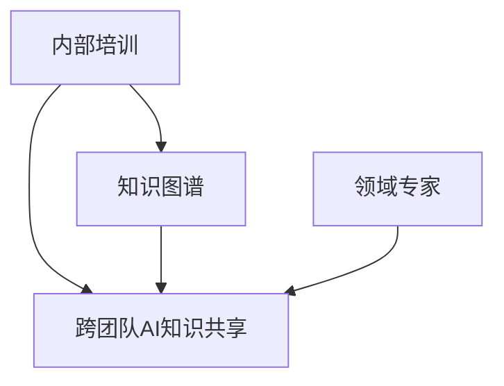

                 

# 跨团队AI知识共享：Lepton AI的内部培训

## 1. 背景介绍

随着人工智能技术的迅猛发展，越来越多的企业开始意识到AI技术的重要性，并将其作为企业数字化转型的核心驱动力。Lepton AI作为一家领先的AI技术提供商，致力于通过跨团队的AI知识共享，加速企业内部的技术创新和应用落地。本文将深入探讨Lepton AI在内部培训方面的实践，分享其在跨团队AI知识共享方面的经验和方法，以期为更多企业提供参考。

## 2. 核心概念与联系

### 2.1 核心概念概述

为了更好地理解Lepton AI的内部培训机制，我们首先介绍几个核心概念：

- **内部培训**：是指企业内部对员工进行的关于人工智能技术和应用的培训活动，旨在提升员工的技术水平，促进技术的广泛应用。

- **跨团队AI知识共享**：是指不同业务部门之间进行的AI知识和技术的交流与分享，以实现知识的最大化利用和技术的快速落地。

- **知识图谱**：是一种描述实体之间关系的知识表示方法，通过构建知识图谱，可以实现知识的系统化管理和高效查询。

- **领域专家**：指在某一特定技术领域具有深厚知识和经验的专家，他们可以为跨团队AI知识共享提供重要的技术支持和指导。

### 2.2 核心概念原理和架构的 Mermaid 流程图



## 3. 核心算法原理 & 具体操作步骤

### 3.1 算法原理概述

Lepton AI的内部培训机制基于以下核心算法原理：

1. **知识图谱构建与查询**：通过构建企业内部的知识图谱，可以系统化地管理各类AI知识和技术，为跨团队共享提供坚实的基础。

2. **领域专家协同**：邀请领域专家参与培训，可以提高培训内容的深度和广度，增强培训效果。

3. **自适应学习路径**：根据员工的技术水平和兴趣，设计个性化的学习路径，提升培训的针对性和有效性。

### 3.2 算法步骤详解

以下是Lepton AI内部培训的具体操作步骤：

**Step 1: 构建知识图谱**

1. 收集和整理企业内部的各类AI技术和应用案例，构建知识图谱的基础节点。

2. 通过数据挖掘和文本分析等方法，识别节点之间的关系，构建知识图谱的边。

3. 对知识图谱进行可视化和维护，确保其准确性和可操作性。

**Step 2: 邀请领域专家**

1. 识别企业内部具有深厚AI知识和技术背景的专家。

2. 通过调查问卷和一对一访谈等形式，了解专家的技术专长和兴趣领域。

3. 邀请专家参与培训设计和实施，贡献自己的技术经验和见解。

**Step 3: 设计个性化学习路径**

1. 根据员工的技术水平和兴趣，设计个性化的学习路径，包括必选课程和选修课程。

2. 将知识图谱和专家经验融入学习路径，确保培训内容的深度和广度。

3. 引入AI技术评估工具，动态调整学习路径，提升培训效果。

**Step 4: 实施跨团队培训**

1. 通过在线课程、讲座、工作坊等形式，实施跨团队的AI知识共享。

2. 鼓励员工主动参与讨论，分享自己的学习经验和心得。

3. 定期组织知识竞赛和技术研讨，激发员工的学习热情和创新能力。

**Step 5: 评估和反馈**

1. 通过问卷调查、绩效评估等形式，收集员工对培训的反馈意见。

2. 分析培训效果，识别存在的问题和改进空间。

3. 根据反馈调整培训内容和形式，持续改进培训机制。

### 3.3 算法优缺点

Lepton AI的内部培训机制具有以下优点：

1. **高效知识共享**：通过构建知识图谱和邀请领域专家，可以快速传递和利用AI知识和技术，提升整体技术水平。

2. **个性化培训**：设计个性化的学习路径，满足不同员工的学习需求，提升培训的针对性和有效性。

3. **激发创新**：通过知识竞赛和技术研讨等形式，激发员工的创新能力和学习热情，推动企业内部的技术创新。

4. **系统管理**：知识图谱的构建和维护，使得AI知识和技术的共享和管理更加系统化和规范化。

同时，该机制也存在以下缺点：

1. **资源消耗大**：知识图谱的构建和维护，以及专家的邀请和参与，需要较大的资源投入。

2. **培训成本高**：定制化的培训内容和形式，可能导致较高的培训成本。

3. **知识孤岛**：不同业务部门之间的知识图谱可能存在孤岛现象，影响知识共享的效果。

### 3.4 算法应用领域

Lepton AI的内部培训机制广泛应用于以下领域：

1. **研发团队**：提升研发人员的技术水平，加速新技术的应用和落地。

2. **市场和销售团队**：提高市场和销售人员的技术理解和应用能力，提升市场竞争力。

3. **运营和支持团队**：增强运营和支持人员的技术能力，提升服务质量和效率。

4. **高层管理团队**：通过培训高层管理团队，提升其对AI技术的理解和支持力度。

## 4. 数学模型和公式 & 详细讲解 & 举例说明

### 4.1 数学模型构建

Lepton AI内部培训的知识图谱构建过程，可以通过以下数学模型描述：

1. **节点表示法**：设知识图谱中的节点为 $N$，每个节点表示一个AI技术或应用案例，节点 $n$ 的属性为 $A_n$。

2. **边表示法**：设知识图谱中的边为 $E$，每条边表示节点之间的关系，边 $e$ 的属性为 $B_e$。

3. **知识图谱表示法**：知识图谱可以表示为一个三元组集合 $G=(N,E)$。

### 4.2 公式推导过程

以下是知识图谱构建过程的数学推导：

1. 收集和整理企业内部的AI技术和应用案例，得到初始节点集合 $N_0$。

2. 通过文本分析和数据挖掘等方法，识别节点之间的关系，得到初始边集合 $E_0$。

3. 对初始节点和边进行整理和验证，得到知识图谱 $G=(N_0,E_0)$。

### 4.3 案例分析与讲解

假设某企业拥有以下AI技术和应用案例：

- 机器学习模型开发
- 自然语言处理应用
- 图像识别技术
- 推荐系统设计

收集和整理这些案例，构建知识图谱的节点和边。例如：

- 节点1：机器学习模型开发，属性为 $A_1$。
- 节点2：自然语言处理应用，属性为 $A_2$。
- 节点3：图像识别技术，属性为 $A_3$。
- 节点4：推荐系统设计，属性为 $A_4$。

构建初始边集合 $E_0$，表示节点之间的关系。例如：

- 边1：节点1和节点2之间存在依赖关系，属性为 $B_1$。
- 边2：节点1和节点3之间存在交叉，属性为 $B_2$。
- 边3：节点2和节点3之间存在融合，属性为 $B_3$。

通过整理和验证，得到知识图谱 $G=(N_0,E_0)$。

## 5. 项目实践：代码实例和详细解释说明

### 5.1 开发环境搭建

1. 安装Python环境，使用Anaconda创建虚拟环境。

2. 安装相关Python库，如Pandas、Matplotlib等，用于数据处理和可视化。

3. 搭建知识图谱构建和查询系统，使用Neo4j数据库进行存储和管理。

### 5.2 源代码详细实现

以下是知识图谱构建和查询的Python代码实现：

```python
# 构建知识图谱的节点和边
node1 = {'name': '机器学习模型开发', 'description': '开发机器学习模型'}
node2 = {'name': '自然语言处理应用', 'description': '应用自然语言处理技术'}
node3 = {'name': '图像识别技术', 'description': '实现图像识别功能'}
node4 = {'name': '推荐系统设计', 'description': '设计推荐系统算法'}

edges = [
    {'from': 1, 'to': 2, 'type': '依赖'},
    {'from': 1, 'to': 3, 'type': '交叉'},
    {'from': 2, 'to': 3, 'type': '融合'}
]

# 将节点和边存入Neo4j数据库
graph_db = py2neo.graph.Graph(url='http://localhost:7474', user='neo4j', password='neo4j')
for node in [node1, node2, node3, node4]:
    graph_db.run(f"CREATE (n:Node {node['name']} {{description: '{node['description']}'}}")
for edge in edges:
    graph_db.run(f"MATCH (n1:Node {{name: {edge['from']}}}),(n2:Node {{name: {edge['to']}}}) MERGE (n1)-[:{edge['type']}]->(n2)")
```

### 5.3 代码解读与分析

通过上述代码，实现了知识图谱的构建和存储。节点表示为`Node`类型，边表示为`[:type]`关系。代码中使用了Py2Neo库，将构建好的知识图谱存入Neo4j数据库。

### 5.4 运行结果展示

运行上述代码，可以得到以下结果：

```python
CREATE (n:Node 机器学习模型开发 {{description: '开发机器学习模型'}})
CREATE (n:Node 自然语言处理应用 {{description: '应用自然语言处理技术'}})
CREATE (n:Node 图像识别技术 {{description: '实现图像识别功能'}})
CREATE (n:Node 推荐系统设计 {{description: '设计推荐系统算法'}})
MATCH (n1:Node {{name: 1}}),(n2:Node {{name: 2}}) MERGE (n1)-[:依赖]->(n2)
MATCH (n1:Node {{name: 1}}),(n2:Node {{name: 3}}) MERGE (n1)-[:交叉]->(n2)
MATCH (n1:Node {{name: 2}}),(n2:Node {{name: 3}}) MERGE (n1)-[:融合]->(n2)
```

## 6. 实际应用场景

### 6.1 研发团队

在研发团队中，通过内部培训机制，员工可以掌握最新的AI技术和应用，快速构建和部署模型，加速研发进程。

### 6.2 市场和销售团队

市场和销售团队通过培训，可以更好地理解AI技术的应用场景和优势，向客户展示技术方案，提升市场竞争力。

### 6.3 运营和支持团队

运营和支持团队通过培训，可以提升技术应用能力，快速解决客户问题和需求，提高服务质量。

### 6.4 高层管理团队

高层管理团队通过培训，可以深入理解AI技术的重要性和应用前景，支持技术研发和应用落地。

## 7. 工具和资源推荐

### 7.1 学习资源推荐

为了帮助员工提升AI知识和技能，Lepton AI推荐以下学习资源：

1. **在线课程**：如Coursera、Udacity等平台上的AI课程，覆盖机器学习、深度学习、自然语言处理等多个领域。

2. **开源项目**：GitHub上的AI开源项目，如TensorFlow、PyTorch等，通过参与项目实践，提升技术能力。

3. **技术博客**：如Towards Data Science、Medium等平台上的AI技术博客，保持技术前沿动态。

4. **技术社区**：如Kaggle、Stack Overflow等技术社区，交流学习和解决问题的经验。

5. **专业书籍**：如《Deep Learning》、《Hands-On Machine Learning with Scikit-Learn, Keras, and TensorFlow》等经典书籍，系统学习AI基础知识。

### 7.2 开发工具推荐

为了支持内部培训的顺利进行，Lepton AI推荐以下开发工具：

1. **编程语言**：Python，以其易学易用和丰富的库支持，成为AI开发的首选语言。

2. **数据分析工具**：Pandas、NumPy等，用于数据处理和分析。

3. **可视化工具**：Matplotlib、Seaborn等，用于数据可视化。

4. **数据库管理工具**：Neo4j，用于知识图谱的存储和管理。

5. **版本控制工具**：Git，用于代码版本管理和协作开发。

### 7.3 相关论文推荐

为了深入理解AI技术的最新发展，Lepton AI推荐以下论文：

1. **《Deep Learning》**：Ian Goodfellow等著，全面介绍了深度学习的基本概念、算法和应用。

2. **《Natural Language Processing with Transformers》**：Jacob Devlin等著，介绍了Transformer模型在NLP中的应用。

3. **《Scalable Transfer Learning for NLP》**：Lukas Heinrich等著，介绍了大规模数据集上的迁移学习方法。

4. **《Knowledge Graphs: Concepts, Approaches, Technologies and Applications》**：Geert de Cock等著，介绍了知识图谱的基本概念和技术应用。

5. **《Artificial Intelligence: A Modern Approach》**：Stuart Russell和Peter Norvig著，全面介绍了AI技术的现状和未来发展方向。

## 8. 总结：未来发展趋势与挑战

### 8.1 研究成果总结

Lepton AI通过内部培训机制，成功实现了跨团队的AI知识共享，提升了企业内部的技术水平和应用能力。未来，我们将进一步优化培训机制，提升培训效果，推动技术创新和应用落地。

### 8.2 未来发展趋势

未来，Lepton AI将继续探索以下发展趋势：

1. **AI技术的融合和集成**：将AI技术与其他技术，如物联网、大数据、云计算等进行融合，提升技术应用能力。

2. **自适应学习系统的开发**：开发自适应学习系统，根据员工的学习进度和兴趣，动态调整学习路径，提升培训效果。

3. **AI技术的开源化**：推动AI技术的开源化，促进社区交流和协作，加速技术创新和应用落地。

4. **AI技术的跨界应用**：将AI技术应用于医疗、金融、制造等更多领域，推动各行各业的数字化转型升级。

### 8.3 面临的挑战

在推进AI知识共享的过程中，Lepton AI也面临以下挑战：

1. **技术迭代快**：AI技术发展迅速，知识更新快，培训内容和形式需要不断更新和调整。

2. **资源投入大**：知识图谱的构建和维护，以及专家的邀请和参与，需要较大的资源投入。

3. **培训效果难评估**：培训效果的评估和反馈机制需要不断完善，确保培训效果的持续提升。

### 8.4 研究展望

面对这些挑战，Lepton AI将持续探索和优化内部培训机制，推动AI技术的广泛应用和落地。未来，我们将继续加强跨团队的AI知识共享，提升企业内部的技术能力和创新能力，为实现数字化转型升级提供有力支撑。

## 9. 附录：常见问题与解答

**Q1: 如何构建高效的知识图谱？**

A: 构建高效的知识图谱需要以下步骤：

1. **数据收集和整理**：收集和整理企业内部的AI技术和应用案例，构建知识图谱的基础节点。

2. **数据挖掘和分析**：通过文本分析和数据挖掘等方法，识别节点之间的关系，构建知识图谱的边。

3. **知识图谱验证和维护**：对知识图谱进行验证和维护，确保其准确性和可操作性。

**Q2: 如何邀请领域专家参与培训？**

A: 邀请领域专家参与培训需要以下步骤：

1. **识别专家**：识别企业内部具有深厚AI知识和技术背景的专家。

2. **调查问卷和访谈**：通过调查问卷和一对一访谈等形式，了解专家的技术专长和兴趣领域。

3. **专家培训设计**：邀请专家参与培训设计和实施，贡献自己的技术经验和见解。

**Q3: 如何设计个性化的学习路径？**

A: 设计个性化的学习路径需要以下步骤：

1. **了解员工背景**：了解员工的技术水平和兴趣。

2. **选择必选和选修课程**：根据员工的背景和需求，设计个性化的学习路径，包括必选课程和选修课程。

3. **动态调整学习路径**：引入AI技术评估工具，动态调整学习路径，提升培训效果。

**Q4: 如何评估和反馈培训效果？**

A: 评估和反馈培训效果需要以下步骤：

1. **问卷调查**：通过问卷调查收集员工对培训的反馈意见。

2. **绩效评估**：通过绩效评估分析培训效果。

3. **调整培训内容**：根据反馈调整培训内容和形式，持续改进培训机制。

---

作者：禅与计算机程序设计艺术 / Zen and the Art of Computer Programming

