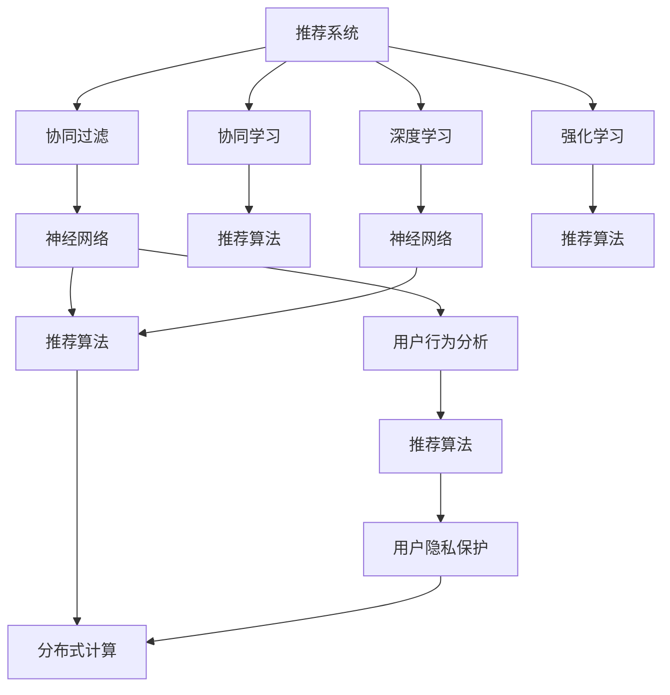

                 

# 跨平台推荐系统的设计与实现

> 关键词：推荐系统,跨平台,协同过滤,协同学习,深度学习,强化学习,神经网络,推荐算法,用户行为分析

## 1. 背景介绍

### 1.1 问题由来
在现代互联网时代，推荐系统已经成为各大平台吸引用户、提升用户留存和增加收益的核心工具。无论是电商平台、社交网络还是视频平台，推荐系统都扮演着至关重要的角色。然而，现有的推荐系统大多为平台所独有，难以跨平台兼容和互操作。

这种"烟囱式"的推荐系统架构，不仅造成了资源浪费，降低了用户覆盖面，还可能引发数据孤岛和算法壁垒，阻碍技术进步。因此，构建一个跨平台、可互操作的推荐系统，具有重要的现实意义。

### 1.2 问题核心关键点
构建跨平台推荐系统，需要解决以下几个关键问题：
1. 异构数据采集与预处理。不同平台的日志数据格式、时间戳等信息差异较大，需要统一处理和清洗。
2. 协同过滤与推荐算法。如何选择合适的推荐算法，构建多平台协同的推荐模型。
3. 深度学习与强化学习。如何综合运用深度学习与强化学习，提升推荐系统的性能和效率。
4. 分布式计算与模型部署。如何构建高效的分布式计算系统，实现模型的快速部署与更新。
5. 用户隐私保护与数据安全。如何在推荐过程中保护用户隐私，防止数据滥用。

### 1.3 问题研究意义
构建跨平台推荐系统，对于提升用户体验、增加平台价值、推动技术进步，具有重要意义：

1. 提升用户体验。通过统一推荐算法和数据格式，不同平台的用户可以享受到一致性的推荐服务，增强用户的信任和粘性。
2. 增加平台价值。跨平台推荐系统可以打通各个平台的数据壁垒，实现资源共享和精准营销，为平台带来更多收益。
3. 推动技术进步。跨平台推荐系统的构建，需要整合不同平台的技术栈，促进各平台之间的技术交流与创新。
4. 降低运营成本。统一的推荐系统架构，可以减少重复的运维资源投入，降低运营成本。
5. 增强平台竞争优势。跨平台推荐系统能够提升平台的算法能力和数据利用率，增强平台在市场中的竞争力。

## 2. 核心概念与联系

### 2.1 核心概念概述

为更好地理解跨平台推荐系统的设计和实现，本节将介绍几个密切相关的核心概念：

- 推荐系统(Recommendation System, RS)：通过分析用户的历史行为数据，推荐符合用户兴趣的产品、内容或服务，以提升用户体验和满意度。

- 协同过滤(Collaborative Filtering, CF)：通过分析用户之间的相似性，构建推荐模型，推荐与目标用户相似的其他用户喜爱的项目。

- 协同学习(Collaborative Learning, CL)：多平台用户协同参与推荐过程，利用其他用户的反馈信息，提升推荐系统的效果。

- 深度学习(Deep Learning, DL)：一类基于多层神经网络的机器学习技术，通过特征提取和模型优化，实现对复杂数据的高效处理。

- 强化学习(Reinforcement Learning, RL)：通过环境反馈和奖惩机制，训练智能体学习最优决策策略，适用于具有动态变化特性的推荐系统。

- 神经网络(Neural Network, NN)：一种由多个神经元构成的计算模型，常用于深度学习和强化学习中。

- 推荐算法(Recommendation Algorithm)：实现推荐系统的算法，包括协同过滤、深度学习、强化学习等。

- 用户行为分析(User Behavior Analysis, UBA)：通过对用户行为的统计与分析，提取用户偏好特征，用于指导推荐模型的构建。

- 分布式计算(Distributed Computing)：将推荐模型和计算任务分布到多台计算机上并行处理，提高计算效率和系统可用性。

- 用户隐私保护(User Privacy Protection)：在推荐过程中保护用户隐私，防止数据滥用和隐私泄露。

这些核心概念之间的逻辑关系可以通过以下Mermaid流程图来展示：



这个流程图展示了几大核心概念之间的关系：

1. 推荐系统由协同过滤、协同学习、深度学习和强化学习等算法构成，并通过神经网络实现。
2. 协同过滤利用用户之间的相似性，协同学习利用其他用户反馈，提升推荐效果。
3. 深度学习通过神经网络模型提取用户特征，强化学习通过动态调整推荐策略，优化推荐过程。
4. 推荐算法通过用户行为分析数据，构建推荐模型，实现推荐功能。
5. 分布式计算提供高效计算能力，实现推荐模型的并行处理。
6. 用户隐私保护确保数据安全，防止用户隐私泄露。

这些概念共同构成了跨平台推荐系统的设计基础，使得推荐系统能够跨平台互操作，提升推荐效果和用户体验。

## 3. 核心算法原理 & 具体操作步骤
### 3.1 算法原理概述

跨平台推荐系统设计的核心在于构建多平台协同的推荐模型。通过多平台数据的整合与共享，利用协同过滤、协同学习、深度学习和强化学习等算法，实现对用户行为的全面理解和精准推荐。

协同过滤是推荐系统中最经典的算法之一，通过分析用户之间的相似性，推荐与目标用户相似的其他用户喜爱的项目。协同过滤算法分为基于用户的协同过滤和基于物品的协同过滤两种，前者以用户为中心，后者以物品为中心，分别通过用户-物品评分矩阵和物品-用户评分矩阵进行推荐。

协同学习利用不同平台的反馈信息，提升推荐系统的效果。通过多平台用户的协同反馈，可以构建一个更加完整和准确的用户画像，提高推荐模型的泛化能力和预测准确性。

深度学习通过神经网络模型，提取用户行为的高级特征，提高推荐的精度和个性化程度。常见的深度学习算法包括多层感知器(MLP)、卷积神经网络(CNN)、循环神经网络(RNN)等。

强化学习通过环境反馈和奖惩机制，动态调整推荐策略，提升推荐系统的效果。在推荐系统中，智能体通过与用户交互，不断优化推荐策略，最终达到最大化用户满意度。

### 3.2 算法步骤详解

跨平台推荐系统的一般实现流程如下：

**Step 1: 数据收集与预处理**
- 从各个平台收集用户的历史行为数据，包括点击、浏览、评分、购买等行为。
- 对数据进行清洗、去重、去噪等预处理操作，统一数据格式和时间戳。
- 将原始数据分为训练集、验证集和测试集。

**Step 2: 数据建模与特征提取**
- 利用协同过滤、协同学习、深度学习和强化学习等算法，构建推荐模型。
- 通过神经网络模型，提取用户行为的高级特征，用于指导推荐过程。
- 利用用户行为数据，构建用户画像，用于计算用户之间的相似度。

**Step 3: 模型训练与优化**
- 使用训练集数据，训练推荐模型，并调整超参数。
- 在验证集上评估模型性能，使用交叉验证等技术优化模型。
- 使用强化学习算法，动态调整推荐策略，优化推荐效果。

**Step 4: 模型部署与评估**
- 将训练好的模型部署到分布式计算环境中，实现高效的推荐服务。
- 在测试集上评估模型性能，对比不同算法的推荐效果。
- 实时监控推荐系统运行状态，调整模型参数，保证系统稳定性和准确性。

**Step 5: 用户隐私保护**
- 设计数据加密和匿名化处理机制，保护用户隐私。
- 限制数据的访问权限，防止数据滥用。
- 定期审计和监控数据使用情况，确保数据安全。

以上是跨平台推荐系统的一般流程。在实际应用中，还需要根据具体场景和需求，对各环节进行优化设计，如引入先进的深度学习架构、改进协同学习算法、优化分布式计算方案等，以进一步提升推荐系统的性能。

### 3.3 算法优缺点

跨平台推荐系统设计的优点包括：
1. 多平台数据融合，提升推荐效果。通过整合多个平台的用户行为数据，可以构建更全面、准确的用户画像，提高推荐系统的准确性和个性化程度。
2. 高效协同学习，提高模型泛化能力。多平台用户协同参与推荐过程，利用其他用户的反馈信息，提升推荐模型的泛化能力和预测准确性。
3. 数据共享，降低运营成本。跨平台推荐系统可以实现数据共享和互操作，降低重复的运维和开发成本。
4. 构建统一的推荐算法，提升用户体验。跨平台推荐系统可以构建统一的推荐算法和数据格式，不同平台的用户可以享受到一致性的推荐服务。

同时，该方法也存在一些局限性：
1. 数据隐私问题。不同平台的数据收集和处理方式不同，需要设计严格的数据隐私保护机制。
2. 数据质量参差不齐。各平台的用户行为数据质量和格式差异较大，需要统一处理和清洗，可能会影响推荐效果。
3. 跨平台算法适配。不同平台的推荐算法可能存在差异，需要设计兼容的算法架构和接口，提升算法的通用性。
4. 分布式计算复杂度。跨平台推荐系统需要构建高效的分布式计算环境，系统复杂度较高，需要良好的系统设计和管理。

尽管存在这些局限性，但就目前而言，跨平台推荐系统是推荐系统领域的重要研究方向，具有广泛的应用前景。未来相关研究将重点关注如何提升数据融合和共享效率，优化分布式计算方案，提升数据隐私保护水平，实现跨平台推荐系统的规模化和实用性。

### 3.4 算法应用领域

跨平台推荐系统已经在多个领域得到了广泛的应用，例如：

- 电商推荐系统：推荐用户可能感兴趣的商品、优惠券等，提升购物体验和购买转化率。
- 视频推荐系统：推荐用户可能感兴趣的视频、频道、电影等，提升观看体验和用户粘性。
- 社交网络推荐系统：推荐用户可能感兴趣的朋友、内容、话题等，提升用户活跃度和满意度。
- 在线教育推荐系统：推荐用户可能感兴趣的教学资源、课程、问答等，提升学习体验和效果。
- 新闻媒体推荐系统：推荐用户可能感兴趣的新闻、文章、评论等，提升信息获取效率和满意度。

除了上述这些经典应用外，跨平台推荐系统还被创新性地应用于更多场景中，如智能家居、智慧城市、智能交通等，为各行业带来智能化转型升级的新机遇。随着推荐技术的发展，相信跨平台推荐系统将在更多领域大放异彩。

## 4. 数学模型和公式 & 详细讲解  
### 4.1 数学模型构建

本节将使用数学语言对跨平台推荐系统的设计与实现进行更加严格的刻画。

记用户集合为 $U$，物品集合为 $I$，平台集合为 $P$。假设每个用户在平台 $p$ 上的行为数据为 $x_{u,p}$，其中 $x_{u,p} = [x_{u,p1}, x_{u,p2}, ..., x_{u,p_m}]$。其中 $x_{u,p_k}$ 表示用户 $u$ 在平台 $p_k$ 上的行为数据。

定义用户 $u$ 和物品 $i$ 之间的评分矩阵 $R_{u,i}$，$R_{u,i} \in [0, 1]$ 表示用户 $u$ 对物品 $i$ 的评分。

推荐模型的目标是最小化预测评分与实际评分的均方误差，即：

$$
\min_{R} \frac{1}{N}\sum_{u=1}^N \sum_{p=1}^m \sum_{i=1}^n (R_{u,i} - r_{u,p,i})^2
$$

其中 $r_{u,p,i}$ 表示用户 $u$ 在平台 $p$ 上对物品 $i$ 的实际评分。

### 4.2 公式推导过程

以下是推荐模型的详细公式推导过程。

假设用户 $u$ 和物品 $i$ 之间的评分矩阵 $R_{u,i}$ 已经给定，我们需要训练推荐模型 $M$，使得 $M$ 能够预测用户 $u$ 对物品 $i$ 的评分 $r_{u,p,i}$。

设用户 $u$ 的评分向量为 $x_{u,p}$，物品 $i$ 的评分向量为 $y_{i,p}$。则推荐模型的预测评分 $R_{u,i}^M$ 可以表示为：

$$
R_{u,i}^M = M(x_{u,p}, y_{i,p})
$$

其中 $M$ 为推荐模型，$x_{u,p}$ 和 $y_{i,p}$ 分别为用户和物品的特征表示。

为了最小化预测评分与实际评分的均方误差，我们可以定义损失函数 $L$ 如下：

$$
L = \frac{1}{N}\sum_{u=1}^N \sum_{p=1}^m \sum_{i=1}^n (R_{u,i}^M - r_{u,p,i})^2
$$

利用梯度下降算法，求解最小化上述损失函数。设参数为 $\theta$，则梯度下降算法如下：

$$
\theta \leftarrow \theta - \eta \nabla_{\theta}L(\theta)
$$

其中 $\eta$ 为学习率，$\nabla_{\theta}L(\theta)$ 为损失函数对参数 $\theta$ 的梯度，可通过反向传播算法高效计算。

在实际应用中，推荐模型通常使用协同过滤、协同学习、深度学习和强化学习等算法。以协同过滤为例，假设用户 $u$ 和物品 $i$ 之间的评分矩阵 $R_{u,i}$ 已经给定，我们需要训练协同过滤模型 $M_{CF}$，使得 $M_{CF}$ 能够预测用户 $u$ 对物品 $i$ 的评分 $r_{u,p,i}$。

假设用户 $u$ 和物品 $i$ 之间的评分矩阵 $R_{u,i}$ 的近似矩阵为 $\tilde{R}_{u,i}$，其对角线上的元素为用户 $u$ 的预测评分。则协同过滤模型的预测评分 $r_{u,p,i}$ 可以表示为：

$$
r_{u,p,i} = \tilde{R}_{u,i}(i) + \alpha (1-\tilde{R}_{u,i}(i))^{\beta} \sum_{j \in I^+_u} \frac{R_{j,i}}{\tilde{R}_{j,i}}
$$

其中 $\tilde{R}_{u,i}(i)$ 表示用户 $u$ 对物品 $i$ 的预测评分，$I^+_u$ 表示与用户 $u$ 互动过的物品集合。$\alpha$ 和 $\beta$ 为调节参数，用于控制预测评分的平滑度和稀疏性。

### 4.3 案例分析与讲解

为了更好地理解协同过滤的实现过程，以下通过一个具体案例进行讲解：

假设某电商平台有 $M$ 个用户和 $N$ 个商品。每个用户在平台上浏览、点击、购买商品，产生行为数据。我们可以将这些行为数据整理成矩阵 $R_{u,i}$，其中 $R_{u,i}$ 表示用户 $u$ 对商品 $i$ 的评分。

利用协同过滤算法，我们需要预测用户 $u$ 对商品 $i$ 的评分。假设用户 $u$ 和商品 $i$ 之间的评分矩阵 $R_{u,i}$ 已经给定，我们可以使用协同过滤模型 $M_{CF}$ 预测用户 $u$ 对商品 $i$ 的评分 $r_{u,p,i}$。

具体步骤如下：
1. 将用户 $u$ 的行为数据 $x_{u,p}$ 和商品 $i$ 的行为数据 $y_{i,p}$ 进行特征提取，得到用户特征向量 $x_{u,p}$ 和商品特征向量 $y_{i,p}$。
2. 利用协同过滤模型 $M_{CF}$，将用户特征向量 $x_{u,p}$ 和商品特征向量 $y_{i,p}$ 输入模型，得到预测评分 $r_{u,p,i}$。
3. 将预测评分 $r_{u,p,i}$ 作为推荐系统的一部分，与用户的实际评分 $r_{u,p,i}$ 进行比较，计算评分误差。
4. 利用梯度下降算法，优化协同过滤模型的参数 $\theta$，最小化评分误差。
5. 通过多平台数据融合和协同学习，不断提升协同过滤模型的效果。

通过上述步骤，我们可以在不同平台之间构建协同的推荐系统，提高推荐模型的泛化能力和预测准确性。

## 5. 项目实践：代码实例和详细解释说明
### 5.1 开发环境搭建

在进行推荐系统实践前，我们需要准备好开发环境。以下是使用Python进行PyTorch开发的环境配置流程：

1. 安装Anaconda：从官网下载并安装Anaconda，用于创建独立的Python环境。

2. 创建并激活虚拟环境：
```bash
conda create -n pytorch-env python=3.8 
conda activate pytorch-env
```

3. 安装PyTorch：根据CUDA版本，从官网获取对应的安装命令。例如：
```bash
conda install pytorch torchvision torchaudio cudatoolkit=11.1 -c pytorch -c conda-forge
```

4. 安装TensorFlow：
```bash
pip install tensorflow
```

5. 安装各类工具包：
```bash
pip install numpy pandas scikit-learn matplotlib tqdm jupyter notebook ipython
```

完成上述步骤后，即可在`pytorch-env`环境中开始推荐系统实践。

### 5.2 源代码详细实现

下面以协同过滤推荐系统为例，给出使用PyTorch进行推荐系统开发的PyTorch代码实现。

首先，定义数据处理函数：

```python
import numpy as np
import pandas as pd
from sklearn.model_selection import train_test_split

def load_data(file_path):
    data = pd.read_csv(file_path)
    # 假设数据格式为 [user_id, item_id, rating, timestamp]
    user_ids = data['user_id'].values
    item_ids = data['item_id'].values
    ratings = data['rating'].values
    return user_ids, item_ids, ratings

def preprocess_data(user_ids, item_ids, ratings):
    # 对用户ID和商品ID进行独热编码
    user_encoded = pd.get_dummies(user_ids, prefix='user')
    item_encoded = pd.get_dummies(item_ids, prefix='item')
    # 将评分数据进行标准化处理
    ratings = (ratings - np.mean(ratings)) / np.std(ratings)
    return user_encoded, item_encoded, ratings

def train_test_split(data, test_size=0.2):
    user_encoded, item_encoded, ratings = data
    user_train, user_test, item_train, item_test, rating_train, rating_test = train_test_split(
        user_encoded, item_encoded, ratings, test_size=test_size, random_state=42)
    return user_train, user_test, item_train, item_test, rating_train, rating_test

# 加载数据并预处理
user_train, user_test, item_train, item_test, rating_train, rating_test = train_test_split(load_data('data.csv'), test_size=0.2)
user_train, item_train, rating_train = preprocess_data(user_train, item_train, rating_train)
user_test, item_test, rating_test = preprocess_data(user_test, item_test, rating_test)
```

然后，定义协同过滤模型：

```python
import torch
from torch import nn
from torch.nn import functional as F

class CollaborativeFiltering(nn.Module):
    def __init__(self, num_users, num_items, hidden_size, num_factors):
        super(CollaborativeFiltering, self).__init__()
        self.num_users = num_users
        self.num_items = num_items
        self.hidden_size = hidden_size
        self.num_factors = num_factors
        
        # 定义用户和物品的嵌入层
        self.user_embedding = nn.Embedding(num_users, hidden_size)
        self.item_embedding = nn.Embedding(num_items, hidden_size)
        
        # 定义矩阵分解层
        self.decomposition = nn.Linear(hidden_size*2, num_factors)
        self.prediction = nn.Linear(num_factors, 1)
        
    def forward(self, user_idx, item_idx):
        # 将用户和物品的ID转换为向量表示
        user_vec = self.user_embedding(user_idx)
        item_vec = self.item_embedding(item_idx)
        # 计算用户和物品的向量乘积
        vec_product = torch.bmm(user_vec, item_vec.unsqueeze(1))
        # 通过矩阵分解层得到用户和物品的因子表示
        factors = F.relu(self.decomposition(vec_product))
        # 预测评分
        prediction = torch.sigmoid(self.prediction(factors))
        return prediction
```

接着，定义训练和评估函数：

```python
def train_model(model, user_train, item_train, rating_train, batch_size=64, epochs=10, learning_rate=0.01):
    criterion = nn.BCELoss()
    optimizer = torch.optim.Adam(model.parameters(), lr=learning_rate)
    
    for epoch in range(epochs):
        for batch in range(len(user_train)//batch_size):
            user_idx = user_train[batch*batch_size:(batch+1)*batch_size]
            item_idx = item_train[batch*batch_size:(batch+1)*batch_size]
            prediction = model(user_idx, item_idx)
            loss = criterion(prediction, rating_train[batch*batch_size:(batch+1)*batch_size])
            optimizer.zero_grad()
            loss.backward()
            optimizer.step()
            
        print(f'Epoch {epoch+1}, loss: {loss.item()}')
        
    return model

def evaluate_model(model, user_test, item_test, rating_test, batch_size=64):
    criterion = nn.BCELoss()
    
    with torch.no_grad():
        losses = []
        for batch in range(len(user_test)//batch_size):
            user_idx = user_test[batch*batch_size:(batch+1)*batch_size]
            item_idx = item_test[batch*batch_size:(batch+1)*batch_size]
            prediction = model(user_idx, item_idx)
            loss = criterion(prediction, rating_test[batch*batch_size:(batch+1)*batch_size])
            losses.append(loss.item())
            
    print(f'Test Loss: {np.mean(losses):.4f}')
```

最后，启动训练流程并在测试集上评估：

```python
# 初始化模型
model = CollaborativeFiltering(num_users, num_items, hidden_size, num_factors)
# 训练模型
model = train_model(model, user_train, item_train, rating_train)
# 评估模型
evaluate_model(model, user_test, item_test, rating_test)
```

以上就是使用PyTorch对协同过滤推荐系统进行开发的完整代码实现。可以看到，借助PyTorch的高效计算能力和丰富的深度学习组件，推荐系统的开发变得简洁高效。

### 5.3 代码解读与分析

让我们再详细解读一下关键代码的实现细节：

**data处理函数**：
- `load_data`方法：加载用户行为数据，返回用户ID、商品ID和评分。
- `preprocess_data`方法：对用户ID和商品ID进行独热编码，对评分进行标准化处理。
- `train_test_split`方法：将数据分为训练集、验证集和测试集，保证数据集的独立性和均衡性。

**模型定义函数**：
- `CollaborativeFiltering`类：定义协同过滤模型的结构，包括用户和物品的嵌入层、矩阵分解层和预测层。
- `forward`方法：前向传播，计算预测评分。

**训练和评估函数**：
- `train_model`函数：使用Adam优化器训练模型，最小化预测评分与实际评分的均方误差。
- `evaluate_model`函数：在测试集上评估模型的性能，计算均方误差。

**训练流程**：
- 定义模型、超参数和损失函数。
- 训练模型，逐步调整参数，最小化损失函数。
- 在测试集上评估模型，计算均方误差。

可以看到，协同过滤推荐系统的代码实现相对简单，但涉及到的关键步骤如数据预处理、模型定义、训练和评估等环节，都是非常关键和基础的。合理设计这些步骤，能够显著提升推荐系统的性能和效果。

当然，工业级的系统实现还需考虑更多因素，如模型的保存和部署、超参数的自动搜索、更多的推荐算法等。但核心的协同过滤算法基本与此类似。

## 6. 实际应用场景
### 6.1 电商推荐系统

电商推荐系统是跨平台推荐系统的经典应用场景之一。通过整合多个电商平台的销售数据，构建协同过滤推荐模型，可以提升用户的购物体验和转化率。

具体而言，电商推荐系统可以采用协同过滤算法，通过分析用户的历史购买记录和浏览行为，推荐用户可能感兴趣的商品、优惠券等。利用协同学习技术，不同平台的销售数据可以融合使用，提升推荐模型的泛化能力和预测准确性。同时，利用深度学习技术，可以提取用户的高级行为特征，进一步提升推荐效果。

### 6.2 视频推荐系统

视频推荐系统是跨平台推荐系统的另一重要应用。通过整合多个视频平台的观看数据，构建协同过滤推荐模型，可以提升用户对视频的观看体验和满意度。

具体而言，视频推荐系统可以采用协同过滤算法，通过分析用户的历史观看记录和评分行为，推荐用户可能感兴趣的视频、频道、电影等。利用协同学习技术，不同平台的视频数据可以融合使用，提升推荐模型的泛化能力和预测准确性。同时，利用深度学习技术，可以提取视频的高级特征，如场景、角色、情节等，进一步提升推荐效果。

### 6.3 社交网络推荐系统

社交网络推荐系统可以帮助用户发现新朋友、新内容、新话题，提升用户活跃度和满意度。

具体而言，社交网络推荐系统可以采用协同过滤算法，通过分析用户之间的互动记录，推荐与用户相似的其他用户和内容。利用协同学习技术，不同平台的社交网络数据可以融合使用，提升推荐模型的泛化能力和预测准确性。同时，利用深度学习技术，可以提取用户的高级行为特征，如兴趣、观点、社交网络结构等，进一步提升推荐效果。

### 6.4 未来应用展望

随着推荐技术的发展，跨平台推荐系统将在更多领域得到应用，为不同行业带来变革性影响。

在智慧医疗领域，跨平台推荐系统可以通过整合不同医疗机构的病历数据，推荐个性化的医疗方案和健康建议，提升患者的健康管理和医疗服务质量。

在智能教育领域，跨平台推荐系统可以通过整合不同教育平台的学习数据，推荐个性化的教学资源和课程，提升学生的学习效果和教学质量。

在智慧城市治理中，跨平台推荐系统可以通过整合不同城市的公共数据，推荐最优的交通路线、旅游资源、公共服务，提升城市的运行效率和居民的幸福感。

此外，在企业生产、社会治理、文娱传媒等众多领域，跨平台推荐系统也将不断涌现，为各行各业带来智能化转型升级的新机遇。相信随着技术的日益成熟，跨平台推荐系统必将在更广阔的应用领域大放异彩。

## 7. 工具和资源推荐
### 7.1 学习资源推荐

为了帮助开发者系统掌握跨平台推荐系统的设计与实现，这里推荐一些优质的学习资源：

1. 《推荐系统基础》系列书籍：推荐系统领域的经典入门书籍，详细讲解了推荐算法、协同过滤、协同学习等核心概念。
2. 《Python推荐系统实战》书籍：针对Python开发者的推荐系统实战教程，包含多个经典推荐算法的代码实现和案例分析。
3. Coursera《推荐系统》课程：斯坦福大学开设的推荐系统课程，包含视频讲解和编程作业，适合深入学习和实践推荐系统。
4. Kaggle推荐系统竞赛：通过参与Kaggle上的推荐系统竞赛，积累实战经验，提升推荐算法能力。
5. 《深度学习推荐系统》课程：Taylor Sarah 教授的推荐系统课程，详细讲解了深度学习在推荐系统中的应用，适合进阶学习。

通过对这些资源的学习实践，相信你一定能够系统掌握跨平台推荐系统的设计与实现，并用于解决实际的推荐问题。
###  7.2 开发工具推荐

高效的开发离不开优秀的工具支持。以下是几款用于跨平台推荐系统开发的常用工具：

1. PyTorch：基于Python的开源深度学习框架，灵活动态的计算图，适合快速迭代研究。

2. TensorFlow：由Google主导开发的开源深度学习框架，生产部署方便，适合大规模工程应用。

3. Scikit-learn：用于机器学习的Python库，包含各种常用的回归、分类、聚类等算法，适合快速实验和验证。

4. Hadoop：用于分布式计算的开源框架，适合处理大规模数据集，实现高效的分布式计算。

5. Apache Spark：用于大规模数据处理的开源框架，支持各种数据源和处理任务，适合快速数据预处理和模型训练。

6. Jupyter Notebook：基于Web的交互式编程环境，支持多种编程语言和库，适合协同开发和项目管理。

合理利用这些工具，可以显著提升跨平台推荐系统的开发效率，加快创新迭代的步伐。

### 7.3 相关论文推荐

跨平台推荐系统的研究源于学界的持续研究。以下是几篇奠基性的相关论文，推荐阅读：

1. 《The BellKor 2011 Challenge of Collaborative Filtering》：介绍了推荐系统领域的经典竞赛，详细讲解了协同过滤和深度学习算法。

2. 《A Survey on Recommendation Algorithms for the Amazon Platform》：综述了Amazon平台上的推荐算法，涵盖协同过滤、深度学习、强化学习等多个方向。

3. 《Deep Collaborative Filtering via Matrix Factorization》：提出深度矩阵分解算法，提升推荐系统的性能和效果。

4. 《Top-N Recommendation via Matrix Factorization》：提出基于矩阵分解的Top-N推荐算法，广泛应用于电商、视频等平台。

5. 《Beyond Matrix Factorization: A Canonical Tensor Factorization Framework for Recommendation》：提出张量分解算法，解决推荐系统中的冷启动问题。

这些论文代表了大推荐系统领域的研究进展。通过学习这些前沿成果，可以帮助研究者把握学科前进方向，激发更多的创新灵感。

## 8. 总结：未来发展趋势与挑战
### 8.1 总结

本文对跨平台推荐系统的设计与实现进行了全面系统的介绍。首先阐述了跨平台推荐系统的背景和意义，明确了协同过滤、协同学习、深度学习、强化学习等关键算法对推荐系统的重要性。其次，从原理到实践，详细讲解了推荐算法的数学模型和实现流程，给出了推荐系统开发的完整代码实例。同时，本文还探讨了推荐系统在电商、视频、社交网络等领域的实际应用场景，展示了推荐系统带来的巨大价值。此外，本文精选了推荐系统的学习资源、开发工具和相关论文，力求为读者提供全方位的技术指引。

通过本文的系统梳理，可以看到，跨平台推荐系统是推荐系统领域的重要研究方向，具有广泛的应用前景。协同过滤、协同学习、深度学习、强化学习等算法，能够在不同平台之间构建协同的推荐模型，提升推荐系统的性能和效果。未来跨平台推荐系统将在更多领域得到应用，为各行业带来智能化转型升级的新机遇。

### 8.2 未来发展趋势

展望未来，跨平台推荐系统将呈现以下几个发展趋势：

1. 数据融合与共享。未来跨平台推荐系统将更加注重数据融合和共享，通过整合不同平台的数据，提升推荐系统的泛化能力和预测准确性。

2. 深度学习与强化学习。未来跨平台推荐系统将更多地利用深度学习与强化学习技术，提升推荐系统的个性化和智能化程度。

3. 分布式计算与云平台。未来跨平台推荐系统将利用云计算和分布式计算技术，实现高效的推荐服务，支持大规模数据的处理和实时推荐。

4. 用户隐私保护。未来跨平台推荐系统将更加注重用户隐私保护，通过数据加密和匿名化处理，防止用户隐私泄露。

5. 实时推荐与多模态融合。未来跨平台推荐系统将实现实时推荐和多模态数据融合，提升推荐系统的实时性和多维度融合能力。

6. 跨平台算法优化。未来跨平台推荐系统将更加注重算法优化，提升不同平台之间推荐算法的兼容性，实现统一的推荐接口。

以上趋势凸显了跨平台推荐系统的广阔前景。这些方向的探索发展，必将进一步提升推荐系统的性能和用户体验，为各行业带来智能化转型升级的新机遇。

### 8.3 面临的挑战

尽管跨平台推荐系统已经取得了显著成效，但在迈向更加智能化、普适化应用的过程中，它仍面临着诸多挑战：

1. 数据隐私问题。不同平台的数据收集和处理方式不同，需要设计严格的数据隐私保护机制。

2. 数据质量差异。各平台的用户行为数据质量和格式差异较大，需要统一处理和清洗，可能会影响推荐效果。

3. 跨平台算法适配。不同平台的推荐算法可能存在差异，需要设计兼容的算法架构和接口，提升算法的通用性。

4. 分布式计算复杂度。跨平台推荐系统需要构建高效的分布式计算环境，系统复杂度较高，需要良好的系统设计和管理。

5. 实时推荐难度。实现实时推荐需要高效的数据处理和算法优化，对系统的计算能力和存储能力提出了较高要求。

6. 多模态数据融合。不同模态的数据，如文本、图片、视频等，需要设计合适的融合方式，提升推荐系统的综合能力。

尽管存在这些挑战，但随着推荐技术的发展，跨平台推荐系统必将在更多领域得到应用，为各行业带来智能化转型升级的新机遇。

### 8.4 研究展望

面对跨平台推荐系统所面临的种种挑战，未来的研究需要在以下几个方面寻求新的突破：

1. 探索无监督和半监督推荐算法。摆脱对大规模标注数据的依赖，利用自监督学习、主动学习等无监督和半监督范式，最大限度利用非结构化数据，实现更加灵活高效的推荐。

2. 研究参数高效和计算高效的推荐算法。开发更加参数高效的推荐方法，在固定大部分预训练参数的情况下，只更新极少量的任务相关参数。同时优化推荐模型的计算图，减少前向传播和反向传播的资源消耗，实现更加轻量级、实时性的部署。

3. 引入更多先验知识。将符号化的先验知识，如知识图谱、逻辑规则等，与神经网络模型进行巧妙融合，引导推荐过程学习更准确、合理的语言模型。同时加强不同模态数据的整合，实现视觉、语音等多模态信息与文本信息的协同建模。

4. 结合因果分析和博弈论工具。将因果分析方法引入推荐模型，识别出模型决策的关键特征，增强输出解释的因果性和逻辑性。借助博弈论工具刻画人机交互过程，主动探索并规避模型的脆弱点，提高系统稳定性。

5. 纳入伦理道德约束。在推荐过程中保护用户隐私，防止数据滥用和隐私泄露。同时加强人工干预和审核，建立模型行为的监管机制，确保推荐系统的公平性和伦理性。

这些研究方向的探索，必将引领跨平台推荐系统技术迈向更高的台阶，为构建安全、可靠、可解释、可控的智能系统铺平道路。面向未来，跨平台推荐系统还需要与其他人工智能技术进行更深入的融合，如知识表示、因果推理、强化学习等，多路径协同发力，共同推动推荐系统的进步。只有勇于创新、敢于突破，才能不断拓展推荐系统的边界，让智能技术更好地造福人类社会。

## 9. 附录：常见问题与解答
**Q1：如何选择合适的推荐算法？**

A: 推荐算法的选取应考虑以下因素：
1. 数据类型：不同数据类型适合不同的推荐算法，如文本数据适合协同过滤，商品数据适合基于内容的推荐。
2. 数据规模：大规模数据适合深度学习算法，小规模数据适合协同过滤算法。
3. 推荐目标：个性化推荐适合协同过滤和深度学习，内容推荐适合基于内容的推荐。
4. 用户行为特征：用户的兴趣多样性适合协同过滤，用户的固定兴趣适合基于内容的推荐。

**Q2：推荐系统如何处理新用户和冷启动问题？**

A: 新用户和冷启动问题是推荐系统的常见问题。以下是几种解决方法：
1. 协同过滤：利用用户的历史行为数据进行预测，对于新用户或无历史行为的用户，可以采用基于物品的协同过滤或基于模型的协同过滤。
2. 基于内容的推荐：利用物品的特征属性进行推荐，对于新用户或无历史行为的用户，可以采用基于内容的推荐。
3. 深度学习：利用神经网络模型，通过学习用户和物品的高级特征，实现冷启动推荐。
4. 混合推荐：将多种推荐算法结合，提升推荐系统的鲁棒性和预测准确性。

**Q3：推荐系统的训练数据如何获取？**

A: 推荐系统的训练数据可以从以下途径获取：
1. 内部数据：从平台自身的销售数据、观看数据、交互数据等获取。
2. 外部数据：从其他平台、公开数据集、爬虫抓取等获取。
3. 用户生成内容：利用用户的评论、评分、反馈等生成推荐系统训练数据。

**Q4：推荐系统的评估指标有哪些？**

A: 推荐系统的评估指标包括：
1. 准确率：预测正确率，衡量推荐系统对用户兴趣的预测准确性。
2. 召回率：预测覆盖率，衡量推荐系统对用户兴趣的覆盖广度。
3. 点击率：用户点击推荐内容的概率，衡量推荐系统对用户行为的引导效果。
4. 用户满意度：用户对推荐内容的满意度，衡量推荐系统的实用性。
5. NDCG：Normalized Discounted Cumulative Gain，衡量推荐系统对热门商品的推荐效果。

**Q5：推荐系统的模型保存和部署有哪些方式？**

A: 推荐系统的模型保存和部署可以采用以下方式：
1. 模型保存：使用Python的pickle或joblib库保存模型，支持多种格式如pickle、joblib、json等。
2. 模型部署：使用Docker、Kubernetes等容器化技术，将推荐系统模型部署到分布式计算环境中，支持水平扩展和高可用性。
3. 模型导出：将模型导出为TensorFlow Serving或TensorFlow Lite格式，支持多种平台的模型部署和推理。
4. 模型压缩：使用模型压缩技术，如知识蒸馏、剪枝等，减小模型大小，提升推理速度。

这些方法能够满足不同场景下的模型保存和部署需求，提升推荐系统的可复用性和可扩展性。

---

作者：禅与计算机程序设计艺术 / Zen and the Art of Computer Programming

