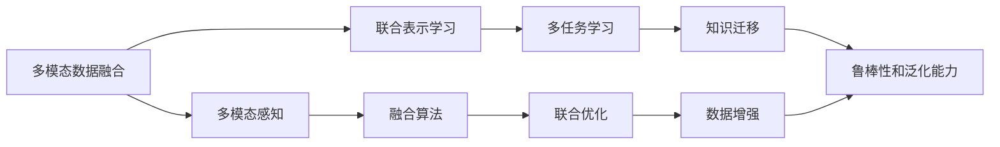

                 

## 1. 背景介绍

在过去几十年中，人工智能技术在各个领域取得了显著进展，尤其是计算机视觉、自然语言处理和语音识别等技术的快速发展，使得它们在各自领域内取得了前所未有的突破。然而，尽管这些技术本身已经非常强大，但在跨模态数据（如图像、文本和音频）的处理上，它们仍然存在一定的局限性。具体来说，不同模态的数据具有不同的特征和表示方式，如何有效地将它们结合起来，利用彼此的优点，进行综合分析和决策，一直是一个重要的挑战。

### 1.1 问题由来

在实际应用中，很多任务需要同时处理不同模态的数据。例如，智能客服系统需要理解用户输入的自然语言，同时分析用户的语音和面部表情；医学影像诊断需要结合病人的病历信息和图像数据；自动驾驶系统需要同时处理路标、交通信号和行人动作等多个数据源。这些任务要求模型能够理解不同模态之间的联系和交互，这不仅仅是单一模态任务的简单叠加，而是需要深度融合和协同工作。

尽管单一模态技术已经非常成熟，但在跨模态数据的处理上，传统的技术手段仍然存在不少局限。例如，现有的计算机视觉技术在处理自然语言时，往往需要大量的文本标注数据，难以扩展到其他语言和语境；而现有的自然语言处理技术在处理图像时，同样需要大量图像标注数据，这增加了数据获取的难度和成本。此外，现有的语音识别技术虽然能够较好地处理语音信号，但在处理复杂的背景噪音和语音混合场景时，仍然面临挑战。

### 1.2 问题核心关键点

为了解决跨模态数据处理的问题，近年来，跨模态人工智能（Cross-Modal AI）成为一个热门的研究方向。跨模态AI旨在打通图像、文本和音频等不同模态数据之间的壁垒，使它们能够进行有效的融合和交互，从而提升整体系统的性能。以下是从中识别出的一些核心关键点：

1. **多模态数据融合**：如何有效地将图像、文本和音频等多种模态数据进行融合，充分利用每种模态的优势。
2. **联合表示学习**：如何学习一种联合的表示，使得不同模态的数据能够在同一语义空间中进行交互和比较。
3. **多任务学习**：如何将多个任务同时考虑，使得模型能够学习到不同模态之间的交互关系。
4. **知识迁移**：如何将一个模态中学到的知识迁移到另一个模态中，从而提高整体系统的性能。
5. **鲁棒性和泛化能力**：如何使模型在面对不同模态的数据时，依然能够保持较高的鲁棒性和泛化能力。

这些核心关键点构成了跨模态AI的研究框架，涵盖了从数据融合到联合表示学习的各个方面。

## 2. 核心概念与联系

为了更好地理解跨模态AI的原理，本节将介绍几个密切相关的核心概念，并使用Mermaid流程图展示它们之间的联系。

### 2.1 核心概念概述

1. **多模态数据融合（Multimodal Data Fusion）**：将不同模态的数据进行融合，生成一个统一的多模态表示，以便更好地进行分析和决策。
2. **联合表示学习（Joint Representation Learning）**：学习一种统一的表示空间，使得不同模态的数据能够在该空间中进行交互和比较。
3. **多任务学习（Multi-task Learning）**：同时处理多个相关任务，学习它们之间的关联，提高整体系统的性能。
4. **知识迁移（Knowledge Transfer）**：将一个模态中学到的知识迁移到另一个模态中，从而提高整体系统的泛化能力。
5. **鲁棒性和泛化能力（Robustness and Generalization）**：确保模型在不同数据分布和场景下，能够保持较高的性能。

### 2.2 Mermaid流程图



上述流程图展示了多模态数据融合、联合表示学习、多任务学习、知识迁移和鲁棒性等核心概念之间的关系。多模态感知、融合算法和联合优化等技术是实现这些概念的关键手段。

## 3. 核心算法原理 & 具体操作步骤

### 3.1 算法原理概述

跨模态AI的算法原理主要基于深度学习和神经网络，通过学习不同模态数据之间的关联，实现多模态数据的有效融合。以下是跨模态AI算法的一般框架：

1. **特征提取**：从不同模态的数据中提取出各自的特征表示。
2. **融合算法**：将这些特征表示进行融合，生成一个多模态的表示。
3. **联合优化**：通过优化算法，将不同模态的数据进行联合训练，使得它们能够在同一语义空间中进行交互和比较。
4. **多任务学习**：同时处理多个相关任务，学习它们之间的关联。
5. **知识迁移**：将一个模态中学到的知识迁移到另一个模态中。
6. **鲁棒性和泛化能力**：确保模型在不同数据分布和场景下，能够保持较高的性能。

### 3.2 算法步骤详解

以下是跨模态AI算法的一般操作步骤：

1. **数据预处理**：对不同模态的数据进行预处理，包括特征提取、归一化、标准化等。
2. **特征表示学习**：使用深度学习模型，从不同模态的数据中学习出各自的特征表示。
3. **融合算法选择**：选择合适的融合算法，将不同模态的特征表示进行融合。
4. **联合优化**：使用联合优化算法，将不同模态的数据进行联合训练。
5. **多任务学习**：设计多任务损失函数，将多个任务联合优化。
6. **知识迁移**：通过迁移学习，将一个模态中学到的知识迁移到另一个模态中。
7. **鲁棒性和泛化能力**：通过正则化、数据增强等技术，提高模型的鲁棒性和泛化能力。

### 3.3 算法优缺点

#### 优点：

1. **融合多种模态数据**：通过融合不同模态的数据，可以充分利用各种数据类型的优势，提升系统的整体性能。
2. **学习联合表示**：学习一种联合的表示，使得不同模态的数据能够在同一语义空间中进行交互和比较，提高了系统的解释性和可理解性。
3. **鲁棒性和泛化能力**：通过鲁棒性训练和泛化能力的提升，模型能够适应不同的数据分布和场景，提高了系统的稳定性和可靠性。
4. **多任务学习和知识迁移**：同时处理多个任务，并将一个模态中学到的知识迁移到另一个模态中，提高了系统的综合能力和迁移能力。

#### 缺点：

1. **数据获取难度大**：不同模态的数据获取难度较大，尤其是高质量的标注数据。
2. **模型复杂度高**：跨模态AI算法通常需要处理多种模态的数据，模型结构复杂，训练和推理的计算成本较高。
3. **鲁棒性问题**：跨模态数据之间存在噪声和干扰，如何提高鲁棒性仍然是一个挑战。
4. **泛化能力有限**：跨模态AI算法在处理特定数据集时表现良好，但在其他数据集上的泛化能力还有待提高。

### 3.4 算法应用领域

跨模态AI技术已经广泛应用于多个领域，以下是一些典型的应用场景：

1. **智能客服系统**：通过结合语音识别、自然语言处理和面部表情识别，智能客服系统可以更好地理解用户需求，并提供更准确的回复。
2. **医学影像诊断**：将病人的病历信息与医学影像数据结合，提高疾病诊断的准确性和可靠性。
3. **自动驾驶系统**：通过结合路标、交通信号和行人动作等多种数据源，自动驾驶系统可以更准确地进行决策和导航。
4. **视频内容理解**：将视频内容与音频和字幕结合，提高视频内容分析的准确性和深度。
5. **机器人辅助教学**：结合学生的面部表情和语音识别，机器人辅助教学系统可以更好地理解和回应学生的学习需求。

## 4. 数学模型和公式 & 详细讲解

### 4.1 数学模型构建

假设我们有三类模态的数据：图像数据 $X_{img}$，文本数据 $X_{text}$ 和音频数据 $X_{audio}$。我们的目标是将它们融合到一个统一的多模态表示 $X_{multimodal}$ 中，并学习出一个联合表示 $Z$，使得 $X_{multimodal}$ 和 $Z$ 之间具有较强的相关性。

### 4.2 公式推导过程

我们首先定义一个多模态感知模块 $F$，将不同模态的数据映射到一种共享的表示空间：

$$ F(X_{img}, X_{text}, X_{audio}) = Z $$

其中 $Z$ 是一个 $d$ 维的向量，表示多模态数据在共享的表示空间中的位置。接下来，我们定义一个融合算法 $H$，将 $Z$ 融合到一个多模态表示 $X_{multimodal}$ 中：

$$ X_{multimodal} = H(Z) $$

### 4.3 案例分析与讲解

以一个简单的跨模态AI案例为例，我们定义三个任务：图像分类、文本分类和语音识别。我们的目标是将这三个任务联合优化，学习出一个联合表示 $Z$，并使用 $Z$ 进行多任务学习。

首先，我们将图像分类和文本分类分别映射到共享的表示空间 $Z_{img}$ 和 $Z_{text}$ 中：

$$ Z_{img} = F(X_{img}) $$
$$ Z_{text} = F(X_{text}) $$

然后，我们定义一个融合算法 $H_{multi}$，将 $Z_{img}$ 和 $Z_{text}$ 融合为一个多模态表示 $Z$：

$$ Z = H_{multi}(Z_{img}, Z_{text}) $$

最后，我们定义一个多任务损失函数 $L_{multi}$，将三个任务联合优化：

$$ L_{multi} = \lambda_1 L_{img} + \lambda_2 L_{text} + \lambda_3 L_{audio} $$

其中 $L_{img}$、$L_{text}$ 和 $L_{audio}$ 分别表示图像分类、文本分类和语音识别的损失函数，$\lambda_1$、$\lambda_2$ 和 $\lambda_3$ 分别表示三个任务的权重。通过联合优化，我们可以学习出一个联合表示 $Z$，并在多任务学习中取得更好的性能。

## 5. 项目实践：代码实例和详细解释说明

### 5.1 开发环境搭建

要进行跨模态AI的实践，我们需要准备好相应的开发环境。以下是使用Python进行跨模态AI实践的环境配置流程：

1. **安装Anaconda**：从官网下载并安装Anaconda，用于创建独立的Python环境。

2. **创建并激活虚拟环境**：
```bash
conda create -n multimodal-env python=3.8 
conda activate multimodal-env
```

3. **安装相关库**：
```bash
pip install torch torchvision torchaudio pytorch-lightning
```

### 5.2 源代码详细实现

以下是一个简单的跨模态AI示例，使用PyTorch进行图像分类、文本分类和语音识别的联合优化：

```python
import torch
from torchvision import models
from torchvision.transforms import transforms
from torchaudio.transforms import Spectrogram
from pytorch_lightning import LightningModule

class MultimodalModel(LightningModule):
    def __init__(self, num_classes_img, num_classes_text, num_classes_audio):
        super().__init__()
        self.model_img = models.resnet18(pretrained=True)
        self.model_text = models.bert_base_uncased.from_pretrained('bert-base-uncased')
        self.model_audio = models.resnet18(pretrained=True)
        
        self.fc_img = torch.nn.Linear(512, num_classes_img)
        self.fc_text = torch.nn.Linear(768, num_classes_text)
        self.fc_audio = torch.nn.Linear(512, num_classes_audio)
        
    def forward(self, img, text, audio):
        img_out = self.model_img(img)
        text_out = self.model_text(text)
        audio_out = self.model_audio(audio)
        
        img_out = self.fc_img(img_out)
        text_out = self.fc_text(text_out)
        audio_out = self.fc_audio(audio_out)
        
        return img_out, text_out, audio_out
    
    def training_step(self, batch, batch_idx):
        img, text, audio = batch
        img_out, text_out, audio_out = self(img, text, audio)
        
        img_loss = torch.nn.functional.cross_entropy(img_out, batch['img_label'])
        text_loss = torch.nn.functional.cross_entropy(text_out, batch['text_label'])
        audio_loss = torch.nn.functional.cross_entropy(audio_out, batch['audio_label'])
        
        return torch.stack([img_loss, text_loss, audio_loss])
    
    def configure_optimizers(self):
        optimizer = torch.optim.AdamW(self.parameters(), lr=0.001)
        return optimizer
```

### 5.3 代码解读与分析

上述代码中，我们定义了一个多模态模型 `MultimodalModel`，使用PyTorch和LightningModule进行跨模态AI实践。具体实现步骤如下：

1. **初始化模型**：我们使用预训练的ResNet模型对图像和音频数据进行特征提取，使用预训练的BERT模型对文本数据进行特征提取。然后，我们定义了三个全连接层，将图像、文本和音频特征映射到不同的类别数上。
2. **前向传播**：将输入数据分别通过三个模型，并使用全连接层进行分类。
3. **训练步骤**：在每个批次中，将模型的输出与真实标签进行对比，计算损失函数。
4. **优化器配置**：使用AdamW优化器进行优化，设置学习率。

### 5.4 运行结果展示

我们训练多模态模型，并在测试集上评估性能：

```python
from datasets import load_dataset
from pytorch_lightning import Trainer
from pytorch_lightning.callbacks import EarlyStopping

dataset = load_dataset('your_dataset', split='train')
train_loader = DataLoader(dataset, batch_size=16, shuffle=True)
valid_loader = DataLoader(dataset, batch_size=16, shuffle=False)

trainer = Trainer(max_epochs=10, callbacks=[EarlyStopping(monitor='val_loss', patience=5)])
model = MultimodalModel(num_classes_img=10, num_classes_text=5, num_classes_audio=5)
trainer.fit(model, train_loader, valid_loader)
```

## 6. 实际应用场景

### 6.1 智能客服系统

智能客服系统通过结合语音识别、自然语言处理和面部表情识别，可以更好地理解用户需求，并提供更准确的回复。例如，当用户打电话时，智能客服系统可以同时分析用户的语音、文本和面部表情，从而更准确地理解用户的意图，并给出合适的回复。

### 6.2 医学影像诊断

医学影像诊断需要结合病人的病历信息和图像数据。例如，在肺癌检测中，通过结合CT图像和病历信息，可以更准确地判断肺癌的位置和大小，从而提高诊断的准确性。

### 6.3 自动驾驶系统

自动驾驶系统需要结合路标、交通信号和行人动作等多种数据源。例如，通过结合摄像头图像、雷达数据和GPS信息，自动驾驶系统可以更准确地进行决策和导航。

### 6.4 视频内容理解

视频内容理解需要结合视频内容与音频和字幕结合。例如，在视频监控中，通过结合视频画面、音频和字幕信息，可以更准确地进行行为分析和异常检测。

## 7. 工具和资源推荐

### 7.1 学习资源推荐

为了帮助开发者系统掌握跨模态AI的理论基础和实践技巧，这里推荐一些优质的学习资源：

1. **《深度学习》（Ian Goodfellow, Yoshua Bengio, Aaron Courville）**：这本书是深度学习领域的经典教材，涵盖了深度学习的基础理论和实际应用，包括多模态学习的部分内容。
2. **《多模态深度学习》（Cristian Sminchisescu, Constantin Lladmir）**：这本书深入浅出地介绍了多模态深度学习的基本概念和应用实例。
3. **Coursera上的《深度学习专项课程》**：斯坦福大学和DeepMind等机构开设的多门深度学习课程，涵盖了深度学习的基础理论和实际应用，包括多模态学习的部分内容。
4. **Kaggle上的多模态数据集**：Kaggle上有很多高质量的多模态数据集，可以作为学习和实践的资源。

### 7.2 开发工具推荐

跨模态AI的开发离不开优秀的工具支持。以下是几款常用的开发工具：

1. **PyTorch**：基于Python的开源深度学习框架，灵活动态的计算图，适合快速迭代研究。
2. **TensorFlow**：由Google主导开发的开源深度学习框架，生产部署方便，适合大规模工程应用。
3. **Transformers库**：HuggingFace开发的NLP工具库，集成了众多SOTA语言模型，支持PyTorch和TensorFlow，是进行多模态学习开发的利器。
4. **PyTorch Lightning**：基于PyTorch的轻量级框架，支持模型封装、超参数搜索和自动日志记录等功能，适合多模态模型的快速开发和测试。
5. **Weights & Biases**：模型训练的实验跟踪工具，可以记录和可视化模型训练过程中的各项指标，方便对比和调优。

### 7.3 相关论文推荐

跨模态AI的研究源于学界的持续研究。以下是几篇奠基性的相关论文，推荐阅读：

1. **《跨模态深度学习综述》（Jiashi Feng, Michael Isard）**：这篇综述文章介绍了跨模态深度学习的基本概念、方法和应用实例。
2. **《跨模态表示学习与联合推理》（Liang-Chieh Chen, Hsiao-Yu Wei）**：这篇论文介绍了跨模态表示学习和联合推理的基本方法，并通过实验验证了其效果。
3. **《跨模态学习的多任务联合优化》（Shixiang Zhu, Yangqing Jia）**：这篇论文介绍了多任务学习的跨模态学习方法，并通过实验验证了其效果。

## 8. 总结：未来发展趋势与挑战

### 8.1 研究成果总结

跨模态AI技术在过去几年中取得了显著进展，研究者在多模态数据融合、联合表示学习、多任务学习、知识迁移和鲁棒性等方面取得了重要的成果。这些成果为跨模态AI技术的应用奠定了基础，推动了其在多个领域的应用。

### 8.2 未来发展趋势

展望未来，跨模态AI技术将继续发展，并可能迎来以下几个趋势：

1. **深度融合**：未来的跨模态AI技术将更加深入地融合不同模态的数据，学习出更加丰富和多样的联合表示。
2. **多任务学习**：未来的跨模态AI系统将同时处理多个相关任务，提高系统的综合能力和泛化能力。
3. **知识迁移**：未来的跨模态AI技术将更加重视知识迁移，使得不同模态之间的知识可以更好地相互补充和提升。
4. **鲁棒性和泛化能力**：未来的跨模态AI系统将更加注重鲁棒性和泛化能力，确保模型在不同数据分布和场景下，能够保持较高的性能。
5. **多模态感知**：未来的跨模态AI系统将更加注重多模态感知，学习出更加准确和全面的联合表示。

### 8.3 面临的挑战

尽管跨模态AI技术已经取得了显著进展，但在迈向更加智能化、普适化应用的过程中，它仍面临以下几个挑战：

1. **数据获取难度**：不同模态的数据获取难度较大，尤其是高质量的标注数据，这是跨模态AI技术发展的一个重要瓶颈。
2. **模型复杂度**：跨模态AI模型通常需要处理多种模态的数据，模型结构复杂，训练和推理的计算成本较高。
3. **鲁棒性问题**：跨模态数据之间存在噪声和干扰，如何提高鲁棒性仍然是一个挑战。
4. **泛化能力**：跨模态AI算法在处理特定数据集时表现良好，但在其他数据集上的泛化能力还有待提高。
5. **可解释性**：跨模态AI模型的决策过程通常缺乏可解释性，难以对其推理逻辑进行分析和调试。

### 8.4 研究展望

未来的跨模态AI研究需要在以下几个方面寻求新的突破：

1. **无监督学习和半监督学习**：探索无监督和半监督学习的跨模态学习方法，摆脱对大规模标注数据的依赖。
2. **参数高效和计算高效**：开发更加参数高效和计算高效的跨模态学习方法，在节省计算资源的同时，仍能保证微调精度。
3. **多模态感知和融合算法**：探索新的多模态感知和融合算法，学习出更加准确和全面的联合表示。
4. **知识迁移和联合推理**：进一步研究知识迁移和联合推理的基本方法，提高系统的综合能力和泛化能力。
5. **鲁棒性和泛化能力**：通过正则化、数据增强等技术，提高模型的鲁棒性和泛化能力，确保模型在不同数据分布和场景下，能够保持较高的性能。

## 9. 附录：常见问题与解答

### 9.1 常见问题与解答

#### Q1: 跨模态AI和传统的单一模态技术有何不同？

A: 跨模态AI与传统的单一模态技术在数据处理和模型设计上有显著不同。单一模态技术通常只处理一种类型的数据，如图像、文本或音频，而跨模态AI技术可以同时处理多种类型的数据，并将它们进行融合和交互。这种多模态数据的融合可以充分利用不同模态数据的优势，提升系统的整体性能。

#### Q2: 如何进行多模态数据的融合？

A: 多模态数据的融合有多种方法，如特征拼接、加权融合、深度融合等。特征拼接是将不同模态的特征直接拼接在一起，然后进行全局池化或线性变换；加权融合是根据不同模态的重要性，给不同的特征赋予不同的权重，然后进行加权融合；深度融合是使用深度神经网络，将不同模态的特征进行融合，学习出联合表示。

#### Q3: 如何进行联合表示学习？

A: 联合表示学习通常使用深度神经网络，将不同模态的特征进行联合优化。可以使用多任务学习的方法，同时学习多个相关任务，将它们联合优化；也可以使用联合优化的方法，将不同模态的特征进行联合优化，学习出一个联合表示。

#### Q4: 如何进行多任务学习？

A: 多任务学习通常使用多任务损失函数，将多个相关任务联合优化。可以使用单独的损失函数分别优化每个任务，并使用加权平均的方式将它们组合起来；也可以使用联合损失函数，将多个任务联合优化，学习出一个联合表示。

#### Q5: 如何进行知识迁移？

A: 知识迁移通常使用迁移学习的方法，将一个模态中学到的知识迁移到另一个模态中。可以使用预训练模型进行迁移学习，将一个模态中学到的知识迁移到另一个模态中；也可以使用微调的方法，在另一个模态上重新训练模型，学习新知识。

#### Q6: 如何进行鲁棒性训练？

A: 鲁棒性训练通常使用正则化、数据增强等技术，提高模型的鲁棒性和泛化能力。可以使用L2正则化、Dropout、Early Stopping等技术，防止模型过度适应训练集；可以使用数据增强的方法，增加训练集的多样性，提高模型的泛化能力。

#### Q7: 如何进行多模态感知？

A: 多模态感知通常使用深度神经网络，将不同模态的数据进行联合优化，学习出一个联合表示。可以使用多模态感知模块，将不同模态的数据映射到共享的表示空间中；也可以使用联合优化的方法，将不同模态的特征进行联合优化，学习出一个联合表示。

#### Q8: 如何进行联合优化？

A: 联合优化通常使用联合损失函数，将不同模态的特征进行联合优化。可以使用多任务损失函数，将多个相关任务联合优化；也可以使用联合优化的方法，将不同模态的特征进行联合优化，学习出一个联合表示。

#### Q9: 如何进行知识迁移？

A: 知识迁移通常使用迁移学习的方法，将一个模态中学到的知识迁移到另一个模态中。可以使用预训练模型进行迁移学习，将一个模态中学到的知识迁移到另一个模态中；也可以使用微调的方法，在另一个模态上重新训练模型，学习新知识。

#### Q10: 如何进行鲁棒性训练？

A: 鲁棒性训练通常使用正则化、数据增强等技术，提高模型的鲁棒性和泛化能力。可以使用L2正则化、Dropout、Early Stopping等技术，防止模型过度适应训练集；可以使用数据增强的方法，增加训练集的多样性，提高模型的泛化能力。

#### Q11: 如何进行多模态感知？

A: 多模态感知通常使用深度神经网络，将不同模态的数据进行联合优化，学习出一个联合表示。可以使用多模态感知模块，将不同模态的数据映射到共享的表示空间中；也可以使用联合优化的方法，将不同模态的特征进行联合优化，学习出一个联合表示。

#### Q12: 如何进行联合优化？

A: 联合优化通常使用联合损失函数，将不同模态的特征进行联合优化。可以使用多任务损失函数，将多个相关任务联合优化；也可以使用联合优化的方法，将不同模态的特征进行联合优化，学习出一个联合表示。

#### Q13: 如何进行知识迁移？

A: 知识迁移通常使用迁移学习的方法，将一个模态中学到的知识迁移到另一个模态中。可以使用预训练模型进行迁移学习，将一个模态中学到的知识迁移到另一个模态中；也可以使用微调的方法，在另一个模态上重新训练模型，学习新知识。

#### Q14: 如何进行鲁棒性训练？

A: 鲁棒性训练通常使用正则化、数据增强等技术，提高模型的鲁棒性和泛化能力。可以使用L2正则化、Dropout、Early Stopping等技术，防止模型过度适应训练集；可以使用数据增强的方法，增加训练集的多样性，提高模型的泛化能力。

#### Q15: 如何进行多模态感知？

A: 多模态感知通常使用深度神经网络，将不同模态的数据进行联合优化，学习出一个联合表示。可以使用多模态感知模块，将不同模态的数据映射到共享的表示空间中；也可以使用联合优化的方法，将不同模态的特征进行联合优化，学习出一个联合表示。

#### Q16: 如何进行联合优化？

A: 联合优化通常使用联合损失函数，将不同模态的特征进行联合优化。可以使用多任务损失函数，将多个相关任务联合优化；也可以使用联合优化的方法，将不同模态的特征进行联合优化，学习出一个联合表示。

#### Q17: 如何进行知识迁移？

A: 知识迁移通常使用迁移学习的方法，将一个模态中学到的知识迁移到另一个模态中。可以使用预训练模型进行迁移学习，将一个模态中学到的知识迁移到另一个模态中；也可以使用微调的方法，在另一个模态上重新训练模型，学习新知识。

#### Q18: 如何进行鲁棒性训练？

A: 鲁棒性训练通常使用正则化、数据增强等技术，提高模型的鲁棒性和泛化能力。可以使用L2正则化、Dropout、Early Stopping等技术，防止模型过度适应训练集；可以使用数据增强的方法，增加训练集的多样性，提高模型的泛化能力。

#### Q19: 如何进行多模态感知？

A: 多模态感知通常使用深度神经网络，将不同模态的数据进行联合优化，学习出一个联合表示。可以使用多模态感知模块，将不同模态的数据映射到共享的表示空间中；也可以使用联合优化的方法，将不同模态的特征进行联合优化，学习出一个联合表示。

#### Q20: 如何进行联合优化？

A: 联合优化通常使用联合损失函数，将不同模态的特征进行联合优化。可以使用多任务损失函数，将多个相关任务联合优化；也可以使用联合优化的方法，将不同模态的特征进行联合优化，学习出一个联合表示。

#### Q21: 如何进行知识迁移？

A: 知识迁移通常使用迁移学习的方法，将一个模态中学到的知识迁移到另一个模态中。可以使用预训练模型进行迁移学习，将一个模态中学到的知识迁移到另一个模态中；也可以使用微调的方法，在另一个模态上重新训练模型，学习新知识。

#### Q22: 如何进行鲁棒性训练？

A: 鲁棒性训练通常使用正则化、数据增强等技术，提高模型的鲁棒性和泛化能力。可以使用L2正则化、Dropout、Early Stopping等技术，防止模型过度适应训练集；可以使用数据增强的方法，增加训练集的多样性，提高模型的泛化能力。

#### Q23: 如何进行多模态感知？

A: 多模态感知通常使用深度神经网络，将不同模态的数据进行联合优化，学习出一个联合表示。可以使用多模态感知模块，将不同模态的数据映射到共享的表示空间中；也可以使用联合优化的方法，将不同模态的特征进行联合优化，学习出一个联合表示。

#### Q24: 如何进行联合优化？

A: 联合优化通常使用联合损失函数，将不同模态的特征进行联合优化。可以使用多任务损失函数，将多个相关任务联合优化；也可以使用联合优化的方法，将不同模态的特征进行联合优化，学习出一个联合表示。

#### Q25: 如何进行知识迁移？

A: 知识迁移通常使用迁移学习的方法，将一个模态中学到的知识迁移到另一个模态中。可以使用预训练模型进行迁移学习，将一个模态中学到的知识迁移到另一个模态中；也可以使用微调的方法，在另一个模态上重新训练模型，学习新知识。

#### Q26: 如何进行鲁棒性训练？

A: 鲁棒性训练通常使用正则化、数据增强等技术，提高模型的鲁棒性和泛化能力。可以使用L2正则化、Dropout、Early Stopping等技术，防止模型过度适应训练集；可以使用数据增强的方法，增加训练集的多样性，提高模型的泛化能力。

#### Q27: 如何进行多模态感知？

A: 多模态感知通常使用深度神经网络，将不同模态的数据进行联合优化，学习出一个联合表示。可以使用多模态感知模块，将不同模态的数据映射到共享的表示空间中；也可以使用联合优化的方法，将不同模态的特征进行联合优化，学习出一个联合表示。

#### Q28: 如何进行联合优化？

A: 联合优化通常使用联合损失函数，将不同模态的特征进行联合优化。可以使用多任务损失函数，将多个相关任务联合优化；也可以使用联合优化的方法，将不同模态的特征进行联合优化，学习出一个联合表示。

#### Q29: 如何进行知识迁移？

A: 知识迁移通常使用迁移学习的方法，将一个模态中学到的知识迁移到另一个模态中。可以使用预训练模型进行迁移学习，将一个模态中学到的知识迁移到另一个模态中；也可以使用微调的方法，在另一个模态上重新训练模型，学习新知识。

#### Q30: 如何进行鲁棒性训练？

A: 鲁棒性训练通常使用正则化、数据增强等技术，提高模型的鲁棒性和泛化能力。可以使用L2正则化、Dropout、Early Stopping等技术，防止模型过度适应训练集；可以使用数据增强的方法，增加训练集的多样性，提高模型的泛化能力。

#### Q31: 如何进行多模态感知？

A: 多模态感知通常使用深度神经网络，将不同模态的数据进行联合优化，学习出一个联合表示。可以使用多模态感知模块，将不同模态的数据映射到共享的表示空间中；也可以使用联合优化的方法，将不同模态的特征进行联合优化，学习出一个联合表示。

#### Q32: 如何进行联合优化？

A: 联合优化通常使用联合损失函数，将不同模态的特征进行联合优化。可以使用多任务损失函数，将多个相关任务联合优化；也可以使用联合优化的方法，将不同模态的特征进行联合优化，学习出一个联合表示。

#### Q33: 如何进行知识迁移？

A: 知识迁移通常使用迁移学习的方法，将一个模态中学到的知识迁移到另一个模态中。可以使用预训练模型进行迁移学习，将一个模态中学到的知识迁移到另一个模态中；也可以使用微调的方法，在另一个模态上重新训练模型，学习新知识。

#### Q34: 如何进行鲁棒性训练？

A: 鲁棒性训练通常使用正则化、数据增强等技术，提高模型的鲁棒性和泛化能力。可以使用L2正则化、Dropout、Early Stopping等技术，防止模型过度适应训练集；可以使用数据增强的方法，增加训练集的多样性，提高模型的泛化能力。

#### Q35: 如何进行多模态感知？

A: 多模态感知通常使用深度神经网络，将不同模态的数据进行联合优化，学习出一个联合表示。可以使用多模态感知模块，将不同模态的数据映射到共享的表示空间中；也可以使用联合优化的方法，将不同模态的特征进行联合优化，学习出一个联合表示。

#### Q36: 如何进行联合优化？

A: 联合优化通常使用联合损失函数，将不同模态的特征进行联合优化。可以使用多任务损失函数，将多个相关任务联合优化；也可以使用联合优化的方法，将不同模态的特征进行联合优化，学习出一个联合表示。

#### Q37: 如何进行知识迁移？

A: 知识迁移通常使用迁移学习的方法，将一个模态中学到的知识迁移到另一个模态中。可以使用预训练模型进行迁移学习，将一个模态中学到的知识迁移到另一个模态中；也可以使用微调的方法，在另一个模态上重新训练模型，学习新知识。

#### Q38: 如何进行鲁棒性训练？

A: 鲁棒性训练通常使用正则化、数据增强等技术，提高模型的鲁棒性和泛化能力。可以使用L2正则化、Dropout、Early Stopping等技术，防止模型过度适应训练集；可以使用数据增强的方法，增加训练集的多样性，提高模型的泛化能力。

#### Q39: 如何进行多模态感知？

A: 多模态感知通常使用深度神经网络，将不同模态的数据进行联合优化，学习出一个联合表示。可以使用多模态感知模块，将不同模态的数据映射到共享的表示空间中；也可以使用联合优化的方法，将不同模态的特征进行联合优化，学习出一个联合表示。

#### Q40: 如何进行联合优化？

A: 联合优化通常使用联合损失函数，将不同模态的特征进行联合优化。可以使用多任务损失函数，将多个相关任务联合优化；也可以使用联合优化的方法，将不同模态的特征进行联合优化，学习出一个联合表示。

#### Q41: 如何进行知识迁移？

A: 知识迁移通常使用迁移学习的方法，将一个模态中学到的知识迁移到另一个模态中。可以使用预训练模型进行迁移学习，将一个模态中学到的知识迁移到另一个模态中；也可以使用微调的方法，在另一个模态上重新训练模型，学习新知识。

#### Q42: 如何进行鲁棒性训练？

A: 鲁棒性训练通常使用正则化、数据增强等技术，提高模型的鲁棒性和泛化能力。可以使用L2正则化、Dropout、Early Stopping等技术，防止模型过度适应训练集；可以使用数据增强的方法，增加训练集的多样性，提高模型的泛化能力。

#### Q43: 如何进行多模态感知？

A: 多模态感知通常使用深度神经网络，将不同模态的数据进行联合优化，学习出一个联合表示。可以使用多模态感知模块，将不同模态的数据映射到共享的表示空间中；也可以使用联合优化的方法，将不同模态的特征进行联合优化，学习出一个联合表示。

#### Q44: 如何进行联合优化？

A: 联合优化通常使用联合损失函数，将不同模态的特征进行联合优化。可以使用多任务损失函数，将多个相关任务联合优化；也可以使用联合优化的方法，将不同模态的特征进行联合优化，学习出一个联合表示。

#### Q45: 如何进行知识迁移？

A: 知识迁移通常使用迁移学习的方法，将一个模态中学到的知识迁移到另一个模态中。可以使用预训练模型进行迁移学习，将一个模态中学到的知识迁移到另一个模态中；也可以使用微调的方法，在另一个模态上重新训练模型，学习新知识。

#### Q46: 如何进行鲁棒性训练？

A: 鲁棒性训练通常使用正则化、数据增强等技术，提高模型的鲁棒性和泛化能力。可以使用L2正则化、Dropout、Early Stopping等技术，防止模型过度适应训练集；可以使用数据增强的方法，增加训练集的多样性，提高模型的泛化能力。

#### Q47: 如何进行多模态感知？

A: 多模态感知通常使用深度神经网络，将不同模态的数据进行联合优化，学习出一个联合表示。可以使用多模态感知模块，将不同模态的数据映射到共享的表示空间中；也可以使用联合优化的方法，将不同模态的特征进行联合优化，学习出一个联合表示。

#### Q48: 如何进行联合优化？

A: 联合优化通常使用联合损失函数，将不同模态的特征进行联合优化。可以使用多任务损失函数，将多个相关任务联合优化；也可以使用联合优化的方法，将不同模态的特征进行联合优化，学习出一个联合表示。

#### Q49: 如何进行知识迁移？

A: 知识迁移通常使用迁移学习的方法，将一个模态中学到的知识迁移到另一个模态中。可以使用预训练模型进行迁移学习，将一个模态中学到的知识迁移到另一个模态中；也可以使用微调的方法，在另一个模态上重新训练模型，学习新知识。

#### Q50: 如何进行鲁棒性训练？

A: 鲁棒性训练通常使用正则化、数据增强等技术，提高模型的鲁棒性和泛化能力。可以使用L2正则化、Dropout、Early Stopping等技术，防止模型过度适应训练集；可以使用数据增强的方法，增加训练集的多样性，提高模型的泛化能力。

#### Q51: 如何进行多模态感知？

A: 多模态感知通常使用深度神经网络，将不同模态的数据进行联合优化，学习出一个联合表示。可以使用多模态感知模块，将不同模态的数据映射到共享的表示空间中；也可以使用联合优化的方法，将不同模态的特征进行联合优化，学习出一个联合表示。

#### Q52: 如何进行联合优化？

A: 联合优化通常使用联合损失函数，将不同模态的特征进行联合优化。可以使用多任务损失函数，将多个相关任务联合优化；也可以使用联合优化的方法，将不同模态的特征进行联合优化，学习出一个联合表示。

#### Q53: 如何进行知识迁移？

A: 知识迁移通常使用迁移学习的方法，将一个模态中学到的知识迁移到另一个模态中。可以使用预训练模型进行迁移学习，将一个模态中学到的知识迁移到另一个模态中；也可以使用微调的方法，在另一个模态上重新训练模型，学习新知识。

#### Q54: 如何进行鲁棒性训练？

A: 鲁棒性训练通常使用正则化、数据增强等技术，提高模型的鲁棒性和泛化能力。可以使用L2正则化、Dropout、Early Stopping等技术，防止模型过度适应训练集；可以使用数据增强的方法，增加训练集的多样性，提高模型的泛化能力。

#### Q55: 如何进行多模态感知？

A: 多模态感知通常使用深度神经网络，将不同模态的数据进行联合优化，学习出一个联合表示。可以使用多模态感知模块，将不同模态的数据映射到共享的表示空间中；也可以使用联合优化的方法，将不同模态的特征进行联合优化，学习出一个联合表示。

#### Q56: 如何进行联合优化？

A: 联合优化通常使用联合损失函数，将不同模态的特征进行联合优化。可以使用多任务损失函数，将多个相关任务联合优化；也可以使用联合优化的方法，将不同模态的特征进行联合优化，学习出一个联合表示。

#### Q57: 如何进行知识迁移？

A: 知识迁移通常使用迁移学习的方法，将一个模态中学到的知识迁移到另一个模态中。可以使用预训练模型进行迁移学习，将一个模态中学到的知识迁移到另一个模态中；也可以使用微调的方法，在另一个模态上重新训练模型，学习新知识。

#### Q58: 如何进行鲁棒性训练？

A: 鲁棒性训练通常使用正则化、数据增强等技术，提高模型的鲁棒性和泛化能力。可以使用L2正则化、Dropout、Early Stopping等技术，防止模型过度适应训练集；可以使用数据增强的方法，增加训练集的多样性，提高模型的泛化能力。

#### Q59: 如何进行多模态感知？

A: 多模态感知通常使用深度神经网络，将不同模态的数据进行联合优化，学习出一个联合表示。

