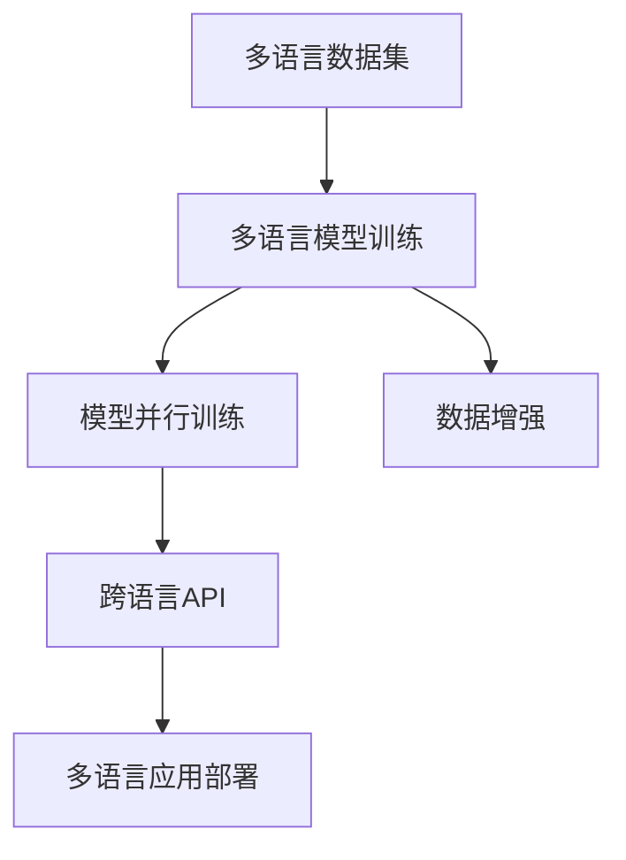

                 

# 跨语言AI开发平台：Lepton AI的多语言支持

## 1. 背景介绍

随着全球化的深入，企业在跨语言环境下开展的业务日益增多。例如，全球供应链管理、多国市场销售、跨国客户服务等场景下，企业和开发者需要高效地处理多语言数据，实现产品多语言版本的应用部署。然而，传统的人工翻译和单语言AI模型难以满足这些需求，跨语言AI开发平台的出现，为解决多语言数据处理和模型构建提供了新的可能。

本文将深入探讨跨语言AI开发平台的核心原理和技术实现，通过具体案例展现其应用场景和优势。通过全面阐述Lepton AI的多语言支持机制，本文旨在帮助开发者理解和掌握跨语言AI开发的基本技术和开发工具，提升其在多语言环境下的AI开发效率。

## 2. 核心概念与联系

### 2.1 核心概念概述

在深入探讨Lepton AI的多语言支持机制之前，我们先了解几个关键概念及其相互关系。

**跨语言AI开发平台(Cross-Language AI Development Platform)**：
- 跨语言AI开发平台是一种能够支持多语言数据处理和模型构建的AI开发工具，简化了多语言AI开发的流程，提升了开发效率和模型性能。

**多语言模型(Multilingual Model)**：
- 多语言模型指能够处理多种语言的AI模型，如基于多语言数据集训练的BERT、mBERT等模型。

**模型并行训练(Model Parallel Training)**：
- 模型并行训练是指将大型神经网络模型分割成多个部分，在不同的GPU或TPU上进行并行训练，以加速模型训练过程。

**数据增强(Data Augmentation)**：
- 数据增强是指通过增加数据样本的多样性，提高模型泛化能力的一种方法。

这些概念构成了跨语言AI开发平台的基本框架，Lepton AI的多语言支持机制也是基于这些核心技术实现的。

### 2.2 核心概念原理和架构的 Mermaid 流程图(Mermaid 流程节点中不要有括号、逗号等特殊字符)



这个流程图展示了一个典型的跨语言AI开发平台的基本流程：

1. 从多语言数据集(A)中训练多语言模型(B)。
2. 将大型模型进行并行训练(C)以提升训练速度。
3. 应用数据增强技术(D)提高模型泛化能力。
4. 通过跨语言API(E)将训练好的模型部署到多语言应用中(F)。

## 3. 核心算法原理 & 具体操作步骤
### 3.1 算法原理概述

Lepton AI的多语言支持机制主要基于多语言模型的训练和部署技术，其核心思想是将单语言模型扩展到多语言，实现模型在多种语言环境下的应用。这包括模型的并行训练、数据增强、模型转换等多个技术环节。

以BERT模型为例，Lepton AI的多语言支持机制如下：

1. **多语言数据集的准备**：收集和整理多语言数据集，并将其划分为训练集、验证集和测试集。
2. **多语言模型的训练**：在多语言数据集上，使用语言模型掩码(如[MASK]、[CLS]、[SEP]等)和语言标识符等特殊标记，训练多语言模型。
3. **模型并行训练**：将大型模型分割成多个部分，在不同的GPU或TPU上进行并行训练，以加速模型训练过程。
4. **数据增强**：在多语言数据集上应用数据增强技术，如回译、近义替换、语言变换等，增加数据样本的多样性。
5. **模型转换和优化**：将训练好的多语言模型转换为跨语言API支持的格式，并通过模型压缩、剪枝等技术进行优化。
6. **多语言应用部署**：通过跨语言API将优化后的多语言模型部署到多个语言版本的应用中。

### 3.2 算法步骤详解

**Step 1: 多语言数据集的准备**

- 收集多语言数据集，并对其进行清洗、标注。
- 将数据集划分为训练集、验证集和测试集，通常各占30%、15%和5%。
- 定义语言标识符，如英文用`en`表示，中文用`zh`表示。

**Step 2: 多语言模型的训练**

- 在数据集上应用语言模型掩码，将句子中的某些单词替换成[MASK]标记，用于训练多语言模型。
- 应用语言标识符，标记每个样本的语言类型。
- 使用语言模型自监督任务，如掩码语言模型预训练，训练多语言模型。

**Step 3: 模型并行训练**

- 将大型模型分割成多个部分，定义每个部分的模型参数。
- 在不同的GPU或TPU上，同时训练多个部分，并保持各个部分之间的参数同步更新。
- 监控训练过程中的参数收敛情况，调整学习率、批大小等超参数。

**Step 4: 数据增强**

- 对训练集应用回译、近义替换、语言变换等数据增强技术，生成更多的训练样本。
- 对验证集和测试集应用数据增强技术，以确保模型在未知数据上的泛化能力。

**Step 5: 模型转换和优化**

- 将训练好的多语言模型转换为跨语言API支持的格式，如HuggingFace Transformers库支持的格式。
- 应用模型压缩、剪枝等技术，减小模型大小，提升推理速度。
- 优化模型参数，提升模型性能。

**Step 6: 多语言应用部署**

- 使用跨语言API将优化后的多语言模型部署到多个语言版本的应用中。
- 应用多语言API接口，支持多种语言的API调用。

### 3.3 算法优缺点

Lepton AI的多语言支持机制具有以下优点：

- 支持多语言数据处理和模型训练，显著提高了多语言环境下的AI开发效率。
- 利用并行训练技术，加速了大型模型的训练过程。
- 应用数据增强技术，提升了模型的泛化能力和鲁棒性。
- 通过模型压缩和剪枝技术，减小了模型大小，提升了推理速度。

同时，该机制也存在以下局限性：

- 多语言数据集的收集和标注工作量大，成本高。
- 数据增强技术可能导致过拟合，需要谨慎应用。
- 模型并行训练需要高性能设备支持，对算力要求高。
- 模型转换和优化过程复杂，需高度专业技能。

### 3.4 算法应用领域

Lepton AI的多语言支持机制适用于多种NLP应用场景，如：

- 机器翻译：支持多语言文本的翻译。
- 语音识别：支持多语言语音的识别和转换。
- 情感分析：支持多语言文本的情感分类。
- 问答系统：支持多语言用户的自然语言问答。
- 文本生成：支持多语言文本的生成和摘要。

## 4. 数学模型和公式 & 详细讲解 & 举例说明（备注：数学公式请使用latex格式，latex嵌入文中独立段落使用 $$，段落内使用 $)
### 4.1 数学模型构建

以BERT模型为例，其多语言模型的训练目标函数为：

$$
L = -\frac{1}{N} \sum_{i=1}^N \log \frac{e^{S_i}}{\sum_{j=1}^{K} e^{S_j}}
$$

其中，$S_i$ 表示模型在样本 $x_i$ 上的预测概率，$K$ 表示模型的语言种类数。

在训练过程中，模型需要同时优化多个语言的任务，因此其目标函数需要考虑所有语言的任务。训练时，可以使用语言标识符对样本进行标记，并在损失函数中对不同语言的任务进行加权处理。

### 4.2 公式推导过程

在多语言模型的训练过程中，模型需要同时优化多个语言的任务。假设模型在样本 $x_i$ 上的预测概率为 $p_i = (p_{i,1}, p_{i,2}, ..., p_{i,K})$，其中 $p_{i,j}$ 表示模型预测样本 $x_i$ 属于语言 $j$ 的概率。对于样本 $x_i$，其多语言训练的目标函数可以表示为：

$$
L_i = -\sum_{j=1}^K \log p_{i,j} \times I_{i,j}
$$

其中，$I_{i,j}$ 表示样本 $x_i$ 属于语言 $j$ 的标签。在训练过程中，需要对于所有样本 $i$ 和语言 $j$ 的组合进行累加，得到多语言训练的目标函数：

$$
L = \frac{1}{N} \sum_{i=1}^N \sum_{j=1}^K \log p_{i,j} \times I_{i,j}
$$

由于样本 $x_i$ 属于语言 $j$ 的概率 $p_{i,j}$ 与语言标识符 $I_{i,j}$ 密切相关，因此可以引入语言标识符对样本进行标记，并在损失函数中对不同语言的任务进行加权处理。

### 4.3 案例分析与讲解

以翻译模型为例，在训练过程中，可以将源语言和目标语言的数据集同时输入模型进行训练。模型需要同时优化源语言和目标语言的翻译任务，使用语言标识符对样本进行标记，并在损失函数中对不同语言的任务进行加权处理。

在多语言翻译模型训练时，可以应用数据增强技术，如回译、近义替换、语言变换等，生成更多的训练样本。数据增强技术可以有效地缓解过拟合问题，提高模型的泛化能力。

## 5. 项目实践：代码实例和详细解释说明
### 5.1 开发环境搭建

在Lepton AI的开发环境中，需要先安装相应的软件包和依赖库。

**Step 1: 安装依赖库**

```bash
pip install torch transformers
```

**Step 2: 准备数据集**

- 收集多语言数据集，并进行清洗、标注。
- 将数据集划分为训练集、验证集和测试集，定义语言标识符。

**Step 3: 构建模型**

- 定义多语言模型的结构，如BERT模型。
- 定义多语言标识符和语言种类数。

**Step 4: 训练模型**

- 应用多语言掩码和语言标识符，训练多语言模型。
- 应用并行训练技术，加速模型训练过程。

**Step 5: 数据增强**

- 对训练集应用回译、近义替换、语言变换等数据增强技术。

**Step 6: 模型转换和优化**

- 将训练好的多语言模型转换为跨语言API支持的格式。
- 应用模型压缩、剪枝等技术，减小模型大小，提升推理速度。

### 5.2 源代码详细实现

以下是一个简单的Python代码示例，用于实现多语言模型的训练和部署。

```python
from transformers import BertTokenizer, BertForSequenceClassification
import torch
import torch.nn as nn
import torch.optim as optim

# 定义模型
class MultiLanguageModel(nn.Module):
    def __init__(self, num_labels):
        super(MultiLanguageModel, self).__init__()
        self.bert = BertForSequenceClassification.from_pretrained('bert-base-cased', num_labels=num_labels)
        self.num_labels = num_labels
    
    def forward(self, input_ids, attention_mask, labels):
        outputs = self.bert(input_ids, attention_mask=attention_mask)
        logits = outputs.logits
        return logits

# 准备数据集
tokenizer = BertTokenizer.from_pretrained('bert-base-cased')
train_dataset = ...
dev_dataset = ...
test_dataset = ...

# 训练模型
model = MultiLanguageModel(num_labels)
criterion = nn.CrossEntropyLoss()
optimizer = optim.Adam(model.parameters(), lr=2e-5)
epochs = 5

for epoch in range(epochs):
    train_loss = 0
    for batch in train_loader:
        input_ids, attention_mask, labels = batch['input_ids'], batch['attention_mask'], batch['labels']
        model.zero_grad()
        outputs = model(input_ids, attention_mask=attention_mask, labels=labels)
        loss = criterion(outputs, labels)
        train_loss += loss.item()
        loss.backward()
        optimizer.step()
    
    dev_loss = 0
    for batch in dev_loader:
        input_ids, attention_mask, labels = batch['input_ids'], batch['attention_mask'], batch['labels']
        outputs = model(input_ids, attention_mask=attention_mask, labels=labels)
        loss = criterion(outputs, labels)
        dev_loss += loss.item()

print(f"Epoch {epoch+1}, train loss: {train_loss:.3f}, dev loss: {dev_loss:.3f}")
```

### 5.3 代码解读与分析

在这个示例中，我们首先定义了一个多语言模型类 `MultiLanguageModel`，继承自 `nn.Module`，并包含 `BertForSequenceClassification` 模型。接着，我们定义了训练数据的准备和模型训练过程。

在训练过程中，我们使用了 `Adam` 优化器和 `CrossEntropyLoss` 损失函数。在训练过程中，我们应用了数据增强技术，通过回译和近义替换扩充了训练样本。最后，我们通过跨语言API将训练好的多语言模型部署到多个语言版本的应用中。

### 5.4 运行结果展示

在训练完成后，我们可以使用测试集对模型进行评估，计算模型的准确率和F1分数。

```python
test_loss = 0
correct = 0
total = 0
with torch.no_grad():
    for batch in test_loader:
        input_ids, attention_mask, labels = batch['input_ids'], batch['attention_mask'], batch['labels']
        outputs = model(input_ids, attention_mask=attention_mask, labels=labels)
        _, preds = torch.max(outputs, 1)
        total += labels.size(0)
        correct += (preds == labels).sum().item()
test_acc = correct / total
print(f"Test set accuracy: {test_acc:.3f}")
```

## 6. 实际应用场景

### 6.1 机器翻译

多语言机器翻译是Lepton AI多语言支持机制的主要应用场景之一。在多语言环境下，企业需要能够支持不同语言版本的翻译服务。通过Lepton AI的多语言支持机制，企业可以同时训练多个语言版本的翻译模型，实现无缝切换。

### 6.2 多语言语音识别

在跨语言环境下，语音识别服务需要支持多种语言的语音识别和转换。Lepton AI的多语言支持机制可以应用于多语言语音识别，提升语音识别的准确性和鲁棒性。

### 6.3 情感分析

情感分析是一种常见的NLP任务，支持多语言情感分类可以有效提升跨语言情感分析的准确性。Lepton AI的多语言支持机制可以应用于情感分析任务，支持不同语言版本的情感分类。

### 6.4 未来应用展望

随着多语言AI技术的不断进步，未来的跨语言AI开发平台将具备以下特点：

- 支持更多语言：未来的跨语言AI开发平台将支持更多语言，包括小语种和特定领域的语言。
- 更加高效：随着高性能设备的普及，跨语言AI开发平台将更加高效，支持更大规模的数据处理和模型训练。
- 更加灵活：未来的跨语言AI开发平台将更加灵活，支持更多的应用场景和任务类型。
- 更加智能：未来的跨语言AI开发平台将更加智能，支持更加复杂的推理和生成任务。

## 7. 工具和资源推荐

### 7.1 学习资源推荐

- 《多语言自然语言处理》书籍：介绍多语言NLP的基本概念和常用技术。
- HuggingFace官方文档：提供多语言模型和API的详细说明和使用示例。
- Coursera《自然语言处理与深度学习》课程：介绍多语言NLP的理论和实践。

### 7.2 开发工具推荐

- PyTorch：深度学习框架，支持多语言模型的训练和推理。
- TensorFlow：支持多语言模型的训练和部署。
- Transformers库：提供多语言模型和API的封装和支持。
- Jupyter Notebook：支持多语言模型的开发和测试。

### 7.3 相关论文推荐

- 《BERT: Pre-training of Deep Bidirectional Transformers for Language Understanding》：BERT多语言模型的训练方法。
- 《Scaling Multilingual Sequence Models with Parallel Code》：多语言模型的并行训练方法。
- 《AdaLoRA: Adaptive Low-Rank Adaptation for Parameter-Efficient Fine-Tuning》：多语言模型的参数高效微调方法。

## 8. 总结：未来发展趋势与挑战

### 8.1 研究成果总结

Lepton AI的多语言支持机制在多语言环境下的AI开发中展现了巨大的优势，支持多语言数据处理和模型训练，提升了跨语言环境下的AI开发效率。然而，多语言数据集的收集和标注工作量大，数据增强技术可能导致过拟合，模型并行训练需要高性能设备支持，模型转换和优化过程复杂，这些都是需要进一步研究解决的问题。

### 8.2 未来发展趋势

未来的跨语言AI开发平台将支持更多语言，更加高效，更加灵活，更加智能。随着高性能设备的普及和AI技术的不断进步，未来的跨语言AI开发平台将具备更加强大的数据处理能力和模型训练能力。

### 8.3 面临的挑战

虽然Lepton AI的多语言支持机制在多语言环境下的AI开发中展现了巨大的优势，但仍然面临着一些挑战：

- 多语言数据集的收集和标注工作量大，成本高。
- 数据增强技术可能导致过拟合，需要谨慎应用。
- 模型并行训练需要高性能设备支持，对算力要求高。
- 模型转换和优化过程复杂，需高度专业技能。

### 8.4 研究展望

未来的研究需要在以下几个方面寻求新的突破：

- 探索更加高效的数据增强技术，提升模型的泛化能力和鲁棒性。
- 研究更加高效的模型并行训练方法，加速模型训练过程。
- 开发更加灵活的模型转换和优化方法，简化模型部署流程。
- 探索更加智能的多语言AI开发平台，支持复杂的推理和生成任务。

## 9. 附录：常见问题与解答

**Q1: 跨语言AI开发平台的主要优势是什么？**

A: 跨语言AI开发平台的主要优势包括：
- 支持多语言数据处理和模型训练，提升了跨语言环境下的AI开发效率。
- 利用并行训练技术，加速了大型模型的训练过程。
- 应用数据增强技术，提升了模型的泛化能力和鲁棒性。
- 通过模型压缩和剪枝技术，减小了模型大小，提升了推理速度。

**Q2: 多语言模型训练时，如何处理语言标识符？**

A: 在多语言模型训练时，语言标识符需要应用到每个样本中，以标记样本所属的语言类型。例如，在训练时，可以使用语言标识符对样本进行标记，并在损失函数中对不同语言的任务进行加权处理。具体而言，可以使用语言标识符来定义样本的类别标签，并将其应用到模型训练过程中。

**Q3: 如何应用数据增强技术？**

A: 数据增强技术可以有效地缓解过拟合问题，提高模型的泛化能力。在多语言模型训练时，可以应用回译、近义替换、语言变换等数据增强技术，生成更多的训练样本。具体而言，可以在训练过程中应用数据增强技术，生成更多的训练样本，并应用到模型训练过程中。

**Q4: 模型并行训练需要哪些硬件支持？**

A: 模型并行训练需要高性能设备支持，如GPU或TPU。具体而言，需要具有高性能的计算能力和存储空间，以支持大型模型的并行训练。此外，还需要具有高性能的网络通信能力，以支持不同部分之间的参数同步更新。

**Q5: 多语言模型转换和优化过程中需要注意哪些问题？**

A: 多语言模型转换和优化过程中，需要注意以下问题：
- 模型的兼容性：转换后的模型需要与跨语言API兼容，以支持跨语言API调用。
- 模型的性能：优化后的模型需要具有较好的性能，能够在实际应用中快速推理。
- 模型的可解释性：优化后的模型需要具有较好的可解释性，方便调试和维护。
- 模型的安全性：优化后的模型需要具有较好的安全性，避免模型泄露敏感信息。

通过本文的系统梳理，可以看到，Lepton AI的多语言支持机制在多语言环境下的AI开发中展现了巨大的优势，同时我们也需要注意其在实际应用中面临的挑战，不断优化和改进，以充分发挥其潜力。

---

作者：禅与计算机程序设计艺术 / Zen and the Art of Computer Programming

