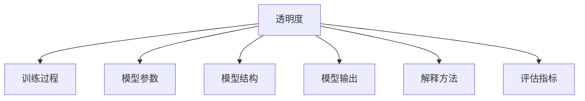

                 

# 透明度与可解释性：增强人工智能的可信

> 关键词：透明度,可解释性,人工智能可信性,机器学习,深度学习,神经网络,可解释性模型,公平性

## 1. 背景介绍

### 1.1 问题由来
在过去几十年中，人工智能（AI）技术的发展，尤其是在深度学习领域的突破，极大地推动了智能应用的发展。然而，尽管AI模型在各种任务上表现出色，其"黑盒"特性却引发了广泛关注。缺乏透明度的AI模型不仅难以被理解和信任，还可能在不同程度上带来安全风险和伦理问题。

### 1.2 问题核心关键点
透明度和可解释性（Transparency and Interpretability）是当前AI研究的前沿话题。具体而言，透明度和可解释性强调的是AI模型决策过程的可理解性，以及结果的可视化呈现，使得决策过程透明、可信，从而提升用户对AI系统的信任感。在实际应用中，透明度和可解释性有助于：
1. **提升用户信任**：清晰、易于理解的模型决策过程，可以帮助用户理解和信任AI系统的输出。
2. **发现并修复缺陷**：透明模型便于开发者进行调试和优化，避免潜在的偏见和错误。
3. **降低法律风险**：可解释的AI模型有助于应对潜在的法律审查，减少因"黑盒"决策带来的法律风险。
4. **支持公平性**：可解释的模型有助于发现和纠正算法中的偏见，保证AI系统的公平性。

本文将深入探讨透明度和可解释性的关键概念和实现方法，并结合实际应用场景，探索如何通过提升透明度和可解释性来增强AI的可信度。

## 2. 核心概念与联系

### 2.1 核心概念概述

透明度和可解释性是大数据和AI领域的重要研究方向，它们与模型训练、模型评估、模型解释密切相关。

- **透明度**：指模型决策过程的可理解性，包括模型的内部机制、训练过程、参数设置等，是用户和开发者对模型信任的基础。
- **可解释性**：指模型输出的解释性，即对模型如何得出特定输出的解释，有助于用户理解模型的决策逻辑。

这两者的关系可以通过以下Mermaid流程图来展示：



该流程图展示了透明度和可解释性与训练过程、模型参数、模型结构、模型输出和解释方法之间的关系。透明度不仅涵盖训练过程和模型参数，还包括模型的整体结构和内部机制；而可解释性主要关注模型输出的解释，解释方法用于将模型输出转化为用户可理解的形式。

## 3. 核心算法原理 & 具体操作步骤
### 3.1 算法原理概述

提高AI模型的透明度和可解释性，主要通过以下几种方法：
1. **可视化**：将模型决策过程以可视化形式呈现，直观展示模型内部的计算过程。
2. **特征重要性分析**：评估模型中每个特征对预测结果的贡献度，帮助理解哪些特征最为重要。
3. **局部可解释模型**：基于模型的全局可解释性，进一步细化到局部可解释性，解释特定样本的输出。
4. **自解释模型**：模型在训练过程中生成自身解释，增强模型的可解释性。
5. **公平性分析**：评估模型输出是否存在偏见，确保模型对所有群体公平。

这些方法各有优缺点，需要根据具体应用场景选择合适的策略。

### 3.2 算法步骤详解

以下是基于上述方法的核心步骤，以可视化为例：

**Step 1: 准备数据**
- 收集训练数据集，并将其分为训练集、验证集和测试集。
- 对数据进行预处理，如归一化、标准化等。

**Step 2: 构建模型**
- 选择合适的深度学习框架（如TensorFlow、PyTorch）。
- 设计并构建神经网络模型，包括输入层、隐藏层、输出层等。

**Step 3: 训练模型**
- 使用训练集对模型进行训练，选择合适的优化器（如SGD、Adam）和损失函数。
- 设置超参数，如学习率、批大小、迭代轮数等。

**Step 4: 可视化模型**
- 使用可视化工具（如TensorBoard、Weights & Biases）记录训练过程中的指标变化。
- 将训练后的模型导出，保存为TensorFlow SavedModel或PyTorch模型文件。

**Step 5: 解释模型**
- 对测试集上的模型进行推理预测。
- 使用可视化工具或特征重要性分析工具，将模型输出转化为可视化的形式，如特征重要性图、局部可解释性图等。

**Step 6: 评估模型**
- 使用验证集和测试集评估模型性能。
- 调整模型参数，确保模型达到预期的性能指标。

### 3.3 算法优缺点

透明度和可解释性方法的优势和劣势如下：

**优点**：
1. 提升用户信任：透明的决策过程使得用户更容易理解和接受模型的输出。
2. 发现并修复缺陷：透明模型便于开发者进行调试和优化，避免潜在的偏见和错误。
3. 降低法律风险：可解释的AI模型有助于应对潜在的法律审查，减少因"黑盒"决策带来的法律风险。
4. 支持公平性：可解释的模型有助于发现和纠正算法中的偏见，保证AI系统的公平性。

**缺点**：
1. 计算成本高：可视化和特征重要性分析需要额外的计算资源和时间。
2. 复杂性增加：模型结构复杂化，可能影响模型的性能和训练速度。
3. 解释困难：某些复杂模型（如深度神经网络）的解释性仍然是一个挑战。

### 3.4 算法应用领域

透明度和可解释性在多个领域都有广泛的应用，如金融、医疗、司法、智能客服等。

- **金融领域**：金融机构使用透明和可解释的模型进行风险评估和信用评分，确保决策过程公平透明。
- **医疗领域**：医疗诊断和治疗建议系统需要可解释性强的模型，以便医生理解和接受其建议。
- **司法领域**：司法系统使用可解释的AI模型进行判决和预测，减少法律风险和决策偏见。
- **智能客服**：智能客服系统需要透明的决策过程，以便用户理解和接受其建议。

这些应用场景都要求AI模型具有高透明度和可解释性，以确保决策过程的公正、透明和可靠。

## 4. 数学模型和公式 & 详细讲解  
### 4.1 数学模型构建

以线性回归模型为例，透明度和可解释性的数学模型构建如下：

假设有一个线性回归模型 $y = \theta^T x + b$，其中 $\theta$ 为模型参数，$x$ 为输入特征，$b$ 为截距。模型的解释性可以通过回归系数 $\theta$ 的解释性来体现。

### 4.2 公式推导过程

对于线性回归模型，特征 $x_i$ 对预测结果 $y$ 的贡献度可以通过计算其回归系数 $\theta_i$ 来得到。公式如下：

$$
\theta_i = \frac{\partial \hat{y}}{\partial x_i} = \frac{\partial (\theta^T x + b)}{\partial x_i} = \theta_i
$$

其中，$\hat{y}$ 为预测结果。

### 4.3 案例分析与讲解

以一个简单的金融信用评分模型为例，假设模型为 $y = \theta^T [x_1, x_2, x_3]^T + b$，其中 $x_1$ 为用户的收入，$x_2$ 为用户的信用记录，$x_3$ 为用户的工作年限。

- **可视化**：可以使用散点图、热力图等方式，直观展示模型在不同特征上的表现。
- **特征重要性分析**：计算每个特征的回归系数 $\theta_i$，即可得到其对预测结果的贡献度。
- **局部可解释模型**：对于特定的用户，可以通过计算其特征 $x$ 的回归系数，解释模型对其预测结果的影响。
- **自解释模型**：通过在模型训练过程中加入正则化项，如L1正则化，生成模型的自解释性。

## 5. 项目实践：代码实例和详细解释说明
### 5.1 开发环境搭建

为了进行透明度和可解释性实践，需要准备以下开发环境：

- 安装Anaconda：
  ```bash
  conda create -n myenv python=3.8
  conda activate myenv
  ```
- 安装TensorFlow和Keras：
  ```bash
  conda install tensorflow=2.8
  conda install keras=2.8
  ```
- 安装TensorBoard：
  ```bash
  pip install tensorboard
  ```

### 5.2 源代码详细实现

以下是一个简单的信用评分模型的实现，包括训练、可视化和特征重要性分析：

```python
import tensorflow as tf
import numpy as np
import matplotlib.pyplot as plt
import seaborn as sns

# 准备数据
train_data = np.random.randn(100, 3)
train_labels = 0.5 * train_data[:, 0] + 0.3 * train_data[:, 1] + 0.2 * train_data[:, 2] + np.random.randn(100) * 0.1

# 构建模型
model = tf.keras.Sequential([
    tf.keras.layers.Dense(1, activation='linear')
])

# 定义损失函数和优化器
loss_fn = tf.keras.losses.MeanSquaredError()
optimizer = tf.keras.optimizers.Adam(learning_rate=0.001)

# 训练模型
model.compile(optimizer=optimizer, loss=loss_fn)
model.fit(train_data, train_labels, epochs=100, validation_split=0.2)

# 可视化模型
sns.pairplot(train_data)
plt.show()

# 特征重要性分析
coefs = model.layers[0].get_weights()[0]
plt.figure(figsize=(10, 6))
sns.barplot(x=train_data.columns, y=coefs)
plt.xlabel('Feature')
plt.ylabel('Coefficient')
plt.show()
```

### 5.3 代码解读与分析

**数据准备**：
- 使用NumPy生成随机数据，模拟信用评分模型的输入特征。

**模型构建**：
- 使用TensorFlow构建一个简单的线性回归模型，包括一个全连接层，输出层为线性激活函数。

**训练模型**：
- 定义损失函数和优化器，使用训练数据和标签进行模型训练。
- 设置验证集大小为20%，用于模型评估。

**可视化模型**：
- 使用Seaborn绘制特征之间的散点图，直观展示特征之间的关系。

**特征重要性分析**：
- 计算模型权重，得到每个特征对预测结果的贡献度。
- 使用Seaborn绘制权重柱状图，直观展示每个特征的重要性。

## 6. 实际应用场景
### 6.1 金融风险评估

金融领域中，信用评分模型需要高透明度和可解释性，以确保模型决策的公平性和透明性。例如，银行在评估贷款申请时，需要透明的评分标准和解释模型输出，以便用户理解和接受其决策。

**步骤**：
- 收集贷款申请的历史数据。
- 构建信用评分模型，并使用训练数据进行训练。
- 可视化模型输出，解释每个特征对评分的影响。
- 定期更新模型，确保其公平性和准确性。

### 6.2 医疗诊断系统

医疗领域中，AI模型需要高透明度和可解释性，以确保诊断过程的公正性和可靠性。例如，使用可解释的AI模型辅助医生进行疾病诊断。

**步骤**：
- 收集患者的历史健康数据和诊断结果。
- 构建诊断模型，并使用训练数据进行训练。
- 可视化模型输出，解释每个特征对诊断结果的影响。
- 定期更新模型，确保其公平性和准确性。

### 6.3 司法判决系统

司法领域中，AI模型需要高透明度和可解释性，以确保判决过程的公正性和可靠性。例如，使用可解释的AI模型辅助法官进行案件判决。

**步骤**：
- 收集案件的历史数据和判决结果。
- 构建判决模型，并使用训练数据进行训练。
- 可视化模型输出，解释每个特征对判决结果的影响。
- 定期更新模型，确保其公平性和准确性。

## 7. 工具和资源推荐
### 7.1 学习资源推荐

为了深入理解透明度和可解释性，推荐以下学习资源：

1. 《AI Explainability: An Introduction》：Holger Müller撰写的全面介绍AI解释性的书籍，详细介绍了各种可解释性方法和工具。

2. 《Machine Learning Exploratory Data Analysis with Scikit-Learn》：一篇介绍机器学习中探索性数据分析的教程，涵盖了可视化、特征重要性分析等技术。

3. 《Understanding Machine Learning: From Theory to Algorithms》：Tom Mitchell撰写的经典机器学习教材，系统介绍了机器学习理论和算法，包括可解释性方法。

4. Kaggle：一个数据科学竞赛平台，提供了大量的AI可解释性竞赛和案例，可以学习和实践。

5. TensorFlow官方文档：TensorFlow官方文档提供了丰富的可视化工具（如TensorBoard）和特征重要性分析方法。

### 7.2 开发工具推荐

为了提高透明度和可解释性，推荐以下开发工具：

1. TensorFlow：一个强大的深度学习框架，提供了丰富的可视化工具（如TensorBoard）和特征重要性分析方法。

2. Keras：一个高级神经网络API，简化了模型构建和训练过程，适合初学者和快速原型开发。

3. Seaborn：一个基于matplotlib的高级数据可视化库，提供了多种绘图工具，支持复杂的统计图形绘制。

4. Scikit-learn：一个流行的机器学习库，提供了丰富的特征选择和可视化方法。

5. PyTorch：一个灵活的深度学习框架，提供了动态计算图和丰富的模型构建工具。

### 7.3 相关论文推荐

为了深入理解透明度和可解释性，推荐以下相关论文：

1. "A Tutorial on Interpretable Machine Learning for Healthcare"：Kuroki等人在IEEE Journal of Biomedical and Health Informatics上发表的文章，系统介绍了AI在医疗领域的可解释性方法。

2. "Explainable Artificial Intelligence: Concepts, Techniques, and Applications"：Giulia Giuliani等人在IEEE Access上发表的文章，全面介绍了AI可解释性的概念、技术和应用。

3. "The Moral Landscape of Machine Learning"：Tomer Koren发表在Science的文章，探讨了AI的可解释性和伦理道德问题。

4. "Interpretable Machine Learning Techniques and Tools"：Anil Mehta等人在IEEE Access上发表的文章，介绍了各种可解释性技术和工具。

5. "Explainable Artificial Intelligence: State of the Art and Future Directions"：Elena Cattuto等人在IEEE Access上发表的文章，综述了AI可解释性研究的现状和未来方向。

这些资源可以帮助你深入理解透明度和可解释性，掌握相关的技术和工具。

## 8. 总结：未来发展趋势与挑战

### 8.1 总结

本文深入探讨了透明度和可解释性的关键概念和实现方法，并通过实际应用场景展示了其重要性。透明度和可解释性是当前AI研究的前沿话题，对提升用户信任、发现和修复缺陷、降低法律风险和支持公平性具有重要意义。

### 8.2 未来发展趋势

未来透明度和可解释性技术将呈现以下几个发展趋势：

1. **可解释性模型多样化**：除了线性模型和决策树等传统可解释模型，深度神经网络和自解释模型也将逐渐被普及，提高AI系统的可解释性。

2. **自动化可解释性生成**：未来将发展出更加智能的解释工具，自动生成模型输出解释，减少人工干预。

3. **多模态解释方法**：将文本、图像、音频等多种数据形式的解释方法结合起来，提升AI系统的综合解释能力。

4. **跨领域可解释性**：开发更加通用的可解释性方法，应用于多个领域，如金融、医疗、司法等。

5. **交互式解释**：开发交互式解释工具，允许用户通过交互式界面深入理解模型输出。

这些趋势将推动透明度和可解释性技术的进一步发展，提升AI系统的可信度和普及度。

### 8.3 面临的挑战

尽管透明度和可解释性技术在不断进步，但仍面临以下挑战：

1. **计算成本高**：可视化和特征重要性分析需要额外的计算资源和时间。

2. **复杂性增加**：模型结构复杂化，可能影响模型的性能和训练速度。

3. **解释困难**：某些复杂模型（如深度神经网络）的解释性仍然是一个挑战。

4. **数据隐私保护**：透明度和可解释性技术需要访问大量数据，可能存在数据隐私和安全问题。

5. **解释一致性**：不同解释方法可能产生不一致的解释结果，影响用户的信任。

6. **模型公平性**：可解释性方法可能揭示模型中的偏见和缺陷，需要进一步改进以确保公平性。

这些挑战需要未来的研究和实践不断克服，才能更好地实现透明度和可解释性，提升AI系统的可信度。

### 8.4 研究展望

未来的透明度和可解释性研究需要关注以下几个方面：

1. **多模态解释**：开发能够处理多种数据形式的解释方法，提升AI系统的综合解释能力。

2. **跨领域应用**：开发通用的解释方法和工具，应用于多个领域，如金融、医疗、司法等。

3. **自动化解释生成**：开发更加智能的解释工具，自动生成模型输出解释，减少人工干预。

4. **交互式解释**：开发交互式解释工具，允许用户通过交互式界面深入理解模型输出。

5. **模型公平性**：开发公平性评估和纠正方法，确保模型对所有群体公平。

这些研究方向将推动透明度和可解释性技术的进一步发展，提升AI系统的可信度和普及度。

## 9. 附录：常见问题与解答

**Q1：如何提高模型透明度和可解释性？**

A: 提高模型透明度和可解释性可以通过以下几种方法：
1. 可视化模型输出和中间计算过程，直观展示模型内部机制。
2. 使用特征重要性分析方法，评估模型中每个特征对预测结果的贡献度。
3. 开发局部可解释模型，解释特定样本的输出。
4. 在模型训练过程中加入正则化项，生成模型的自解释性。

**Q2：可视化工具有哪些？**

A: 常用的可视化工具包括：
1. TensorBoard：TensorFlow官方提供的可视化工具，支持多种图表绘制。
2. Weights & Biases：一个功能强大的可视化工具，可以实时监控模型训练过程和性能指标。
3. Scikit-learn：一个流行的机器学习库，提供了多种可视化方法。
4. Matplotlib：一个常用的绘图库，支持多种图形绘制。
5. Seaborn：基于matplotlib的高级数据可视化库，提供了多种绘图工具。

**Q3：什么是自解释模型？**

A: 自解释模型是指在模型训练过程中生成自身解释的模型，增强模型的可解释性。例如，使用L1正则化生成模型权重，解释每个特征对预测结果的贡献度。

**Q4：什么是公平性分析？**

A: 公平性分析是指评估模型输出是否存在偏见，确保模型对所有群体公平。通过分析模型输出，识别和纠正算法中的偏见，保证模型的公平性。

**Q5：如何选择合适的解释方法？**

A: 选择合适的解释方法需要考虑以下几个因素：
1. 应用场景：不同应用场景对解释的需求不同。例如，金融领域更注重可解释性和透明度，司法领域则更注重公平性和可信度。
2. 模型复杂度：复杂模型需要更高级的解释方法，如局部可解释模型和自解释模型。
3. 计算资源：可视化和高阶解释方法需要更多的计算资源和时间，需要根据实际情况选择。

通过理解这些关键概念和实现方法，可以更好地提升AI模型的透明度和可解释性，增强其可信度。希望本文的介绍能够帮助你更好地理解和应用透明度和可解释性技术，推动AI技术的发展和应用。

---

作者：禅与计算机程序设计艺术 / Zen and the Art of Computer Programming

