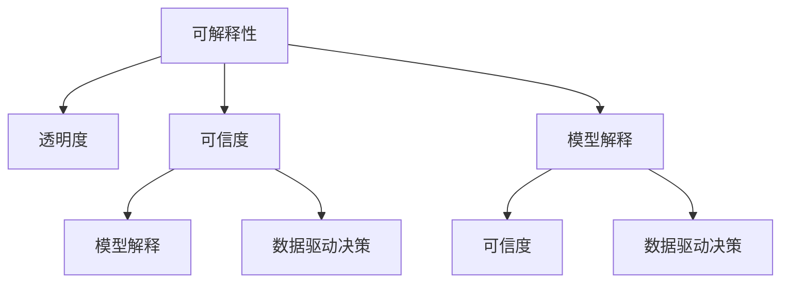

                 

# 透明度与可解释性：增强人工智能的可信度

> 关键词：可解释性, 人工智能, 透明度, 可信度, 模型解释, 数据驱动决策

## 1. 背景介绍

### 1.1 问题由来
随着人工智能技术的飞速发展，深度学习模型在医疗、金融、法律等领域得到广泛应用。然而，由于深度学习模型的复杂性和黑盒特性，其决策过程缺乏透明性，难以让人理解和信任。如何提高人工智能的可信度，使人们愿意接受并依赖其决策，成为当前人工智能应用中亟待解决的问题。

### 1.2 问题核心关键点
可解释性是提高人工智能可信度的重要手段。通过提供模型决策过程的透明性，人们可以更好地理解模型的行为，验证其合理性，减少偏见和错误。可解释性涉及多方面内容，包括模型的内部结构、决策路径、输入输出关系等。其核心在于如何在保证模型性能的前提下，最大程度地揭示模型决策过程。

### 1.3 问题研究意义
增强人工智能的可信度，对于推动人工智能技术在各行各业的应用，具有重要意义：

1. **保障决策质量**：可解释性使人们能够理解和验证模型的决策，减少误判和偏见，提高决策质量。
2. **增强用户信任**：透明的决策过程能建立用户对模型的信任，促进用户的使用和依赖。
3. **促进法规合规**：透明度有助于满足法规和伦理要求，避免模型被滥用或误用。
4. **推动技术发展**：可解释性研究有助于揭示深度学习模型的内在规律，推动技术不断进步。
5. **扩展应用场景**：提高可信度后，人工智能技术可以更好地应用于对透明度要求更高的领域，如医疗、司法等。

## 2. 核心概念与联系

### 2.1 核心概念概述

为更好地理解透明度和可解释性的原理与实践，本节将介绍几个核心概念：

- **可解释性(Explainability)**：指模型能够提供其决策依据的能力，使人们能够理解模型的内部运作和决策过程。
- **透明度(Transparency)**：指模型的结构、参数和决策过程能够被人们理解和验证，通常以可视化、解释图、文档等形式呈现。
- **可信度(Trustworthiness)**：指模型在实际应用中表现稳定、准确、可靠，能够满足用户需求和监管要求。
- **模型解释(Model Interpretation)**：通过各种技术手段，揭示模型内部结构、决策路径、参数关系等，帮助用户理解模型。
- **数据驱动决策(Data-Driven Decision Making)**：利用模型从数据中学习和推理，辅助决策过程，提高决策效率和质量。

这些概念之间的逻辑关系可以通过以下Mermaid流程图来展示：



这个流程图展示了可解释性和透明度、可信度、模型解释、数据驱动决策等概念之间的关系：

1. 可解释性通过透明度和模型解释手段，揭示模型内部运作，从而增强可信度。
2. 可信度建立在透明和可解释的模型之上，通过数据驱动决策，使模型在实际应用中表现出稳定、准确、可靠的特性。
3. 透明度和模型解释为数据驱动决策提供支撑，使决策过程透明化，便于验证和优化。

这些概念共同构成了增强人工智能可信度的理论框架，为实际应用提供了指导。

## 3. 核心算法原理 & 具体操作步骤
### 3.1 算法原理概述

可解释性和透明度可以通过多种方法实现，包括特征重要性分析、局部解释技术、可视化、规则提取等。其核心思想是：通过不同的技术手段，揭示模型的决策依据，使其透明化，便于理解。

从算法原理上，可以将可解释性分为模型内解释和模型外解释两种范式：

- **模型内解释**：直接在模型参数和结构上寻找解释，如LIME、SHAP等。
- **模型外解释**：通过模拟模型行为，寻找外部解释，如概念分类、反向传播等。

这些方法通常结合具体的任务特点和数据情况，选择最合适的解释手段。

### 3.2 算法步骤详解

以下是几种典型的模型内和模型外解释技术，以及其具体的操作步骤：

#### 3.2.1 特征重要性分析(Feature Importance Analysis)

特征重要性分析通过计算特征在模型中的权重，揭示模型对不同特征的依赖程度。常用方法包括：

1. **线性回归和决策树**：通过模型参数估计特征的重要性。
2. **基于梯度的特征重要性**：利用梯度对特征的影响，评估特征的重要性。

具体操作步骤：

1. 收集模型预测结果，计算特征对输出的影响。
2. 使用均方误差(MSE)等指标，评估特征的重要性。
3. 绘制特征重要性图，直观展示特征对模型输出的影响。

#### 3.2.2 局部解释技术(Locally-Interpretable Model-agnostic Explanations)

局部解释技术通过生成输入样本的解释，揭示模型在特定输入下的决策过程。常用方法包括：

1. **LIME**：利用线性模型拟合局部区域，生成解释。
2. **SHAP**：通过计算每种特征对结果的贡献，生成全局解释。

具体操作步骤：

1. 收集模型对输入样本的预测结果。
2. 使用LIME或SHAP等方法生成解释，并计算局部和全局解释。
3. 绘制解释图，展示特征对模型输出的影响。

#### 3.2.3 可视化(Visualization)

可视化通过图形化展示模型结构、决策路径、参数关系等，直观地揭示模型内部运作。常用方法包括：

1. **网络图**：绘制模型结构，展示各个层和节点之间的关系。
2. **热力图**：展示特征权重和梯度变化，揭示特征的重要性。
3. **交互式可视化**：使用交互式工具，展示模型行为的变化。

具体操作步骤：

1. 收集模型参数和结构信息。
2. 绘制网络图、热力图等可视化图表。
3. 使用交互式工具，展示模型行为变化。

#### 3.2.4 规则提取(Rule Extraction)

规则提取通过提取模型的决策规则，揭示模型的决策依据。常用方法包括：

1. **决策树**：通过模型结构提取决策规则。
2. **逻辑回归**：通过线性模型提取决策规则。
3. **规则学习**：利用规则学习算法，提取决策规则。

具体操作步骤：

1. 收集模型预测结果和特征。
2. 使用决策树、逻辑回归等方法提取决策规则。
3. 验证规则的准确性，并将其应用到实际决策中。

### 3.3 算法优缺点

可解释性和透明度方法具有以下优点：

1. **提高用户信任**：通过透明化的决策过程，使用户能够理解和信任模型的输出。
2. **促进法规合规**：透明和可解释的模型有助于满足法规和伦理要求，减少误用和滥用。
3. **提供决策依据**：通过特征重要性和局部解释，为决策提供依据，提高决策质量。

同时，这些方法也存在一定的局限性：

1. **计算开销大**：部分方法如LIME、SHAP等，需要计算大量的特征重要性或局部解释，计算开销较大。
2. **方法选择困难**：不同的任务和数据情况，需要选择合适的解释方法，选择不当可能导致解释结果不准确。
3. **解释结果不易理解**：即使生成了解释结果，用户也可能难以理解，尤其是对于复杂模型。
4. **解释结果不可用**：部分解释结果可能无法直接用于实际决策，需要进一步处理。

尽管存在这些局限性，但可解释性和透明度仍然是提高人工智能可信度的重要手段。需要综合考虑任务的复杂性、数据的特点、用户需求等因素，选择最合适的解释方法，确保解释结果的有效性和可理解性。

### 3.4 算法应用领域

可解释性和透明度方法在人工智能的多个领域得到广泛应用，例如：

- **金融风险管理**：通过分析特征重要性，揭示模型的风险评估依据，提高决策可信度。
- **医疗诊断**：利用可解释性技术，展示模型的诊断推理过程，帮助医生理解和信任诊断结果。
- **司法判决**：通过规则提取，生成解释图，辅助法官理解判决依据，提高司法公正性。
- **自然语言处理**：通过局部解释技术，展示模型对文本的解释，帮助用户理解模型输出。
- **推荐系统**：通过特征重要性分析，揭示用户偏好，提高推荐质量。

这些应用场景展示了可解释性和透明度方法的重要性和广泛应用前景。

## 4. 数学模型和公式 & 详细讲解  
### 4.1 数学模型构建

以下是一个简单的线性回归模型，通过特征重要性分析揭示特征对输出的影响：

$$
y = \theta_0 + \sum_{i=1}^n \theta_i x_i + \epsilon
$$

其中 $y$ 为输出，$x_i$ 为特征，$\theta_0, \theta_i$ 为模型参数，$\epsilon$ 为噪声。

假设模型训练得到参数 $\hat{\theta}$，则特征 $x_i$ 的重要性 $I_i$ 可通过其对输出的偏导数计算：

$$
I_i = \frac{\partial \hat{y}}{\partial x_i} = \hat{\theta}_i
$$

该公式展示了特征对模型输出的直接影响，揭示了特征的重要性。

### 4.2 公式推导过程

在复杂的非线性模型中，特征重要性分析的计算公式更为复杂。以深度学习模型为例，特征重要性可以通过激活函数的导数计算，并结合梯度信息，评估特征对模型输出的贡献：

$$
I_i = \frac{\partial \hat{y}}{\partial x_i} = \frac{\partial \hat{y}}{\partial z_j} \frac{\partial z_j}{\partial x_i}
$$

其中 $z_j$ 为模型中的隐藏层特征，$\frac{\partial \hat{y}}{\partial z_j}$ 为梯度，$\frac{\partial z_j}{\partial x_i}$ 为激活函数导数。

对于复杂的神经网络，特征重要性的计算更为复杂，但基本思想是利用梯度和激活函数导数，评估特征对模型输出的影响。

### 4.3 案例分析与讲解

以下是一个简单的LIME实例，通过线性模型拟合局部区域，生成解释：

1. 收集模型对输入样本的预测结果 $y_1, y_2, ..., y_n$。
2. 计算局部区域的损失函数 $L$：
   $$
   L = \sum_{i=1}^n (y_i - \hat{y}_i)^2
   $$
3. 生成线性模型 $\hat{y} = w_0 + \sum_{i=1}^d w_i x_i$，最小化损失函数 $L$。
4. 计算局部解释 $\Delta x_i = \frac{\partial L}{\partial x_i}$，生成解释图。

以二分类任务为例，通过LIME生成局部解释的过程如下：

1. 收集模型对样本 $x$ 的预测结果 $y_1, y_2, ..., y_n$。
2. 计算局部区域的损失函数 $L$：
   $$
   L = \sum_{i=1}^n (y_i - \hat{y}_i)^2
   $$
3. 生成线性模型 $\hat{y} = w_0 + \sum_{i=1}^d w_i x_i$，最小化损失函数 $L$。
4. 计算局部解释 $\Delta x_i = \frac{\partial L}{\partial x_i}$，生成解释图。

例如，对于样本 $x_1$，通过LIME生成局部解释的过程如下：

1. 收集模型对样本 $x_1$ 的预测结果 $y_1, y_2, ..., y_n$。
2. 计算局部区域的损失函数 $L$：
   $$
   L = \sum_{i=1}^n (y_i - \hat{y}_i)^2
   $$
3. 生成线性模型 $\hat{y} = w_0 + \sum_{i=1}^d w_i x_i$，最小化损失函数 $L$。
4. 计算局部解释 $\Delta x_i = \frac{\partial L}{\partial x_i}$，生成解释图。

通过LIME生成的局部解释图，可以直观展示模型对输入的敏感性，揭示特征的重要性。

## 5. 项目实践：代码实例和详细解释说明
### 5.1 开发环境搭建

在进行可解释性实践前，我们需要准备好开发环境。以下是使用Python进行Scikit-learn开发的环境配置流程：

1. 安装Anaconda：从官网下载并安装Anaconda，用于创建独立的Python环境。

2. 创建并激活虚拟环境：
```bash
conda create -n skl-env python=3.8 
conda activate skl-env
```

3. 安装Scikit-learn：
```bash
conda install scikit-learn
```

4. 安装NumPy、pandas、matplotlib、jupyter notebook等工具包：
```bash
pip install numpy pandas matplotlib tqdm jupyter notebook ipython
```

完成上述步骤后，即可在`skl-env`环境中开始可解释性实践。

### 5.2 源代码详细实现

下面我们以线性回归模型为例，给出使用Scikit-learn进行特征重要性分析的PyTorch代码实现。

首先，导入必要的库和数据：

```python
import numpy as np
import pandas as pd
from sklearn.linear_model import LinearRegression
from sklearn.metrics import mean_squared_error
from sklearn.datasets import make_regression

X, y = make_regression(n_samples=1000, n_features=5, n_informative=3, random_state=42)
df = pd.DataFrame(X, columns=['x' + str(i) for i in range(1, 6)], dtype=np.float32)
df['y'] = y
```

然后，构建线性回归模型，并拟合数据：

```python
model = LinearRegression()
model.fit(df.iloc[:800, :5], df.iloc[:800, -1])
```

接着，计算特征重要性：

```python
importances = model.coef_
feature_names = ['x' + str(i) for i in range(1, 6)]
feature_importance = pd.Series(importances, index=feature_names)
feature_importance.sort_values(ascending=False, inplace=True)
feature_importance.head()
```

最后，绘制特征重要性图：

```python
import matplotlib.pyplot as plt
feature_importance.plot(kind='bar', figsize=(12, 6))
plt.title('Feature Importance')
plt.xlabel('Feature')
plt.ylabel('Importance')
plt.show()
```

### 5.3 代码解读与分析

让我们再详细解读一下关键代码的实现细节：

**make_regression**函数：
- 生成一个包含5个特征和1个输出的随机回归数据集，其中前3个特征对输出有影响。

**LinearRegression模型**：
- 使用线性回归模型拟合数据。

**计算特征重要性**：
- 通过模型系数计算特征重要性，使用pandas绘制特征重要性图。

**可视化特征重要性图**：
- 绘制特征重要性条形图，直观展示每个特征对输出的影响。

## 6. 实际应用场景
### 6.1 医疗诊断

在医疗领域，深度学习模型广泛用于疾病诊断和预测。然而，由于模型复杂性，医生的理解和信任是至关重要的。通过特征重要性分析，医生可以了解模型对哪些特征的依赖，验证模型的诊断依据。例如，基于深度学习的肺癌诊断模型，可以通过分析模型输出的特征重要性，确定哪些影像特征对诊断有重要影响，从而提高医生的理解和信任。

### 6.2 金融风险评估

在金融领域，深度学习模型用于风险评估和信用评分。通过特征重要性分析，金融机构可以了解模型对哪些特征的依赖，验证模型的风险评估依据。例如，基于深度学习的信用评分模型，可以通过分析模型输出的特征重要性，确定哪些个人特征对信用评分有重要影响，从而提高模型的可信度。

### 6.3 推荐系统

在推荐系统领域，深度学习模型用于个性化推荐。通过特征重要性分析，推荐系统可以了解模型对哪些用户特征的依赖，验证推荐依据。例如，基于深度学习的推荐系统，可以通过分析模型输出的特征重要性，确定哪些用户特征对推荐有重要影响，从而提高推荐的准确性和可解释性。

### 6.4 未来应用展望

未来，可解释性和透明度技术将在更多领域得到应用，为人工智能技术带来新的突破：

1. **自动化驾驶**：通过可解释性技术，揭示自动驾驶系统的决策过程，提高用户信任和安全性。
2. **智能制造**：通过透明度技术，监控智能制造系统的运行状态，提高生产效率和质量。
3. **智能客服**：通过可解释性技术，揭示智能客服系统的决策过程，提高用户满意度和信任度。
4. **智能监控**：通过透明度技术，监控智能监控系统的行为，提高安全性和可靠性。

这些应用场景展示了可解释性和透明度方法的重要性和广泛应用前景。

## 7. 工具和资源推荐
### 7.1 学习资源推荐

为了帮助开发者系统掌握可解释性和透明度的理论基础和实践技巧，这里推荐一些优质的学习资源：

1. **《可解释的机器学习》书籍**：该书由机器学习专家撰写，全面介绍了可解释性和透明度的理论和实践方法，适合初学者和进阶者。
2. **Kaggle的机器学习竞赛**：Kaggle提供了大量机器学习竞赛，通过实践项目，深入理解可解释性和透明度的应用。
3. **GitHub上的可解释性项目**：GitHub上有许多优秀的可解释性项目，提供了丰富的案例和代码，适合学习和参考。
4. **CS229《机器学习》课程**：斯坦福大学开设的机器学习课程，详细介绍了可解释性和透明度的概念和方法，适合深入学习。

通过对这些资源的学习实践，相信你一定能够快速掌握可解释性和透明度的精髓，并用于解决实际的机器学习问题。

### 7.2 开发工具推荐

高效的开发离不开优秀的工具支持。以下是几款用于可解释性和透明度开发的常用工具：

1. **Scikit-learn**：Python的机器学习库，提供了丰富的模型解释方法和可视化工具，适合快速实现模型解释。
2. **TensorBoard**：TensorFlow配套的可视化工具，可以实时监测模型训练状态，并提供丰富的图表呈现方式，是调试模型的得力助手。
3. **LIME**：一款基于梯度的模型解释工具，可以生成局部解释，揭示模型在特定输入下的决策过程。
4. **SHAP**：一款基于Shapley值的模型解释工具，可以生成全局解释，揭示模型对输入特征的依赖关系。
5. **GANT**：一款生成对抗性解释的工具，通过对抗性样本生成模型解释，揭示模型决策过程的不稳定性。

合理利用这些工具，可以显著提升可解释性和透明度任务的开发效率，加快创新迭代的步伐。

### 7.3 相关论文推荐

可解释性和透明度技术的发展源于学界的持续研究。以下是几篇奠基性的相关论文，推荐阅读：

1. **"A Unified Approach to Interpreting Model Predictions"**：提出一种统一的模型解释方法，适用于各种模型和任务。
2. **"LIME: A Uncertainly Quantification Method"**：提出LIME算法，通过局部线性模型生成解释，揭示模型在特定输入下的决策过程。
3. **"SHAP: A Unified Approach to Interpreting Machine Learning Models"**：提出SHAP算法，通过Shapley值生成全局解释，揭示模型对输入特征的依赖关系。
4. **"Interpretable Models for Black-box Predictions"**：提出一种生成对抗性解释的方法，通过对抗性样本揭示模型决策过程的不稳定性。

这些论文代表了大模型可解释性和透明度研究的发展脉络。通过学习这些前沿成果，可以帮助研究者把握学科前进方向，激发更多的创新灵感。

## 8. 总结：未来发展趋势与挑战
### 8.1 总结

本文对可解释性和透明度的原理与实践进行了全面系统的介绍。首先阐述了可解释性和透明度的研究背景和意义，明确了提高人工智能可信度的重要手段。其次，从原理到实践，详细讲解了可解释性和透明度的数学模型和操作步骤，给出了可解释性任务开发的完整代码实例。同时，本文还广泛探讨了可解释性和透明度在医疗、金融、推荐系统等实际应用中的重要性和应用前景，展示了其广阔的应用前景。此外，本文精选了可解释性和透明度的各类学习资源，力求为读者提供全方位的技术指引。

通过本文的系统梳理，可以看到，可解释性和透明度技术是提高人工智能可信度的重要手段。这些技术通过揭示模型决策依据，使人们能够理解和信任模型的输出，从而在实际应用中发挥重要作用。未来，伴随技术的不断进步，可解释性和透明度方法将更加完善，更好地服务于人工智能技术的发展。

### 8.2 未来发展趋势

展望未来，可解释性和透明度技术将呈现以下几个发展趋势：

1. **自动化解释**：通过自动化技术，自动生成模型解释，减少人工干预，提高解释效率。
2. **多模型解释**：通过综合多个模型的解释结果，提高解释的准确性和全面性。
3. **解释交互性**：通过交互式界面，动态展示模型解释，使用户能够更好地理解模型行为。
4. **跨领域解释**：通过多领域数据和知识，增强模型的解释能力，提高解释的普适性。
5. **解释结果可视化**：通过图形化展示，直观揭示模型决策过程，增强解释的可理解性。

这些趋势展示了可解释性和透明度技术的未来发展方向，将进一步提升模型的可信度和用户满意度。

### 8.3 面临的挑战

尽管可解释性和透明度技术已经取得一定进展，但在实现过程中仍面临诸多挑战：

1. **解释结果准确性**：解释结果的准确性直接决定了用户对模型的信任度，需要进一步提高解释的准确性和可理解性。
2. **计算资源消耗**：生成解释的过程通常需要计算大量的梯度信息，计算开销较大，需要优化解释效率。
3. **模型复杂性**：复杂模型如深度神经网络，其解释过程较为复杂，需要开发更为先进的解释方法。
4. **解释结果可操作性**：解释结果可能无法直接用于实际决策，需要进一步处理和优化。
5. **跨领域适应性**：解释方法需要适应不同领域的特征和任务，具有更强的普适性。

解决这些挑战需要不断优化解释方法和工具，提升解释效率和准确性，增强解释的可操作性和普适性。

### 8.4 研究展望

面对可解释性和透明度技术所面临的挑战，未来的研究需要在以下几个方面寻求新的突破：

1. **自动化解释工具**：开发更高效的自动化解释工具，自动生成模型解释，提高解释效率。
2. **多模型融合技术**：通过融合多个模型的解释结果，提高解释的准确性和全面性。
3. **交互式解释界面**：开发交互式解释界面，动态展示模型解释，增强用户理解能力。
4. **跨领域解释方法**：开发跨领域的解释方法，提高解释的普适性和可操作性。
5. **可解释性指标**：建立可解释性指标体系，评估模型的解释质量，指导模型的设计和优化。

这些研究方向将进一步推动可解释性和透明度技术的进步，为人工智能技术的发展提供坚实的基础。

## 9. 附录：常见问题与解答

**Q1：如何判断模型的可解释性？**

A: 判断模型的可解释性通常需要结合具体任务和数据情况，使用以下指标：

1. **特征重要性**：通过特征对输出的贡献，评估模型的决策依据。
2. **局部解释**：通过局部线性模型或对抗性解释，揭示模型在特定输入下的决策过程。
3. **全局解释**：通过全局解释方法，揭示模型对输入特征的依赖关系。
4. **可视化**：通过图形化展示，直观揭示模型的决策过程。

这些指标能够综合评估模型的可解释性，帮助选择最合适的解释方法。

**Q2：可解释性和透明度是否会影响模型性能？**

A: 可解释性和透明度通常需要通过额外的计算和特征工程，增加模型的复杂度，可能会对模型性能产生一定影响。例如，LIME等解释方法需要计算大量的梯度信息，可能会影响模型的训练速度。然而，通过合理设计解释方法和优化解释效率，可以最大限度地减少对模型性能的影响。同时，可解释性和透明度技术在实际应用中，能够提高用户信任和决策质量，具有重要的实际意义。

**Q3：如何选择可解释性方法？**

A: 选择可解释性方法需要考虑以下因素：

1. **任务特点**：不同任务对解释的需求不同，需要选择合适的解释方法。
2. **数据情况**：数据的多样性和复杂性会影响解释结果的准确性和可理解性，需要选择最适合的解释方法。
3. **用户需求**：用户对解释的需求不同，需要选择能够满足用户需求的解释方法。
4. **计算资源**：计算资源的限制会影响解释方法的选取，需要选择高效且可行的解释方法。

通过综合考虑以上因素，选择最合适的解释方法，可以最大化地发挥解释性技术的作用。

**Q4：如何提高解释结果的可理解性？**

A: 提高解释结果的可理解性需要综合考虑以下因素：

1. **简化解释结果**：通过简化解释结果，使其更加直观和易懂。
2. **可视化解释图**：通过图形化展示，直观揭示模型决策过程。
3. **交互式解释界面**：开发交互式解释界面，动态展示解释结果，增强用户理解能力。
4. **结合业务知识**：结合领域知识和业务规则，进一步解释模型的输出结果。

通过这些方法，可以显著提高解释结果的可理解性，使模型更易于被理解和接受。

**Q5：可解释性和透明度在实际应用中面临哪些挑战？**

A: 可解释性和透明度在实际应用中面临以下挑战：

1. **解释结果准确性**：解释结果的准确性直接决定了用户对模型的信任度，需要进一步提高解释的准确性和可理解性。
2. **计算资源消耗**：生成解释的过程通常需要计算大量的梯度信息，计算开销较大，需要优化解释效率。
3. **模型复杂性**：复杂模型如深度神经网络，其解释过程较为复杂，需要开发更为先进的解释方法。
4. **解释结果可操作性**：解释结果可能无法直接用于实际决策，需要进一步处理和优化。
5. **跨领域适应性**：解释方法需要适应不同领域的特征和任务，具有更强的普适性。

解决这些挑战需要不断优化解释方法和工具，提升解释效率和准确性，增强解释的可操作性和普适性。

这些挑战需要在实际应用中不断探索和解决，以实现可解释性和透明度的最大化利用。

**Q6：如何验证解释结果的准确性？**

A: 验证解释结果的准确性通常需要结合以下方法：

1. **人工验证**：通过人工验证解释结果，评估解释的准确性和可理解性。
2. **基准测试**：使用基准测试数据集，评估解释方法的性能和准确性。
3. **交叉验证**：使用交叉验证方法，评估解释方法在不同数据集上的表现。
4. **结合业务知识**：结合领域知识和业务规则，进一步验证解释结果的准确性。

通过这些方法，可以综合评估解释结果的准确性，确保解释方法的可靠性和有效性。

---

作者：禅与计算机程序设计艺术 / Zen and the Art of Computer Programming

