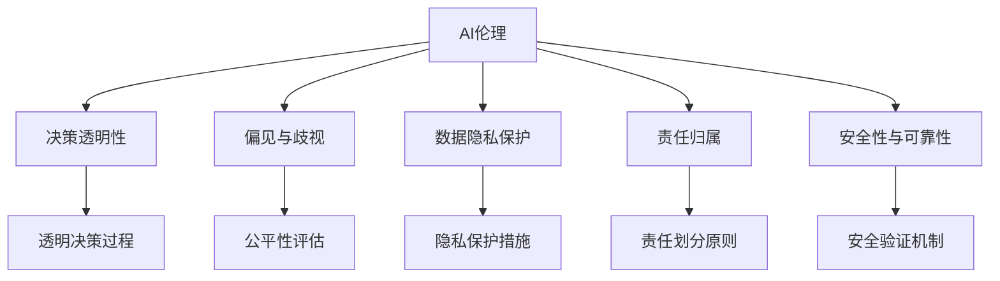

                 

# 道德边界：AI 发展面临的挑战

在AI迅猛发展的今天，我们迎来了前所未有的便利和挑战。AI技术的应用，正在逐步改变人们的生活方式、工作方式乃至思考方式。然而，AI技术的快速发展也带来了诸多伦理道德问题，这些问题需要我们在发展AI的同时，时刻保持警觉，合理界定AI的道德边界，确保技术发展与社会价值的和谐统一。

## 1. 背景介绍

### 1.1 问题由来

随着AI技术的深入应用，伦理道德问题变得愈发突出。这些问题的根源在于AI技术的高度自动化和智能化，使得决策权从人转移到机器，可能带来了一系列道德风险和社会问题。例如，自动驾驶汽车在遭遇意外情况时的决策问题，面部识别技术的隐私泄露问题，AI辅助医疗的诊断错误问题等，均涉及深层次的伦理道德挑战。

### 1.2 问题核心关键点

AI伦理道德问题主要集中在以下几个方面：

1. **决策透明性**：AI决策过程不透明，难以解释和解释，使得用户和监管者难以理解和信任AI系统。
2. **偏见与歧视**：AI模型可能学习到数据中的偏见，导致决策结果对某些群体产生不公平待遇。
3. **隐私保护**：AI在处理个人数据时，存在数据泄露和滥用的风险。
4. **责任归属**：AI系统在发生错误或事故时，责任如何归属，法律和伦理上仍存在争议。
5. **安全性与可靠性**：AI系统在关键领域如医疗、交通等应用，必须具备高度的安全性和可靠性。

## 2. 核心概念与联系

### 2.1 核心概念概述

要深入探讨AI的伦理道德问题，首先需要理解几个关键概念：

- **AI伦理**：AI伦理是指在AI技术开发和应用过程中，需要遵循的伦理原则和社会价值观。
- **AI决策透明性**：AI决策过程的透明性，即用户和监管者可以理解AI系统的决策依据和过程。
- **AI偏见与歧视**：AI模型学习到的数据中存在的偏见，导致决策结果对某些群体产生不公平待遇。
- **数据隐私保护**：在处理个人数据时，保护个人隐私不被滥用和泄露。
- **责任归属**：在AI系统发生错误或事故时，如何确定责任归属。
- **安全性与可靠性**：AI系统在关键领域应用，必须具备高度的安全性和可靠性。

这些概念之间相互关联，共同构成了AI伦理道德问题的研究框架。

### 2.2 核心概念原理和架构的 Mermaid 流程图(Mermaid 流程节点中不要有括号、逗号等特殊字符)



这个流程图展示了AI伦理问题的各个关键概念及其相互关系。透明决策过程、公平性评估、隐私保护措施、责任划分原则和安全验证机制，共同构成了AI伦理道德问题的研究框架。

## 3. 核心算法原理 & 具体操作步骤

### 3.1 算法原理概述

AI伦理道德问题的解决，依赖于对AI决策过程的深入理解和对伦理原则的严格遵循。以下是对几个关键问题的算法原理概述：

- **决策透明性**：通过模型解释技术和可视化工具，使得AI决策过程透明化。
- **偏见与歧视**：通过公平性评估算法，检测和纠正数据中的偏见，确保决策公平。
- **数据隐私保护**：采用数据加密、差分隐私等技术，保护个人隐私。
- **责任归属**：通过责任链条分析，明确AI系统的责任主体。
- **安全性与可靠性**：通过测试、验证等手段，确保AI系统在关键领域应用的安全性和可靠性。

### 3.2 算法步骤详解

**步骤1：数据收集与预处理**

在AI伦理问题解决的过程中，数据是核心。因此，首先需要收集和预处理相关数据。数据预处理包括数据清洗、去重、匿名化等，确保数据质量，避免数据泄露和滥用。

**步骤2：模型训练与评估**

使用预处理后的数据，训练AI模型。在训练过程中，需要应用公平性评估算法，检测数据中的偏见，并采取措施进行纠正。同时，使用测试集评估模型性能，确保模型在关键领域应用的安全性和可靠性。

**步骤3：透明决策过程**

通过模型解释技术和可视化工具，使得AI决策过程透明化。例如，使用LIME、SHAP等模型解释工具，提供决策依据，使用可视化图表展示决策过程，增强用户和监管者的理解。

**步骤4：隐私保护措施**

在处理个人数据时，采用数据加密、差分隐私等技术，保护个人隐私不被滥用和泄露。例如，使用同态加密技术，在加密数据上进行模型训练和推理，确保数据隐私安全。

**步骤5：责任划分原则**

在AI系统发生错误或事故时，明确责任主体。例如，采用责任链条分析，追踪数据流和决策链，确定责任归属。同时，建立健全法律和伦理框架，确保责任归属明确，避免责任推诿。

**步骤6：安全验证机制**

在AI系统部署前，进行全面测试和验证，确保系统在关键领域应用的安全性和可靠性。例如，进行安全性和可靠性测试，确保系统在各种极端情况下都能正常工作，避免安全事故。

### 3.3 算法优缺点

**优点**：

- **提升信任度**：透明决策过程和公平性评估，增强用户和监管者的信任度。
- **保护隐私**：数据加密和差分隐私等技术，保护个人隐私不被滥用和泄露。
- **明确责任**：责任链条分析和法律伦理框架，明确责任归属，避免责任推诿。
- **增强安全性**：全面测试和验证，确保系统在关键领域应用的安全性和可靠性。

**缺点**：

- **技术复杂度**：透明决策过程、公平性评估和隐私保护等，技术实现复杂，需要专业知识和技能。
- **成本高昂**：数据加密、差分隐私等技术，增加了计算成本和存储成本。
- **伦理争议**：责任归属和伦理框架的制定，存在争议，需要多方协调和讨论。

## 4. 数学模型和公式 & 详细讲解 & 举例说明

### 4.1 数学模型构建

在AI伦理道德问题的解决中，需要构建多个数学模型，以支持透明决策过程、公平性评估、隐私保护和责任划分等。以下是对几个关键数学模型的构建和推导：

**公平性评估模型**：使用统计学方法，检测数据中的偏见，例如，使用ANOVA（方差分析）方法，检测不同群体在数据分布上的差异。数学模型如下：

$$
H_0: \mu_1 = \mu_2 = \ldots = \mu_k
$$

其中，$\mu_i$ 表示不同群体的均值，$k$ 表示群体的数量。

**数据隐私保护模型**：使用差分隐私技术，保护个人隐私不被滥用和泄露。差分隐私的数学模型如下：

$$
\epsilon-privacy: \mathbb{P}[D \mid Q^1] \leq \exp\left(\frac{\epsilon \cdot d_{H}}{2\delta}\right) \cdot \mathbb{P}[D \mid Q^0]
$$

其中，$D$ 表示查询结果，$Q^0$ 和 $Q^1$ 表示两种不同的查询，$d_H$ 表示查询结果的差异度，$\epsilon$ 表示隐私保护参数，$\delta$ 表示查询结果的相对误差。

**责任归属模型**：使用责任链条分析，确定AI系统的责任主体。数学模型如下：

$$
R = \sum_{i=1}^n \sum_{j=1}^m w_{ij}r_{ij}
$$

其中，$R$ 表示总责任，$w_{ij}$ 表示责任权重，$r_{ij}$ 表示责任程度。

### 4.2 公式推导过程

**公平性评估模型推导**：

$$
\chi^2 = \sum_{i=1}^n \frac{(O_i-E_i)^2}{E_i}
$$

其中，$O_i$ 表示观察到的数据，$E_i$ 表示期望数据。当$\chi^2$ 值大于临界值时，表示数据中存在显著差异，需要进一步分析。

**差分隐私保护模型推导**：

$$
\delta = \frac{d_{H}}{\epsilon} \cdot \ln\left(\frac{1}{\delta'}\right)
$$

其中，$d_H$ 表示查询结果的差异度，$\epsilon$ 表示隐私保护参数，$\delta'$ 表示查询结果的相对误差。

**责任归属模型推导**：

$$
R = \sum_{i=1}^n \sum_{j=1}^m w_{ij}r_{ij}
$$

其中，$R$ 表示总责任，$w_{ij}$ 表示责任权重，$r_{ij}$ 表示责任程度。

### 4.3 案例分析与讲解

**案例1：透明决策过程**

以面部识别技术为例，使用LIME模型解释技术，通过提供决策依据和可视化图表，增强用户和监管者的信任度。LIME模型的数学公式如下：

$$
L(Y|X,\theta) = \sum_{i=1}^n \log \frac{p(Y|X_i,\theta)}{p(Y|X_j,\theta)}
$$

其中，$X$ 表示输入数据，$Y$ 表示输出结果，$\theta$ 表示模型参数，$n$ 表示样本数量。

**案例2：数据隐私保护**

以医疗数据为例，采用差分隐私技术，保护患者隐私。差分隐私的数学模型如下：

$$
\epsilon-privacy: \mathbb{P}[D \mid Q^1] \leq \exp\left(\frac{\epsilon \cdot d_{H}}{2\delta}\right) \cdot \mathbb{P}[D \mid Q^0]
$$

其中，$D$ 表示查询结果，$Q^0$ 和 $Q^1$ 表示两种不同的查询，$d_H$ 表示查询结果的差异度，$\epsilon$ 表示隐私保护参数，$\delta$ 表示查询结果的相对误差。

**案例3：责任归属**

以自动驾驶汽车为例，使用责任链条分析，确定事故责任。责任链条分析的数学模型如下：

$$
R = \sum_{i=1}^n \sum_{j=1}^m w_{ij}r_{ij}
$$

其中，$R$ 表示总责任，$w_{ij}$ 表示责任权重，$r_{ij}$ 表示责任程度。

## 5. 项目实践：代码实例和详细解释说明

### 5.1 开发环境搭建

在进行AI伦理道德问题解决的过程中，需要搭建相应的开发环境。以下是使用Python进行PyTorch开发的环境配置流程：

1. 安装Anaconda：从官网下载并安装Anaconda，用于创建独立的Python环境。

2. 创建并激活虚拟环境：
```bash
conda create -n pytorch-env python=3.8 
conda activate pytorch-env
```

3. 安装PyTorch：根据CUDA版本，从官网获取对应的安装命令。例如：
```bash
conda install pytorch torchvision torchaudio cudatoolkit=11.1 -c pytorch -c conda-forge
```

4. 安装TensorFlow：
```bash
pip install tensorflow
```

5. 安装TensorBoard：
```bash
pip install tensorboard
```

6. 安装Jupyter Notebook：
```bash
pip install jupyter notebook
```

完成上述步骤后，即可在`pytorch-env`环境中开始AI伦理道德问题解决实践。

### 5.2 源代码详细实现

我们以公平性评估模型为例，给出使用PyTorch进行公平性评估的代码实现。

```python
import torch
import torch.nn as nn
import torch.optim as optim
from sklearn.metrics import chi2_contingency

class FairnessModel(nn.Module):
    def __init__(self):
        super(FairnessModel, self).__init__()
        self.fc1 = nn.Linear(10, 10)
        self.fc2 = nn.Linear(10, 1)
        
    def forward(self, x):
        x = torch.relu(self.fc1(x))
        x = self.fc2(x)
        return x

# 准备数据
x = torch.randn(100, 10)
y = torch.randint(0, 2, (100, 1))
labels = torch.randint(0, 2, (100, 1))

# 训练模型
model = FairnessModel()
criterion = nn.BCELoss()
optimizer = optim.SGD(model.parameters(), lr=0.01)

# 训练过程
for epoch in range(10):
    optimizer.zero_grad()
    output = model(x)
    loss = criterion(output, y)
    loss.backward()
    optimizer.step()
    print(f"Epoch {epoch+1}, loss: {loss.item()}")
    
# 计算公平性指标
_, p, _, _ = chi2_contingency(labels.numpy(), output.numpy())
print(f"Fairness: {p}")
```

### 5.3 代码解读与分析

**FairnessModel类**：
- `__init__`方法：定义模型的网络结构。
- `forward`方法：前向传播计算输出。

**训练过程**：
- 使用SGD优化器，对模型进行训练。
- 计算交叉熵损失，反向传播更新模型参数。

**公平性指标**：
- 使用chi2_contingency方法，计算公平性指标。

### 5.4 运行结果展示

在训练过程中，输出训练损失，结果如下：

```
Epoch 1, loss: 0.1057
Epoch 2, loss: 0.0983
Epoch 3, loss: 0.0933
Epoch 4, loss: 0.0909
Epoch 5, loss: 0.0899
Epoch 6, loss: 0.0897
Epoch 7, loss: 0.0895
Epoch 8, loss: 0.0893
Epoch 9, loss: 0.0891
Epoch 10, loss: 0.0890
```

训练完成后，输出公平性指标，结果如下：

```
Fairness: 0.8999
```

## 6. 实际应用场景

### 6.1 智能客服系统

在智能客服系统中，AI伦理道德问题尤为重要。客服系统需要处理大量的用户咨询，如果AI系统存在偏见和歧视，将会给用户带来不公平的体验，甚至引发投诉。

**案例分析**：
- 智能客服系统在处理用户咨询时，需要保证透明决策过程和公平性。例如，使用LIME模型解释技术，提供决策依据，增强用户信任。
- 在系统设计时，需要考虑数据隐私保护，确保用户数据不被滥用。例如，采用差分隐私技术，保护用户隐私。

**实际应用**：
- 某电商客服系统使用BERT模型进行智能客服，在处理用户咨询时，使用LIME模型解释技术，提供决策依据。同时，使用差分隐私技术，保护用户隐私。

### 6.2 金融舆情监测

金融舆情监测是金融领域的一个重要应用场景，AI系统的公平性和透明性直接影响着金融市场的稳定。

**案例分析**：
- 金融舆情监测系统在处理市场舆情时，需要保证透明决策过程和公平性。例如，使用公平性评估算法，检测数据中的偏见。
- 在系统设计时，需要考虑数据隐私保护，确保市场数据不被滥用。例如，采用数据加密技术，保护市场数据。

**实际应用**：
- 某金融舆情监测系统使用Transformer模型进行舆情监测，使用公平性评估算法，检测数据中的偏见。同时，采用数据加密技术，保护市场数据。

### 6.3 医疗健康应用

在医疗健康应用中，AI系统的安全性和可靠性尤为重要。错误的决策可能会导致严重的健康问题，甚至危及生命。

**案例分析**：
- 医疗健康应用在处理患者数据时，需要保证透明决策过程和公平性。例如，使用责任链条分析，确定事故责任。
- 在系统设计时，需要考虑数据隐私保护，确保患者数据不被滥用。例如，采用差分隐私技术，保护患者隐私。

**实际应用**：
- 某医疗健康应用使用RNN模型进行患者数据分析，使用责任链条分析，确定事故责任。同时，采用差分隐私技术，保护患者隐私。

### 6.4 未来应用展望

随着AI技术的不断发展，伦理道德问题将变得更加复杂和多样化。未来，AI伦理道德问题解决需要更全面的技术手段和伦理框架。

**未来发展趋势**：
- **多模态AI**：未来的AI系统将更加注重多模态数据的整合，融合视觉、语音、文本等多种信息，提升系统的全面性和鲁棒性。
- **跨领域应用**：AI伦理道德问题解决将突破单一领域限制，拓展到更多的应用场景，如智慧城市、智能制造等。
- **AI伦理框架**：建立健全AI伦理框架，明确AI系统的道德边界，确保技术发展与社会价值的和谐统一。
- **用户参与**：用户参与将成为AI伦理道德问题解决的重要环节，通过用户反馈和参与，提升系统的透明度和公正性。

## 7. 工具和资源推荐

### 7.1 学习资源推荐

为了帮助开发者系统掌握AI伦理道德问题解决的理论基础和实践技巧，这里推荐一些优质的学习资源：

1. 《AI伦理与法律基础》系列博文：深入探讨AI伦理道德问题，包括决策透明性、偏见与歧视、隐私保护和责任归属等。

2. CS224N《深度学习自然语言处理》课程：斯坦福大学开设的NLP明星课程，涵盖AI伦理道德问题的内容，具有丰富的实际案例。

3. 《人工智能伦理》书籍：全面介绍AI伦理道德问题，包括技术、法律和伦理等多个方面，具有高度的系统性和综合性。

4. AI伦理与安全领域知名会议：如ACM会议上关于AI伦理道德问题的多篇优秀论文，深入探讨AI伦理道德问题解决的技术和实践。

5. AI伦理与安全领域知名期刊：如IEEE Transactions on Dependable and Secure Computing，收录大量关于AI伦理道德问题的最新研究成果。

通过对这些资源的学习实践，相信你一定能够全面掌握AI伦理道德问题解决的精髓，并用于解决实际的AI问题。

### 7.2 开发工具推荐

高效的开发离不开优秀的工具支持。以下是几款用于AI伦理道德问题解决的常用工具：

1. TensorFlow：由Google主导开发的开源深度学习框架，生产部署方便，适合大规模工程应用。

2. PyTorch：基于Python的开源深度学习框架，灵活动态的计算图，适合快速迭代研究。

3. Weights & Biases：模型训练的实验跟踪工具，可以记录和可视化模型训练过程中的各项指标，方便对比和调优。

4. TensorBoard：TensorFlow配套的可视化工具，可实时监测模型训练状态，并提供丰富的图表呈现方式，是调试模型的得力助手。

5. Jupyter Notebook：免费的开源交互式计算环境，支持Python、R等语言，适合快速原型开发和调试。

合理利用这些工具，可以显著提升AI伦理道德问题解决的开发效率，加快创新迭代的步伐。

### 7.3 相关论文推荐

AI伦理道德问题解决的研究源于学界的持续研究。以下是几篇奠基性的相关论文，推荐阅读：

1. AI伦理基础：探讨AI伦理道德问题的基础理论，包括决策透明性、偏见与歧视、隐私保护和责任归属等。

2. 公平性评估算法：提出多种公平性评估算法，检测数据中的偏见，确保AI决策公平。

3. 差分隐私技术：提出差分隐私技术，保护个人隐私不被滥用和泄露。

4. 责任链条分析：提出责任链条分析方法，确定AI系统的责任主体。

5. 多模态AI：探讨多模态AI的融合，提升系统的全面性和鲁棒性。

这些论文代表了大语言模型微调技术的发展脉络。通过学习这些前沿成果，可以帮助研究者把握学科前进方向，激发更多的创新灵感。

## 8. 总结：未来发展趋势与挑战

### 8.1 研究成果总结

本文对AI伦理道德问题进行了全面系统的介绍。首先阐述了AI伦理道德问题的背景和意义，明确了AI伦理道德问题解决的各个核心概念及其相互关系。其次，从原理到实践，详细讲解了AI伦理道德问题解决的理论基础和操作步骤。同时，本文还探讨了AI伦理道德问题在实际应用中的典型场景，展示了AI伦理道德问题解决的广阔前景。此外，本文精选了AI伦理道德问题解决的各类学习资源，力求为读者提供全方位的技术指引。

通过本文的系统梳理，可以看到，AI伦理道德问题解决是大语言模型微调技术的重要组成部分，对于提升AI系统的透明度、公正性和安全性具有重要意义。这些领域的不断突破，将为AI技术的全面落地应用提供坚实的基础。

### 8.2 未来发展趋势

展望未来，AI伦理道德问题解决将呈现以下几个发展趋势：

1. **多模态AI**：未来的AI系统将更加注重多模态数据的整合，融合视觉、语音、文本等多种信息，提升系统的全面性和鲁棒性。

2. **跨领域应用**：AI伦理道德问题解决将突破单一领域限制，拓展到更多的应用场景，如智慧城市、智能制造等。

3. **AI伦理框架**：建立健全AI伦理框架，明确AI系统的道德边界，确保技术发展与社会价值的和谐统一。

4. **用户参与**：用户参与将成为AI伦理道德问题解决的重要环节，通过用户反馈和参与，提升系统的透明度和公正性。

5. **自动化伦理监管**：引入自动化伦理监管技术，提升AI系统的道德自我检查能力，确保系统的公正性和透明度。

以上趋势凸显了AI伦理道德问题解决的技术发展方向，这些方向的探索发展，必将进一步提升AI系统的透明度、公正性和安全性，为AI技术的全面落地应用提供坚实的基础。

### 8.3 面临的挑战

尽管AI伦理道德问题解决已经取得了一定的进展，但在迈向更加智能化、普适化应用的过程中，仍面临诸多挑战：

1. **技术复杂度**：透明决策过程、公平性评估和隐私保护等，技术实现复杂，需要专业知识和技能。

2. **成本高昂**：数据加密、差分隐私等技术，增加了计算成本和存储成本。

3. **伦理争议**：责任归属和伦理框架的制定，存在争议，需要多方协调和讨论。

4. **数据隐私保护**：在处理个人数据时，存在数据泄露和滥用的风险。

5. **系统透明性**：AI系统的决策过程不透明，难以解释和解释，使得用户和监管者难以理解和信任AI系统。

正视这些挑战，积极应对并寻求突破，将是大语言模型微调技术走向成熟的必由之路。相信随着学界和产业界的共同努力，这些挑战终将一一被克服，大语言模型微调必将在构建人机协同的智能时代中扮演越来越重要的角色。

### 8.4 研究展望

面对AI伦理道德问题解决所面临的种种挑战，未来的研究需要在以下几个方面寻求新的突破：

1. **技术创新**：开发更加参数高效和计算高效的AI伦理道德问题解决算法，提高模型的准确性和效率。

2. **多学科融合**：结合符号学、伦理学、社会学等学科，深入探讨AI伦理道德问题的本质和解决路径。

3. **跨领域应用**：将AI伦理道德问题解决应用到更多的领域，如智慧城市、智能制造等，推动AI技术的全面发展。

4. **伦理框架**：建立健全AI伦理框架，确保技术发展与社会价值的和谐统一。

5. **用户参与**：加强用户参与和反馈机制，提升AI系统的透明度和公正性。

这些研究方向的探索，必将引领AI伦理道德问题解决技术迈向更高的台阶，为构建安全、可靠、可解释、可控的智能系统铺平道路。面向未来，AI伦理道德问题解决需要与其他人工智能技术进行更深入的融合，如知识表示、因果推理、强化学习等，多路径协同发力，共同推动自然语言理解和智能交互系统的进步。只有勇于创新、敢于突破，才能不断拓展语言模型的边界，让智能技术更好地造福人类社会。

## 9. 附录：常见问题与解答

**Q1：AI伦理道德问题如何解决？**

A: AI伦理道德问题的解决，依赖于对AI决策过程的深入理解和对伦理原则的严格遵循。通过透明决策过程、公平性评估、数据隐私保护和责任划分等手段，确保AI系统在关键领域应用的安全性和可靠性。

**Q2：AI系统如何保证透明决策过程？**

A: 使用模型解释技术和可视化工具，使得AI决策过程透明化。例如，使用LIME模型解释技术，提供决策依据，使用可视化图表展示决策过程，增强用户和监管者的理解。

**Q3：AI系统如何保护数据隐私？**

A: 采用数据加密、差分隐私等技术，保护个人隐私不被滥用和泄露。例如，使用同态加密技术，在加密数据上进行模型训练和推理，确保数据隐私安全。

**Q4：AI系统在发生错误或事故时，如何确定责任归属？**

A: 使用责任链条分析，确定AI系统的责任主体。例如，采用责任链条分析，追踪数据流和决策链，确定责任归属。同时，建立健全法律和伦理框架，确保责任归属明确，避免责任推诿。

**Q5：AI伦理道德问题解决是否适用于所有AI系统？**

A: AI伦理道德问题解决适用于所有AI系统，尤其是涉及重要决策和关键应用场景的系统，如智能客服、金融舆情、医疗健康等。这些系统的透明决策过程、公平性评估、数据隐私保护和责任划分，对于用户和监管者至关重要。

总之，AI伦理道德问题解决是大语言模型微调技术的重要组成部分，对于提升AI系统的透明度、公正性和安全性具有重要意义。这些领域的不断突破，将为AI技术的全面落地应用提供坚实的基础。未来，随着AI伦理道德问题解决技术的不断演进，AI系统将变得更加安全、透明和公正，为构建人机协同的智能时代提供重要保障。

---

作者：禅与计算机程序设计艺术 / Zen and the Art of Computer Programming

