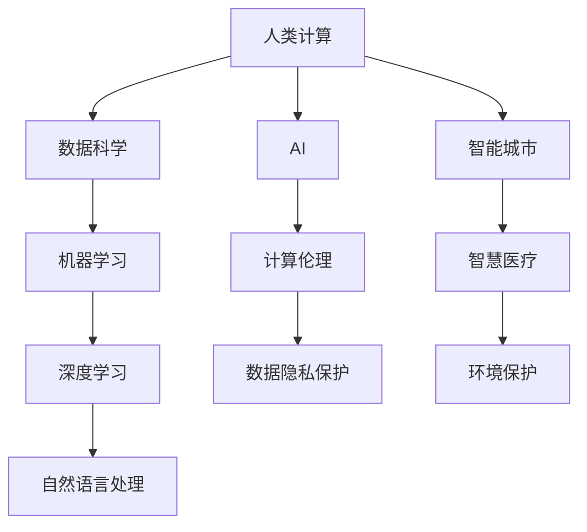

                 

# 释放人类创造力的源泉：人类计算的魅力

> 关键词：人工智能(AI)，人类计算，人类为中心的计算，计算伦理，机器学习，深度学习，决策支持系统，数据科学，智能城市

## 1. 背景介绍

在人类进入数字时代以来，计算已经成为了推动社会进步的重要动力。从简单的加减乘除，到复杂的机器学习、深度学习算法，计算机的计算能力日益强大，人类社会的生产生活也发生了翻天覆地的变化。然而，随着计算能力的不断提高，人们开始反思：机器的计算能力真的已经超越人类吗？计算的本质是什么？人类计算的未来发展趋势又将如何？本文将探讨这些问题，并从计算伦理和应用场景的角度，深入分析人类计算的魅力所在。

### 1.1 计算的发展历程

计算技术的演进经历了几个关键阶段：

1. **机械计算**：最早的计算设备是各种简单的机械装置，如计算尺、差分机等。它们主要用于基本的数学计算和绘图，计算速度和准确性都有很大限制。
2. **电子计算**：1946年，第一台通用电子计算机ENIAC问世，开启了电子计算的时代。随着晶体管、集成电路的发明，计算速度和处理能力迅速提升。
3. **个人计算机**：1970年代，个人计算机（PC）的普及，使得计算从专业领域进入普通家庭，改变了人们的生活方式和工作模式。
4. **互联网时代**：1990年代，互联网的诞生和发展，极大地拓展了计算的应用场景，推动了大数据和云计算的兴起。
5. **人工智能和深度学习**：21世纪以来，人工智能和深度学习技术的突破，使得计算能力迈向了全新的高度，能够处理复杂的自然语言、图像、声音等多模态数据。

### 1.2 计算伦理的兴起

随着计算能力的大幅提升，计算伦理成为了一个备受关注的话题。计算伦理强调在计算过程中，尊重个体权利、保护数据隐私、维护社会公平等方面，体现了人类在计算发展中的自觉思考和道德责任。

## 2. 核心概念与联系

### 2.1 核心概念概述

为了更好地理解人类计算的魅力，本节将介绍几个关键概念：

- **人类计算**：指由人类进行的计算活动，包括数学计算、编程、数据分析等。与机器计算不同，人类计算具有创造性、灵活性和情感性。
- **计算伦理**：涉及计算过程中应遵循的道德和法律原则，包括数据隐私保护、算法透明性、责任归属等。
- **人工智能(AI)**：通过机器学习、深度学习等技术实现模拟人类智能的计算系统。AI的目标是赋予机器类似于人类的智能，解决复杂问题。
- **人类为中心的计算**：强调在计算设计中考虑人类的需求和限制，结合人类的智慧与计算能力的优势，实现更高效、更人性化的计算。
- **数据科学**：一门涉及数据采集、处理、分析、可视化的跨学科领域，旨在从数据中提取有价值的信息，辅助决策和创新。
- **智能城市**：利用信息技术和大数据，提升城市管理效率，改善市民生活质量，促进可持续发展。

### 2.2 核心概念联系

人类计算、AI、数据科学等概念，都是人类在计算领域不断探索和创新的结果。通过这些技术，人类不仅解决了许多实际问题，还重新思考了计算的本质和伦理，推动了社会进步和人类创造力的释放。以下是这些概念之间的逻辑关系：



### 2.3 核心概念之间的逻辑关系

- **人类计算与AI**：人类计算是AI发展的起点，通过人类的智慧和努力，创造了深度学习、机器学习等技术，使机器能够处理复杂问题。
- **数据科学**：数据科学利用数据挖掘、统计分析等方法，从大规模数据中提取知识，辅助决策支持，推动了AI和人类计算的发展。
- **智能城市**：智能城市通过物联网、大数据等技术，提升了城市管理和公共服务的智能化水平，体现了人类计算在现实世界中的应用。
- **计算伦理**：计算伦理涉及数据隐私、算法透明、责任归属等，确保计算技术的健康发展，维护社会公平和伦理正义。

这些概念共同构成了人类计算的框架，体现了计算技术的社会价值和伦理责任。

## 3. 核心算法原理 & 操作步骤

### 3.1 算法原理概述

人类计算的核心在于将人类智慧与计算能力相结合，通过算法设计和数据处理，实现复杂问题的解决。常见的算法原理包括：

- **机器学习算法**：通过算法自动分析数据，发现数据中的规律和模式，辅助决策。
- **深度学习算法**：模拟人脑神经网络的结构和功能，通过多层次的非线性变换，解决复杂的模式识别和预测问题。
- **自然语言处理(NLP)**：通过算法理解和生成自然语言，实现人机交互和信息处理。
- **决策支持系统(DSS)**：利用算法为决策者提供数据分析、预测和优化建议，支持决策过程。

这些算法在计算过程中，需要大量数据进行训练和优化，以提高模型的准确性和泛化能力。同时，算法的设计和实现也需要考虑计算伦理和数据隐私等问题，确保其公平性和透明性。

### 3.2 算法步骤详解

以下以深度学习算法为例，介绍其核心步骤：

1. **数据预处理**：对原始数据进行清洗、归一化、标注等处理，形成适合算法输入的数据集。
2. **模型构建**：选择合适的深度学习模型结构，如卷积神经网络(CNN)、循环神经网络(RNN)、长短时记忆网络(LSTM)等，并设置相应的参数。
3. **训练模型**：利用训练集数据对模型进行前向传播和反向传播，不断调整模型参数，使其最小化损失函数，提高模型的准确性。
4. **模型评估**：在测试集上对模型进行评估，计算各项指标（如准确率、召回率、F1-score等），确保模型性能。
5. **模型应用**：将训练好的模型应用于实际问题，进行预测或生成决策建议。

### 3.3 算法优缺点

深度学习算法具有以下优点：

- **自动学习能力强**：能够自动发现数据中的复杂模式和规律，适应性强。
- **泛化能力强**：在大规模数据集上训练后，能够对新数据进行泛化，提高预测准确性。
- **应用广泛**：广泛用于图像识别、语音识别、自然语言处理等领域。

但同时，深度学习算法也存在一些缺点：

- **数据依赖性强**：对数据质量、数量要求高，数据不足时效果差。
- **计算资源需求高**：需要高性能计算设备，训练和推理速度慢。
- **解释性差**：黑盒模型难以解释决策过程，缺乏透明性。

### 3.4 算法应用领域

深度学习算法在多个领域中得到了广泛应用：

- **计算机视觉**：用于图像分类、目标检测、图像生成等任务。
- **自然语言处理(NLP)**：用于文本分类、情感分析、机器翻译等任务。
- **语音识别**：用于语音识别、语音合成、情感识别等任务。
- **医疗诊断**：用于医学影像分析、疾病预测、基因组学研究等任务。
- **智能交通**：用于交通监控、自动驾驶、智能出行规划等任务。
- **金融分析**：用于股票预测、信用评估、风险控制等任务。

## 4. 数学模型和公式 & 详细讲解 & 举例说明

### 4.1 数学模型构建

以图像分类任务为例，我们可以构建一个基于卷积神经网络(CNN)的深度学习模型。假设输入为 $x_i$，模型参数为 $\theta$，输出为 $y_i$，则模型结构如下：

```math
y_i = f_\theta(x_i) = \sigma(W^L \sigma(W^{L-1} \sigma(... \sigma(W^1 x_i)...))
```

其中，$f_\theta$ 为模型的非线性映射函数，$W^k$ 为第 $k$ 层的权重矩阵，$\sigma$ 为激活函数。

### 4.2 公式推导过程

以CNN模型的反向传播算法为例，推导其梯度计算公式。假设第 $i$ 个样本的损失函数为 $L_i(y_i, \hat{y}_i)$，其梯度为 $\nabla_\theta L_i$，则反向传播算法的梯度计算公式为：

$$
\nabla_\theta L_i = \nabla_{y_i} L_i \nabla_{\hat{y}_i} L_i \nabla_\theta f_\theta(x_i)
$$

其中，$\nabla_{y_i} L_i$ 为损失函数对输出 $y_i$ 的梯度，$\nabla_{\hat{y}_i} L_i$ 为输出 $\hat{y}_i$ 对损失函数 $L_i$ 的梯度，$\nabla_\theta f_\theta(x_i)$ 为模型输出 $\hat{y}_i$ 对模型参数 $\theta$ 的梯度。

### 4.3 案例分析与讲解

以图像分类为例，假设输入图像为28x28的灰度图像，输出为10个类别的标签，分别对应0-9数字。我们使用10层卷积神经网络进行分类，每层卷积核的数量为32，滤波器大小为3x3，步幅为1，激活函数为ReLU，池化大小为2x2，步幅为2。假设训练集包含1000张图像，每个标签出现100次，测试集包含200张图像，每个标签出现50次。在训练集上进行前向传播和反向传播，计算梯度并更新模型参数，直到收敛。

## 5. 项目实践：代码实例和详细解释说明

### 5.1 开发环境搭建

要实现深度学习算法，需要搭建Python开发环境，并安装必要的库和框架。以下是搭建Python环境的步骤：

1. **安装Anaconda**：从官网下载并安装Anaconda，用于创建独立的Python环境。
2. **创建虚拟环境**：在Anaconda Prompt中运行以下命令，创建名为 `myenv` 的虚拟环境：

   ```bash
   conda create -n myenv python=3.8
   conda activate myenv
   ```

3. **安装依赖库**：在虚拟环境中安装必要的库和框架，如TensorFlow、Keras等：

   ```bash
   conda install tensorflow
   conda install keras
   ```

### 5.2 源代码详细实现

以下是一个基于TensorFlow的图像分类模型的实现代码：

```python
import tensorflow as tf
from tensorflow.keras import datasets, layers, models

# 加载数据集
(train_images, train_labels), (test_images, test_labels) = datasets.cifar10.load_data()

# 数据预处理
train_images = train_images / 255.0
test_images = test_images / 255.0

# 构建模型
model = models.Sequential([
    layers.Conv2D(32, (3, 3), activation='relu', input_shape=(32, 32, 3)),
    layers.MaxPooling2D((2, 2)),
    layers.Conv2D(64, (3, 3), activation='relu'),
    layers.MaxPooling2D((2, 2)),
    layers.Conv2D(64, (3, 3), activation='relu'),
    layers.Flatten(),
    layers.Dense(64, activation='relu'),
    layers.Dense(10)
])

# 编译模型
model.compile(optimizer='adam',
              loss=tf.keras.losses.SparseCategoricalCrossentropy(from_logits=True),
              metrics=['accuracy'])

# 训练模型
history = model.fit(train_images, train_labels, epochs=10, 
                    validation_data=(test_images, test_labels))
```

### 5.3 代码解读与分析

- **数据预处理**：将图像数据归一化到0-1范围内，方便模型训练。
- **模型构建**：使用多个卷积层和池化层，提取图像特征，并使用全连接层进行分类。
- **编译模型**：设置优化器、损失函数和评估指标。
- **训练模型**：使用训练集进行训练，并在验证集上评估性能。

## 6. 实际应用场景

### 6.1 智能医疗

在智能医疗领域，深度学习算法可以用于医学影像分析、疾病预测、基因组学研究等任务。例如，利用深度学习算法分析医学影像，可以自动检测肿瘤、病变等异常区域，辅助医生诊断。此外，基于医疗数据的深度学习模型还可以预测疾病风险，提高疾病预防和早期诊断的效果。

### 6.2 智能交通

在智能交通领域，深度学习算法可以用于交通监控、自动驾驶、智能出行规划等任务。例如，通过深度学习算法分析交通视频，可以实时监测交通流量、识别交通违规行为。自动驾驶技术也需要依赖深度学习算法，通过图像识别和传感器数据处理，实现自主导航和决策。

### 6.3 金融分析

在金融领域，深度学习算法可以用于股票预测、信用评估、风险控制等任务。例如，利用深度学习算法分析历史金融数据，可以预测股票走势，评估企业信用风险，提高投资决策的准确性。

## 7. 工具和资源推荐

### 7.1 学习资源推荐

为了帮助开发者系统掌握深度学习算法的理论基础和实践技巧，这里推荐一些优质的学习资源：

1. **Coursera《机器学习》课程**：由斯坦福大学教授Andrew Ng讲授，涵盖机器学习的基础理论和常用算法。
2. **Deep Learning Specialization**：由Coursera与DeepMind合作推出，涵盖深度学习的前沿技术和实际应用。
3. **TensorFlow官方文档**：提供了TensorFlow的详细使用方法和API文档，是深度学习开发者的必备资料。
4. **Kaggle竞赛**：参与Kaggle数据科学竞赛，可以实践深度学习算法，并与其他数据科学家交流学习。
5. **GitHub开源项目**：GitHub上有很多深度学习项目的代码和文档，可以学习他人的经验和做法。

### 7.2 开发工具推荐

高效的深度学习开发离不开优秀的工具支持。以下是几款常用的深度学习开发工具：

1. **TensorFlow**：由Google主导开发的开源深度学习框架，支持分布式计算，生产部署方便。
2. **PyTorch**：由Facebook主导开发的开源深度学习框架，动态计算图，适合快速迭代研究。
3. **Keras**：Keras是一个高级神经网络API，可在TensorFlow、Theano、CNTK等后端上运行，简化了深度学习模型的搭建过程。
4. **Jupyter Notebook**：一个交互式编程环境，适合进行深度学习算法的实验和研究。
5. **Weights & Biases**：模型训练的实验跟踪工具，可以记录和可视化模型训练过程中的各项指标，方便对比和调优。

### 7.3 相关论文推荐

深度学习算法的发展源于学界的持续研究。以下是几篇奠基性的相关论文，推荐阅读：

1. **ImageNet Classification with Deep Convolutional Neural Networks**：Hinton等人发表的论文，介绍了卷积神经网络在图像分类任务中的应用。
2. **AlexNet: One Millions Trained Image Classifiers**：Krizhevsky等人发表的论文，介绍了AlexNet在图像分类任务中的突破性表现。
3. **Deep Residual Learning for Image Recognition**：He等人发表的论文，介绍了残差网络在深度学习中的重要性。
4. **Attention Is All You Need**：Vaswani等人发表的论文，介绍了自注意力机制在深度学习中的应用。
5. **BERT: Pre-training of Deep Bidirectional Transformers for Language Understanding**：Devlin等人发表的论文，介绍了BERT在大规模预训练和微调中的表现。

## 8. 总结：未来发展趋势与挑战

### 8.1 研究成果总结

深度学习算法在多个领域中已经取得了显著的成就，推动了计算技术的快速发展。未来，随着计算能力的不断提升和数据量的持续增加，深度学习算法将带来更多的突破。

### 8.2 未来发展趋势

- **计算伦理和数据隐私**：随着计算技术的普及，数据隐私和计算伦理问题将更加突出。未来的计算技术需要更好地保护用户隐私，确保算法的透明性和公平性。
- **多模态融合**：未来的计算技术将更多地融合多模态数据，如图像、声音、文本等，提升系统的综合能力。
- **小样本学习**：在大数据时代，小样本学习将成为重要的研究方向，减少对标注数据的依赖，提升算法的泛化能力。
- **弱监督学习**：未来的计算技术将更多地依赖弱监督学习，在标注数据不足的情况下，仍能取得较好的性能。
- **分布式计算**：随着计算任务的复杂度增加，分布式计算将成为一种重要的计算方式，提升计算效率和系统可靠性。
- **量子计算**：未来的计算技术将探索量子计算的应用，利用量子计算机的并行计算能力，解决传统计算难以处理的问题。

### 8.3 面临的挑战

尽管深度学习算法取得了许多成功，但在应用过程中仍然面临一些挑战：

- **数据质量和标注成本**：高质量的数据和标注数据是深度学习算法的基础，但在一些领域，获取这些资源非常困难。
- **算法复杂性和计算资源需求**：深度学习算法需要高性能计算资源，如GPU、TPU等，计算成本较高。
- **算法透明性和可解释性**：深度学习算法的黑盒特性导致其可解释性较差，缺乏透明性。
- **计算伦理和隐私问题**：在计算过程中，如何保护用户隐私和数据安全，是重要的伦理问题。

### 8.4 研究展望

面对深度学习算法面临的挑战，未来的研究需要在以下几个方面进行突破：

- **弱监督学习**：探索在标注数据不足的情况下，如何利用弱监督信号，提高算法的泛化能力。
- **小样本学习**：研究在标注数据较少的情况下，如何通过小样本学习，提升算法的性能。
- **分布式计算**：探索分布式计算框架，如Apache Spark、Apache Flink等，提升计算效率和系统可靠性。
- **量子计算**：研究量子计算在深度学习算法中的应用，提升计算效率和处理能力。
- **计算伦理和隐私保护**：研究如何保护用户隐私，确保计算技术的公平性和透明性。

## 9. 附录：常见问题与解答

**Q1: 如何理解人类计算与机器计算的关系？**

A: 人类计算与机器计算是计算技术的两个重要组成部分。人类计算依赖于人类的智慧和经验，具有创造性、灵活性和情感性。机器计算则依赖于算法和数据，具有自动学习能力和泛化能力。在实际应用中，人类计算和机器计算常常结合使用，互为补充，共同解决复杂问题。

**Q2: 深度学习算法的优势和局限性是什么？**

A: 深度学习算法的优势在于其自动学习能力和泛化能力，能够处理复杂的模式识别和预测问题。其局限性在于对数据质量、数量要求高，计算资源需求大，算法透明性差，黑盒模型难以解释。未来，如何降低对标注数据的依赖，提高算法透明性，将是重要的研究方向。

**Q3: 如何平衡计算伦理和数据隐私保护？**

A: 计算伦理和数据隐私保护是深度学习算法应用的重要考虑因素。在计算过程中，应确保算法的透明性、公平性和可解释性，同时保护用户隐私和数据安全。这需要从算法设计、数据采集和存储等环节进行综合考虑，确保计算技术的健康发展。

**Q4: 未来计算技术的发展趋势是什么？**

A: 未来计算技术将融合多模态数据，探索量子计算等新型计算方式，提升计算效率和处理能力。同时，计算伦理和数据隐私保护将更加重要，弱监督学习和小样本学习等技术也将获得更多的关注。

---

作者：禅与计算机程序设计艺术 / Zen and the Art of Computer Programming

