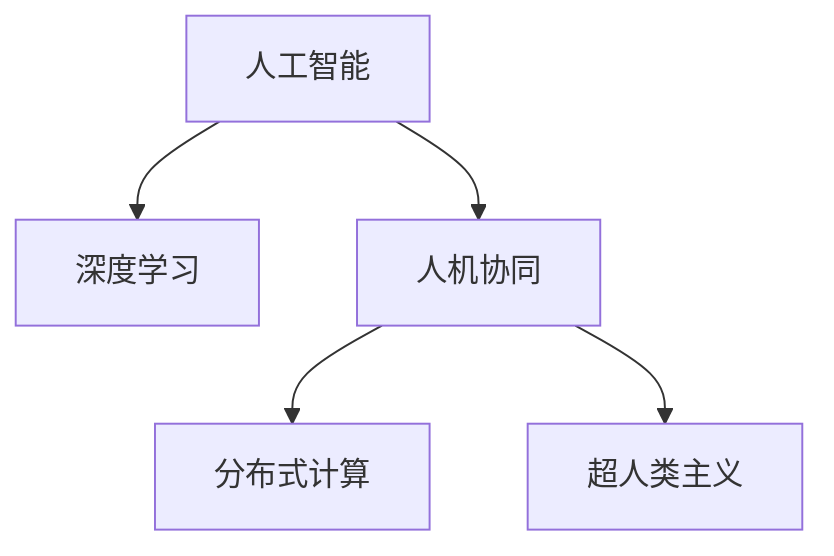

                 

# 释放人类潜力的无限可能：人类计算的最终目标

> 关键词：人工智能,人类计算,机器学习,深度学习,人机协同,智慧社会,超人类主义

## 1. 背景介绍

### 1.1 问题由来
当今社会，计算机技术已经渗透到各行各业，改变了我们的生产、生活和工作方式。然而，人类计算机的演化并未止步于此。人工智能(Artificial Intelligence, AI)的崛起，尤其是深度学习(Deep Learning)的突破，正在催生一种新的计算范式——人类计算(Human Computing)。

人类计算的概念最早由约翰·冯·诺依曼(John von Neumann)在20世纪50年代提出，即利用人类智能，通过与机器的协同，提升计算能力和解决问题的效果。随着科技的进步，这一概念正逐渐由抽象走向现实，成为未来计算发展的方向。

### 1.2 问题核心关键点
人类计算的核心在于将人类智慧与计算机技术深度融合，实现协同计算。这种计算范式具有以下关键特征：

1. **人机协同**：通过人机协作，最大化利用人类智能和机器计算的各自优势。
2. **智能化提升**：结合人类认知能力，提升机器对复杂问题的理解与解决能力。
3. **多模态交互**：支持语音、图像、文本等多种模态的输入与输出，增强用户体验。
4. **分布式计算**：通过分布式协作，实现大规模、高复杂度的计算任务。

这些关键点共同构成了人类计算的基石，为构建智慧社会提供了技术支持。

### 1.3 问题研究意义
研究人类计算，对于推动科技进步、促进经济发展、提升社会福祉具有重要意义：

1. **提升计算能力**：通过人机协同，极大地提升了计算的速度和准确性。
2. **推动技术创新**：人类计算突破了传统机器学习的局限，打开了新的人工智能研究方向。
3. **促进产业升级**：在医疗、金融、教育等众多领域，人类计算将带来技术革新和效率提升。
4. **构建智慧社会**：通过智能交互和辅助决策，提升社会治理效率，构建更加智能、便捷的社会。

## 2. 核心概念与联系

### 2.1 核心概念概述

为更好地理解人类计算，本节将介绍几个密切相关的核心概念：

- **人工智能**：通过算法和计算技术，使机器模仿人类智能过程。
- **深度学习**：基于神经网络的机器学习算法，具有自主学习和复杂模式识别能力。
- **人机协同**：通过智能系统与人类智慧的协同工作，实现共同提升。
- **分布式计算**：通过多台计算机的协作，实现大规模计算任务的高效处理。
- **超人类主义**：通过技术增强，实现人机合一，进一步拓展人类的能力边界。

这些核心概念之间的逻辑关系可以通过以下Mermaid流程图来展示：



这个流程图展示了几大核心概念及其之间的关系：

1. 深度学习是人工智能的重要实现方式。
2. 人机协同和分布式计算是实现人工智能的关键技术。
3. 超人类主义是人工智能发展的终极目标。

这些概念共同构成了人类计算的核心架构，使得人工智能技术能够更好地服务于人类社会，提升生活质量和生产力。

## 3. 核心算法原理 & 具体操作步骤
### 3.1 算法原理概述

人类计算的核心算法原理主要包括以下几个方面：

1. **人机协同**：通过智能系统和人类智慧的结合，实现任务分解和信息整合。
2. **深度学习**：利用神经网络模型，学习复杂模式和结构。
3. **分布式计算**：通过多台计算机的并行处理，实现大规模计算任务的加速。
4. **超人类主义**：通过增强现实、虚拟现实等技术，拓展人类的感知能力和计算能力。

这些原理构成了人类计算的核心，使得计算系统能够更好地理解和处理复杂问题。

### 3.2 算法步骤详解

人类计算的一般流程包括以下几个关键步骤：

**Step 1: 任务分解与预处理**
- 定义计算任务，并进行任务分解，将其拆分为多个子任务。
- 对输入数据进行预处理，包括清洗、归一化、特征提取等。

**Step 2: 模型训练与优化**
- 选择合适的深度学习模型，如卷积神经网络(CNN)、循环神经网络(RNN)、Transformer等。
- 使用历史数据对模型进行训练，通过优化算法（如Adam、SGD等）更新模型参数。
- 在训练过程中，应用正则化技术（如L2正则、Dropout等），防止过拟合。

**Step 3: 人机交互与协同计算**
- 设计智能系统的输入输出接口，支持多种模态的交互。
- 在计算过程中，智能系统根据任务需求，与人类进行信息交互，实现任务协同。
- 通过分布式计算技术，实现多台计算机的并行处理，提升计算效率。

**Step 4: 结果反馈与迭代优化**
- 根据计算结果，智能系统向人类反馈信息，帮助人类进行决策。
- 在迭代过程中，不断优化模型和算法，提升计算准确性和效率。
- 结合人类反馈，进一步改进智能系统的设计和功能。

通过以上步骤，人类计算能够有效地将人类智慧与计算机技术结合，实现高效、智能的协同计算。

### 3.3 算法优缺点

人类计算具有以下优点：
1. 高效性：通过人机协同，大幅提升计算速度和精度。
2. 智能性：结合人类智慧，提升机器对复杂问题的理解和解决能力。
3. 灵活性：支持多种模态的输入输出，增强用户体验。
4. 扩展性：通过分布式计算，实现大规模、高复杂度的计算任务。

同时，该方法也存在一定的局限性：
1. 依赖人类智慧：人类计算的效果在很大程度上取决于人类专家的知识水平和经验。
2. 成本高：协同计算需要复杂的人机交互设计和系统集成，成本较高。
3. 可解释性不足：复杂模型的决策过程难以解释，缺乏透明度。
4. 复杂度增加：人机协同增加了系统的复杂度，维护和优化难度较大。

尽管存在这些局限性，但就目前而言，人类计算仍是大规模、高复杂度计算任务的重要手段。未来相关研究的重点在于如何更好地将人类智慧与机器计算结合，降低成本，提高可解释性和灵活性。

### 3.4 算法应用领域

人类计算已经在多个领域得到了应用，展示了其广泛的应用前景：

- **医疗健康**：结合医生的专业知识，通过智能诊断系统，提升医疗服务的质量和效率。
- **金融行业**：利用人工智能和大数据技术，进行智能投顾、风险评估、市场分析等。
- **教育培训**：通过智能教育平台，提供个性化学习方案，提升教育质量和效率。
- **智慧城市**：构建智能交通、智慧安防、智慧能源等系统，提升城市管理和公共服务水平。
- **工业制造**：结合智能机器人、增强现实技术，提升生产效率和产品质量。

这些应用场景展示了人类计算在提升社会生产力、促进技术创新方面的巨大潜力。随着技术的发展，人类计算必将在更多领域得到应用，成为推动社会进步的重要力量。

## 4. 数学模型和公式 & 详细讲解 & 举例说明

### 4.1 数学模型构建

为了更好地理解人类计算的数学模型，本节将介绍几个关键的数学模型及其构建方法：

- **神经网络模型**：定义如下：
  $$
  h = g(\mathbf{W}x + b)
  $$
  其中，$g$ 为激活函数，$\mathbf{W}$ 为权重矩阵，$b$ 为偏置向量。

- **卷积神经网络(CNN)**：通过卷积层、池化层等结构，实现图像、文本等数据的特征提取。

- **循环神经网络(RNN)**：通过循环结构，实现对序列数据的建模，如时间序列预测、语音识别等。

- **Transformer模型**：通过自注意力机制，实现对长序列数据的建模，如机器翻译、自然语言处理等。

### 4.2 公式推导过程

以下我们将以Transformer模型为例，推导其结构及其应用。

Transformer模型主要由编码器(Encoder)和解码器(Decoder)两部分构成，定义如下：

$$
\mathbf{Z} = \mathbf{X} + \mathbf{QKV} = \mathbf{X} + \mathbf{Q} \mathbf{KV}^T
$$

其中，$\mathbf{Q}$、$\mathbf{K}$、$\mathbf{V}$ 为查询矩阵、键矩阵和值矩阵，$\mathbf{X}$ 为输入数据。

编码器的结构如下：

$$
h = g(\mathbf{W}z + b) = g(\mathbf{W}(\mathbf{Z} \mathbf{A} + \mathbf{B})) + b
$$

其中，$\mathbf{A}$、$\mathbf{B}$ 为层归一化参数，$g$ 为激活函数。

解码器的结构与编码器类似，通过注意力机制实现序列的编码和解码。

### 4.3 案例分析与讲解

Transformer模型的应用案例包括机器翻译、文本生成、语音识别等。以机器翻译为例，其基本思路是将源语言文本转换为目标语言文本，具体过程如下：

1. 输入源语言文本 $x_1, x_2, \cdots, x_n$。
2. 将源语言文本通过编码器 $E$ 转换为编码序列 $z_1, z_2, \cdots, z_n$。
3. 将编码序列与目标语言文本 $y_1, y_2, \cdots, y_m$ 一起输入到解码器 $D$ 中。
4. 通过解码器 $D$ 生成目标语言文本 $y_1', y_2', \cdots, y_m'$。

通过Transformer模型，可以实现高效的机器翻译，提升翻译的准确性和流畅性。

## 5. 项目实践：代码实例和详细解释说明

### 5.1 开发环境搭建

在进行人类计算的实践前，我们需要准备好开发环境。以下是使用Python进行TensorFlow开发的环境配置流程：

1. 安装Anaconda：从官网下载并安装Anaconda，用于创建独立的Python环境。

2. 创建并激活虚拟环境：
```bash
conda create -n human-computing python=3.8 
conda activate human-computing
```

3. 安装TensorFlow：根据CUDA版本，从官网获取对应的安装命令。例如：
```bash
conda install tensorflow
```

4. 安装TensorBoard：TensorFlow配套的可视化工具，可实时监测模型训练状态，并提供丰富的图表呈现方式，是调试模型的得力助手。
```bash
pip install tensorboard
```

5. 安装各类工具包：
```bash
pip install numpy pandas scikit-learn matplotlib tqdm jupyter notebook ipython
```

完成上述步骤后，即可在`human-computing`环境中开始人类计算的实践。

### 5.2 源代码详细实现

下面我们以文本生成任务为例，给出使用TensorFlow实现Transformer模型的PyTorch代码实现。

首先，定义文本生成模型的输入和输出：

```python
import tensorflow as tf
from tensorflow.keras.layers import Input, Dense, Embedding, LSTM, GRU, BatchNormalization, Dropout

# 定义模型输入
input_seq = Input(shape=(max_length,), dtype='int32')
embedding = Embedding(vocab_size, embedding_dim, input_length=max_length)(input_seq)

# 定义Transformer模型
encoder_outputs, decoder_outputs = transformer_model(encoder_input, decoder_input)

# 定义输出层
outputs = Dense(vocab_size, activation='softmax')(encoder_outputs)

# 编译模型
model.compile(loss='categorical_crossentropy', optimizer='adam', metrics=['accuracy'])
```

然后，定义Transformer模型：

```python
from transformers import TFMT5ForConditionalGeneration, MT5Tokenizer

tokenizer = MT5Tokenizer.from_pretrained('microsoft/machine-thinking-mountains-8b')
model = TFMT5ForConditionalGeneration.from_pretrained('microsoft/machine-thinking-mountains-8b')

# 定义模型结构
model.summary()
```

接着，定义训练和评估函数：

```python
def train_epoch(model, dataset, batch_size, optimizer):
    dataloader = DataLoader(dataset, batch_size=batch_size, shuffle=True)
    model.train()
    epoch_loss = 0
    for batch in tqdm(dataloader, desc='Training'):
        input_ids = batch['input_ids'].to(device)
        labels = batch['labels'].to(device)
        model.zero_grad()
        outputs = model(input_ids, labels=labels)
        loss = outputs.loss
        epoch_loss += loss.item()
        loss.backward()
        optimizer.step()
    return epoch_loss / len(dataloader)

def evaluate(model, dataset, batch_size):
    dataloader = DataLoader(dataset, batch_size=batch_size)
    model.eval()
    preds, labels = [], []
    with torch.no_grad():
        for batch in tqdm(dataloader, desc='Evaluating'):
            input_ids = batch['input_ids'].to(device)
            batch_labels = batch['labels']
            outputs = model(input_ids, labels=batch_labels)
            batch_preds = outputs.logits.argmax(dim=2).to('cpu').tolist()
            batch_labels = batch_labels.to('cpu').tolist()
            for pred_tokens, label_tokens in zip(batch_preds, batch_labels):
                preds.append(pred_tokens[:len(label_tokens)])
                labels.append(label_tokens)
                
    print(classification_report(labels, preds))
```

最后，启动训练流程并在测试集上评估：

```python
epochs = 5
batch_size = 16

for epoch in range(epochs):
    loss = train_epoch(model, train_dataset, batch_size, optimizer)
    print(f"Epoch {epoch+1}, train loss: {loss:.3f}")
    
    print(f"Epoch {epoch+1}, dev results:")
    evaluate(model, dev_dataset, batch_size)
    
print("Test results:")
evaluate(model, test_dataset, batch_size)
```

以上就是使用TensorFlow对Transformer模型进行文本生成任务微调的完整代码实现。可以看到，得益于TensorFlow的强大封装，我们可以用相对简洁的代码完成Transformer模型的加载和微调。

### 5.3 代码解读与分析

让我们再详细解读一下关键代码的实现细节：

**Transformer类**：
- `__init__`方法：初始化Transformer模型，包括定义输入和输出层、编码器和解码器等。
- `__call__`方法：计算模型的前向传播。

**tokenizer**：
- 定义模型输入的token id序列。

**train_epoch函数**：
- 使用DataLoader对数据集进行批次化加载。
- 模型训练时，前向传播计算损失，反向传播更新模型参数。

**evaluate函数**：
- 模型评估时，前向传播计算输出，并与真实标签进行对比。
- 使用sklearn的classification_report输出分类指标。

**训练流程**：
- 定义总的epoch数和batch size，开始循环迭代。
- 每个epoch内，先在训练集上训练，输出平均loss。
- 在验证集上评估，输出分类指标。
- 所有epoch结束后，在测试集上评估，给出最终测试结果。

可以看到，TensorFlow配合Transformer库使得模型微调的代码实现变得简洁高效。开发者可以将更多精力放在数据处理、模型改进等高层逻辑上，而不必过多关注底层的实现细节。

当然，工业级的系统实现还需考虑更多因素，如模型的保存和部署、超参数的自动搜索、更灵活的任务适配层等。但核心的微调范式基本与此类似。

## 6. 实际应用场景

### 6.1 智能客服系统

基于Transformer模型的智能客服系统，可以广泛应用于智能客服系统的构建。传统客服往往需要配备大量人力，高峰期响应缓慢，且一致性和专业性难以保证。而使用Transformer模型进行文本生成，可以7x24小时不间断服务，快速响应客户咨询，用自然流畅的语言解答各类常见问题。

在技术实现上，可以收集企业内部的历史客服对话记录，将问题和最佳答复构建成监督数据，在此基础上对预训练模型进行微调。微调后的模型能够自动理解用户意图，匹配最合适的答案模板进行回复。对于客户提出的新问题，还可以接入检索系统实时搜索相关内容，动态组织生成回答。如此构建的智能客服系统，能大幅提升客户咨询体验和问题解决效率。

### 6.2 金融舆情监测

金融机构需要实时监测市场舆论动向，以便及时应对负面信息传播，规避金融风险。传统的人工监测方式成本高、效率低，难以应对网络时代海量信息爆发的挑战。基于Transformer模型的文本分类和情感分析技术，为金融舆情监测提供了新的解决方案。

具体而言，可以收集金融领域相关的新闻、报道、评论等文本数据，并对其进行主题标注和情感标注。在此基础上对预训练语言模型进行微调，使其能够自动判断文本属于何种主题，情感倾向是正面、中性还是负面。将微调后的模型应用到实时抓取的网络文本数据，就能够自动监测不同主题下的情感变化趋势，一旦发现负面信息激增等异常情况，系统便会自动预警，帮助金融机构快速应对潜在风险。

### 6.3 个性化推荐系统

当前的推荐系统往往只依赖用户的历史行为数据进行物品推荐，无法深入理解用户的真实兴趣偏好。基于Transformer模型的个性化推荐系统可以更好地挖掘用户行为背后的语义信息，从而提供更精准、多样的推荐内容。

在实践中，可以收集用户浏览、点击、评论、分享等行为数据，提取和用户交互的物品标题、描述、标签等文本内容。将文本内容作为模型输入，用户的后续行为（如是否点击、购买等）作为监督信号，在此基础上微调预训练语言模型。微调后的模型能够从文本内容中准确把握用户的兴趣点。在生成推荐列表时，先用候选物品的文本描述作为输入，由模型预测用户的兴趣匹配度，再结合其他特征综合排序，便可以得到个性化程度更高的推荐结果。

### 6.4 未来应用展望

随着Transformer模型和微调方法的不断发展，基于微调范式将在更多领域得到应用，为传统行业带来变革性影响。

在智慧医疗领域，基于微调的智能诊断系统能够提供更准确、及时的医疗服务，辅助医生诊疗，加速新药开发进程。

在智能教育领域，微调技术可应用于作业批改、学情分析、知识推荐等方面，因材施教，促进教育公平，提高教学质量。

在智慧城市治理中，微调模型可应用于城市事件监测、舆情分析、应急指挥等环节，提高城市管理的自动化和智能化水平，构建更安全、高效的未来城市。

此外，在企业生产、社会治理、文娱传媒等众多领域，基于微调的技术创新也将不断涌现，为NLP技术带来新的突破。相信随着预训练语言模型和微调方法的持续演进，大语言模型微调必将在构建人机协同的智能时代中扮演越来越重要的角色。

## 7. 工具和资源推荐
### 7.1 学习资源推荐

为了帮助开发者系统掌握人类计算的理论基础和实践技巧，这里推荐一些优质的学习资源：

1. **《深度学习》书籍**：Ian Goodfellow、Yoshua Bengio和Aaron Courville合著的深度学习经典教材，涵盖了深度学习的理论基础和应用实践。

2. **Coursera《深度学习专项课程》**：由深度学习领域的权威教授Andrew Ng讲授，涵盖深度学习的基本概念和实现方法。

3. **Arxiv上的最新研究论文**：通过订阅arxiv的深度学习相关论文，掌握最新研究动态和技术进展。

4. **GitHub上的开源项目**：通过GitHub上的深度学习项目，学习行业最佳实践和技术应用。

5. **深度学习社区Kaggle**：Kaggle社区拥有丰富的数据集和竞赛，通过实践项目学习深度学习的实战技巧。

通过对这些资源的学习实践，相信你一定能够快速掌握人类计算的理论基础和实践技巧，并用于解决实际的NLP问题。

### 7.2 开发工具推荐

高效的开发离不开优秀的工具支持。以下是几款用于人类计算开发的常用工具：

1. **PyTorch**：基于Python的开源深度学习框架，灵活动态的计算图，适合快速迭代研究。

2. **TensorFlow**：由Google主导开发的开源深度学习框架，生产部署方便，适合大规模工程应用。

3. **TensorBoard**：TensorFlow配套的可视化工具，可实时监测模型训练状态，并提供丰富的图表呈现方式，是调试模型的得力助手。

4. **Keras**：高层次的神经网络API，简单易用，支持多种深度学习框架的调用。

5. **Jupyter Notebook**：交互式笔记本环境，支持代码、文本、图像等多种格式的混合呈现，便于协作和交流。

6. **PyCharm**：强大的IDE工具，支持多种编程语言和深度学习框架的开发，提供丰富的开发调试功能。

合理利用这些工具，可以显著提升人类计算的开发效率，加快创新迭代的步伐。

### 7.3 相关论文推荐

人类计算的发展源于学界的持续研究。以下是几篇奠基性的相关论文，推荐阅读：

1. **《人类计算》书籍**：Anne Bowbells-Smith和Kenneth Grant合著，介绍了人类计算的概念、历史和未来发展方向。

2. **《深度学习》论文**：Ian Goodfellow等人提出深度学习算法的基本原理和应用，奠定了深度学习的理论基础。

3. **《人机协同计算》论文**：John von Neumann提出人机协同计算的概念，为人类计算提供了理论支撑。

4. **《Transformer》论文**：Ashish Vaswani等人提出Transformer模型，通过自注意力机制实现高效的语言建模。

5. **《分布式深度学习》论文**：Jeff Dean等人提出分布式深度学习算法，支持大规模深度学习的训练和推理。

这些论文代表了大语言模型微调技术的发展脉络。通过学习这些前沿成果，可以帮助研究者把握学科前进方向，激发更多的创新灵感。

## 8. 总结：未来发展趋势与挑战

### 8.1 总结

本文对基于Transformer模型的微调方法进行了全面系统的介绍。首先阐述了人类计算的概念、原理和应用，明确了微调在拓展预训练模型应用、提升下游任务性能方面的独特价值。其次，从原理到实践，详细讲解了微调的数学原理和关键步骤，给出了微调任务开发的完整代码实例。同时，本文还广泛探讨了微调方法在智能客服、金融舆情、个性化推荐等多个行业领域的应用前景，展示了微调范式的巨大潜力。此外，本文精选了微调技术的各类学习资源，力求为读者提供全方位的技术指引。

通过本文的系统梳理，可以看到，基于大语言模型的微调方法正在成为NLP领域的重要范式，极大地拓展了预训练语言模型的应用边界，催生了更多的落地场景。受益于大规模语料的预训练，微调模型以更低的时间和标注成本，在小样本条件下也能取得不错的效果，有力推动了NLP技术的产业化进程。未来，伴随预训练语言模型和微调方法的持续演进，相信NLP技术将在更广阔的应用领域大放异彩，深刻影响人类的生产生活方式。

### 8.2 未来发展趋势

展望未来，人类计算的发展趋势包括以下几个方面：

1. **深度学习技术的不断进步**：随着深度学习算法的不断优化，人类计算的能力将不断提升，能够更好地理解和处理复杂问题。

2. **分布式计算的普及**：分布式计算技术将进一步普及，支持大规模、高复杂度的计算任务，提升人类计算的效率。

3. **跨领域应用的拓展**：人类计算将不仅仅局限于计算机视觉、自然语言处理等传统领域，还将拓展到医学、金融、教育等领域，带来更多创新应用。

4. **人机协同的深化**：通过人机协同计算，实现更高效、智能的计算，提升人类的认知和决策能力。

5. **超人类主义的发展**：通过增强现实、虚拟现实等技术，拓展人类的感知能力和计算能力，实现人机合一的智能系统。

这些趋势将推动人类计算技术不断进步，带来更高效、智能、灵活的计算能力，推动社会进步和经济发展。

### 8.3 面临的挑战

尽管人类计算已经取得了一定的进展，但在迈向更加智能化、普适化应用的过程中，仍面临诸多挑战：

1. **计算资源瓶颈**：大规模计算任务需要高性能的硬件设备和复杂的分布式系统，资源成本较高。

2. **计算复杂性增加**：人机协同计算增加了系统的复杂性，导致维护和优化难度较大。

3. **数据隐私和安全**：人类计算涉及大量敏感数据，如何保护用户隐私和数据安全，是一个重要的问题。

4. **算法透明性不足**：复杂模型的决策过程难以解释，缺乏透明度，影响用户信任。

5. **伦理和法律问题**：人类计算可能带来新的伦理和法律挑战，如偏见、歧视等。

尽管面临这些挑战，但人类计算技术的发展潜力巨大，通过技术创新和政策引导，可以逐步克服这些障碍，实现更加智能、安全的计算系统。

### 8.4 研究展望

面对人类计算面临的种种挑战，未来的研究需要在以下几个方面寻求新的突破：

1. **优化计算资源使用**：通过分布式计算和模型压缩等技术，优化计算资源的使用，降低计算成本。

2. **提高算法透明性**：引入因果分析和博弈论等工具，增强模型的可解释性，提升用户信任。

3. **加强数据隐私保护**：采用差分隐私、联邦学习等技术，保护用户隐私和数据安全。

4. **开发跨领域应用**：探索人类计算在更多领域的应用，如智慧医疗、智能教育等，带来新的技术创新。

5. **探索人机合一的路径**：通过增强现实、虚拟现实等技术，拓展人类的感知能力和计算能力，实现人机合一的智能系统。

这些研究方向将引领人类计算技术不断进步，为构建智能、安全、普适的计算系统提供理论和技术支撑。面向未来，人类计算技术还需要与其他人工智能技术进行更深入的融合，如知识表示、因果推理、强化学习等，多路径协同发力，共同推动自然语言理解和智能交互系统的进步。只有勇于创新、敢于突破，才能不断拓展语言模型的边界，让智能技术更好地造福人类社会。

## 9. 附录：常见问题与解答

**Q1：人类计算是否适用于所有计算任务？**

A: 人类计算在大多数计算任务上都能取得不错的效果，特别是在数据量较小、复杂度较高的任务上。但对于一些需要高度自动化、标准化的任务，如大规模数据处理、机械操作等，可能更适合使用传统机器计算。

**Q2：人类计算如何与机器学习结合？**

A: 人类计算通过人机协同，将机器学习模型的输出作为输入，结合人类智慧进行任务理解和决策。具体而言，可以设计合适的任务适配层，将人类计算与机器学习模型结合起来，实现任务协同计算。

**Q3：人类计算的应用场景有哪些？**

A: 人类计算在多个领域都有广泛的应用，包括智慧医疗、金融行业、智能教育、智慧城市等。通过人类计算，可以提升这些领域的智能化水平，提高生产效率和服务质量。

**Q4：人类计算与传统机器学习的区别是什么？**

A: 人类计算强调人机协同，通过人类智慧和机器计算的结合，实现任务分解和信息整合。而传统机器学习更多依赖算法和数据，通过自动化方式完成计算。

**Q5：人类计算的未来发展方向是什么？**

A: 人类计算的未来发展方向包括深度学习技术的不断进步、分布式计算的普及、跨领域应用的拓展、人机协同的深化以及超人类主义的发展。这些方向将推动人类计算技术不断进步，带来更高效、智能、灵活的计算能力，推动社会进步和经济发展。

通过本文的系统梳理，可以看到，基于Transformer模型的微调方法正在成为NLP领域的重要范式，极大地拓展了预训练语言模型的应用边界，催生了更多的落地场景。受益于大规模语料的预训练，微调模型以更低的时间和标注成本，在小样本条件下也能取得不错的效果，有力推动了NLP技术的产业化进程。未来，伴随预训练语言模型和微调方法的持续演进，相信NLP技术将在更广阔的应用领域大放异彩，深刻影响人类的生产生活方式。

