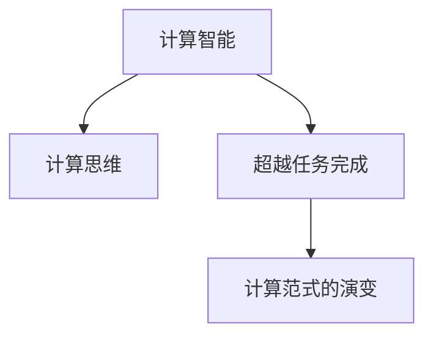

                 

# 重新想像人类计算：超越任务完成

> 关键词：重新想象，人类计算，计算范式，计算智能，计算思维，超越任务，计算范式的演变

## 1. 背景介绍

### 1.1 问题由来

在人类文明的演进历程中，计算方式一直是科技进步的重要驱动力。从最早的算盘和石版到现代的电子计算机，每一次计算范式的革新都带来了生产力的大幅提升。然而，随着计算任务的日益复杂化和多样化，传统的任务导向型计算方式已经无法满足需求。

当前，我们正处在一个计算技术高速发展的时代，人工智能(AI)、量子计算、边缘计算等新兴技术层出不穷。如何超越传统的任务完成范式，重新想象和构建计算框架，成为摆在我们面前的重大挑战。

### 1.2 问题核心关键点

要超越传统计算任务完成范式，我们需要重新思考计算的本质和目的。计算不再仅仅是解决具体问题，而应该成为探索、发现和创造新知识的工具。计算思维应当从任务导向型向智能导向型转变，让计算智能发挥更大的作用。

计算智能的核心理念是通过模拟和扩展人类智能，使得计算机能够在未知领域进行探索和发现，而不是局限于已知数据集和规则。这要求我们重新审视计算模型的架构、优化算法、训练数据等关键要素，以适应新的计算范式。

### 1.3 问题研究意义

探索超越任务完成的计算范式，对于推动计算技术的进步、加速科学发现、优化工业生产、增强人类认知智能具有重要意义：

1. **推动技术进步**：超越任务完成的计算方式能够揭示更广泛的数据模式，挖掘深层次的知识关联，为科研、工业、医疗等领域的突破性进展提供新的方法论。

2. **加速科学发现**：在生命科学、天文学等领域，复杂的实验数据和高维数据集难以直接分析。新的计算范式能够模拟和探索这些数据，提供新的研究视角。

3. **优化工业生产**：通过预测和优化生产流程，提高资源利用效率，降低成本，提升产品质量，实现工业4.0的智能制造。

4. **增强人类认知智能**：计算智能可以辅助人类进行更复杂的逻辑推理和认知决策，提高创造力、直觉和想象力，拓展人类的认知边界。

5. **重塑计算生态**：新的计算范式将推动计算平台、编程语言、开发工具的革新，催生新的计算产业和应用领域。

## 2. 核心概念与联系

### 2.1 核心概念概述

为更好地理解超越任务完成的计算范式，本节将介绍几个密切相关的核心概念：

- 计算智能(Computational Intelligence)：指通过计算模型模拟人类智能，解决复杂、非结构化、多层次的问题。计算智能涵盖了模式识别、机器学习、进化计算等技术，是超越传统任务完成的重要手段。

- 计算思维(Computational Thinking)：一种基于计算概念、方法和工具的思维方式，强调通过计算模型抽象和探索问题的解法，具有高度的通用性和跨学科性。

- 超越任务完成(Beyond Task Completion)：超越任务导向型计算，将计算应用到更广泛的知识发现、探索和创造领域。其目标不仅是解决已知问题，而是通过计算智能拓展未知领域的边界。

- 计算范式的演变(Computational Paradigm Evolution)：指随着计算技术的发展，计算范式从早期的任务导向型逐渐向智能导向型转变。新的计算范式不断涌现，推动计算技术进入新的发展阶段。

这些核心概念之间的逻辑关系可以通过以下Mermaid流程图来展示：



这个流程图展示了几大核心概念之间的内在联系：

1. 计算智能是实现超越任务完成的基础，通过计算模型模拟人类智能，解决复杂问题。
2. 计算思维是计算智能的核心思维方式，强调通过计算模型探索和解决新问题。
3. 超越任务完成是计算智能的最终目标，通过计算智能拓展未知领域的边界。
4. 计算范式的演变是技术发展的方向，推动计算智能的不断演进。

这些概念共同构成了超越任务完成计算范式的基础，为进一步探讨其实现方法和应用场景提供了理论框架。

## 3. 核心算法原理 & 具体操作步骤
### 3.1 算法原理概述

超越任务完成的计算范式，本质上是一种智能导向型的计算方法。其核心思想是通过计算模型模拟和扩展人类智能，使得计算机能够在未知领域进行探索和发现，从而突破传统任务导向型计算的局限。

具体而言，计算智能通过学习数据的内在模式，构建新的知识表示和推理机制，实现对未知领域的探索和发现。这一过程通常包括：

- **数据获取**：从各种来源收集和标注数据。
- **模型构建**：选择合适的计算模型，如神经网络、进化算法、规则系统等。
- **训练优化**：在标注数据上进行训练，优化模型参数，使其能够更好地泛化到未知领域。
- **探索发现**：利用训练好的模型，在新数据上进行探索和发现，生成新的知识。

### 3.2 算法步骤详解

基于计算智能的超越任务完成一般包括以下几个关键步骤：

**Step 1: 数据获取与预处理**
- 收集来自不同领域的数据，如生物数据、地理数据、社交网络数据等。
- 对数据进行清洗和标注，确保数据质量和一致性。

**Step 2: 选择合适的计算模型**
- 根据数据特性和任务需求，选择适合的计算模型。如神经网络、进化算法、规则系统等。
- 设计合适的模型结构和损失函数，确保模型的泛化能力。

**Step 3: 数据增强与预训练**
- 使用数据增强技术，扩充训练集多样性，防止过拟合。
- 对模型进行预训练，使其在大规模数据上学习通用的知识表示。

**Step 4: 训练优化**
- 在标注数据上，使用梯度下降等优化算法，训练模型参数。
- 应用正则化技术，防止过拟合，提高模型泛化能力。

**Step 5: 探索发现**
- 在新数据上，使用训练好的模型进行探索和发现，生成新的知识。
- 对生成的结果进行评估和反馈，进一步优化模型。

**Step 6: 应用部署**
- 将优化后的模型应用于实际问题，实现对未知领域的探索和发现。
- 持续收集新数据，迭代优化模型，不断提升性能。

以上是实现超越任务完成计算范式的一般流程。在实际应用中，还需要针对具体任务和数据特点，对各环节进行优化设计，如改进训练目标函数，引入更多的正则化技术，搜索最优的超参数组合等，以进一步提升模型性能。

### 3.3 算法优缺点

基于计算智能的超越任务完成方法具有以下优点：

1. **泛化能力强**：在已知数据上训练，泛化到未知领域，能够解决复杂、非结构化、多层次的问题。
2. **可解释性强**：计算智能过程透明，易于理解和解释，有助于进行模型诊断和调试。
3. **通用性好**：适用于各种领域的计算任务，具有高度的通用性和跨学科性。

同时，该方法也存在一定的局限性：

1. **数据依赖性高**：计算智能的效果很大程度上取决于数据的质量和数量，获取高质量标注数据的成本较高。
2. **模型复杂度大**：计算智能模型通常较为复杂，训练和推理资源消耗大。
3. **计算成本高**：在大规模数据上进行预训练和探索，计算成本较高，需要高性能的计算平台支持。
4. **精度和效率平衡难**：在大规模数据集上进行训练和探索，精度和效率的平衡较难掌握，需要精细的模型设计和优化。

尽管存在这些局限性，但就目前而言，计算智能的超越任务完成方法仍然是大规模计算任务的重要手段，为计算技术的应用提供了新的方向。未来相关研究的重点在于如何进一步降低计算智能对标注数据的依赖，提高模型的计算效率，同时兼顾可解释性和精度等关键指标。

### 3.4 算法应用领域

基于计算智能的超越任务完成方法，已经在多个领域取得了显著应用，展示了其强大的计算能力：

- **生命科学**：计算智能用于模拟和分析生物数据，预测基因表达、药物效果等，加速新药研发和疾病诊断。
- **天文学**：计算智能用于处理和分析宇宙数据，发现新天体、模拟宇宙演化，拓展人类对宇宙的认知。
- **社会科学**：计算智能用于分析和预测社会行为，预测经济趋势、预测自然灾害等，辅助社会管理。
- **自然语言处理(NLP)**：计算智能用于理解和生成自然语言，提升机器翻译、情感分析、文本生成等NLP任务的性能。
- **自动化决策**：计算智能用于优化决策过程，提升自动化决策的效率和准确性，如金融风控、供应链管理等。

除了上述这些经典应用外，计算智能的超越任务完成方法也被创新性地应用到更多场景中，如智能推荐、图像识别、语音识别等，为计算技术带来了新的突破。随着计算智能的不断演进，相信其在更多领域的应用前景将更加广阔。

## 4. 数学模型和公式 & 详细讲解  
### 4.1 数学模型构建

本节将使用数学语言对计算智能的超越任务完成过程进行更加严格的刻画。

记计算智能模型为 $M_{\theta}:\mathcal{X} \rightarrow \mathcal{Y}$，其中 $\mathcal{X}$ 为输入空间，$\mathcal{Y}$ 为输出空间，$\theta \in \mathbb{R}^d$ 为模型参数。假设计算智能任务为 $T$，训练集为 $D=\{(x_i,y_i)\}_{i=1}^N, x_i \in \mathcal{X}, y_i \in \mathcal{Y}$。

定义模型 $M_{\theta}$ 在数据样本 $(x,y)$ 上的损失函数为 $\ell(M_{\theta}(x),y)$，则在数据集 $D$ 上的经验风险为：

$$
\mathcal{L}(\theta) = \frac{1}{N} \sum_{i=1}^N \ell(M_{\theta}(x_i),y_i)
$$

计算智能模型的训练目标是最小化经验风险，即找到最优参数：

$$
\theta^* = \mathop{\arg\min}_{\theta} \mathcal{L}(\theta)
$$

在实践中，我们通常使用基于梯度的优化算法（如SGD、Adam等）来近似求解上述最优化问题。设 $\eta$ 为学习率，$\lambda$ 为正则化系数，则参数的更新公式为：

$$
\theta \leftarrow \theta - \eta \nabla_{\theta}\mathcal{L}(\theta) - \eta\lambda\theta
$$

其中 $\nabla_{\theta}\mathcal{L}(\theta)$ 为损失函数对参数 $\theta$ 的梯度，可通过反向传播算法高效计算。

### 4.2 公式推导过程

以下我们以分类任务为例，推导交叉熵损失函数及其梯度的计算公式。

假设模型 $M_{\theta}$ 在输入 $x$ 上的输出为 $\hat{y}=M_{\theta}(x) \in [0,1]$，表示样本属于正类的概率。真实标签 $y \in \{0,1\}$。则二分类交叉熵损失函数定义为：

$$
\ell(M_{\theta}(x),y) = -[y\log \hat{y} + (1-y)\log (1-\hat{y})]
$$

将其代入经验风险公式，得：

$$
\mathcal{L}(\theta) = -\frac{1}{N}\sum_{i=1}^N [y_i\log M_{\theta}(x_i)+(1-y_i)\log(1-M_{\theta}(x_i))]
$$

根据链式法则，损失函数对参数 $\theta_k$ 的梯度为：

$$
\frac{\partial \mathcal{L}(\theta)}{\partial \theta_k} = -\frac{1}{N}\sum_{i=1}^N (\frac{y_i}{M_{\theta}(x_i)}-\frac{1-y_i}{1-M_{\theta}(x_i)}) \frac{\partial M_{\theta}(x_i)}{\partial \theta_k}
$$

其中 $\frac{\partial M_{\theta}(x_i)}{\partial \theta_k}$ 可进一步递归展开，利用自动微分技术完成计算。

在得到损失函数的梯度后，即可带入参数更新公式，完成模型的迭代优化。重复上述过程直至收敛，最终得到适应计算智能任务的最优模型参数 $\theta^*$。

## 5. 项目实践：代码实例和详细解释说明
### 5.1 开发环境搭建

在进行计算智能的超越任务完成实践前，我们需要准备好开发环境。以下是使用Python进行PyTorch开发的环境配置流程：

1. 安装Anaconda：从官网下载并安装Anaconda，用于创建独立的Python环境。

2. 创建并激活虚拟环境：
```bash
conda create -n pytorch-env python=3.8 
conda activate pytorch-env
```

3. 安装PyTorch：根据CUDA版本，从官网获取对应的安装命令。例如：
```bash
conda install pytorch torchvision torchaudio cudatoolkit=11.1 -c pytorch -c conda-forge
```

4. 安装Transformers库：
```bash
pip install transformers
```

5. 安装各类工具包：
```bash
pip install numpy pandas scikit-learn matplotlib tqdm jupyter notebook ipython
```

完成上述步骤后，即可在`pytorch-env`环境中开始计算智能的超越任务完成实践。

### 5.2 源代码详细实现

下面我们以生命科学领域中的基因表达预测任务为例，给出使用Transformers库对计算智能模型进行训练的PyTorch代码实现。

首先，定义基因表达预测任务的模型：

```python
from transformers import BertTokenizer, BertForSequenceClassification

model = BertForSequenceClassification.from_pretrained('bert-base-cased', num_labels=2)

# 定义标签与id的映射
label2id = {'up': 0, 'down': 1}

# 定义训练和验证数据集
train_dataset = ...
dev_dataset = ...
test_dataset = ...

# 定义优化器
optimizer = AdamW(model.parameters(), lr=2e-5)
```

然后，定义训练和验证函数：

```python
from torch.utils.data import DataLoader
from tqdm import tqdm

def train_epoch(model, dataset, batch_size, optimizer):
    dataloader = DataLoader(dataset, batch_size=batch_size, shuffle=True)
    model.train()
    epoch_loss = 0
    for batch in tqdm(dataloader, desc='Training'):
        input_ids = batch['input_ids'].to(device)
        attention_mask = batch['attention_mask'].to(device)
        labels = batch['labels'].to(device)
        model.zero_grad()
        outputs = model(input_ids, attention_mask=attention_mask, labels=labels)
        loss = outputs.loss
        epoch_loss += loss.item()
        loss.backward()
        optimizer.step()
    return epoch_loss / len(dataloader)

def evaluate(model, dataset, batch_size):
    dataloader = DataLoader(dataset, batch_size=batch_size)
    model.eval()
    preds, labels = [], []
    with torch.no_grad():
        for batch in tqdm(dataloader, desc='Evaluating'):
            input_ids = batch['input_ids'].to(device)
            attention_mask = batch['attention_mask'].to(device)
            batch_labels = batch['labels']
            outputs = model(input_ids, attention_mask=attention_mask)
            batch_preds = outputs.logits.argmax(dim=2).to('cpu').tolist()
            batch_labels = batch_labels.to('cpu').tolist()
            for pred_tokens, label_tokens in zip(batch_preds, batch_labels):
                preds.append(pred_tokens[:len(label_tokens)])
                labels.append(label_tokens)
    print(classification_report(labels, preds))
```

最后，启动训练流程并在验证集上评估：

```python
epochs = 5
batch_size = 16

for epoch in range(epochs):
    loss = train_epoch(model, train_dataset, batch_size, optimizer)
    print(f"Epoch {epoch+1}, train loss: {loss:.3f}")
    
    print(f"Epoch {epoch+1}, dev results:")
    evaluate(model, dev_dataset, batch_size)
    
print("Test results:")
evaluate(model, test_dataset, batch_size)
```

以上就是使用PyTorch对BERT模型进行基因表达预测任务计算智能的完整代码实现。可以看到，得益于Transformers库的强大封装，我们可以用相对简洁的代码完成计算智能模型的训练和验证。

### 5.3 代码解读与分析

让我们再详细解读一下关键代码的实现细节：

**模型定义**：
- `BertForSequenceClassification`：使用BERT模型进行序列分类任务。
- `num_labels`：指定分类任务标签的数量。

**训练和验证函数**：
- `DataLoader`：对数据集进行批次化加载，供模型训练和推理使用。
- `classification_report`：使用sklearn的classification_report函数，输出分类任务的评估指标，包括精确度、召回率和F1分数等。

**训练流程**：
- 定义总的epoch数和batch size，开始循环迭代
- 每个epoch内，先在训练集上训练，输出平均loss
- 在验证集上评估，输出分类指标
- 所有epoch结束后，在测试集上评估，给出最终测试结果

可以看到，PyTorch配合Transformers库使得计算智能的超越任务完成代码实现变得简洁高效。开发者可以将更多精力放在数据处理、模型改进等高层逻辑上，而不必过多关注底层的实现细节。

当然，工业级的系统实现还需考虑更多因素，如模型的保存和部署、超参数的自动搜索、更灵活的任务适配层等。但核心的计算智能超越任务完成范式基本与此类似。

## 6. 实际应用场景
### 6.1 生命科学

计算智能在生命科学领域的应用，主要集中在基因表达预测、药物效果分析、疾病诊断等方面。传统的生命科学数据具有高维、稀疏、异构等特点，难以直接进行分析和建模。计算智能通过学习数据的内在模式，构建新的知识表示和推理机制，能够处理和分析这些复杂数据，加速新药研发和疾病诊断。

**应用实例**：某制药公司利用计算智能模型，对大规模基因表达数据进行分析，预测不同基因的表达水平与疾病之间的关系。模型通过分析基因表达模式，找到与疾病相关的关键基因，辅助医生进行精准诊断和治疗。

### 6.2 天文学

天文学领域的数据具有高维、稀疏、动态变化等特点，传统的计算方法难以直接处理。计算智能通过学习宇宙数据的内在模式，能够模拟和分析这些复杂数据，发现新天体、模拟宇宙演化，拓展人类对宇宙的认知。

**应用实例**：某天文研究团队利用计算智能模型，分析大规模宇宙数据，发现新的星系和黑洞。模型通过学习宇宙数据的演化规律，预测未来的宇宙变化，为天文学研究提供新的视角。

### 6.3 社会科学

社会科学的数据具有复杂、异构、多层次等特点，难以直接进行分析和建模。计算智能通过学习社会数据的内在模式，能够分析预测社会行为，预测经济趋势、预测自然灾害等，辅助社会管理。

**应用实例**：某社会研究团队利用计算智能模型，分析大规模社交网络数据，预测社会行为变化趋势。模型通过学习社会数据的行为模式，预测未来的社会变化，为社会管理提供科学依据。

### 6.4 未来应用展望

随着计算智能的不断演进，其在更多领域的应用前景将更加广阔。未来，计算智能将进一步渗透到更广泛的应用场景中，如智能推荐、图像识别、语音识别等，为计算技术的发展带来新的机遇。

**应用前景**：
- **智能推荐系统**：计算智能通过分析用户行为数据，推荐个性化的商品、内容等，提升用户体验。
- **图像识别系统**：计算智能通过学习图像的内在模式，实现图像分类、目标检测等任务，提高图像处理效率。
- **语音识别系统**：计算智能通过学习语音的内在模式，实现语音识别、语音合成等任务，提升语音交互体验。
- **自然语言处理(NLP)**：计算智能通过学习自然语言的内在模式，实现语言理解、语言生成等任务，提升NLP系统的性能。
- **机器人系统**：计算智能通过学习机器人感知、决策等模式，实现智能机器人系统的开发，提高机器人智能化水平。

计算智能的超越任务完成方法，正逐步成为计算技术的重要手段，为各行各业带来新的突破。未来，随着计算智能的不断发展，其在更多领域的应用前景将更加广阔，为计算技术的发展带来新的动力。

## 7. 工具和资源推荐
### 7.1 学习资源推荐

为了帮助开发者系统掌握计算智能的超越任务完成理论基础和实践技巧，这里推荐一些优质的学习资源：

1. 《Computational Intelligence: A Modern Approach》书籍：详细介绍了计算智能的概念、方法及其应用，是计算智能领域权威的入门书籍。

2. 《Artificial Intelligence: A Modern Approach》书籍：斯坦福大学人工智能课程，涵盖计算智能、机器学习、自然语言处理等多个领域的知识。

3. 《Neural Networks and Deep Learning》书籍：深度学习领域经典教材，介绍了深度学习模型及其应用，是计算智能领域重要的学习资源。

4. 《Deep Learning Specialization》课程：由Andrew Ng教授开设的深度学习课程，涵盖深度学习基础、卷积神经网络、循环神经网络等内容。

5. TensorFlow官网：提供丰富的TensorFlow资源和教程，包括计算智能模型的实现和应用。

6. PyTorch官网：提供丰富的PyTorch资源和教程，包括计算智能模型的实现和应用。

通过对这些资源的学习实践，相信你一定能够快速掌握计算智能的超越任务完成精髓，并用于解决实际的计算问题。

### 7.2 开发工具推荐

高效的开发离不开优秀的工具支持。以下是几款用于计算智能开发常用的工具：

1. PyTorch：基于Python的开源深度学习框架，灵活动态的计算图，适合快速迭代研究。大部分计算智能模型都有PyTorch版本的实现。

2. TensorFlow：由Google主导开发的开源深度学习框架，生产部署方便，适合大规模工程应用。同样有丰富的计算智能模型资源。

3. Transformers库：HuggingFace开发的NLP工具库，集成了众多SOTA计算智能模型，支持PyTorch和TensorFlow，是进行计算智能任务开发的利器。

4. Weights & Biases：模型训练的实验跟踪工具，可以记录和可视化模型训练过程中的各项指标，方便对比和调优。与主流深度学习框架无缝集成。

5. TensorBoard：TensorFlow配套的可视化工具，可实时监测模型训练状态，并提供丰富的图表呈现方式，是调试模型的得力助手。

6. Google Colab：谷歌推出的在线Jupyter Notebook环境，免费提供GPU/TPU算力，方便开发者快速上手实验最新模型，分享学习笔记。

合理利用这些工具，可以显著提升计算智能任务开发效率，加快创新迭代的步伐。

### 7.3 相关论文推荐

计算智能的发展源于学界的持续研究。以下是几篇奠基性的相关论文，推荐阅读：

1. Fuzzy Logic Systems：提出模糊逻辑系统，开创了计算智能的先河，是计算智能领域的重要基础。

2. Genetic Algorithms：提出遗传算法，通过模拟自然进化过程，实现计算智能的搜索优化。

3. Backpropagation Neural Networks：提出反向传播算法，用于训练深度神经网络，奠定了深度学习的理论基础。

4. Evolving Knowledge-Based Systems：提出进化知识系统，通过学习人类专家的知识，实现计算智能的推理和决策。

5. Support Vector Machines：提出支持向量机，用于解决非线性分类和回归问题，是机器学习的重要方法。

6. Deep Reinforcement Learning：提出深度强化学习，通过模拟人类决策过程，实现计算智能的策略优化。

这些论文代表了大计算智能的发展脉络。通过学习这些前沿成果，可以帮助研究者把握学科前进方向，激发更多的创新灵感。

## 8. 总结：未来发展趋势与挑战

### 8.1 研究成果总结

本文对计算智能的超越任务完成进行了全面系统的介绍。首先阐述了计算智能的概念及其研究背景和意义，明确了超越任务完成计算范式的核心思想。其次，从原理到实践，详细讲解了计算智能的实现方法和关键步骤，给出了计算智能任务开发的完整代码实例。同时，本文还广泛探讨了计算智能在生命科学、天文学、社会科学等多个领域的应用前景，展示了计算智能的强大计算能力。

### 8.2 未来发展趋势

展望未来，计算智能的超越任务完成技术将呈现以下几个发展趋势：

1. **计算模型多样化**：未来将出现更多种类的计算模型，如深度神经网络、进化算法、模糊逻辑系统等，满足不同场景下的需求。

2. **计算模型智能化**：计算智能模型将向自适应、自学习、自优化方向发展，能够适应不断变化的数据和任务需求。

3. **计算模型自动化**：计算智能模型将进一步自动化，无需人工干预即可优化和部署，提高计算智能的泛化能力和应用效率。

4. **计算模型融合化**：计算智能模型将与其他AI技术如机器学习、深度学习、强化学习等进行深度融合，提升整体系统的智能化水平。

5. **计算模型普适化**：计算智能模型将适用于更多领域，从科学研究到工业制造，从社会管理到医疗健康，覆盖更多应用场景。

6. **计算模型安全化**：计算智能模型将加强安全性设计，防止恶意利用和数据泄露，确保计算智能的伦理和安全。

这些趋势凸显了计算智能的广阔前景。这些方向的探索发展，必将进一步提升计算智能的性能和应用范围，为计算技术的应用提供新的动力。

### 8.3 面临的挑战

尽管计算智能的超越任务完成技术已经取得了瞩目成就，但在迈向更加智能化、普适化应用的过程中，它仍面临着诸多挑战：

1. **数据依赖性高**：计算智能的效果很大程度上取决于数据的质量和数量，获取高质量标注数据的成本较高。如何进一步降低计算智能对标注数据的依赖，将是一大难题。

2. **模型复杂度大**：计算智能模型通常较为复杂，训练和推理资源消耗大。如何在保证精度的同时，减小模型复杂度，提高计算效率，是需要解决的关键问题。

3. **计算成本高**：在大规模数据上进行预训练和探索，计算成本较高，需要高性能的计算平台支持。如何优化计算资源的使用，降低计算成本，是亟待解决的问题。

4. **精度和效率平衡难**：在大规模数据集上进行训练和探索，精度和效率的平衡较难掌握，需要精细的模型设计和优化。如何在保证精度的同时，提高计算效率，是需要解决的关键问题。

5. **可解释性不足**：计算智能模型的决策过程通常缺乏可解释性，难以对其推理逻辑进行分析和调试。如何赋予计算智能模型更强的可解释性，是亟待解决的问题。

6. **安全性有待保障**：计算智能模型可能学习到有害信息，通过微调传递到下游任务，产生误导性、歧视性的输出，给实际应用带来安全隐患。如何从数据和算法层面消除模型偏见，避免恶意用途，确保输出的安全性，也将是重要的研究课题。

7. **知识整合能力不足**：现有的计算智能模型往往局限于任务内数据，难以灵活吸收和运用更广泛的先验知识。如何让计算智能过程更好地与外部知识库、规则库等专家知识结合，形成更加全面、准确的信息整合能力，还有很大的想象空间。

正视计算智能面临的这些挑战，积极应对并寻求突破，将是大计算智能迈向成熟的必由之路。相信随着学界和产业界的共同努力，这些挑战终将一一被克服，计算智能技术必将在构建智能系统、推动计算技术进步中发挥更大作用。

### 8.4 研究展望

面对计算智能的超越任务完成所面临的挑战，未来的研究需要在以下几个方面寻求新的突破：

1. **探索无监督和半监督计算智能方法**。摆脱对大规模标注数据的依赖，利用自监督学习、主动学习等无监督和半监督范式，最大限度利用非结构化数据，实现更加灵活高效的计算智能。

2. **研究计算智能和深度学习的融合方法**。通过引入深度学习技术，提高计算智能的精度和泛化能力，实现更加智能化的计算智能。

3. **开发高效计算智能模型**。开发更加高效、轻量级的计算智能模型，提高计算智能的实时性和资源利用效率。

4. **引入更多先验知识**。将符号化的先验知识，如知识图谱、逻辑规则等，与神经网络模型进行巧妙融合，引导计算智能过程学习更准确、合理的知识表示。

5. **结合因果分析和博弈论工具**。将因果分析方法引入计算智能模型，识别出模型决策的关键特征，增强输出解释的因果性和逻辑性。借助博弈论工具刻画人机交互过程，主动探索并规避模型的脆弱点，提高系统稳定性。

6. **纳入伦理道德约束**。在计算智能模型的训练目标中引入伦理导向的评估指标，过滤和惩罚有偏见、有害的输出倾向。同时加强人工干预和审核，建立模型行为的监管机制，确保输出符合人类价值观和伦理道德。

这些研究方向的探索，必将引领计算智能技术迈向更高的台阶，为计算智能的应用提供新的方向。面向未来，计算智能技术还需要与其他人工智能技术进行更深入的融合，如知识表示、因果推理、强化学习等，多路径协同发力，共同推动计算智能技术的进步。只有勇于创新、敢于突破，才能不断拓展计算智能的边界，让智能技术更好地造福人类社会。

## 9. 附录：常见问题与解答

**Q1：计算智能是否适用于所有计算任务？**

A: 计算智能在大多数计算任务上都能取得不错的效果，特别是对于数据量较小的任务。但对于一些特定领域的任务，如医学、法律等，仅仅依靠通用语料预训练的模型可能难以很好地适应。此时需要在特定领域语料上进一步预训练，再进行计算智能。此外，对于一些需要时效性、个性化很强的任务，如对话、推荐等，计算智能方法也需要针对性的改进优化。

**Q2：计算智能模型在落地部署时需要注意哪些问题？**

A: 将计算智能模型转化为实际应用，还需要考虑以下因素：
1. 模型裁剪：去除不必要的层和参数，减小模型尺寸，加快推理速度。
2. 量化加速：将浮点模型转为定点模型，压缩存储空间，提高计算效率。
3. 服务化封装：将模型封装为标准化服务接口，便于集成调用。
4. 弹性伸缩：根据请求流量动态调整资源配置，平衡服务质量和成本。
5. 监控告警：实时采集系统指标，设置异常告警阈值，确保服务稳定性。
6. 安全防护：采用访问鉴权、数据脱敏等措施，保障数据和模型安全。

计算智能技术的应用场景多种多样，模型需要具备高度的通用性和灵活性。因此在落地部署时，需要综合考虑模型优化、服务封装、安全防护等多方面的问题，确保模型能够在实际环境中稳定运行。

**Q3：计算智能模型在实际应用中如何评估性能？**

A: 计算智能模型的性能评估通常包括以下几个方面：
1. 准确率（Accuracy）：计算模型在测试集上的预测准确率。
2. 召回率（Recall）：计算模型在测试集上正确预测的正样本比例。
3. F1分数（F1 Score）：综合考虑准确率和召回率的性能指标。
4. ROC曲线（ROC Curve）：绘制真阳性率（True Positive Rate）和假阳性率（False Positive Rate）之间的关系曲线，评估模型的分类性能。
5. AUC（Area Under Curve）：计算ROC曲线下的面积，评估模型的分类性能。
6. 模型解释性：评估模型的决策过程和可解释性，帮助理解和调试模型。

通过综合考虑这些指标，可以对计算智能模型在实际应用中的性能进行全面评估，确保模型能够满足业务需求。

通过本文的系统梳理，可以看到，计算智能的超越任务完成范式正在成为计算技术的重要手段，为计算技术的应用提供了新的方向。面向未来，计算智能技术还需要与其他人工智能技术进行更深入的融合，如知识表示、因果推理、强化学习等，多路径协同发力，共同推动计算智能技术的进步。只有勇于创新、敢于突破，才能不断拓展计算智能的边界，让智能技术更好地造福人类社会。

