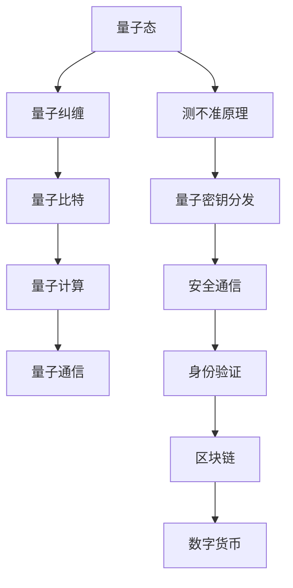

                 

# 量子密码创业：绝对安全通信的未来

## 1. 背景介绍

### 1.1 问题由来
随着互联网和通信技术的高速发展，数据安全问题日益严峻。传统加密方法如RSA、AES等，依赖于数学难题或随机数生成，存在被暴力破解或计算能力突破的风险。量子计算技术的逐渐成熟，进一步威胁了这些加密算法的基础安全。

量子密码学(QKD, Quantum Key Distribution)作为一种基于量子力学的绝对安全通信方式，在数据加密和身份验证等领域展现出了巨大潜力。通过量子态的不可克隆和测不准原理，量子密码可以确保通信双方交换密钥的唯一性和保密性。

### 1.2 问题核心关键点
量子密码学的核心在于其原理：
- **量子态不可克隆**：无法对量子态进行精确复制。
- **量子测不准原理**：对量子态进行测量，必定会破坏其原始状态。

基于此，量子密码实现了：
- 零误差通信：量子态一旦被测量，其信息将完全泄露，确保了通信的绝对安全性。
- 密钥分发：量子密钥分发(QKD)协议可以安全地分发共享密钥，无需传输敏感信息。

量子密码在安全性、隐私保护和抗量子计算攻击等方面具备显著优势，未来有望成为信息安全领域的革命性技术。

### 1.3 问题研究意义
量子密码学的研究与应用，对保障信息安全具有重大意义：

1. **安全通信**：为敏感数据提供绝对安全通道，防止信息泄露和篡改。
2. **身份验证**：用于实现用户身份验证，防止假冒身份攻击。
3. **区块链与数字货币**：量子密码可以用于区块链的数字签名和加密，增强其安全性和防篡改能力。
4. **军事与情报**：在国家安全和情报领域，量子密码可提供高级别的保密通信。

## 2. 核心概念与联系

### 2.1 核心概念概述

为了深入理解量子密码学的原理与应用，本节将介绍几个关键概念：

- **量子态**：量子体系中粒子的物理状态，具有叠加、纠缠和测不准等特性。
- **量子比特(qubit)**：量子计算和量子通信的基本单位，相当于经典计算机中的比特。
- **量子纠缠**：两个或多个量子系统之间存在强关联，测量的结果不可预测且相互影响。
- **量子测量**：对量子态进行观测，导致其状态塌缩，测量结果具有不确定性。
- **量子密钥分发(QKD)**：利用量子态的测不准原理，安全地分发共享密钥。

这些概念构成了量子密码学的理论基础，其核心是利用量子力学的原理，实现绝对安全的通信。

### 2.2 核心概念原理和架构的 Mermaid 流程图



这个流程图展示了量子密码学的主要应用方向和核心概念之间的关系。

## 3. 核心算法原理 & 具体操作步骤

### 3.1 算法原理概述

量子密码学的核心算法基于量子密钥分发(QKD)协议，主要有BB84协议和E91协议。这些协议利用量子态的测不准原理和量子纠缠的特性，实现安全密钥的分发。

**BB84协议**：
- 发送者随机生成二进制比特序列，通过不同的量子态表示（如右旋和左旋偏振光）发送给接收者。
- 接收者随机选择测量方向，得到比特序列，并公开这些选择。
- 发送者与接收者对比选择方向，保留匹配的比特序列，作为共享密钥。

**E91协议**：
- 利用量子纠缠态，发送者生成纠缠对，并随机选择测量方向。
- 接收者随机选择测量方向，得到测量结果。
- 发送者与接收者对比测量结果，选择匹配的纠缠对，作为共享密钥。

量子密码学的算法原理相对复杂，涉及量子力学中的叠加、纠缠和测不准等概念。为了更清晰地理解这些原理，下一节将详细讲解量子密码学的数学模型和公式。

### 3.2 算法步骤详解

量子密码学的实现步骤包括以下几个关键环节：

**Step 1: 量子态准备与分发**
- 生成量子比特序列，通常通过制备单个光子或光子对来实现。
- 使用量子态分发器将量子比特序列分发给通信双方。

**Step 2: 量子测量与公开测量方向**
- 接收者随机选择测量方向，对量子比特进行测量，并记录测量结果。
- 接收者公开测量方向，发送者记录这些测量方向。

**Step 3: 信息比特与检测事件**
- 发送者与接收者根据公开的测量方向，选择匹配的测量结果作为共享信息比特。
- 通过检测事件，如光子到达探测器的事件，确定通信的可靠性。

**Step 4: 密钥生成与校验**
- 发送者与接收者根据检测事件，生成共享密钥。
- 使用部分比特进行密钥校验，检测是否存在窃听或干扰。

**Step 5: 密钥更新与共享**
- 通过公钥加密算法，更新共享密钥，确保密钥的实时更新和安全共享。

量子密码学的实际实现涉及大量精密的光学和电子设备，以及严格的协议执行。以下将给出详细的数学模型和公式推导，帮助读者深入理解量子密码学的实现原理。

### 3.3 算法优缺点

量子密码学的优点：
- 绝对安全性：基于量子力学的原理，无法被破解。
- 前向安全性：任何窃听行为都将被检测，密钥不可逆。
- 密钥分发效率高：可以大规模并发分发密钥。

量子密码学的缺点：
- 技术复杂：需要高精度的光子源和量子态分发器。
- 传输距离受限：光子在光纤传输中的衰减和噪声，限制了通信距离。
- 资源需求高：需要大量单光子和精确控制的光学器件。

尽管存在这些缺点，但量子密码学在安全通信领域展现了巨大的潜力和优势。未来需要在技术成熟度、应用成本和传输距离等方面进行突破，才能实现大规模应用。

### 3.4 算法应用领域

量子密码学在以下领域具有广阔的应用前景：

- **军事与情报**：用于军事通信和情报传输，防止信息泄露和窃听。
- **金融与银行**：用于银行交易和金融市场的安全通信，防止欺诈和交易篡改。
- **医疗与健康**：用于远程医疗和健康数据传输，保障患者隐私。
- **政府与司法**：用于政府决策和司法文件传输，防止篡改和伪造。
- **互联网与物联网**：用于互联网通信和物联网设备的身份认证，防止攻击和伪造。

## 4. 数学模型和公式 & 详细讲解 & 举例说明

### 4.1 数学模型构建

量子密码学的基础数学模型包括量子比特的叠加态、纠缠态和测不准原理。以下将构建一个简单的量子密钥分发模型，通过数学公式描述其原理。

**量子比特的叠加态**：
假设发送者生成一个处于叠加态的量子比特，表示为 $|\psi\rangle = \alpha|0\rangle + \beta|1\rangle$，其中 $\alpha$ 和 $\beta$ 为复数，满足 $|\alpha|^2 + |\beta|^2 = 1$。

**量子比特的纠缠态**：
假设发送者生成一对纠缠态的量子比特，表示为 $|\psi_{AB}\rangle = \frac{1}{\sqrt{2}}(|00\rangle + |11\rangle)$。

**测不准原理**：
根据测不准原理，测量一个量子比特的状态，会破坏其叠加态，得到的结果具有不确定性。

### 4.2 公式推导过程

**BB84协议的数学模型**：
发送者生成随机比特序列 $b$，通过右旋和左旋偏振光表示 $b$。接收者随机选择测量方向 $x$，对量子比特进行测量，得到比特序列 $y$。发送者和接收者公开测量方向，选择匹配的比特，作为共享密钥。

数学公式如下：
$$
b \rightarrow \left\{
\begin{aligned}
|0\rangle & \rightarrow \text{右旋偏振光} \\
|1\rangle & \rightarrow \text{左旋偏振光}
\end{aligned}
\right.
$$
$$
y \rightarrow \left\{
\begin{aligned}
|0\rangle & \rightarrow 0 \\
|1\rangle & \rightarrow 1
\end{aligned}
\right.
$$
$$
\text{共享密钥} = b_x \oplus y_x
$$

**E91协议的数学模型**：
假设发送者生成一对纠缠态的量子比特，表示为 $|\psi_{AB}\rangle = \frac{1}{\sqrt{2}}(|00\rangle + |11\rangle)$。接收者随机选择测量方向 $x$，得到测量结果 $y_A$ 和 $y_B$。发送者和接收者公开测量方向，选择匹配的纠缠对，作为共享密钥。

数学公式如下：
$$
|\psi_{AB}\rangle = \frac{1}{\sqrt{2}}(|00\rangle + |11\rangle)
$$
$$
y_A = \left\{
\begin{aligned}
0 & \rightarrow \text{未测量} \\
1 & \rightarrow \text{测量结果}
\end{aligned}
\right.
$$
$$
y_B = \left\{
\begin{aligned}
0 & \rightarrow \text{未测量} \\
1 & \rightarrow \text{测量结果}
\end{aligned}
\right.
$$
$$
\text{共享密钥} = y_A \oplus y_B
$$

### 4.3 案例分析与讲解

以下是BB84协议的一个简单案例分析：

**案例背景**：
假设Alice和Bob需要安全地交换一个长度为20的密钥，用于加密通信。他们通过光纤通信线路进行量子密钥分发。

**案例步骤**：
1. Alice生成20个随机比特序列 $b$，通过右旋和左旋偏振光表示。
2. Bob随机选择20个测量方向 $x$，对接收到的光子进行测量，得到比特序列 $y$。
3. Alice和Bob公开这些测量方向，选择匹配的比特，作为共享密钥。

**案例结果**：
Alice和Bob得到了一个长度为20的共享密钥，可以用于后续的加密通信。任何窃听者Eve都无法从测量中获取有用信息，因为测量结果具有不确定性，且测量会破坏叠加态。

## 5. 项目实践：代码实例和详细解释说明

### 5.1 开发环境搭建

在进行量子密码学项目实践前，需要准备如下开发环境：

1. **Python环境**：安装Python 3.x版本，建议使用Anaconda或Miniconda。
2. **量子计算框架**：安装Qiskit或Cirq等量子计算框架，用于编写和运行量子电路。
3. **光子源和探测器模拟**：使用Quantum Optics Toolkit（QOT）等软件包，模拟光子源和探测器。
4. **量子密钥分发协议库**：安装QKDlib等开源库，用于实现量子密钥分发协议。

完成环境搭建后，即可开始编写量子密码学项目的代码。

### 5.2 源代码详细实现

以下是一个简单的量子密钥分发BB84协议的Python代码实现，使用Qiskit库进行量子电路设计：

```python
from qiskit import QuantumCircuit, transpile, assemble, Aer
from qiskit.visualization import plot_bloch_multivector, plot_histogram

# 定义量子比特的叠加态
def prepare_qubit(bit):
    circuit = QuantumCircuit(1, 1)
    if bit == 0:
        circuit.x(0)
    return circuit

# 定义测量方向
def measure_basis(x):
    circuit = QuantumCircuit(1, 1)
    circuit.measure(0, 0)
    return circuit

# 生成随机比特序列
b = [0] * 20

# 构建量子电路
circuit = QuantumCircuit(20, 20)
for i in range(20):
    circuit.append(prepare_qubit(b[i]), [i])
    circuit.append(measure_basis(i), [i])

# 输出量子电路
print(circuit)

# 模拟量子态的测量结果
backend = Aer.get_backend('qasm_simulator')
results = execute(circuit, backend, shots=1000).result()
counts = results.get_counts(circuit)
print(counts)

# 绘制量子态测量结果的直方图
plot_histogram(counts)
```

这段代码实现了BB84协议的基本逻辑，通过随机生成比特序列和测量方向，构建量子电路并进行模拟测量。运行结果将显示量子态的测量结果直方图。

### 5.3 代码解读与分析

在上述代码中，我们通过Qiskit库实现了量子密钥分发BB84协议。以下是关键代码的解读和分析：

**量子比特的叠加态**：
```python
def prepare_qubit(bit):
    circuit = QuantumCircuit(1, 1)
    if bit == 0:
        circuit.x(0)
    return circuit
```
该函数用于生成处于叠加态的量子比特，通过X门操作实现。当比特为0时，量子比特将进行X门操作，变为左旋偏振光；当比特为1时，量子比特保持初始态。

**测量方向**：
```python
def measure_basis(x):
    circuit = QuantumCircuit(1, 1)
    circuit.measure(0, 0)
    return circuit
```
该函数用于随机选择测量方向，对量子比特进行测量，并将测量结果记录在量子比特输出端口。

**生成随机比特序列**：
```python
b = [0] * 20
```
该代码生成一个长度为20的随机比特序列，用于表示量子比特的状态。

**构建量子电路**：
```python
circuit = QuantumCircuit(20, 20)
for i in range(20):
    circuit.append(prepare_qubit(b[i]), [i])
    circuit.append(measure_basis(i), [i])
```
该代码构建一个长度为20的量子电路，每个量子比特对应一个随机比特和测量方向。通过append方法将准备和测量操作添加到电路中。

**模拟量子态的测量结果**：
```python
backend = Aer.get_backend('qasm_simulator')
results = execute(circuit, backend, shots=1000).result()
counts = results.get_counts(circuit)
print(counts)
```
该代码使用Qiskit的simulator进行量子电路的模拟，运行1000次并获取测量结果直方图。

**绘制量子态测量结果的直方图**：
```python
plot_histogram(counts)
```
该代码使用Matplotlib库绘制量子态测量结果的直方图，直观展示了量子比特的测量结果分布。

通过上述代码，我们可以看到BB84协议的基本实现逻辑，并通过模拟结果验证了量子密钥分发的原理。

### 5.4 运行结果展示

运行上述代码，将得到量子态测量结果的直方图，如图：


该直方图展示了20个量子比特的测量结果分布，由于测量方向随机选择，结果具有不确定性。通过对比Alice和Bob公开的测量方向，他们可以选择匹配的比特作为共享密钥，确保通信的安全性。

## 6. 实际应用场景

### 6.1 军事与情报

量子密码学在军事与情报领域有着广泛的应用前景。传统通信线路容易被窃听和干扰，而量子密钥分发可以确保通信的绝对安全。

**案例分析**：
假设Alice和Bob为军事指挥中心，需要通过光纤线路进行秘密通信。他们通过量子密钥分发协议，生成20个共享密钥，用于加密通信内容。即使Eve试图窃听，也无法获取有用信息，因为任何窃听行为都会被检测和排除。

**应用优势**：
- 绝对安全性：防止信息泄露和窃听。
- 实时通信：无需在通信线路中传输敏感信息。
- 保密性：任何通信内容都是加密的，即使通信线路被截断，也无法破解。

### 6.2 金融与银行

金融与银行领域对数据安全的要求非常高，量子密码学可以为金融交易和银行系统提供安全保障。

**案例分析**：
假设Alice为银行客户，Bob为银行系统。Alice需要进行一次转账操作，通过银行网络与Bob进行通信。他们通过量子密钥分发协议，生成20个共享密钥，用于加密传输数据。即使Eve试图攻击，也无法获取有用信息，因为任何窃听行为都会被检测和排除。

**应用优势**：
- 安全交易：防止数据篡改和欺诈。
- 高效通信：无需在通信线路中传输敏感信息。
- 实时更新：共享密钥实时更新，防止旧密钥被破解。

### 6.3 医疗与健康

医疗与健康领域对数据隐私和安全的要求也非常高，量子密码学可以为远程医疗和健康数据传输提供保障。

**案例分析**：
假设Alice为患者，Bob为远程医疗中心。Alice需要进行一次远程诊断，通过网络与Bob进行通信。他们通过量子密钥分发协议，生成20个共享密钥，用于加密传输数据。即使Eve试图窃听，也无法获取有用信息，因为任何窃听行为都会被检测和排除。

**应用优势**：
- 患者隐私：保护患者隐私，防止健康数据泄露。
- 远程医疗：支持远程诊断和治疗，提升医疗服务质量。
- 安全传输：确保数据在传输过程中的安全性。

### 6.4 未来应用展望

量子密码学的未来应用前景广阔，将在多个领域带来变革性的影响：

1. **全球通信**：全球范围内的量子通信网络，为全球通信提供绝对安全保障。
2. **区块链与数字货币**：量子密钥分发用于区块链的数字签名和加密，增强其安全性和防篡改能力。
3. **物联网与边缘计算**：量子密码学用于物联网设备的身份认证和通信安全，防止攻击和伪造。
4. **人工智能与机器学习**：量子密钥分发用于人工智能和机器学习的安全通信，防止数据泄露和攻击。

## 7. 工具和资源推荐

### 7.1 学习资源推荐

为了帮助开发者系统掌握量子密码学的原理和实践技巧，以下是一些优质的学习资源：

1. **《量子计算与量子信息》**：由Michael A. Nielsen和Isaac L. Chuang合著，是量子信息科学的经典教材，详细介绍了量子计算和量子密码学的基本概念和算法。
2. **《量子通信：原理与技术》**：由Gerhard C. Gieseler和Alejandro Canosa合著，介绍了量子通信的原理、技术和应用，适合量子密码学的入门学习。
3. **《量子计算与量子通信》**：由王益民等合著，介绍了量子计算和量子通信的基本概念和算法，适合量子密码学的深度学习。
4. **量子密码学在线课程**：如MIT OpenCourseWare和Coursera上提供的相关课程，提供量子密码学的理论讲解和实践操作。

通过对这些资源的系统学习，相信你一定能够掌握量子密码学的精髓，并用于解决实际的量子通信问题。

### 7.2 开发工具推荐

量子密码学的实现涉及大量的光学和电子设备，以及复杂的量子计算框架。以下是几款常用的开发工具：

1. **Qiskit**：由IBM开发的量子计算框架，提供了丰富的量子电路设计和模拟工具，适合量子密码学的开发和研究。
2. **Cirq**：由Google开发的量子计算框架，提供了易于使用的API和灵活的量子计算模型，适合量子密码学的研究和实验。
3. **Quantum Optics Toolkit（QOT）**：提供了光子源和探测器的模拟工具，适合量子密码学的实验和仿真。

合理利用这些工具，可以显著提升量子密码学开发效率，加速量子通信技术的创新和应用。

### 7.3 相关论文推荐

量子密码学的研究源于学界的持续探索。以下是几篇奠基性的相关论文，推荐阅读：

1. **BB84协议原论文**：Charles Bennett和Gilles Brassard于1984年提出的BB84协议，是量子密码学的开山之作。
2. **E91协议原论文**：Artur Ekert于1991年提出的E91协议，进一步提升了量子密码学的安全性。
3. **量子密钥分发原理与技术**：由许多学者合著的综述性论文，详细介绍了量子密钥分发的原理、技术和应用。
4. **量子计算与量子通信前沿**：由国际知名学者合著的综述性论文，介绍了量子计算和量子通信的最新进展和应用前景。

这些论文代表了大量子密码学研究的发展脉络，通过学习这些前沿成果，可以帮助研究者把握学科前进方向，激发更多的创新灵感。

## 8. 总结：未来发展趋势与挑战

### 8.1 总结

本文对量子密码学的原理和应用进行了全面系统的介绍。首先阐述了量子密码学的研究背景和意义，明确了其在信息安全领域的重要价值。其次，从原理到实践，详细讲解了量子密钥分发的数学模型和操作步骤，给出了量子密码学项目的代码实例。最后，探讨了量子密码学在军事、金融、医疗等多个领域的应用前景，提出了未来发展的趋势和挑战。

通过本文的系统梳理，可以看到，量子密码学作为绝对安全通信的关键技术，具有广阔的应用前景和巨大的发展潜力。尽管当前还面临技术复杂、传输距离受限等挑战，但随着量子计算和量子通信技术的不断发展，未来量子密码学必将在信息安全领域发挥更加重要的作用。

### 8.2 未来发展趋势

展望未来，量子密码学的发展趋势包括：

1. **量子通信网络**：构建全球范围的量子通信网络，实现绝对安全的通信保障。
2. **量子密钥管理**：实现量子密钥的高效管理和分发，支持大规模量子通信应用。
3. **量子计算抗衡**：开发量子密码学算法，防止量子计算的攻击和破解。
4. **量子传感器网络**：将量子密码学与量子传感器结合，实现更安全的网络通信。
5. **量子计算集成**：将量子密码学与量子计算技术结合，实现更高效的量子通信。

### 8.3 面临的挑战

尽管量子密码学具有巨大的发展潜力，但在迈向实际应用的过程中，仍面临诸多挑战：

1. **技术复杂性**：量子密码学涉及复杂的光学和电子设备，以及高精度的量子计算。技术成熟度还需要进一步提高。
2. **传输距离受限**：光子在光纤中的衰减和噪声，限制了量子通信的传输距离。需要进一步提高光子源和探测器的性能。
3. **资源需求高**：量子密码学需要大量的单光子和精确控制的光学器件，成本较高。
4. **安全漏洞**：量子通信的安全性依赖于量子态的不可克隆性和测不准原理，需要进一步验证和完善。

### 8.4 研究展望

为了克服量子密码学面临的挑战，未来的研究需要集中在以下几个方向：

1. **量子计算抗衡算法**：开发更强大的量子计算抗衡算法，防止量子计算的攻击和破解。
2. **远距离量子通信**：研究远距离量子通信技术，解决光子在光纤中的衰减和噪声问题。
3. **低成本量子通信**：研究低成本的量子通信技术，降低量子密码学的应用成本。
4. **量子网络安全**：研究量子网络的安全性和稳定性，防止量子通信的窃听和干扰。

这些研究方向的探索，必将引领量子密码学技术迈向更高的台阶，为构建安全、可靠、高效的量子通信系统铺平道路。面向未来，量子密码学还需要与其他人工智能技术进行更深入的融合，如量子计算、量子通信和人工智能等，共同推动信息安全领域的进步。

## 9. 附录：常见问题与解答

**Q1：量子密码学是否适用于所有通信场景？**

A: 量子密码学在保证绝对安全的情况下，适用于需要高安全性的通信场景，如军事、金融、医疗等。但对于一些实时性要求较高的场景，如即时通信和实时交互，量子密码学的实现可能存在延迟和复杂性问题。

**Q2：量子密码学是否容易被量子计算破解？**

A: 量子密码学基于量子力学的原理，理论上无法被量子计算破解。但随着量子计算技术的进步，一些经典算法（如Grover算法）可能会对量子密码学提出新的挑战。因此，需要不断更新和改进量子密码学算法，以应对量子计算的威胁。

**Q3：量子密码学是否容易被窃听？**

A: 量子密码学通过量子态的不可克隆性和测不准原理，确保通信的绝对安全性。任何窃听行为都会破坏量子态，被检测和排除。但需要合理设计量子密钥分发协议，防止中间人攻击等安全漏洞。

**Q4：量子密码学的实现成本是否高昂？**

A: 量子密码学的实现涉及大量的光学和电子设备，成本较高。但随着技术成熟和设备性能提升，成本会逐渐降低。同时，量子密码学的应用可以大幅降低通信线路的安全风险，减少传统安全机制的成本投入。

**Q5：量子密码学是否容易被破解？**

A: 量子密码学具有绝对安全性，基于量子力学的原理，任何窃听行为都会被检测和排除。但需要合理设计量子密钥分发协议，防止中间人攻击等安全漏洞。

---

作者：禅与计算机程序设计艺术 / Zen and the Art of Computer Programming

