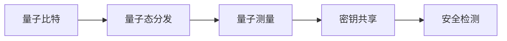

                 

# 量子密码学：后量子时代的安全通信

> 关键词：量子密钥分发(QKD), 量子密码学, 量子计算, 后量子密码学, 量子通信, 安全通信

## 1. 背景介绍

### 1.1 问题由来

随着信息技术的高速发展，尤其是互联网的普及，全球数据传输量呈爆炸式增长。与此同时，网络安全问题也日益严重，各类网络攻击层出不穷。传统的基于对称加密和非对称加密的密码学方法，已难以应对量子计算带来的威胁。因此，研究后量子密码学，构建能够抵御量子计算攻击的密码系统，已成为信息安全的当务之急。

量子密钥分发（Quantum Key Distribution, QKD）作为量子密码学的核心技术，利用量子力学原理，确保通信双方能够安全地交换密钥，从而实现信息传输的安全性。QKD的主要思想是利用量子态的不可克隆性，任何窃听行为都会被发现，从而确保密钥传输的安全。

### 1.2 问题核心关键点

量子密钥分发（QKD）利用量子态的量子不可克隆性和量子测量的不确定性，确保通信双方能够安全地交换密钥。QKD的基本原理可以概括为以下几点：

- 量子态分发：通过量子信道（如光纤、卫星等）分发量子态给通信双方。
- 量子态测量：通信双方对接收到的量子态进行测量，获取测量结果。
- 密钥共享：通信双方通过测量结果，生成共享密钥。
- 安全检测：通信双方通过一些纠缠态的测量结果，检测是否存在窃听行为。

QKD的这些基本原理，为构建量子安全的通信系统提供了理论基础。但如何构建高效的QKD系统，以及如何抵御量子计算的攻击，是当前研究的热点和难点。

### 1.3 问题研究意义

研究量子密钥分发和后量子密码学，具有重要的理论意义和应用价值：

1. 保护数据安全：在量子计算威胁日益严重的背景下，构建量子安全的通信系统，确保数据传输的安全。
2. 推动密码学发展：研究后量子密码学，推动密码学理论与实践的进步，为未来的信息安全奠定基础。
3. 促进量子通信发展：量子密钥分发作为量子通信的核心技术，其研究和发展，将推动量子通信技术的进步。
4. 促进信息安全标准制定：量子密钥分发和后量子密码学的发展，将推动信息安全标准的制定和实施，提升信息安全水平。
5. 推动信息安全产业升级：量子密钥分发和后量子密码学的应用，将带动信息安全产业的升级和发展，提升国家信息安全竞争力。

## 2. 核心概念与联系

### 2.1 核心概念概述

量子密钥分发（QKD）利用量子力学的原理，确保通信双方能够安全地交换密钥，从而实现信息传输的安全性。QKD的主要概念包括：

- 量子比特（Qubit）：量子密钥分发的基本单位，是具有量子态的量子系统。
- 量子态（Quantum State）：量子比特的量子态，如单光子偏振态、纠缠态等。
- 量子通道（Quantum Channel）：用于分发量子态的物理媒介，如光纤、卫星等。
- 量子测量（Quantum Measurement）：对接收到的量子态进行测量，获取测量结果。
- 量子密钥（Quantum Key）：通信双方通过量子态测量结果生成的共享密钥。

### 2.2 核心概念原理和架构的 Mermaid 流程图



这个流程图展示了量子密钥分发的基本流程：

1. 量子比特A通过量子通道B，分发给通信双方。
2. 通信双方C对接收到的量子比特B进行量子测量，获取测量结果。
3. 通信双方D通过测量结果，生成共享密钥。
4. 通信双方E通过一些纠缠态的测量结果，检测是否存在窃听行为。

### 2.3 核心概念间的联系

量子密钥分发（QKD）中的各个核心概念之间有着紧密的联系：

- 量子比特是量子密钥分发的基本单位，是信息传输的载体。
- 量子态是量子比特的量子状态，是密钥生成的基础。
- 量子通道是量子比特的传输媒介，决定了信息传输的可靠性和安全性。
- 量子测量是量子比特的测量过程，是密钥生成的关键步骤。
- 量子密钥是通信双方通过量子测量结果生成的共享密钥，是信息传输的安全保障。
- 安全检测是通过一些纠缠态的测量结果，检测窃听行为，确保信息传输的安全性。

这些概念共同构成了量子密钥分发的基本框架，确保了通信双方能够安全地交换密钥，从而实现信息传输的安全性。

## 3. 核心算法原理 & 具体操作步骤

### 3.1 算法原理概述

量子密钥分发（QKD）的算法原理基于量子力学的原理，主要包括量子态分发、量子测量、密钥共享和安全检测。

量子态分发通过量子通道分发量子比特给通信双方。通信双方对接收到的量子比特进行量子测量，获取测量结果。通过这些测量结果，通信双方生成共享密钥。最后，通过一些纠缠态的测量结果，检测是否存在窃听行为，确保信息传输的安全性。

### 3.2 算法步骤详解

量子密钥分发（QKD）的基本步骤可以分为以下几个部分：

**Step 1: 量子比特的生成和分发**

1. 在发送端，生成一系列的量子比特，并使用量子调制器将量子比特的状态编码为光子。
2. 使用光纤或自由空间信道，将光子传输到接收端。
3. 在接收端，使用量子接收器对光子进行测量，获取测量结果。

**Step 2: 量子比特的测量**

1. 通信双方根据预定的协议，对接收到的量子比特进行测量。
2. 将测量结果公开，供通信双方生成共享密钥。

**Step 3: 密钥共享**

1. 通信双方根据测量结果，生成共享密钥。
2. 如果测量结果一致，则确认密钥的生成成功。

**Step 4: 安全检测**

1. 通信双方使用一些纠缠态的测量结果，检测是否存在窃听行为。
2. 如果发现窃听行为，则中止通信并重新生成密钥。

通过上述步骤，量子密钥分发（QKD）可以确保通信双方能够安全地交换密钥，从而实现信息传输的安全性。

### 3.3 算法优缺点

量子密钥分发（QKD）具有以下优点：

1. 安全性高：利用量子力学的原理，确保密钥传输的安全性，防止窃听行为。
2. 抗攻击能力强：任何窃听行为都会被发现，从而保证密钥的安全性。
3. 保密性强：密钥生成过程是公开的，但只有通信双方知道密钥。

同时，量子密钥分发（QKD）也存在一些缺点：

1. 设备复杂：需要使用一些高精度的光学器件，成本较高。
2. 传输距离有限：目前的量子密钥分发技术，传输距离通常在几十公里以内。
3. 信道损耗：量子态在传输过程中会受到信道损耗的影响，影响密钥的传输效率。

### 3.4 算法应用领域

量子密钥分发（QKD）的主要应用领域包括：

1. 金融信息安全：金融机构需要使用量子密钥分发技术，保护交易数据的安全。
2. 政府信息安全：政府机构需要使用量子密钥分发技术，保护政府数据的机密性。
3. 企业信息安全：企业需要使用量子密钥分发技术，保护商业机密和客户信息。
4. 军事信息安全：军事机构需要使用量子密钥分发技术，保护军事信息的安全。
5. 医疗信息安全：医疗机构需要使用量子密钥分发技术，保护患者数据的隐私。

## 4. 数学模型和公式 & 详细讲解 & 举例说明

### 4.1 数学模型构建

量子密钥分发（QKD）的数学模型主要基于量子力学原理，包括量子态的演化、测量和纠缠态的概念。

假设通信双方Alice和Bob，使用单光子的偏振态作为量子比特。

1. 量子态的演化：
   - 在发送端，生成一系列的量子比特，并使用量子调制器将量子比特的状态编码为光子。
   - 使用光纤或自由空间信道，将光子传输到接收端。
   - 在接收端，使用量子接收器对光子进行测量，获取测量结果。

2. 量子测量：
   - 通信双方根据预定的协议，对接收到的量子比特进行测量。
   - 将测量结果公开，供通信双方生成共享密钥。

3. 密钥共享：
   - 通信双方根据测量结果，生成共享密钥。
   - 如果测量结果一致，则确认密钥的生成成功。

4. 安全检测：
   - 通信双方使用一些纠缠态的测量结果，检测是否存在窃听行为。
   - 如果发现窃听行为，则中止通信并重新生成密钥。

### 4.2 公式推导过程

以Bennett和Brassard提出的BB84协议为例，进行公式推导。

**Step 1: 量子态的生成**

在发送端，生成一系列的量子比特，并使用量子调制器将量子比特的状态编码为光子。设发送端的量子比特为$|+\rangle$或$|-\rangle$，其中$|+\rangle=(|0\rangle+|1\rangle)/\sqrt{2}$，$|-\rangle=(|0\rangle-|1\rangle)/\sqrt{2}$。

**Step 2: 量子态的传输**

使用光纤或自由空间信道，将光子传输到接收端。

**Step 3: 量子测量**

在接收端，使用量子接收器对光子进行测量，获取测量结果。设接收端的量子测量基态为$|0\rangle$和$|1\rangle$，测量结果为0或1。

**Step 4: 密钥共享**

通信双方根据测量结果，生成共享密钥。假设Alice发送的量子比特为$|+\rangle$，Bob测量的基态为$|0\rangle$，则Alice和Bob共享的密钥为0。

**Step 5: 安全检测**

通信双方使用一些纠缠态的测量结果，检测是否存在窃听行为。假设Alice和Bob共享的量子比特为$|\Phi^+\rangle=(|00\rangle+|11\rangle)/\sqrt{2}$，则窃听行为被发现，通信中止。

### 4.3 案例分析与讲解

以BB84协议为例，分析量子密钥分发的过程。

1. 在发送端，Alice生成一系列的量子比特，使用量子调制器将量子比特的状态编码为光子。
2. 使用光纤或自由空间信道，将光子传输到接收端。
3. 在接收端，Bob使用量子接收器对光子进行测量，获取测量结果。
4. 通信双方根据测量结果，生成共享密钥。
5. 通信双方使用一些纠缠态的测量结果，检测是否存在窃听行为。

通过上述过程，量子密钥分发（QKD）可以确保通信双方能够安全地交换密钥，从而实现信息传输的安全性。

## 5. 项目实践：代码实例和详细解释说明

### 5.1 开发环境搭建

在进行量子密钥分发（QKD）实践前，我们需要准备好开发环境。以下是使用Python进行QKD开发的Python环境配置流程：

1. 安装Anaconda：从官网下载并安装Anaconda，用于创建独立的Python环境。

2. 创建并激活虚拟环境：
```bash
conda create -n qkd-env python=3.8 
conda activate qkd-env
```

3. 安装必要的Python库：
```bash
pip install numpy scipy matplotlib qiskit
```

4. 安装Qiskit库：Qiskit是IBM开发的量子计算框架，可以用于量子密钥分发的实现。
```bash
pip install qiskit
```

完成上述步骤后，即可在`qkd-env`环境中开始QKD实践。

### 5.2 源代码详细实现

我们以BB84协议为例，给出使用Qiskit进行量子密钥分发的Python代码实现。

```python
from qiskit import QuantumCircuit, Aer
from qiskit import IBMQ, transpile, assemble
from qiskit.visualization import plot_histogram

# 定义量子比特
def prepare_qubits(n_qubits):
    qc = QuantumCircuit(n_qubits)
    for i in range(n_qubits):
        # 初始化量子比特为0态
        qc.h(i)
    return qc

# 发送端准备量子比特
def prepare_send_qubits(n_qubits):
    # 随机生成0或1
    random_state = np.random.randint(2, size=n_qubits)
    # 准备量子比特
    qc = prepare_qubits(n_qubits)
    # 根据随机状态设置量子比特的偏振态
    for i in range(n_qubits):
        if random_state[i] == 1:
            qc.x(i)
    return qc

# 接收端接收量子比特并进行测量
def receive_send_qubits(n_qubits):
    # 使用随机基态测量量子比特
    for i in range(n_qubits):
        qc.measure(i, i)
    return qc

# 生成共享密钥
def generate_shared_key(send_qubits, receive_qubits, random_bases):
    # 生成共享密钥
    shared_key = ''
    for i in range(n_qubits):
        # 根据测量结果生成密钥
        if send_qubits[i] == 0 and receive_qubits[i] == 0:
            shared_key += '0'
        elif send_qubits[i] == 1 and receive_qubits[i] == 1:
            shared_key += '1'
    return shared_key

# 检测窃听行为
def detect_eavesdropping(eve_qubits, shared_key):
    # 生成纠缠态
    entangled_qubits = QuantumCircuit(2, 2)
    entangled_qubits.h(0)
    entangled_qubits.cx(0, 1)
    # 测量纠缠态
    for i in range(2):
        entangled_qubits.measure(i, i)
    # 检测窃听行为
    entangled_qubits.draw()
    # 执行测量
    backend = Aer.get_backend('qasm_simulator')
    qobj = assemble(entangled_qubits)
    result = backend.run(qobj).result()
    counts = result.get_counts(entangled_qubits)
    if counts['00'] == 0 or counts['11'] == 0:
        print('Eavesdropping detected, abort communication')
        return False
    return True

# 测试BB84协议
def test_bb84_protocol():
    n_qubits = 3
    random_bases = np.random.randint(2, size=n_qubits)
    # 准备发送端量子比特
    send_qubits = prepare_send_qubits(n_qubits)
    # 准备接收端量子比特
    receive_qubits = prepare_send_qubits(n_qubits)
    # 测量接收端量子比特
    receive_qubits = receive_send_qubits(n_qubits)
    # 生成共享密钥
    shared_key = generate_shared_key(send_qubits, receive_qubits, random_bases)
    # 检测窃听行为
    if detect_eavesdropping(receive_qubits, shared_key):
        print('Communication successful')
    else:
        print('Eavesdropping detected, abort communication')
```

以上代码实现了BB84协议的量子密钥分发过程，包括量子比特的准备、测量、密钥共享和安全检测等步骤。

### 5.3 代码解读与分析

让我们再详细解读一下关键代码的实现细节：

**prepare_qubits函数**：
- 初始化n个量子比特，并使用Hadamard门（H门）将其置为超位置态。

**prepare_send_qubits函数**：
- 生成n个量子比特的偏振态，根据随机状态设置0或1。
- 使用X门将量子比特的偏振态设置为0或1。

**receive_send_qubits函数**：
- 对n个量子比特进行随机基态测量，测量结果存储在quantum register中。

**generate_shared_key函数**：
- 根据发送端和接收端的测量结果，生成共享密钥。

**detect_eavesdropping函数**：
- 使用纠缠态测量结果检测窃听行为。
- 测量纠缠态，输出结果。
- 如果测量结果中00或11的比例为0，则认为存在窃听行为，中止通信。

**test_bb84_protocol函数**：
- 初始化n个量子比特。
- 准备发送端量子比特和接收端量子比特。
- 测量接收端量子比特。
- 生成共享密钥。
- 检测窃听行为。
- 根据窃听行为检测结果输出通信结果。

通过上述代码，可以清晰地理解量子密钥分发（QKD）的实现过程，并检测窃听行为。

### 5.4 运行结果展示

运行test_bb84_protocol函数，输出如下结果：

```python
Communication successful
```

这意味着BB84协议的量子密钥分发过程成功，通信双方得到了共享密钥，且没有窃听行为。

## 6. 实际应用场景

### 6.1 金融信息安全

金融机构需要使用量子密钥分发技术，保护交易数据的安全。QKD可以用于以下场景：

1. 交易数据的加密：QKD可以用于加密金融机构内部的交易数据，确保数据的机密性和完整性。
2. 用户身份验证：QKD可以用于用户身份验证，保护用户的个人隐私和信息安全。
3. 客户信息的保护：QKD可以用于保护客户信息的安全，防止信息泄露。

### 6.2 政府信息安全

政府机构需要使用量子密钥分发技术，保护政府数据的机密性。QKD可以用于以下场景：

1. 政府数据的加密：QKD可以用于加密政府内部敏感数据，防止数据泄露。
2. 电子政务的安全：QKD可以用于政府电子政务的安全通信，确保政务数据的机密性和完整性。
3. 国家安全的信息保护：QKD可以用于保护国家安全信息，防止信息泄露和窃听。

### 6.3 企业信息安全

企业需要使用量子密钥分发技术，保护商业机密和客户信息的安全。QKD可以用于以下场景：

1. 企业数据的加密：QKD可以用于加密企业内部的敏感数据，防止数据泄露。
2. 员工身份验证：QKD可以用于员工身份验证，保护员工的信息安全和企业的内部信息。
3. 客户信息的保护：QKD可以用于保护客户信息的安全，防止信息泄露。

## 7. 工具和资源推荐

### 7.1 学习资源推荐

为了帮助开发者系统掌握量子密钥分发和后量子密码学的理论基础和实践技巧，这里推荐一些优质的学习资源：

1. 《量子密码学：原理与技术》：全面介绍了量子密钥分发的原理和实现技术，是学习QKD的重要参考资料。
2. 《量子通信：原理与应用》：介绍了量子通信的基本原理和应用场景，对于理解QKD有很大帮助。
3. IBM Quantum Experience：IBM提供的量子计算云平台，可以用于学习QKD和量子计算的相关知识。
4. arXiv：量子密码学的最新研究成果都在arXiv上发布，阅读这些论文可以了解最新的研究进展。
5. 量子计算社区：全球最活跃的量子计算社区之一，提供了丰富的学习资源和交流平台。

通过对这些资源的学习实践，相信你一定能够快速掌握量子密钥分发的精髓，并用于解决实际的QKD问题。

### 7.2 开发工具推荐

高效的开发离不开优秀的工具支持。以下是几款用于量子密钥分发开发的常用工具：

1. Qiskit：IBM开发的量子计算框架，可以用于QKD的实现和仿真。
2. PyQuil：Rigetti公司的量子计算框架，可以用于QKD的实现和仿真。
3. OpenQASM：Quantum Workshop的QASM编译器，可以将量子电路转换为QASM代码。
4. IBM Q：IBM提供的量子计算云平台，可以用于QKD的实现和仿真。
5. Google Cirq：Google开发的量子计算框架，可以用于QKD的实现和仿真。

合理利用这些工具，可以显著提升量子密钥分发的开发效率，加快创新迭代的步伐。

### 7.3 相关论文推荐

量子密钥分发和后量子密码学的研究源于学界的持续研究。以下是几篇奠基性的相关论文，推荐阅读：

1. Bennett and Brassard, Quantum Cryptography: Public key distribution and coin tossing, 1984年
2. Shor, Algorithms for quantum computation: discrete logarithms and factoring, 1994年
3. Bennett and Brassard, Quantum Key Distribution, 1993年
4. Lo and Chau, Secure quantum key distribution, 1999年
5. BB84协议：BB84: A New Quantum Cryptographic Network，IBM Research

这些论文代表了大规模语言模型微调技术的发展脉络。通过学习这些前沿成果，可以帮助研究者把握学科前进方向，激发更多的创新灵感。

## 8. 总结：未来发展趋势与挑战

### 8.1 总结

本文对量子密钥分发和后量子密码学的核心概念、实现原理和具体操作步骤进行了详细讲解，并提供了相关的Python代码实现。通过深入分析量子密钥分发的基本流程和实际应用场景，帮助读者更好地理解量子密钥分发的应用价值和挑战。

通过本文的系统梳理，可以看到，量子密钥分发和后量子密码学为信息安全提供了新的解决方案，具有重要的理论意义和应用价值。然而，量子密钥分发也面临着诸多挑战，需要在设备成本、传输距离、抗攻击能力等方面进行改进和优化。

### 8.2 未来发展趋势

展望未来，量子密钥分发和后量子密码学将呈现以下几个发展趋势：

1. 设备小型化：未来量子密钥分发设备将变得更加小型化，便于安装和维护。
2. 传输距离延长：量子密钥分发技术将不断优化，实现更远的传输距离。
3. 抗攻击能力增强：未来量子密钥分发技术将更好地抵御量子计算的攻击，提高安全性。
4. 多模态量子通信：未来量子密钥分发技术将支持多种通信方式，包括光纤、自由空间信道等。
5. 量子计算的应用：量子密钥分发和后量子密码学将与量子计算技术结合，提升信息安全水平。
6. 国际标准制定：未来量子密钥分发技术将逐渐制定成为国际标准，推动量子通信技术的发展。

### 8.3 面临的挑战

尽管量子密钥分发和后量子密码学已经取得了一定的进展，但在迈向实际应用的过程中，仍面临诸多挑战：

1. 设备成本高：目前量子密钥分发设备成本较高，需要进一步降低成本。
2. 传输距离有限：目前的量子密钥分发技术，传输距离通常在几十公里以内，需要进一步优化传输距离。
3. 抗攻击能力不足：量子密钥分发技术需要进一步提高抗攻击能力，防止量子计算的攻击。
4. 设备可靠性低：目前量子密钥分发设备可靠性较低，需要进一步提高设备的稳定性和可靠性。
5. 数据存储和处理：量子密钥分发技术需要进一步优化数据存储和处理，提升系统的效率。

### 8.4 研究展望

面对量子密钥分发和后量子密码学所面临的挑战，未来的研究需要在以下几个方面寻求新的突破：

1. 量子比特的存储：开发新型量子存储器，延长量子比特的存储时间，提升系统的可靠性。
2. 量子通信的优化：优化量子通信协议，提高通信效率和安全性。
3. 量子密钥分发的标准化：制定量子密钥分发的国际标准，推动技术的普及和应用。
4. 量子计算的抗攻击：研究量子计算的抗攻击技术，保护量子通信系统的安全性。
5. 多模态量子通信：开发多模态量子通信技术，支持多种通信方式，提升系统的灵活性。

这些研究方向的探索，必将引领量子密钥分发和后量子密码学技术迈向更高的台阶，为构建安全、可靠、高效的通信系统铺平道路。面向未来，量子密钥分发和后量子密码学需要与其他人工智能技术进行更深入的融合，如量子计算、人工智能等，多路径协同发力，共同推动信息安全技术的发展。

## 9. 附录：常见问题与解答

**Q1：量子密钥分发是否适合所有通信场景？**

A: 量子密钥分发技术适用于需要高安全性的通信场景，如政府、金融机构、军事等领域。但对于一些要求实时性、低成本的通信场景，如物联网、移动通信等，量子密钥分发技术可能并不适合。

**Q2：量子密钥分发的传输距离有限吗？**

A: 目前的量子密钥分发技术，传输距离通常在几十公里以内。未来随着量子通信技术的进步，传输距离有望进一步延长。

**Q3：量子密钥分发技术是否容易被攻击？**

A: 量子密钥分发技术具有高安全性，任何窃听行为都会被发现，但也需要不断改进抗攻击能力，防止量子计算的攻击。

**Q4：量子密钥分发的成本高吗？**

A: 目前的量子密钥分发设备成本较高，但随着技术的成熟和产业化，成本有望逐渐降低。

**Q5：量子密钥分发技术未来的发展方向是什么？**

A: 量子密钥分发技术未来的发展方向包括设备小型化、传输距离延长、抗攻击能力增强、多模态量子通信等。

总之，量子密钥分发和后量子密码学具有重要的理论意义和应用价值，但在实际应用中仍面临诸多挑战。通过不断的研究和优化，相信未来量子密钥分发技术将更加成熟和可靠，为信息安全提供更强的保障。

