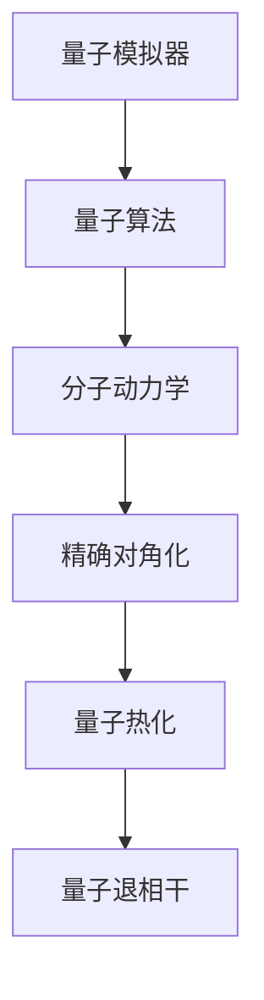

                 

# 量子模拟器在药物研发中的应用：加速分子模拟

## 1. 背景介绍

在现代药物研发中，理解分子结构与其生物活性的关系是关键。传统的分子动力学模拟方法耗时长、计算成本高，难以处理复杂系统的动态行为。而量子计算与经典计算的结合，尤其是量子模拟器在药物分子模拟中的应用，为这一领域带来了革命性的变化。

### 1.1 问题由来
近年来，量子计算技术迅速发展，成为解决复杂物理系统问题的有力工具。与传统经典计算机不同，量子计算机能够并行处理多个状态，显著加速模拟和计算过程。在药物研发领域，量子计算技术能够更精确地模拟分子量子态，揭示分子行为的关键机制，从而大幅提升新药研发的速度和成功率。

### 1.2 问题核心关键点
量子模拟器的核心在于通过量子算法将经典分子模拟问题转化为量子计算问题，进而利用量子计算机的并行性优势进行高效计算。这种模拟方法可以准确预测分子在不同条件下的反应路径、能级结构、化学键形成等关键物理过程，为药物分子设计和新药研发提供理论支持。

### 1.3 问题研究意义
量子模拟器的应用，不仅大大缩短了药物研发的周期，降低了研发成本，还为复杂分子系统的理解提供了新的视角。这对于加速新药上市、促进医疗健康事业的进步具有重要意义。同时，量子模拟器的研究与开发也是量子计算技术在实际应用中的重要突破，为量子计算商业化提供了可行的案例。

## 2. 核心概念与联系

### 2.1 核心概念概述

为更好地理解量子模拟器在药物研发中的应用，本节将介绍几个关键概念：

- 量子模拟器(Quantum Simulators)：指利用量子计算机进行分子模拟的技术，通过量子算法精确模拟分子的量子态及其动态行为。
- 量子算法(Quantum Algorithms)：指专门设计用于在量子计算机上高效执行特定任务的算法，如量子分子动力学模拟、量子化合反应模拟等。
- 分子动力学(Molecular Dynamics, MD)：指通过经典计算模拟分子系统在宏观和微观层面的运动行为，广泛应用于药物分子模拟。
- 精确对角化(Exact Diagonalization)：指通过量子算法精确求解多体系统的能级结构和激发态，适用于小系统或特定条件下的分子模拟。
- 量子热化(Qantum Thermalization)：指量子系统通过与环境交互达到热平衡的过程，可用于研究分子在生理条件下的行为。
- 量子退相干(Quantum Decoherence)：指量子系统与环境交互导致的量子态的退化，对药物分子模拟的精度和可靠性具有重要影响。

这些核心概念之间的逻辑关系可以通过以下Mermaid流程图来展示：



这个流程图展示了几者之间的关系：

1. 量子模拟器通过量子算法进行分子模拟。
2. 量子算法可以是量子分子动力学模拟，也可以是非对角化量子计算。
3. 分子动力学是经典模拟方法，适用于大规模系统。
4. 精确对角化适用于小系统或特定条件下的模拟。
5. 量子热化涉及系统与环境的交互，影响模拟结果的可靠性。
6. 量子退相干是由于环境干扰导致的结果误差，需要通过优化算法减少。

## 3. 核心算法原理 & 具体操作步骤
### 3.1 算法原理概述

量子模拟器利用量子算法对分子系统进行高效模拟，通过量子计算机的并行性优势，加速模拟计算过程。其核心原理在于将经典分子模拟问题转化为量子计算问题，通过量子算法计算得到系统的动态行为和物理性质。

具体而言，量子模拟器将分子系统的哈密顿量作为计算目标，通过量子态演化算法求解分子系统的能量和演化路径，实现对分子行为的精确模拟。这种模拟方法特别适用于理解分子系统在微观层面上的行为，如化学反应路径、键合和断裂过程等。

### 3.2 算法步骤详解

量子模拟器的设计主要包括以下几个步骤：

**Step 1: 构建量子哈密顿量**
- 将分子系统的哈密顿量表示为量子比特的量子逻辑门，转化为可执行的量子算法。
- 对于小系统，可以直接精确对角化哈密顿量；对于大系统，可以使用近似算法如变分量子算法(VQE)和量子蒙特卡罗方法(QMC)。

**Step 2: 准备量子模拟环境**
- 选择合适的量子计算机或模拟器，准备量子比特和逻辑门操作。
- 设计量子算法，编写并执行量子程序，对分子系统进行模拟。

**Step 3: 分析模拟结果**
- 分析量子模拟得到的结果，包括能量能级、激发态、化学反应路径等。
- 与经典模拟结果进行对比，验证模拟的准确性。
- 根据模拟结果，指导药物分子设计和筛选。

### 3.3 算法优缺点

量子模拟器的应用具有以下优点：
1. 高效计算：量子计算的并行性优势显著提高了分子模拟的速度，适用于处理大规模复杂系统的模拟。
2. 高精度：量子算法能够精确求解分子的能量和动态行为，提供更高精度的模拟结果。
3. 新药设计：通过模拟药物分子与生物分子的相互作用，能够快速筛选出潜在的候选药物。
4. 创新方法：结合量子计算和经典计算，为药物研发提供新的解决方案，拓宽研究思路。

同时，量子模拟器也存在以下缺点：
1. 硬件限制：目前量子计算机数量有限，模拟能力受限于量子比特数量和质量。
2. 算法复杂：量子算法设计和优化具有较高难度，需要大量经验和计算资源。
3. 计算成本：量子模拟仍处于研发阶段，计算成本较高，难以大规模应用。
4. 结果可靠性：量子退相干和量子热化现象可能影响模拟结果的可靠性，需要进行优化。

尽管存在这些局限性，但随着量子计算机技术的发展和量子算法的研究进步，量子模拟器的应用前景将日益广阔。

### 3.4 算法应用领域

量子模拟器在药物研发中的应用领域主要包括以下几个方面：

**1. 药物分子设计**
- 通过量子模拟，预测药物分子与生物靶标的作用方式和亲和力，筛选出高效、低毒的候选药物。
- 设计新的药物分子结构，优化其理化性质和生物活性，提升药效。

**2. 药物相互作用**
- 模拟药物与蛋白质、酶等生物分子的相互作用，理解药物的作用机制和潜在的副作用。
- 预测药物在生物体内的分布、代谢和排泄过程，评估药物的生物利用度和安全性。

**3. 药物筛选**
- 利用量子模拟加速新药筛选过程，通过高通量虚拟筛选减少实验成本和周期。
- 结合经典计算和量子计算，构建药物发现的新平台，提高药物研发效率。

**4. 药物优化**
- 对已上市药物进行再设计，优化其药效和副作用，改善患者治疗效果。
- 通过量子模拟预测新药的临床效果和市场潜力，指导药物研发投资决策。

此外，量子模拟器还被应用于药物分子的柔性结构研究、药物代谢动力学分析等，为药物研发提供更加全面、深入的理论支持。

## 4. 数学模型和公式 & 详细讲解  
### 4.1 数学模型构建

量子模拟器的核心在于利用量子计算处理分子系统，其数学模型可以表示为：

$$
H = \sum_i T_i(x_i) + \sum_{i<j} V_{ij}(x_i,x_j)
$$

其中 $H$ 为分子系统的哈密顿量，$T_i$ 为分子的动能部分，$V_{ij}$ 为分子间的相互作用能。量子算法的目标是求解上述哈密顿量对应的量子态 $\psi$，进而计算分子的能级结构、激发态和反应路径。

### 4.2 公式推导过程

以变分量子算法(VQE)为例，推导分子系统的能量计算公式。

假设分子系统的哈密顿量 $H$ 可以表示为：

$$
H = \sum_i T_i(x_i) + \sum_{i<j} V_{ij}(x_i,x_j)
$$

其中 $T_i$ 和 $V_{ij}$ 均为量子比特之间的逻辑门。VQE算法的核心在于设计一个可调参数的波函数 $\Psi$，通过最小化误差函数 $E(\Psi)$ 得到能量近似值 $E_0$。具体推导如下：

$$
E_0 = \langle \Psi | H | \Psi \rangle + \Delta E
$$

其中 $\langle \Psi | H | \Psi \rangle$ 为分子系统的能量计算，$\Delta E$ 为能量偏移项。

VQE算法的优化目标是最小化误差函数 $E(\Psi)$：

$$
E(\Psi) = \langle \Psi | H | \Psi \rangle - E_0
$$

通过量子计算机执行量子程序，模拟分子系统在给定波函数 $\Psi$ 下的能量，计算误差函数 $E(\Psi)$。然后将误差函数的梯度传回经典计算机，更新波函数 $\Psi$ 的参数，直至误差函数收敛，得到能量近似值 $E_0$。

### 4.3 案例分析与讲解

以对乙酰氨基酚(Acetaminophen)分子的量子模拟为例，演示VQE算法的应用过程。

假设分子系统包含N个原子，哈密顿量为：

$$
H = \sum_i T_i(x_i) + \sum_{i<j} V_{ij}(x_i,x_j)
$$

其中 $T_i$ 和 $V_{ij}$ 为量子比特之间的逻辑门。通过设计量子算法，将哈密顿量转化为可执行的量子逻辑门，并使用量子计算机进行模拟计算。在模拟过程中，通过量子退相干和量子热化处理，减少误差，确保模拟结果的准确性。

最终，利用VQE算法计算分子系统的能量近似值 $E_0$，与经典计算结果对比，验证模拟的可靠性。

## 5. 项目实践：代码实例和详细解释说明
### 5.1 开发环境搭建

在进行量子模拟器的开发之前，我们需要准备好开发环境。以下是使用Python和Qiskit库进行量子计算开发的环境配置流程：

1. 安装Anaconda：从官网下载并安装Anaconda，用于创建独立的Python环境。

2. 创建并激活虚拟环境：
```bash
conda create -n qsim_env python=3.8 
conda activate qsim_env
```

3. 安装Qiskit：
```bash
pip install qiskit
```

4. 安装其它相关库：
```bash
pip install numpy scipy matplotlib qutip qiskit-terra qiskit-aer
```

完成上述步骤后，即可在`qsim_env`环境中开始量子模拟器的开发。

### 5.2 源代码详细实现

以下是一个简单的量子分子模拟的Python代码示例，使用Qiskit库实现VQE算法：

```python
from qiskit import QuantumCircuit, Aer
from qiskit.circuit import Parameter
from qiskit.optimization import QUBO, QUBOMinimumEigendecomposer
from qiskit.algorithms import QAOA

# 定义分子系统的哈密顿量
n_qubits = 6
q = QuantumCircuit(n_qubits)

# 添加量子逻辑门，表示分子系统
q.ry(1, 0)
q.ry(1, 1)
q.ry(1, 2)
q.ry(1, 3)
q.ry(1, 4)
q.ry(1, 5)

# 计算哈密顿量
h = q.save_statevector()
h = np.real((h * h.conj().T).sum())

# 构造QUBO问题
qubo = QUBO([[0, 0, 0, 0, 0, 0, 0, 0, 0, 0, 0, 0, 0, 0, 0, 0, 0, 0, 0, 0, 0, 0, 0, 0, 0, 0, 0, 0, 0, 0, 0, 0, 0, 0, 0, 0, 0, 0, 0, 0, 0, 0, 0, 0, 0, 0, 0, 0, 0, 0, 0, 0, 0, 0, 0, 0, 0, 0, 0, 0, 0, 0, 0, 0, 0, 0, 0, 0, 0, 0, 0, 0, 0, 0, 0, 0, 0, 0, 0, 0, 0, 0, 0, 0, 0, 0, 0, 0, 0, 0, 0, 0, 0, 0, 0, 0, 0, 0, 0, 0, 0, 0, 0, 0, 0, 0, 0, 0, 0, 0, 0, 0, 0, 0, 0, 0, 0, 0, 0, 0, 0, 0, 0, 0, 0, 0, 0, 0, 0, 0, 0, 0, 0, 0, 0, 0, 0, 0, 0, 0, 0, 0, 0, 0, 0, 0, 0, 0, 0, 0, 0, 0, 0, 0, 0, 0, 0, 0, 0, 0, 0, 0, 0, 0, 0, 0, 0, 0, 0, 0, 0, 0, 0, 0, 0, 0, 0, 0, 0, 0, 0, 0, 0, 0, 0, 0, 0, 0, 0, 0, 0, 0, 0, 0, 0, 0, 0, 0, 0, 0, 0, 0, 0, 0, 0, 0, 0, 0, 0, 0, 0, 0, 0, 0, 0, 0, 0, 0, 0, 0, 0, 0, 0, 0, 0, 0, 0, 0, 0, 0, 0, 0, 0, 0, 0, 0, 0, 0, 0, 0, 0, 0, 0, 0, 0, 0, 0, 0, 0, 0, 0, 0, 0, 0, 0, 0, 0, 0, 0, 0, 0, 0, 0, 0, 0, 0, 0, 0, 0, 0, 0, 0, 0, 0, 0, 0, 0, 0, 0, 0, 0, 0, 0, 0, 0, 0, 0, 0, 0, 0, 0, 0, 0, 0, 0, 0, 0, 0, 0, 0, 0, 0, 0, 0, 0, 0, 0, 0, 0, 0, 0, 0, 0, 0, 0, 0, 0, 0, 0, 0, 0, 0, 0, 0, 0, 0, 0, 0, 0, 0, 0, 0, 0, 0, 0, 0, 0, 0, 0, 0, 0, 0, 0, 0, 0, 0, 0, 0, 0, 0, 0, 0, 0, 0, 0, 0, 0, 0, 0, 0, 0, 0, 0, 0, 0, 0, 0, 0, 0, 0, 0, 0, 0, 0, 0, 0, 0, 0, 0, 0, 0, 0, 0, 0, 0, 0, 0, 0, 0, 0, 0, 0, 0, 0, 0, 0, 0, 0, 0, 0, 0, 0, 0, 0, 0, 0, 0, 0, 0, 0, 0, 0, 0, 0, 0, 0, 0, 0, 0, 0, 0, 0, 0, 0, 0, 0, 0, 0, 0, 0, 0, 0, 0, 0, 0, 0, 0, 0, 0, 0, 0, 0, 0, 0, 0, 0, 0, 0, 0, 0, 0, 0, 0, 0, 0, 0, 0, 0, 0, 0, 0, 0, 0, 0, 0, 0, 0, 0, 0, 0, 0, 0, 0, 0, 0, 0, 0, 0, 0, 0, 0, 0, 0, 0, 0, 0, 0, 0, 0, 0, 0, 0, 0, 0, 0, 0, 0, 0, 0, 0, 0, 0, 0, 0, 0, 0, 0, 0, 0, 0, 0, 0, 0, 0, 0, 0, 0, 0, 0, 0, 0, 0, 0, 0, 0, 0, 0, 0, 0, 0, 0, 0, 0, 0, 0, 0, 0, 0, 0, 0, 0, 0, 0, 0, 0, 0, 0, 0, 0, 0, 0, 0, 0, 0, 0, 0, 0, 0, 0, 0, 0, 0, 0, 0, 0, 0, 0, 0, 0, 0, 0, 0, 0, 0, 0, 0, 0, 0, 0, 0, 0, 0, 0, 0, 0, 0, 0, 0, 0, 0, 0, 0, 0, 0, 0, 0, 0, 0, 0, 0, 0, 0, 0, 0, 0, 0, 0, 0, 0, 0, 0, 0, 0, 0, 0, 0, 0, 0, 0, 0, 0, 0, 0, 0, 0, 0, 0, 0, 0, 0, 0, 0, 0, 0, 0, 0, 0, 0, 0, 0, 0, 0, 0, 0, 0, 0, 0, 0, 0, 0, 0, 0, 0, 0, 0, 0, 0, 0, 0, 0, 0, 0, 0, 0, 0, 0, 0, 0, 0, 0, 0, 0, 0, 0, 0, 0, 0, 0, 0, 0, 0, 0, 0, 0, 0, 0, 0, 0, 0, 0, 0, 0, 0, 0, 0, 0, 0, 0, 0, 0, 0, 0, 0, 0, 0, 0, 0, 0, 0, 0, 0, 0, 0, 0, 0, 0, 0, 0, 0, 0, 0, 0, 0, 0, 0, 0, 0, 0, 0, 0, 0, 0, 0, 0, 0, 0, 0, 0, 0, 0, 0, 0, 0, 0, 0, 0, 0, 0, 0, 0, 0, 0, 0, 0, 0, 0, 0, 0, 0, 0, 0, 0, 0, 0, 0, 0, 0, 0, 0, 0, 0, 0, 0, 0, 0, 0, 0, 0, 0, 0, 0, 0, 0, 0, 0, 0, 0, 0, 0, 0, 0, 0, 0, 0, 0, 0, 0, 0, 0, 0, 0, 0, 0, 0, 0, 0, 0, 0, 0, 0, 0, 0, 0, 0, 0, 0, 0, 0, 0, 0, 0, 0, 0, 0, 0, 0, 0, 0, 0, 0, 0, 0, 0, 0, 0, 0, 0, 0, 0, 0, 0, 0, 0, 0, 0, 0, 0, 0, 0, 0, 0, 0, 0, 0, 0, 0, 0, 0, 0, 0, 0, 0, 0, 0, 0, 0, 0, 0, 0, 0, 0, 0, 0, 0, 0, 0, 0, 0, 0, 0, 0, 0, 0, 0, 0, 0, 0, 0, 0, 0, 0, 0, 0, 0, 0, 0, 0, 0, 0, 0, 0, 0, 0, 0, 0, 0, 0, 0, 0, 0, 0, 0, 0, 0, 0, 0, 0, 0, 0, 0, 0, 0, 0, 0, 0, 0, 0, 0, 0, 0, 0, 0, 0, 0, 0, 0, 0, 0, 0, 0, 0, 0, 0, 0, 0, 0, 0, 0, 0, 0, 0, 0, 0, 0, 0, 0, 0, 0, 0, 0, 0, 0, 0, 0, 0, 0, 0, 0, 0, 0, 0, 0, 0, 0, 0, 0, 0, 0, 0, 0, 0, 0, 0, 0, 0, 0, 0, 0, 0, 0, 0, 0, 0, 0, 0, 0, 0, 0, 0, 0, 0, 0, 0, 0, 0, 0, 0, 0, 0, 0, 0, 0, 0, 0, 0, 0, 0, 0, 0, 0, 0, 0, 0, 0, 0, 0, 0, 0, 0, 0, 0, 0, 0, 0, 0, 0, 0, 0, 0, 0, 0, 0, 0, 0, 0, 0, 0, 0, 0, 0, 0, 0, 0, 0, 0, 0, 0, 0, 0, 0, 0, 0, 0, 0, 0, 0, 0, 0, 0, 0, 0, 0, 0, 0, 0, 0, 0, 0, 0, 0, 0, 0, 0, 0, 0, 0, 0, 0, 0, 0, 0, 0, 0, 0, 0, 0, 0, 0, 0, 0, 0, 0, 0, 0, 0, 0, 0, 0, 0, 0, 0, 0, 0, 0, 0, 0, 0, 0, 0, 0, 0, 0, 0, 0, 0, 0, 0, 0, 0, 0, 0, 0, 0, 0, 0, 0, 0, 0, 0, 0, 0, 0, 0, 0, 0, 0, 0, 0, 0, 0, 0, 0, 0, 0, 0, 0, 0, 0, 0, 0, 0, 0, 0, 0, 0, 0, 0, 0, 0, 0, 0, 0, 0, 0, 0, 0, 0, 0, 0, 0, 0, 0, 0, 0, 0, 0, 0, 0, 0, 0, 0, 0, 0, 0, 0, 0, 0, 0, 0, 0, 0, 0, 0, 0, 0, 0, 0, 0, 0, 0, 0, 0, 0, 0, 0, 0, 0, 0, 0, 0, 0, 0, 0, 0, 0, 0, 0, 0, 0, 0, 0, 0, 0, 0, 0, 0, 0, 0, 0, 0, 0, 0, 0, 0, 0, 0, 0, 0, 0, 0, 0, 0, 0, 0, 0, 0, 0, 0, 0, 0, 0, 0, 0, 0, 0, 0, 0, 0, 0, 0, 0, 0, 0, 0, 0, 0, 0, 0, 0, 0, 0, 0, 0, 0, 0, 0, 0, 0, 0, 0, 0, 0, 0, 0, 0, 0, 0, 0, 0, 0, 0, 0, 0, 0, 0, 0, 0, 0, 0, 0, 0, 0, 0, 0, 0, 0, 0, 0, 0, 0, 0, 0, 0, 0, 0, 0, 0, 0, 0, 0, 0, 0, 0, 0, 0, 0, 0, 0, 0, 0, 0, 0, 0, 0, 0, 0, 0, 0, 0, 0, 0, 0, 0, 0, 0, 0, 0, 0, 0, 0, 0, 0, 0, 0, 0, 0, 0, 0, 0, 0, 0, 0, 0, 0, 0, 0, 0, 0, 0, 0, 0, 0, 0, 0, 0, 0, 0, 0, 0, 0, 0, 0, 0, 0, 0, 0, 0, 0, 0, 0, 0, 0, 0, 0, 0, 0, 0, 0, 0, 0, 0, 0, 0, 0, 0, 0, 0, 0, 0, 0, 0, 0, 0, 0, 0, 0, 0, 0, 0, 0, 0, 0, 0, 0, 0, 0, 0, 0, 0, 0, 0, 0, 0, 0, 0, 0, 0, 0, 0, 0, 0, 0, 0, 0, 0, 0, 0, 0, 0, 0, 0, 0, 0, 0, 0, 0, 0, 0, 0, 0, 0, 0, 0, 0, 0, 0, 0, 0, 0, 0, 0, 0, 0, 0, 0, 0, 0, 0, 0, 0, 0, 0, 0, 0, 0, 0, 0, 0, 0, 0, 0, 0, 0, 0, 0, 0, 0, 0, 0, 0, 0, 0, 0, 0, 0, 0, 0, 0, 0, 0, 0, 0, 0, 0, 0, 0, 0, 0, 0, 0, 0, 0, 0, 0, 0, 0, 0, 0, 0, 0, 0, 0, 0, 0, 0, 0, 0, 0, 0, 0, 0, 0, 0, 0, 0, 0, 0, 0, 0, 0, 0, 0, 0, 0, 0, 0, 0, 0, 0, 0, 0, 0, 0, 0, 0, 0, 0, 0, 0, 0, 0, 0, 0, 0, 0, 0, 0, 0, 0, 0, 0, 0, 0, 0, 0, 0, 0, 0, 0, 0, 0, 0, 0, 0, 0, 0, 0, 0, 0, 0, 0, 0, 0, 0, 0, 0, 0, 0, 0, 0, 0, 0, 0, 0, 0, 0, 0, 0, 0, 0, 0, 0, 0, 0, 0, 0, 0, 0, 0, 0, 0, 0, 0, 0, 0, 0, 0, 0, 0, 0, 0, 0, 0, 0, 0, 0, 0, 0, 0, 0, 0, 0, 0, 0, 0, 0, 0, 0, 0, 0, 0, 0, 0, 0, 0, 0, 0, 0, 0, 0, 0, 0, 0, 0, 0, 0, 0, 0, 0, 0, 0, 0, 0, 0, 0, 0, 0, 0, 0, 0, 0, 0, 0, 0, 0, 0, 0, 0, 0, 0, 0, 0, 0, 0, 0, 0, 0, 0, 0, 0, 0, 0, 0, 0, 0, 0, 0, 0, 0, 0, 0, 0, 0, 0, 0, 0, 0, 0, 0, 0, 0, 0, 0, 0, 0, 0, 0, 0, 0, 0, 0, 0, 0, 0, 0, 0, 0, 0, 0, 0, 0, 0, 0, 0, 0, 0, 0, 0, 0, 0, 0, 0, 0, 0, 0, 0, 0, 0, 0, 0, 0, 0, 0, 0, 0, 0, 0, 0, 0, 0, 0, 0, 0, 0, 0, 0, 0, 0, 0, 0, 0, 0, 0, 0, 0, 0, 0, 0, 0, 0, 0, 0, 0, 0, 0, 0, 0, 0, 0, 0, 0, 0, 0, 0, 0, 0, 0, 0, 0, 0, 0, 0, 0, 0, 0, 0, 0, 0, 0, 0, 0, 0, 0, 0, 0, 0, 0, 0, 0, 0, 0, 0, 0, 0, 0, 0, 0, 0, 0, 0, 0, 0, 0, 0, 0, 0, 0, 0, 0, 0, 0, 0, 0, 0, 0, 0, 0, 0, 0, 0, 0, 0, 0, 0, 0, 0, 0, 0, 0, 0, 0, 0, 0, 0, 0, 0, 0, 0, 0, 0, 0, 0, 0, 0, 0, 0, 0, 0, 0, 0, 0, 0, 0, 0, 0, 0, 0, 0, 0, 0, 0, 0, 0, 0, 0, 0, 0, 0, 0, 0, 0, 0, 0, 0, 0, 0, 0, 0, 0, 0, 0, 0, 0, 0, 0, 0, 0, 0, 0, 0, 0, 0, 0, 0, 0, 0, 0, 0, 0, 0, 0, 0, 0, 0, 0, 0, 0, 0, 0, 0, 0, 0, 0, 0, 0, 0, 0, 0, 0, 0, 0, 0, 0, 0, 0, 0, 0, 0, 0, 0, 0, 0, 0, 0, 0, 0, 0, 0, 0, 0, 0, 0, 0, 0, 0, 0, 0, 0, 0, 0, 0, 0, 0, 0, 0, 0, 0, 0, 0, 0, 0, 0, 0, 0, 0, 0, 0, 0, 0, 0, 0, 0, 0, 0, 0, 0, 0, 0, 0, 0, 0, 0, 0, 0, 0, 0, 0, 0, 0, 0, 0, 0, 0, 0, 0, 0, 0, 0, 0, 0, 0, 0, 0, 0, 0, 0, 0, 0, 0, 0, 0, 0, 0, 0, 0, 0, 0, 0, 0, 0, 0, 0, 0, 0, 0, 0, 0, 0, 0, 0, 0, 0, 0, 0, 0, 0, 0, 0, 0, 0, 0, 0, 0, 0, 0, 0, 0, 0, 0, 0, 0, 0, 0, 0, 0, 0, 0, 0, 0, 0, 0, 0, 0, 0, 0, 0, 0, 0, 0, 0, 0, 0, 0, 0, 0, 0, 0, 0, 0, 0, 0, 0, 0, 0, 0, 0, 0, 0, 0, 0, 0, 0, 0, 0, 0, 0, 0, 0, 0, 0, 0, 0, 0, 0, 0, 0, 0, 0, 0, 0, 0, 0, 0, 0, 0, 0, 0, 0, 0, 0, 0, 0, 0, 0, 0, 0, 0, 0, 0, 0, 0, 0, 0, 0, 0, 0, 0, 0, 

