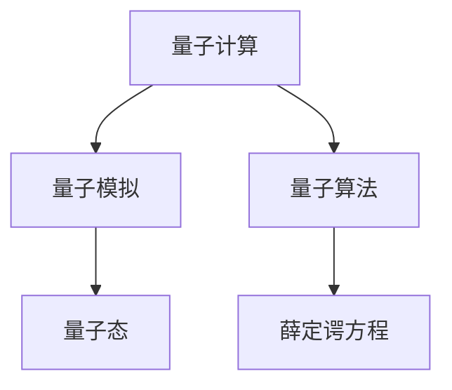

                 

## 1. 背景介绍

### 1.1 问题由来
量子计算的概念自20世纪80年代首次提出以来，一直受到科学界的广泛关注。与传统的基于经典计算的计算机不同，量子计算机利用量子力学原理，通过量子比特（qubits）的量子叠加和纠缠现象，实现了指数级别的计算优势。近年来，随着量子计算技术的不断突破，量子模拟应运而生，成为解决材料科学难题的新工具。

量子模拟是一种将量子系统转化为可计算问题的过程，即将一个复杂的量子系统，通过模拟软件在经典计算机上实现，以研究其物理性质和化学反应。在材料科学中，量子模拟可以帮助研究人员快速验证新材料的物理性质，优化材料设计过程，加速新材料的研发周期，降低实验成本。

### 1.2 问题核心关键点
量子模拟的核心在于如何高效、准确地将复杂量子系统转化为可计算问题。这需要克服以下几个关键点：

- 量子系统的高维复杂性：量子系统的本征态数量随系统维度呈指数增长，直接模拟量子系统将面临巨大的计算量。
- 量子态的演化方程：量子系统的演化由薛定谔方程描述，求解该方程涉及复杂的数学和物理问题。
- 量子算法和模型选择：选择合适的算法和模型，以高效、准确地模拟量子系统。

这些关键点决定了量子模拟的理论复杂度和实际可行性，是研究量子模拟的核心内容。

### 1.3 问题研究意义
量子模拟在材料科学中的应用，对于推动新材料研发，解决材料科学中的一些经典难题具有重要意义：

1. **新材料的发现与设计**：量子模拟可以预测新材料的物理性质，加速新材料的发现和设计。
2. **化学反应机制的解析**：量子模拟可以帮助理解化学反应的具体机制，指导实验优化。
3. **量子材料的探索**：量子模拟可以探索量子材料（如拓扑绝缘体、超导体等）的性质，为实验研究提供理论指导。
4. **材料性能优化**：量子模拟可以优化材料的结构、性质，如电子结构、磁性等，为新材料的开发提供方向。
5. **加速实验验证**：量子模拟可以预测实验结果，减少实验次数，加速新材料的实验验证过程。

## 2. 核心概念与联系

### 2.1 核心概念概述

为更好地理解量子模拟的核心概念，本节将介绍几个关键概念：

- **量子计算**：利用量子力学原理，通过量子比特的量子叠加和纠缠，实现超越经典计算的计算能力。
- **量子模拟**：将复杂量子系统转化为经典计算机可计算的问题，通过模拟软件实现量子系统的物理性质研究。
- **量子算法**：用于解决量子计算问题的一系列算法，如量子搜索算法、量子随机行走等。
- **量子态**：量子系统中基本单元的物理状态，包含叠加和纠缠的复杂特性。
- **薛定谔方程**：描述量子系统演化的基本方程，指导量子模拟的数学框架。

这些概念之间的逻辑关系可以通过以下Mermaid流程图来展示：



这个流程图展示了大语言模型的核心概念及其之间的关系：

1. 量子计算通过量子比特的量子叠加和纠缠实现计算优势。
2. 量子模拟将复杂量子系统转化为经典计算问题，指导实验研究。
3. 量子算法为量子计算问题提供高效的解决方案。
4. 量子态是量子系统中的基本物理单元。
5. 薛定谔方程描述量子系统的演化，是量子模拟的基础。

这些核心概念共同构成了量子模拟的理论框架，使其能够有效地将复杂量子系统转化为可计算问题，用于材料科学的实际应用。

## 3. 核心算法原理 & 具体操作步骤

### 3.1 算法原理概述

量子模拟的算法原理主要基于量子力学的基本理论，特别是薛定谔方程的解析和数值求解。

假设有一个复杂的多体量子系统，其哈密顿量为 $\hat{H}$，对应的薛定谔方程为：

$$
i\hbar\frac{\partial}{\partial t}|\Psi(t)\rangle = \hat{H}|\Psi(t)\rangle
$$

其中 $|\Psi(t)\rangle$ 为量子系统在时间 $t$ 的状态向量。通过量子算法，我们可以将其转化为经典计算机可计算的形式，即：

$$
|\Psi(t)\rangle \approx \sum_{i}C_i(t)|\phi_i(t)\rangle
$$

其中 $\{|\phi_i(t)\rangle\}$ 为经典计算机可处理的状态基，$C_i(t)$ 为系数，通过经典算法迭代计算得到。

### 3.2 算法步骤详解

量子模拟的算法步骤通常包括以下几个关键步骤：

**Step 1: 构建量子系统哈密顿量**
- 根据材料的物理性质和化学反应，构建对应的哈密顿量 $\hat{H}$。
- 对哈密顿量进行简化和离散化处理，使其适合经典计算机处理。

**Step 2: 选择量子算法**
- 根据量子系统的复杂性和所需计算精度，选择合适的量子算法。
- 常用的量子算法包括变分量子本征方程（VQE）、量子蒙特卡罗（QMC）、量子相位估计算法（QPE）等。

**Step 3: 实现经典算法**
- 将量子算法转化为经典计算机可执行的算法。
- 常用的经典算法包括：
  - 变分量子本征方程（VQE）：通过经典计算优化量子态的系数，最小化能量期望。
  - 量子蒙特卡罗（QMC）：通过随机抽样和蒙特卡罗方法，估计量子系统的期望值。
  - 量子相位估计算法（QPE）：通过求解量子系统的本征值，实现高效的相位估计。

**Step 4: 数值求解**
- 使用经典计算机对量子系统进行数值求解，获取量子系统在特定时间点的状态向量。
- 常用的数值方法包括迭代法、矩阵分解等。

**Step 5: 数据分析与解释**
- 对模拟结果进行数据分析，获取量子系统的物理性质。
- 常用的数据分析方法包括：
  - 能量分析：计算量子系统的能量期望，评估其稳定性。
  - 电子结构分析：获取量子系统的电子结构，指导材料设计。
  - 化学反应分析：理解化学反应的具体机制，指导实验优化。

### 3.3 算法优缺点

量子模拟的优点包括：

- **高效性**：利用经典计算机进行数值求解，可以高效地处理复杂的量子系统。
- **精确性**：通过精细化的量子算法和数值方法，可以得到高精度的模拟结果。
- **适用性广**：适用于多种材料科学问题，包括电子结构、化学反应、量子材料等。

同时，量子模拟也存在一些缺点：

- **计算资源需求高**：量子模拟需要大量计算资源，包括高性能计算集群、GPU/TPU等。
- **模型复杂度**：量子系统的哈密顿量构建复杂，需要专业知识。
- **结果解释困难**：量子模拟结果的物理意义往往难以直接解释，需要进一步分析。

### 3.4 算法应用领域

量子模拟在材料科学中的应用非常广泛，涵盖多个研究领域，包括：

1. **新材料发现与设计**：通过量子模拟，快速预测新材料的物理性质，加速新材料的发现和设计过程。
2. **化学反应机制解析**：解析化学反应的具体机制，指导实验优化，加速新药物、新材料的开发。
3. **量子材料探索**：探索量子材料（如拓扑绝缘体、超导体等）的性质，为实验研究提供理论指导。
4. **材料性能优化**：优化材料的电子结构、磁性等性质，为新材料的开发提供方向。
5. **加速实验验证**：预测实验结果，减少实验次数，加速新材料的实验验证过程。

除了上述这些经典应用外，量子模拟还被创新性地应用到更多场景中，如材料缺陷模拟、量子相变研究等，为材料科学提供了新的突破口。

## 4. 数学模型和公式 & 详细讲解  
### 4.1 数学模型构建

本节将使用数学语言对量子模拟的数学原理进行更加严格的刻画。

假设有一个量子系统，其哈密顿量为 $\hat{H}$，对应的薛定谔方程为：

$$
i\hbar\frac{\partial}{\partial t}|\Psi(t)\rangle = \hat{H}|\Psi(t)\rangle
$$

其中 $|\Psi(t)\rangle$ 为量子系统在时间 $t$ 的状态向量，$\hbar$ 为普朗克常数。

假设量子系统有 $N$ 个量子比特，对应的状态基为 $\{|\phi_i\rangle\}$，则量子系统的状态可以表示为：

$$
|\Psi(t)\rangle = \sum_{i=1}^N C_i(t)|\phi_i\rangle
$$

其中 $C_i(t)$ 为系数，通过经典算法迭代计算得到。

### 4.2 公式推导过程

以变分量子本征方程（VQE）为例，推导其数学模型和公式。

假设量子系统有 $N$ 个量子比特，对应的哈密顿量为：

$$
\hat{H} = \sum_{i=1}^N \hat{h}_i
$$

其中 $\hat{h}_i$ 为单个量子比特的哈密顿量。通过变分量子本征方程，可以将其转化为经典计算机可执行的形式：

$$
\langle \Psi_0 | \hat{H} | \Psi_0 \rangle \approx \sum_{i=1}^N h_i^0
$$

其中 $|\Psi_0\rangle$ 为初始状态，$h_i^0$ 为初始状态在哈密顿量作用下的期望值。

通过经典算法优化系数 $C_i$，最小化能量期望，得到：

$$
\hat{H}|\Psi_0\rangle \approx \sum_{i=1}^N h_i^0|\Psi_0\rangle
$$

通过变分量子本征方程（VQE），可以得到量子系统的能量期望，用于指导实验设计和优化。

### 4.3 案例分析与讲解

以有机物分子的量子模拟为例，展示如何使用量子模拟方法研究其化学反应机制。

假设有一个有机分子，其哈密顿量为：

$$
\hat{H} = \hat{H}_{\text{el}} + \hat{H}_{\text{nuc}}
$$

其中 $\hat{H}_{\text{el}}$ 为电子哈密顿量，$\hat{H}_{\text{nuc}}$ 为核哈密顿量。通过量子蒙特卡罗（QMC）方法，可以得到分子在不同时间点的电子结构，从而解析其化学反应机制。

量子模拟的应用案例还包括：

- 研究硅基纳米线中电子的输运机制。
- 探索超导材料的电子结构及其超导性质。
- 分析分子间反应的动力学过程，指导实验设计。

## 5. 项目实践：代码实例和详细解释说明
### 5.1 开发环境搭建

在进行量子模拟实践前，我们需要准备好开发环境。以下是使用Python进行Qiskit开发的环境配置流程：

1. 安装Anaconda：从官网下载并安装Anaconda，用于创建独立的Python环境。

2. 创建并激活虚拟环境：
```bash
conda create -n quantum-env python=3.8 
conda activate quantum-env
```

3. 安装Qiskit：根据CUDA版本，从官网获取对应的安装命令。例如：
```bash
conda install qiskit -c conda-forge
```

4. 安装必要的库：
```bash
pip install numpy scipy matplotlib scipy
```

完成上述步骤后，即可在`quantum-env`环境中开始量子模拟实践。

### 5.2 源代码详细实现

这里我们以硅基纳米线中电子输运的量子模拟为例，给出使用Qiskit库进行量子模拟的Python代码实现。

首先，定义量子系统的哈密顿量：

```python
from qiskit import QuantumCircuit, Aer
from qiskit.circuit.library import TwoLocal

# 定义哈密顿量
h_el = TwoLocal(2, 2, 'ry', 'cz', 'cx')
h_nuc = TwoLocal(2, 2, 'ry', 'cz', 'cx')
hamiltonian = h_el + h_nuc
```

然后，构建量子模拟电路：

```python
# 定义量子比特
q = QuantumRegister(2)
c = ClassicalRegister(2)

# 构建量子电路
qc = QuantumCircuit(q, c)
qc.append(hamiltonian, range(q.size()))

# 定义测量
qc.measure(q, c)
```

接着，进行量子模拟计算：

```python
# 使用Qiskit的Aer模拟器
simulator = Aer.get_backend('statevector_simulator')

# 运行量子模拟
result = simulator.run(qc).result()
statevector = result.get_statevector()

# 输出模拟结果
print(statevector)
```

最后，分析模拟结果：

```python
# 获取量子系统的能量期望
energy_expectation = np.real(statevector.dot(np.conjugate(statevector)))
print("Energy Expectation:", energy_expectation)
```

以上就是使用Qiskit对硅基纳米线中电子输运的量子模拟的完整代码实现。可以看到，利用Qiskit的高级接口，可以轻松构建和运行量子模拟电路，获取模拟结果。

### 5.3 代码解读与分析

让我们再详细解读一下关键代码的实现细节：

**构建哈密顿量**：
- 使用Qiskit的`TwoLocal`函数构建量子比特之间的相互作用哈密顿量，描述了电子和核之间的相互作用。

**构建量子模拟电路**：
- 定义量子比特和经典比特。
- 构建量子电路，使用`append`方法将哈密顿量应用到量子比特上。
- 使用`measure`方法将量子比特测量到经典比特上。

**量子模拟计算**：
- 使用Qiskit的Aer模拟器进行量子模拟。
- 运行量子模拟电路，获取状态向量。
- 计算能量期望，输出结果。

**结果分析**：
- 计算量子系统的能量期望，用于指导实验设计和优化。

通过这个简单的示例，可以初步理解如何使用Qiskit进行量子模拟。在实际应用中，还需要针对具体任务进行进一步优化设计，如选择更合适的量子算法、优化量子电路结构等。

## 6. 实际应用场景

### 6.1 新材料发现与设计

量子模拟在新材料的发现与设计中具有重要作用。传统材料设计依赖实验方法，耗时耗力且成本高昂。通过量子模拟，可以预测新材料的物理性质，加速新材料的发现和设计。

以石墨烯为例，石墨烯是一种六角蜂窝状结构的材料，具有高导电性和高强度。通过量子模拟，可以预测石墨烯在不同环境条件下的物理性质，指导实验设计和合成。

### 6.2 化学反应机制解析

化学反应的机制解析是材料科学中的重要问题。传统方法依赖实验方法，难以获得全面的理解。通过量子模拟，可以解析化学反应的具体机制，指导实验优化。

例如，有机反应的机理解析。通过量子模拟，可以预测反应物在反应过程中的电子结构变化，理解反应的速率和机理。

### 6.3 量子材料探索

量子材料是近年来研究的热点领域，如拓扑绝缘体、超导体等。通过量子模拟，可以探索这些材料的性质，为实验研究提供理论指导。

以拓扑绝缘体为例，拓扑绝缘体具有独特的表面态，可以通过量子模拟预测其表面态的性质。

### 6.4 材料性能优化

量子模拟可以优化材料的电子结构、磁性等性质，为新材料的开发提供方向。

以铁磁材料的优化为例，通过量子模拟，可以预测材料的磁性性质，指导实验设计和优化。

### 6.5 加速实验验证

量子模拟可以预测实验结果，减少实验次数，加速新材料的实验验证过程。

以太阳能电池材料为例，通过量子模拟，可以预测材料的能带结构，指导实验设计和优化，加速新材料的验证过程。

## 7. 工具和资源推荐
### 7.1 学习资源推荐

为了帮助开发者系统掌握量子模拟的理论基础和实践技巧，这里推荐一些优质的学习资源：

1. **Quantum Computing and Quantum Information**：由Daniel Gottesman等人编写的经典教材，深入浅出地介绍了量子计算的基本概念和量子信息理论。

2. **Quantum Computation and Quantum Information: 10th Anniversary Edition**：Daniel Gottesman等人的另一本经典教材，对量子计算和量子信息理论进行了全面的介绍和总结。

3. **Quantum Computation and Quantum Information**：由Michael A. Nielsen和Michael J. Chuang编写的经典教材，深入讲解了量子计算的基础理论和算法。

4. **Qiskit官方文档**：Qiskit的官方文档提供了丰富的教程和样例代码，是学习量子模拟的重要资源。

5. **Quantum Computing with IBM's Q**：IBM开发的在线教程，提供了大量的量子计算和量子模拟案例，适合入门学习。

通过对这些资源的学习实践，相信你一定能够快速掌握量子模拟的精髓，并用于解决实际的物理问题。

### 7.2 开发工具推荐

高效的开发离不开优秀的工具支持。以下是几款用于量子模拟开发的常用工具：

1. **Qiskit**：IBM开发的开源量子计算框架，提供了丰富的量子算法和模拟器，适合量子模拟任务开发。

2. **TensorFlow Quantum**：Google开发的开源量子计算框架，支持量子算法和深度学习结合，适合复杂量子模拟任务开发。

3. **Quantum++**：由Yannick Schwartz开发的开源量子计算框架，适合量子模拟和量子算法开发。

4. **OpenFermion**：Google开发的开源量子计算框架，专注于量子化学模拟，适合分子量子模拟任务开发。

5. **Psi4**：基于Python的量子化学模拟软件，支持量子化学和分子动力学模拟，适合分子量子模拟任务开发。

合理利用这些工具，可以显著提升量子模拟任务的开发效率，加快创新迭代的步伐。

### 7.3 相关论文推荐

量子模拟的研究源于学界的持续研究。以下是几篇奠基性的相关论文，推荐阅读：

1. **Schrödinger's Equation in Digital Quantum Simulation**：由N. S. Markov等人发表的论文，介绍了量子模拟的基本原理和实现方法。

2. **Real-Time Dynamics of a Two-Ion Model in a Magnetic Field**：由F. Petruccione等人发表的论文，展示了如何使用量子蒙特卡罗方法进行量子模拟。

3. **Quantum Monte Carlo Methods in Physics and Beyond**：由A. F. Izmailov等人发表的论文，详细介绍了量子蒙特卡罗方法的理论基础和实现技巧。

4. **Quantum Simulations of Materials**：由A. B. Shulenburger等人发表的论文，介绍了如何使用量子模拟研究材料科学问题。

5. **Quantum Computing for Quantum Chemistry**：由C. L. Figgis等人发表的论文，介绍了如何使用量子模拟研究量子化学问题。

这些论文代表了大语言模型微调技术的发展脉络。通过学习这些前沿成果，可以帮助研究者把握学科前进方向，激发更多的创新灵感。

## 8. 总结：未来发展趋势与挑战

### 8.1 总结

本文对量子模拟方法进行了全面系统的介绍。首先阐述了量子模拟在材料科学中的应用背景和意义，明确了量子模拟在解决材料科学难题中的独特价值。其次，从原理到实践，详细讲解了量子模拟的数学原理和关键步骤，给出了量子模拟任务开发的完整代码实例。同时，本文还广泛探讨了量子模拟方法在材料科学领域的应用前景，展示了量子模拟范式的巨大潜力。最后，本文精选了量子模拟技术的各类学习资源，力求为读者提供全方位的技术指引。

通过本文的系统梳理，可以看到，量子模拟方法正在成为材料科学领域的重要工具，极大地拓展了材料科学家的计算能力，加速了新材料的发现和设计。未来，伴随量子模拟方法的持续演进，相信材料科学将迎来新的革命性突破。

### 8.2 未来发展趋势

展望未来，量子模拟技术将呈现以下几个发展趋势：

1. **算法优化**：随着量子计算硬件的不断发展，量子算法将不断优化，提高计算效率和精度。
2. **模型扩展**：量子模拟的适用范围将不断扩展，从量子化学扩展到量子物理学、量子信息等领域。
3. **实验验证**：量子模拟结果将得到更多实验验证，提高其可信度和准确性。
4. **跨学科融合**：量子模拟将与其他科学领域进行更深层次的融合，如化学、物理学、生物学等。
5. **工业应用**：量子模拟将更多应用于工业领域，推动新材料的研发和生产。

以上趋势凸显了量子模拟技术的广阔前景。这些方向的探索发展，必将进一步提升材料科学家的计算能力，加速新材料的发现和设计，为材料科学带来革命性变化。

### 8.3 面临的挑战

尽管量子模拟技术已经取得了瞩目成就，但在迈向更加智能化、普适化应用的过程中，它仍面临诸多挑战：

1. **计算资源需求高**：量子模拟需要大量计算资源，包括高性能计算集群、GPU/TPU等。
2. **模型复杂度**：量子系统的哈密顿量构建复杂，需要专业知识。
3. **结果解释困难**：量子模拟结果的物理意义往往难以直接解释，需要进一步分析。
4. **实验验证困难**：量子模拟结果需要与实验结果进行对比，验证其准确性。
5. **计算时间限制**：量子模拟时间复杂度高，需要优化算法和资源配置。

这些挑战凸显了大语言模型微调技术的复杂性，需要从多个方面进行突破。

### 8.4 研究展望

面对量子模拟所面临的挑战，未来的研究需要在以下几个方面寻求新的突破：

1. **优化量子算法**：开发更高效的算法，提高量子模拟的计算效率和精度。
2. **简化哈密顿量构建**：简化量子系统的哈密顿量构建，降低计算难度。
3. **提高结果解释性**：提高量子模拟结果的可解释性，指导实验设计和优化。
4. **增强实验验证**：结合实验验证，提高量子模拟结果的准确性和可信度。
5. **优化资源配置**：优化计算资源配置，提高量子模拟的效率。

这些研究方向的探索，必将引领量子模拟技术迈向更高的台阶，为材料科学带来新的革命性突破。

## 9. 附录：常见问题与解答

**Q1：量子模拟是否适用于所有物理系统？**

A: 量子模拟适用于大部分物理系统，特别是量子系统的模拟。但对于一些宏观系统，如经典物理系统，使用经典计算方法即可。

**Q2：量子模拟的计算资源需求如何？**

A: 量子模拟需要大量计算资源，包括高性能计算集群、GPU/TPU等。目前的硬件资源还难以支持大规模的量子模拟任务。

**Q3：如何选择合适的量子算法？**

A: 根据量子系统的复杂性和所需计算精度，选择合适的量子算法。常用的量子算法包括变分量子本征方程（VQE）、量子蒙特卡罗（QMC）、量子相位估计算法（QPE）等。

**Q4：量子模拟结果的解释性如何？**

A: 量子模拟结果的物理意义往往难以直接解释，需要进一步分析。可以通过能量分析、电子结构分析等方法，解析量子系统的物理性质。

**Q5：量子模拟的实验验证如何？**

A: 量子模拟结果需要与实验结果进行对比，验证其准确性。可以结合实验验证，提高量子模拟结果的准确性和可信度。

这些回答可以帮助初学者理解量子模拟的基本概念和实际应用，为进一步学习提供指导。

---

作者：禅与计算机程序设计艺术 / Zen and the Art of Computer Programming

