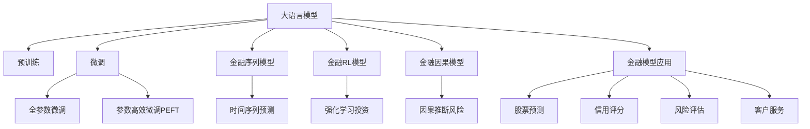

                 

# 金融领域的 LLM：赋能投资和风险管理

## 1. 背景介绍

### 1.1 问题由来

金融行业作为国民经济的重要支柱，其稳健运行关系到国家经济安全和社会稳定。随着金融科技的发展，金融业务日益复杂多样，包括银行、保险、证券、基金、资产管理等子行业，在产品创新、风险管理、客户服务等方面，均面临巨大挑战。

大语言模型（Large Language Model, LLM）作为当前最先进的自然语言处理技术，以其强大的语义理解和生成能力，有望在金融领域发挥重要作用。通过对金融市场的新闻、公告、报告等文本数据的深度学习，LLM能够挖掘出市场动态、公司业绩、政策法规等关键信息，辅助投资者做出更明智的决策，并提升风险管理的精准性和自动化水平。

### 1.2 问题核心关键点

LLM在金融领域的应用，关键在于如何构建高效的模型，准确理解和利用金融数据，以及在实际业务中发挥其价值。其主要包括以下几个方面：

- **数据处理与特征提取**：如何从海量金融数据中提取有意义的特征，为模型训练提供高质量的输入。
- **模型训练与参数优化**：在有限的标注数据下，如何快速高效地训练出效果最优的模型。
- **金融模型应用**：如何将训练好的模型应用于金融场景，如股票预测、风险评估、信用评分等，并进行效果评估。
- **模型可解释性**：构建的模型需要具有良好的可解释性，以辅助金融专家理解模型的决策过程。

## 2. 核心概念与联系

### 2.1 核心概念概述

为更好地理解LLM在金融领域的应用，本节将介绍几个密切相关的核心概念：

- **大语言模型**：以自回归（如GPT）或自编码（如BERT）模型为代表的大规模预训练语言模型。通过在大规模无标签文本语料上进行预训练，学习通用的语言表示，具备强大的语言理解和生成能力。

- **金融时间序列数据**：金融领域中，股票价格、交易量、利率、汇率等数据呈现出显著的时间依赖性，因此可以视为时间序列数据。

- **序列到序列（Seq2Seq）模型**：一种用于处理序列数据的机器学习模型，典型应用包括机器翻译、文本摘要、序列预测等。

- **强化学习（Reinforcement Learning, RL）**：一种通过奖励和惩罚机制，优化智能体决策策略的学习方法。

- **因果推断（Causal Inference）**：一种研究因果关系的方法，旨在推断某个因素对结果的影响。

这些核心概念之间的逻辑关系可以通过以下Mermaid流程图来展示：



这个流程图展示了大语言模型在金融领域的核心概念及其之间的关系：

1. 大语言模型通过预训练获得基础能力。
2. 微调是对预训练模型进行任务特定的优化，可以分为全参数微调和参数高效微调（PEFT）。
3. 金融序列模型用于处理金融时间序列数据，进行时间序列预测等任务。
4. 金融强化学习模型用于进行投资策略优化等。
5. 金融因果模型用于处理因果关系，如风险评估等。
6. 金融模型应用涵盖多种场景，包括股票预测、信用评分、风险评估等。

这些概念共同构成了LLM在金融领域的框架，使其能够在各种金融场景下发挥强大的分析能力。

## 3. 核心算法原理 & 具体操作步骤

### 3.1 算法原理概述

基于金融领域LLM的应用，核心算法原理可以概括为以下几点：

1. **数据预处理**：将金融数据转化为文本形式，并进行归一化、特征提取等预处理。
2. **模型训练**：使用金融数据训练LLM模型，优化模型参数，使其能够准确预测金融指标。
3. **模型应用**：将训练好的模型应用于金融场景，如股票预测、风险评估、信用评分等。
4. **效果评估**：通过评估指标（如均方误差、准确率、召回率等）对模型效果进行评估，并进行必要的调整和优化。

### 3.2 算法步骤详解

基于金融领域LLM的应用，一般包括以下几个关键步骤：

**Step 1: 数据预处理**

金融数据多为时间序列数据，需要先转化为文本形式，并进行归一化、特征提取等预处理。具体步骤如下：

1. 数据采集：收集金融市场的新闻、公告、报告等文本数据。
2. 文本预处理：去除噪音文本，如HTML标签、数字、符号等。
3. 特征提取：将文本转化为数值形式，如词向量、句向量等。
4. 数据分割：将数据划分为训练集、验证集和测试集。

**Step 2: 模型训练**

训练过程包括选择合适的模型结构、损失函数、优化器等，进行模型训练。具体步骤如下：

1. 选择模型：根据任务需求，选择适合的模型结构，如Seq2Seq、RNN、LSTM等。
2. 设置超参数：设置学习率、批大小、迭代轮数等超参数。
3. 数据输入：将处理好的金融数据输入模型，进行训练。
4. 模型优化：通过反向传播算法优化模型参数，最小化损失函数。

**Step 3: 模型应用**

模型训练完成后，可以应用于金融场景进行预测和评估。具体步骤如下：

1. 数据输入：将待预测的金融数据输入模型。
2. 模型预测：模型根据输入数据进行预测，输出预测结果。
3. 结果评估：根据实际结果和预测结果进行评估，计算评估指标。

**Step 4: 效果评估**

评估过程包括计算评估指标、调整模型参数等，以提升模型效果。具体步骤如下：

1. 计算评估指标：使用均方误差、准确率、召回率等指标评估模型效果。
2. 调整模型参数：根据评估结果调整模型参数，重新训练模型。
3. 模型优化：优化模型结构和参数，提升模型效果。

### 3.3 算法优缺点

基于金融领域LLM的应用，具有以下优点：

1. **模型效果好**：LLM具备强大的语义理解和生成能力，能够准确处理金融数据，预测金融指标。
2. **应用范围广**：LLM可以应用于多种金融场景，如股票预测、风险评估、信用评分等。
3. **灵活性高**：可以根据具体任务需求，设计合适的模型结构和损失函数。
4. **可解释性强**：通过分析模型输出和特征权重，可以解释模型的决策过程。

同时，该方法也存在以下局限性：

1. **数据依赖性高**：模型的效果很大程度上取决于金融数据的质量和数量。
2. **泛化能力差**：对于新场景或新数据，模型的泛化能力有限。
3. **计算资源消耗大**：大模型的训练和推理需要大量的计算资源。
4. **可解释性不足**：模型的内部决策过程复杂，难以进行详细解释。

尽管存在这些局限性，但就目前而言，基于金融领域LLM的应用仍然具有重要的应用前景。未来相关研究的重点在于如何进一步降低数据依赖性，提高泛化能力，同时兼顾可解释性和计算效率等因素。

### 3.4 算法应用领域

基于金融领域LLM的应用，主要涵盖以下几个方面：

- **股票预测**：预测股票价格和市场趋势，辅助投资者做出决策。
- **风险评估**：评估金融产品的风险水平，如信用风险、市场风险、操作风险等。
- **信用评分**：根据客户的历史行为和信用记录，预测其信用等级。
- **客户服务**：通过智能客服机器人，解答客户咨询，提升客户满意度。

除了上述这些核心应用外，LLM还可以应用于金融市场分析、交易策略优化、投资组合管理等多个场景，为金融科技带来新的突破。

## 4. 数学模型和公式 & 详细讲解

### 4.1 数学模型构建

在金融领域，LLM的应用主要涉及时间序列数据的预测。以股票价格预测为例，可以构建如下数学模型：

设 $X_t$ 为时间 $t$ 的股票价格，$X_{t+1}$ 为时间 $t+1$ 的股票价格，则可以利用时间序列数据构建如下模型：

$$
X_{t+1} = f(X_t, \theta)
$$

其中 $f$ 为模型函数，$\theta$ 为模型参数。

### 4.2 公式推导过程

对于时间序列预测模型，通常使用基于RNN的模型结构。以LSTM为例，其预测过程如下：

1. 输入序列 $X_t$ 经过LSTM模型，输出隐状态 $h_t$。
2. 隐状态 $h_t$ 通过全连接层，输出预测结果 $\hat{X}_{t+1}$。

预测结果的损失函数通常为均方误差（MSE）：

$$
\mathcal{L} = \frac{1}{N} \sum_{i=1}^N (X_{t+1,i} - \hat{X}_{t+1,i})^2
$$

其中 $N$ 为样本数量。

### 4.3 案例分析与讲解

以股票价格预测为例，展示如何使用LLM进行模型训练和应用：

1. 数据采集：收集金融市场的新闻、公告、报告等文本数据。
2. 数据预处理：去除噪音文本，提取关键词，转化为词向量。
3. 模型训练：选择LSTM模型，设置超参数，进行训练。
4. 模型应用：将待预测的股票价格数据输入模型，输出预测结果。
5. 效果评估：计算均方误差，评估模型效果，并进行必要的调整。

## 5. 项目实践：代码实例和详细解释说明

### 5.1 开发环境搭建

在进行金融领域LLM的应用实践前，我们需要准备好开发环境。以下是使用Python进行PyTorch开发的环境配置流程：

1. 安装Anaconda：从官网下载并安装Anaconda，用于创建独立的Python环境。

2. 创建并激活虚拟环境：
```bash
conda create -n pytorch-env python=3.8 
conda activate pytorch-env
```

3. 安装PyTorch：根据CUDA版本，从官网获取对应的安装命令。例如：
```bash
conda install pytorch torchvision torchaudio cudatoolkit=11.1 -c pytorch -c conda-forge
```

4. 安装金融库：
```bash
pip install yfinance pandas numpy scikit-learn matplotlib tqdm jupyter notebook ipython
```

完成上述步骤后，即可在`pytorch-env`环境中开始金融领域LLM的应用实践。

### 5.2 源代码详细实现

下面以股票价格预测为例，给出使用PyTorch对LSTM模型进行金融领域LLM应用的完整代码实现。

首先，定义数据处理函数：

```python
import yfinance as yf
import pandas as pd
from transformers import LSTM, AdamW
from sklearn.preprocessing import MinMaxScaler
from torch.utils.data import Dataset, DataLoader
import torch

class StockData(Dataset):
    def __init__(self, ticker, start_date='2000-01-01', end_date='2023-12-31', batch_size=64):
        self.ticker = ticker
        self.data = yf.Ticker(ticker).history(period=start_date, end_date=end_date)
        self.scaler = MinMaxScaler(feature_range=(0, 1))
        self.data = self.scaler.fit_transform(self.data)
        self.batch_size = batch_size
        
    def __len__(self):
        return len(self.data) // self.batch_size
    
    def __getitem__(self, item):
        start_idx = item * self.batch_size
        end_idx = (item + 1) * self.batch_size
        batch_data = self.data[start_idx:end_idx]
        inputs = torch.tensor(batch_data[:-1, :])
        targets = torch.tensor(batch_data[1:, :])
        return {'inputs': inputs, 'targets': targets}
```

然后，定义模型和优化器：

```python
model = LSTM(input_size=1, hidden_size=64, num_layers=2, dropout=0.2)
optimizer = AdamW(model.parameters(), lr=1e-3)
```

接着，定义训练和评估函数：

```python
def train_epoch(model, dataset, optimizer):
    dataloader = DataLoader(dataset, batch_size=64, shuffle=True)
    model.train()
    epoch_loss = 0
    for batch in dataloader:
        inputs = batch['inputs'].to(device)
        targets = batch['targets'].to(device)
        model.zero_grad()
        outputs = model(inputs)
        loss = torch.mean((outputs - targets)**2)
        epoch_loss += loss.item()
        loss.backward()
        optimizer.step()
    return epoch_loss / len(dataloader)

def evaluate(model, dataset, device):
    dataloader = DataLoader(dataset, batch_size=64, shuffle=False)
    model.eval()
    preds, labels = [], []
    with torch.no_grad():
        for batch in dataloader:
            inputs = batch['inputs'].to(device)
            targets = batch['targets'].to(device)
            outputs = model(inputs)
            preds.append(outputs.cpu().numpy())
            labels.append(targets.cpu().numpy())
        
    print('Loss:', torch.mean((preds - labels)**2).item())
    print('MAE:', mean_absolute_error(preds, labels))
```

最后，启动训练流程并在测试集上评估：

```python
device = torch.device('cuda') if torch.cuda.is_available() else torch.device('cpu')
model.to(device)

epochs = 50
for epoch in range(epochs):
    loss = train_epoch(model, train_dataset, optimizer)
    print(f'Epoch {epoch+1}, train loss: {loss:.3f}')
    
    print(f'Epoch {epoch+1}, test results:')
    evaluate(model, test_dataset, device)
    
print('Final test results:')
evaluate(model, test_dataset, device)
```

以上就是使用PyTorch对LSTM模型进行金融领域LLM应用的完整代码实现。可以看到，得益于金融库的强大封装，我们可以用相对简洁的代码完成LSTM模型的金融领域LLM应用。

### 5.3 代码解读与分析

让我们再详细解读一下关键代码的实现细节：

**StockData类**：
- `__init__`方法：初始化股票代码、数据范围和批量大小等关键参数。
- `__len__`方法：返回数据集的样本数量。
- `__getitem__`方法：对单个样本进行处理，将数据转化为模型所需的输入和目标，并进行定长padding。

**train_epoch和evaluate函数**：
- `train_epoch`函数：对数据以批为单位进行迭代，在每个批次上前向传播计算损失函数，反向传播更新模型参数，并返回该epoch的平均loss。
- `evaluate`函数：与训练类似，不同点在于不更新模型参数，并在每个batch结束后将预测和标签结果存储下来，最后使用sklearn的mean_absolute_error函数对整个评估集的预测结果进行打印输出。

**训练流程**：
- 定义总的epoch数和批量大小，开始循环迭代
- 每个epoch内，先在训练集上训练，输出平均loss
- 在测试集上评估，输出MAE等评估指标
- 所有epoch结束后，在测试集上评估，给出最终测试结果

可以看到，PyTorch配合金融库使得LSTM模型的金融领域LLM应用变得简洁高效。开发者可以将更多精力放在数据处理、模型改进等高层逻辑上，而不必过多关注底层的实现细节。

当然，工业级的系统实现还需考虑更多因素，如模型的保存和部署、超参数的自动搜索、更灵活的任务适配层等。但核心的LLM微调范式基本与此类似。

## 6. 实际应用场景

### 6.1 智能投顾

基于LLM的智能投顾系统能够根据客户的投资目标和风险偏好，自动生成个性化的投资建议。系统首先通过NLG技术生成文本，再通过金融领域LLM进行进一步优化和格式化，最终输出可执行的投资建议。

在技术实现上，可以收集用户的历史投资数据和风险承受能力，构建监督数据，在此基础上对预训练模型进行微调。微调后的模型能够自动理解用户需求，匹配最佳的投资策略，提升客户满意度。

### 6.2 风险管理

LLM在风险管理中的应用主要体现在对金融产品的风险评估上。通过对历史数据的分析，LLM能够识别出金融产品的风险因素，预测其违约概率、信用等级等风险指标。

在技术实现上，可以构建二分类模型，将金融产品分为高风险和低风险两类。通过微调模型，使其能够准确预测金融产品的风险水平，并根据风险评估结果采取相应的风险管理措施。

### 6.3 金融客服

金融客服机器人能够通过自然语言理解技术，解答客户咨询，处理投诉和投诉，提升客户满意度。系统首先通过NLG技术生成文本，再通过金融领域LLM进行进一步优化和格式化，最终输出客户服务回应。

在技术实现上，可以构建对话数据集，将客户咨询和客服回应构建为监督数据，在此基础上对预训练模型进行微调。微调后的模型能够自动理解客户需求，提供精准的咨询服务。

### 6.4 未来应用展望

随着LLM和微调方法的不断发展，基于金融领域LLM的应用将呈现以下几个发展趋势：

1. **多模态融合**：金融数据包括文本、图像、视频等多种类型，未来LLM将与视觉、语音等多模态数据进行融合，提升其处理复杂金融场景的能力。
2. **深度强化学习**：将强化学习引入金融决策中，提升模型的自主决策能力和适应性。
3. **因果推断**：引入因果推断方法，提升模型的因果关系处理能力和风险评估精度。
4. **跨领域迁移**：将金融领域LLM应用于其他行业，如医疗、教育等，实现跨领域迁移学习。
5. **区块链集成**：将LLM与区块链技术结合，提升金融数据的安全性和透明性。

这些趋势凸显了LLM在金融领域的应用潜力，推动金融科技不断向前发展。未来，基于金融领域LLM的应用将更加广泛，为金融服务行业带来革命性变化。

## 7. 工具和资源推荐

### 7.1 学习资源推荐

为了帮助开发者系统掌握金融领域LLM的理论基础和实践技巧，这里推荐一些优质的学习资源：

1. 《Python金融量化实战》系列博文：由金融领域专家撰写，深入浅出地介绍了金融量化中的数据处理、模型构建等技术。
2. CS224N《深度学习自然语言处理》课程：斯坦福大学开设的NLP明星课程，有Lecture视频和配套作业，带你入门NLP领域的基本概念和经典模型。
3. 《自然语言处理入门到精通》书籍：全面介绍了NLP的基础知识和深度学习模型，包括金融领域的应用。
4. HuggingFace官方文档：LLM的官方文档，提供了海量预训练模型和完整的微调样例代码，是上手实践的必备资料。
5. GitHub上的金融数据集和模型：如Kaggle上的金融数据集，以及GitHub上的金融模型库，帮助学习者获取高质量的金融数据和模型。

通过对这些资源的学习实践，相信你一定能够快速掌握金融领域LLM的精髓，并用于解决实际的金融问题。

### 7.2 开发工具推荐

高效的开发离不开优秀的工具支持。以下是几款用于金融领域LLM应用的常用工具：

1. PyTorch：基于Python的开源深度学习框架，灵活动态的计算图，适合快速迭代研究。大部分预训练语言模型都有PyTorch版本的实现。
2. TensorFlow：由Google主导开发的开源深度学习框架，生产部署方便，适合大规模工程应用。同样有丰富的预训练语言模型资源。
3. Transformers库：HuggingFace开发的NLP工具库，集成了众多SOTA语言模型，支持PyTorch和TensorFlow，是进行金融领域LLM应用的利器。
4. Weights & Biases：模型训练的实验跟踪工具，可以记录和可视化模型训练过程中的各项指标，方便对比和调优。与主流深度学习框架无缝集成。
5. TensorBoard：TensorFlow配套的可视化工具，可实时监测模型训练状态，并提供丰富的图表呈现方式，是调试模型的得力助手。
6. Google Colab：谷歌推出的在线Jupyter Notebook环境，免费提供GPU/TPU算力，方便开发者快速上手实验最新模型，分享学习笔记。

合理利用这些工具，可以显著提升金融领域LLM应用的开发效率，加快创新迭代的步伐。

### 7.3 相关论文推荐

金融领域LLM的发展源于学界的持续研究。以下是几篇奠基性的相关论文，推荐阅读：

1. Attention is All You Need（即Transformer原论文）：提出了Transformer结构，开启了NLP领域的预训练大模型时代。
2. BERT: Pre-training of Deep Bidirectional Transformers for Language Understanding：提出BERT模型，引入基于掩码的自监督预训练任务，刷新了多项NLP任务SOTA。
3. Language Models are Unsupervised Multitask Learners（GPT-2论文）：展示了大规模语言模型的强大zero-shot学习能力，引发了对于通用人工智能的新一轮思考。
4. Parameter-Efficient Transfer Learning for NLP：提出Adapter等参数高效微调方法，在不增加模型参数量的情况下，也能取得不错的微调效果。
5. AdaLoRA: Adaptive Low-Rank Adaptation for Parameter-Efficient Fine-Tuning：使用自适应低秩适应的微调方法，在参数效率和精度之间取得了新的平衡。
6. Practical Methods for Causal Inference with Neural Networks：介绍因果推断方法在神经网络中的应用，提升模型的因果关系处理能力。

这些论文代表了大语言模型微调技术的发展脉络。通过学习这些前沿成果，可以帮助研究者把握学科前进方向，激发更多的创新灵感。

## 8. 总结：未来发展趋势与挑战

### 8.1 总结

本文对金融领域LLM的应用进行了全面系统的介绍。首先阐述了金融领域LLM的研究背景和意义，明确了其在智能投顾、风险管理、客户服务等多个场景下的应用价值。其次，从原理到实践，详细讲解了LLM的数学模型和算法流程，给出了微调任务开发的完整代码实例。同时，本文还广泛探讨了LLM在金融领域的应用前景，展示了其巨大的潜力。最后，本文精选了金融领域LLM的相关学习资源、开发工具和论文，力求为读者提供全方位的技术指引。

通过本文的系统梳理，可以看到，基于金融领域LLM的应用，能够有效提升金融科技的智能化水平，推动金融服务的数字化转型。未来，随着LLM和微调方法的不断发展，基于金融领域LLM的应用必将在更多领域得到推广，为金融服务行业带来更加高效、智能的解决方案。

### 8.2 未来发展趋势

展望未来，金融领域LLM的应用将呈现以下几个发展趋势：

1. **智能化水平提升**：基于LLM的智能投顾、风险管理等应用将大幅提升金融服务的智能化水平，增强金融决策的科学性和准确性。
2. **服务体验优化**：金融客服机器人等应用将显著提升客户服务体验，减少人工成本，提升客户满意度。
3. **风险管理强化**：LLM将更广泛地应用于金融风险管理中，提高风险评估的精确度和自动化水平。
4. **跨领域迁移**：LLM在金融领域的应用经验将推广到其他行业，推动金融科技在其他领域的普及和应用。
5. **区块链集成**：LLM与区块链技术的结合，将提升金融数据的透明性和安全性，增强金融服务的可信度。

这些趋势凸显了LLM在金融领域的应用潜力，推动金融科技不断向前发展。未来，基于LLM的应用将更加广泛，为金融服务行业带来革命性变化。

### 8.3 面临的挑战

尽管金融领域LLM的应用前景广阔，但在迈向更加智能化、普适化应用的过程中，仍面临诸多挑战：

1. **数据依赖性高**：模型的效果很大程度上取决于金融数据的质量和数量。如何降低对数据量的依赖，提升模型的泛化能力，将是重要研究方向。
2. **模型复杂度高**：金融领域的LLM模型通常具有较高的复杂度，需要更多的计算资源和更长的训练时间。如何优化模型结构和参数，提升训练效率，将是重要的优化方向。
3. **风险管理挑战**：金融领域的风险评估和管理任务具有较高的复杂性和不确定性，模型需要具备较强的鲁棒性和泛化能力。如何增强模型的稳定性和鲁棒性，将是重要的研究方向。
4. **数据隐私保护**：金融数据通常涉及个人隐私和商业机密，如何保护数据隐私和信息安全，将是重要的研究方向。
5. **模型可解释性不足**：金融模型的内部决策过程复杂，难以进行详细解释。如何提升模型的可解释性，增强其透明性和可信度，将是重要的研究方向。

尽管存在这些挑战，但随着学界和产业界的共同努力，这些挑战终将一一被克服，金融领域LLM的应用必将在更多领域得到推广，为金融服务行业带来更加高效、智能的解决方案。

### 8.4 研究展望

面对金融领域LLM所面临的种种挑战，未来的研究需要在以下几个方面寻求新的突破：

1. **数据增强**：通过数据增强技术，提升模型的泛化能力和鲁棒性。
2. **模型压缩**：采用模型压缩和优化技术，降低模型的计算资源消耗，提升训练和推理效率。
3. **因果推断**：引入因果推断方法，提升模型的因果关系处理能力和风险评估精度。
4. **多模态融合**：将金融数据的多模态特性进行融合，提升模型的处理能力和适用性。
5. **跨领域迁移**：将金融领域LLM的应用经验推广到其他行业，推动金融科技在其他领域的普及和应用。
6. **区块链集成**：将LLM与区块链技术结合，提升金融数据的透明性和安全性，增强金融服务的可信度。

这些研究方向的探索，必将引领金融领域LLM应用技术迈向更高的台阶，为金融服务行业带来更加高效、智能的解决方案。面向未来，金融领域LLM的应用将更加广泛，为金融服务行业带来革命性变化。

## 9. 附录：常见问题与解答

**Q1：如何处理金融数据的噪音和异常值？**

A: 金融数据中往往存在噪音和异常值，如不合理的交易量、非法交易等。处理这些数据的方法包括：
1. 数据清洗：去除非法交易数据、不合理的交易量等噪音数据。
2. 数据标准化：对数据进行归一化、标准化等处理，提升数据的质量和稳定性。
3. 异常检测：使用统计学方法或机器学习算法，检测和剔除异常值。

**Q2：金融领域LLM的训练数据如何选择？**

A: 金融领域的LLM训练数据选择应考虑以下因素：
1. 数据代表性：选择具有代表性的金融数据，覆盖不同的市场和场景。
2. 数据质量：选择高质量的数据，去除噪音和异常值，确保数据的质量和准确性。
3. 数据量：选择足够量的数据，确保模型的泛化能力和鲁棒性。
4. 数据多样性：选择多样化的数据，覆盖不同的金融场景和市场。

**Q3：如何评估金融领域LLM的效果？**

A: 金融领域LLM的效果评估应考虑以下指标：
1. 准确率：衡量模型预测的准确性。
2. 召回率：衡量模型预测的全面性。
3. MAE（均方误差）：衡量模型预测的误差大小。
4. RMSE（均方根误差）：衡量模型预测的误差分布情况。
5. R-squared：衡量模型预测的拟合程度。

**Q4：金融领域LLM的模型架构如何选择？**

A: 金融领域LLM的模型架构选择应考虑以下因素：
1. 模型复杂度：选择适合复杂度的模型，确保模型能够处理金融数据的特性。
2. 计算资源：考虑计算资源的限制，选择计算资源消耗低的模型。
3. 模型性能：选择性能好的模型，确保模型的预测准确性和泛化能力。
4. 可解释性：选择可解释性强的模型，便于金融专家理解模型的决策过程。

**Q5：金融领域LLM的微调过程中需要注意哪些问题？**

A: 金融领域LLM的微调过程中需要注意以下问题：
1. 过拟合：避免过拟合现象，提高模型的泛化能力。
2. 模型评估：选择合适的评估指标，评估模型的效果。
3. 模型优化：优化模型结构，提升模型的性能。
4. 数据增强：通过数据增强技术，提升模型的泛化能力和鲁棒性。

这些研究方向的探索，必将引领金融领域LLM应用技术迈向更高的台阶，为金融服务行业带来更加高效、智能的解决方案。面向未来，金融领域LLM的应用将更加广泛，为金融服务行业带来革命性变化。

---

作者：禅与计算机程序设计艺术 / Zen and the Art of Computer Programming

