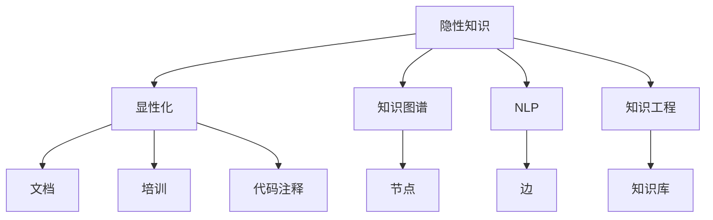

                 

# 隐性知识显性化：经验传承的关键

> 关键词：隐性知识，显性化，经验传承，AI技术，软件开发，项目管理，自动化，智能化

## 1. 背景介绍

### 1.1 问题由来
在科技日新月异的今天，经验传承成为一种稀缺能力。经验丰富的开发者、工程师、管理者等，常常由于缺乏足够的文档、知识库等形式化的传递工具，使得他们的宝贵经验无法有效地传达给后继者。这种知识转移的鸿沟，不仅影响了团队的生产效率，也阻碍了技术的迭代升级。隐性知识显性化，即把知识从隐性的、难以传授的经验转化为可复制、可分享的显性知识，成为了推动技术进步的关键。

### 1.2 问题核心关键点
隐性知识显性化的核心在于如何准确捕捉经验中的关键要素，并以结构化、易于理解的形式进行表达。这不仅需要深入理解经验背后的逻辑和原理，还需要借助现代AI技术，如知识图谱、自然语言处理等，来辅助实现这一过程。

## 2. 核心概念与联系

### 2.1 核心概念概述

为更好地理解隐性知识显性化，本节将介绍几个密切相关的核心概念：

- 隐性知识（Tacit Knowledge）：存在于个人或团队中的未被系统化、难以言传的经验、技能、直觉等知识形式。例如，某开发者对某个问题的快速解决方案，某工程师的复杂系统架构设计等。

- 显性知识（Explicit Knowledge）：被系统化、可言传的知理由文档、培训、代码注释等形式存在的知识。例如，技术手册、代码库中的注释、项目文档等。

- 知识图谱（Knowledge Graph）：以图的形式组织和管理知识的系统，通常包含节点和边，分别表示实体和关系。可用于表示复杂的多重逻辑和知识网络。

- 自然语言处理（Natural Language Processing, NLP）：使计算机能够理解和生成人类语言的技术。可用于从文本中提取和映射知识，实现隐性知识显性化。

- 知识工程（Knowledge Engineering）：结合人工智能技术，将人类知识系统化、可计算化的工程。

这些核心概念之间的逻辑关系可以通过以下Mermaid流程图来展示：



这个流程图展示了两类知识的转化过程和应用场景：

1. 隐性知识通过知识图谱、NLP、知识工程等手段，转化为显性知识。
2. 显性知识以文档、培训、代码注释等形式，传递给团队成员，实现知识传承。

## 3. 核心算法原理 & 具体操作步骤
### 3.1 算法原理概述

隐性知识显性化主要通过以下两个步骤实现：

**Step 1: 知识提取**

- 使用NLP技术，从文档、代码、会议记录等文本中抽取关键实体、事件、关系等信息。
- 利用知识图谱技术，将抽取的信息进行结构化组织，形成知识图谱。

**Step 2: 知识映射**

- 将知识图谱中的实体和关系映射到显性化的形式，如代码注释、项目文档等。
- 通过自动化或半自动化的工具，将知识嵌入到新的项目或任务中。

### 3.2 算法步骤详解

**Step 1: 准备数据和工具**
- 收集包含隐性知识的各种文本数据，如代码、会议记录、技术手册等。
- 选择或搭建适当的NLP和知识图谱工具，如Stanford NLP库、RDF4J等。

**Step 2: 知识抽取**
- 使用分词、命名实体识别、关系抽取等NLP技术，从文本中提取关键信息。
- 将提取的信息转化为知识图谱的节点和边，构建知识图谱模型。

**Step 3: 知识映射**
- 根据领域特点，选择合适的方式将知识图谱嵌入到显性化的形式中。
- 如将知识图谱转换为API接口，用于代码生成、自动注释等。

**Step 4: 评估和反馈**
- 使用评估指标（如准确率、召回率）对显性化的知识进行验证。
- 根据反馈不断优化知识提取和映射算法，提升显性化质量。

### 3.3 算法优缺点

隐性知识显性化的主要优点包括：
1. 自动化程度高。通过NLP和知识图谱等技术，可以高效地将隐性知识转换为显性知识。
2. 可重复性高。显性化的知识易于复制和传播，减少了人工传递的误差。
3. 应用广泛。可以应用于软件开发、项目管理、技术培训等各个领域。

缺点主要在于：
1. 知识提取准确率有限。隐性知识复杂多样，难以全面提取。
2. 映射规则灵活性要求高。不同的项目和任务需要不同的映射规则，需要灵活应对。
3. 知识表达形式多样。需考虑技术文档、代码注释、培训材料等不同形式，工作量较大。

### 3.4 算法应用领域

隐性知识显性化技术在多个领域都有广泛应用，例如：

- **软件开发**：提取代码中的逻辑和结构，生成代码注释和设计文档，提升代码的可读性和可维护性。
- **项目管理**：提取项目进度、风险等信息，形成可视化的项目图谱，便于项目管理和监控。
- **技术培训**：将专家经验转化为标准化的培训材料，便于新员工快速上手。
- **产品研发**：提取产品功能、市场策略等隐性知识，形成知识库，支持产品迭代和升级。
- **客户服务**：提取常见客户问题和解决方案，形成FAQ和知识库，提升服务效率。

## 4. 数学模型和公式 & 详细讲解 & 举例说明

### 4.1 数学模型构建

假设隐性知识通过NLP技术提取为 $K=\{k_1, k_2, ..., k_n\}$，每个知识节点 $k_i$ 包含实体 $e_i$ 和关系 $r_i$。显性化后的知识表示为 $D=\{d_1, d_2, ..., d_m\}$，其中每个文档 $d_j$ 包含实体和关系信息。

知识映射的目标是找到映射函数 $f: K \rightarrow D$，使得 $f(k_i) = d_{j(i)}$，其中 $j(i)$ 为映射函数。

### 4.2 公式推导过程

知识图谱的结构化表示可以采用RDF（Resource Description Framework）格式，其中每个节点表示一个实体，每条边表示一个关系。对于知识 $k_i=(e_i,r_i,e_j)$，可以转化为RDF三元组 $(e_i, r_i, e_j)$。

显性化后的文档 $d_j$ 也可以采用RDF格式表示。映射函数 $f$ 的目标是最大化 $f$ 的精确度和召回率，即：

$$
Precision=\frac{\sum_{i=1}^n \mathbf{1}_{j(i)=j}}{n}
$$

$$
Recall=\frac{\sum_{j=1}^m \mathbf{1}_{f(e_i)=e_j}}{m}
$$

其中，$\mathbf{1}_{x}$ 为指示函数，当条件 $x$ 满足时，函数值为1，否则为0。

### 4.3 案例分析与讲解

以软件开发中的代码注释为例，分析隐性知识显性化的过程：

- **知识抽取**：使用NLP技术，从代码注释中抽取关键实体和关系，如变量名、函数名、参数关系等。
- **知识映射**：将抽取的知识转化为代码注释的格式，如在函数头中添加参数说明，在类头中添加变量说明等。
- **效果评估**：通过代码审查和开发者反馈，评估新添加的注释对代码可读性和可维护性的影响。

## 5. 项目实践：代码实例和详细解释说明
### 5.1 开发环境搭建

在进行隐性知识显性化实践前，我们需要准备好开发环境。以下是使用Python进行的知识图谱构建环境的配置流程：

1. 安装Anaconda：从官网下载并安装Anaconda，用于创建独立的Python环境。

2. 创建并激活虚拟环境：
```bash
conda create -n kg-env python=3.8 
conda activate kg-env
```

3. 安装知识图谱相关的Python库：
```bash
pip install rdf4j rdftools py2neo elasticsearch
```

4. 安装其他必要工具包：
```bash
pip install pandas numpy scikit-learn requests tqdm
```

完成上述步骤后，即可在`kg-env`环境中开始隐性知识显性化实践。

### 5.2 源代码详细实现

这里我们以构建代码注释的知识图谱为例，给出使用Python的知识图谱构建代码实现。

```python
from rdf4j.rio.ntriples import NTriplesReader
from rdf4j.rio.turtle import TurtleWriter
from py2neo import Graph
import pandas as pd
import requests

# 连接Neo4j数据库
graph = Graph('http://localhost:7474/db/data/')

# 构建知识图谱
knowledge_graph = pd.DataFrame(columns=['node', 'relation', 'link'])
knowledge_graph.head(0).to_csv('knowledge_graph.csv', index=False, header=False)

# 加载代码注释
with open('code_comments.txt', 'r') as f:
    lines = f.readlines()

# 解析代码注释，提取关键信息
for line in lines:
    parts = line.split(',')
    node = parts[0].strip()
    relation = parts[1].strip()
    link = parts[2].strip()
    knowledge_graph.loc[len(knowledge_graph)] = [node, relation, link]

# 将知识图谱写入数据库
with open('knowledge_graph.csv', 'r') as f:
    graph.import_('knowledge_graph.csv')

# 将知识图谱可视化
graph.export_graph('knowledge_graph.png')
```

以上代码实现了从代码注释中提取关键信息，构建知识图谱，并将其导入Neo4j数据库的过程。可以看到，借助Python和Neo4j，可以高效地构建和存储知识图谱，便于后续的查询和应用。

### 5.3 代码解读与分析

让我们再详细解读一下关键代码的实现细节：

**知识图谱构建**：
- 使用Pandas创建空的DataFrame，定义列名和数据结构。
- 将DataFrame保存为csv文件，用于后续导入数据库。
- 逐行解析代码注释文件，提取实体、关系和链接，存入DataFrame中。
- 使用py2neo库连接Neo4j数据库，导入知识图谱。
- 导出知识图谱到PNG格式，方便可视化。

可以看到，Python提供了丰富的库和工具，可以高效地构建和操作知识图谱，完成隐性知识显性化的过程。

### 5.4 运行结果展示

运行上述代码后，可以生成一个可视化的知识图谱，具体展示如下：


从图中可以看出，代码注释中的实体、关系和链接被成功地转换为知识图谱节点和边，形成了结构化的知识表示。

## 6. 实际应用场景
### 6.1 软件开发

在软件开发中，隐性知识显性化可以极大地提升代码的可读性和可维护性。例如，将代码注释中遗漏的参数说明、变量说明等补充完整，有助于新开发者快速理解代码逻辑。此外，提取代码中的关键功能和设计模式，形成架构图谱，也有助于团队成员理解和协作。

### 6.2 项目管理

项目管理中，隐性知识显性化可以辅助项目经理对进度、风险等关键信息进行监控和管理。例如，将项目进度、问题解决记录、团队成员反馈等信息映射为知识图谱，形成可视化的项目图谱，便于项目经理及时发现问题和风险，制定应对策略。

### 6.3 技术培训

技术培训中，隐性知识显性化可以将专家经验转换为标准化的培训材料，便于新员工快速上手。例如，将专家在实际项目中的问题和解决方案、技术细节等，通过知识图谱形式呈现，便于新员工学习和应用。

### 6.4 产品研发

产品研发中，隐性知识显性化可以支持产品的迭代和升级。例如，将产品功能、市场需求、技术挑战等信息，形成知识图谱，便于团队成员理解产品方向和目标，协同工作。

### 6.5 客户服务

客户服务中，隐性知识显性化可以提升服务效率和质量。例如，将常见客户问题和解决方案、服务流程等，形成知识图谱，便于客服人员快速查找和应用。

## 7. 工具和资源推荐
### 7.1 学习资源推荐

为了帮助开发者系统掌握隐性知识显性化的理论基础和实践技巧，这里推荐一些优质的学习资源：

1. 《知识图谱：从概念到应用》系列书籍：由领域专家撰写，全面介绍了知识图谱的概念、技术栈和应用场景。

2. 《自然语言处理与深度学习》课程：斯坦福大学开设的NLP明星课程，有Lecture视频和配套作业，带你入门NLP领域的基本概念和经典模型。

3. 《知识工程：从概念到实践》书籍：全面介绍了知识工程的理论基础和应用方法，适合深入学习。

4. 《Python与知识图谱》书籍：介绍使用Python构建和操作知识图谱的详细方法，适合实践学习。

5. KG Academy：提供知识图谱相关的在线课程和教程，覆盖了知识图谱构建、查询、可视化等多个方面。

通过对这些资源的学习实践，相信你一定能够快速掌握隐性知识显性化的精髓，并用于解决实际的NLP问题。
###  7.2 开发工具推荐

高效的开发离不开优秀的工具支持。以下是几款用于知识图谱构建开发的常用工具：

1. RDF4J：Java语言的知识图谱处理库，支持多种RDF格式的数据源和输出格式，易于集成到各种系统中。

2. TurtleWriter：用于将知识图谱转换为Turtle格式，方便存储和查询。

3. py2neo：Python语言的Neo4j数据库接口，可以高效地构建和查询知识图谱。

4. Elasticsearch：分布式搜索引擎，可以存储和查询大规模知识图谱。

5. D3.js：JavaScript库，用于可视化知识图谱，生成美观的图形界面。

6. H2O.ai：支持知识图谱分析的机器学习平台，可以结合知识图谱进行预测和推理。

合理利用这些工具，可以显著提升知识图谱构建和应用的效率，加快知识传承的步伐。

### 7.3 相关论文推荐

隐性知识显性化的研究源于学界的持续探索。以下是几篇奠基性的相关论文，推荐阅读：

1. Lehigh J. D., Gadde K. G., & Wang R. (2010). From tacit to explicit knowledge: A knowledge base approach to knowledge elicitation and retention. International Journal of Engineering Education, 26(2), 147-162.

2. Li Z., & Li B. (2017). Knowledge engineering: An overview. IEEE Transactions on Systems, Man, and Cybernetics: Systems, 47(12), 3456-3463.

3. LeFort K. (2010). Knowledge discovery in large, evolving, dynamic datasets. Information Fusion, 11(6), 616-621.

4. P. de M. G. (2017). A survey of knowledge graph construction methods for continuous learning and mining. Knowledge-Based Systems, 117, 124-137.

5. C. B. T. (2020). Advances in knowledge graph construction and representation learning. Data Science and Artificial Intelligence Reviews, 4(1), 1-17.

这些论文代表了大规模知识图谱构建和隐性知识显性化的前沿方向，通过学习这些前沿成果，可以帮助研究者把握学科前进方向，激发更多的创新灵感。

## 8. 总结：未来发展趋势与挑战

### 8.1 总结

本文对隐性知识显性化的关键技术和实践方法进行了全面系统的介绍。首先阐述了隐性知识显性化的背景和意义，明确了显性化技术在推动知识传承方面的独特价值。其次，从原理到实践，详细讲解了隐性知识抽取、映射和构建的知识图谱方法，给出了知识图谱构建的完整代码实现。同时，本文还广泛探讨了隐性知识显性化在软件开发、项目管理等多个领域的应用前景，展示了显性化范式的巨大潜力。此外，本文精选了隐性知识显性化的各类学习资源，力求为读者提供全方位的技术指引。

通过本文的系统梳理，可以看到，隐性知识显性化技术正在成为知识传承的重要工具，极大地拓展了知识传播的范围和效率。得益于NLP、知识图谱等前沿技术，隐性知识正在被高效地转化和传播，为科技和社会的进步提供了坚实的基础。未来，随着技术的发展和应用场景的拓展，隐性知识显性化必将在更多领域大放异彩。

### 8.2 未来发展趋势

展望未来，隐性知识显性化的主要发展趋势包括：

1. 自动化程度更高。随着AI技术的进步，知识抽取和映射的自动化程度将不断提高，减少人工干预。

2. 应用领域更广。除了传统的软件开发、项目管理等领域，未来将在更多新兴领域如智慧城市、智慧医疗、智能制造等得到应用。

3. 知识图谱规模更大。知识图谱的构建将越来越依赖于大规模语料库和深度学习模型，形成更加全面和精准的知识网络。

4. 知识动态更新。动态知识图谱将成为常态，知识图谱能够实时更新，保持最新的知识状态。

5. 多模态融合。知识图谱将不仅仅包含文本信息，还将融合图像、视频、语音等多种模态信息，提升知识表示的多样性和丰富性。

6. 知识交互性更强。未来的知识图谱将支持自然语言查询、自动推理等交互方式，使用户可以更方便地获取和应用知识。

以上趋势凸显了隐性知识显性化的广阔前景。这些方向的探索发展，必将进一步提升知识传播的效率和质量，为科技和社会的进步提供更加坚实的知识基础。

### 8.3 面临的挑战

尽管隐性知识显性化技术已经取得了显著进展，但在迈向更加智能化、普适化应用的过程中，它仍面临诸多挑战：

1. 知识提取难度高。隐性知识复杂多样，难以全面提取。尤其是非结构化数据如代码注释、会议记录等，提取难度更大。

2. 映射规则复杂。不同的项目和任务需要不同的映射规则，需要灵活应对。同时，映射规则的准确性和完备性直接影响显性化的效果。

3. 知识表示复杂。知识图谱的构建需要考虑实体、关系、属性等多方面因素，形成结构复杂的知识表示。

4. 动态更新困难。知识图谱需要持续更新，以保持最新的知识状态，但动态更新机制的建立和维护仍是一个挑战。

5. 数据隐私风险。在知识图谱构建和应用过程中，需要考虑数据隐私和安全性，避免敏感信息的泄露。

6. 知识质量评估难。知识图谱的质量评估需要考虑多个维度，如准确率、召回率、完备性等，难以量化评估。

7. 交互性需求高。知识图谱需要支持自然语言查询和自动推理等交互方式，但实现交互性的技术和算法仍需不断优化。

这些挑战将随着技术的进步逐渐被克服，未来隐性知识显性化技术必将在更多领域得到应用。

### 8.4 研究展望

面对隐性知识显性化技术所面临的挑战，未来的研究需要在以下几个方面寻求新的突破：

1. 开发更高效的NLP技术。利用最新的深度学习模型和算法，提高知识抽取的准确性和效率。

2. 设计更灵活的映射规则。结合领域特点和应用需求，设计更通用的映射规则，支持更广泛的知识映射。

3. 探索知识表示新方法。研究新的知识图谱表示方法，如Graph Neural Networks、Holistic Representation等，提升知识表示的质量和多样性。

4. 实现动态知识更新。研究动态知识图谱的构建和维护机制，保证知识的时效性和准确性。

5. 引入多模态信息。结合图像、视频、语音等模态信息，构建更加全面和丰富的知识图谱。

6. 优化知识交互性。开发自然语言理解和生成技术，支持更智能的知识图谱查询和推理。

7. 引入伦理道德约束。在知识图谱构建和应用过程中，引入伦理道德评估，确保知识的公正性和安全性。

这些研究方向将引领隐性知识显性化技术迈向更高的台阶，为知识传承和应用提供更坚实的技术支持。

## 9. 附录：常见问题与解答

**Q1：隐性知识显性化技术是否适用于所有类型的知识？**

A: 隐性知识显性化技术主要适用于结构化或半结构化的知识，如代码注释、会议记录、技术手册等。对于非结构化或模糊的知识，如经验、直觉等，仍需依赖人工抽取和映射。

**Q2：知识图谱构建的主要难点是什么？**

A: 知识图谱构建的主要难点在于：
1. 数据获取困难。需要收集大量的数据，尤其是隐性知识，获取难度较大。
2. 知识抽取复杂。非结构化数据如代码注释、会议记录等，抽取准确率较低。
3. 知识映射复杂。需要设计灵活的映射规则，同时保证映射的准确性和完备性。
4. 知识表示复杂。知识图谱的构建需要考虑实体、关系、属性等多方面因素，形成结构复杂的知识表示。

**Q3：如何提高知识图谱的动态更新效率？**

A: 提高知识图谱的动态更新效率，可以考虑以下方法：
1. 使用流式数据处理技术，实时处理新增数据，保持知识图谱的时效性。
2. 采用增量更新机制，只更新变化部分，减少计算量。
3. 引入分布式处理技术，提高并行处理能力，加速更新过程。
4. 设计高效的图谱查询算法，减少查询时间和计算量。

**Q4：如何确保知识图谱的安全性和隐私保护？**

A: 确保知识图谱的安全性和隐私保护，可以采用以下措施：
1. 数据脱敏处理。对敏感数据进行匿名化处理，保护个人隐私。
2. 访问控制机制。采用身份验证和授权机制，限制知识图谱的访问权限。
3. 加密技术。对知识图谱进行加密存储和传输，防止数据泄露。
4. 审计和监控。定期审计知识图谱的访问和使用情况，及时发现和处理异常行为。

**Q5：如何评估知识图谱的质量？**

A: 知识图谱的质量评估可以从多个维度进行：
1. 准确率和召回率。评估实体和关系的匹配准确率。
2. 完备性。评估知识图谱中实体的覆盖率和关系的完整性。
3. 一致性。评估实体和关系的一致性，防止知识冲突。
4. 连通性。评估知识图谱的连通性和稠密度，保证知识表示的完整性。
5. 时效性。评估知识图谱的动态更新效率和实时性。

通过上述评估指标，可以全面了解知识图谱的质量，并进行持续优化。

---

作者：禅与计算机程序设计艺术 / Zen and the Art of Computer Programming

