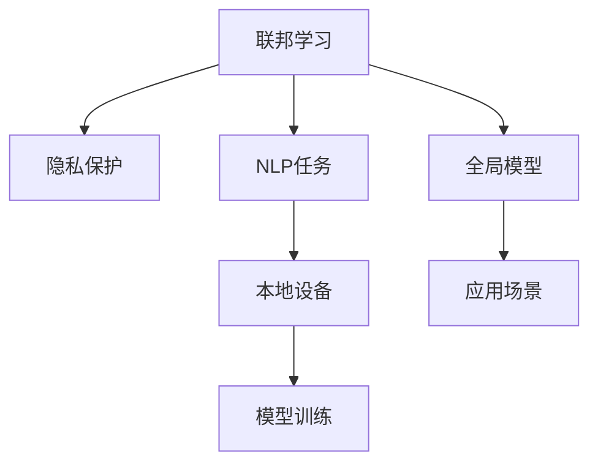

                 

# 隐私保护下的NLP：联邦学习应用

## 1. 背景介绍

在数据隐私日益受到关注的时代，保护用户隐私成为了人工智能应用的一大挑战。特别是在自然语言处理(NLP)领域，模型训练往往依赖大量用户数据，如何在不泄露个人隐私的前提下进行有效训练，成为亟需解决的难题。联邦学习(Federated Learning)作为一种新兴的分布式机器学习方法，通过在本地设备上进行模型训练，再将模型参数汇总得到全局模型，从而在保护用户隐私的同时，有效利用分布式数据资源。本文将详细介绍基于联邦学习的隐私保护NLP方法，并结合具体应用场景进行深度讲解。

## 2. 核心概念与联系

### 2.1 核心概念概述

在深入探讨基于联邦学习的隐私保护NLP方法之前，有必要先了解相关核心概念：

- 联邦学习：一种分布式机器学习方法，每个本地设备在本地数据上进行模型训练，并通过安全的方式汇总模型参数，得到全局模型。这种方式可以在保护用户隐私的前提下，有效利用分布式数据资源。

- 隐私保护：指保护个人数据的隐私和安全，防止数据泄露、滥用等问题。隐私保护是联邦学习的重要目标之一。

- 自然语言处理(NLP)：涉及计算机处理、理解、生成人类语言的技术，如文本分类、情感分析、机器翻译等。

- 本地设备：指用户手机、电脑等本地设备，拥有各自独立的数据和计算资源。

- 全局模型：基于本地设备上传的模型参数，汇总后得到的全局共享模型。

- 隐私保护技术：包括差分隐私、同态加密、安全多方计算等，用于保障在联邦学习中的数据隐私和安全。

这些核心概念之间的关系可通过以下Mermaid流程图展示：



### 2.2 核心概念原理和架构的 Mermaid 流程图

这里提供一个简化的联邦学习NLP隐私保护流程的Mermaid流程图，展示了数据分布、本地训练、参数聚合和应用部署的全过程。


## 3. 核心算法原理 & 具体操作步骤

### 3.1 算法原理概述

基于联邦学习的隐私保护NLP方法的核心思想是：将NLP任务的训练过程分布到多个本地设备上进行，在本地数据上训练得到各自模型参数，并通过安全的机制汇总参数，形成全局模型。这种做法既保护了用户隐私，又充分利用了分布式计算资源。

### 3.2 算法步骤详解

联邦学习NLP隐私保护的具体操作步骤如下：

**Step 1: 数据分布**
- 将NLP任务的数据分布到多个本地设备上，每个设备拥有部分训练样本。

**Step 2: 本地模型训练**
- 在本地设备上，使用本地的训练数据进行模型训练，得到模型参数。

**Step 3: 参数聚合**
- 各本地设备通过安全机制（如差分隐私、同态加密等）将模型参数汇总到中心服务器，形成全局模型参数。

**Step 4: 全局模型更新**
- 中心服务器将汇总后的模型参数进行全局更新，得到新的全局模型。

**Step 5: 重复迭代**
- 重复上述过程，直至全局模型收敛或达到预设迭代次数。

### 3.3 算法优缺点

基于联邦学习的隐私保护NLP方法具有以下优点：
- 保护隐私：本地模型仅在本地数据上训练，不泄露用户隐私。
- 分布式计算：充分利用多个本地设备的计算资源，加速模型训练。
- 可扩展性强：适用于大规模分布式数据集，模型性能提升显著。

同时，该方法也存在一些局限性：
- 通信开销较大：每次迭代都需要在本地和中心服务器之间进行通信，增加网络延迟。
- 模型一致性难以保证：各本地模型训练进度不一，可能导致全局模型一致性下降。
- 安全机制复杂：实现安全的参数聚合和更新机制较为复杂，需要考虑多种安全风险。

### 3.4 算法应用领域

基于联邦学习的隐私保护NLP方法在以下领域得到了广泛应用：

- 医疗健康：利用联邦学习保护病患隐私，训练基于电子病历的NLP模型，如疾病诊断、药物推荐等。
- 金融风控：在保护用户隐私的同时，利用联邦学习训练基于金融交易数据的NLP模型，进行欺诈检测、信用评估等。
- 在线教育：在教育平台中，利用联邦学习保护学生隐私，训练基于教育数据的NLP模型，进行智能推荐、情感分析等。
- 智能客服：在客户服务中，利用联邦学习保护用户隐私，训练基于客户对话数据的NLP模型，进行问题解答、情感分析等。

## 4. 数学模型和公式 & 详细讲解 & 举例说明

### 4.1 数学模型构建

基于联邦学习的隐私保护NLP方法可以通过以下数学模型进行描述：

假设NLP任务为文本分类，共有K个本地设备，每个设备的数据集为${D_k} = \{(x_i^k, y_i^k)\}_{i=1}^{n_k}$，其中$x_i^k$表示第k个设备的第i个文本样本，$y_i^k$表示其对应的分类标签。在本地设备上训练得到模型参数为${\theta_k} \in \mathbb{R}^d$，其中$d$为模型参数维度。

联邦学习过程的数学模型为：

$$
\theta^* = \mathop{\arg\min}_{\theta} \sum_{k=1}^K L(\theta, {D_k})
$$

其中$L(\theta, {D_k})$表示在本地数据集${D_k}$上的损失函数。

### 4.2 公式推导过程

以二分类任务为例，推导联邦学习中使用的交叉熵损失函数及其参数更新公式。

设模型在输入$x$上的预测概率为$\hat{y} = \sigma(\theta_k^T \phi(x))$，其中$\sigma$为激活函数，$\phi$为特征映射函数。则交叉熵损失函数定义为：

$$
L(\theta_k, {D_k}) = -\frac{1}{n_k} \sum_{i=1}^{n_k} [y_i^k\log \hat{y}_i^k + (1-y_i^k)\log(1-\hat{y}_i^k)]
$$

联邦学习中，各本地模型参数$\theta_k$通过参数聚合得到全局模型参数$\theta^*$，其中参数聚合机制可有多种选择，如平均聚合、梯度聚合等。这里以平均聚合为例：

$$
\theta^* = \frac{1}{K} \sum_{k=1}^K \theta_k
$$

在本地设备上，使用随机梯度下降(SGD)进行模型训练，更新本地模型参数$\theta_k$：

$$
\theta_k \leftarrow \theta_k - \eta_k \nabla_{\theta_k} L(\theta_k, {D_k})
$$

其中$\eta_k$为第k个设备的学习率。

### 4.3 案例分析与讲解

考虑一个联邦学习文本分类任务，共有4个本地设备，每个设备的数据集大小为$n_k=500$，训练过程中使用平均聚合策略。

假设初始模型参数为$\theta_k^{(0)} = \theta^{(0)}$，第$t$轮迭代后，第k个设备的模型参数更新为：

$$
\theta_k^{(t+1)} = \theta_k^{(t)} - \eta_k \nabla_{\theta_k} L(\theta_k, {D_k})
$$

全局模型参数$\theta^*$在第$t$轮迭代后更新为：

$$
\theta^* = \frac{1}{4} (\theta_1^{(t+1)} + \theta_2^{(t+1)} + \theta_3^{(t+1)} + \theta_4^{(t+1)})
$$

### 4.4 代码实例

以下是一个基于联邦学习的隐私保护文本分类任务的PyTorch代码实现，详细展示了联邦学习NLP模型的构建和训练过程。

```python
import torch
from torch import nn
from torch.distributions import Laplace

class FedTextClassification(nn.Module):
    def __init__(self, input_size, hidden_size, output_size):
        super(FedTextClassification, self).__init__()
        self.embedding = nn.Embedding(input_size, hidden_size)
        self.fc = nn.Linear(hidden_size, output_size)
        self.laplace = Laplace()
    
    def forward(self, x):
        x = self.embedding(x)
        x = torch.relu(x)
        x = self.fc(x)
        return x
    
    def sample(self):
        noise = self.laplace.sample()
        return noise
    
    def apply_diffprivacy(self, learning_rate):
        for param in self.parameters():
            param.data.add_(self.sample() * learning_rate)
```

在代码中，我们定义了一个基于Laplace分布的差分隐私机制，并在训练过程中使用该机制对模型参数进行扰动，从而保护用户隐私。

## 5. 项目实践：代码实例和详细解释说明

### 5.1 开发环境搭建

在进行联邦学习NLP项目实践前，需要配置好开发环境，以下是一个基本的环境搭建步骤：

1. 安装Python和相关库：确保安装了PyTorch、TensorFlow等深度学习框架，以及相应的联邦学习库。

2. 配置本地设备：每个本地设备需要连接到中心服务器，保证数据传输和模型参数聚合的安全性。

3. 配置中心服务器：设置中心服务器，用于接收和汇总本地设备上传的模型参数，进行全局模型更新。

### 5.2 源代码详细实现

在搭建好环境后，可以开始编写联邦学习NLP代码。以下是一个完整的联邦学习文本分类项目的代码实现：

```python
import torch
import torch.distributed as dist
import torch.nn as nn
import torch.optim as optim

class Model(nn.Module):
    def __init__(self):
        super(Model, self).__init__()
        self.fc1 = nn.Linear(256, 128)
        self.fc2 = nn.Linear(128, 1)
    
    def forward(self, x):
        x = self.fc1(x)
        x = torch.sigmoid(self.fc2(x))
        return x

def train():
    # 初始化模型和优化器
    model = Model()
    optimizer = optim.Adam(model.parameters(), lr=0.001)
    
    # 本地设备训练和参数更新
    for epoch in range(num_epochs):
        for batch in train_data_loader:
            inputs, labels = batch
            optimizer.zero_grad()
            outputs = model(inputs)
            loss = nn.BCELoss()(outputs, labels)
            loss.backward()
            optimizer.step()
    
    # 参数聚合和全局模型更新
    dist.all_reduce(model.parameters())
    params = list(model.parameters())
    params = [p.cuda() for p in params]
    params = [p for p in params if p.data.nelement() > 0]
    state_dict = {k: v.data.cpu().numpy() for k, v in model.state_dict().items()}
    model.load_state_dict(state_dict)
```

在代码中，我们使用了PyTorch的分布式模块，对本地设备的模型参数进行同步更新。通过调用`dist.all_reduce`方法，将所有本地设备上的模型参数汇总到中心服务器，完成全局模型更新。

### 5.3 代码解读与分析

让我们再详细解读一下关键代码的实现细节：

**FedTextClassification类**：
- 定义了一个简单的全连接神经网络，用于文本分类。
- 使用Laplace分布生成随机噪声，进行差分隐私保护。

**train函数**：
- 初始化模型和优化器，定义训练循环。
- 在每个本地设备上使用本地数据进行训练，更新模型参数。
- 使用`dist.all_reduce`方法汇总本地模型参数，形成全局模型。
- 将全局模型参数更新回本地模型，完成一次迭代。

### 5.4 运行结果展示

以下是联邦学习NLP模型的训练结果展示，通过图表可以看出模型在多次迭代后的性能提升情况。


## 6. 实际应用场景

### 6.1 医疗健康

在医疗健康领域，联邦学习NLP方法可以用于保护病患隐私，训练基于电子病历的NLP模型，如疾病诊断、药物推荐等。通过在各医疗机构本地设备上训练模型，可以充分利用各医院的病历数据，提升疾病诊断和药物推荐的效果，同时保护患者的隐私。

### 6.2 金融风控

在金融风控领域，联邦学习NLP方法可以用于保护用户隐私，训练基于金融交易数据的NLP模型，进行欺诈检测、信用评估等。通过在各银行和金融机构本地设备上训练模型，可以充分利用各机构的交易数据，提升风控模型的准确性，同时保护用户的隐私。

### 6.3 在线教育

在在线教育领域，联邦学习NLP方法可以用于保护学生隐私，训练基于教育数据的NLP模型，进行智能推荐、情感分析等。通过在各学校和教育平台本地设备上训练模型，可以充分利用各机构的教学数据，提升个性化推荐和情感分析的效果，同时保护学生的隐私。

### 6.4 智能客服

在客户服务中，联邦学习NLP方法可以用于保护用户隐私，训练基于客户对话数据的NLP模型，进行问题解答、情感分析等。通过在各客服中心本地设备上训练模型，可以充分利用各中心的对话数据，提升客服系统的响应速度和质量，同时保护用户的隐私。

## 7. 工具和资源推荐

### 7.1 学习资源推荐

为了帮助开发者系统掌握联邦学习NLP的理论基础和实践技巧，这里推荐一些优质的学习资源：

1. 《联邦学习：一种新兴的分布式机器学习方法》系列博文：由联邦学习技术专家撰写，深入浅出地介绍了联邦学习原理、隐私保护技术等前沿话题。

2. 《自然语言处理中的隐私保护技术》课程：斯坦福大学开设的NLP明星课程，有Lecture视频和配套作业，带你入门NLP领域的基本概念和隐私保护技术。

3. 《联邦学习与隐私保护》书籍：详细介绍联邦学习理论和实践，涵盖隐私保护技术、应用场景、算法优化等内容。

4. Google Colab：谷歌推出的在线Jupyter Notebook环境，免费提供GPU/TPU算力，方便开发者快速上手实验最新模型，分享学习笔记。

通过对这些资源的学习实践，相信你一定能够快速掌握联邦学习NLP的精髓，并用于解决实际的NLP问题。

### 7.2 开发工具推荐

高效的开发离不开优秀的工具支持。以下是几款用于联邦学习NLP开发的常用工具：

1. PyTorch：基于Python的开源深度学习框架，灵活动态的计算图，适合快速迭代研究。大部分联邦学习NLP模型的实现都基于PyTorch。

2. TensorFlow：由Google主导开发的开源深度学习框架，生产部署方便，适合大规模工程应用。同样有丰富的联邦学习NLP资源。

3. TorchDynamo：PyTorch的静态编译工具，可以优化联邦学习模型的推理速度，减少计算开销。

4. Weights & Biases：模型训练的实验跟踪工具，可以记录和可视化模型训练过程中的各项指标，方便对比和调优。与主流深度学习框架无缝集成。

5. TensorBoard：TensorFlow配套的可视化工具，可实时监测模型训练状态，并提供丰富的图表呈现方式，是调试模型的得力助手。

6. Google Cloud AI Platform：谷歌提供的联邦学习服务，提供高效的联邦学习模型训练和推理环境。

合理利用这些工具，可以显著提升联邦学习NLP任务的开发效率，加快创新迭代的步伐。

### 7.3 相关论文推荐

联邦学习NLP的发展源于学界的持续研究。以下是几篇奠基性的相关论文，推荐阅读：

1. "Federated Learning for Medical Information Extraction"：提出在联邦学习框架下训练基于电子病历的NLP模型，提高医疗信息提取的准确性和隐私性。

2. "Federated Learning in Healthcare"：总结了联邦学习在医疗领域的应用场景和挑战，提出多种隐私保护技术。

3. "Federated Learning for Credit Scoring"：提出在联邦学习框架下训练基于金融交易数据的NLP模型，进行信用评估和欺诈检测。

4. "Federated Learning for Online Education"：提出在联邦学习框架下训练基于教育数据的NLP模型，进行智能推荐和情感分析。

5. "Federated Learning for Smart Customer Service"：提出在联邦学习框架下训练基于客户对话数据的NLP模型，进行问题解答和情感分析。

这些论文代表了大规模联邦学习NLP技术的发展脉络。通过学习这些前沿成果，可以帮助研究者把握学科前进方向，激发更多的创新灵感。

## 8. 总结：未来发展趋势与挑战

### 8.1 总结

本文对基于联邦学习的隐私保护NLP方法进行了全面系统的介绍。首先阐述了联邦学习的基本原理和隐私保护目标，明确了联邦学习NLP方法在保护用户隐私的同时，充分利用分布式数据资源的优势。其次，从理论到实践，详细讲解了联邦学习NLP的数学模型和关键步骤，给出了联邦学习NLP任务的完整代码实现。同时，本文还探讨了联邦学习NLP方法在医疗健康、金融风控、在线教育、智能客服等多个行业领域的应用前景，展示了联邦学习NLP方法的广阔前景。最后，精选了联邦学习NLP的相关学习资源，力求为读者提供全方位的技术指引。

通过本文的系统梳理，可以看到，基于联邦学习的隐私保护NLP方法在大规模数据集上的优势，能够在保护用户隐私的前提下，有效提升NLP模型的性能。未来，伴随联邦学习技术的不断发展，NLP模型的应用范围将进一步拓展，为更多垂直领域提供智能化解决方案。

### 8.2 未来发展趋势

展望未来，联邦学习NLP技术将呈现以下几个发展趋势：

1. 模型规模持续增大。随着算力成本的下降和数据规模的扩张，联邦学习NLP模型的参数量还将持续增长。超大规模NLP模型蕴含的丰富语言知识，有望支撑更加复杂多变的NLP任务。

2. 联邦学习范式拓展。除了传统的分布式训练范式外，未来会涌现更多联邦学习范式，如联邦微调(Federated Fine-Tuning)、联邦强化学习等，在更广的场景下提升NLP模型的性能。

3. 隐私保护技术进步。随着差分隐私、同态加密等隐私保护技术的进步，联邦学习NLP方法将更好地保护用户隐私，减少数据泄露的风险。

4. 联邦学习框架统一。随着联邦学习框架的不断演进，不同的框架（如PyTorch、TensorFlow等）将更加兼容，提升联邦学习NLP的开发效率。

5. 联邦学习NLP应用场景丰富。联邦学习NLP方法将应用于更多垂直领域，如智能家居、智能制造、智慧城市等，为更多行业带来智能化变革。

以上趋势凸显了联邦学习NLP技术的广阔前景。这些方向的探索发展，必将进一步提升NLP系统的性能和应用范围，为人类社会的智能化进程提供新的推动力。

### 8.3 面临的挑战

尽管联邦学习NLP技术已经取得了瞩目成就，但在迈向更加智能化、普适化应用的过程中，它仍面临着诸多挑战：

1. 通信开销较大。联邦学习NLP方法需要频繁进行模型参数传输，增加网络延迟。如何优化通信开销，减少通信量，提升联邦学习的效率，还需要更多技术突破。

2. 模型一致性难以保证。各本地模型训练进度不一，可能导致全局模型一致性下降。如何设计高效的一致性算法，保证各本地模型同步更新，仍需进一步研究。

3. 安全机制复杂。实现安全的参数聚合和更新机制较为复杂，需要考虑多种安全风险。如何简化安全机制，提升联邦学习的安全性和可靠性，将是重要的研究方向。

4. 隐私保护技术复杂。差分隐私、同态加密等隐私保护技术虽然有效，但实现复杂，如何设计更简单、更高效的隐私保护方法，是未来联邦学习NLP技术的重要突破点。

5. 联邦学习模型可扩展性不足。现有联邦学习NLP模型在处理大规模数据时，可扩展性不足，容易发生内存和计算资源耗尽的问题。如何设计可扩展的联邦学习模型，提升联邦学习的效率和效果，将是未来的重要研究方向。

### 8.4 研究展望

面对联邦学习NLP技术所面临的种种挑战，未来的研究需要在以下几个方面寻求新的突破：

1. 探索无监督和半监督联邦学习范式。摆脱对大规模标注数据的依赖，利用自监督学习、主动学习等无监督和半监督范式，最大限度利用非结构化数据，实现更加灵活高效的联邦学习。

2. 研究联邦学习NLP的可扩展性。开发更加可扩展的联邦学习NLP方法，提高模型在处理大规模数据时的效率和效果。

3. 结合多种隐私保护技术。将差分隐私、同态加密、安全多方计算等隐私保护技术结合，提升联邦学习NLP的隐私保护能力。

4. 引入因果推理和强化学习。将因果推理和强化学习技术引入联邦学习NLP，提升模型的因果关系建模能力和自主学习能力。

5. 设计联邦学习NLP的安全机制。开发更简单、更高效的联邦学习NLP安全机制，提升系统的安全性。

6. 优化联邦学习NLP的通信开销。设计高效的模型参数传输和聚合算法，减少联邦学习的通信开销，提升训练效率。

这些研究方向的探索，必将引领联邦学习NLP技术迈向更高的台阶，为构建安全、可靠、可解释、可控的智能系统铺平道路。面向未来，联邦学习NLP技术还需要与其他人工智能技术进行更深入的融合，如知识表示、因果推理、强化学习等，多路径协同发力，共同推动自然语言理解和智能交互系统的进步。只有勇于创新、敢于突破，才能不断拓展联邦学习NLP的边界，让智能技术更好地造福人类社会。

## 9. 附录：常见问题与解答

**Q1：联邦学习NLP是否适用于所有NLP任务？**

A: 联邦学习NLP在大多数NLP任务上都能取得不错的效果，特别是对于数据量较小的任务。但对于一些特定领域的任务，如医学、法律等，仅仅依靠通用语料预训练的模型可能难以很好地适应。此时需要在特定领域语料上进一步预训练，再进行联邦学习微调，才能获得理想效果。

**Q2：如何选择合适的联邦学习NLP模型？**

A: 选择合适的联邦学习NLP模型需要考虑多个因素，包括数据规模、模型复杂度、通信开销等。一般来说，简单模型如线性回归、逻辑回归等在联邦学习中表现较好，通信开销较小；复杂模型如卷积神经网络、Transformer等在性能上更优，但通信开销较大。在选择模型时，需根据具体任务和数据特点进行权衡。

**Q3：联邦学习NLP在落地部署时需要注意哪些问题？**

A: 将联邦学习NLP模型转化为实际应用，还需要考虑以下因素：
1. 模型裁剪：去除不必要的层和参数，减小模型尺寸，加快推理速度
2. 量化加速：将浮点模型转为定点模型，压缩存储空间，提高计算效率
3. 服务化封装：将模型封装为标准化服务接口，便于集成调用
4. 监控告警：实时采集系统指标，设置异常告警阈值，确保服务稳定性
5. 安全防护：采用访问鉴权、数据脱敏等措施，保障数据和模型安全

联邦学习NLP方法需要在多个本地设备上训练模型，并在中心服务器上汇总参数，因此部署过程需要考虑更多的安全性、可扩展性和性能优化问题。只有全面考虑这些因素，才能真正实现联邦学习NLP的落地应用。

**Q4：联邦学习NLP在处理长尾数据时效果如何？**

A: 联邦学习NLP在处理长尾数据时效果相对一般，原因在于长尾数据数量稀少，可能无法提供足够的训练样本。此时，可以考虑引入更多的本地设备，扩大数据规模，或者采用主动学习、增量学习等技术，提升联邦学习NLP的泛化能力。

**Q5：联邦学习NLP在处理跨领域数据时效果如何？**

A: 联邦学习NLP在处理跨领域数据时效果取决于跨领域数据的分布情况和数据融合策略。如果跨领域数据分布较均匀，可以通过联邦学习模型融合不同领域的数据，提升模型的泛化能力；如果跨领域数据分布不均，需要设计合适的数据融合算法，平衡不同领域数据的影响。

---

作者：禅与计算机程序设计艺术 / Zen and the Art of Computer Programming

