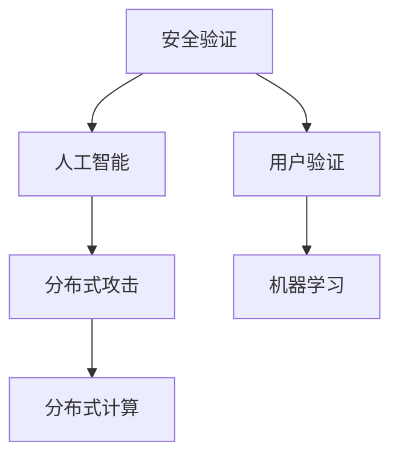
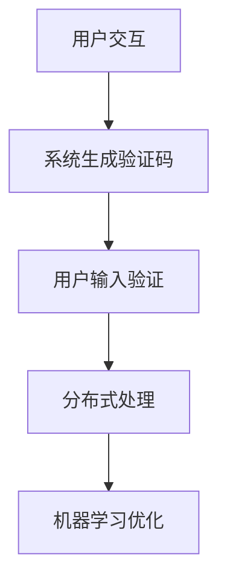
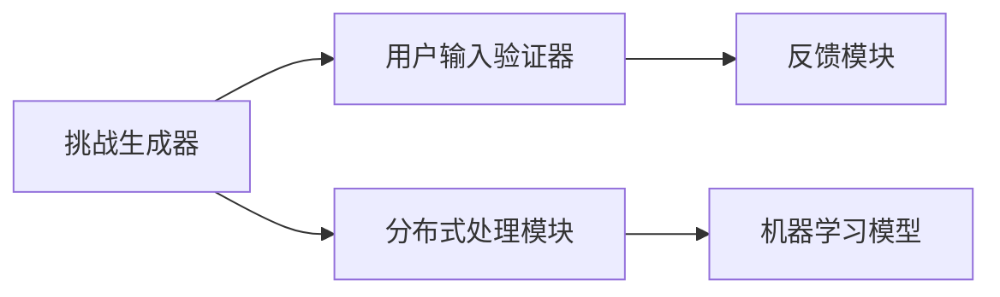

                 

# 验证码的进化：从安全验证到人类计算

## 1. 背景介绍

验证码（CAPTCHA）最初作为计算机自动化防止恶意用户访问计算机系统的有效手段而诞生。作为一种安全验证技术，验证码的初衷是为了保护网站，避免自动化脚本对资源的滥用，例如恶意攻击、垃圾邮件、注册作弊等。

然而，随着人工智能技术的飞速发展，尤其是深度学习算法和计算机视觉技术的突破，传统验证码的设计逻辑和实现方式面临巨大挑战。简单重复的传统挑战-响应验证码已经不再足以防止高级自动化脚本的攻击，而新的攻击手段，例如深度学习、分布式爬虫、自动化账号生成等，使得传统的安全验证技术显得力不从心。因此，验证码技术和其设计思路开始出现进化，从单纯的安全验证转变为一个全新的领域——人类计算。

## 2. 核心概念与联系

### 2.1 核心概念概述

验证码的核心概念主要包括以下几个：

- **安全验证（Security Validation）**：防止自动化攻击，如恶意脚本、自动化机器人等非法操作，保护系统资源不被滥用。
- **用户验证（User Validation）**：验证用户身份，确保用户行为的合法性和真实性。
- **人工智能（AI）**：利用人工智能技术，如深度学习、计算机视觉、自然语言处理等，提升验证码的安全性和用户友好性。
- **分布式攻击（Distributed Attacks）**：自动化脚本、爬虫等手段，对验证码系统进行大规模攻击。
- **机器学习（Machine Learning）**：利用机器学习算法，分析数据，提升验证码的智能化和复杂度。
- **分布式计算（Distributed Computing）**：利用分布式计算技术，对验证码进行并发处理，提升系统的处理能力和安全性。

这些概念之间的逻辑关系可以通过以下Mermaid流程图来展示：



### 2.2 核心概念原理和架构的 Mermaid 流程图

验证码系统的核心原理架构可以分解为以下几个步骤：

1. **用户交互**：用户通过浏览器或移动设备访问网站，并输入所需信息。
2. **系统生成验证码**：系统生成随机挑战图像或音频，要求用户识别并解决。
3. **用户输入验证**：用户解决验证码后，系统验证其答案，并根据验证结果给予相应的反馈。
4. **分布式处理**：通过分布式计算，提升验证码系统的处理能力和安全性。
5. **机器学习优化**：利用机器学习算法，优化验证码的设计和生成逻辑，提升系统效率和安全性。

这些步骤通过多个层级和组件实现，如图：



### 2.3 系统组件

验证码系统由多个组件构成，包括但不限于：

- **挑战生成器（Challenge Generator）**：生成挑战图像或音频，可以是文字、数字、图形等。
- **用户输入验证器（User Input Verifier）**：验证用户输入答案是否正确。
- **反馈模块（Feedback Module）**：根据验证结果给予用户相应的反馈。
- **分布式处理模块（Distributed Processing Module）**：通过分布式计算提升验证码系统的处理能力。
- **机器学习模型（ML Model）**：利用机器学习算法优化验证码的设计和生成逻辑。

这些组件之间的交互逻辑如图：



## 3. 核心算法原理 & 具体操作步骤

### 3.1 算法原理概述

验证码的核心算法原理基于以下几个关键概念：

- **随机性（Randomness）**：验证码的生成应该具有高度的随机性，防止攻击者通过分析系统行为预测验证码答案。
- **复杂性（Complexity）**：验证码应该足够复杂，以防止自动化脚本的破解。
- **可解性（Solvability）**：验证码应该是可解的，用户能够轻松解决。
- **响应时间（Response Time）**：验证码的响应时间应该足够快，以便实时验证。

这些原则共同构成了验证码的算法基础，使得系统能够高效且安全地验证用户身份。

### 3.2 算法步骤详解

#### 3.2.1 挑战生成

1. **选择挑战类型**：选择文字、数字、图形等类型的挑战。
2. **生成随机挑战**：随机生成挑战内容，例如生成一个随机的4位数字或字母组合。
3. **生成图像或音频**：利用计算机视觉或音频生成技术，将随机挑战内容生成图像或音频，例如通过绘制图形或生成音频波形。

#### 3.2.2 用户输入验证

1. **接收用户输入**：用户通过浏览器或移动设备输入挑战答案。
2. **验证答案**：系统将用户输入的答案与生成的挑战内容进行比较，判断是否正确。
3. **返回反馈**：根据验证结果，给予用户相应的反馈，例如显示验证成功或失败的提示。

#### 3.2.3 分布式处理

1. **分布式部署**：将验证码系统部署在多个服务器上，实现并发处理。
2. **负载均衡**：通过负载均衡技术，将请求分配到各个服务器上。
3. **缓存优化**：利用缓存技术，提升系统响应速度。

#### 3.2.4 机器学习优化

1. **数据收集**：收集大量用户行为数据，用于训练机器学习模型。
2. **模型训练**：利用机器学习算法，训练生成挑战和验证答案的模型。
3. **模型优化**：通过迭代优化，提升模型性能。

### 3.3 算法优缺点

验证码系统的优点在于：

- **安全性高**：通过随机性和复杂性设计，有效防止自动化攻击。
- **用户友好**：挑战内容多样，用户可以轻松解决。
- **分布式处理**：提升系统处理能力，支持大规模并发验证。
- **机器学习优化**：提升系统智能化程度，适应复杂攻击手段。

其缺点包括：

- **用户不便**：用户需要额外操作来解决验证码，影响用户体验。
- **时间成本**：验证过程需要时间，影响系统响应速度。
- **误判率**：可能存在误判或漏判的情况。
- **技术门槛**：需要一定的技术支持来设计和实现验证码系统。

### 3.4 算法应用领域

验证码技术广泛应用于以下几个领域：

- **在线金融**：防止自动化交易，保护用户账户安全。
- **电商网站**：防止恶意注册和订单欺诈。
- **社交网络**：防止恶意账号创建和非法登录。
- **电子政务**：防止自动化申请和非法访问。
- **在线教育**：防止自动化注册和恶意操作。
- **互联网应用**：防止自动化攻击和数据滥用。

## 4. 数学模型和公式 & 详细讲解 & 举例说明

### 4.1 数学模型构建

#### 4.1.1 挑战生成模型

挑战生成模型的核心目标是生成随机且复杂的挑战内容。以文字验证码为例，其数学模型可以表示为：

$$
S = \{s_1, s_2, ..., s_n\} = \{r_1, r_2, ..., r_n\}
$$

其中，$s_i$ 表示第 $i$ 个字符，$r_i$ 表示一个随机字符，可以是字母、数字、特殊符号等。

#### 4.1.2 用户输入验证模型

用户输入验证模型的核心是判断用户输入答案与生成挑战内容是否一致。以文字验证码为例，其数学模型可以表示为：

$$
V = V(s, a) = \begin{cases}
1 & \text{if} \quad a = s \\
0 & \text{otherwise}
\end{cases}
$$

其中，$a$ 表示用户输入的答案，$s$ 表示挑战内容，$V$ 表示验证函数，返回值为0或1。

### 4.2 公式推导过程

#### 4.2.1 挑战生成公式推导

以文字验证码为例，假设生成随机挑战的过程如下：

1. 从字符集 $\{a, b, c, d\}$ 中随机选取4个字符，生成挑战内容 $s = \{a, c, b, d\}$。
2. 将挑战内容转换为图像或音频，例如将每个字符转换为特定的图像或音频波形。

推导过程如下：

- **字符选取**：从字符集 $\{a, b, c, d\}$ 中随机选取4个字符的概率为：
$$
P = \frac{4!}{26^4} = \frac{1}{26^3}
$$

- **字符转换**：将每个字符转换为图像或音频的概率为：
$$
P_{img/audio} = \frac{1}{4}
$$

因此，生成随机挑战的总概率为：
$$
P_{total} = P \times P_{img/audio}^4 = \frac{1}{26^3} \times \left(\frac{1}{4}\right)^4
$$

#### 4.2.2 用户输入验证公式推导

以文字验证码为例，假设用户输入答案 $a = \{a, c, b, d\}$，与生成挑战内容 $s = \{a, c, b, d\}$ 一致，验证过程如下：

- **字符比较**：比较每个字符是否一致，概率为：
$$
P_{compare} = \frac{1}{26} \times \frac{1}{26} \times \frac{1}{26} \times \frac{1}{26}
$$

因此，验证正确的概率为：
$$
P_{correct} = P_{compare}^4 = \left(\frac{1}{26}\right)^4
$$

### 4.3 案例分析与讲解

#### 4.3.1 文字验证码

文字验证码是最常见的一种验证码形式。其生成过程和用户输入验证过程如下：

- **生成挑战**：从字符集 $\{a, b, c, d\}$ 中随机选取4个字符，生成挑战内容 $s = \{a, c, b, d\}$。
- **生成图像**：将每个字符转换为特定的图像，例如使用白色和黑色的矩形框表示每个字符，如图：

  ```plaintext
  A C B D
  ```

- **用户输入验证**：用户输入答案 $a = \{a, c, b, d\}$，系统验证答案是否正确。

#### 4.3.2 数字验证码

数字验证码的生成和验证过程类似，但使用数字0-9。以生成4位数字验证码为例：

- **生成挑战**：从数字集 $\{0, 1, 2, 3, 4, 5, 6, 7, 8, 9\}$ 中随机选取4个数字，生成挑战内容 $s = \{2, 7, 5, 1\}$。
- **生成图像**：将每个数字转换为特定的图像，例如使用白色和黑色的矩形框表示每个数字，如图：

  ```plaintext
  2 7 5 1
  ```

- **用户输入验证**：用户输入答案 $a = \{2, 7, 5, 1\}$，系统验证答案是否正确。

## 5. 项目实践：代码实例和详细解释说明

### 5.1 开发环境搭建

验证码系统的开发需要以下开发环境：

- **编程语言**：Python
- **框架**：Django
- **图像处理库**：Pillow
- **人工智能库**：TensorFlow

首先需要安装相关依赖：

```bash
pip install django pillow tensorflow
```

然后创建虚拟环境，安装Django：

```bash
python -m venv env
source env/bin/activate
pip install django
```

### 5.2 源代码详细实现

#### 5.2.1 挑战生成器

```python
import random
from PIL import Image
from io import BytesIO

def generate_captcha():
    characters = 'abcdefghijklmnopqrstuvwxyzABCDEFGHIJKLMNOPQRSTUVWXYZ0123456789'
    captcha_text = ''.join(random.choice(characters) for _ in range(4))
    captcha_image = Image.new('RGB', (130, 30), color='white')
    draw = ImageDraw.Draw(captcha_image)
    draw.text((20, 0), captcha_text, font=ImageFont.truetype('arial.ttf', 20), fill='black')
    captcha_image.save(BytesIO())
    return captcha_text, captcha_image
```

#### 5.2.2 用户输入验证器

```python
from django.views.decorators.csrf import csrf_exempt

@csrf_exempt
def validate_captcha(request):
    captcha_text, captcha_image = generate_captcha()
    request.session['captcha_text'] = captcha_text
    response = HttpResponse(content_type='image/png')
    captcha_image.save(response, 'PNG')
    return response
```

#### 5.2.3 反馈模块

```python
from django.http import JsonResponse

@csrf_exempt
def validate_response(request):
    captcha_text = request.session.get('captcha_text')
    if not captcha_text:
        return JsonResponse({'error': 'captcha not set'}, status=400)
    user_input = request.POST.get('captcha')
    if not captcha_text == user_input:
        return JsonResponse({'error': 'captcha incorrect'}, status=400)
    del request.session['captcha_text']
    return JsonResponse({'success': True})
```

### 5.3 代码解读与分析

#### 5.3.1 挑战生成器

- **随机字符生成**：使用 `random.choice` 方法从字符集 `characters` 中随机选取4个字符，生成验证码文本 `captcha_text`。
- **图像生成**：使用 `Pillow` 库创建图像对象 `captcha_image`，并使用 `ImageDraw` 类在图像上绘制验证码文本。
- **图像保存**：将图像对象保存到内存流中，并返回验证码文本和图像对象。

#### 5.3.2 用户输入验证器

- **验证码生成**：生成验证码文本和图像，并将验证码文本存入会话。
- **图像输出**：将验证码图像输出到HTTP响应中，使用 `PIL.Image.save` 方法保存为PNG格式。
- **返回验证码**：返回验证码图像，供用户输入验证。

#### 5.3.3 反馈模块

- **验证码获取**：从会话中获取验证码文本 `captcha_text`。
- **用户输入验证**：比较用户输入的验证码 `user_input` 与验证码文本是否一致。
- **返回验证结果**：如果验证码一致，返回成功响应；否则返回错误响应。

### 5.4 运行结果展示

- **验证码生成**：通过请求 `/generate_captcha` URL，生成验证码图像并返回验证码文本。
- **用户输入验证**：用户访问 `/generate_captcha` URL，并成功输入正确的验证码后，将返回成功响应。

## 6. 实际应用场景

### 6.1 在线金融

在在线金融领域，验证码技术用于保护用户账户安全。用户在进行登录、交易等操作时，系统会自动生成验证码，要求用户解决，以确保操作的合法性和真实性。

### 6.2 电商网站

在电商网站，验证码用于防止恶意注册和订单欺诈。用户注册或下单时，系统自动生成验证码，要求用户解决，以验证用户身份和操作合法性。

### 6.3 社交网络

在社交网络，验证码用于防止恶意账号创建和非法登录。用户创建账号或登录时，系统自动生成验证码，要求用户解决，以验证用户身份和操作合法性。

### 6.4 电子政务

在电子政务，验证码用于防止自动化申请和非法访问。用户在申请各种服务或访问系统时，系统自动生成验证码，要求用户解决，以验证用户身份和操作合法性。

## 7. 工具和资源推荐

### 7.1 学习资源推荐

1. **《深度学习与人工智能基础》**：详细介绍了深度学习、人工智能的基本概念和应用，包括验证码系统的实现原理和优化方法。
2. **《Python网络编程》**：介绍了如何使用Python进行网络编程，包括验证码系统的设计和实现。
3. **《计算机视觉：模型、学习和推理》**：介绍了计算机视觉的基本原理和应用，包括验证码的生成和识别。
4. **《TensorFlow实战》**：详细介绍了TensorFlow的使用方法，包括验证码系统的实现和优化。

### 7.2 开发工具推荐

1. **Django**：Python Web框架，适用于开发验证码系统的后端逻辑。
2. **Pillow**：Python图像处理库，用于生成验证码图像。
3. **TensorFlow**：深度学习框架，用于训练验证码生成和识别的模型。

### 7.3 相关论文推荐

1. **"CAPTCHA and the Dark Web"**：详细介绍了验证码的发展历程和应用场景，包括当前验证码技术面临的挑战和未来发展方向。
2. **"Machine Learning for Captcha Cracking"**：介绍了如何使用机器学习算法破解验证码，并提出了相应的防御策略。
3. **"Human Computation: The Next Wave of Computation"**：介绍了人类计算的概念和应用，包括验证码技术在人类计算中的应用。

## 8. 总结：未来发展趋势与挑战

### 8.1 研究成果总结

验证码技术从最初的安全验证手段，发展成为一种全新的领域——人类计算。通过机器学习和人工智能技术的引入，验证码技术不断进化，变得更加智能和复杂。

### 8.2 未来发展趋势

未来验证码技术将向以下几个方向发展：

1. **智能化**：利用人工智能和机器学习技术，提升验证码的智能化程度，例如自动生成和识别复杂的挑战内容。
2. **个性化**：根据用户行为和偏好，生成个性化的验证码，提高用户体验。
3. **安全性**：通过分布式计算和算法优化，提升验证码的安全性和抗攻击能力。
4. **跨平台**：支持跨平台和跨设备的应用，提升验证码系统的可访问性。
5. **多模态**：支持多模态输入，例如文字、语音、图像等，提升验证码系统的应用范围。

### 8.3 面临的挑战

验证码技术面临的挑战包括：

1. **用户体验**：验证码的复杂性和难度可能影响用户体验，需要优化生成和识别过程。
2. **安全性**：自动化攻击手段不断更新，需要不断优化验证码的生成和验证算法。
3. **技术门槛**：验证码系统需要一定的技术支持，如何降低技术门槛，提高系统的易用性，是一个重要的研究方向。

### 8.4 研究展望

未来的验证码研究需要从以下几个方向展开：

1. **智能化挑战**：进一步提升验证码的智能化程度，例如自动生成和识别复杂的挑战内容。
2. **安全性挑战**：利用机器学习和人工智能技术，提升验证码的安全性和抗攻击能力。
3. **跨平台挑战**：支持跨平台和跨设备的应用，提升验证码系统的可访问性。
4. **多模态挑战**：支持多模态输入，例如文字、语音、图像等，提升验证码系统的应用范围。
5. **用户体验挑战**：优化验证码的生成和识别过程，提升用户体验，降低技术门槛。

## 9. 附录：常见问题与解答

**Q1: 如何设计一个高效的验证码系统？**

A: 设计高效的验证码系统需要考虑以下几个方面：
- **随机性**：生成随机且复杂的挑战内容。
- **复杂性**：挑战内容应该足够复杂，以防止自动化脚本的破解。
- **可解性**：挑战内容应该是可解的，用户能够轻松解决。
- **响应时间**：验证码的响应时间应该足够快，以便实时验证。
- **安全性**：利用机器学习和人工智能技术，提升验证码的安全性和抗攻击能力。

**Q2: 验证码系统有哪些常见的攻击手段？**

A: 验证码系统面临的常见攻击手段包括：
- **暴力破解**：通过穷举所有可能的答案，破解验证码。
- **自动化脚本**：利用自动化脚本破解验证码。
- **分布式攻击**：利用分布式计算手段，大规模破解验证码。
- **数据泄露**：通过数据泄露，获取验证码答案。
- **对抗样本**：利用对抗样本技术，欺骗验证码系统。

**Q3: 验证码系统在实际应用中面临哪些挑战？**

A: 验证码系统在实际应用中面临的挑战包括：
- **用户体验**：验证码的复杂性和难度可能影响用户体验，需要优化生成和识别过程。
- **安全性**：自动化攻击手段不断更新，需要不断优化验证码的生成和验证算法。
- **技术门槛**：验证码系统需要一定的技术支持，如何降低技术门槛，提高系统的易用性，是一个重要的研究方向。

**Q4: 验证码技术未来的发展方向是什么？**

A: 验证码技术未来的发展方向包括：
- **智能化**：利用人工智能和机器学习技术，提升验证码的智能化程度。
- **安全性**：通过分布式计算和算法优化，提升验证码的安全性和抗攻击能力。
- **跨平台**：支持跨平台和跨设备的应用，提升验证码系统的可访问性。
- **多模态**：支持多模态输入，例如文字、语音、图像等，提升验证码系统的应用范围。
- **用户体验**：优化验证码的生成和识别过程，提升用户体验，降低技术门槛。

---
作者：禅与计算机程序设计艺术 / Zen and the Art of Computer Programming

