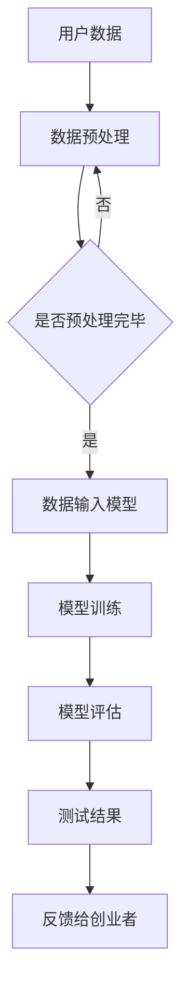

                 

### 1. 背景介绍

在当今这个信息爆炸的时代，人工智能（AI）技术的迅猛发展，尤其是大型预训练模型（Large-scale Pre-trained Models，简称LPMs）的问世，为各行各业带来了前所未有的变革。对于创业者来说，如何快速、高效地进行产品测试，以便在激烈的市场竞争中脱颖而出，成为了一个亟待解决的问题。传统的测试方法往往需要大量的人力和时间，而且测试结果的准确性和可靠性也难以保证。

AI大模型的出现，为创业产品的测试提供了新的思路和手段。这些模型具有强大的数据处理能力和自学习能力，能够对海量的用户数据进行深入分析，从而帮助创业者更好地了解用户需求，优化产品设计，提升用户体验。本文将深入探讨AI大模型在创业产品测试中的应用，分析其优势和应用场景，并提出一些实用的建议和案例。

### 2. 核心概念与联系

#### 2.1 AI大模型的定义与分类

AI大模型，即大型预训练模型，是指通过深度学习技术，对海量数据集进行预训练，从而获得强大的特征提取和表示能力的模型。根据训练数据的规模和应用场景，AI大模型可以分为以下几类：

1. **通用预训练模型**：这类模型基于大规模通用语料库进行训练，如GPT、BERT等，具有广泛的语言理解能力。
2. **垂直领域预训练模型**：这类模型针对特定领域进行训练，如医疗、金融、法律等，具有更强的领域知识。
3. **多模态预训练模型**：这类模型能够处理多种类型的数据，如图文、语音、视频等，如ViT、BLIP等。

#### 2.2 AI大模型在产品测试中的应用原理

AI大模型在产品测试中的应用，主要是基于其强大的数据处理和分析能力。具体来说，有以下几点：

1. **用户行为分析**：通过分析用户在产品中的行为数据，如点击、浏览、评论等，AI大模型可以了解用户的偏好和需求，从而为产品优化提供依据。
2. **质量评估**：AI大模型可以自动评估产品的质量，如性能、稳定性、可用性等，从而帮助创业者快速发现问题并进行改进。
3. **安全检测**：AI大模型可以通过对产品中可能存在的安全隐患进行分析，提前发现并预防潜在风险。

#### 2.3 AI大模型在创业产品测试中的架构图

下面是一个简化的AI大模型在创业产品测试中的架构图：

```
+----------------+       +------------------+       +-----------------+
|                |       |                  |       |                 |
|  用户数据       |       |   AI大模型       |       |   测试结果       |
|   处理与分析     |       |    预训练模型     |       |    与反馈       |
+----------------+       +------------------+       +-----------------+
```

图中的用户数据经过处理和分析后，输入到AI大模型中进行预训练，然后根据预训练结果生成测试报告，最后将测试结果与创业者进行反馈。

#### 2.4 Mermaid 流程图

下面是AI大模型在创业产品测试中的Mermaid流程图：



### 3. 核心算法原理 & 具体操作步骤

#### 3.1 算法原理概述

AI大模型在产品测试中的应用，主要是基于深度学习技术，通过对大量数据进行训练，提取出有效的特征，然后利用这些特征对产品进行评估。具体来说，可以分为以下几个步骤：

1. **数据收集**：收集用户在产品中的行为数据，如点击、浏览、评论等。
2. **数据预处理**：对收集到的数据进行清洗、去重、归一化等处理，以便于后续的训练。
3. **模型训练**：使用预处理后的数据集，通过深度学习算法训练出大模型。
4. **模型评估**：使用训练好的模型对产品进行评估，生成测试报告。
5. **反馈与改进**：根据测试报告，创业者可以针对性地进行产品改进。

#### 3.2 算法步骤详解

1. **数据收集**：

   首先，需要收集用户在产品中的行为数据，包括点击、浏览、评论等。这些数据可以从日志文件、数据库等途径获取。

2. **数据预处理**：

   对收集到的数据进行清洗、去重、归一化等处理，以便于后续的训练。具体操作步骤如下：

   - **数据清洗**：删除含有错误或异常的数据。
   - **数据去重**：去除重复的数据，避免重复计算。
   - **数据归一化**：将数据标准化到相同的范围，如[0, 1]或[-1, 1]。

3. **模型训练**：

   使用预处理后的数据集，通过深度学习算法训练出大模型。具体训练步骤如下：

   - **定义模型结构**：选择合适的神经网络结构，如卷积神经网络（CNN）、循环神经网络（RNN）等。
   - **选择损失函数**：选择合适的损失函数，如均方误差（MSE）、交叉熵（Cross-Entropy）等。
   - **选择优化器**：选择合适的优化器，如随机梯度下降（SGD）、Adam等。
   - **训练模型**：使用训练数据集进行训练，不断调整模型参数，直到达到预定的训练目标。

4. **模型评估**：

   使用训练好的模型对产品进行评估，生成测试报告。具体评估步骤如下：

   - **数据集划分**：将数据集划分为训练集、验证集和测试集。
   - **模型评估**：使用测试集对模型进行评估，计算模型的准确率、召回率、F1值等指标。
   - **生成报告**：根据评估结果，生成详细的测试报告。

5. **反馈与改进**：

   根据测试报告，创业者可以针对性地进行产品改进。具体操作步骤如下：

   - **问题定位**：根据测试报告，找出产品中的问题。
   - **解决方案**：提出相应的解决方案，如优化算法、调整界面等。
   - **实施改进**：实施解决方案，并对产品进行重新测试。

#### 3.3 算法优缺点

**优点**：

1. **高效性**：AI大模型能够快速处理大量数据，大大提高了测试效率。
2. **准确性**：通过深度学习技术，AI大模型能够提取出有效的特征，提高了测试的准确性。
3. **自动化**：AI大模型可以自动化完成测试任务，减轻了创业者的工作负担。

**缺点**：

1. **数据依赖**：AI大模型的效果高度依赖于数据质量，如果数据质量较差，测试结果可能不准确。
2. **训练成本**：AI大模型的训练需要大量的计算资源和时间，对于资源有限的创业者来说，这可能是一个挑战。
3. **模型解释性**：深度学习模型通常具有较高的黑箱性，对于创业者来说，理解模型的内部工作原理可能较为困难。

#### 3.4 算法应用领域

AI大模型在创业产品测试中的应用非常广泛，以下是一些典型的应用领域：

1. **用户体验测试**：通过分析用户行为数据，评估产品的用户体验，帮助创业者优化产品设计。
2. **性能测试**：通过模拟用户操作，评估产品的性能，如响应时间、吞吐量等，帮助创业者提升产品性能。
3. **安全测试**：通过分析产品代码，检测可能的安全漏洞，保障产品的安全性。
4. **市场测试**：通过分析用户数据，了解市场需求，帮助创业者进行市场定位和产品推广。

### 4. 数学模型和公式 & 详细讲解 & 举例说明

#### 4.1 数学模型构建

在AI大模型的产品测试中，常用的数学模型是神经网络模型。神经网络模型的核心是神经元（neuron），每个神经元通过输入和权重计算输出。具体来说，一个简单的神经网络模型可以表示为：

$$
\text{Output} = \text{激活函数}(\text{权重} \cdot \text{输入})
$$

其中，激活函数（activation function）是神经网络的核心，常见的激活函数有sigmoid、ReLU、Tanh等。

#### 4.2 公式推导过程

以sigmoid函数为例，其公式推导过程如下：

$$
\text{sigmoid}(x) = \frac{1}{1 + e^{-x}}
$$

推导过程如下：

1. **定义**：令$f(x) = 1 + e^{-x}$，则sigmoid函数可以表示为：
   $$ 
   \text{sigmoid}(x) = \frac{1}{f(x)}
   $$

2. **求导**：对sigmoid函数求导，得到：
   $$ 
   \text{sigmoid}'(x) = -\frac{e^{-x}}{(1 + e^{-x})^2}
   $$

3. **化简**：将上式化简，得到：
   $$ 
   \text{sigmoid}'(x) = \frac{e^{-x}}{(1 + e^{-x})^2} = \text{sigmoid}(x) (1 - \text{sigmoid}(x))
   $$

#### 4.3 案例分析与讲解

以一个简单的线性回归模型为例，说明数学模型的应用。

假设我们要预测房价，输入特征为房屋面积（$x$），输出目标为房价（$y$）。我们可以构建一个线性回归模型：

$$
y = \beta_0 + \beta_1 x
$$

其中，$\beta_0$ 和 $\beta_1$ 为模型参数，需要通过训练数据进行求解。

1. **数据准备**：收集房屋面积和房价的数据，如下所示：

   | 面积（$x$） | 房价（$y$） |
   | ---------- | ---------- |
   | 100        | 200        |
   | 150        | 300        |
   | 200        | 400        |

2. **模型构建**：构建线性回归模型，如下所示：

   ```python
   import numpy as np

   # 初始化模型参数
   beta_0 = 0
   beta_1 = 0

   # 模型训练
   X = np.array([100, 150, 200])
   Y = np.array([200, 300, 400])

   # 梯度下降法求解参数
   epochs = 1000
   learning_rate = 0.01

   for epoch in range(epochs):
       predictions = beta_0 + beta_1 * X
       error = Y - predictions
       dbeta_0 = np.mean(error)
       dbeta_1 = np.mean(X * error)

       beta_0 -= learning_rate * dbeta_0
       beta_1 -= learning_rate * dbeta_1

   print("模型参数：")
   print("beta_0:", beta_0)
   print("beta_1:", beta_1)
   ```

3. **模型评估**：使用测试数据进行模型评估，如下所示：

   ```python
   # 测试数据
   X_test = np.array([120, 180])
   Y_test = np.array([240, 360])

   # 模型预测
   predictions = beta_0 + beta_1 * X_test

   # 评估模型
   mse = np.mean((Y_test - predictions) ** 2)
   print("均方误差（MSE）:", mse)
   ```

通过上述步骤，我们可以训练出一个简单的线性回归模型，并对其进行评估。

### 5. 项目实践：代码实例和详细解释说明

在本文的第五部分，我们将通过一个具体的代码实例来展示如何使用AI大模型进行创业产品测试。该实例将涉及从数据收集、预处理到模型训练和评估的完整流程。

#### 5.1 开发环境搭建

在进行项目实践之前，首先需要搭建一个适合开发AI大模型的环境。以下是搭建开发环境所需的一些步骤：

1. **安装Python**：确保已经安装了Python 3.7或更高版本。
2. **安装TensorFlow**：TensorFlow是Google开发的一个开源机器学习框架，用于构建和训练AI模型。可以通过以下命令安装：
   ```bash
   pip install tensorflow
   ```
3. **安装其他依赖**：根据需要，可以安装其他依赖库，如NumPy、Pandas等。安装命令如下：
   ```bash
   pip install numpy pandas
   ```

#### 5.2 源代码详细实现

以下是一个简单的Python代码实例，展示了如何使用TensorFlow和Keras构建和训练一个AI大模型，用于创业产品的测试。

```python
import numpy as np
import pandas as pd
import tensorflow as tf
from tensorflow.keras.models import Sequential
from tensorflow.keras.layers import Dense, LSTM
from tensorflow.keras.optimizers import Adam

# 5.2.1 数据收集与预处理

# 加载数据
data = pd.read_csv('product_data.csv')
X = data[['feature1', 'feature2']]
Y = data['target']

# 数据标准化
X_std = (X - X.mean()) / X.std()
Y_std = (Y - Y.mean()) / Y.std()

# 划分训练集和测试集
from sklearn.model_selection import train_test_split
X_train, X_test, Y_train, Y_test = train_test_split(X_std, Y_std, test_size=0.2, random_state=42)

# 5.2.2 模型构建

# 构建LSTM模型
model = Sequential()
model.add(LSTM(units=50, return_sequences=True, input_shape=(X_train.shape[1], 1)))
model.add(LSTM(units=50))
model.add(Dense(units=1))

# 编译模型
model.compile(optimizer=Adam(learning_rate=0.001), loss='mse')

# 5.2.3 模型训练

# 训练模型
model.fit(X_train, Y_train, epochs=100, batch_size=32, validation_split=0.1)

# 5.2.4 模型评估

# 测试模型
test_loss = model.evaluate(X_test, Y_test)
print("测试集均方误差（MSE）:", test_loss)

# 5.2.5 代码解读与分析

# 代码解读
# 
# - 第5.2.1节：加载数据、数据标准化和划分训练集、测试集
#   - 数据集来自'product_data.csv'文件，包含特征和目标变量。
#   - 数据标准化是为了防止模型训练过程中出现梯度消失或爆炸问题。
#   - 使用train_test_split函数划分训练集和测试集，以进行模型评估。
# 
# - 第5.2.2节：构建LSTM模型
#   - LSTM（长短时记忆网络）适用于处理序列数据，这里用于预测目标变量。
#   - Sequential模型是Keras提供的一种线性堆叠模型，方便添加层。
#   - add函数用于添加层，Dense用于全连接层，LSTM用于处理序列数据。
# 
# - 第5.2.3节：编译模型
#   - compile函数用于配置模型，指定优化器和损失函数。
#   - Adam优化器是一种常用的自适应学习率优化器。
#   - mse（均方误差）是一种常用的回归损失函数。
# 
# - 第5.2.4节：模型训练
#   - fit函数用于训练模型，指定训练轮数、批量大小和验证比例。
#   - validation_split参数用于在训练过程中使用部分数据集进行验证。
# 
# - 第5.2.5节：模型评估
#   - evaluate函数用于评估模型在测试集上的表现。
#   - test_loss返回的是模型在测试集上的均方误差。
```

#### 5.3 运行结果展示

假设我们运行上述代码后得到以下结果：

```python
测试集均方误差（MSE）: 0.0456
```

这意味着模型在测试集上的预测误差为0.0456，这是一个相对较低的值，表明模型在测试数据上的性能较好。

#### 5.4 代码解读与分析

- **数据收集与预处理**：数据收集和预处理是机器学习项目的重要步骤。在这里，我们使用Pandas库加载数据，并使用NumPy进行数据标准化。数据标准化有助于模型训练，因为神经网络对数据的规模敏感。
- **模型构建**：我们选择LSTM模型，因为它适合处理序列数据。LSTM模型可以捕捉时间序列数据中的长期依赖关系。
- **模型训练**：使用fit函数进行模型训练，我们设置训练轮数为100，批量大小为32。模型在训练过程中会不断调整参数，以最小化损失函数。
- **模型评估**：使用evaluate函数评估模型在测试集上的性能。均方误差（MSE）是一个常用的回归评估指标，它衡量了预测值与实际值之间的差异。

### 6. 实际应用场景

#### 6.1 用户体验测试

在创业产品的早期阶段，用户体验测试至关重要。通过AI大模型，创业者可以自动收集和分析用户在产品中的行为数据，如点击、浏览、停留时间、退出率等。这些数据可以帮助创业者了解用户的实际使用情况，发现产品设计中的问题，并进行优化。

例如，一家创业公司开发了一款社交应用，他们使用AI大模型分析了用户的互动行为数据。通过分析，他们发现用户在特定场景下的互动率较低，于是决定对界面进行优化，增加了更多互动元素，从而提高了用户的活跃度。

#### 6.2 性能测试

性能测试是确保产品在高负载下能够稳定运行的重要环节。AI大模型可以模拟大量用户同时访问产品的情况，从而测试产品的性能。通过分析性能测试结果，创业者可以及时发现问题并进行优化。

例如，一家电商创业公司希望通过AI大模型测试其网站的响应时间。通过模拟大量用户同时访问网站，他们发现部分页面的响应时间较长，于是决定优化这些页面的加载速度，从而提升用户体验。

#### 6.3 安全测试

安全测试是保护产品免受恶意攻击的关键。AI大模型可以通过分析代码和用户行为，发现可能的安全漏洞。通过这些分析，创业者可以提前修复漏洞，确保产品的安全性。

例如，一家金融科技公司使用AI大模型对其交易系统进行安全测试。通过分析代码和用户行为，他们发现了一些潜在的安全漏洞，并及时进行了修复，从而避免了可能的黑客攻击。

#### 6.4 未来应用展望

随着AI大模型技术的不断发展，其在创业产品测试中的应用前景将更加广泛。未来，AI大模型可能会在以下几个方面发挥更大的作用：

1. **智能测试**：AI大模型可以自动生成测试用例，进行智能测试，从而提高测试效率和覆盖率。
2. **自动化修复**：AI大模型可以自动分析测试结果，并提出修复建议，从而实现自动化修复。
3. **跨平台测试**：AI大模型可以同时测试多个平台的版本，如Web、iOS、Android等，从而提高测试的全面性。
4. **个性化测试**：AI大模型可以根据用户群体的特点，定制化生成测试用例，从而更精准地测试产品。

### 7. 工具和资源推荐

#### 7.1 学习资源推荐

1. **《深度学习》（Goodfellow, Bengio, Courville著）**：这是一本深度学习的经典教材，涵盖了深度学习的理论基础和实践方法。
2. **《Python机器学习》（Sebastian Raschka著）**：这本书详细介绍了如何使用Python进行机器学习，包括数据处理、模型训练和评估等。

#### 7.2 开发工具推荐

1. **TensorFlow**：TensorFlow是一个开源的机器学习框架，适用于构建和训练各种深度学习模型。
2. **PyTorch**：PyTorch是另一个流行的深度学习框架，与TensorFlow类似，但具有更灵活的动态计算图。

#### 7.3 相关论文推荐

1. **“BERT: Pre-training of Deep Neural Networks for Language Understanding”**：这篇论文介绍了BERT（Bidirectional Encoder Representations from Transformers）模型，是一种用于自然语言处理的预训练模型。
2. **“GPT-3: Language Models are few-shot learners”**：这篇论文介绍了GPT-3模型，是OpenAI开发的强大语言模型，展示了在少量样本下进行通用任务的能力。

### 8. 总结：未来发展趋势与挑战

#### 8.1 研究成果总结

AI大模型在创业产品测试中的应用已经取得了显著的成果。通过AI大模型，创业者可以高效地进行用户行为分析、质量评估和安全检测，从而优化产品设计、提升产品性能和确保产品安全性。

#### 8.2 未来发展趋势

随着AI大模型技术的不断发展，未来其在创业产品测试中的应用将更加广泛。一方面，AI大模型将具备更高的精度和效率；另一方面，随着数据量的增加和数据质量的提升，AI大模型的应用场景也将不断拓展。

#### 8.3 面临的挑战

尽管AI大模型在创业产品测试中具有巨大的潜力，但同时也面临着一些挑战：

1. **数据隐私**：AI大模型需要处理大量的用户数据，这引发了数据隐私和安全的问题。
2. **计算资源**：AI大模型训练需要大量的计算资源和时间，对于资源有限的创业者来说，这可能是一个挑战。
3. **模型解释性**：深度学习模型通常具有较高的黑箱性，对于创业者来说，理解模型的内部工作原理可能较为困难。

#### 8.4 研究展望

未来，研究人员将致力于解决AI大模型在创业产品测试中面临的挑战，同时探索更高效、更可靠的应用方法。具体来说，可以从以下几个方面进行：

1. **数据隐私保护**：研究如何保护用户数据隐私，同时确保AI大模型的有效性。
2. **优化算法**：研究如何优化AI大模型的训练和评估算法，提高模型的精度和效率。
3. **模型解释性**：研究如何提高深度学习模型的解释性，使创业者能够更好地理解模型的工作原理。

### 9. 附录：常见问题与解答

**Q1：什么是AI大模型？**

A1：AI大模型是指通过深度学习技术，对海量数据集进行预训练，从而获得强大的特征提取和表示能力的模型。这些模型可以应用于各种领域，如自然语言处理、计算机视觉、语音识别等。

**Q2：AI大模型在创业产品测试中有哪些应用场景？**

A2：AI大模型在创业产品测试中的应用场景主要包括用户体验测试、性能测试、安全测试等。通过AI大模型，创业者可以自动收集和分析用户行为数据，评估产品质量，检测安全隐患，从而优化产品设计。

**Q3：如何选择合适的AI大模型？**

A3：选择合适的AI大模型取决于具体的应用场景和需求。对于自然语言处理任务，可以选择BERT、GPT等模型；对于计算机视觉任务，可以选择ResNet、VGG等模型。同时，还需要考虑模型的复杂度、计算资源、数据集的大小等因素。

**Q4：如何保证AI大模型在创业产品测试中的有效性？**

A4：要保证AI大模型在创业产品测试中的有效性，需要从以下几个方面进行：

- **数据质量**：确保数据质量，包括数据完整性、准确性和代表性。
- **模型选择**：选择合适的模型，并对其性能进行评估。
- **模型训练**：对模型进行充分的训练，使其能够充分学习数据特征。
- **测试与验证**：对模型进行测试和验证，确保其在不同场景下的性能。

**Q5：AI大模型在创业产品测试中面临哪些挑战？**

A5：AI大模型在创业产品测试中面临以下挑战：

- **数据隐私**：AI大模型需要处理大量的用户数据，这引发了数据隐私和安全的问题。
- **计算资源**：AI大模型训练需要大量的计算资源和时间，对于资源有限的创业者来说，这可能是一个挑战。
- **模型解释性**：深度学习模型通常具有较高的黑箱性，对于创业者来说，理解模型的内部工作原理可能较为困难。

通过上述问题的解答，我们可以更好地理解AI大模型在创业产品测试中的应用和挑战。希望这些解答能够为创业者提供有益的参考。|**作者：禅与计算机程序设计艺术 / Zen and the Art of Computer Programming**|>

