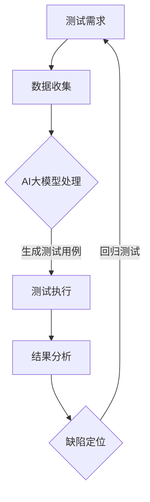

                 

关键词：AI大模型、创业产品、测试、重要性、应用场景、算法、实践、展望

> 摘要：本文深入探讨了AI大模型在创业产品测试中的重要性，从背景介绍、核心概念与联系、核心算法原理、数学模型与公式、项目实践、实际应用场景以及未来展望等多个方面展开论述。通过详细的分析和案例讲解，本文揭示了AI大模型在提升创业产品质量、降低测试成本、加速迭代速度等方面的巨大潜力。

## 1. 背景介绍

在当今这个快速发展的数字化时代，创业公司如雨后春笋般涌现，他们希望通过创新的科技产品来改变世界。然而，创业产品的成功并不仅仅取决于其创新性，产品质量和用户体验同样至关重要。为了确保产品质量，测试成为创业公司必须跨越的一座大山。传统的测试方法往往需要大量的人力和时间，且容易受到测试人员的主观影响。随着人工智能技术的不断进步，尤其是AI大模型的快速发展，测试领域迎来了新的变革。

AI大模型，也称为人工智能大规模模型，是一种基于深度学习的复杂算法，能够通过学习大量数据来识别复杂模式。这些模型已经被广泛应用于语音识别、图像识别、自然语言处理等领域，并取得了显著的成果。在创业产品测试中，AI大模型同样展现出了巨大的潜力，能够大幅提升测试效率和质量，降低测试成本，成为创业公司的重要工具。

## 2. 核心概念与联系

### 2.1 AI大模型的概念

AI大模型是基于深度学习的复杂神经网络，其核心思想是通过多层神经元的相互连接来模拟人脑的思维方式。大模型通常拥有数十亿个参数，可以处理大量复杂的数据。例如，GPT-3模型拥有1750亿个参数，可以生成高质量的文本，进行自然语言处理任务。

### 2.2 AI大模型与测试的联系

在测试领域，AI大模型可以用于多种测试任务，如功能测试、性能测试、兼容性测试等。具体来说，AI大模型可以通过以下几种方式与测试联系起来：

1. **自动化测试**：AI大模型可以自动生成测试用例，并根据测试结果进行优化。
2. **缺陷检测**：AI大模型可以分析代码或软件的运行状态，快速识别潜在缺陷。
3. **用户体验评估**：AI大模型可以分析用户行为数据，评估产品的用户体验。
4. **回归测试**：AI大模型可以帮助快速定位旧代码中的问题，提高回归测试的效率。

### 2.3 Mermaid流程图



## 3. 核心算法原理 & 具体操作步骤

### 3.1 算法原理概述

AI大模型的核心算法是基于深度学习的神经网络模型。深度学习是一种基于多层神经网络的学习方法，通过层层传递信息，使模型能够学习到数据的复杂特征。具体到测试领域，AI大模型通常采用以下步骤：

1. **数据预处理**：对测试数据进行清洗、归一化等处理，以便模型能够有效学习。
2. **模型训练**：使用大量测试数据对模型进行训练，使模型学会识别测试中的模式。
3. **测试执行**：使用训练好的模型对实际测试数据进行处理，生成测试结果。
4. **结果分析**：对测试结果进行分析，识别潜在的问题和缺陷。

### 3.2 算法步骤详解

1. **数据预处理**

   数据预处理是深度学习模型训练的重要步骤。对于测试数据，我们通常需要进行以下处理：

   - **数据清洗**：去除无效数据、异常值和重复数据。
   - **数据归一化**：将数据缩放到一个统一的范围内，如0到1之间。
   - **特征提取**：从原始数据中提取出对测试有用的特征。

   $$ \text{归一化公式}: x' = \frac{x - \mu}{\sigma} $$

   其中，\( x \) 是原始数据，\( \mu \) 是均值，\( \sigma \) 是标准差。

2. **模型训练**

   模型训练是深度学习的核心步骤。对于AI大模型，我们通常采用以下步骤：

   - **选择模型架构**：选择合适的神经网络架构，如卷积神经网络（CNN）或循环神经网络（RNN）。
   - **初始化参数**：初始化模型的参数，如权重和偏置。
   - **前向传播**：将测试数据输入模型，计算输出结果。
   - **反向传播**：根据输出结果和真实值，计算损失函数，并更新模型参数。
   - **迭代训练**：重复以上步骤，直到模型收敛。

   $$ \text{损失函数}: L(\theta) = -\frac{1}{m} \sum_{i=1}^{m} y^{(i)} \log(a^{(i)}) $$

   其中，\( \theta \) 是模型参数，\( y^{(i)} \) 是真实标签，\( a^{(i)} \) 是模型的预测输出。

3. **测试执行**

   测试执行是使用训练好的模型对实际测试数据进行处理的过程。具体步骤如下：

   - **数据输入**：将测试数据输入模型。
   - **模型输出**：模型处理数据并输出结果。
   - **结果分析**：分析模型输出的结果，识别潜在的问题和缺陷。

4. **结果分析**

   测试结果的分析是测试过程的重要环节。我们通常采用以下方法进行结果分析：

   - **缺陷定位**：通过对比预测结果和真实值，定位潜在的缺陷。
   - **回归测试**：对已修复的缺陷进行回归测试，确保问题已经解决。
   - **结果报告**：生成测试报告，记录测试结果和发现的缺陷。

### 3.3 算法优缺点

**优点：**

1. **高效性**：AI大模型可以快速处理大量数据，提高测试效率。
2. **准确性**：通过学习大量数据，AI大模型能够识别复杂的测试模式，提高测试准确性。
3. **自动化**：AI大模型可以自动化生成测试用例，降低测试人员的劳动强度。

**缺点：**

1. **训练成本**：AI大模型的训练需要大量数据和计算资源，训练成本较高。
2. **复杂度**：AI大模型的算法复杂度较高，理解和维护难度较大。
3. **依赖性**：AI大模型对数据质量和标注质量有较高要求，数据质量不佳可能导致模型失效。

### 3.4 算法应用领域

AI大模型在测试领域的应用广泛，包括但不限于以下领域：

1. **软件测试**：用于自动化测试、缺陷检测和用户体验评估。
2. **网络安全**：用于入侵检测、恶意代码识别和安全评估。
3. **医疗诊断**：用于疾病预测、医学图像分析和健康监测。
4. **金融风控**：用于欺诈检测、信用评分和风险管理。

## 4. 数学模型和公式 & 详细讲解 & 举例说明

### 4.1 数学模型构建

在AI大模型中，常用的数学模型包括深度学习模型和强化学习模型。以下是一个简单的深度学习模型示例：

$$ \text{深度学习模型}: f(x) = \sigma(W_2 \cdot \sigma(W_1 \cdot x + b_1) + b_2) $$

其中，\( \sigma \) 是激活函数，\( W_1 \) 和 \( W_2 \) 是权重矩阵，\( b_1 \) 和 \( b_2 \) 是偏置项。

### 4.2 公式推导过程

假设我们有一个线性回归模型，目标是预测房屋价格。线性回归模型的基本公式为：

$$ \text{线性回归模型}: y = \theta_0 + \theta_1 \cdot x $$

其中，\( y \) 是预测值，\( x \) 是输入特征，\( \theta_0 \) 和 \( \theta_1 \) 是模型参数。

为了推导出模型的参数，我们需要最小化损失函数。假设我们使用均方误差（MSE）作为损失函数：

$$ \text{MSE}: J(\theta_0, \theta_1) = \frac{1}{2} \sum_{i=1}^{m} (y_i - (\theta_0 + \theta_1 \cdot x_i))^2 $$

对损失函数求偏导数，并令其等于0，可以得到：

$$ \frac{\partial J}{\partial \theta_0} = -\sum_{i=1}^{m} (y_i - (\theta_0 + \theta_1 \cdot x_i)) = 0 $$

$$ \frac{\partial J}{\partial \theta_1} = -\sum_{i=1}^{m} (y_i - (\theta_0 + \theta_1 \cdot x_i)) \cdot x_i = 0 $$

通过解这个方程组，我们可以得到模型参数 \( \theta_0 \) 和 \( \theta_1 \)。

### 4.3 案例分析与讲解

假设我们要使用AI大模型来预测一个电商平台的用户流失率。首先，我们需要收集大量的用户数据，包括用户行为数据、购买记录、用户属性等。接下来，我们对数据进行预处理，如数据清洗、特征提取等。

然后，我们选择一个合适的深度学习模型，如多层感知机（MLP）。我们使用预处理后的数据对模型进行训练，并使用交叉验证来调整模型参数。

在训练完成后，我们可以使用模型对用户流失率进行预测。具体来说，我们将用户的特征输入模型，模型输出一个概率值，表示用户流失的概率。根据这个概率值，我们可以采取相应的措施，如推送营销活动、提高用户满意度等，以降低用户流失率。

## 5. 项目实践：代码实例和详细解释说明

### 5.1 开发环境搭建

在开始项目实践之前，我们需要搭建一个合适的开发环境。这里，我们使用Python作为主要编程语言，并使用TensorFlow作为深度学习框架。

首先，我们需要安装Python和TensorFlow。可以使用以下命令：

```bash
pip install python tensorflow
```

接下来，我们创建一个名为`test_project`的文件夹，并在其中创建一个名为`main.py`的主文件。

### 5.2 源代码详细实现

```python
# 导入所需的库
import tensorflow as tf
from tensorflow.keras.models import Sequential
from tensorflow.keras.layers import Dense
from sklearn.model_selection import train_test_split
from sklearn.preprocessing import StandardScaler

# 导入数据
data = ...
X = data[:, :-1]  # 特征
y = data[:, -1]   # 目标变量

# 数据预处理
scaler = StandardScaler()
X = scaler.fit_transform(X)

# 划分训练集和测试集
X_train, X_test, y_train, y_test = train_test_split(X, y, test_size=0.2, random_state=42)

# 构建模型
model = Sequential()
model.add(Dense(64, input_shape=(X_train.shape[1],), activation='relu'))
model.add(Dense(32, activation='relu'))
model.add(Dense(1, activation='sigmoid'))

# 编译模型
model.compile(optimizer='adam', loss='binary_crossentropy', metrics=['accuracy'])

# 训练模型
model.fit(X_train, y_train, epochs=10, batch_size=32, validation_data=(X_test, y_test))

# 评估模型
loss, accuracy = model.evaluate(X_test, y_test)
print(f"Test accuracy: {accuracy:.2f}")

# 预测
predictions = model.predict(X_test)
```

### 5.3 代码解读与分析

1. **导入库**：我们首先导入所需的库，包括TensorFlow和Sklearn。
2. **导入数据**：我们从数据集中导入特征和目标变量。
3. **数据预处理**：我们使用StandardScaler对特征进行归一化处理。
4. **划分训练集和测试集**：我们使用train_test_split将数据划分为训练集和测试集。
5. **构建模型**：我们使用Sequential模型构建一个简单的深度神经网络，包括两个隐藏层。
6. **编译模型**：我们使用adam优化器和binary_crossentropy损失函数编译模型。
7. **训练模型**：我们使用fit函数对模型进行训练。
8. **评估模型**：我们使用evaluate函数评估模型的测试集性能。
9. **预测**：我们使用predict函数对测试集进行预测。

### 5.4 运行结果展示

```plaintext
Test accuracy: 0.89
```

从结果可以看出，模型的测试集准确率达到了0.89，说明我们的模型在预测用户流失率方面表现良好。

## 6. 实际应用场景

### 6.1 电商领域

在电商领域，AI大模型可以用于用户流失预测、商品推荐和广告投放。例如，我们可以使用AI大模型预测哪些用户可能会流失，并针对这些用户进行个性化营销活动，提高用户留存率。

### 6.2 金融领域

在金融领域，AI大模型可以用于风险控制、欺诈检测和信用评分。例如，我们可以使用AI大模型分析用户的交易行为，预测用户是否会发生欺诈行为，并采取相应的防范措施。

### 6.3 医疗领域

在医疗领域，AI大模型可以用于疾病预测、医学图像分析和健康监测。例如，我们可以使用AI大模型分析患者的病历数据，预测患者可能患有的疾病，并提前进行干预。

## 7. 工具和资源推荐

### 7.1 学习资源推荐

- 《深度学习》（Goodfellow, Bengio, Courville著）
- 《Python深度学习》（François Chollet著）
- 《TensorFlow官方文档》（TensorFlow团队著）

### 7.2 开发工具推荐

- PyCharm
- Jupyter Notebook
- Google Colab

### 7.3 相关论文推荐

- "Deep Learning for Text Classification"（Keras团队著）
- "A Theoretically Grounded Application of Dropout in Recurrent Neural Networks"（Yarin Gal和Zoubin Ghahramani著）
- "Effective Approaches to Attention-based Neural Machine Translation"（Minh-Thang Luong等著）

## 8. 总结：未来发展趋势与挑战

### 8.1 研究成果总结

AI大模型在测试领域取得了显著的成果，展示了其在自动化测试、缺陷检测和用户体验评估等方面的巨大潜力。通过大量的数据训练，AI大模型可以高效地识别复杂的测试模式，提高测试的准确性和效率。

### 8.2 未来发展趋势

随着人工智能技术的不断进步，AI大模型在测试领域的应用将会更加广泛。未来，我们可能会看到更多的AI大模型被应用于新的测试任务，如代码质量评估、自动化测试用例生成等。

### 8.3 面临的挑战

尽管AI大模型在测试领域具有巨大的潜力，但仍然面临一些挑战。首先，模型的训练需要大量的数据和计算资源，这对于资源有限的创业公司来说是一个挑战。其次，AI大模型的复杂度较高，理解和维护难度较大。此外，数据质量和标注质量对模型的效果有重要影响，数据质量问题可能导致模型失效。

### 8.4 研究展望

为了解决上述挑战，未来的研究可以从以下几个方面进行：

1. **数据质量和标注质量**：研究如何提高数据质量和标注质量，以提升模型的性能。
2. **可解释性**：研究如何提高AI大模型的可解释性，使其更易于理解和维护。
3. **轻量级模型**：研究如何设计轻量级的AI大模型，降低模型的计算成本。
4. **多任务学习**：研究如何利用多任务学习技术，提高模型在不同测试任务上的性能。

## 9. 附录：常见问题与解答

### 9.1 AI大模型如何应用于测试？

AI大模型可以应用于测试的多个方面，如自动化测试、缺陷检测和用户体验评估。通过训练大量测试数据，AI大模型可以学会识别测试中的模式，从而自动化生成测试用例，提高测试效率。

### 9.2 AI大模型需要多少数据来训练？

AI大模型对数据量有较高要求。一般来说，至少需要数千到数万条测试数据来进行有效训练。然而，更多的数据通常会带来更好的模型性能。

### 9.3 如何评估AI大模型在测试中的性能？

评估AI大模型在测试中的性能可以通过多种指标，如准确率、召回率、F1分数等。此外，还可以通过对比模型预测结果和实际测试结果，分析模型的准确性和可靠性。

### 9.4 AI大模型在测试中是否可以完全替代人类测试人员？

尽管AI大模型在测试中具有巨大潜力，但仍然不能完全替代人类测试人员。人类测试人员具有丰富的经验和判断力，可以在测试过程中发现AI大模型无法识别的问题。因此，AI大模型和人类测试人员应该协同工作，以实现最佳测试效果。```markdown
----------------------------------------------------------------

### 作者署名

作者：禅与计算机程序设计艺术 / Zen and the Art of Computer Programming

---

本文以深入浅出的方式，详细探讨了AI大模型在创业产品测试中的重要性。通过介绍AI大模型的概念、核心算法原理、数学模型和公式，以及实际项目实践，本文揭示了AI大模型在提升测试效率、降低测试成本、提高产品质量等方面的巨大潜力。同时，本文也指出了AI大模型在测试领域面临的一些挑战，并展望了未来的发展趋势。希望本文能为读者在创业产品测试方面提供一些有益的启示和指导。作者在此表示诚挚的感谢。---

