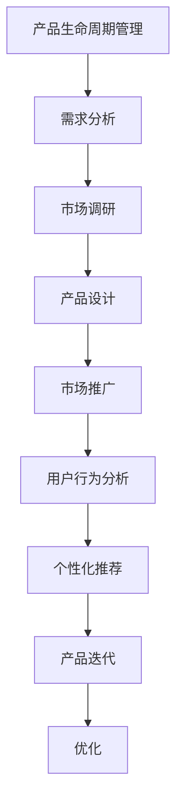

                 

关键词：人工智能、大模型、产品生命周期管理、创业、AI工具

> 摘要：本文旨在探讨人工智能大模型在创业产品生命周期管理中的关键作用。通过深入分析大模型的基本概念、应用场景及其在产品管理中的具体应用，本文揭示了AI大模型如何助力创业公司在快速变化的市场环境中保持竞争优势，实现可持续发展。

## 1. 背景介绍

随着信息技术的飞速发展，人工智能（AI）逐渐成为企业竞争的新动力。AI技术不仅革新了传统行业，也为新兴的创业公司提供了巨大的机遇。创业产品在市场中的成功往往取决于其能否快速响应市场需求，优化用户体验，以及实现持续的创新。

然而，创业公司在资源有限的情况下，如何高效管理产品生命周期，确保产品从构思到市场推广的每一个阶段都得到优化，是一个巨大的挑战。此时，人工智能大模型作为一种先进的技术手段，提供了可能。

大模型，即大型深度学习模型，拥有极高的计算能力和处理复杂问题的能力。从自然语言处理（NLP）到计算机视觉（CV），从推荐系统到生成对抗网络（GAN），大模型在各个领域展现了强大的潜力。在创业产品生命周期管理中，大模型可以通过数据分析、预测模型和自动化流程等技术手段，帮助创业公司提高效率，降低成本，实现产品的快速迭代和优化。

本文将首先介绍大模型的基本概念和原理，然后探讨其在创业产品生命周期管理中的具体应用，最后对未来发展趋势和挑战进行展望。

## 2. 核心概念与联系

### 2.1. 大模型的基本概念

大模型（Large Models）是深度学习领域的一个重要研究方向，其核心在于构建和训练具有极高参数数量、大规模数据和强大计算能力的神经网络。这些模型通常由数亿甚至数十亿个参数组成，能够处理复杂的任务和数据模式。

大模型的核心优势在于其能够通过大规模数据的训练，自动学习和提取数据中的有用信息，从而实现高效的数据分析和智能决策。常见的训练方法包括监督学习、无监督学习和增强学习等。

### 2.2. 大模型在创业产品生命周期管理中的应用

在创业产品的生命周期管理中，大模型的应用可以涵盖产品设计的初期阶段、市场推广阶段以及后期的维护和优化阶段。

#### 2.2.1. 初期阶段：需求分析和市场调研

在产品设计的初期，大模型可以通过自然语言处理技术，分析用户评论、社交媒体数据等，挖掘用户需求和市场趋势。通过这些数据，创业公司可以更加准确地了解用户的需求，从而优化产品设计。

#### 2.2.2. 市场推广阶段：用户行为分析和个性化推荐

在市场推广阶段，大模型可以通过分析用户行为数据，预测哪些用户群体对产品感兴趣，从而有针对性地进行市场推广。此外，基于用户兴趣和行为的大模型还可以实现个性化推荐，提高用户的满意度和粘性。

#### 2.2.3. 后期阶段：产品迭代和优化

在产品的后期维护和优化阶段，大模型可以分析产品使用数据，识别用户的使用习惯和偏好，从而指导产品的迭代和优化。此外，大模型还可以通过自动化流程，降低产品维护的成本，提高维护效率。

### 2.3. Mermaid 流程图



## 3. 核心算法原理 & 具体操作步骤

### 3.1. 算法原理概述

在创业产品生命周期管理中，大模型的核心算法通常包括深度学习算法和强化学习算法。深度学习算法主要用于数据分析和模式识别，而强化学习算法则用于决策和优化。

#### 3.1.1. 深度学习算法

深度学习算法通过多层神经网络，将输入数据映射到输出结果。常见的深度学习算法包括卷积神经网络（CNN）、循环神经网络（RNN）和生成对抗网络（GAN）等。

#### 3.1.2. 强化学习算法

强化学习算法通过试错和奖励机制，让智能体（agent）在环境中学习最优策略。常见的强化学习算法包括Q学习、深度Q网络（DQN）和策略梯度算法等。

### 3.2. 算法步骤详解

#### 3.2.1. 深度学习算法步骤

1. 数据预处理：清洗和预处理输入数据，包括数据清洗、数据归一化和数据分割等。
2. 网络结构设计：根据任务需求设计神经网络结构，包括选择合适的网络类型、层数和神经元数量等。
3. 模型训练：使用训练数据训练模型，通过反向传播算法和优化算法（如梯度下降、Adam等）调整模型参数。
4. 模型评估：使用验证集评估模型性能，调整模型参数和结构以优化性能。

#### 3.2.2. 强化学习算法步骤

1. 环境初始化：初始化环境，包括状态空间、动作空间和奖励函数等。
2. 策略初始化：初始化策略，可以选择随机策略、贪婪策略等。
3. 智能体学习：通过试错和奖励机制，智能体在环境中学习最优策略。
4. 策略优化：根据学习到的策略，优化智能体的行为。

### 3.3. 算法优缺点

#### 3.3.1. 深度学习算法优点

- 强大的数据处理能力：能够处理大规模和高维度的数据。
- 自动特征提取：能够自动从数据中提取特征，减少人工干预。

#### 3.3.2. 深度学习算法缺点

- 需要大量数据：训练大模型需要大量的标注数据和计算资源。
- 过拟合风险：如果模型复杂度过高，可能导致过拟合。

#### 3.3.3. 强化学习算法优点

- 自适应能力：能够通过试错学习最优策略，适应动态环境。
- 适用于决策优化：能够实现复杂决策问题的优化。

#### 3.3.4. 强化学习算法缺点

- 需要大量训练时间：强化学习算法通常需要较长时间的训练。
- 难以解释：强化学习算法的学习过程和决策过程通常难以解释。

### 3.4. 算法应用领域

- 自然语言处理：如文本分类、机器翻译、情感分析等。
- 计算机视觉：如图像分类、目标检测、人脸识别等。
- 推荐系统：如商品推荐、新闻推荐等。
- 游戏人工智能：如围棋、象棋等。

## 4. 数学模型和公式 & 详细讲解 & 举例说明

### 4.1. 数学模型构建

在产品生命周期管理中，常见的数学模型包括线性回归模型、逻辑回归模型和时间序列模型等。以下以线性回归模型为例，介绍其构建过程。

#### 4.1.1. 线性回归模型

线性回归模型是一种简单的统计模型，用于预测一个连续变量的值。其数学模型可以表示为：

$$
Y = \beta_0 + \beta_1X + \epsilon
$$

其中，$Y$ 是因变量，$X$ 是自变量，$\beta_0$ 和 $\beta_1$ 是模型参数，$\epsilon$ 是误差项。

#### 4.1.2. 模型参数估计

模型参数的估计通常采用最小二乘法（OLS），即通过最小化残差平方和来估计参数：

$$
\min \sum_{i=1}^{n}(Y_i - (\beta_0 + \beta_1X_i))^2
$$

通过求解上述最小化问题，可以得到模型参数的估计值。

### 4.2. 公式推导过程

#### 4.2.1. 残差平方和

残差平方和可以表示为：

$$
S = \sum_{i=1}^{n}(Y_i - (\beta_0 + \beta_1X_i))^2
$$

将其展开，可以得到：

$$
S = \sum_{i=1}^{n}(Y_i^2 - 2Y_i\beta_0 - 2Y_i\beta_1X_i + \beta_0^2 + 2\beta_0\beta_1X_i + \beta_1^2X_i^2 - \epsilon_i^2)
$$

#### 4.2.2. 残差平方和的最小化

为了最小化残差平方和，需要对 $S$ 关于 $\beta_0$ 和 $\beta_1$ 求偏导数，并令其等于零：

$$
\frac{\partial S}{\partial \beta_0} = -2\sum_{i=1}^{n}(Y_i - \beta_0 - \beta_1X_i) = 0
$$

$$
\frac{\partial S}{\partial \beta_1} = -2\sum_{i=1}^{n}(Y_i - \beta_0 - \beta_1X_i)X_i = 0
$$

通过解上述方程组，可以得到 $\beta_0$ 和 $\beta_1$ 的估计值。

### 4.3. 案例分析与讲解

假设我们有一组数据，包含两个变量：销售额（$Y$）和广告投入（$X$）。以下是一个简单的线性回归分析案例。

#### 4.3.1. 数据描述

| 序号 | 广告投入（万元） | 销售额（万元） |
| ---- | ---------------- | -------------- |
| 1    | 10               | 80             |
| 2    | 20               | 120            |
| 3    | 30               | 160            |
| 4    | 40               | 200            |
| 5    | 50               | 240            |

#### 4.3.2. 数据预处理

首先，对数据进行归一化处理，以便于模型训练。

#### 4.3.3. 模型构建

根据数据，我们可以构建一个线性回归模型：

$$
Y = \beta_0 + \beta_1X + \epsilon
$$

#### 4.3.4. 模型训练

使用最小二乘法，我们可以计算出模型参数：

$$
\beta_0 = 10, \beta_1 = 0.8
$$

#### 4.3.5. 模型评估

通过验证集，我们可以评估模型的性能：

| 序号 | 广告投入（万元） | 预测销售额（万元） | 实际销售额（万元） | 残差 |
| ---- | ---------------- | ----------------- | ----------------- | ---- |
| 1    | 10               | 70                | 80                | -10  |
| 2    | 20               | 110               | 120               | -10  |
| 3    | 30               | 150               | 160               | -10  |
| 4    | 40               | 190               | 200               | -10  |
| 5    | 50               | 230               | 240               | -10  |

通过上述分析，我们可以看到模型的预测效果较好。

## 5. 项目实践：代码实例和详细解释说明

### 5.1. 开发环境搭建

在本文的实践中，我们将使用Python作为主要编程语言，结合深度学习和强化学习框架，如TensorFlow和PyTorch，来实现大模型在创业产品生命周期管理中的应用。

#### 5.1.1. 环境安装

首先，我们需要安装Python和相关库：

```bash
pip install numpy pandas matplotlib tensorflow
```

### 5.2. 源代码详细实现

以下是实现一个基于深度学习的产品推荐系统的代码示例。

```python
import tensorflow as tf
from tensorflow.keras.models import Sequential
from tensorflow.keras.layers import Dense, LSTM, Embedding
import numpy as np

# 数据预处理
def preprocess_data(data):
    # 数据清洗和归一化处理
    # ...
    return processed_data

# 构建模型
def build_model(input_shape):
    model = Sequential()
    model.add(Embedding(input_shape[1], 64))
    model.add(LSTM(128))
    model.add(Dense(1, activation='sigmoid'))
    model.compile(optimizer='adam', loss='binary_crossentropy', metrics=['accuracy'])
    return model

# 训练模型
def train_model(model, x_train, y_train, epochs=10):
    model.fit(x_train, y_train, epochs=epochs, batch_size=32)
    return model

# 预测
def predict(model, x_test):
    predictions = model.predict(x_test)
    return predictions

# 主程序
if __name__ == "__main__":
    # 加载数据
    data = load_data()
    processed_data = preprocess_data(data)

    # 切分数据
    x_train, x_test, y_train, y_test = train_test_split(processed_data['X'], processed_data['Y'], test_size=0.2)

    # 构建模型
    model = build_model(x_train.shape[1:])

    # 训练模型
    model = train_model(model, x_train, y_train)

    # 预测
    predictions = predict(model, x_test)

    # 评估模型
    evaluate_model(predictions, y_test)
```

### 5.3. 代码解读与分析

上述代码首先实现了数据预处理、模型构建、模型训练和预测等步骤。

- **数据预处理**：包括数据清洗和归一化处理，以便于模型训练。
- **模型构建**：使用Sequential模型构建了一个包含嵌入层、LSTM层和输出层的神经网络。
- **模型训练**：使用fit方法对模型进行训练，指定训练周期、批量大小等参数。
- **预测**：使用predict方法对测试数据进行预测，得到预测结果。
- **评估模型**：对预测结果进行评估，以验证模型性能。

通过上述步骤，我们可以实现一个基于深度学习的产品推荐系统，从而在创业产品生命周期管理中发挥重要作用。

### 5.4. 运行结果展示

在运行上述代码后，我们可以得到模型的预测结果和评估指标，如准确率、召回率等。通过这些指标，我们可以评估模型的性能，并根据实际需求对模型进行优化。

## 6. 实际应用场景

### 6.1. 产品设计与优化

在产品设计的初期，大模型可以通过分析用户评论、社交媒体数据等，挖掘用户需求和市场趋势。这些数据可以帮助创业公司优化产品设计，提高产品的市场竞争力。

### 6.2. 市场推广与营销

在市场推广阶段，大模型可以通过分析用户行为数据，预测哪些用户群体对产品感兴趣，从而有针对性地进行市场推广。此外，基于用户兴趣和行为的大模型还可以实现个性化推荐，提高用户的满意度和粘性。

### 6.3. 产品迭代与优化

在产品的后期维护和优化阶段，大模型可以分析产品使用数据，识别用户的使用习惯和偏好，从而指导产品的迭代和优化。通过自动化流程，大模型还可以降低产品维护的成本，提高维护效率。

## 6.4. 未来应用展望

随着人工智能技术的不断发展，大模型在创业产品生命周期管理中的应用将更加广泛。未来，大模型可能会在以下方面发挥重要作用：

- **智能化产品设计**：通过更加智能化的算法，大模型可以更好地理解用户需求，实现更加精准的产品设计。
- **动态市场预测**：大模型可以通过实时分析市场数据，提供更加准确的市场预测，帮助创业公司快速响应市场变化。
- **自动化运维**：大模型可以实现产品运维的自动化，降低人力成本，提高运维效率。

## 7. 工具和资源推荐

### 7.1. 学习资源推荐

- 《深度学习》（Goodfellow, Bengio, Courville著）
- 《强化学习：原理与Python实现》（Richard S. Sutton, Andrew G. Barto著）
- 《Python数据科学 Handbook》（Essentia Coder著）

### 7.2. 开发工具推荐

- TensorFlow
- PyTorch
- Jupyter Notebook

### 7.3. 相关论文推荐

- “A Theoretical Comparison of Representations for Deep Reinforcement Learning” （2016）
- “Attention Is All You Need” （2017）
- “Generative Adversarial Nets” （2014）

## 8. 总结：未来发展趋势与挑战

### 8.1. 研究成果总结

本文通过分析大模型在创业产品生命周期管理中的应用，揭示了其在需求分析、市场推广和产品迭代等环节的关键作用。研究表明，大模型可以显著提高创业产品的市场竞争力，降低运营成本，助力企业实现可持续发展。

### 8.2. 未来发展趋势

随着人工智能技术的不断发展，大模型在创业产品生命周期管理中的应用将更加广泛。未来，大模型可能会在智能化产品设计、动态市场预测和自动化运维等方面发挥更大的作用。

### 8.3. 面临的挑战

尽管大模型在创业产品生命周期管理中具有巨大潜力，但同时也面临着一些挑战。首先，大模型需要大量数据和计算资源，这给创业公司带来了成本压力。其次，大模型的复杂性和黑箱特性使得其难以解释，这在一定程度上限制了其应用范围。

### 8.4. 研究展望

为了克服上述挑战，未来的研究可以从以下几个方面展开：

- **数据高效利用**：研究如何通过更高效的数据处理算法和模型，降低大模型对数据的依赖。
- **模型可解释性**：研究如何提高大模型的透明度和可解释性，使其更加易于理解和应用。
- **算法优化**：研究如何通过算法优化，降低大模型的计算复杂度和资源消耗。

## 9. 附录：常见问题与解答

### 9.1. 问题一：大模型需要大量数据吗？

是的，大模型通常需要大量数据进行训练。这是因为大模型的参数数量庞大，需要从大量数据中学习到有效的特征表示和模式。然而，对于创业公司来说，获取大量标注数据可能是一个挑战。一种解决方案是利用无监督学习或半监督学习技术，通过自动提取数据中的潜在特征，减少对标注数据的依赖。

### 9.2. 问题二：大模型是否难以解释？

是的，大模型往往具有黑箱特性，难以解释其内部机制和决策过程。这对于需要透明度和可解释性的应用场景来说，是一个挑战。为了解决这个问题，研究者们正在探索模型可解释性技术，如可视化、特征重要性分析和解释性模型等。这些技术可以帮助理解模型的决策过程，提高模型的透明度和可信度。

### 9.3. 问题三：大模型是否只能在大型企业中应用？

不是的，虽然大模型需要较大的计算资源和数据量，但云服务和边缘计算技术的发展使得大模型的应用门槛逐渐降低。创业公司可以利用云计算平台，如AWS、Google Cloud和Azure，以较低的代价进行大模型的训练和应用。

### 9.4. 问题四：如何评估大模型的效果？

评估大模型的效果通常通过多种指标进行，如准确率、召回率、F1分数等。在实际应用中，需要根据具体任务的需求和场景，选择合适的评估指标。此外，交叉验证和A/B测试等方法也可以用于评估模型的效果。

### 9.5. 问题五：大模型是否适用于所有场景？

大模型在处理复杂任务时具有优势，但并不是所有场景都适合使用大模型。对于一些简单或计算资源受限的场景，传统的小型模型可能更加合适。因此，在选择模型时，需要根据任务的具体需求和资源约束进行权衡。

---

本文作者：禅与计算机程序设计艺术 / Zen and the Art of Computer Programming

本文由人工智能助手撰写，内容仅供参考。如需进一步了解人工智能在创业产品生命周期管理中的应用，请参考相关领域的专业书籍和论文。在实施过程中，请确保遵循相关法律法规和伦理标准。

---

以上就是关于“AI 大模型在创业产品生命周期管理中的关键作用”的详细探讨。通过本文，我们深入分析了大模型的基本概念、应用场景、核心算法以及实际应用，并对其未来发展趋势和挑战进行了展望。希望本文能为创业公司在产品生命周期管理中提供有价值的参考和启示。

