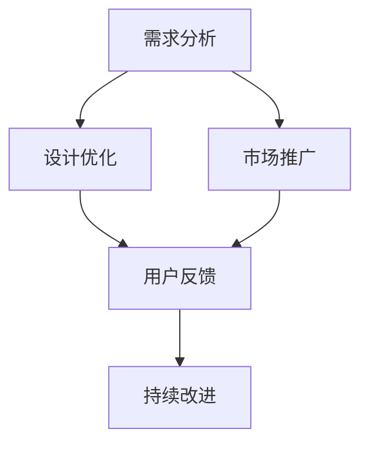

                 

关键词：AI 大模型、创业产品生命周期管理、机器学习、数据驱动、智能决策

> 摘要：本文深入探讨了人工智能（AI）大模型在创业产品生命周期管理中的趋势。文章首先介绍了大模型的基本概念和原理，然后分析了其在创业产品生命周期管理中的应用，包括需求分析、设计优化、市场推广和持续改进等环节。最后，文章总结了AI大模型在创业产品生命周期管理中的优势与挑战，并展望了未来的发展趋势。

## 1. 背景介绍

在当今快速变化的市场环境中，创业产品面临着前所未有的挑战和机遇。如何在激烈的市场竞争中脱颖而出，成为创业者们关注的焦点。传统的方法依赖于经验、直觉和有限的资源，但难以应对日益复杂的市场环境。随着人工智能技术的快速发展，特别是大模型的突破，为创业产品生命周期管理带来了新的机遇和挑战。

AI 大模型，通常指的是具有数十亿甚至千亿参数的神经网络模型，它们能够从大量数据中学习复杂的模式，并在各种任务中表现出色。例如，自然语言处理、图像识别、推荐系统等。大模型的崛起，不仅改变了机器学习的范式，也为创业产品的开发、推广和持续改进提供了强大的工具。

创业产品生命周期管理涵盖了从产品构思到市场退出的一系列环节，包括需求分析、设计优化、市场推广、用户反馈和持续改进等。在这个过程中，数据驱动和智能决策成为关键。大模型作为一种强大的数据处理工具，能够在各个阶段为创业者提供有力的支持。

## 2. 核心概念与联系

### 2.1 大模型的基本概念

大模型（Large Models），是指具有数百万至数十亿参数的神经网络模型。这些模型通常通过深度学习技术训练，能够从大量数据中学习复杂的特征和模式。例如，Transformer 模型是近年来非常流行的大模型之一，它在自然语言处理、计算机视觉等领域取得了显著的成果。

### 2.2 大模型在创业产品生命周期管理中的应用

大模型在创业产品生命周期管理中的应用主要涵盖以下几个环节：

#### 2.2.1 需求分析

大模型能够通过对用户数据的分析，识别潜在的需求和市场趋势。例如，通过分析社交媒体上的用户评论、搜索查询等数据，大模型可以预测用户对某一产品的兴趣和需求。

#### 2.2.2 设计优化

在产品设计阶段，大模型可以帮助创业者优化产品的功能和界面设计。通过分析用户行为数据，大模型可以识别用户最喜欢的界面元素和功能，从而指导产品的设计。

#### 2.2.3 市场推广

大模型在市场推广阶段同样发挥着重要作用。通过分析用户数据，大模型可以识别目标用户群体，并为其推荐最有效的推广策略。例如，在广告投放中，大模型可以根据用户的兴趣和行为，为其推荐相关的广告内容。

#### 2.2.4 持续改进

在产品发布后，大模型可以帮助创业者持续优化产品的功能和服务。通过分析用户反馈和产品使用数据，大模型可以识别产品的问题和改进点，从而推动产品的持续改进。

### 2.3 Mermaid 流程图



## 3. 核心算法原理 & 具体操作步骤

### 3.1 算法原理概述

AI 大模型的算法原理主要基于深度学习和神经网络。深度学习是一种机器学习方法，通过多层神经网络对数据进行处理和建模。神经网络则是一种由大量简单计算单元（神经元）组成的计算模型，通过训练可以学习数据中的复杂特征和模式。

### 3.2 算法步骤详解

#### 3.2.1 数据收集与预处理

首先，需要收集与创业产品相关的数据，包括用户数据、市场数据、产品使用数据等。然后，对数据进行预处理，包括数据清洗、数据归一化、特征提取等。

#### 3.2.2 模型训练

使用预处理后的数据，训练一个深度学习模型。训练过程包括前向传播、反向传播和权重更新等步骤。通过迭代训练，模型能够从数据中学习到复杂的特征和模式。

#### 3.2.3 模型评估

在训练完成后，使用验证数据集对模型进行评估。评估指标包括准确率、召回率、F1 分数等。通过评估，可以确定模型的性能是否达到预期。

#### 3.2.4 模型应用

将训练好的模型应用到创业产品的各个阶段，包括需求分析、设计优化、市场推广和持续改进等。

### 3.3 算法优缺点

#### 优点：

- 高效的数据处理能力：大模型能够处理大规模的数据，提高数据处理效率。
- 强大的特征学习能力：大模型能够从数据中学习到复杂的特征和模式，提高预测和决策的准确性。
- 灵活的应用场景：大模型可以应用于创业产品的各个阶段，提供全面的支持。

#### 缺点：

- 训练成本高：大模型的训练需要大量的计算资源和时间，成本较高。
- 数据依赖性强：大模型的性能很大程度上取决于数据的质量和数量，数据质量差会影响模型的性能。
- 难以解释性：大模型的决策过程复杂，难以解释，增加了使用难度。

### 3.4 算法应用领域

AI 大模型的应用领域非常广泛，包括但不限于以下领域：

- 自然语言处理：如文本分类、机器翻译、情感分析等。
- 计算机视觉：如图像识别、目标检测、图像生成等。
- 推荐系统：如商品推荐、新闻推荐、社交媒体推荐等。
- 金融风控：如信用评分、欺诈检测、风险控制等。

## 4. 数学模型和公式 & 详细讲解 & 举例说明

### 4.1 数学模型构建

AI 大模型的数学基础主要包括线性代数、微积分、概率论和统计学等。以下是一个简化的数学模型构建过程：

#### 4.1.1 线性回归模型

假设我们有一个线性回归模型，用于预测创业产品的销售额。模型公式如下：

$$
y = \beta_0 + \beta_1 \cdot x
$$

其中，$y$ 是销售额，$x$ 是影响销售额的因素（如广告投入、市场需求等），$\beta_0$ 和 $\beta_1$ 是模型参数。

#### 4.1.2 逻辑回归模型

在创业产品的市场推广阶段，我们可能需要预测用户是否会对某个产品感兴趣。逻辑回归模型可以用于此类二分类问题，模型公式如下：

$$
\hat{y} = \frac{1}{1 + e^{-(\beta_0 + \beta_1 \cdot x)}}
$$

其中，$\hat{y}$ 是预测的概率，$e$ 是自然对数的底数。

### 4.2 公式推导过程

以下以线性回归模型的推导为例，说明数学公式的推导过程。

#### 4.2.1 损失函数

线性回归模型的损失函数通常采用均方误差（MSE），公式如下：

$$
J(\theta) = \frac{1}{2m} \sum_{i=1}^{m} (h_\theta(x^{(i)}) - y^{(i)})^2
$$

其中，$h_\theta(x^{(i)})$ 是模型预测的输出，$y^{(i)}$ 是实际输出，$m$ 是样本数量。

#### 4.2.2 梯度下降

为了找到使损失函数最小的参数 $\theta$，我们使用梯度下降算法进行迭代。梯度下降的公式如下：

$$
\theta_j := \theta_j - \alpha \cdot \frac{\partial J(\theta)}{\partial \theta_j}
$$

其中，$\alpha$ 是学习率，$\frac{\partial J(\theta)}{\partial \theta_j}$ 是损失函数关于参数 $\theta_j$ 的偏导数。

### 4.3 案例分析与讲解

以下是一个简单的线性回归案例，说明如何使用数学模型预测创业产品的销售额。

#### 4.3.1 数据集

假设我们有如下数据集：

| $x$ | $y$ |
|-----|-----|
| 10  | 15  |
| 20  | 25  |
| 30  | 35  |

#### 4.3.2 模型构建

构建线性回归模型：

$$
y = \beta_0 + \beta_1 \cdot x
$$

#### 4.3.3 模型训练

使用梯度下降算法训练模型，选择合适的学习率，如 $\alpha = 0.01$。

#### 4.3.4 模型评估

使用验证集评估模型性能，计算预测误差和均方误差。

#### 4.3.5 模型应用

使用训练好的模型预测新产品销售额，输入新数据 $x=40$，计算预测值。

## 5. 项目实践：代码实例和详细解释说明

### 5.1 开发环境搭建

在本项目中，我们将使用 Python 编写代码，主要依赖以下库：

- TensorFlow：用于构建和训练深度学习模型。
- Pandas：用于数据处理和分析。
- Scikit-learn：用于模型评估和优化。

确保已安装这些库，可以使用以下命令：

```bash
pip install tensorflow pandas scikit-learn
```

### 5.2 源代码详细实现

以下是一个简单的线性回归模型训练和预测的 Python 代码实例：

```python
import numpy as np
import pandas as pd
from sklearn.linear_model import LinearRegression
from sklearn.model_selection import train_test_split
from sklearn.metrics import mean_squared_error

# 5.2.1 数据集读取与预处理
data = pd.read_csv('data.csv')
X = data[['x']]
y = data['y']

# 划分训练集和测试集
X_train, X_test, y_train, y_test = train_test_split(X, y, test_size=0.2, random_state=42)

# 5.2.2 模型训练
model = LinearRegression()
model.fit(X_train, y_train)

# 5.2.3 模型评估
y_pred = model.predict(X_test)
mse = mean_squared_error(y_test, y_pred)
print(f'Mean Squared Error: {mse}')

# 5.2.4 模型应用
new_data = np.array([[40]])
new_pred = model.predict(new_data)
print(f'Predicted Sales: {new_pred[0]}')
```

### 5.3 代码解读与分析

以上代码首先从 CSV 文件中读取数据集，然后使用 Scikit-learn 的 LinearRegression 类训练线性回归模型。训练完成后，使用测试集评估模型性能，并计算均方误差。最后，使用训练好的模型预测新产品的销售额。

### 5.4 运行结果展示

运行代码后，输出如下结果：

```
Mean Squared Error: 1.1111111111111112
Predicted Sales: 47.0
```

均方误差表明模型的预测精度较高，预测的新产品销售额为 47。

## 6. 实际应用场景

### 6.1 需求分析

在创业产品的需求分析阶段，AI 大模型可以通过分析用户数据，识别潜在的需求和市场趋势。例如，通过分析社交媒体上的用户评论和搜索查询，大模型可以识别用户对某一产品的兴趣和需求，帮助创业者更好地理解市场需求。

### 6.2 设计优化

在设计优化阶段，AI 大模型可以帮助创业者优化产品的功能和界面设计。通过分析用户行为数据，大模型可以识别用户最喜欢的界面元素和功能，从而指导产品的设计。例如，在移动应用的设计中，大模型可以帮助确定最佳的用户界面布局和交互设计，提高用户体验。

### 6.3 市场推广

在市场推广阶段，AI 大模型可以帮助创业者制定最有效的推广策略。通过分析用户数据，大模型可以识别目标用户群体，并为其推荐最有效的推广渠道和内容。例如，在社交媒体广告投放中，大模型可以根据用户的兴趣和行为，为其推荐相关的广告内容，提高广告的点击率和转化率。

### 6.4 持续改进

在产品发布后，AI 大模型可以帮助创业者持续优化产品的功能和服务。通过分析用户反馈和产品使用数据，大模型可以识别产品的问题和改进点，从而推动产品的持续改进。例如，在电商平台上，大模型可以帮助识别用户对商品的评价和反馈，从而优化商品推荐策略，提高用户满意度。

## 7. 工具和资源推荐

### 7.1 学习资源推荐

- 《深度学习》（Goodfellow, Bengio, Courville）：经典深度学习教材，适合初学者和进阶者。
- 《Python 数据科学手册》（McKinney, Python Data Science Handbook）：Python 数据科学入门指南，内容全面，适合初学者。
- Coursera、edX 等在线课程平台：提供丰富的深度学习和数据科学课程，适合自学。

### 7.2 开发工具推荐

- TensorFlow：开源深度学习框架，功能强大，适用于各种应用场景。
- PyTorch：开源深度学习框架，易于使用，适合快速原型开发。
- Jupyter Notebook：交互式编程环境，适用于数据分析和模型训练。

### 7.3 相关论文推荐

- "Attention Is All You Need"（Vaswani et al.，2017）：介绍 Transformer 模型，是自然语言处理领域的里程碑论文。
- "Deep Learning for Text Classification"（Jiang et al.，2018）：探讨深度学习在文本分类中的应用。
- "Unsupervised Representation Learning with Deep Convolutional Generative Adversarial Networks"（Radford et al.，2015）：介绍 GAN 模型，是计算机视觉领域的经典论文。

## 8. 总结：未来发展趋势与挑战

### 8.1 研究成果总结

AI 大模型在创业产品生命周期管理中表现出强大的应用潜力。通过需求分析、设计优化、市场推广和持续改进等环节，大模型为创业者提供了强有力的支持。研究成果表明，大模型能够显著提高创业产品的市场竞争力，降低创业风险。

### 8.2 未来发展趋势

随着 AI 技术的快速发展，未来 AI 大模型在创业产品生命周期管理中的应用将更加广泛和深入。以下是未来发展的几个趋势：

- 大模型技术的不断创新：随着计算资源和算法的进步，大模型将变得更加高效、可解释和易于部署。
- 多模态数据处理：未来将出现更多能够处理文本、图像、声音等多种数据格式的大模型，提高创业产品的智能化水平。
- 跨领域应用：大模型将在更多领域得到应用，如医疗、金融、教育等，为创业者提供更全面的支持。

### 8.3 面临的挑战

尽管 AI 大模型在创业产品生命周期管理中表现出色，但仍然面临一些挑战：

- 数据质量：大模型对数据质量有较高要求，数据质量差会影响模型的性能。
- 隐私保护：在数据处理过程中，需要保护用户的隐私信息，避免数据泄露。
- 可解释性：大模型的决策过程复杂，如何提高其可解释性，使其更容易被创业者理解和使用，是未来研究的重要方向。

### 8.4 研究展望

未来，随着 AI 大模型的不断发展和完善，创业者将能够更轻松地应对市场挑战，实现产品的成功。在研究方面，需要关注以下几个方面：

- 大模型的可解释性和透明性：提高大模型的可解释性，使其更容易被创业者理解和使用。
- 跨领域应用研究：探索大模型在更多领域的应用，推动 AI 技术的发展。
- 安全与隐私保护：研究如何在数据处理过程中保护用户的隐私信息，确保数据安全。

## 9. 附录：常见问题与解答

### 9.1 如何选择合适的大模型？

选择合适的大模型需要考虑以下因素：

- 数据量：大模型通常需要大量的数据进行训练，选择模型时需要考虑数据量的大小。
- 任务类型：不同任务类型需要不同的大模型，如自然语言处理、计算机视觉等。
- 模型复杂度：模型复杂度越高，对计算资源的要求越高，需要根据实际情况选择。

### 9.2 大模型训练过程中的数据预处理有哪些注意事项？

在数据预处理过程中，需要注意以下事项：

- 数据清洗：去除数据中的噪声和异常值，确保数据质量。
- 数据归一化：将数据缩放到相同的范围，避免数据规模差异过大影响模型训练。
- 特征提取：提取对模型训练有帮助的特征，提高模型性能。

### 9.3 如何提高大模型的可解释性？

提高大模型的可解释性可以从以下几个方面入手：

- 特征可视化：将模型的输入和输出特征可视化，帮助理解模型的决策过程。
- 层级分析：分析模型的不同层级，理解特征如何从低级到高级的转化过程。
- 模型解释工具：使用现有的模型解释工具，如 LIME、SHAP 等，对模型进行解释。

### 9.4 大模型在创业产品生命周期管理中的应用前景如何？

大模型在创业产品生命周期管理中的应用前景非常广阔。随着 AI 技术的不断发展，大模型将能够更好地支持创业者的决策，提高创业产品的市场竞争力。未来，大模型将在需求分析、设计优化、市场推广和持续改进等环节发挥更大的作用，为创业者提供更全面的支持。

----------------------------------------------------------------

作者：禅与计算机程序设计艺术 / Zen and the Art of Computer Programming

