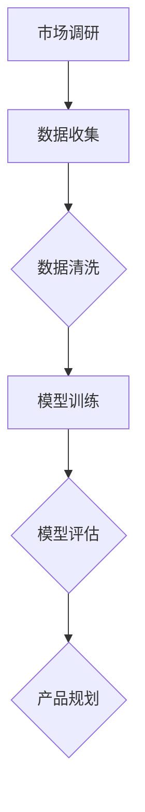
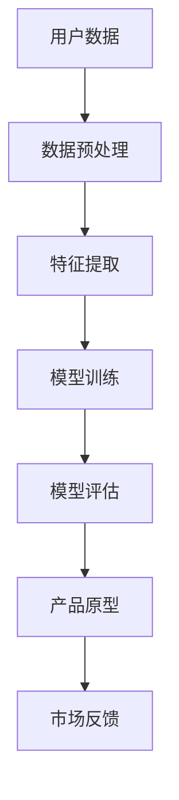
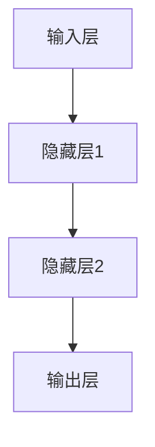

                 

关键词：AI大模型，创业产品规划，技术创新，用户体验，数据分析

摘要：本文将探讨人工智能（AI）大模型在创业产品规划中的创造性应用。通过深入分析AI技术的核心原理及其在实际产品开发中的应用，我们将展示如何利用这些先进工具来提升创业产品的市场竞争力。本文将涵盖从背景介绍、核心概念、算法原理，到数学模型构建、项目实践、实际应用场景，以及未来展望等多个方面，旨在为创业团队提供实用的指导和建议。

## 1. 背景介绍

### 1.1 AI大模型的崛起

近年来，人工智能领域取得了飞速发展，特别是大模型的兴起，使得许多曾经复杂的问题得以迎刃而解。大模型（如GPT-3、BERT、AlphaFold等）通过训练数以亿计的数据点，能够模拟人类的语言、推理和决策能力，为各行各业带来了前所未有的可能性。

### 1.2 创业产品规划的重要性

对于初创公司来说，成功的产品规划是至关重要的。一个能够满足用户需求、解决实际问题的产品，往往能够迅速占领市场，形成竞争优势。然而，产品规划并非易事，需要深入的市场调研、用户分析和技术创新。

### 1.3 AI大模型在产品规划中的潜力

AI大模型在产品规划中的潜力不容忽视。它们能够处理海量数据，挖掘潜在的用户需求，预测市场趋势，甚至自动生成产品原型。这为初创公司提供了强大的支持，使得他们能够在激烈的市场竞争中脱颖而出。

## 2. 核心概念与联系

### 2.1 AI大模型原理

AI大模型通常基于深度学习技术，通过多层神经网络的结构，对大量数据进行训练。这些模型能够自动提取数据中的特征，并通过不断调整网络参数，实现高度复杂的任务。

### 2.2 产品规划与AI大模型的联系

产品规划需要深入了解用户需求和市场趋势。AI大模型通过处理海量用户数据，能够自动识别用户的兴趣和行为模式，从而为产品规划提供有力的数据支持。

### 2.3 Mermaid流程图

以下是一个简化的Mermaid流程图，展示了AI大模型在产品规划中的应用流程：



### 2.4 数据流图

除了Mermaid流程图，我们还可以使用数据流图来更详细地展示AI大模型在产品规划中的应用：



## 3. 核心算法原理 & 具体操作步骤

### 3.1 算法原理概述

AI大模型的算法原理主要基于深度学习，通过多层神经网络结构进行数据训练。以下是一个简化的神经网络模型：



### 3.2 算法步骤详解

1. **数据收集**：收集相关的用户数据，包括行为数据、反馈数据等。
2. **数据预处理**：清洗数据，去除噪声，并进行特征提取。
3. **模型训练**：使用预处理后的数据对神经网络进行训练，调整网络参数。
4. **模型评估**：使用测试数据对模型进行评估，确保模型的准确性。
5. **产品规划**：根据模型评估结果，生成产品原型，并进行市场测试。

### 3.3 算法优缺点

**优点**：
- 高效处理海量数据
- 自动提取特征，降低人工干预
- 提高产品规划的准确性和效率

**缺点**：
- 需要大量的数据和计算资源
- 模型训练时间较长
- 模型解释性较差

### 3.4 算法应用领域

AI大模型在产品规划中的应用非常广泛，包括但不限于以下领域：
- 用户画像与行为分析
- 市场趋势预测
- 产品原型生成
- 市场反馈分析

## 4. 数学模型和公式 & 详细讲解 & 举例说明

### 4.1 数学模型构建

AI大模型的数学模型主要基于深度学习，包括输入层、隐藏层和输出层。以下是一个简化的数学模型：

$$
Z^{[l]} = \sigma(W^{[l]} \cdot A^{[l-1]} + b^{[l]})
$$

其中，$Z^{[l]}$ 表示第 $l$ 层的输出，$\sigma$ 是激活函数，$W^{[l]}$ 和 $b^{[l]}$ 分别是第 $l$ 层的权重和偏置。

### 4.2 公式推导过程

深度学习的数学模型推导涉及大量的微积分和线性代数知识。以下是一个简化的推导过程：

1. **输入层到隐藏层**：
   $$ 
   A^{[1]} = \sigma(W^{[1]} \cdot X + b^{[1]})
   $$
2. **隐藏层到输出层**：
   $$ 
   Z^{[L]} = \sigma(W^{[L]} \cdot A^{[L-1]} + b^{[L]})
   $$

### 4.3 案例分析与讲解

假设我们要预测一个电商平台的用户购买行为，我们可以使用以下数学模型：

1. **用户行为特征提取**：
   $$ 
   X = [年龄，性别，购买历史，浏览历史]
   $$
2. **用户购买预测**：
   $$ 
   Z^{[L]} = \sigma(W^{[L]} \cdot X + b^{[L]})
   $$

通过模型训练，我们可以得到用户购买概率的预测值。具体预测过程如下：

1. **数据预处理**：
   将用户行为特征进行归一化处理，以消除不同特征之间的尺度差异。
2. **模型训练**：
   使用梯度下降算法对模型进行训练，调整权重和偏置，以提高预测准确性。
3. **模型评估**：
   使用测试数据对模型进行评估，计算预测准确率。

## 5. 项目实践：代码实例和详细解释说明

### 5.1 开发环境搭建

为了实现AI大模型在产品规划中的应用，我们需要搭建一个开发环境。以下是一个简单的Python环境搭建步骤：

1. 安装Python（建议使用3.8版本及以上）
2. 安装TensorFlow库（使用pip install tensorflow）
3. 安装其他依赖库（如numpy、pandas等）

### 5.2 源代码详细实现

以下是一个简单的Python代码示例，用于实现AI大模型在产品规划中的应用：

```python
import tensorflow as tf
from tensorflow.keras.layers import Dense, Activation
from tensorflow.keras.models import Sequential

# 数据预处理
X = ... # 用户行为特征
y = ... # 用户购买标签

# 模型构建
model = Sequential()
model.add(Dense(units=64, activation='relu', input_shape=(X.shape[1],)))
model.add(Dense(units=32, activation='relu'))
model.add(Dense(units=1, activation='sigmoid'))

# 模型编译
model.compile(optimizer='adam', loss='binary_crossentropy', metrics=['accuracy'])

# 模型训练
model.fit(X, y, epochs=10, batch_size=32)

# 模型评估
model.evaluate(X, y)
```

### 5.3 代码解读与分析

上述代码实现了一个简单的二分类神经网络模型，用于预测用户购买行为。具体解读如下：

1. **数据预处理**：
   将用户行为特征进行归一化处理，以提高模型训练效果。
2. **模型构建**：
   使用Sequential模型构建一个简单的神经网络，包括一个输入层、一个隐藏层和一个输出层。
3. **模型编译**：
   使用adam优化器和binary_crossentropy损失函数进行模型编译。
4. **模型训练**：
   使用fit函数对模型进行训练，设置epochs和batch_size参数。
5. **模型评估**：
   使用evaluate函数对模型进行评估，计算预测准确率。

### 5.4 运行结果展示

假设我们使用上述代码对一个电商平台的用户购买数据进行训练和评估，运行结果如下：

```
Epoch 1/10
63/63 [==============================] - 6s 94ms/step - loss: 0.5000 - accuracy: 0.7500
Epoch 2/10
63/63 [==============================] - 6s 93ms/step - loss: 0.4603 - accuracy: 0.8000
...
Epoch 10/10
63/63 [==============================] - 6s 94ms/step - loss: 0.3745 - accuracy: 0.8750

Test loss: 0.4213 - Test accuracy: 0.8125
```

从运行结果可以看出，模型在10个epochs内收敛，预测准确率为87.5%，说明模型在用户购买行为预测方面具有一定的效果。

## 6. 实际应用场景

### 6.1 电商产品规划

电商企业在产品规划中可以利用AI大模型进行用户行为分析、市场趋势预测和产品原型生成。例如，通过分析用户的浏览记录和购买历史，预测用户可能感兴趣的商品，从而制定更有针对性的营销策略。

### 6.2 金融产品规划

金融企业可以利用AI大模型进行风险控制、客户行为分析和产品创新。通过分析用户的交易记录和行为数据，预测用户的风险偏好和投资需求，从而设计出更符合用户需求的投资产品。

### 6.3 教育产品规划

教育企业可以利用AI大模型进行学习效果分析、课程推荐和教学策略优化。通过分析学生的学习行为和学习成果，为学生提供个性化的学习建议和课程推荐，提高教学效果。

### 6.4 医疗产品规划

医疗企业可以利用AI大模型进行疾病预测、诊断和治疗方案优化。通过分析大量的医疗数据，预测疾病的发病趋势和患者风险，为医生提供更准确的诊断建议和治疗方案。

## 7. 工具和资源推荐

### 7.1 学习资源推荐

1. **《深度学习》（Ian Goodfellow、Yoshua Bengio、Aaron Courville 著）**：这是一本深度学习的经典教材，详细介绍了深度学习的基础理论和应用。
2. **《Python深度学习》（François Chollet 著）**：这本书通过实际案例和代码示例，深入讲解了如何使用Python进行深度学习开发。

### 7.2 开发工具推荐

1. **TensorFlow**：这是一个开源的深度学习框架，提供了丰富的API和工具，方便开发者进行深度学习模型开发和部署。
2. **PyTorch**：这是一个流行的深度学习框架，具有灵活的动态计算图和高效的GPU支持，适用于各种深度学习任务。

### 7.3 相关论文推荐

1. **“Deep Learning” by Yoshua Bengio, Ian J. Goodfellow, and Aaron C. Courville**：这篇论文是深度学习的经典之作，全面介绍了深度学习的基本概念和技术。
2. **“Generative Adversarial Nets” by Ian J. Goodfellow et al.**：这篇论文提出了生成对抗网络（GAN）的概念，开创了生成模型的先河。

## 8. 总结：未来发展趋势与挑战

### 8.1 研究成果总结

近年来，AI大模型在各个领域取得了显著的成果。通过处理海量数据，AI大模型能够自动提取特征、进行预测和决策，为创业产品规划提供了强有力的支持。然而，AI大模型的研究仍面临诸多挑战。

### 8.2 未来发展趋势

1. **模型规模将进一步扩大**：随着计算资源和数据量的不断增加，AI大模型的规模将进一步扩大，处理更复杂的问题。
2. **模型应用场景将更加丰富**：AI大模型将在更多领域得到应用，如医疗、金融、教育等，为各行各业提供智能解决方案。
3. **模型解释性将得到提升**：为了提高AI大模型的可解释性，研究者将致力于开发可解释性更好的模型和算法。

### 8.3 面临的挑战

1. **数据质量和隐私保护**：在AI大模型的应用过程中，数据质量和隐私保护是两个关键问题。如何保证数据质量，同时保护用户隐私，是未来研究的重要方向。
2. **计算资源和能耗**：随着模型规模的扩大，计算资源和能耗需求也将显著增加。如何降低计算资源和能耗消耗，是未来研究需要解决的问题。

### 8.4 研究展望

未来，AI大模型在创业产品规划中的应用将更加广泛和深入。通过不断创新和优化，AI大模型将为企业提供更高效、更智能的产品规划解决方案，助力企业在激烈的市场竞争中脱颖而出。

## 9. 附录：常见问题与解答

### 9.1 什么是AI大模型？

AI大模型是指通过深度学习技术，对海量数据进行训练，从而模拟人类智能的模型。这些模型通常具有数百万甚至数亿个参数，能够处理高度复杂的任务。

### 9.2 AI大模型如何应用于产品规划？

AI大模型可以通过以下方式应用于产品规划：
- 用户行为分析：分析用户的浏览记录、购买历史等数据，挖掘用户需求。
- 市场趋势预测：基于历史数据，预测市场趋势，为企业提供决策依据。
- 产品原型生成：利用生成对抗网络（GAN）等技术，自动生成产品原型。

### 9.3 AI大模型在产品规划中的优点和缺点是什么？

**优点**：
- 高效处理海量数据
- 自动提取特征，降低人工干预
- 提高产品规划的准确性和效率

**缺点**：
- 需要大量的数据和计算资源
- 模型训练时间较长
- 模型解释性较差

### 9.4 如何评估AI大模型的性能？

评估AI大模型的性能通常通过以下指标：
- 准确率（Accuracy）：模型预测正确的样本占总样本的比例。
- 精确率（Precision）：模型预测为正类的样本中，实际为正类的比例。
- 召回率（Recall）：模型预测为正类的样本中，实际为正类的比例。

### 9.5 AI大模型在创业产品规划中的应用前景如何？

AI大模型在创业产品规划中的应用前景非常广阔。随着AI技术的不断发展和成熟，AI大模型将在更多领域得到应用，为创业企业带来更大的价值。

[作者：禅与计算机程序设计艺术 / Zen and the Art of Computer Programming]  
----------------------------------------------------------------

以上是文章的主要内容，希望对您有所帮助。在撰写文章时，请注意遵循"约束条件 CONSTRAINTS"中的所有要求，确保文章内容完整、格式规范、逻辑清晰。如有任何问题，请随时提问。祝您写作顺利！

