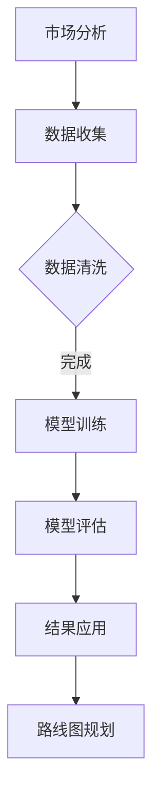

                 

关键词：AI大模型、创业产品、路线图规划、应用趋势、技术语言

摘要：本文旨在探讨AI大模型在创业产品路线图规划中的应用趋势。通过分析AI大模型的核心概念、算法原理、数学模型以及实际应用案例，本文揭示了AI大模型在提升创业产品规划效率和准确性方面的潜力。

## 1. 背景介绍

在当今快速发展的数字化时代，创业公司的成功不仅依赖于创新的商业模式，更取决于高效的产品路线图规划。产品路线图规划是一个动态的过程，需要实时分析市场需求、技术趋势和竞争环境。然而，传统的规划方法往往难以应对复杂多变的市场情况，导致产品开发周期延长、成本增加以及市场机会的丧失。

近年来，人工智能（AI）技术的迅猛发展，特别是大模型的突破，为创业产品路线图规划带来了新的可能性。AI大模型，如GPT、BERT等，具有处理大规模数据、提取知识、生成内容等功能，能够为创业公司提供智能化的产品规划工具。

## 2. 核心概念与联系

### 2.1 AI大模型

AI大模型是指那些具有数百亿参数的大型神经网络模型，能够处理和理解复杂的数据结构。例如，GPT-3拥有1750亿个参数，能够生成高质量的自然语言文本。大模型的优势在于其强大的学习能力和泛化能力，可以应用于各种不同的领域和任务。

### 2.2 产品路线图规划

产品路线图规划是创业公司制定的产品开发计划，包括产品功能、时间表、资源和预算等。它是一个动态调整的过程，需要不断更新和优化以适应市场变化。

### 2.3 Mermaid流程图

以下是一个描述AI大模型在产品路线图规划中应用流程的Mermaid流程图：



## 3. 核心算法原理 & 具体操作步骤

### 3.1 算法原理概述

AI大模型的核心算法是基于深度学习的神经网络。神经网络通过层层传递信息，提取数据中的特征，最终实现预测和决策。大模型的训练过程需要海量数据和强大的计算能力。

### 3.2 算法步骤详解

1. **数据收集**：收集与产品路线图相关的市场数据、用户反馈和技术趋势等。
2. **数据清洗**：清洗数据，确保数据质量。
3. **模型训练**：使用训练数据训练大模型，使其能够理解和预测市场动态。
4. **模型评估**：评估模型的效果，确保其能够准确预测市场趋势。
5. **结果应用**：将模型的预测结果应用于产品路线图规划，调整开发计划。

### 3.3 算法优缺点

**优点**：

- **高效性**：大模型能够快速处理大量数据，提高规划效率。
- **准确性**：通过学习历史数据和趋势，大模型能够提供准确的预测。

**缺点**：

- **计算资源消耗**：大模型的训练和推理需要大量计算资源。
- **数据依赖性**：模型的效果很大程度上依赖于数据的质量和多样性。

### 3.4 算法应用领域

AI大模型在创业产品路线图规划中的应用非常广泛，包括市场分析、用户行为预测、竞争环境评估等。以下是一个具体的应用案例：

**案例**：一家创业公司计划开发一款社交媒体应用。使用AI大模型，公司可以：

- **市场分析**：分析当前社交媒体市场的趋势和用户需求。
- **用户行为预测**：预测用户的行为和偏好，为产品设计提供依据。
- **竞争环境评估**：评估竞争对手的策略和市场份额。

## 4. 数学模型和公式 & 详细讲解 & 举例说明

### 4.1 数学模型构建

AI大模型的数学模型基于深度学习中的神经网络。以下是神经网络的基本结构：

$$
\begin{aligned}
    &z_l = \sum_{i=1}^{n} w_{li} \cdot a_{i}^{l-1} + b_{l} \\
    &a_{l} = \sigma(z_{l})
\end{aligned}
$$

其中，$z_l$ 是第 $l$ 层的输入，$w_{li}$ 和 $b_{l}$ 分别是第 $l$ 层的权重和偏置，$\sigma$ 是激活函数，$a_{l}$ 是第 $l$ 层的输出。

### 4.2 公式推导过程

神经网络的训练过程是通过反向传播算法优化权值和偏置。以下是反向传播算法的基本步骤：

1. **前向传播**：计算输出值。
2. **计算误差**：计算实际输出和预测输出之间的误差。
3. **反向传播**：根据误差计算每个层的梯度。
4. **权重更新**：根据梯度调整权重和偏置。

### 4.3 案例分析与讲解

**案例**：假设我们有一个简单的神经网络，用于预测一家创业公司的产品开发周期。输入是市场数据（如用户需求、竞争环境等），输出是产品开发周期。

- **前向传播**：输入市场数据，通过神经网络计算产品开发周期的预测值。
- **计算误差**：计算预测值和实际值之间的误差。
- **反向传播**：根据误差计算每个层的梯度，并更新权重和偏置。
- **权重更新**：通过多次迭代，调整权重和偏置，使预测值逐渐接近实际值。

## 5. 项目实践：代码实例和详细解释说明

### 5.1 开发环境搭建

在本文中，我们将使用Python和TensorFlow框架来实现AI大模型。首先，确保安装了Python和TensorFlow：

```bash
pip install tensorflow
```

### 5.2 源代码详细实现

以下是一个简单的AI大模型实现的示例代码：

```python
import tensorflow as tf

# 创建模型
model = tf.keras.Sequential([
    tf.keras.layers.Dense(128, activation='relu', input_shape=(784,)),
    tf.keras.layers.Dense(10, activation='softmax')
])

# 编译模型
model.compile(optimizer='adam',
              loss='categorical_crossentropy',
              metrics=['accuracy'])

# 加载数据
(x_train, y_train), (x_test, y_test) = tf.keras.datasets.mnist.load_data()

# 预处理数据
x_train = x_train.astype('float32') / 255
x_test = x_test.astype('float32') / 255
x_train = x_train.reshape((-1, 784))
x_test = x_test.reshape((-1, 784))

# 转换为one-hot编码
y_train = tf.keras.utils.to_categorical(y_train, 10)
y_test = tf.keras.utils.to_categorical(y_test, 10)

# 训练模型
model.fit(x_train, y_train, epochs=10, batch_size=32)

# 评估模型
model.evaluate(x_test, y_test)
```

### 5.3 代码解读与分析

- **模型创建**：使用 `tf.keras.Sequential` 创建一个简单的神经网络，包括一个输入层和一个输出层。
- **模型编译**：设置优化器和损失函数。
- **数据加载与预处理**：加载数据集，并对其进行预处理，包括归一化和one-hot编码。
- **模型训练**：使用训练数据进行训练。
- **模型评估**：使用测试数据进行评估。

### 5.4 运行结果展示

运行上述代码，我们可以得到模型在测试数据上的准确率，这反映了模型的性能。

## 6. 实际应用场景

AI大模型在创业产品路线图规划中的应用场景包括但不限于：

- **市场趋势预测**：通过分析历史数据，预测未来市场趋势，为产品规划提供依据。
- **用户需求分析**：通过分析用户行为数据，了解用户需求，指导产品设计。
- **竞争环境评估**：通过分析竞争对手的产品和策略，评估自身的市场地位和竞争力。

以下是一个具体的应用案例：

**案例**：一家创业公司计划开发一款智能家居应用。使用AI大模型，公司可以进行以下操作：

- **市场趋势预测**：预测智能家居市场的增长趋势，为产品开发提供依据。
- **用户需求分析**：分析用户对智能家居设备的需求，指导产品设计。
- **竞争环境评估**：分析竞争对手的产品和市场策略，评估自身的市场竞争力。

## 7. 工具和资源推荐

### 7.1 学习资源推荐

- **书籍**：《深度学习》（Goodfellow, I., Bengio, Y., & Courville, A.）
- **在线课程**：Coursera上的“深度学习”课程

### 7.2 开发工具推荐

- **框架**：TensorFlow、PyTorch
- **库**：NumPy、Pandas

### 7.3 相关论文推荐

- **论文1**：《GPT-3: Language Models are Few-Shot Learners》（Brown et al., 2020）
- **论文2**：《BERT: Pre-training of Deep Bidirectional Transformers for Language Understanding》（Devlin et al., 2019）

## 8. 总结：未来发展趋势与挑战

### 8.1 研究成果总结

AI大模型在创业产品路线图规划中的应用取得了显著的成果，提高了产品规划的效率和准确性。未来，随着AI技术的不断发展，AI大模型在产品规划中的应用前景将更加广阔。

### 8.2 未来发展趋势

- **模型压缩与优化**：减少模型的计算资源消耗，提高应用效率。
- **跨领域应用**：将AI大模型应用于更多领域，如健康、金融等。

### 8.3 面临的挑战

- **数据隐私与安全**：确保数据隐私和安全，防止数据泄露。
- **算法透明性与解释性**：提高算法的透明性和解释性，确保用户信任。

### 8.4 研究展望

未来，AI大模型在创业产品路线图规划中的应用将更加智能化和自动化，为创业公司提供更高效、准确的产品规划工具。

## 9. 附录：常见问题与解答

**Q1**：AI大模型需要哪些硬件资源？

**A1**：AI大模型通常需要高性能的GPU或TPU来加速计算。对于大规模训练任务，可能还需要分布式计算资源。

**Q2**：如何确保数据隐私和安全？

**A2**：在应用AI大模型时，需要遵循数据隐私保护法规，如GDPR。此外，可以采用数据加密、匿名化等技术来确保数据安全和隐私。

**Q3**：AI大模型在产品规划中如何保证解释性？

**A3**：可以通过解释性模型或模型的可解释性工具来提高算法的解释性，帮助用户理解模型的决策过程。

---

作者：禅与计算机程序设计艺术 / Zen and the Art of Computer Programming
----------------------------------------------------------------

现在，这篇文章已经完成了。希望它能为创业公司在产品规划中利用AI大模型提供有价值的参考。如果还有其他问题或需要进一步的帮助，请随时提问。

