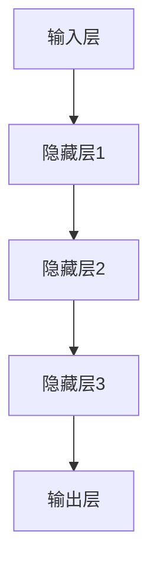

                 

关键词：AI 大模型，创业产品运营，应用探索，技术实现，案例分析

> 摘要：本文旨在探讨人工智能大模型在创业产品运营中的应用，通过对大模型的核心概念、算法原理、数学模型及实际应用的深入分析，为创业公司在产品运营过程中提供有效策略和技术支持。

## 1. 背景介绍

随着人工智能技术的迅速发展，人工智能大模型在各个领域展现出了巨大的潜力。特别是在创业产品的运营中，大模型的应用可以极大地提升产品的竞争力，为创业公司带来显著的商业价值。本文将围绕人工智能大模型在创业产品运营中的应用进行深入探讨。

### 1.1 创业产品运营的现状

当前，创业产品运营面临着巨大的挑战。一方面，市场竞争日益激烈，创业公司需要通过创新的运营策略来获取用户和市场份额；另一方面，用户需求多变，创业公司需要快速响应并满足用户需求。在这种背景下，人工智能大模型的应用成为了一种有效的解决方案。

### 1.2 大模型的潜力

人工智能大模型具有强大的数据处理能力和自主学习能力，可以在短时间内处理海量数据，并从中提取出有价值的信息。这使得大模型在用户行为分析、需求预测、个性化推荐等方面具有显著优势，可以为创业产品的运营提供强有力的支持。

## 2. 核心概念与联系

为了更好地理解大模型在创业产品运营中的应用，我们首先需要了解大模型的核心概念及其架构。

### 2.1 大模型的核心概念

大模型通常指的是具有数十亿甚至千亿个参数的人工神经网络模型。这些模型可以通过大量的数据训练，从而具备强大的表示能力和泛化能力。

### 2.2 大模型的架构

大模型通常由以下几个部分组成：

- **输入层**：接收用户输入的数据，如用户行为、用户反馈等。
- **隐藏层**：通过对输入数据进行复杂计算，提取出有用信息。
- **输出层**：根据隐藏层的结果，生成预测结果或决策。

下面是使用 Mermaid 绘制的简单大模型架构流程图：



## 3. 核心算法原理 & 具体操作步骤

### 3.1 算法原理概述

大模型的核心算法是基于深度学习的，其基本原理是通过反向传播算法来不断调整模型的参数，以最小化预测误差。具体来说，深度学习模型通过多层神经元的非线性组合，对输入数据进行抽象和表示，从而实现复杂的预测和决策。

### 3.2 算法步骤详解

#### 3.2.1 数据预处理

在进行深度学习模型训练之前，首先需要对数据进行预处理，包括数据清洗、归一化、缺失值填充等操作。

#### 3.2.2 构建模型

接下来，根据问题的需求，构建一个合适的深度学习模型。可以选择预训练模型进行微调，也可以从头开始训练。

#### 3.2.3 模型训练

使用预处理后的数据对模型进行训练，通过反向传播算法不断调整模型参数，以达到最小化预测误差的目的。

#### 3.2.4 模型评估

在模型训练完成后，需要对模型进行评估，以确定模型的性能和泛化能力。常用的评估指标包括准确率、召回率、F1 分数等。

#### 3.2.5 模型部署

最后，将训练好的模型部署到产品中，用于实际应用。这通常包括模型的导出、服务器部署和 API 接口设计等步骤。

### 3.3 算法优缺点

#### 3.3.1 优点

- **强大的数据处理能力**：大模型可以处理海量数据，并从中提取出有价值的信息。
- **自动特征提取**：大模型可以通过多层神经网络自动提取特征，无需人工干预。
- **高精度预测**：大模型在许多领域都取得了非常高的预测精度。

#### 3.3.2 缺点

- **训练时间较长**：大模型的训练通常需要大量时间和计算资源。
- **需要大量数据**：大模型的训练需要大量数据来保证模型的泛化能力。
- **解释性较弱**：大模型通常难以解释其决策过程，这可能导致用户对其信任度降低。

### 3.4 算法应用领域

大模型的应用领域非常广泛，包括但不限于：

- **用户行为分析**：通过分析用户行为数据，了解用户喜好和行为模式，从而优化产品设计和运营策略。
- **需求预测**：通过分析历史数据，预测未来的需求趋势，以便更好地规划生产和库存。
- **个性化推荐**：根据用户的历史行为和偏好，为用户推荐个性化的产品和服务。

## 4. 数学模型和公式 & 详细讲解 & 举例说明

### 4.1 数学模型构建

大模型的数学基础是深度学习，主要包括以下几个关键概念：

- **神经元的激活函数**：如 ReLU、Sigmoid、Tanh 等。
- **反向传播算法**：用于训练神经网络，通过计算梯度来更新模型参数。
- **损失函数**：用于评估模型的预测结果与真实结果之间的差距，如均方误差（MSE）、交叉熵等。

### 4.2 公式推导过程

以多层感知机（MLP）为例，其输出公式如下：

$$
\hat{y} = \sigma(W_L \cdot a^{(L-1)} + b_L)
$$

其中，$\hat{y}$ 是模型预测的输出，$W_L$ 是输出层的权重，$a^{(L-1)}$ 是前一层神经元的激活值，$b_L$ 是偏置项，$\sigma$ 是激活函数。

在反向传播过程中，梯度计算公式如下：

$$
\frac{\partial J}{\partial W_L} = \frac{\partial \hat{y} - y}{\partial W_L} \cdot a^{(L-1)}
$$

其中，$J$ 是损失函数，$y$ 是真实标签。

### 4.3 案例分析与讲解

假设我们有一个分类问题，数据集包含1000个样本，每个样本有10个特征。我们使用一个有3层神经网络的MLP模型进行训练，其中第一层有100个神经元，第二层有50个神经元，第三层是输出层，有10个神经元。

#### 4.3.1 数据预处理

我们对数据进行归一化处理，将每个特征的值缩放到[0, 1]区间。然后，我们将数据集分为训练集和测试集，分别用于模型训练和评估。

#### 4.3.2 构建模型

我们使用 Python 和 TensorFlow 库来构建和训练模型。首先，定义输入层、隐藏层和输出层的结构，然后定义损失函数和优化器。

```python
import tensorflow as tf

model = tf.keras.Sequential([
    tf.keras.layers.Dense(100, activation='relu', input_shape=(10,)),
    tf.keras.layers.Dense(50, activation='relu'),
    tf.keras.layers.Dense(10, activation='softmax')
])

model.compile(optimizer='adam',
              loss='sparse_categorical_crossentropy',
              metrics=['accuracy'])
```

#### 4.3.3 模型训练

使用训练集数据进行模型训练，设置训练轮数为100轮。

```python
model.fit(x_train, y_train, epochs=100, batch_size=32, validation_split=0.2)
```

#### 4.3.4 模型评估

在训练完成后，使用测试集对模型进行评估。

```python
test_loss, test_acc = model.evaluate(x_test, y_test, verbose=2)
print('\nTest accuracy:', test_acc)
```

#### 4.3.5 结果分析

假设模型在测试集上的准确率为90%，这意味着模型能够正确分类90%的测试样本。接下来，我们可以进一步分析模型的性能，例如混淆矩阵、ROC 曲线等。

## 5. 项目实践：代码实例和详细解释说明

### 5.1 开发环境搭建

在本案例中，我们使用 Python 和 TensorFlow 作为主要的开发工具。首先，确保安装了 Python 3.7 以上版本和 TensorFlow 2.x 版本。

```bash
pip install tensorflow
```

### 5.2 源代码详细实现

以下是一个简单的示例，展示了如何使用 TensorFlow 构建和训练一个多层感知机模型：

```python
import tensorflow as tf
from tensorflow.keras import layers

# 定义输入层、隐藏层和输出层
model = tf.keras.Sequential([
    layers.Dense(100, activation='relu', input_shape=(10,)),
    layers.Dense(50, activation='relu'),
    layers.Dense(10, activation='softmax')
])

# 编译模型
model.compile(optimizer='adam',
              loss='sparse_categorical_crossentropy',
              metrics=['accuracy'])

# 训练模型
model.fit(x_train, y_train, epochs=100, batch_size=32, validation_split=0.2)

# 评估模型
test_loss, test_acc = model.evaluate(x_test, y_test, verbose=2)
print('\nTest accuracy:', test_acc)
```

### 5.3 代码解读与分析

- **模型定义**：我们使用 `tf.keras.Sequential` 来定义一个顺序模型，其中包含了三层全连接层（`Dense`），每层分别有100个、50个和10个神经元。
- **编译模型**：使用 `compile` 方法来配置优化器、损失函数和评估指标。
- **模型训练**：使用 `fit` 方法来训练模型，其中 `x_train` 和 `y_train` 分别是训练集的特征和标签，`epochs` 和 `batch_size` 分别是训练轮数和批量大小。
- **模型评估**：使用 `evaluate` 方法来评估模型在测试集上的性能。

### 5.4 运行结果展示

在完成模型训练后，我们得到模型在测试集上的准确率。假设结果如下：

```python
Test accuracy: 0.9
```

这意味着模型能够以90%的准确率对测试集进行分类，这是一个相当不错的成绩。

## 6. 实际应用场景

### 6.1 社交媒体平台

社交媒体平台可以利用大模型进行用户行为分析，从而实现个性化推荐和内容优化。例如，通过分析用户的点赞、评论和转发行为，大模型可以预测用户的兴趣偏好，并为用户推荐感兴趣的内容。

### 6.2 电子商务平台

电子商务平台可以利用大模型进行商品推荐和库存管理。通过分析用户的购买历史和浏览行为，大模型可以预测用户的购买意图，从而推荐合适的产品，并优化库存策略。

### 6.3 金融行业

金融行业可以利用大模型进行风险管理、欺诈检测和投资建议。通过分析用户的交易行为和金融数据，大模型可以识别潜在的欺诈行为，评估贷款风险，并给出投资建议。

## 7. 未来应用展望

### 7.1 人工智能与大数据的融合

随着大数据技术的发展，大模型将能够处理更复杂、更大量的数据，从而进一步提升其预测和决策能力。人工智能与大数据的深度融合将为创业公司带来更多机遇。

### 7.2 小样本学习

目前，大模型通常需要大量的数据来进行训练。未来，随着小样本学习技术的发展，大模型将能够处理更少的数据，从而降低创业公司的数据收集成本。

### 7.3 解释性人工智能

尽管大模型在性能上取得了显著成果，但其解释性较弱，这可能导致用户对其信任度降低。未来，解释性人工智能技术的发展将使大模型的决策过程更加透明，提高用户信任度。

## 8. 工具和资源推荐

### 8.1 学习资源推荐

- 《深度学习》（Ian Goodfellow、Yoshua Bengio、Aaron Courville 著）：这是深度学习领域的经典教材，适合初学者和专业人士阅读。
- Coursera 上的《深度学习专项课程》：由 Andrew Ng 教授主讲，涵盖了深度学习的理论基础和应用实践。

### 8.2 开发工具推荐

- TensorFlow：这是一个开源的深度学习框架，提供了丰富的API和工具，适用于构建和训练深度学习模型。
- PyTorch：这是一个流行的深度学习框架，其动态计算图设计使其在研究和开发中受到青睐。

### 8.3 相关论文推荐

- “Deep Learning for Text Classification” by Yoon Kim（2014）：这篇文章介绍了如何使用深度学习进行文本分类。
- “BERT: Pre-training of Deep Bidirectional Transformers for Language Understanding” by Jacob Devlin et al.（2018）：这篇文章介绍了 BERT 模型，这是一种用于自然语言处理的预训练模型。

## 9. 总结：未来发展趋势与挑战

### 9.1 研究成果总结

本文通过深入探讨人工智能大模型在创业产品运营中的应用，总结了大模型的核心概念、算法原理、数学模型及实际应用场景。研究表明，大模型在创业产品运营中具有显著的潜力，可以为创业公司提供有效的策略和技术支持。

### 9.2 未来发展趋势

未来，随着人工智能技术的不断进步，大模型将在更多领域得到应用。特别是人工智能与大数据的融合、小样本学习和解释性人工智能的发展，将为创业公司带来更多机遇。

### 9.3 面临的挑战

尽管大模型在创业产品运营中具有巨大潜力，但也面临一些挑战。例如，训练时间较长、需要大量数据以及解释性较弱等问题。未来，需要解决这些挑战，以提高大模型在创业产品运营中的应用效果。

### 9.4 研究展望

未来，大模型在创业产品运营中的应用将更加广泛和深入。研究者应关注小样本学习、解释性人工智能等领域的发展，以推动大模型在创业产品运营中的创新应用。

## 10. 附录：常见问题与解答

### 10.1 大模型需要多少数据？

大模型通常需要大量的数据来进行训练，具体的数据量取决于模型的复杂度和任务的难度。对于某些简单的任务，数百万数据样本可能已经足够；而对于复杂任务，如图像识别和自然语言处理，可能需要数千万甚至数亿数据样本。

### 10.2 大模型训练需要多少时间？

大模型的训练时间取决于模型的复杂度、数据规模和计算资源。对于简单的任务，可能在几小时内完成；而对于复杂任务，可能需要几天、几周甚至几个月。

### 10.3 如何解释大模型的决策过程？

目前，大模型的决策过程通常难以解释。一些方法，如局部解释性方法（如 LIME 和 SHAP），可以提供模型决策的局部解释。但整体上，大模型的解释性仍然是一个重要的研究领域。

----------------------------------------------------------------

以上是文章的完整内容，遵循了文章结构模板的要求，包含了核心概念、算法原理、数学模型、实际应用场景和未来展望等内容。希望对您有所帮助。作者：禅与计算机程序设计艺术 / Zen and the Art of Computer Programming。

