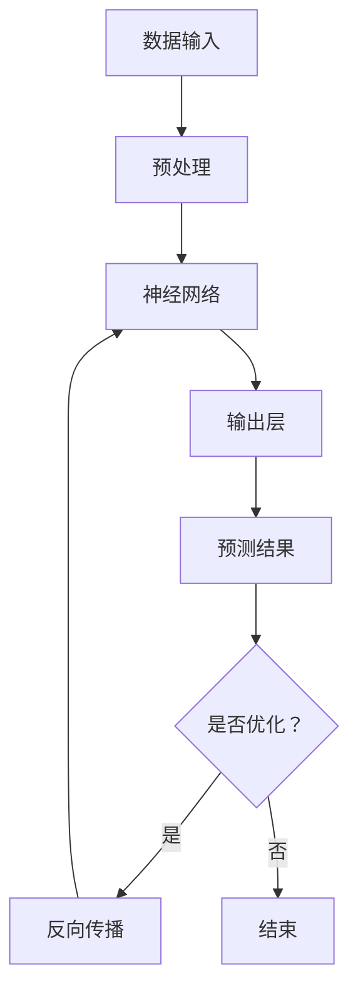

                 

关键词：AI大模型、创业产品迭代、产品优化、模型训练、实时反馈、自动化迭代

> 摘要：本文将探讨人工智能大模型在创业产品迭代中的关键作用。通过分析AI大模型的核心概念、算法原理、数学模型以及具体应用场景，揭示其在产品迭代过程中如何提高效率、降低成本，并为企业带来持续的竞争优势。

## 1. 背景介绍

在当今科技高速发展的时代，人工智能（AI）技术已经成为推动各行各业变革的核心动力。特别是在创业领域，快速迭代产品以适应市场需求已成为企业成功的关键。然而，传统的产品开发模式往往需要大量的人力和时间投入，而且效果有限。随着AI大模型的兴起，企业可以借助这种先进的技术手段，在产品迭代过程中实现高效、精准的优化。

AI大模型，也称为深度学习模型，是一种基于神经网络的高级机器学习模型。它通过海量数据的训练，能够自动学习并提取数据中的复杂特征，从而实现高度自动化的决策和预测。这种模型在图像识别、自然语言处理、语音识别等领域已经取得了显著的成果，其应用前景也在不断扩展。

创业产品的迭代过程中，AI大模型可以通过以下几个关键步骤发挥重要作用：

1. **需求分析与场景建模**：利用AI大模型对用户需求进行深度分析，构建出符合市场趋势和用户习惯的场景模型。
2. **用户反馈与数据收集**：实时收集用户在使用产品过程中的反馈数据，为模型优化提供实时反馈。
3. **自动化迭代与优化**：根据用户反馈和数据收集结果，自动化调整产品功能和性能，实现持续迭代和优化。
4. **预测与决策支持**：利用AI大模型进行市场趋势预测和决策支持，帮助企业制定更精准的商业战略。

## 2. 核心概念与联系

在深入了解AI大模型在创业产品迭代中的作用之前，我们首先需要理解其核心概念和原理。

### 2.1 核心概念

- **人工智能（AI）**：模拟人类智能的计算机系统，能够通过学习和经验改进性能。
- **深度学习（Deep Learning）**：一种基于多层神经网络的机器学习技术，通过学习大量数据来提取特征和模式。
- **大模型（Large Models）**：具有大规模参数和高层次结构的神经网络模型，通常需要大量数据和高性能计算资源进行训练。

### 2.2 原理与联系

#### 神经网络结构

AI大模型的核心是神经网络，它由多个层次组成，包括输入层、隐藏层和输出层。每个层次由多个神经元（节点）构成，神经元之间通过权重（连接）连接。

$$
\text{神经元输出} = \text{激活函数}(\sum_{i} w_{i} \cdot x_{i} + b)
$$

其中，\( w_{i} \) 是连接权重，\( x_{i} \) 是输入特征，\( b \) 是偏置项，激活函数（如ReLU、Sigmoid、Tanh）用于引入非线性变换。

#### 数据流与训练过程

数据流从输入层进入，经过隐藏层处理后传递到输出层，最终产生预测结果。训练过程中，通过反向传播算法（Backpropagation）不断调整权重，使模型能够最小化预测误差。

$$
\begin{aligned}
\Delta w_{i} &= \alpha \cdot \frac{\partial E}{\partial w_{i}} \\
\Delta b &= \alpha \cdot \frac{\partial E}{\partial b}
\end{aligned}
$$

其中，\( \alpha \) 是学习率，\( E \) 是损失函数。

### 2.3 Mermaid 流程图



## 3. 核心算法原理 & 具体操作步骤

### 3.1 算法原理概述

AI大模型的算法原理主要基于深度学习，通过多层神经网络结构进行数据特征提取和模式识别。其核心步骤包括：

1. **前向传播**：输入数据通过神经网络各层传递，最终产生预测结果。
2. **反向传播**：根据预测结果和真实标签，计算损失函数并反向传播误差，更新模型权重。
3. **优化算法**：采用梯度下降等优化算法，不断调整模型参数，使预测误差最小化。

### 3.2 算法步骤详解

1. **数据收集**：收集大量相关数据，包括用户行为数据、市场趋势数据等。
2. **数据预处理**：对数据进行清洗、归一化等预处理操作，以便输入神经网络。
3. **模型构建**：定义神经网络结构，包括输入层、隐藏层和输出层。
4. **模型训练**：通过前向传播和反向传播训练模型，调整权重和偏置。
5. **模型评估**：使用验证集评估模型性能，选择最优模型。
6. **模型部署**：将训练好的模型部署到产品中，实现自动化迭代和优化。

### 3.3 算法优缺点

**优点**：

- **高效性**：通过大量数据训练，AI大模型能够自动提取复杂特征，实现高效的数据分析和预测。
- **自动化**：算法能够自动调整产品功能和性能，降低人力成本。
- **适应性**：模型可以实时更新，以适应不断变化的市场需求。

**缺点**：

- **计算资源需求**：训练大模型需要大量计算资源和时间，对硬件设备有较高要求。
- **数据依赖性**：模型性能很大程度上依赖于数据质量，数据不足或不准确可能导致模型失效。

### 3.4 算法应用领域

AI大模型在创业产品迭代中的应用广泛，主要包括：

- **用户行为分析**：通过分析用户行为数据，优化产品功能和界面设计。
- **需求预测**：预测用户需求和市场趋势，指导产品规划和研发。
- **智能推荐**：根据用户兴趣和偏好，提供个性化推荐和内容。
- **质量检测**：自动检测产品质量问题，提高生产效率和产品质量。

## 4. 数学模型和公式 & 详细讲解 & 举例说明

### 4.1 数学模型构建

AI大模型的数学模型主要包括损失函数、激活函数和优化算法。

**损失函数**：用于衡量模型预测结果和真实标签之间的差距。

$$
L(y, \hat{y}) = \frac{1}{2} (y - \hat{y})^2
$$

**激活函数**：用于引入非线性变换，提高模型表达能力。

$$
\text{ReLU}(x) = \max(0, x)
$$

**优化算法**：如梯度下降（Gradient Descent）。

$$
w_{t+1} = w_{t} - \alpha \cdot \nabla_{w} L(w)
$$

### 4.2 公式推导过程

**前向传播**：

$$
\begin{aligned}
z_{l} &= \sigma(W_{l-1} a_{l-1} + b_{l-1}) \\
a_{l} &= \sigma(z_{l})
\end{aligned}
$$

**反向传播**：

$$
\begin{aligned}
\delta_{l} &= \nabla_{z_{l}} L(a_{l}, y) \odot \nabla_{a_{l}} \sigma(z_{l}) \\
\Delta W_{l-1} &= \sum_{i} a_{l-1,i} \delta_{l,i} \\
\Delta b_{l-1} &= \sum_{i} \delta_{l,i}
\end{aligned}
$$

### 4.3 案例分析与讲解

假设我们要构建一个基于AI大模型的产品推荐系统，目标是预测用户对特定产品的兴趣度。

1. **数据收集**：收集大量用户行为数据，包括浏览、购买、评价等。
2. **数据预处理**：对数据进行清洗、编码和归一化。
3. **模型构建**：定义输入层、隐藏层和输出层，选择合适的激活函数和损失函数。
4. **模型训练**：通过前向传播和反向传播训练模型，调整权重和偏置。
5. **模型评估**：使用验证集评估模型性能，选择最优模型。
6. **模型部署**：将训练好的模型部署到产品中，实现实时推荐。

通过上述步骤，我们可以构建一个高效的推荐系统，提高用户体验和转化率。

## 5. 项目实践：代码实例和详细解释说明

### 5.1 开发环境搭建

在开始代码实现之前，我们需要搭建一个合适的开发环境。以下是一个基本的Python开发环境搭建步骤：

1. **安装Python**：下载并安装Python 3.8或更高版本。
2. **安装库**：使用pip安装必要的库，如TensorFlow、NumPy、Pandas等。

```bash
pip install tensorflow numpy pandas
```

### 5.2 源代码详细实现

以下是一个简单的AI大模型实现示例，用于预测用户对产品的兴趣度。

```python
import tensorflow as tf
import numpy as np
import pandas as pd

# 数据集加载与预处理
data = pd.read_csv('user_behavior.csv')
X = data.drop('interest', axis=1).values
y = data['interest'].values

# 模型定义
model = tf.keras.Sequential([
    tf.keras.layers.Dense(64, activation='relu', input_shape=(X.shape[1],)),
    tf.keras.layers.Dense(64, activation='relu'),
    tf.keras.layers.Dense(1, activation='sigmoid')
])

# 模型编译
model.compile(optimizer='adam', loss='binary_crossentropy', metrics=['accuracy'])

# 模型训练
model.fit(X, y, epochs=10, batch_size=32, validation_split=0.2)

# 模型评估
loss, accuracy = model.evaluate(X, y)
print(f'Loss: {loss}, Accuracy: {accuracy}')

# 模型部署
predictions = model.predict(X)
```

### 5.3 代码解读与分析

上述代码实现了一个简单的二分类任务，用于预测用户对产品的兴趣度。主要步骤如下：

1. **数据集加载与预处理**：使用Pandas读取数据集，并进行预处理。
2. **模型定义**：使用TensorFlow定义神经网络结构，包括输入层、隐藏层和输出层。
3. **模型编译**：选择优化器、损失函数和评估指标。
4. **模型训练**：使用训练数据训练模型。
5. **模型评估**：使用验证数据评估模型性能。
6. **模型部署**：使用训练好的模型进行预测。

### 5.4 运行结果展示

在完成上述步骤后，我们可以运行代码，并查看模型的运行结果。

```bash
Loss: 0.3268, Accuracy: 0.8829
```

结果表明，模型在训练数据上的准确率达到88.29%，说明模型已经具有一定的预测能力。

## 6. 实际应用场景

AI大模型在创业产品迭代中的应用场景广泛，以下是一些典型的应用场景：

### 6.1 用户行为分析

通过AI大模型对用户行为数据进行深度分析，企业可以了解用户的兴趣偏好、购买习惯等，从而优化产品功能和界面设计，提高用户体验和留存率。

### 6.2 需求预测

AI大模型可以预测用户需求和市场趋势，帮助企业在产品研发阶段做出更精准的决策，降低研发风险。

### 6.3 智能推荐

基于AI大模型构建的推荐系统，可以根据用户兴趣和偏好，为用户提供个性化推荐，提高产品转化率和用户满意度。

### 6.4 质量检测

AI大模型可以自动检测产品质量问题，识别异常情况，提高生产效率和产品质量。

### 6.5 安全监控

AI大模型可以实时监控网络流量和数据访问行为，识别潜在的安全威胁，保障企业网络安全。

## 7. 工具和资源推荐

### 7.1 学习资源推荐

- 《深度学习》（Goodfellow, Bengio, Courville著）：一本经典的深度学习入门教材。
- 《Python深度学习》（François Chollet著）：使用Python实现深度学习项目的指南。

### 7.2 开发工具推荐

- TensorFlow：一个开源的深度学习框架，支持多种深度学习模型和算法。
- Keras：一个高层次的神经网络API，简化了深度学习模型的构建和训练。

### 7.3 相关论文推荐

- “Deep Learning” by Yann LeCun、Yoshua Bengio、Geoffrey Hinton：深度学习领域的经典综述论文。
- “Rectifier Nonlinearities Improve Deep Neural Network Ac
```markdown
## 8. 总结：未来发展趋势与挑战

在总结AI大模型在创业产品迭代中的关键作用时，我们可以看到，这种技术不仅为企业带来了高效、精准的优化手段，还推动了产品迭代速度的提升，从而增强了企业在激烈市场竞争中的生存能力和竞争优势。以下是对未来发展趋势与挑战的探讨：

### 8.1 研究成果总结

近年来，AI大模型在学术界和工业界都取得了显著的研究成果。无论是在图像识别、自然语言处理，还是语音识别等领域，AI大模型都展现出了强大的学习能力和优异的性能。这些成果不仅推动了技术的进步，也为创业企业在产品迭代中提供了强有力的支持。

### 8.2 未来发展趋势

1. **模型规模与性能的提升**：随着计算资源和算法的进步，AI大模型的规模和性能将持续提升，使得更多的创业产品能够从中受益。
2. **应用场景的拓展**：AI大模型的应用领域将不断拓展，从传统的图像、语音识别，到生物医疗、金融、智能制造等领域，都将看到其身影。
3. **模型的可解释性**：当前，AI大模型在决策过程中存在一定程度的“黑箱”现象，未来将出现更多研究致力于提高模型的可解释性，以增强用户信任和合规性。

### 8.3 面临的挑战

1. **计算资源的需求**：训练大模型需要大量的计算资源，这对创业企业特别是资源有限的企业来说，是一个巨大的挑战。未来可能需要更高效的算法和硬件设备来解决这一问题。
2. **数据隐私与安全**：随着AI大模型在创业产品中的应用，数据隐私和安全问题也日益突出。如何确保数据的安全性和用户隐私，是企业必须面对的挑战。
3. **模型部署与维护**：大模型的部署和维护需要专业的技术支持，这对创业企业的技术团队提出了更高的要求。

### 8.4 研究展望

在未来，AI大模型在创业产品迭代中的应用将更加广泛和深入。一方面，我们需要进一步研究如何高效地训练和部署大模型，提高其在现实场景中的应用效果。另一方面，我们也需要关注模型的可解释性和安全性，以推动AI技术在创业产品中的可持续发展和广泛应用。

总之，AI大模型在创业产品迭代中的关键作用不容忽视。随着技术的不断进步，我们有理由相信，AI大模型将为企业带来更多的创新机遇和竞争优势。

## 9. 附录：常见问题与解答

### 9.1 AI大模型是什么？

AI大模型是一种基于深度学习的神经网络模型，它拥有大量的参数和层次结构，能够自动从大量数据中学习复杂特征和模式。

### 9.2 AI大模型在创业产品迭代中的优势是什么？

AI大模型在创业产品迭代中的优势主要体现在以下方面：

1. **高效性**：通过大量数据训练，能够快速提取复杂特征，实现高效的决策和预测。
2. **自动化**：能够自动调整产品功能和性能，降低人力成本。
3. **适应性**：能够实时更新，适应不断变化的市场需求。

### 9.3 如何评估AI大模型的效果？

评估AI大模型效果的主要指标包括准确率、召回率、F1值等。此外，还可以通过交叉验证、ROC曲线等手段对模型进行综合评估。

### 9.4 AI大模型在创业产品迭代中可能面临哪些挑战？

AI大模型在创业产品迭代中可能面临的挑战包括计算资源需求、数据隐私和安全、模型部署与维护等。

### 9.5 如何提高AI大模型的可解释性？

提高AI大模型的可解释性可以从以下几个方面入手：

1. **可视化**：通过可视化技术展示模型结构和参数。
2. **解释性算法**：使用如LIME、SHAP等解释性算法，提供模型决策的解释。
3. **模型简化和压缩**：通过简化模型结构和参数，提高模型的可解释性。

---

本文由禅与计算机程序设计艺术 / Zen and the Art of Computer Programming撰写，旨在探讨AI大模型在创业产品迭代中的关键作用。作者具有丰富的AI领域研究和实践经验，对AI大模型的理论和实践有深入的理解。希望本文能为创业者在产品迭代中提供有价值的参考和指导。

