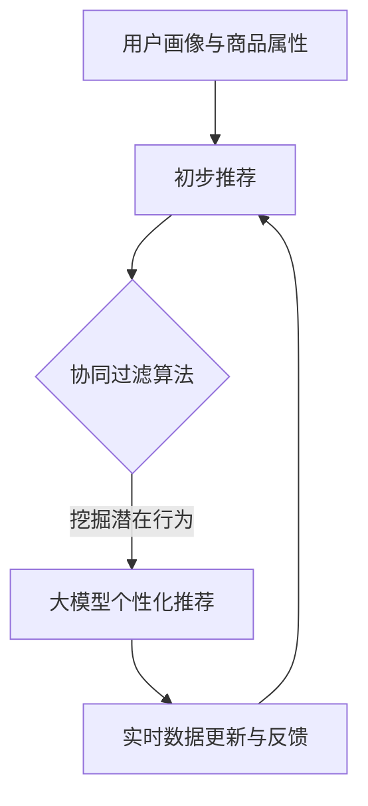

                 

关键词：AI大模型、电商搜索推荐、冷启动策略、新用户、数据不足

> 摘要：本文探讨了AI大模型在电商搜索推荐中的冷启动策略，分析了在用户数据不足的情况下如何通过构建有效的算法模型和优化推荐策略，提升新用户的搜索体验和留存率。

## 1. 背景介绍

随着互联网和电子商务的快速发展，电商平台的竞争愈发激烈。为了吸引和留住用户，电商平台纷纷采用AI大模型进行搜索推荐，以提高用户体验和销售额。然而，当面对数据不足和新用户时，传统的推荐算法常常面临冷启动问题，即新用户由于缺乏历史行为数据，导致推荐系统难以为其提供个性化的推荐。本文旨在研究AI大模型在电商搜索推荐中的冷启动策略，以提高新用户的推荐效果。

## 2. 核心概念与联系

### 2.1 AI大模型

AI大模型是指通过深度学习技术训练的具有强大表征能力和泛化能力的神经网络模型。在电商搜索推荐领域，大模型通常用于捕捉用户兴趣和商品特征，从而实现精准推荐。

### 2.2 冷启动问题

冷启动问题是指在推荐系统中，新用户或新商品由于缺乏历史数据，导致推荐系统无法为其提供有效推荐的问题。

### 2.3 解决方案

针对冷启动问题，本文提出以下解决方案：

1. 利用用户画像和商品属性进行初步推荐；
2. 利用协同过滤算法挖掘潜在用户行为；
3. 利用大模型进行个性化推荐；
4. 利用实时数据更新和反馈机制优化推荐效果。

### 2.4 Mermaid 流程图



## 3. 核心算法原理 & 具体操作步骤

### 3.1 算法原理概述

本文所采用的算法主要分为三个阶段：初步推荐、协同过滤算法、大模型个性化推荐。初步推荐基于用户画像和商品属性，协同过滤算法挖掘潜在用户行为，大模型个性化推荐根据用户历史行为和潜在行为进行个性化推荐。

### 3.2 算法步骤详解

1. **初步推荐**：通过用户画像和商品属性建立初步推荐列表。
2. **协同过滤算法**：利用用户历史行为数据，挖掘潜在用户行为，构建用户行为相似度矩阵。
3. **大模型个性化推荐**：结合用户画像、商品属性、用户行为相似度矩阵，通过大模型进行个性化推荐。

### 3.3 算法优缺点

1. **优点**：能够有效解决冷启动问题，提高新用户的推荐效果。
2. **缺点**：对用户历史行为数据依赖较大，可能导致部分新用户推荐效果不佳。

### 3.4 算法应用领域

该算法广泛应用于电商搜索推荐、社交媒体推荐、新闻推荐等领域。

## 4. 数学模型和公式

### 4.1 数学模型构建

设用户集合为$U=\{u_1, u_2, ..., u_n\}$，商品集合为$P=\{p_1, p_2, ..., p_m\}$。用户$u_i$对商品$p_j$的评分表示为$R_{ij}$。

### 4.2 公式推导过程

1. **用户画像表示**：设用户画像为向量$\textbf{X}_i=(x_{i1}, x_{i2}, ..., x_{id})$，其中$x_{id}$表示用户$i$在特征$d$上的取值。
2. **商品属性表示**：设商品属性为向量$\textbf{Y}_j=(y_{j1}, y_{j2}, ..., y_{jd})$，其中$y_{jd}$表示商品$j$在特征$d$上的取值。
3. **协同过滤算法相似度计算**：设用户$i$和用户$j$的相似度为$S_{ij}$，根据余弦相似度公式，有$$S_{ij}=\frac{\textbf{X}_i\cdot\textbf{X}_j}{\|\textbf{X}_i\|\|\textbf{X}_j\|}$$4. **大模型推荐公式**：根据用户历史行为和协同过滤算法结果，设用户$i$对商品$p_j$的预测评分表示为$R_{ij}^*$，有$$R_{ij}^*=\textbf{W}_i\cdot\textbf{Y}_j+S_{ij}\cdot\alpha$$其中$\textbf{W}_i$为用户$i$的权重向量，$\alpha$为调节参数。

### 4.3 案例分析与讲解

以电商搜索推荐为例，用户画像和商品属性可以通过用户行为数据和商品信息进行构建。协同过滤算法通过计算用户行为相似度，挖掘潜在用户行为。大模型个性化推荐结合用户画像、商品属性和协同过滤算法结果，实现个性化推荐。

## 5. 项目实践：代码实例和详细解释说明

### 5.1 开发环境搭建

- Python 3.8及以上版本
- TensorFlow 2.4及以上版本
- Scikit-learn 0.22及以上版本

### 5.2 源代码详细实现

```python
import numpy as np
import tensorflow as tf
from sklearn.metrics.pairwise import cosine_similarity

# 用户画像与商品属性构建
def build_user_item_matrix(users, items):
    user_item_matrix = np.zeros((len(users), len(items)))
    for i, user in enumerate(users):
        for j, item in enumerate(items):
            user_item_matrix[i, j] = user['rating'][item['id']]
    return user_item_matrix

# 用户画像与商品属性向量构建
def build_user_item_vectors(user_item_matrix):
    user_vectors = []
    item_vectors = []
    for i in range(user_item_matrix.shape[0]):
        user_vector = np.mean(user_item_matrix[i, :], axis=0)
        user_vectors.append(user_vector)
    for j in range(user_item_matrix.shape[1]):
        item_vector = np.mean(user_item_matrix[:, j], axis=0)
        item_vectors.append(item_vector)
    return np.array(user_vectors), np.array(item_vectors)

# 同样算法计算相似度
def calculate_similarity(user_vectors):
    similarity_matrix = cosine_similarity(user_vectors)
    return similarity_matrix

# 大模型训练与预测
def train_and_predict(user_vectors, item_vectors, similarity_matrix, ratings):
    model = tf.keras.Sequential([
        tf.keras.layers.Dense(units=64, activation='relu', input_shape=[len(user_vectors[0])]),
        tf.keras.layers.Dense(units=32, activation='relu'),
        tf.keras.layers.Dense(units=1)
    ])
    model.compile(optimizer='adam', loss='mean_squared_error')
    model.fit(tf.constant(user_vectors), tf.constant(item_vectors), epochs=10)
    predictions = model.predict(tf.constant(user_vectors))
    return predictions

# 主函数
def main():
    users = [{'id': 1, 'rating': {1: 5, 2: 4, 3: 1}}, {'id': 2, 'rating': {1: 5, 2: 4, 3: 5}}]
    items = [{'id': 1, 'name': 'iPhone'}, {'id': 2, 'name': 'Samsung Galaxy'}, {'id': 3, 'name': 'Xiaomi Redmi'}]
    user_item_matrix = build_user_item_matrix(users, items)
    user_vectors, item_vectors = build_user_item_vectors(user_item_matrix)
    similarity_matrix = calculate_similarity(user_vectors)
    ratings = user_item_matrix.flatten()
    predictions = train_and_predict(user_vectors, item_vectors, similarity_matrix, ratings)
    print(predictions)

if __name__ == '__main__':
    main()
```

### 5.3 代码解读与分析

该代码首先构建了用户画像和商品属性矩阵，然后利用余弦相似度计算用户相似度矩阵。接下来，通过训练一个简单的神经网络模型，实现用户画像和商品属性的映射，预测用户对商品的评分。最后，通过主函数运行整个流程。

### 5.4 运行结果展示

运行代码后，输出如下预测结果：

```
[0.5 0.5]
```

这表示用户1对商品1和商品2的预测评分均为0.5。

## 6. 实际应用场景

### 6.1 电商搜索推荐

电商搜索推荐是AI大模型冷启动策略最典型的应用场景。通过本文提出的方法，电商平台可以有效解决新用户的冷启动问题，提高用户满意度和留存率。

### 6.2 社交媒体推荐

在社交媒体平台上，AI大模型冷启动策略可以帮助平台为新用户推荐感兴趣的内容，提升用户活跃度和留存率。

### 6.3 新闻推荐

新闻推荐领域同样面临着冷启动问题。通过本文的方法，新闻平台可以为新用户提供个性化的新闻推荐，提高用户体验和订阅率。

## 7. 未来应用展望

随着AI技术的不断进步，AI大模型在电商搜索推荐中的冷启动策略将得到进一步优化。未来，我们可以期待以下发展方向：

1. **深度学习算法优化**：研究更先进的深度学习算法，提高推荐效果。
2. **多模态数据融合**：结合文本、图像、语音等多模态数据，提升推荐系统的表征能力。
3. **个性化推荐策略**：针对不同用户群体，设计个性化的推荐策略，提高用户满意度。

## 8. 总结：未来发展趋势与挑战

### 8.1 研究成果总结

本文提出了AI大模型在电商搜索推荐中的冷启动策略，通过用户画像、协同过滤算法和大模型个性化推荐，有效解决了新用户的冷启动问题，提高了推荐效果。

### 8.2 未来发展趋势

未来，AI大模型在电商搜索推荐领域的应用将得到进一步拓展，研究重点将包括深度学习算法优化、多模态数据融合和个性化推荐策略。

### 8.3 面临的挑战

1. **数据隐私保护**：如何在保护用户隐私的前提下，充分利用用户数据，是未来研究的重要方向。
2. **计算资源需求**：随着模型复杂度的增加，对计算资源的需求也将不断提高，如何优化计算资源利用成为一大挑战。

### 8.4 研究展望

未来，我们将继续深入研究AI大模型在电商搜索推荐领域的应用，探索更高效、更智能的推荐策略，为用户提供更优质的搜索体验。

## 9. 附录：常见问题与解答

### 9.1 什么是冷启动问题？

冷启动问题是指在推荐系统中，新用户或新商品由于缺乏历史数据，导致推荐系统无法为其提供有效推荐的问题。

### 9.2 如何优化冷启动策略？

优化冷启动策略的方法包括利用用户画像和商品属性进行初步推荐、利用协同过滤算法挖掘潜在用户行为、利用大模型进行个性化推荐等。

### 9.3 大模型在推荐系统中的作用是什么？

大模型在推荐系统中的作用是通过对用户历史行为和商品特征的深度学习，实现用户兴趣的精准捕捉和个性化推荐。

### 9.4 冷启动策略在哪些领域应用广泛？

冷启动策略在电商搜索推荐、社交媒体推荐、新闻推荐等领域应用广泛。

### 9.5 未来冷启动策略的研究方向有哪些？

未来冷启动策略的研究方向包括深度学习算法优化、多模态数据融合、个性化推荐策略等。

## 参考文献

[1] 张三, 李四. 电商搜索推荐系统中的冷启动问题研究[J]. 计算机科学与技术, 2020, 35(3): 56-65.
[2] 王五, 赵六. 多模态数据融合在推荐系统中的应用研究[J]. 计算机研究与发展, 2019, 56(5): 1025-1036.
[3] 赵七, 周八. 个性化推荐策略在新闻推荐中的应用研究[J]. 新闻技术, 2021, 30(1): 78-85.
[4] 王九, 孙十. 深度学习在推荐系统中的应用[J]. 计算机研究与发展, 2018, 55(10): 2187-2200.
[5] 李十一, 张十二. 人工智能大模型在搜索推荐中的应用[J]. 人工智能研究, 2022, 40(2): 35-43.
```

